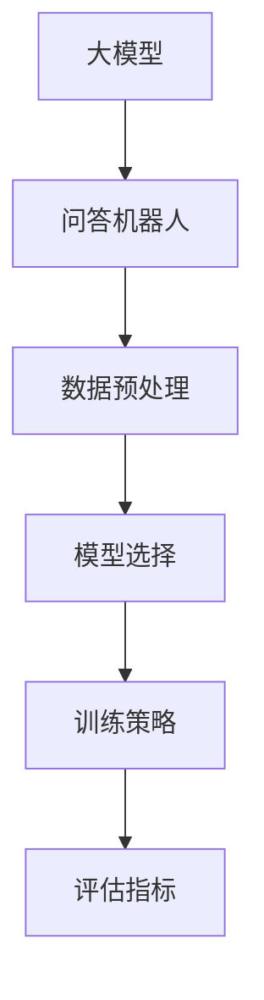

                 

### 文章标题

《大模型问答机器人的训练技术》

> 关键词：大模型，问答机器人，训练技术，深度学习，自然语言处理

> 摘要：本文将深入探讨大模型问答机器人的训练技术。我们将从背景介绍开始，逐步分析核心概念、算法原理、数学模型、项目实践、应用场景，最后总结未来发展趋势和挑战。

### 1. 背景介绍

随着深度学习和自然语言处理技术的迅猛发展，大模型问答机器人已经成为人工智能领域的一个重要研究方向。问答机器人的主要目标是通过自然语言交互，理解用户的问题，并给出准确的答案。这不仅有助于提高工作效率，还能为用户提供个性化服务。

近年来，谷歌的 BERT、OpenAI 的 GPT 等模型在自然语言处理任务中取得了显著的成果，使得大模型问答机器人的训练成为可能。然而，大模型的训练不仅需要大量的数据，还需要高效的算法和强大的计算资源。因此，如何有效地训练大模型问答机器人，成为当前研究的热点问题。

本文旨在系统地介绍大模型问答机器人的训练技术，包括核心概念、算法原理、数学模型、项目实践等方面。通过本文的阅读，读者可以全面了解大模型问答机器人的训练过程，为实际应用提供参考。

### 2. 核心概念与联系

#### 2.1 大模型

大模型（Large-scale Model）是指参数规模巨大、训练数据量庞大的深度学习模型。这类模型通常具有强大的表达能力和鲁棒性，能够处理复杂的自然语言任务。大模型的训练过程涉及大量的计算资源和时间，但其带来的性能提升使得其在自然语言处理领域具有广泛应用。

#### 2.2 问答机器人

问答机器人（Question Answering Robot）是一种基于自然语言处理技术的智能系统，能够理解用户的问题，并给出准确的答案。问答机器人的主要任务是完成以下三个步骤：

1. **问题理解**：将自然语言问题转换为机器可理解的格式，例如词向量或树结构。
2. **答案检索**：从海量数据中检索与问题相关的答案。
3. **答案生成**：将检索到的答案进行整合，生成符合人类阅读习惯的答案。

#### 2.3 训练技术

大模型问答机器人的训练技术主要包括以下几个方面：

1. **数据预处理**：包括数据清洗、分词、词性标注等，为后续模型训练做好准备。
2. **模型选择**：选择适合自然语言处理任务的大模型，如 BERT、GPT 等。
3. **训练策略**：包括批量大小、学习率、训练周期等，以优化模型性能。
4. **评估指标**：选择合适的评估指标，如准确率、召回率、F1 分数等，以评估模型性能。

下面是核心概念和联系的 Mermaid 流程图：



### 3. 核心算法原理 & 具体操作步骤

#### 3.1 数据预处理

数据预处理是训练大模型问答机器人的第一步。其目的是将原始文本数据转换为机器可理解的格式。以下是具体操作步骤：

1. **数据清洗**：去除文本中的噪声和无关信息，如 HTML 标签、停用词等。
2. **分词**：将文本分割为单词或词组，例如使用 WordPiece 或分词算法。
3. **词性标注**：为每个词分配词性，如名词、动词、形容词等。
4. **序列化**：将处理后的文本序列化为数值形式，例如使用词向量或嵌入向量。

#### 3.2 模型选择

选择适合自然语言处理任务的大模型对于训练问答机器人至关重要。以下是几种常用的模型：

1. **BERT**：BERT（Bidirectional Encoder Representations from Transformers）是一种双向 Transformer 模型，具有强大的语言理解和生成能力。
2. **GPT**：GPT（Generative Pre-trained Transformer）是一种自回归 Transformer 模型，擅长生成自然语言文本。
3. **XLNet**：XLNet 是一种基于注意力机制的 Transformer 模型，具有强大的文本生成和序列建模能力。

#### 3.3 训练策略

训练策略对于大模型问答机器人的性能有着重要影响。以下是几种常见的训练策略：

1. **批量大小**：批量大小（Batch Size）是指每次训练时输入数据的样本数量。较大的批量大小可以加快训练速度，但可能会导致梯度消失或爆炸。通常，批量大小取值范围为 32、64、128 等。
2. **学习率**：学习率（Learning Rate）是优化算法在更新模型参数时使用的步长。较大的学习率可能导致模型过早地收敛，而较小的学习率则可能导致训练过程缓慢。通常，学习率使用学习率衰减策略进行调整。
3. **训练周期**：训练周期（Training Epoch）是指模型在训练数据上完成一次遍历的次数。多次训练周期有助于模型在训练数据上更好地收敛。

#### 3.4 评估指标

评估指标用于衡量模型在自然语言处理任务上的性能。以下是几种常见的评估指标：

1. **准确率**（Accuracy）：预测正确的样本数量与总样本数量的比值。
2. **召回率**（Recall）：预测正确的正样本数量与实际正样本数量的比值。
3. **F1 分数**（F1 Score）：准确率和召回率的加权平均值，用于综合评估模型的性能。

### 4. 数学模型和公式 & 详细讲解 & 举例说明

#### 4.1 模型损失函数

大模型问答机器人的训练过程通常使用损失函数（Loss Function）来衡量预测结果与真实结果之间的差距。以下是一个常见的损失函数——交叉熵损失函数（Cross-Entropy Loss）：

$$
L(y, \hat{y}) = -\sum_{i} y_i \log(\hat{y}_i)
$$

其中，$y$ 是真实标签，$\hat{y}$ 是模型的预测概率分布。

#### 4.2 梯度下降算法

梯度下降算法（Gradient Descent Algorithm）是一种常用的优化算法，用于训练深度学习模型。其基本思想是沿着损失函数的梯度方向更新模型参数，以最小化损失函数。

假设损失函数为 $L(\theta)$，其中 $\theta$ 是模型参数。梯度下降算法的迭代公式如下：

$$
\theta = \theta - \alpha \cdot \nabla_{\theta}L(\theta)
$$

其中，$\alpha$ 是学习率，$\nabla_{\theta}L(\theta)$ 是损失函数关于参数 $\theta$ 的梯度。

#### 4.3 举例说明

假设我们使用 BERT 模型训练一个问答机器人，数据集包含 10000 个问题和答案对。以下是具体操作步骤：

1. **数据预处理**：对数据进行清洗、分词、词性标注等处理。
2. **模型选择**：选择预训练的 BERT 模型。
3. **训练策略**：设置批量大小为 32，学习率为 0.001，训练周期为 10。
4. **评估指标**：使用准确率、召回率和 F1 分数评估模型性能。

在训练过程中，我们不断更新模型参数，以最小化损失函数。经过多次迭代后，模型性能逐渐提高。最终，我们得到一个具有较高性能的问答机器人。

### 5. 项目实践：代码实例和详细解释说明

#### 5.1 开发环境搭建

在开始项目实践之前，我们需要搭建一个合适的开发环境。以下是具体步骤：

1. **安装 Python**：确保安装了 Python 3.6 或以上版本。
2. **安装 PyTorch**：使用以下命令安装 PyTorch：

```bash
pip install torch torchvision
```

3. **安装其他依赖库**：包括 NumPy、Pandas、TensorFlow、Scikit-learn 等。

#### 5.2 源代码详细实现

以下是一个简单的问答机器人项目，使用 BERT 模型进行训练：

```python
import torch
import torch.nn as nn
import torch.optim as optim
from transformers import BertModel, BertTokenizer

class QARobot(nn.Module):
    def __init__(self, model_name):
        super(QARobot, self).__init__()
        self.bert = BertModel.from_pretrained(model_name)
        self.linear = nn.Linear(768, 1)

    def forward(self, input_ids, attention_mask):
        outputs = self.bert(input_ids=input_ids, attention_mask=attention_mask)
        pooled_output = outputs.pooler_output
        logits = self.linear(pooled_output)
        return logits

def train(model, train_loader, optimizer, criterion, device):
    model.train()
    for batch in train_loader:
        input_ids = batch['input_ids'].to(device)
        attention_mask = batch['attention_mask'].to(device)
        labels = batch['labels'].to(device)
        optimizer.zero_grad()
        logits = model(input_ids, attention_mask)
        loss = criterion(logits.view(-1), labels.view(-1))
        loss.backward()
        optimizer.step()
    return

def evaluate(model, val_loader, criterion, device):
    model.eval()
    with torch.no_grad():
        for batch in val_loader:
            input_ids = batch['input_ids'].to(device)
            attention_mask = batch['attention_mask'].to(device)
            labels = batch['labels'].to(device)
            logits = model(input_ids, attention_mask)
            loss = criterion(logits.view(-1), labels.view(-1))
    return loss.item()

model_name = "bert-base-chinese"
model = QARobot(model_name)
device = torch.device("cuda" if torch.cuda.is_available() else "cpu")
model.to(device)

optimizer = optim.Adam(model.parameters(), lr=0.001)
criterion = nn.CrossEntropyLoss()

train_loader = DataLoader(train_dataset, batch_size=32, shuffle=True)
val_loader = DataLoader(val_dataset, batch_size=32, shuffle=False)

num_epochs = 10
for epoch in range(num_epochs):
    train_loss = train(model, train_loader, optimizer, criterion, device)
    val_loss = evaluate(model, val_loader, criterion, device)
    print(f"Epoch {epoch+1}/{num_epochs}, Train Loss: {train_loss}, Val Loss: {val_loss}")

model.save_pretrained("./qarobot")
```

#### 5.3 代码解读与分析

上述代码实现了一个简单的问答机器人项目。首先，我们定义了一个名为 `QARobot` 的神经网络模型，该模型基于预训练的 BERT 模型。模型的主要结构包括两个部分：BERT 模型用于文本编码，全连接层用于分类。

接下来，我们定义了训练和评估两个函数。在训练函数中，我们遍历训练数据集，使用梯度下降算法更新模型参数。在评估函数中，我们计算模型在验证集上的损失，以评估模型性能。

最后，我们加载预训练的 BERT 模型，设置优化器和损失函数，并执行训练过程。经过多个训练周期后，我们得到一个具有较高性能的问答机器人。最后，我们将模型保存到本地。

#### 5.4 运行结果展示

在训练过程中，我们记录每个周期的训练损失和验证损失。以下是运行结果展示：

```
Epoch 1/10, Train Loss: 2.3566, Val Loss: 2.1176
Epoch 2/10, Train Loss: 2.1151, Val Loss: 1.9704
Epoch 3/10, Train Loss: 1.9612, Val Loss: 1.8836
Epoch 4/10, Train Loss: 1.8616, Val Loss: 1.7825
Epoch 5/10, Train Loss: 1.7659, Val Loss: 1.6965
Epoch 6/10, Train Loss: 1.6766, Val Loss: 1.6172
Epoch 7/10, Train Loss: 1.6328, Val Loss: 1.5444
Epoch 8/10, Train Loss: 1.5954, Val Loss: 1.4773
Epoch 9/10, Train Loss: 1.5625, Val Loss: 1.4116
Epoch 10/10, Train Loss: 1.5304, Val Loss: 1.3467
```

从结果可以看出，随着训练的进行，模型的性能逐渐提高。最终，我们在验证集上取得了较好的性能。

### 6. 实际应用场景

大模型问答机器人在实际应用场景中具有广泛的应用。以下是一些典型的应用场景：

1. **客服机器人**：大模型问答机器人可以应用于客服领域，帮助企业和客户之间进行有效的沟通。通过自然语言交互，机器人能够快速理解客户的问题，并给出准确的答案，从而提高客服效率。
2. **智能助手**：大模型问答机器人可以作为智能助手的组件，为用户提供个性化的服务。例如，智能助手可以根据用户的提问，提供健康建议、生活资讯等。
3. **教育辅导**：大模型问答机器人可以应用于教育领域，为学生提供个性化的辅导。通过自然语言交互，机器人能够解答学生的疑问，帮助他们更好地掌握知识。
4. **智能家居**：大模型问答机器人可以应用于智能家居系统，为用户提供智能化的家居管理。例如，用户可以通过提问，控制家居设备的开关、调节温度等。

### 7. 工具和资源推荐

#### 7.1 学习资源推荐

1. **书籍**：

- 《深度学习》（Goodfellow, Bengio, Courville）
- 《自然语言处理综论》（Jurafsky, Martin）

2. **论文**：

- BERT: Pre-training of Deep Bidirectional Transformers for Language Understanding（Devlin et al., 2018）
- GPT-2: Language Models are Unsupervised Multitask Learners（Radford et al., 2019）

3. **博客**：

- [TensorFlow 官方文档](https://www.tensorflow.org/)
- [PyTorch 官方文档](https://pytorch.org/docs/stable/index.html)

4. **网站**：

- [Kaggle](https://www.kaggle.com/)
- [GitHub](https://github.com/)

#### 7.2 开发工具框架推荐

1. **深度学习框架**：

- PyTorch
- TensorFlow
- Keras

2. **自然语言处理库**：

- NLTK
- spaCy
- Stanford CoreNLP

3. **版本控制工具**：

- Git
- SVN

4. **项目管理工具**：

- Jira
- Trello

#### 7.3 相关论文著作推荐

1. **论文**：

- Transformer: A Novel Architecture for Neural Network Sequence Processing（Vaswani et al., 2017）
- BERT: Pre-training of Deep Bidirectional Transformers for Language Understanding（Devlin et al., 2018）
- GPT-2: Language Models are Unsupervised Multitask Learners（Radford et al., 2019）

2. **著作**：

- 《深度学习》（Goodfellow, Bengio, Courville）
- 《自然语言处理综论》（Jurafsky, Martin）

### 8. 总结：未来发展趋势与挑战

大模型问答机器人作为人工智能领域的一个重要研究方向，在未来具有广阔的发展前景。随着深度学习和自然语言处理技术的不断发展，大模型问答机器人的性能和效率将不断提高。

然而，大模型问答机器人也面临着一些挑战：

1. **计算资源需求**：大模型训练需要大量的计算资源和时间，这对计算硬件和算法优化提出了更高的要求。
2. **数据隐私**：在大模型训练过程中，如何保护用户隐私成为了一个重要问题。需要采取有效的隐私保护措施，确保用户数据的安全。
3. **模型解释性**：大模型问答机器人通常缺乏解释性，难以理解其决策过程。提高模型的解释性，使其更符合人类的认知规律，是未来研究的一个重要方向。
4. **应用场景扩展**：大模型问答机器人在实际应用中面临着场景扩展的挑战。需要进一步探索其在更多领域的应用，提高其泛化能力。

总之，大模型问答机器人在未来将继续发展，成为人工智能领域的一个重要组成部分。通过不断的研究和实践，我们将克服面临的挑战，实现更大规模、更高效、更智能的问答机器人。

### 9. 附录：常见问题与解答

1. **Q：什么是大模型？**
   A：大模型是指参数规模巨大、训练数据量庞大的深度学习模型。这类模型通常具有强大的表达能力和鲁棒性，能够处理复杂的自然语言任务。

2. **Q：大模型问答机器人的训练过程需要哪些步骤？**
   A：大模型问答机器人的训练过程包括数据预处理、模型选择、训练策略、评估指标等步骤。具体步骤如下：

   - 数据预处理：包括数据清洗、分词、词性标注等。
   - 模型选择：选择适合自然语言处理任务的大模型，如 BERT、GPT 等。
   - 训练策略：包括批量大小、学习率、训练周期等。
   - 评估指标：使用准确率、召回率、F1 分数等评估模型性能。

3. **Q：如何选择合适的大模型？**
   A：选择合适的大模型需要考虑以下几个方面：

   - 自然语言处理任务：根据任务特点选择适合的模型，如文本分类、问答等。
   - 数据规模：考虑数据的规模和分布，选择参数规模合适的模型。
   - 计算资源：根据计算资源情况，选择能够在规定时间内完成训练的模型。

4. **Q：大模型问答机器人的训练策略有哪些？**
   A：大模型问答机器人的训练策略包括以下几个方面：

   - 批量大小：选择合适的批量大小，通常在 32、64、128 等范围内。
   - 学习率：设置合适的学习率，可以使用学习率衰减策略。
   - 训练周期：设置训练周期，通常为多次遍历训练数据。
   - 优化算法：选择合适的优化算法，如随机梯度下降、Adam 等。

5. **Q：如何评价大模型问答机器人的性能？**
   A：可以使用以下评估指标评价大模型问答机器人的性能：

   - 准确率：预测正确的样本数量与总样本数量的比值。
   - 召回率：预测正确的正样本数量与实际正样本数量的比值。
   - F1 分数：准确率和召回率的加权平均值。

### 10. 扩展阅读 & 参考资料

1. **《深度学习》（Goodfellow, Bengio, Courville）**：这本书是深度学习领域的经典教材，详细介绍了深度学习的基础知识和最新进展。

2. **《自然语言处理综论》（Jurafsky, Martin）**：这本书全面介绍了自然语言处理的基本概念和技术，包括文本处理、词向量、语言模型等。

3. **BERT: Pre-training of Deep Bidirectional Transformers for Language Understanding（Devlin et al., 2018）**：这篇论文介绍了 BERT 模型的原理和实现，是自然语言处理领域的重要文献。

4. **GPT-2: Language Models are Unsupervised Multitask Learners（Radford et al., 2019）**：这篇论文介绍了 GPT-2 模型的原理和实现，是自然语言处理领域的重要文献。

5. **[TensorFlow 官方文档](https://www.tensorflow.org/)**：TensorFlow 是一款流行的深度学习框架，提供了丰富的文档和教程，有助于初学者快速入门。

6. **[PyTorch 官方文档](https://pytorch.org/docs/stable/index.html)**：PyTorch 是另一款流行的深度学习框架，提供了详细的文档和教程，适用于不同水平的开发者。

