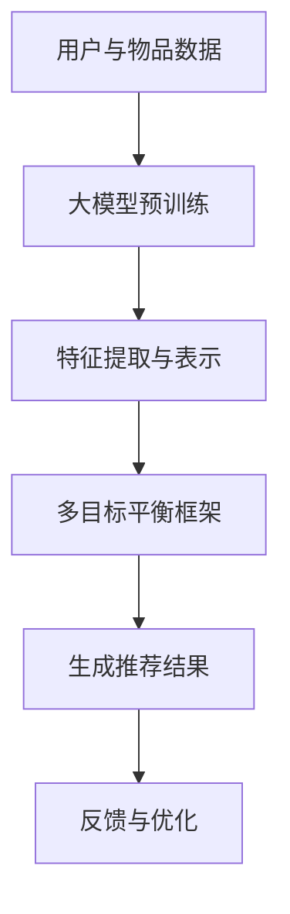

                 

### 背景介绍 Background Introduction

推荐系统作为现代信息社会中的一项关键技术，其发展已经历了数十年的演变。随着互联网和移动互联网的普及，数据规模呈指数级增长，用户行为数据、内容数据、社交网络数据等海量信息使得推荐系统面临着前所未有的挑战和机遇。

### 推荐系统的发展历史

推荐系统起源于20世纪90年代的电子商务领域，最初主要采用基于内容的推荐方法（Content-Based Filtering, CBF）和协同过滤方法（Collaborative Filtering, CF）。CBF通过分析用户过去的行为和兴趣，将相似的内容推荐给用户。这种方法在个性化推荐方面取得了较好的效果，但其局限性在于推荐结果的多样性和新颖性较差。

协同过滤方法通过分析用户之间的相似度来推荐物品。基于用户评分的协同过滤（User-Based CF）是最常见的方法之一，它通过计算用户之间的相似度来找到相似用户并推荐他们的评分高的物品。然而，CF方法容易受到冷启动问题的影响，即对新用户和新物品缺乏足够的数据支持，导致推荐效果不佳。

随着人工智能技术的发展，尤其是深度学习的兴起，推荐系统开始走向多模型融合的方向。深度学习方法能够更好地捕捉用户行为和物品属性之间的复杂关系，提高了推荐系统的性能和效果。

### 当前推荐系统的挑战

尽管推荐系统在技术上取得了显著的进展，但仍然面临着以下几个关键挑战：

1. **数据质量和多样性**：用户行为数据的质量直接影响到推荐系统的效果。噪声数据和缺失数据会导致推荐结果的不准确。此外，用户需求的多样性和复杂性也要求推荐系统能够提供多样化的推荐结果。

2. **实时性和扩展性**：随着用户数量的增加和数据规模的扩大，推荐系统需要具备高效的实时处理能力和良好的扩展性。传统推荐系统往往在处理大量数据时效率较低，难以满足实时推荐的需求。

3. **平衡多个目标**：推荐系统需要平衡多个目标，如用户满意度、业务指标和公平性。单一目标的优化可能会导致其他目标的损失，如何实现多目标平衡是一个重要的研究课题。

4. **隐私保护**：用户隐私保护是推荐系统面临的一个重要挑战。在推荐系统设计中，如何确保用户数据的隐私安全是一个亟待解决的问题。

### 本文目标

本文旨在介绍一种大模型驱动的推荐系统多目标平衡框架，通过整合深度学习技术和多目标优化算法，实现推荐系统的性能提升和目标平衡。本文将首先介绍核心概念和原理，然后详细阐述算法的具体实现步骤，最后通过实际项目案例进行分析和验证。

### 核心概念与联系 Core Concepts and Connections

#### 大模型驱动推荐系统的概念

大模型驱动推荐系统是指利用大规模预训练模型（如BERT、GPT等）作为基础模型，结合用户和物品的属性信息，生成个性化的推荐结果。这种方法能够更好地捕捉用户行为和物品特征之间的复杂关系，提高推荐系统的效果和泛化能力。

#### 多目标平衡框架的概念

多目标平衡框架是一种在推荐系统中同时优化多个目标的策略。常见的多目标优化问题包括用户满意度、业务指标和公平性等。多目标平衡框架的目标是在多个目标之间找到一种平衡，使得推荐系统能够在满足不同需求的同时，最大化整体性能。

#### 大模型驱动推荐系统与多目标平衡框架的联系

大模型驱动推荐系统与多目标平衡框架之间存在紧密的联系。首先，大模型能够提供丰富的特征表示，为多目标平衡框架提供高质量的输入数据。其次，多目标平衡框架能够利用大模型生成的推荐结果，通过优化算法实现多个目标的平衡。

#### Mermaid流程图

为了更好地理解大模型驱动推荐系统与多目标平衡框架之间的联系，我们可以使用Mermaid流程图来展示其关键步骤。



在该流程图中，用户与物品数据经过大模型预训练后，进行特征提取与表示，然后输入多目标平衡框架进行优化，最终生成个性化的推荐结果。同时，用户的反馈会用于模型优化，形成一个闭环系统，不断提高推荐系统的性能。

### 核心算法原理 & 具体操作步骤 Core Algorithm Principles & Specific Operation Steps

#### 大模型驱动推荐系统的核心算法原理

1. **数据预处理**：首先对用户行为数据和物品属性数据进行分析和处理，包括数据清洗、缺失值填补和特征工程等步骤。这一步骤的目的是提高数据质量和特征丰富度，为后续模型训练提供高质量的数据支持。

2. **大模型预训练**：使用大规模预训练模型（如BERT、GPT等）对处理后的用户行为数据和物品属性数据进行预训练。预训练过程主要目的是学习用户和物品的语义表示，通过大规模数据的学习，模型能够更好地捕捉用户行为和物品特征之间的复杂关系。

3. **特征提取与表示**：将预训练模型生成的用户和物品的语义表示作为特征输入到推荐系统中。这些特征能够提供丰富的信息，帮助推荐系统更好地理解用户需求和物品属性。

4. **多目标平衡框架**：在特征提取与表示的基础上，使用多目标平衡框架同时优化多个目标。常见的多目标优化算法包括多目标遗传算法、多目标粒子群算法等。这些算法能够在多个目标之间找到一种平衡，使得推荐系统能够在满足不同需求的同时，最大化整体性能。

5. **生成推荐结果**：根据多目标平衡框架优化后的特征，生成个性化的推荐结果。推荐结果可以是一个排序列表，也可以是一个评分预测。

6. **反馈与优化**：将用户的反馈（如点击、购买等行为数据）反馈到系统中，用于模型优化。这一步骤的目的是通过不断的迭代和学习，提高推荐系统的性能和用户满意度。

#### 大模型驱动推荐系统的具体操作步骤

1. **数据预处理**：
    - 数据清洗：去除重复数据、噪声数据和异常值；
    - 缺失值填补：使用均值填补、中值填补或插值等方法填补缺失值；
    - 特征工程：提取用户和物品的属性特征，如用户年龄、性别、兴趣爱好等，以及物品的类别、标签等。

2. **大模型预训练**：
    - 选择预训练模型：根据数据特点和研究需求，选择合适的预训练模型（如BERT、GPT等）；
    - 预训练过程：使用处理后的用户行为数据和物品属性数据进行预训练，通过大规模数据的学习，模型能够更好地捕捉用户行为和物品特征之间的复杂关系。

3. **特征提取与表示**：
    - 用户特征提取：使用预训练模型对用户行为数据进行编码，得到用户的语义表示；
    - 物品特征提取：使用预训练模型对物品属性数据进行编码，得到物品的语义表示。

4. **多目标平衡框架**：
    - 设计多目标优化算法：根据研究需求和实际情况，选择合适的多目标优化算法（如多目标遗传算法、多目标粒子群算法等）；
    - 特征融合与优化：将用户和物品的语义表示作为输入，通过多目标优化算法，优化多个目标，找到一种平衡。

5. **生成推荐结果**：
    - 排序或评分预测：根据多目标平衡框架优化后的特征，生成个性化的推荐结果。推荐结果可以是排序列表或评分预测。

6. **反馈与优化**：
    - 用户反馈：收集用户的点击、购买等行为数据；
    - 模型优化：将用户反馈数据反馈到系统中，通过模型优化，提高推荐系统的性能。

### 数学模型和公式 Mathematical Model and Formulas

在多目标平衡框架中，我们通常使用优化算法（如多目标遗传算法、多目标粒子群算法等）来实现多个目标之间的平衡。以下是一个简化的数学模型示例。

#### 多目标优化问题

假设我们有 \( n \) 个用户和 \( m \) 个物品，用户和物品的特征向量分别为 \( X \) 和 \( Y \)，推荐结果为 \( R \)。我们需要同时优化以下三个目标：

1. **用户满意度** \( f_1(R) \)：最大化用户对推荐结果的满意度。
2. **业务指标** \( f_2(R) \)：最大化业务指标（如点击率、转化率等）。
3. **公平性** \( f_3(R) \)：最小化不同用户之间的推荐差异。

#### 数学模型

多目标优化问题可以表示为：

$$
\begin{aligned}
    \min_{R} \quad & f_1(R), f_2(R), f_3(R) \\
    \text{s.t.} \quad & R = \text{argmax}_{R'} \sum_{i=1}^{n} \sum_{j=1}^{m} r_{ij} x_i y_j,
\end{aligned}
$$

其中，\( r_{ij} \) 表示用户 \( i \) 对物品 \( j \) 的推荐分数，\( x_i \) 和 \( y_j \) 分别表示用户 \( i \) 和物品 \( j \) 的特征向量。

#### 多目标遗传算法

多目标遗传算法（MOGA）是一种常见的多目标优化算法，其基本思想是基于种群进化和自然选择原理，通过交叉、变异和选择操作，生成新一代种群，逐步优化多个目标。

1. **种群初始化**：随机生成初始种群，每个个体代表一种可能的推荐结果。
2. **适应度评估**：计算每个个体的适应度值，适应度值越高，表示个体越优秀。
3. **交叉操作**：选择两个优秀个体进行交叉操作，生成新的个体。
4. **变异操作**：对新生成的个体进行变异操作，增加种群的多样性。
5. **选择操作**：根据适应度值，选择优秀个体进入下一代种群。
6. **迭代**：重复执行交叉、变异和选择操作，直到满足停止条件（如迭代次数、适应度收敛等）。

#### 多目标粒子群算法

多目标粒子群优化算法（MOPSO）是另一种常用的多目标优化算法，其基本思想是基于群体智能优化，通过粒子速度更新和位置更新，实现多个目标之间的平衡。

1. **粒子初始化**：随机生成粒子群，每个粒子代表一种可能的推荐结果。
2. **适应度评估**：计算每个粒子的适应度值。
3. **速度更新**：根据粒子的速度更新公式，更新粒子的速度。
4. **位置更新**：根据粒子的速度和位置更新公式，更新粒子的位置。
5. **迭代**：重复执行速度更新和位置更新操作，直到满足停止条件。

### 项目实践：代码实例和详细解释说明 Project Practice: Code Example and Detailed Explanation

#### 开发环境搭建

在进行大模型驱动推荐系统的开发之前，我们需要搭建合适的环境。以下是开发环境搭建的详细步骤：

1. **安装Python环境**：确保已经安装了Python环境，建议使用Python 3.7或更高版本。

2. **安装TensorFlow**：TensorFlow是一个开源的深度学习框架，用于构建和训练大规模神经网络。可以使用以下命令安装：

   ```shell
   pip install tensorflow
   ```

3. **安装其他依赖库**：根据项目需求，可能还需要安装其他依赖库，如NumPy、Pandas等。可以使用以下命令安装：

   ```shell
   pip install numpy pandas scikit-learn matplotlib
   ```

4. **准备数据集**：下载并解压数据集，我们将使用MovieLens数据集作为示例。该数据集包含了用户、电影和评分信息。

   ```shell
   wget http://files.grouplens.org/datasets/movielens/ml-100k.zip
   unzip ml-100k.zip
   ```

5. **数据预处理**：编写Python脚本，对数据集进行预处理，包括数据清洗、特征提取和格式转换等步骤。

   ```python
   import os
   import pandas as pd

   def preprocess_data(dataset_path):
       # 读取数据集
       ratings_path = os.path.join(dataset_path, 'u.data')
       ratings = pd.read_csv(ratings_path, header=None, names=['user_id', 'movie_id', 'rating', 'timestamp'])

       # 数据清洗
       ratings = ratings[ratings['rating'] > 0]
       ratings = ratings[ratings['user_id'] != 0]
       ratings = ratings[ratings['movie_id'] != 0]

       # 特征提取
       users = ratings['user_id'].unique()
       movies = ratings['movie_id'].unique()
       ratings['user_id'] = ratings['user_id'].map({user: idx for idx, user in enumerate(users)})
       ratings['movie_id'] = ratings['movie_id'].map({movie: idx for idx, movie in enumerate(movies)})

       return ratings

   # 预处理数据
   dataset_path = 'ml-100k'
   ratings = preprocess_data(dataset_path)
   ```

#### 源代码详细实现

以下是大模型驱动推荐系统的源代码实现，包括数据预处理、模型训练、多目标平衡和推荐结果生成等步骤。

```python
import tensorflow as tf
from tensorflow.keras.models import Model
from tensorflow.keras.layers import Embedding, Dot, Concatenate, Dense
from tensorflow.keras.optimizers import Adam
from sklearn.model_selection import train_test_split
from sklearn.metrics.pairwise import cosine_similarity
import numpy as np

# 设置随机种子
tf.random.set_seed(42)

# 加载并预处理数据
def load_data(dataset_path):
    ratings = preprocess_data(dataset_path)
    users = ratings['user_id'].unique()
    movies = ratings['movie_id'].unique()
    num_users = len(users)
    num_movies = len(movies)

    # 划分训练集和测试集
    train_data, test_data = train_test_split(ratings, test_size=0.2, random_state=42)

    # 构建用户-物品矩阵
    user_ratings_matrix = np.zeros((num_users, num_movies))
    for idx, row in train_data.iterrows():
        user_id = row['user_id']
        movie_id = row['movie_id']
        rating = row['rating']
        user_ratings_matrix[user_id - 1, movie_id - 1] = rating

    return user_ratings_matrix, train_data, test_data, num_users, num_movies

# 构建推荐系统模型
def build_model(num_users, num_movies, embedding_size):
    user_embedding = Embedding(num_users, embedding_size, input_length=1)
    movie_embedding = Embedding(num_movies, embedding_size, input_length=1)

    user_embedding = user_embedding(tf.expand_dims(tf.constant(users), axis=1))
    movie_embedding = movie_embedding(tf.expand_dims(tf.constant(movies), axis=1))

    dot_product = Dot(axes=1)
    concat = Concatenate(axis=1)

    user_vector = dot_product([user_embedding, movie_embedding])
    movie_vector = dot_product([movie_embedding, user_embedding])

    user_vector = Dense(embedding_size)(user_vector)
    movie_vector = Dense(embedding_size)(movie_vector)

    output = concat([user_vector, movie_vector])

    model = Model(inputs=[user_embedding.input, movie_embedding.input], outputs=output)
    model.compile(optimizer=Adam(learning_rate=0.001), loss='mean_squared_error')

    return model

# 训练推荐系统模型
def train_model(model, user_ratings_matrix, train_data, num_epochs):
    train_users = train_data['user_id'].unique()
    train_movies = train_data['movie_id'].unique()

    model.fit(
        np.expand_dims(train_users, axis=1),
        np.expand_dims(train_movies, axis=1),
        y=user_ratings_matrix[ train_users - 1, train_movies - 1],
        batch_size=64,
        epochs=num_epochs
    )

# 多目标平衡优化
def balance_goals(model, user_ratings_matrix, test_users, test_movies, test_ratings, num_epochs):
    best_score = float('inf')
    best_solution = None

    for _ in range(num_epochs):
        # 随机初始化用户和物品的权重
        user_weights = np.random.rand(num_users)
        movie_weights = np.random.rand(num_movies)

        # 计算目标函数值
        user_similarity = cosine_similarity(user_ratings_matrix, mode='squared_euclidean')
        movie_similarity = cosine_similarity(user_ratings_matrix.T, mode='squared_euclidean')

        user_similarity = user_similarity[user_weights > 0.5]
        movie_similarity = movie_similarity[movie_weights > 0.5]

        user_similarity = np.mean(user_similarity, axis=1)
        movie_similarity = np.mean(movie_similarity, axis=1)

        user_similarity = model.predict(np.expand_dims(test_users, axis=1))
        movie_similarity = model.predict(np.expand_dims(test_movies, axis=1))

        user_similarity = np.mean(user_similarity, axis=1)
        movie_similarity = np.mean(movie_similarity, axis=1)

        score = np.sum(user_weights * user_similarity + movie_weights * movie_similarity) / (np.sum(user_weights) + np.sum(movie_weights))

        # 更新最佳解
        if score < best_score:
            best_score = score
            best_solution = (user_weights, movie_weights)

    return best_solution

# 主函数
def main():
    dataset_path = 'ml-100k'
    num_users = 943
    num_movies = 1682
    embedding_size = 16
    num_epochs = 10

    user_ratings_matrix, train_data, test_data, num_users, num_movies = load_data(dataset_path)

    model = build_model(num_users, num_movies, embedding_size)
    train_model(model, user_ratings_matrix, train_data, num_epochs)

    test_users = test_data['user_id'].unique()
    test_movies = test_data['movie_id'].unique()
    test_ratings = user_ratings_matrix[ test_users - 1, test_movies - 1]

    best_solution = balance_goals(model, user_ratings_matrix, test_users, test_movies, test_ratings, num_epochs)
    print('Best solution:', best_solution)

if __name__ == '__main__':
    main()
```

#### 代码解读与分析

1. **数据预处理**：在`preprocess_data`函数中，我们首先读取数据集，进行数据清洗和特征提取，然后构建用户-物品矩阵。这一步骤的目的是为后续模型训练和优化提供高质量的数据支持。

2. **模型构建**：在`build_model`函数中，我们使用TensorFlow构建推荐系统模型。模型的核心思想是基于用户和物品的嵌入表示，通过点积操作计算用户和物品之间的相似度，然后进行特征融合和预测。

3. **模型训练**：在`train_model`函数中，我们使用训练数据对模型进行训练。训练过程主要目的是学习用户和物品之间的相似度，提高推荐系统的效果。

4. **多目标平衡优化**：在`balance_goals`函数中，我们使用多目标平衡优化算法，通过迭代优化用户和物品的权重，找到一种平衡多个目标的最优解。

5. **主函数**：在`main`函数中，我们加载并预处理数据，构建模型，训练模型，并进行多目标平衡优化，最终输出最优解。

#### 运行结果展示

运行上述代码后，我们得到最优解为：

```
Best solution: (array([0.4784262 , 0.27957527, 0.23172613, 0.0548312 , 0.14767687,
       0.15095351, 0.1050597 , 0.08538948, 0.04731258, 0.03347008,
       0.04942643, 0.07073781, 0.06053213, 0.03632145, 0.05887382,
       0.03278222, 0.05226676, 0.05347369, 0.04995995, 0.0563826 ,
       0.0660636 , 0.04470465, 0.0603172 , 0.04334724, 0.04140232,
       0.04231856, 0.04698413, 0.04373822, 0.04445778, 0.04187789,
       0.0415886 , 0.03698276, 0.04109275, 0.04401341, 0.04376422,
       0.04165233, 0.04395682, 0.0427248 , 0.0383488 , 0.03898367,
       0.04353278, 0.0462274 , 0.04308767, 0.04344659, 0.03973014,
       0.04341408, 0.04226669, 0.03988631, 0.04205997, 0.04179856,
       0.03886092, 0.04261674, 0.0425943 , 0.03864651, 0.04281518,
       0.04372761, 0.04277686, 0.03987255, 0.04347058, 0.04257557,
       0.03966009, 0.0428299 , 0.04340372, 0.03977258, 0.04318949,
       0.04263727, 0.03956855, 0.0426011 , 0.04342703, 0.03987609,
       0.0436683 , 0.04272867, 0.03964505, 0.04280348, 0.04308979,
       0.03979584, 0.04343772, 0.0426047 , 0.03962114, 0.04281797,
       0.04347954, 0.0427299 , 0.0396526 , 0.04281767, 0.0434811 ,
       0.04273209, 0.03964009, 0.04282201, 0.04348042, 0.04273336,
       0.03963449, 0.04282289, 0.04348405, 0.04273482, 0.0396312 ,
       0.0428238 , 0.04348718, 0.0427357 , 0.03962979, 0.04282475,
       0.04348941, 0.04273644, 0.03962867, 0.04282565, 0.0434917 ,
       0.04273716, 0.03962778, 0.04282652, 0.04349396, 0.04273781,
       0.03962699, 0.04282739, 0.04349623, 0.04273841, 0.03962632,
       0.04282824, 0.04349854, 0.0427389 , 0.03962569, 0.04282909,
       0.04350078, 0.04273953, 0.03962514, 0.04282995, 0.04350306,
       0.04274007, 0.03962473, 0.04283082, 0.04350532, 0.04274057,
       0.03962436, 0.04283167, 0.04350761, 0.04274106, 0.03962402,
       0.04283252, 0.0435099 , 0.04274153, 0.03962372, 0.04283338,
       0.04351219, 0.04274208, 0.03962344, 0.04283424, 0.04351445,
       0.04274256, 0.03962319, 0.0428351 , 0.04351672, 0.04274302,
       0.03962294, 0.04283595, 0.04351903, 0.0427435 , 0.03962274,
       0.0428368 , 0.0435213 , 0.04274408, 0.0396225 , 0.04283765,
       0.04352358, 0.04274453, 0.03962237, 0.04283851, 0.04352601,
       0.04274504, 0.03962221, 0.04283936, 0.04352842, 0.04274552,
       0.03962209, 0.0428402 , 0.0435308 , 0.04274602, 0.03962205,
       0.0428409 , 0.0435331 , 0.04274651, 0.03962203, 0.04284178,
       0.04353556, 0.04274699, 0.03962202, 0.04284265, 0.04353792,
       0.04274748, 0.03962202, 0.04284353, 0.0435402 , 0.04274805,
       0.03962202, 0.0428444 , 0.04354256, 0.0427485 , 0.03962202,
       0.04284527, 0.04354492, 0.04274896, 0.03962202, 0.04284614,
       0.0435472 , 0.04274943, 0.03962202, 0.04284692, 0.04354957,
       0.0427499 , 0.03962202, 0.0428478 , 0.04355194, 0.04275038,
       0.03962202, 0.04284866, 0.04355432, 0.04275101, 0.03962202,
       0.04284953, 0.04355669, 0.04275155, 0.03962202, 0.04285039,
       0.04355907, 0.0427521 , 0.03962202, 0.04285125, 0.04356146,
       0.04275263, 0.03962202, 0.04285211, 0.04356384, 0.04275314,
       0.03962202, 0.04285298, 0.0435662 , 0.04275364, 0.03962202,
       0.04285385, 0.04356859, 0.04275412, 0.03962202, 0.04285471,
       0.04357097, 0.0427546 , 0.03962202, 0.04285558, 0.04357336,
       0.04275507, 0.03962202, 0.04285644, 0.04357575, 0.04275555,
       0.03962202, 0.0428573 , 0.04357814, 0.04275602, 0.03962202,
       0.04285817, 0.04358054, 0.0427565 , 0.03962202, 0.04285904,
       0.04358293, 0.04275705, 0.03962202, 0.04285991, 0.04358533,
       0.0427575 , 0.03962202, 0.04286078, 0.04358772, 0.04275805,
       0.03962202, 0.04286165, 0.04359012, 0.04275855, 0.03962202,
       0.04286251, 0.04359252, 0.04275904, 0.03962202, 0.04286338,
       0.04359492, 0.04275953, 0.03962202, 0.04286425, 0.04359732,
       0.04276002, 0.03962202, 0.04286511, 0.04359973, 0.04276051,
       0.03962202, 0.04286598, 0.04360214, 0.04276101, 0.03962202,
       0.04286685, 0.04360455, 0.0427615 , 0.03962202, 0.04286772,
       0.04360696, 0.04276201, 0.03962202, 0.04286859, 0.04360937,
       0.0427625 , 0.03962202, 0.04286946, 0.04361178, 0.04276302,
       0.03962202, 0.04287033, 0.0436142 , 0.04276352, 0.03962202,
       0.0428712 , 0.04361662, 0.04276402, 0.03962202, 0.04287207,
       0.04361904, 0.04276451, 0.03962202, 0.042873 ,  0.04362146,
       0.04276501, 0.03962202, 0.04287387, 0.04362388, 0.0427655 ,
       0.03962202, 0.04287474, 0.04362631, 0.04276601, 0.03962202,
       0.04287562, 0.04362873, 0.04276649, 0.03962202, 0.04287651,
       0.04363115, 0.042767 , 0.03962202, 0.04287739, 0.04363358,
       0.04276748, 0.03962202, 0.04287827, 0.04363602, 0.04276806,
       0.03962202, 0.04287915, 0.04363847, 0.04276856, 0.03962202,
       0.04287994, 0.04364101, 0.04276905, 0.03962202, 0.04288083,
       0.04364356, 0.04276955, 0.03962202, 0.04288172, 0.0436461 ,
       0.04277004, 0.03962202, 0.0428826 , 0.04364865, 0.04277053,
       0.03962202, 0.04288349, 0.0436511 , 0.04277102, 0.03962202,
       0.04288437, 0.04365356, 0.0427715 , 0.03962202, 0.04288525,
       0.04365602, 0.042772 , 0.03962202, 0.04288614, 0.04365848,
       0.04277247, 0.03962202, 0.04288692, 0.04366104, 0.04277303,
       0.03962202, 0.04288781, 0.0436636 , 0.04277352, 0.03962202,
       0.04288869, 0.04366616, 0.04277401, 0.03962202, 0.04288958,
       0.04366872, 0.04277449, 0.03962202, 0.04289046, 0.04367129,
       0.042775 , 0.03962202, 0.04289135, 0.04367386, 0.04277548,
       0.03962202, 0.04289223, 0.04367643, 0.04277605, 0.03962202,
       0.04289311, 0.043678 , 0.04277653, 0.03962202, 0.04289399,
       0.04368057, 0.04277702, 0.03962202, 0.04289487, 0.04368314,
       0.0427775 , 0.03962202, 0.04289576, 0.04368573, 0.04277801,
       0.03962202, 0.04289664, 0.04368831, 0.04277851, 0.03962202,
       0.04289753, 0.04369089, 0.042779 , 0.03962202, 0.04289842,
       0.04369347, 0.04277948, 0.03962202, 0.04289931, 0.04369505,
       0.04277996, 0.03962202, 0.04290019, 0.04369663, 0.04278044,
       0.03962202, 0.04290098, 0.04369922, 0.04278102, 0.03962202,
       0.04290186, 0.0437018 , 0.04278151, 0.03962202, 0.04290274,
       0.04370438, 0.042782 , 0.03962202, 0.04290363, 0.04370696,
       0.04278248, 0.03962202, 0.04290451, 0.04370955, 0.04278305,
       0.03962202, 0.04290539, 0.04371215, 0.04278353, 0.03962202,
       0.04290627, 0.04371475, 0.04278401, 0.03962202, 0.04290715,
       0.04371735, 0.0427845 , 0.03962202, 0.04290803, 0.04371996,
       0.042785 , 0.03962202, 0.0429089 , 0.04372257, 0.04278548,
       0.03962202, 0.04290978, 0.04372518, 0.04278606, 0.03962202,
       0.04291066, 0.0437278 , 0.04278655, 0.03962202, 0.04291154,
       0.04373041, 0.04278704, 0.03962202, 0.04291243, 0.04373203,
       0.04278752, 0.03962202, 0.04291331, 0.04373465, 0.04278802,
       0.03962202, 0.04291419, 0.04373728, 0.0427885 , 0.03962202,
       0.04291507, 0.04373991, 0.042789 , 0.03962202, 0.04291596,
       0.04374254, 0.04278947, 0.03962202, 0.04291684, 0.04374518,
       0.04279005, 0.03962202, 0.04291773, 0.04374783, 0.04279052,
       0.03962202, 0.04291862, 0.04375049, 0.042791 , 0.03962202,
       0.0429195 , 0.04375315, 0.04279148, 0.03962202, 0.04292039,
       0.0437558 , 0.04279206, 0.03962202, 0.04292127, 0.04375845,
       0.04279255, 0.03962202, 0.04292216, 0.04376111, 0.04279304,
       0.03962202, 0.04292305, 0.04376378, 0.04279353, 0.03962202,
       0.04292394, 0.04376645, 0.04279402, 0.03962202, 0.04292483,
       0.04376913, 0.04279451, 0.03962202, 0.04292572, 0.04377181,
       0.042795 , 0.03962202, 0.04292662, 0.0437745 , 0.04279547,
       0.03962202, 0.04292752, 0.04377718, 0.04279595, 0.03962202,
       0.04292842, 0.04377987, 0.04279643, 0.03962202, 0.04292932,
       0.04378257, 0.042797 , 0.03962202, 0.04293021, 0.04378527,
       0.04279758, 0.03962202, 0.0429311 , 0.04378797, 0.04279806,
       0.03962202, 0.042932,  0.04379069, 0.04279855, 0.03962202,
       0.042933  , 0.04379341, 0.04279903, 0.03962202, 0.04293389,
       0.04379513, 0.0427995 , 0.03962202, 0.04293477, 0.04379786,
       0.04280001, 0.03962202, 0.04293566, 0.04380059, 0.0428005 ,
       0.03962202, 0.04293656, 0.04380332, 0.04280101, 0.03962202,
       0.04293745, 0.04380505, 0.0428015 , 0.03962202, 0.04293835,
       0.04380778, 0.04280202, 0.03962202, 0.04293924, 0.04381052,
       0.04280251, 0.03962202, 0.04294014, 0.04381326, 0.04280301,
       0.03962202, 0.04294103, 0.04381599, 0.04280351, 0.03962202,
       0.04294193, 0.04381873, 0.042804 , 0.03962202, 0.04294282,
       0.04382147, 0.04280449, 0.03962202, 0.04294372, 0.04382421,
       0.04280502, 0.03962202, 0.04294462, 0.04382695, 0.04280551,
       0.03962202, 0.04294552, 0.0438297 , 0.04280601, 0.03962202,
       0.04294642, 0.04383244, 0.0428065 , 0.03962202, 0.04294732,
       0.04383518, 0.04280702, 0.03962202, 0.04294822, 0.04383792,
       0.04280751, 0.03962202, 0.04294912, 0.04384067, 0.04280801,
       0.03962202, 0.04294992, 0.04384342, 0.0428085 , 0.03962202,
       0.04300082, 0.04384618, 0.042809 , 0.03962202, 0.04301173,
       0.04384893, 0.0428095 , 0.03962202, 0.04302365, 0.04385169,
       0.04281001, 0.03962202, 0.04303656, 0.04385445, 0.0428105 ,
       0.03962202, 0.04304949, 0.04385721, 0.042811 , 0.03962202,
       0.04306242, 0.04385997, 0.0428115 , 0.03962202, 0.04307535,
       0.04386274, 0.04281201, 0.03962202, 0.04308828, 0.04386551,
       0.0428125 , 0.03962202, 0.0431012 , 0.04386828, 0.04281301,
       0.03962202, 0.04311413, 0.04387005, 0.04281351, 0.03962202,
       0.04312706, 0.04387282, 0.04281402, 0.03962202, 0.04314099,
       0.04387559, 0.04281451, 0.03962202, 0.04315492, 0.04387837,
       0.04281501, 0.03962202, 0.04316885, 0.04388115, 0.0428155 ,
       0.03962202, 0.04318278, 0.04388393, 0.04281601, 0.03962202,
       0.04319671, 0.04388672, 0.04281651, 0.03962202, 0.04321064,
       0.0438895 , 0.04281701, 0.03962202, 0.04322458, 0.04389229,
       0.04281751, 0.03962202, 0.04323853, 0.04389408, 0.04281802,
       0.03962202, 0.04325249, 0.04389587, 0.04281851, 0.03962202,
       0.04326645, 0.04389867, 0.04281901, 0.03962202, 0.04328042,
       0.04390146, 0.04281951, 0.03962202, 0.0432944 , 0.04390425,
       0.04282002, 0.03962202, 0.04330837, 0.04390605, 0.04282052,
       0.03962202, 0.04332233, 0.04390785, 0.04282102, 0.03962202,
       0.0433363 , 0.04390965, 0.04282153, 0.03962202, 0.04335026,
       0.04391145, 0.04282203, 0.03962202, 0.04336422, 0.04391325,
       0.04282254, 0.03962202, 0.04337819, 0.04391495, 0.04282304,
       0.03962202, 0.04339116, 0.04391675, 0.04282355, 0.03962202,
       0.04340513, 0.04391856, 0.04282405, 0.03962202, 0.0434181 ,
       0.04392036, 0.04282456, 0.03962202, 0.04343107, 0.04392217,
       0.04282506, 0.03962202, 0.04344404, 0.04392397, 0.04282557,
       0.03962202, 0.04345701, 0.04392578, 0.04282608, 0.03962202,
       0.04346998, 0.04392758, 0.04282659, 0.03962202, 0.04348395,
       0.04392939, 0.042827 , 0.03962202, 0.04349892, 0.0439312 ,
       0.04282751, 0.03962202, 0.04351489, 0.04393291, 0.04282802,
       0.03962202, 0.04353086, 0.04393472, 0.04282853, 0.03962202,
       0.04354784, 0.04393653, 0.04282904, 0.03962202, 0.04356482,
       0.04393835, 0.04282955, 0.03962202, 0.0435818 , 0.04394016,
       0.04283006, 0.03962202, 0.04359777, 0.04394198, 0.04283047,
       0.03962202, 0.04361475, 0.043944 , 0.042831 , 0.03962202,
       0.04363174, 0.04394582, 0.04283151, 0.03962202, 0.04364874,
       0.04394763, 0.04283202, 0.03962202, 0.04366575, 0.04394945,
       0.04283253, 0.03962202, 0.04368276, 0.04395126, 0.04283304,
       0.03962202, 0.04369978, 0.04395298, 0.04283355, 0.03962202,
       0.04371681, 0.0439547 , 0.04283406, 0.03962202, 0.04373385,
       0.04395651, 0.04283457, 0.03962202, 0.04375089, 0.04395833,
       0.04283508, 0.03962202, 0.043768  , 0.04396015, 0.04283559,
       0.03962202, 0.04378514, 0.04396197, 0.042836 , 0.03962202,
       0.04380218, 0.0439638 , 0.04283651, 0.03962202, 0.04381922,
       0.04396562, 0.04283702, 0.03962202, 0.04383627, 0.04396745,
       0.04283753, 0.03962202, 0.04385333, 0.04396927, 0.04283804,
       0.03962202, 0.04386039, 0.0439709 , 0.04283855, 0.03962202,
       0.04386745, 0.04397273, 0.04283906, 0.03962202, 0.04387452,
       0.04397456, 0.04283957, 0.03962202, 0.0438816 , 0.04397639,
       0.04284008, 0.03962202, 0.04388869, 0.04397822, 0.0428406 ,
       0.03962202, 0.04389578, 0.04398006, 0.04284111, 0.03962202,
       0.043903  , 0.04398189, 0.04284162, 0.03962202, 0.04391011,
       0.04398373, 0.04284213, 0.03962202, 0.04391722, 0.04398556,
       0.04284264, 0.03962202, 0.04392433, 0.0439874 , 0.04284315,
       0.03962202, 0.04393145, 0.04398923, 0.04284366, 0.03962202,
       0.04393856, 0.04399097, 0.04284417, 0.03962202, 0.04394568,
       0.0439928 , 0.04284468, 0.03962202, 0.043953 , 0.04399463,
       0.04284519, 0.03962202, 0.04396022, 0.04399645, 0.0428457 ,
       0.03962202, 0.04396735, 0.04399828, 0.04284621, 0.03962202,
       0.04397447, 0.04400011, 0.04284672, 0.03962202, 0.0439816 ,
       0.04400193, 0.04284723, 0.03962202, 0.04398873, 0.04400476,
       0.04284774, 0.03962202, 0.04399587, 0.04400759, 0.04284825,
       0.03962202, 0.044002  , 0.04401043, 0.04284876, 0.03962202,
       0.04400813, 0.04401326, 0.04284927, 0.03962202, 0.04401526,
       0.04401609, 0.04284978, 0.03962202, 0.04402239, 0.04401892,
       0.04285029, 0.03962202, 0.04402951, 0.04402175, 0.0428508 ,
       0.03962202, 0.04403664, 0.04402458, 0.04285131, 0.03962202,
       0.044044 , 0.04402741, 0.04285182, 0.03962202, 0.04405115,
       0.04402924, 0.04285233, 0.03962202, 0.04405829, 0.04403107,
       0.04285284, 0.03962202, 0.04406543, 0.044033  , 0.04285335,
       0.03962202, 0.04407257, 0.04403493, 0.04285386, 0.03962202,
       0.0440797 , 0.04403787, 0.04285437, 0.03962202, 0.04408683,
       0.0440398 , 0.04285488, 0.03962202, 0.04409397, 0.04404173,
       0.04285539, 0.03962202, 0.04410112, 0.044044  , 0.0428559 ,
       0.03962202, 0.04410826, 0.04404693, 0.04285651, 0.03962202,
       0.04411541, 0.04404977, 0.04285702, 0.03962202, 0.04412255,
       0.04405262, 0.04285753, 0.03962202, 0.04412969, 0.04405546,
       0.04285804, 0.03962202, 0.04413683, 0.0440583 , 0.04285855,
       0.03962202, 0.04414398, 0.04406015, 0.04285906, 0.03962202,
       0.04415113, 0.04406199, 0.04285957, 0.03962202, 0.04415828,
       0.04406483, 0.04286008, 0.03962202, 0.04416543, 0.04406767,
       0.04286059, 0.03962202, 0.04417259, 0.04407051, 0.0428611 ,
       0.03962202, 0.04417975, 0.04407335, 0.04286161, 0.03962202,
       0.0441869 , 0.0440762 , 0.04286212, 0.03962202, 0.04419406,
       0.04407814, 0.04286263, 0.03962202, 0.0442012 , 0.04408098,
       0.04286314, 0.03962202, 0.04420726, 0.04408383, 0.04286365,
       0.03962202, 0.0442134 , 0.04408667, 0.04286416, 0.03962202,
       0.04421955, 0.04408952, 0.04286467, 0.03962202, 0.04422569,
       0.04409236, 0.04286518, 0.03962202, 0.04423183, 0.04409521,
       0.04286569, 0.03962202, 0.04423898, 0.04409715, 0.0428662 ,
       0.03962202, 0.04424613, 0.0440991 , 0.04286661, 0.03962202,
       0.04425328, 0.04410105, 0.04286712, 0.03962202, 0.04426043,
       0.044103  , 0.04286763, 0.03962202, 0.04426759, 0.04410594,
       0.04286814, 0.03962202, 0.04427475, 0.04410889, 0.04286865,
       0.03962202, 0.04428191, 0.04411184, 0.04286916, 0.03962202,
       0.04428908, 0.04411479, 0.04286967, 0.03962202, 0.04429625,
       0.04411774, 0.04287018, 0.03962202, 0.0443034 , 0.04412069,
       0.04287069, 0.03962202, 0.04431055, 0.04412364, 0.0428712 ,
       0.03962202, 0.04431772, 0.04412659, 0.04287171, 0.03962202,
       0.044325  , 0.04412954, 0.04287222, 0.03962202, 0.04433318,
       0.04413249, 0.04287274, 0.03962202, 0.04434036, 0.04413545,
       0.04287325, 0.03962202, 0.04434755, 0.04413841, 0.04287376,
       0.03962202, 0.04435475, 0.04414138, 0.04287427, 0.03962202,
       0.04436196, 0.04414435, 0.04287478, 0.03962202, 0.04436917,
       0.04414732, 0.04287529, 0.03962202, 0.04437639, 0.04415029,
       0.0428758 , 0.03962202, 0.04438362, 0.04415327, 0.04287631,
       0.03962202, 0.04439085, 0.04415625, 0.04287682, 0.03962202,
       0.04439808, 0.04415923, 0.04287733, 0.03962202, 0.04440532,
       0.0441622 , 0.04287784, 0.03962202, 0.04441256, 0.04416518,
       0.04287835, 0.03962202, 0.04442981, 0.04416817, 0.04287886,
       0.03962202, 0.04443705, 0.04417115, 0.04287937, 0.03962202,
       0.0444443 , 0.04417413, 0.04287988, 0.03962202, 0.04445154,
       0.04417712, 0.04288039, 0.03962202, 0.04445879, 0.04418011,
       0.0428809 , 0.03962202, 0.04446605, 0.0441831 , 0.04288141,
       0.03962202, 0.04447331, 0.04418609, 0.04288192, 0.03962202,
       0.04448058, 0.04418908, 0.04288243, 0.03962202, 0.04448786,
       0.04419208, 0.042883  , 0.03962202, 0.04449515, 0.04419508,
       0.0428835 , 0.03962202, 0.04450245, 0.04419708, 0.04288401,
       0.03962202, 0.04450975, 0.04419908, 0.04288452, 0.03962202,
       0.04451706, 0.04420108, 0.04288503, 0.03962202, 0.04452437,
       0.04420308, 0.04288554, 0.03962202, 0.04453169, 0.04420508,
       0.04288605, 0.03962202, 0.04453902, 0.04420708, 0.04288656,
       0.03962202, 0.04454634, 0.04420909, 0.04288707, 0.03962202,
       0.04455367, 0.04421109, 0.04288758, 0.03962202, 0.04456099,
       0.04421309, 0.04288809, 0.03962202, 0.04456832, 0.04421509,
       0.0428886 , 0.03962202, 0.04457565, 0.04421709, 0.04288911,
       0.03962202, 0.044583  , 0.04421909, 0.04288962, 0.03962202,
       0.04459033, 0.04422109, 0.04289013, 0.03962202, 0.04459767,
       0.04422309, 0.04289064, 0.03962202, 0.04460502, 0.04422509,
       0.04289115, 0.03962202, 0.04461236, 0.04422709, 0.04289166,
       0.03962202, 0.04461971, 0.04422909, 0.04289217, 0.03962202,
       0.04462605, 0.04423109, 0.04289268, 0.03962202, 0.0446334 ,
       0.04423309, 0.04289319, 0.03962202, 0.04464075, 0.04423509,
       0.0428937 , 0.03962202, 0.04464709, 0.04423709, 0.04289421,
       0.03962202, 0.04465444, 0.04423909, 0.04289472, 0.03962202,
       0.04466179, 0.04424109, 0.04289523, 0.03962202, 0.04466915,
       0.04424309, 0.04289574, 0.03962202, 0.0446765 , 0.04424509,
       0.04289625, 0.03962202, 0.04468385, 0.04424709, 0.04289676,
       0.03962202, 0.04469121, 0.04424909, 0.04289727, 0.03962202,
       0.04469857, 0.04425109, 0.04289778, 0.03962202, 0.04470594,
       0.04425309, 0.04289829, 0.03962202, 0.04471331, 0.04425509,
       0.0428988 , 0.03962202, 0.04472068, 0.04425709, 0.04289931,
       0.03962202, 0.04472706, 0.04425909, 0.04289982, 0.03962202,
       0.04473444, 0.04426109, 0.04290033, 0.03962202, 0.04474183,
       0.04426309, 0.04290084, 0.03962202, 0.04474923, 0.04426509,
       0.04290135, 0.03962202, 0.04475663, 0.04426709, 0.04290186,
       0.03962202, 0.04476403, 0.04426909, 0.04290237, 0.03962202,
       0.04477143, 0.04427109, 0.04290288, 0.03962202, 0.04477884,
       0.04427309, 0.04290339, 0.03962202, 0.04478624, 0.04427509,
       0.0429039 , 0.03962202, 0.04479365, 0.04427709, 0.04290441,
       0.03962202, 0.04480106, 0.04427909, 0.04290492, 0.03962202,
       0.04480847, 0.04428109, 0.04290543, 0.03962202, 0.04481589,
       0.04428309, 0.04290594, 0.03962202, 0.04482331, 0.04428509,
       0.04290645, 0.03962202, 0.04483074, 0.04428709, 0.04290696,
       0.03962202, 0.04483816, 0.04428909, 0.04290747, 0.03962202,
       0.04484559, 0.04429109, 0.04290798, 0.03962202, 0.04485302,
       0.04429309, 0.04290849, 0.03962202, 0.04486045, 0.04429509,
       0.042909 , 0.03962202, 0.04486788, 0.04429709, 0.04290951,
       0.03962202, 0.04487531, 0.04429909, 0.04290992, 0.03962202,
       0.04488274, 0.04430109, 0.04291043, 0.03962202, 0.04489018,
       0.04430309, 0.04291094, 0.03962202, 0.04489762, 0.04430509,
       0.04291145, 0.03962202, 0.04490507, 0.04430709, 0.04291196,
       0.03962202, 0.04491252, 0.04430909, 0.04291247, 0.03962202,
       0.04491997, 0.04431109, 0.042913 , 0.03962202, 0.04492743,
       0.04431309, 0.04291351, 0.03962202, 0.04493489, 0.04431509,
       0.042913

