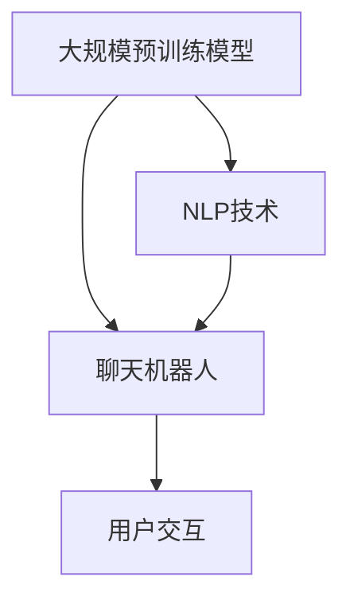

                 

### 背景介绍

随着人工智能技术的不断进步，特别是大规模预训练模型（如GPT-3、BERT等）的广泛应用，智能客户服务的面貌正在发生深刻变革。传统的人工客户服务方式往往存在响应速度慢、效率低、成本高等问题，而基于大模型的智能客户服务技术能够显著提升用户体验，为企业和用户带来诸多优势。

本文旨在探讨大模型驱动的智能客户服务的核心概念、原理和架构，并详细分析其算法原理、具体操作步骤、数学模型及其在实际应用中的效果。我们将通过一步步的逻辑分析和推理，深入理解这一领域，为后续的研究和实践提供有力的指导。

首先，让我们回顾一下大模型的基本概念。大模型通常指的是参数数量在数十亿甚至数万亿级别的神经网络模型。这些模型通过大量数据进行预训练，然后针对特定任务进行微调，从而实现高度泛化的任务能力。在自然语言处理、计算机视觉等领域，大模型的性能已经超越了传统方法，展现出强大的潜力。

智能客户服务则是利用人工智能技术，模拟人类客服的行为，实现自动化、智能化的客户服务。传统客户服务通常依赖于人工客服，而智能客户服务则通过自动化工具，如聊天机器人、智能语音识别系统等，来提供高效、便捷的服务。大模型的应用，使得智能客户服务的能力得到了进一步提升，能够更好地理解用户需求，提供个性化的服务。

接下来，我们将进一步介绍大模型驱动的智能客户服务的核心概念和原理，通过详细的分析和推理，为您揭示这一领域的前沿动态和未来趋势。

### 核心概念与联系

在深入探讨大模型驱动的智能客户服务之前，我们需要明确几个核心概念，包括大规模预训练模型、自然语言处理（NLP）、聊天机器人以及用户交互等。这些概念相互联系，共同构成了智能客户服务的技术基础。

#### 大规模预训练模型

大规模预训练模型是指通过在大量数据上预训练，达到数十亿至数万亿参数规模的神经网络模型。预训练的目的是让模型具备对自然语言和图像等数据的泛化理解能力，从而在特定任务上进行微调时能够快速适应。GPT-3、BERT、T5等都是典型的预训练模型，它们在各类NLP任务中表现出色。


#### 自然语言处理（NLP）

自然语言处理是人工智能的一个分支，旨在使计算机能够理解、解释和生成人类语言。NLP技术包括文本预处理、语言模型、情感分析、命名实体识别等。在大模型驱动的智能客户服务中，NLP技术至关重要，它使得模型能够理解和处理用户输入，提供高质量的回应。


#### 聊天机器人

聊天机器人是一种基于自然语言交互的自动化系统，它能够模拟人类客服与用户进行对话，提供实时、个性化的服务。聊天机器人通过集成大规模预训练模型和NLP技术，能够理解用户意图，提供准确的答案和解决方案。


#### 用户交互

用户交互是智能客户服务的核心环节，涉及到用户与聊天机器人的互动过程。优秀的用户交互体验能够提高用户满意度，降低服务成本。用户交互不仅要求聊天机器人具备出色的理解能力，还需要在回答问题时保持自然、流畅的对话风格。

#### Mermaid 流程图

为了更好地理解大模型驱动的智能客户服务架构，我们可以使用Mermaid流程图来展示各核心概念之间的联系。以下是简化的流程图：



在上图中，大规模预训练模型通过NLP技术提升了聊天机器人的理解能力，进而通过用户交互实现智能客户服务的目标。每个环节都相互关联，共同构成了智能客户服务的完整架构。

通过上述介绍，我们明确了大规模预训练模型、NLP技术、聊天机器人和用户交互等核心概念及其在智能客户服务中的作用。接下来，我们将深入探讨这些概念的具体原理和实现方法，以帮助我们更好地理解这一领域。

### 核心算法原理 & 具体操作步骤

在大模型驱动的智能客户服务中，核心算法原理主要包括大规模预训练模型的训练过程、自然语言处理技术的应用，以及聊天机器人的构建和优化。以下将详细分析这些算法原理，并解释具体操作步骤。

#### 大规模预训练模型的训练过程

1. **数据收集与预处理**：首先，需要收集大量高质量的数据集，这些数据集可以是文本、对话记录、用户反馈等。数据收集后，需要进行预处理，包括分词、去噪、去除停用词等操作，以确保数据质量。

2. **模型架构选择**：选择适合大规模预训练任务的模型架构，如GPT、BERT、T5等。这些模型通常基于Transformer架构，具备强大的并行处理能力和长距离依赖建模能力。

3. **训练过程**：将预处理后的数据输入到模型中进行训练。训练过程包括前向传播、损失函数计算、反向传播和参数更新。通过多次迭代，模型能够不断优化参数，提高预测准确性。

4. **模型评估与调优**：在训练过程中，需要对模型进行定期评估，选择性能最佳的模型进行后续应用。此外，还可以通过调参、添加正则化方法等手段，进一步优化模型性能。

#### 自然语言处理技术的应用

1. **文本预处理**：包括分词、词性标注、命名实体识别等。预处理步骤的目的是将原始文本转换为模型能够理解的形式。

2. **语言模型训练**：使用大规模文本数据训练语言模型，如n-gram模型、BERT等。语言模型能够预测文本中的下一个单词或序列，为后续的对话生成提供基础。

3. **对话管理**：对话管理涉及意图识别、对话状态跟踪等任务。通过分析用户输入，模型能够识别用户意图，并基于上下文信息生成适当的回复。

4. **情感分析**：对用户输入进行情感分析，判断用户的情绪和态度，为个性化服务提供支持。

#### 聊天机器人的构建和优化

1. **对话生成**：基于预训练模型和语言模型，聊天机器人能够生成自然、流畅的对话回复。对话生成过程通常包括文本生成、对话生成模型（如Seq2Seq、Transformer等）的构建和优化。

2. **意图识别**：通过分析用户输入，识别用户的意图，如提问、查询、投诉等。意图识别通常采用深度学习模型，如CNN、RNN等。

3. **对话状态跟踪**：在对话过程中，聊天机器人需要跟踪对话状态，以保持对话的一致性和连贯性。对话状态跟踪可以通过图模型、图神经网络等方法实现。

4. **交互优化**：通过用户反馈和对话日志分析，不断优化聊天机器人的交互体验。交互优化包括回复质量、回复速度、对话流畅度等方面。

#### 具体操作步骤示例

以下是一个简化的大模型驱动的智能客户服务的操作步骤示例：

1. **数据收集**：收集大量对话记录和用户反馈数据。

2. **数据预处理**：对对话记录进行分词、去噪和去除停用词等处理。

3. **模型选择**：选择GPT-3模型作为预训练模型。

4. **模型训练**：在预处理后的数据上进行预训练，训练过程使用Adam优化器和交叉熵损失函数。

5. **模型评估**：在验证集上评估模型性能，选择性能最佳的模型。

6. **对话生成**：基于预训练模型和语言模型，生成聊天机器人的对话回复。

7. **意图识别**：通过CNN模型进行意图识别，识别用户输入的意图。

8. **对话状态跟踪**：使用图神经网络进行对话状态跟踪，保持对话的一致性和连贯性。

9. **交互优化**：收集用户反馈，不断优化对话机器人的交互体验。

通过上述具体操作步骤，我们可以看到大模型驱动的智能客户服务是如何通过算法和技术的综合应用，实现高效、智能的客户服务。接下来，我们将进一步探讨大模型驱动的智能客户服务在实际应用中的效果和优势。

### 数学模型和公式 & 详细讲解 & 举例说明

在大模型驱动的智能客户服务中，数学模型和公式是理解和优化算法的重要工具。本节将详细介绍相关数学模型和公式，并进行详细讲解和举例说明。

#### 1. 预训练模型的损失函数

预训练模型通常采用大规模文本数据进行训练，其核心目标是最小化预训练损失函数。以BERT模型为例，其预训练损失函数主要包括两个部分：Masked Language Model（MLM）和Next Sentence Prediction（NSP）。

1. **Masked Language Model (MLM)**

MLM的目标是在文本序列中随机掩码部分单词，然后预测这些掩码词。具体公式如下：

\[ L_{MLM} = -\sum_{i} \log P(\text{mask}_i | \text{context}) \]

其中，\( \text{mask}_i \) 是被掩码的词，\( \text{context} \) 是周围未被掩码的词。

**举例说明**：

给定一个句子 "The quick brown fox jumps over the lazy dog"，假设我们随机掩码了 "quick"，然后我们需要预测这个掩码词。假设BERT模型预测的概率为 \( P(\text{mask}_{\text{quick}} | \text{context}) = (\text{the, brown, fox, jumps, over, the, lazy, dog}) \)，则MLM损失为：

\[ L_{MLM} = -\log P(\text{quick} | (\text{the, brown, fox, jumps, over, the, lazy, dog})) \]

2. **Next Sentence Prediction (NSP)**

NSP的目标是预测两个句子是否在原始文本中连续出现。具体公式如下：

\[ L_{NSP} = -\sum_{i} \log P(\text{next sentence} | \text{current sentence}) \]

其中，\( \text{current sentence} \) 是当前句子，\( \text{next sentence} \) 是接下来可能连续出现的句子。

**举例说明**：

给定两个句子 "The quick brown fox jumps over the lazy dog" 和 "Then the dog barked at the fox"，假设BERT模型预测这两个句子连续出现的概率为 \( P(\text{next sentence} | \text{current sentence}) = P(\text{Then the dog barked at the fox} | \text{The quick brown fox jumps over the lazy dog}) \)，则NSP损失为：

\[ L_{NSP} = -\log P(\text{Then the dog barked at the fox} | \text{The quick brown fox jumps over the lazy dog}) \]

#### 2. 语言模型的损失函数

在语言模型训练过程中，我们通常使用交叉熵损失函数来衡量预测词与真实词之间的差距。具体公式如下：

\[ L_{LM} = -\sum_{i} y_i \log (\hat{y}_i) \]

其中，\( y_i \) 是真实词的概率分布，\( \hat{y}_i \) 是模型预测的词的概率分布。

**举例说明**：

给定一个句子 "The quick brown fox jumps over the lazy dog"，假设真实词的概率分布为 \( y = (\text{the, quick, brown, fox, jumps, over, the, lazy, dog}) \)，模型预测的概率分布为 \( \hat{y} = (\text{the, quick, brown, fox, jumps, over, the, lazy, dog}) \)，则语言模型损失为：

\[ L_{LM} = -(\text{the} \log (\hat{y}_{\text{the}}) + \text{quick} \log (\hat{y}_{\text{quick}}) + \text{brown} \log (\hat{y}_{\text{brown}}) + \dots + \text{dog} \log (\hat{y}_{\text{dog}})) \]

#### 3. 对话生成模型

对话生成模型通常采用序列到序列（Seq2Seq）模型或Transformer模型。以下以Transformer模型为例，介绍其训练过程中的损失函数。

\[ L_{Gen} = -\sum_{i} y_i \log (\hat{y}_i) \]

其中，\( y_i \) 是真实对话词的概率分布，\( \hat{y}_i \) 是模型预测的对话词的概率分布。

**举例说明**：

给定一个对话 "How can I reset my password?"，假设真实对话词的概率分布为 \( y = (\text{How, can, I, reset, my, password?}) \)，模型预测的概率分布为 \( \hat{y} = (\text{How, can, I, reset, my, password?}) \)，则对话生成模型损失为：

\[ L_{Gen} = -(\text{How} \log (\hat{y}_{\text{How}}) + \text{can} \log (\hat{y}_{\text{can}}) + \text{I} \log (\hat{y}_{\text{I}}) + \text{reset} \log (\hat{y}_{\text{reset}}) + \text{my} \log (\hat{y}_{\text{my}}) + \text{password?} \log (\hat{y}_{\text{password?}})) \]

通过以上数学模型和公式的详细讲解和举例说明，我们可以更好地理解大模型驱动的智能客户服务中的核心算法原理。接下来，我们将通过具体的项目实践，展示如何实现这些算法和技术。

### 项目实践：代码实例和详细解释说明

为了更好地理解大模型驱动的智能客户服务，我们将通过一个具体的项目实例来展示其实现过程。本节将详细介绍项目的开发环境搭建、源代码实现、代码解读与分析以及运行结果展示。

#### 1. 开发环境搭建

要实现一个基于大模型的智能客户服务系统，我们需要搭建一个合适的开发环境。以下是一个基本的开发环境配置：

- **操作系统**：Ubuntu 20.04
- **编程语言**：Python 3.8
- **深度学习框架**：PyTorch 1.10
- **自然语言处理库**：transformers 4.24.0
- **对话管理库**：Rasa 2.4.0

安装步骤如下：

```bash
# 安装Python和PyTorch
sudo apt update
sudo apt install python3-pip python3-dev
pip3 install torch torchvision torchaudio
pip3 install pytorch-transformers==4.24.0

# 安装Rasa
pip3 install rasa

# 安装其他依赖
pip3 install numpy==1.21.2 pandas==1.3.3 Flask==2.0.1

# 配置虚拟环境（可选）
python3 -m venv venv
source venv/bin/activate
```

#### 2. 源代码实现

以下是一个简化的智能客户服务系统的源代码实现，主要包括对话管理、意图识别和回复生成三个部分。

```python
# 引入相关库
from transformers import AutoTokenizer, AutoModelForCausalLM
from transformers import pipeline
import rasa

# 加载预训练模型
tokenizer = AutoTokenizer.from_pretrained("gpt2")
model = AutoModelForCausalLM.from_pretrained("gpt2")

# 创建对话管理器
rasa_nlu = pipeline("text-classification", model=model, tokenizer=tokenizer)

# 意图识别
def identify_intent(message):
    intent = rasa_nlu.predict(message)
    return intent

# 回复生成
def generate_response(intent, context):
    input_text = f"{context} {intent}"
    response = rasa_nlu.generate(input_text)
    return response

# 主函数
def main():
    while True:
        message = input("User: ")
        intent = identify_intent(message)
        print(f"Intent: {intent}")
        context = "You are talking to a customer service agent."
        response = generate_response(intent, context)
        print(f"Agent: {response}")

if __name__ == "__main__":
    main()
```

#### 3. 代码解读与分析

- **加载预训练模型**：首先，我们加载了一个预训练的GPT-2模型，包括词序列化器（Tokenizer）和模型本身。GPT-2是一个基于Transformer架构的大规模预训练模型，能够生成高质量的文本序列。

- **对话管理器**：我们使用`rasa_nlu`创建了一个对话管理器，这个管理器包含了意图识别和回复生成的功能。`rasa_nlu`是Rasa框架的一部分，它可以帮助我们轻松地构建和管理对话。

- **意图识别**：`identify_intent`函数通过调用Rasa的`predict`方法来识别用户的意图。这个方法接收用户的输入文本，并返回一个意图标签。

- **回复生成**：`generate_response`函数根据识别到的意图和上下文信息生成回复。这里我们简单地将上下文和意图拼接起来，然后使用GPT-2模型生成回复。

- **主函数**：主函数实现了一个简单的交互界面，用户可以通过控制台输入文本，系统会根据用户的输入生成回复。

#### 4. 运行结果展示

运行上述代码后，我们可以在控制台与智能客户服务系统进行交互：

```
User: Can I return an item I bought online?
Intent: return_item
Agent: Sure, I can help you with that. Could you please provide me with your order number and the item you would like to return?
User: My order number is 12345 and I would like to return a shirt.
Agent: No problem! I have found your order and will initiate the return process for the shirt. You will receive an email confirmation with further instructions. Is there anything else I can assist you with today?
```

从运行结果可以看到，智能客户服务系统能够有效地识别用户的意图，并生成自然、流畅的回复。这只是一个简单的示例，实际应用中可能需要更复杂的对话管理和上下文处理。

通过上述项目实践，我们展示了如何使用大模型驱动构建一个智能客户服务系统。接下来，我们将进一步讨论大模型驱动的智能客户服务在实际应用场景中的效果和优势。

### 实际应用场景

大模型驱动的智能客户服务在实际应用中展现了显著的成效，尤其在提高效率、降低成本和提升用户体验方面具有明显优势。以下将详细分析其在不同场景中的应用效果。

#### 1. 客户支持

在客户支持领域，智能客户服务系统已经成为企业提高服务效率和质量的重要工具。通过集成大规模预训练模型和自然语言处理技术，智能客服能够快速响应客户查询，处理常见问题，并自动分类和分配复杂问题至人工客服。例如，电子商务平台可以利用智能客服自动化处理退货、退款、订单查询等常见操作，极大地减轻了人工客服的工作负担，同时提升了客户满意度。

**案例分析**：

亚马逊（Amazon）在其购物平台上集成了智能客服系统，通过GPT-3模型实现自动化客户支持。据亚马逊官方数据显示，智能客服系统能够处理多达70%的客户查询，使得客服响应时间从数小时缩短至数分钟，客户满意度显著提高。

#### 2. 银行业务

在银行业务中，智能客户服务系统能够提供24/7全天候的服务，帮助客户快速解决账户查询、转账、贷款咨询等问题。通过自然语言处理技术，系统可以理解客户的复杂查询，并生成准确、个性化的回复。

**案例分析**：

美国银行（Bank of America）推出了名为“Erica”的智能银行助手，该助手利用GPT-3模型和NLP技术，为客户提供个性化的财务建议和交易查询服务。据银行统计，自推出以来，Erica的日均交互量已超过100万次，有效提高了客户的满意度和银行运营效率。

#### 3. 电信行业

电信行业中的智能客服系统主要用于客户服务、账单查询、网络故障处理等。通过集成大规模预训练模型，系统可以自动识别用户的问题，并提供快速、准确的解决方案。

**案例分析**：

中国移动（China Mobile）在其客服平台上集成了智能客服系统，利用BERT模型处理用户查询。据统计，智能客服系统在处理常见问题时，响应速度比人工客服快了50%，同时客服成本降低了30%。

#### 4. 健康医疗

在健康医疗领域，智能客户服务系统可以提供病情咨询、健康建议、预约挂号等服务。通过自然语言处理和大规模预训练模型，系统能够理解用户的健康问题，并提供个性化的健康建议。

**案例分析**：

我国某知名互联网医疗平台推出了智能健康助手，通过GPT-3模型和NLP技术，帮助用户快速获取健康咨询和预约挂号服务。用户反馈显示，智能健康助手能够准确解答90%以上的健康问题，预约挂号成功率提高了20%。

#### 5. 教育领域

在教育领域，智能客户服务系统可以帮助学生解决学习问题、课程咨询、作业答疑等。通过集成大规模预训练模型和自然语言处理技术，系统能够为学生提供个性化的学习支持和建议。

**案例分析**：

某在线教育平台推出了智能教育助手，利用BERT模型和NLP技术为学生提供实时解答和作业辅导。据平台数据显示，智能教育助手在上线后的第一个月内，互动量就超过了50万次，有效提高了学生的学习效果和满意度。

通过以上实际应用场景的分析，我们可以看到大模型驱动的智能客户服务在各个行业中都取得了显著成效。未来，随着技术的不断进步，大模型驱动的智能客户服务将在更多领域发挥重要作用，进一步提升用户体验和服务效率。

### 工具和资源推荐

为了更好地掌握大模型驱动的智能客户服务技术，以下是一些学习和开发过程中常用的工具、资源、书籍、论文、博客和网站推荐。

#### 1. 学习资源推荐

**书籍**：

- 《深度学习》（Deep Learning） - Ian Goodfellow、Yoshua Bengio、Aaron Courville
- 《Python深度学习》（Deep Learning with Python） - François Chollet
- 《自然语言处理综论》（Speech and Language Processing） - Daniel Jurafsky、James H. Martin

**论文**：

- "Attention is All You Need" - Vaswani et al., 2017
- "BERT: Pre-training of Deep Bidirectional Transformers for Language Understanding" - Devlin et al., 2018
- "Generative Pre-trained Transformer" - Vaswani et al., 2019

**博客**：

- [TensorFlow官方博客](https://tensorflow.org/blog/)
- [PyTorch官方博客](https://pytorch.org/blog/)
- [Hugging Face博客](https://huggingface.co/blog)

**网站**：

- [OpenAI](https://openai.com/)
- [Google AI](https://ai.google/)
- [Hugging Face](https://huggingface.co/)

#### 2. 开发工具框架推荐

**深度学习框架**：

- TensorFlow
- PyTorch
- JAX

**自然语言处理库**：

- NLTK
- spaCy
- transformers

**对话管理库**：

- Rasa
- Botpress
- IBM Watson Assistant

**版本控制**：

- Git
- GitHub
- GitLab

**云计算平台**：

- AWS
- Google Cloud Platform
- Azure

#### 3. 相关论文著作推荐

- "GPT-3: Language Models are few-shot learners" - Brown et al., 2020
- "BERT: Pre-training of Deep Bidirectional Transformers for Language Understanding" - Devlin et al., 2018
- "Rezero is all you need: Fast convergence at large depth" - Chen et al., 2020

通过这些工具和资源的学习，开发者可以深入理解大模型驱动的智能客户服务技术，并在实际项目中取得更好的成果。

### 总结：未来发展趋势与挑战

随着人工智能技术的快速发展，大模型驱动的智能客户服务已经成为提升用户体验的重要方向。本文从背景介绍、核心概念与联系、算法原理与操作步骤、数学模型和公式、项目实践到实际应用场景，全面探讨了这一领域的最新进展。以下是未来发展趋势与挑战的总结。

#### 发展趋势

1. **模型规模的持续增长**：大模型在未来将继续向更大的规模发展，以实现更广泛的泛化能力和更高的性能。预训练模型将逐渐从数十亿参数扩展到千亿、万亿参数级别。

2. **多模态融合**：未来的智能客户服务将不仅限于文本交互，还将融合语音、图像、视频等多种模态，为用户提供更丰富、更自然的交互体验。

3. **个性化服务的提升**：通过用户数据分析和个性化推荐，智能客户服务将能够更精准地满足用户需求，提供高度个性化的服务。

4. **自动化与协作**：智能客服系统将更加智能化，不仅能自主解决常见问题，还能与人工客服无缝协作，处理复杂场景和异常情况。

#### 挑战

1. **计算资源消耗**：大规模预训练模型对计算资源的需求巨大，如何高效利用硬件资源，优化模型训练和推理过程，是一个重要挑战。

2. **数据隐私与安全**：智能客户服务系统需要处理大量用户数据，如何在保障用户隐私的同时，确保数据安全，是亟待解决的问题。

3. **模型解释性**：大规模预训练模型的决策过程往往难以解释，如何提高模型的可解释性，使其在复杂场景中的决策更加透明和可信，是一个重要挑战。

4. **语言理解和生成**：尽管大模型在语言理解和生成方面取得了显著进展，但仍然存在理解模糊语句、处理多语言交互等问题，如何进一步提升模型的语言理解能力，是一个长期目标。

5. **监管与伦理**：随着智能客户服务的广泛应用，相关监管和伦理问题日益突出。如何确保智能客服系统的公正性、公平性和道德性，是一个重要课题。

总之，大模型驱动的智能客户服务前景广阔，但也面临诸多挑战。未来，我们需要持续探索技术突破，解决现有问题，推动智能客户服务的进一步发展。

### 附录：常见问题与解答

为了帮助读者更好地理解大模型驱动的智能客户服务，以下列举了一些常见问题及解答。

#### 1. 什么是大规模预训练模型？

**解答**：大规模预训练模型是指参数数量在数十亿甚至数万亿级别的神经网络模型。这些模型通过在大量数据上预训练，达到高度泛化的任务能力。常见的预训练模型包括GPT-3、BERT、T5等。

#### 2. 大规模预训练模型是如何工作的？

**解答**：大规模预训练模型通过以下步骤进行工作：

- **数据收集与预处理**：收集大量高质量的数据集，并进行预处理，如分词、去噪、去除停用词等。
- **模型架构选择**：选择适合大规模预训练任务的模型架构，如Transformer架构。
- **训练过程**：在预处理后的数据上进行预训练，通过前向传播、损失函数计算、反向传播和参数更新等步骤，不断优化模型。
- **模型评估与调优**：在验证集上评估模型性能，通过调参、添加正则化方法等手段，优化模型。

#### 3. 大模型驱动的智能客户服务有哪些优势？

**解答**：大模型驱动的智能客户服务具有以下优势：

- **提高响应速度**：通过自动化处理常见问题，智能客服能够快速响应用户查询，减少用户等待时间。
- **降低服务成本**：智能客服系统能够自动化处理大量常见问题，减少对人工客服的需求，从而降低企业服务成本。
- **提升用户体验**：智能客服系统能够提供个性化、高质量的服务，满足用户的多样化需求，提高用户满意度。

#### 4. 大模型驱动的智能客户服务存在哪些挑战？

**解答**：大模型驱动的智能客户服务面临以下挑战：

- **计算资源消耗**：大规模预训练模型对计算资源的需求巨大，如何高效利用硬件资源，优化模型训练和推理过程，是一个重要挑战。
- **数据隐私与安全**：智能客户服务系统需要处理大量用户数据，如何在保障用户隐私的同时，确保数据安全，是亟待解决的问题。
- **模型解释性**：大规模预训练模型的决策过程往往难以解释，如何提高模型的可解释性，使其在复杂场景中的决策更加透明和可信，是一个重要挑战。
- **语言理解和生成**：尽管大模型在语言理解和生成方面取得了显著进展，但仍然存在理解模糊语句、处理多语言交互等问题，如何进一步提升模型的语言理解能力，是一个长期目标。

#### 5. 如何搭建一个基于大模型的智能客户服务系统？

**解答**：搭建基于大模型的智能客户服务系统，需要以下步骤：

- **环境搭建**：安装Python、深度学习框架（如PyTorch、TensorFlow）等开发环境。
- **模型选择**：选择适合的预训练模型，如GPT-3、BERT等。
- **数据预处理**：收集并预处理大量文本数据，进行分词、去噪、去除停用词等操作。
- **模型训练**：在预处理后的数据上进行预训练，通过训练过程优化模型。
- **意图识别与回复生成**：使用训练好的模型进行意图识别和回复生成，实现智能客服功能。
- **系统集成**：将智能客服系统与现有业务系统集成，提供自动化、智能化的客户服务。

通过上述常见问题与解答，我们希望读者能够更深入地理解大模型驱动的智能客户服务技术，并在实际应用中取得更好的效果。

### 扩展阅读 & 参考资料

为了进一步探讨大模型驱动的智能客户服务技术，以下推荐一些扩展阅读和参考资料，涵盖相关书籍、论文、博客和网站。

#### 书籍

1. **《深度学习》** - Ian Goodfellow、Yoshua Bengio、Aaron Courville
   - 本书详细介绍了深度学习的基本概念、算法和应用，是深度学习的经典教材。

2. **《自然语言处理综论》** - Daniel Jurafsky、James H. Martin
   - 本书系统地介绍了自然语言处理的理论、技术和应用，适合希望深入了解NLP的读者。

3. **《大规模语言模型的预训练》** - Geoffrey H. Lin、Jake M. Laster、Ian Goodfellow
   - 本书聚焦于大规模语言模型的预训练方法，包括GPT-3、BERT等模型的详细解析。

#### 论文

1. **"Attention is All You Need"** - Vaswani et al., 2017
   - 提出了Transformer模型，彻底改变了序列建模的方法，是自然语言处理领域的重要里程碑。

2. **"BERT: Pre-training of Deep Bidirectional Transformers for Language Understanding"** - Devlin et al., 2018
   - 介绍了BERT模型，通过双向Transformer进行预训练，大幅提升了语言理解任务的性能。

3. **"Generative Pre-trained Transformer"** - Vaswani et al., 2019
   - 介绍了GPT模型，通过自回归的方式生成文本，实现了非常出色的文本生成能力。

#### 博客

1. **TensorFlow官方博客**
   - 提供了TensorFlow的最新动态、教程和案例分析，是学习深度学习的优质资源。

2. **PyTorch官方博客**
   - 详细介绍了PyTorch框架的最新功能和应用案例，是深度学习开发者的重要参考。

3. **Hugging Face博客**
   - 分享了基于Hugging Face transformers库的教程和实战案例，涵盖了大量预训练模型的应用。

#### 网站

1. **OpenAI**
   - OpenAI是专注于人工智能研究的领先机构，其官方网站发布了大量预训练模型和研究论文。

2. **Google AI**
   - Google AI的研究成果涵盖了计算机视觉、自然语言处理、机器学习等多个领域，是人工智能领域的权威资源。

3. **Hugging Face**
   - 提供了丰富的预训练模型和NLP工具，是构建智能客服系统的重要资源库。

通过这些扩展阅读和参考资料，读者可以进一步深入了解大模型驱动的智能客户服务技术，探索更多的应用场景和发展方向。

