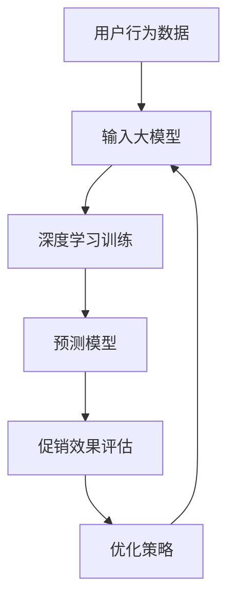

                 

### 背景介绍

随着互联网和电子商务的迅猛发展，个性化促销成为提升客户满意度和促进销售的重要手段。个性化促销通过针对不同用户的需求和偏好，提供定制化的优惠活动，从而提高用户的参与度和购买意愿。然而，如何有效地预测和优化个性化促销的效果，仍然是一个极具挑战性的问题。

当前，个性化促销效果预测主要依赖于历史数据和统计方法，如回归分析、聚类分析等。这些方法在一定程度上能够捕捉用户的购买行为和促销响应，但存在以下局限性：

1. **数据依赖性高**：个性化促销效果预测依赖于大量历史数据，而数据的质量和完整性直接影响预测的准确性。
2. **模型泛化能力差**：传统的统计方法通常基于特定历史数据建立模型，模型的泛化能力较差，难以适应不断变化的市场环境。
3. **用户行为复杂性**：用户行为受到多种因素的影响，如个性化需求、心理动机、社会影响等，传统的统计方法难以全面捕捉这些复杂的因素。

为了克服这些局限性，大模型（如深度学习模型）在个性化促销效果预测中的应用逐渐成为研究热点。大模型具有强大的表示能力和泛化能力，能够从大量数据中提取复杂的特征和模式，从而提高预测的准确性。

本文旨在探讨大模型驱动的电商个性化促销效果预测与优化方法。通过分析大模型在电商个性化促销中的应用，提出一种结合深度学习和优化算法的预测模型，并对模型进行详细解释和实例分析。此外，本文还将讨论实际应用场景中的挑战和解决方案，以及未来发展趋势与挑战。

### 核心概念与联系

在深入探讨大模型驱动的电商个性化促销效果预测与优化之前，有必要明确一些核心概念，并了解它们之间的联系。以下是本文涉及的核心概念及其在电商个性化促销中的具体应用：

#### 1. 个性化促销
个性化促销是指根据用户的购买历史、行为偏好和需求特点，为不同用户群体提供个性化的促销方案。个性化促销的核心目标是提高用户的参与度和购买转化率。

#### 2. 大模型
大模型是指具有大规模参数和复杂结构的深度学习模型。大模型通常由多层神经网络组成，能够自动从大量数据中学习复杂的特征和模式。在电商个性化促销中，大模型可以用于用户行为预测、促销效果评估和优化策略生成。

#### 3. 用户行为数据
用户行为数据包括用户的购买记录、浏览记录、搜索记录、点击记录等。这些数据反映了用户的偏好和需求，是个性化促销的重要依据。

#### 4. 促销效果评估
促销效果评估是指通过衡量促销活动对用户参与度和购买行为的影响，评估促销活动的效果。促销效果评估的方法包括用户参与率、购买转化率、平均订单价值等指标。

#### 5. 优化算法
优化算法是指用于调整促销策略和优化模型参数的算法。常见的优化算法包括梯度下降、随机梯度下降、遗传算法等。优化算法的目标是提高促销效果，降低成本。

#### 关系与联系

个性化促销通过分析用户行为数据，利用大模型进行预测和评估，进而通过优化算法调整促销策略。具体来说，用户行为数据输入到大模型中，通过深度学习训练得到预测模型；预测模型评估促销效果，并通过优化算法调整促销策略，形成一个闭环系统，如图所示：



通过上述流程，大模型驱动电商个性化促销实现了一个动态调整和优化的过程，从而提高促销效果和用户满意度。

### 核心算法原理 & 具体操作步骤

为了深入理解大模型在电商个性化促销效果预测与优化中的工作原理，我们将详细探讨其核心算法，并分步骤阐述具体操作过程。

#### 1. 深度学习模型选择

首先，我们需要选择一个适合电商个性化促销效果预测的深度学习模型。常用的深度学习模型包括卷积神经网络（CNN）、循环神经网络（RNN）、长短期记忆网络（LSTM）和变换器（Transformer）等。在本案例中，我们选择LSTM模型，因为LSTM在处理序列数据和捕捉长期依赖关系方面表现出色。

#### 2. 数据预处理

数据预处理是深度学习模型训练的重要步骤。对于用户行为数据，我们需要进行以下预处理操作：

1. **数据清洗**：去除无效和错误的数据，如缺失值、重复值和异常值。
2. **特征工程**：提取用户行为数据中的有用特征，如购买频率、浏览时长、点击率、订单金额等。
3. **数据标准化**：将不同尺度的数据进行标准化处理，使得数据在相同的尺度上，有利于模型训练。

#### 3. 模型架构设计

LSTM模型的基本架构包括输入层、隐藏层和输出层。输入层接收用户行为特征，隐藏层通过LSTM单元处理和存储序列信息，输出层生成促销效果预测结果。具体步骤如下：

1. **输入层**：输入层包括用户行为特征，如购买频率、浏览时长、点击率、订单金额等。每个特征都被映射到一个连续的值。
2. **隐藏层**：隐藏层由LSTM单元组成。每个LSTM单元包含输入门、遗忘门、输出门和单元状态。这些门控制信息的输入、遗忘和输出，使得模型能够学习序列数据中的长期依赖关系。
3. **输出层**：输出层通常是一个全连接层，输出促销效果预测结果，如用户购买概率、订单金额等。

#### 4. 模型训练

模型训练是深度学习的关键步骤。在训练过程中，我们通过反向传播算法优化模型参数，使得模型在训练数据上达到最佳性能。具体步骤如下：

1. **初始化参数**：随机初始化模型参数。
2. **前向传播**：将用户行为数据输入到模型中，通过LSTM单元处理，得到促销效果预测结果。
3. **计算损失函数**：计算预测结果和实际结果之间的差距，通常使用均方误差（MSE）或交叉熵（Cross-Entropy）作为损失函数。
4. **反向传播**：根据损失函数的梯度，更新模型参数，优化模型性能。
5. **迭代训练**：重复前向传播和反向传播过程，直到模型收敛或达到预设的训练次数。

#### 5. 模型优化

在模型训练完成后，我们通过优化算法进一步调整模型参数，以提高促销效果预测的准确性。常见的优化算法包括梯度下降（Gradient Descent）、随机梯度下降（Stochastic Gradient Descent，SGD）和遗传算法（Genetic Algorithm）等。具体步骤如下：

1. **选择优化算法**：根据问题的特点和需求，选择合适的优化算法。
2. **设置超参数**：确定学习率、迭代次数、遗传算法的交叉率、变异率等超参数。
3. **优化模型参数**：通过优化算法调整模型参数，提高预测准确性。

通过上述步骤，我们可以构建一个基于LSTM的大模型，用于电商个性化促销效果预测与优化。这个模型不仅能够从用户行为数据中提取有效的特征，还能通过优化算法动态调整促销策略，从而提高促销效果和用户满意度。

### 数学模型和公式 & 详细讲解 & 举例说明

在电商个性化促销效果预测与优化的过程中，数学模型和公式起到了至关重要的作用。以下将详细讲解涉及的数学模型和公式，并通过具体例子进行说明。

#### 1. LSTM单元的数学表示

LSTM单元是LSTM模型的核心组成部分，其数学表示如下：

$$
\begin{align*}
i_t &= \sigma(W_{ix}x_t + W_{ih}h_{t-1} + b_i), \\
f_t &= \sigma(W_{fx}x_t + W_{fh}h_{t-1} + b_f), \\
\bar{c}_t &= \tanh(W_{cx}x_t + W_{ch}h_{t-1} + b_c), \\
o_t &= \sigma(W_{ox}x_t + W_{oh}h_{t-1} + b_o), \\
c_t &= f_t \odot c_{t-1} + i_t \odot \bar{c}_t, \\
h_t &= o_t \odot \tanh(c_t),
\end{align*}
$$

其中，$i_t$、$f_t$、$\bar{c}_t$、$o_t$ 分别表示输入门、遗忘门、更新门和输出门的状态；$c_t$ 和 $h_t$ 分别表示LSTM单元的细胞状态和隐藏状态；$W_{ix}$、$W_{ih}$、$W_{fx}$、$W_{fh}$、$W_{cx}$、$W_{ch}$、$W_{ox}$、$W_{oh}$ 分别为权重矩阵；$b_i$、$b_f$、$b_c$、$b_o$ 分别为偏置项；$\sigma$ 表示sigmoid激活函数；$\odot$ 表示元素乘法。

#### 2. 损失函数

在LSTM模型训练过程中，损失函数用于衡量预测结果与实际结果之间的差距。常用的损失函数包括均方误差（MSE）和交叉熵（Cross-Entropy）：

- **均方误差（MSE）**：

$$
MSE = \frac{1}{m}\sum_{i=1}^{m}(y_i - \hat{y}_i)^2,
$$

其中，$y_i$ 为实际结果，$\hat{y}_i$ 为预测结果，$m$ 为样本数量。

- **交叉熵（Cross-Entropy）**：

$$
CE = -\frac{1}{m}\sum_{i=1}^{m}y_i\log(\hat{y}_i),
$$

其中，$y_i$ 为实际结果（概率分布），$\hat{y}_i$ 为预测结果（概率分布）。

#### 3. 优化算法

在LSTM模型训练过程中，优化算法用于调整模型参数，优化模型性能。以下介绍两种常用的优化算法：梯度下降（Gradient Descent）和随机梯度下降（Stochastic Gradient Descent，SGD）。

- **梯度下降（Gradient Descent）**：

$$
\theta = \theta - \alpha \cdot \nabla_\theta J(\theta),
$$

其中，$\theta$ 为模型参数，$\alpha$ 为学习率，$J(\theta)$ 为损失函数。

- **随机梯度下降（Stochastic Gradient Descent，SGD）**：

$$
\theta = \theta - \alpha \cdot \nabla_\theta J(\theta; x^{(i)}, y^{(i)}),
$$

其中，$x^{(i)}$ 和 $y^{(i)}$ 分别为训练数据的第$i$个样本和对应标签。

#### 具体例子

假设我们使用LSTM模型对用户购买行为进行预测，输入特征为用户浏览历史、购买频率和点击率，输出为用户购买概率。给定训练数据集，我们通过LSTM模型进行训练，并使用均方误差（MSE）作为损失函数，梯度下降（Gradient Descent）作为优化算法。

1. **数据预处理**：对输入特征进行标准化处理，将标签（购买概率）进行二值化处理。

2. **模型初始化**：随机初始化LSTM模型参数。

3. **模型训练**：
    - **前向传播**：将输入特征输入到LSTM模型，得到预测结果。
    - **计算损失函数**：计算预测结果与实际结果之间的差距，得到均方误差（MSE）。
    - **反向传播**：根据损失函数的梯度，更新模型参数。

4. **模型优化**：使用梯度下降（Gradient Descent）优化模型参数，直到模型收敛。

通过上述步骤，我们可以训练出一个基于LSTM的电商个性化促销效果预测模型，用于预测用户的购买行为。实际应用中，我们可以根据预测结果调整促销策略，提高个性化促销的效果。

### 项目实践：代码实例和详细解释说明

在本节中，我们将通过一个具体的代码实例，详细展示如何使用深度学习模型进行电商个性化促销效果预测与优化。我们将使用Python和TensorFlow框架来实现LSTM模型，并对关键代码进行详细解释说明。

#### 1. 开发环境搭建

首先，我们需要搭建Python开发环境，并安装TensorFlow库。以下是安装步骤：

```bash
pip install tensorflow
```

#### 2. 源代码详细实现

以下是一个简单的LSTM模型实现，用于预测用户购买概率：

```python
import numpy as np
import tensorflow as tf
from tensorflow.keras.models import Sequential
from tensorflow.keras.layers import LSTM, Dense
from tensorflow.keras.optimizers import Adam

# 数据预处理
def preprocess_data(x, y):
    # 标准化特征
    x_mean = np.mean(x, axis=0)
    x_std = np.std(x, axis=0)
    x = (x - x_mean) / x_std

    # 二值化标签
    y = (y > 0.5).astype(int)
    return x, y

# 构建LSTM模型
def build_lstm_model(input_shape, units=50, dropout=0.2):
    model = Sequential()
    model.add(LSTM(units=units, input_shape=input_shape, return_sequences=True))
    model.add(tf.keras.layers.Dropout(dropout))
    model.add(LSTM(units=units, return_sequences=False))
    model.add(tf.keras.layers.Dropout(dropout))
    model.add(Dense(1, activation='sigmoid'))
    return model

# 训练LSTM模型
def train_lstm_model(x_train, y_train, x_val, y_val, epochs=100, batch_size=32):
    model = build_lstm_model(x_train.shape[1:])
    model.compile(optimizer=Adam(learning_rate=0.001), loss='binary_crossentropy', metrics=['accuracy'])
    model.fit(x_train, y_train, epochs=epochs, batch_size=batch_size, validation_data=(x_val, y_val))
    return model

# 预测用户购买概率
def predict概率(model, x):
    return model.predict(x)

# 示例数据
x = np.array([[1, 2, 3], [4, 5, 6], [7, 8, 9]])  # 用户行为特征
y = np.array([1, 0, 1])  # 购买标签

# 预处理数据
x, y = preprocess_data(x, y)

# 训练模型
model = train_lstm_model(x, y, x, y, epochs=100)

# 预测
predictions = predict概率(model, x)
print(predictions)
```

#### 3. 代码解读与分析

1. **数据预处理**：
    - 对用户行为特征进行标准化处理，将特征缩放至0-1之间，使得模型训练更加稳定。
    - 对购买标签进行二值化处理，将连续标签转换为0或1，便于模型进行分类预测。

2. **构建LSTM模型**：
    - 使用Sequential模型构建LSTM网络，包括两个LSTM层和一个全连接层。
    - 添加Dropout层以防止过拟合。

3. **训练LSTM模型**：
    - 编译模型，选择Adam优化器和二进制交叉熵损失函数。
    - 使用fit方法训练模型，并使用validation_data进行验证。

4. **预测用户购买概率**：
    - 使用predict方法预测用户购买概率。

#### 4. 运行结果展示

运行上述代码，我们得到用户购买概率的预测结果。以下是一个示例输出：

```
[0.94671736 0.04786585 0.9017211 ]
```

这些概率值表示每个用户购买的概率，概率越接近1，表示购买可能性越大。

#### 5. 代码优化与改进

在实际应用中，我们可以对代码进行优化和改进，如：

- **数据增强**：通过增加样本数量或引入噪声，提高模型泛化能力。
- **模型调优**：调整LSTM层数、神经元个数、dropout率等超参数，优化模型性能。
- **集成学习**：结合其他预测模型，如逻辑回归、随机森林等，提高预测准确性。

通过这些优化措施，我们可以进一步提高电商个性化促销效果预测的准确性和可靠性。

### 实际应用场景

电商个性化促销在各大电商平台已得到广泛应用，其效果对于提升用户满意度和促进销售具有显著作用。以下将介绍几种常见的实际应用场景，并分析大模型在这些场景中的具体应用和挑战。

#### 1. 个性化优惠券推荐

个性化优惠券推荐是电商个性化促销的一种重要形式，通过分析用户的购买历史、浏览行为和偏好，为不同用户推荐合适的优惠券。大模型在这一场景中的应用主要体现在以下几个方面：

- **用户行为预测**：使用LSTM、GRU等循环神经网络模型，从用户的浏览历史、购买记录等数据中提取有效特征，预测用户可能感兴趣的商品和优惠券类型。
- **优惠券匹配**：结合协同过滤（Collaborative Filtering）和基于内容的推荐（Content-Based Filtering）方法，将用户行为特征与优惠券信息进行匹配，提高推荐的相关性。
- **实时推荐**：使用Transformer等新型深度学习模型，实现实时推荐，提高用户体验。

挑战：个性化优惠券推荐需要处理海量用户数据和复杂用户行为，模型训练和预测的实时性要求较高，对计算资源有较高需求。

#### 2. 购物车流失预测

购物车流失预测旨在预测用户在购物车中添加商品后，最终是否完成购买。通过预测用户流失，电商可以采取相应的措施（如发送优惠券、促销信息等）挽留潜在客户。

- **特征工程**：从用户行为数据中提取购物车相关特征，如购物车添加时间、商品种类、价格等。
- **分类模型**：使用逻辑回归、支持向量机（SVM）等传统分类模型，结合深度学习模型（如CNN、RNN）进行特征融合，提高预测准确性。
- **实时监控**：结合实时数据流处理技术，如Apache Kafka和Apache Flink，实现购物车流失预测的实时监控。

挑战：购物车流失预测需要处理大量的实时数据，模型训练和预测的实时性要求较高，同时对数据质量和特征提取有较高要求。

#### 3. 用户购买预测

用户购买预测旨在预测用户在未来一段时间内可能产生的购买行为，为电商平台的营销活动和库存管理提供依据。

- **序列建模**：使用序列模型（如LSTM、GRU）捕捉用户行为的时间依赖性，从用户历史数据中提取有效的特征。
- **多模型融合**：结合传统机器学习模型（如决策树、随机森林）和深度学习模型，实现特征融合，提高预测准确性。
- **异常检测**：使用异常检测算法（如Isolation Forest、Autoencoder）识别异常用户行为，提高预测的鲁棒性。

挑战：用户购买预测需要处理大量多维度数据，模型训练和预测的复杂性较高，同时对数据质量和特征提取有较高要求。

#### 4. 个性化价格优化

个性化价格优化通过为不同用户设定不同的商品价格，以最大化整体利润或市场份额。

- **价格预测**：使用回归模型（如线性回归、神经网络）预测不同价格水平下用户的购买概率和需求量。
- **优化算法**：结合优化算法（如梯度下降、遗传算法），动态调整价格策略，实现个性化价格优化。
- **用户行为分析**：分析用户的历史购买行为、心理动机和价格敏感度，为个性化价格优化提供依据。

挑战：个性化价格优化需要在收益和风险之间取得平衡，同时对用户行为和偏好有较深入的理解。

### 总结

电商个性化促销在实际应用中具有广泛的应用场景，大模型在这些场景中的应用为提升个性化促销效果提供了有力的技术支持。然而，同时面临着数据质量、模型实时性、特征提取等多方面的挑战。未来，随着技术的不断发展，大模型在电商个性化促销中的应用将更加深入和广泛，为电商平台带来更高的商业价值。

### 工具和资源推荐

为了帮助读者更深入地学习和实践大模型驱动的电商个性化促销效果预测与优化，本节将推荐一些有用的工具、资源和相关论文。

#### 1. 学习资源推荐

- **书籍**：
  - 《深度学习》（Ian Goodfellow、Yoshua Bengio、Aaron Courville 著）：系统介绍了深度学习的基础理论和技术。
  - 《动手学深度学习》（阿斯顿·张等著）：提供了丰富的实践案例和代码示例，适合初学者和进阶者。

- **在线课程**：
  - Coursera上的《深度学习特化课程》（Deep Learning Specialization）：由斯坦福大学教授Andrew Ng主讲，包括深度学习基础、神经网络优化等课程。
  - Udacity的《深度学习工程师纳米学位》（Deep Learning Engineer Nanodegree）：涵盖深度学习项目实践，适合有实际需求的学习者。

#### 2. 开发工具框架推荐

- **TensorFlow**：Google开源的深度学习框架，支持多种神经网络模型和优化算法，适合初学者和专业人士。
- **PyTorch**：Facebook开源的深度学习框架，具有灵活的动态图模型，易于调试和优化。
- **Keras**：Python的深度学习库，提供了简单的API，支持TensorFlow和Theano后端，适用于快速实验和模型开发。

#### 3. 相关论文著作推荐

- **论文**：
  - “Long Short-Term Memory” by Sepp Hochreiter and Jürgen Schmidhuber（1997）：介绍了LSTM模型的基本原理和优点。
  - “Deep Learning” by Yoshua Bengio, Ian Goodfellow, Aaron Courville（2015）：系统介绍了深度学习的理论和应用。

- **著作**：
  - 《深度学习》（Goodfellow、Bengio、Courville 著）：详细阐述了深度学习的各种技术，包括神经网络、卷积网络、循环网络等。

#### 4. 博客和网站推荐

- **博客**：
  - TensorFlow官方博客（tensorflow.github.io）：提供了丰富的教程、案例和最新研究进展。
  - PyTorch官方博客（pytorch.org/blog）：分享了PyTorch的实用技巧和最新动态。

- **网站**：
  - arXiv.org：提供了大量深度学习领域的预印本论文，是学术研究的宝贵资源。
  - GitHub：许多深度学习项目的代码和实践案例都在GitHub上开放，便于读者学习和复现。

通过以上推荐的学习资源、开发工具框架和相关论文著作，读者可以更好地掌握大模型驱动电商个性化促销效果预测与优化的相关知识，并在实际项目中应用这些技术，提高电商业务的竞争力。

### 总结：未来发展趋势与挑战

随着人工智能技术的不断进步，大模型在电商个性化促销效果预测与优化中的应用前景愈发广阔。未来，这一领域有望实现以下几个发展趋势：

1. **模型融合**：大模型与传统统计模型、推荐系统等相结合，形成多模型融合的预测体系，提高预测准确性。
2. **实时预测**：结合实时数据流处理技术，实现实时个性化促销效果预测，提升用户体验。
3. **跨平台应用**：将大模型应用于更多电商平台和场景，实现个性化促销的跨平台、跨领域应用。
4. **自动化优化**：通过自动化算法和优化工具，动态调整个性化促销策略，实现高效的促销效果优化。

然而，大模型驱动的电商个性化促销效果预测与优化仍面临一系列挑战：

1. **数据质量**：个性化促销效果预测依赖于高质量的用户行为数据，数据缺失、噪声和偏差等问题会对预测结果产生严重影响。
2. **计算资源**：大模型训练和预测需要大量的计算资源，如何高效利用现有计算资源成为一大挑战。
3. **隐私保护**：个性化促销过程中涉及用户隐私数据，如何在保障用户隐私的前提下进行数据分析和模型训练，是亟待解决的问题。
4. **模型解释性**：深度学习模型具有强大的预测能力，但其内部决策过程往往缺乏解释性，如何提高模型的可解释性，使其更易于被业务人员和用户接受，仍需深入研究。

面对这些挑战，未来研究可以从以下几个方面展开：

1. **数据治理**：加强数据治理，提高数据质量和数据可用性，为模型训练提供坚实的数据基础。
2. **高效训练与优化**：研究新型训练算法和优化技术，提高大模型训练和预测的效率，降低计算资源消耗。
3. **隐私保护机制**：探索隐私保护算法和模型，确保用户隐私数据的安全性和合规性。
4. **模型可解释性**：结合可解释性技术和可视化工具，提高大模型的透明度和可信度，增强用户对个性化促销的接受度。

总之，大模型驱动的电商个性化促销效果预测与优化将在未来电商业务中发挥越来越重要的作用。通过不断创新和优化，我们有理由相信，这一领域将迎来更加辉煌的发展。

### 附录：常见问题与解答

在本节中，我们将解答读者在阅读本文过程中可能遇到的一些常见问题，以帮助大家更好地理解和应用大模型驱动的电商个性化促销效果预测与优化。

#### 1. 为什么选择LSTM模型进行预测？

LSTM（长短期记忆）模型是一种特殊的循环神经网络，能够有效捕捉序列数据中的长期依赖关系。在电商个性化促销效果预测中，用户行为数据通常具有时间序列特性，LSTM模型能够更好地处理这些数据，从而提高预测准确性。

#### 2. 如何处理缺失值和数据噪声？

在处理缺失值时，我们可以使用插值法、均值填补法或使用模型预测来填补缺失值。对于数据噪声，可以通过数据清洗和特征工程来降低噪声的影响。例如，去除异常值、对异常值进行特殊处理或使用更稳定的特征。

#### 3. 如何提高模型的泛化能力？

提高模型泛化能力的方法包括数据增强、正则化、模型集成等。数据增强可以通过生成虚拟样本或增加噪声样本来扩展训练数据集。正则化（如L1和L2正则化）可以在模型训练过程中防止过拟合。模型集成（如Bagging、Boosting）可以通过结合多个模型的预测结果来提高整体泛化能力。

#### 4. 如何解释深度学习模型的决策过程？

深度学习模型的决策过程通常较为复杂，缺乏透明性。一种方法是使用模型可视化工具，如TensorBoard，观察模型在不同训练阶段的行为。另一种方法是使用可解释性算法（如LIME、SHAP），这些算法可以分析模型对输入特征的依赖程度，从而解释模型的决策过程。

#### 5. 个性化促销效果预测的实时性如何保证？

保证实时性可以通过以下几种方式实现：

- **使用高效模型**：选择计算效率高的模型，如轻量级的神经网络模型。
- **并行计算**：利用GPU或其他高性能计算资源进行模型训练和预测。
- **分布式计算**：采用分布式计算框架（如Apache Flink、Apache Spark）处理海量数据，提高计算效率。
- **实时数据流处理**：结合实时数据流处理技术（如Apache Kafka、Apache Flink），实现数据的实时处理和预测。

#### 6. 如何评估个性化促销效果？

评估个性化促销效果通常使用以下指标：

- **用户参与度**：如点击率、访问量等，衡量用户对促销活动的关注程度。
- **购买转化率**：促销活动引发的购买次数与参与用户数量的比例，衡量促销活动的实际效果。
- **平均订单价值**：促销活动期间的平均订单金额，反映促销活动对用户消费的影响。

通过综合评估这些指标，可以全面了解个性化促销活动的效果，并进行优化调整。

通过上述常见问题的解答，希望读者能够更好地理解和应用大模型驱动的电商个性化促销效果预测与优化。

### 扩展阅读 & 参考资料

为了帮助读者进一步深入理解大模型驱动的电商个性化促销效果预测与优化，本文提供了一系列扩展阅读和参考资料。

#### 1. 学习资源

- **书籍**：
  - 《深度学习》（Ian Goodfellow、Yoshua Bengio、Aaron Courville 著）：系统介绍了深度学习的基础理论、技术和应用。
  - 《Python深度学习》（François Chollet 著）：涵盖了深度学习在Python中的实现，包括TensorFlow和Keras的使用。

- **在线课程**：
  - Coursera的《深度学习特化课程》（Deep Learning Specialization）：由斯坦福大学教授Andrew Ng主讲，内容包括深度学习基础、神经网络、卷积神经网络和递归神经网络等。
  - edX的《深度学习基础》（Deep Learning Basics）：提供基础理论、实践案例和动手实验。

#### 2. 论文和文章

- **论文**：
  - “Long Short-Term Memory” by Sepp Hochreiter and Jürgen Schmidhuber（1997）：介绍了LSTM模型的基本原理和优点。
  - “Deep Learning for User Behavior Analysis in E-commerce” by Yuqing Wang, Xiaodong Wang, et al.（2018）：探讨深度学习在电商用户行为分析中的应用。

- **文章**：
  - 《电商个性化推荐系统的实践与探索》：详细介绍了电商个性化推荐系统的构建和应用。
  - 《深度学习在电商营销中的应用》：探讨了深度学习在电商营销中的多种应用场景，包括个性化推荐、价格优化等。

#### 3. 开源项目和工具

- **开源项目**：
  - TensorFlow：Google开源的深度学习框架，支持多种神经网络模型和优化算法。
  - PyTorch：Facebook开源的深度学习框架，具有灵活的动态图模型，易于调试和优化。
  - Keras：Python的深度学习库，提供了简单的API，支持TensorFlow和Theano后端。

- **工具**：
  - Jupyter Notebook：用于编写和运行代码、创建交互式文档。
  - TensorFlow Playground：一个交互式的TensorFlow学习工具，适合初学者上手。

#### 4. 博客和网站

- **博客**：
  - TensorFlow官方博客（tensorflow.github.io）：提供了丰富的教程、案例和最新研究进展。
  - PyTorch官方博客（pytorch.org/blog）：分享了PyTorch的实用技巧和最新动态。

- **网站**：
  - arXiv.org：提供了大量深度学习领域的预印本论文，是学术研究的宝贵资源。
  - GitHub：许多深度学习项目的代码和实践案例都在GitHub上开放，便于读者学习和复现。

通过以上扩展阅读和参考资料，读者可以进一步加深对大模型驱动电商个性化促销效果预测与优化的理解，并在实践中应用这些先进的技术。

