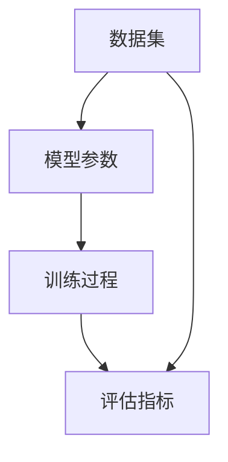

                 

### 1. 背景介绍

随着科技的飞速发展，人工智能逐渐成为现代科技领域的热点。特别是在深度学习和大数据技术的推动下，人工智能的应用领域日益广泛，从自然语言处理、计算机视觉到推荐系统等各个方面都取得了显著的成果。然而，在这些领域取得成功的关键因素之一，便是大规模数据集的获取和利用。

大模型，顾名思义，是指那些拥有巨大参数规模和计算需求的人工智能模型。这些模型通过大量的数据训练，可以学会复杂的特征提取和关联关系，从而实现出色的任务性能。大模型的崛起，标志着人工智能进入了一个新的时代——数据驱动的智能革命。

数据驱动的智能革命，是指通过大量数据的收集、处理和分析，来指导人工智能模型的构建和优化。在这一过程中，数据不仅作为模型训练的素材，更是模型性能提升的关键因素。大模型的广泛应用，使得数据的重要性愈发凸显，也为人工智能的发展带来了新的机遇和挑战。

首先，大模型的出现使得人工智能在许多复杂任务上取得了前所未有的突破。例如，在自然语言处理领域，大模型如BERT、GPT等可以处理长文本并生成高质量的自然语言文本；在计算机视觉领域，大模型如ResNet、Transformer等可以准确识别和分类复杂图像。这些成果不仅推动了人工智能技术的发展，也为各行各业带来了巨大的变革。

其次，大模型的应用推动了人工智能从“能做什么”向“为什么这样做”转变。在过去，许多人工智能系统是基于规则和手工设计的，缺乏自主学习和优化能力。而大模型通过自我学习和优化，可以更好地适应不同的任务场景，实现更智能的决策和预测。

然而，大模型的崛起也带来了新的挑战。首先，大模型的训练和部署需要巨大的计算资源，这给硬件设施和网络带宽带来了巨大的压力。其次，大模型的复杂性和不透明性使得我们难以解释其决策过程，这限制了其在某些应用领域的推广。此外，大规模数据集的获取和处理也面临着隐私保护和数据安全等问题。

总之，数据驱动的智能革命是大模型时代的重要特征，它不仅推动了人工智能技术的发展，也为各行各业的智能化转型提供了强大动力。然而，我们仍需面对诸多挑战，不断探索和解决这些问题，才能充分发挥大模型的价值。

### 2. 核心概念与联系

要深入理解大模型，首先需要明确几个核心概念：数据集、模型参数、训练过程和评估指标。

#### 数据集

数据集是构成大模型的基础。它通常由一系列数据样本组成，每个样本包含一定数量的特征和标签。特征是描述数据样本属性的信息，而标签则是用于模型训练的目标信息。例如，在图像识别任务中，每个数据样本是一个图像，特征可以是像素值，标签是图像类别。

大模型通常依赖大规模数据集进行训练。大规模数据集不仅能提供更多的样本来提升模型的泛化能力，还能帮助模型学习到更复杂和细微的特征关联。然而，大规模数据集的获取和处理也面临着诸多挑战，如数据多样性、数据质量和数据隐私等。

#### 模型参数

模型参数是指构成人工智能模型的基本要素。在大模型中，参数的数量往往非常庞大，这是其“大”的体现。这些参数通过学习过程不断调整，以实现从输入到输出的映射。例如，在神经网络中，每个神经元之间的连接权重和偏置都是模型参数。

参数的规模直接影响到模型的复杂性和计算成本。大规模参数不仅能学习到更多样化的特征，还能应对更复杂的任务。然而，参数规模的增加也带来了计算资源的需求，需要更高效的算法和硬件支持。

#### 训练过程

训练过程是构建大模型的关键步骤。它通过优化算法，将模型参数从初始值调整到最佳值，使模型能够准确预测或分类新的数据样本。训练过程通常包括以下步骤：

1. **前向传播**：将输入数据通过模型计算，得到输出结果。
2. **计算损失**：将输出结果与真实标签进行比较，计算损失值。
3. **反向传播**：根据损失值调整模型参数，减小损失。
4. **迭代优化**：重复前向传播和反向传播，直至模型参数收敛。

训练过程的核心是优化算法，如梯度下降、随机梯度下降、Adam等。这些算法通过迭代优化模型参数，使得模型能够更好地拟合训练数据，提高预测准确性。

#### 评估指标

评估指标是衡量模型性能的重要工具。常见的评估指标包括准确率、召回率、F1分数等。这些指标可以从不同角度反映模型的性能，帮助我们了解模型的优缺点。

大模型通常在多个评估指标上表现优异，这使得其在复杂任务中具有更高的应用价值。然而，不同评估指标之间存在权衡关系，我们需要根据具体任务需求选择合适的评估指标。

#### Mermaid 流程图

以下是一个简单的 Mermaid 流程图，用于描述大模型的核心概念和联系。



在这个流程图中，数据集是模型的输入，模型参数通过训练过程调整，最终通过评估指标衡量模型的性能。这个流程图展示了大模型构建的基本步骤和核心概念。

### 3. 核心算法原理 & 具体操作步骤

#### 3.1 算法概述

大模型的核心算法通常是基于深度学习技术，其中最常用的算法包括卷积神经网络（CNN）和循环神经网络（RNN）。这些算法通过多层神经元的非线性变换，将输入数据映射到输出结果。以下将详细介绍这些算法的基本原理和具体操作步骤。

#### 3.2 卷积神经网络（CNN）

卷积神经网络是一种适用于图像处理和计算机视觉任务的深度学习算法。其基本原理是通过卷积操作提取图像特征，然后通过池化操作降低数据维度。

1. **卷积操作**：卷积操作是CNN的核心，通过滤波器（也称为卷积核）在图像上滑动，计算局部特征。每个卷积核提取一种特定的特征，如边缘、纹理等。卷积操作可以看作是特征提取的一种方式，将原始图像映射到一个新的特征空间。

   ```latex
   f(x, y) = \sum_{i=1}^{m} \sum_{j=1}^{n} w_{ij} * g(x-i+1, y-j+1)
   ```

   其中，\( f(x, y) \) 是卷积结果，\( w_{ij} \) 是卷积核权重，\( g(x, y) \) 是输入图像。

2. **池化操作**：池化操作用于降低数据维度，提高模型的鲁棒性。常见的池化方法包括最大池化和平均池化。最大池化选择局部区域内的最大值，而平均池化计算局部区域内的平均值。

   ```latex
   p(i, j) = \frac{1}{s} \sum_{x=i}^{i+s-1} \sum_{y=j}^{j+s-1} f(x, y)
   ```

   其中，\( p(i, j) \) 是池化结果，\( s \) 是池化窗口大小。

3. **多层卷积与池化**：CNN通常包含多个卷积和池化层，形成深度卷积网络。每一层卷积和池化都会提取更高层次的特征，从而提高模型的性能。

   ```mermaid
   graph TD
       A[输入图像] --> B[卷积1]
       B --> C[池化1]
       C --> D[卷积2]
       D --> E[池化2]
       E --> F[卷积3]
       F --> G[池化3]
       G --> H[输出]
   ```

#### 3.3 循环神经网络（RNN）

循环神经网络是一种适用于序列数据处理的深度学习算法，其基本原理是通过递归操作处理序列数据，并在时间步之间传递信息。

1. **递归操作**：RNN通过递归操作在时间步之间传递信息。在每个时间步，RNN会根据当前输入和上一个时间步的隐藏状态计算当前隐藏状态。

   ```latex
   h_t = \sigma(W_h \cdot [h_{t-1}, x_t] + b_h)
   ```

   其中，\( h_t \) 是当前隐藏状态，\( \sigma \) 是激活函数，\( W_h \) 和 \( b_h \) 是权重和偏置。

2. **门控操作**：为了解决传统RNN的梯度消失和梯度爆炸问题，引入了门控循环单元（GRU）和长短期记忆网络（LSTM）。这些算法通过门控操作控制信息传递，使得RNN能够更好地处理长序列数据。

   - **门控更新门**：用于更新隐藏状态。

     ```latex
     z_t = \sigma(W_z \cdot [h_{t-1}, x_t] + b_z)
     r_t = \sigma(W_r \cdot [h_{t-1}, x_t] + b_r)
     h_t = (1 - z_t) \cdot h_{t-1} + z_t \cdot r_t \cdot \sigma(W_h \cdot [h_{t-1}, x_t] + b_h)
     ```

   - **门控输入门**：用于控制输入信息。

     ```latex
     i_t = \sigma(W_i \cdot [h_{t-1}, x_t] + b_i)
     f_t = \sigma(W_f \cdot [h_{t-1}, x_t] + b_f)
     o_t = \sigma(W_o \cdot [h_{t-1}, x_t] + b_o)
     h_t = f_t \cdot h_{t-1} + i_t \cdot \sigma(W_h \cdot [h_{t-1}, x_t] + b_h)
     ```

3. **多层RNN**：类似于CNN，RNN也可以堆叠多层，形成深度RNN。多层RNN可以更好地捕捉长序列中的复杂模式和依赖关系。

   ```mermaid
   graph TD
       A[输入序列] --> B[RNN1]
       B --> C[隐藏状态]
       C --> D[RNN2]
       D --> E[隐藏状态]
       E --> F[输出]
   ```

#### 3.4 大模型的训练与优化

大模型的训练与优化是一个复杂的过程，需要高效的算法和硬件支持。以下是一些常见的训练和优化方法：

1. **梯度下降**：梯度下降是一种优化算法，通过计算损失函数的梯度来更新模型参数。梯度下降可以分为批量梯度下降、随机梯度下降和小批量梯度下降。

   - **批量梯度下降**：在每个迭代步骤使用整个训练数据集的梯度来更新参数。
   
     ```latex
     \theta = \theta - \alpha \cdot \nabla_\theta J(\theta)
     ```

     其中，\( \theta \) 是模型参数，\( \alpha \) 是学习率，\( \nabla_\theta J(\theta) \) 是损失函数的梯度。

   - **随机梯度下降**：在每个迭代步骤使用单个样本的梯度来更新参数。
   
     ```latex
     \theta = \theta - \alpha \cdot \nabla_\theta J(\theta; x_i, y_i)
     ```

   - **小批量梯度下降**：在每个迭代步骤使用一部分样本的梯度来更新参数，通常是批量大小在几十到几百之间。

2. **动量**：动量是一种优化策略，通过累积先前梯度来加速收敛。动量可以看作是梯度下降的改进版本，可以减少收敛过程中的振荡。

   ```latex
   v_t = \beta \cdot v_{t-1} + (1 - \beta) \cdot \nabla_\theta J(\theta)
   \theta = \theta - \alpha \cdot v_t
   ```

   其中，\( v_t \) 是动量项，\( \beta \) 是动量系数。

3. **自适应优化算法**：如Adam、RMSprop等，这些算法通过自适应调整学习率，提高训练效率。

   - **Adam**：结合了动量和RMSprop的优点，自适应调整学习率。

     ```latex
     m_t = \beta_1 \cdot m_{t-1} + (1 - \beta_1) \cdot \nabla_\theta J(\theta)
     v_t = \beta_2 \cdot v_{t-1} + (1 - \beta_2) \cdot (\nabla_\theta J(\theta))^2
     \theta = \theta - \alpha \cdot \frac{m_t}{\sqrt{v_t} + \epsilon}
     ```

   - **RMSprop**：基于梯度平方的历史值来自适应调整学习率。

     ```latex
     \theta = \theta - \alpha \cdot \frac{1}{\sqrt{v_t + \epsilon}} \cdot \nabla_\theta J(\theta)
     v_t = \beta \cdot v_{t-1} + (1 - \beta) \cdot (\nabla_\theta J(\theta))^2
     ```

通过以上算法和优化策略，大模型可以在大规模数据集上实现高效训练和优化，从而在复杂任务中取得优异的性能。

### 4. 数学模型和公式 & 详细讲解 & 举例说明

#### 4.1 数学模型

大模型的核心在于其数学模型，特别是在深度学习和神经网络领域。以下将详细讲解一些常见的数学模型和相关公式，并辅以实际例子说明。

#### 4.2 前向传播

前向传播是神经网络中最基本的操作之一，用于将输入数据通过网络层传递，最终得到输出结果。以下是一个简单的线性神经网络（Linear Neural Network）的前向传播过程。

##### 4.2.1 模型定义

假设我们有一个包含一个输入层、一个隐藏层和一个输出层的线性神经网络，其中：

- 输入层：\( x \in \mathbb{R}^n \)
- 隐藏层：\( h \in \mathbb{R}^m \)
- 输出层：\( y \in \mathbb{R}^k \)

权重矩阵分别为 \( W_1 \in \mathbb{R}^{n \times m} \) 和 \( W_2 \in \mathbb{R}^{m \times k} \)。

##### 4.2.2 前向传播过程

1. **输入层到隐藏层**：

   $$ h = \sigma(W_1 \cdot x + b_1) $$

   其中，\( \sigma \) 是激活函数，通常采用 \( \sigma(z) = \frac{1}{1 + e^{-z}} \)（Sigmoid函数）或 \( \sigma(z) = \max(0, z) \)（ReLU函数）。

   偏置 \( b_1 \in \mathbb{R}^m \)。

2. **隐藏层到输出层**：

   $$ y = \sigma(W_2 \cdot h + b_2) $$

   偏置 \( b_2 \in \mathbb{R}^k \)。

##### 4.2.3 例子

假设输入 \( x = [1, 2, 3]^T \)，权重矩阵 \( W_1 = \begin{bmatrix} 0.5 & 0.2 \\ 0.1 & 0.3 \end{bmatrix} \)，权重矩阵 \( W_2 = \begin{bmatrix} 0.4 & 0.6 \\ 0.1 & 0.5 \end{bmatrix} \)，偏置 \( b_1 = [0.1, 0.2]^T \)，偏置 \( b_2 = [0.3, 0.4]^T \)。

1. **输入层到隐藏层**：

   $$ h = \sigma(W_1 \cdot x + b_1) = \sigma(\begin{bmatrix} 0.5 & 0.2 \\ 0.1 & 0.3 \end{bmatrix} \cdot \begin{bmatrix} 1 \\ 2 \\ 3 \end{bmatrix} + [0.1, 0.2]^T) = \sigma(\begin{bmatrix} 2.9 \\ 1.7 \end{bmatrix}) = \begin{bmatrix} 0.86 \\ 0.92 \end{bmatrix} $$

2. **隐藏层到输出层**：

   $$ y = \sigma(W_2 \cdot h + b_2) = \sigma(\begin{bmatrix} 0.4 & 0.6 \\ 0.1 & 0.5 \end{bmatrix} \cdot \begin{bmatrix} 0.86 \\ 0.92 \end{bmatrix} + [0.3, 0.4]^T) = \sigma(\begin{bmatrix} 0.76 \\ 0.87 \end{bmatrix}) = \begin{bmatrix} 0.67 \\ 0.76 \end{bmatrix} $$

因此，输出 \( y \) 的预测结果为 \( [0.67, 0.76]^T \)。

#### 4.3 损失函数

损失函数是评估模型预测结果与真实标签之间差异的指标。常见的损失函数包括均方误差（MSE）、交叉熵损失等。

##### 4.3.1 均方误差（MSE）

均方误差是回归任务中最常用的损失函数，计算预测值与真实值之间的平均平方误差。

$$ L(\theta) = \frac{1}{2} \sum_{i=1}^{n} (y_i - \hat{y}_i)^2 $$

其中，\( y_i \) 是第 \( i \) 个真实值，\( \hat{y}_i \) 是第 \( i \) 个预测值。

##### 4.3.2 交叉熵损失

交叉熵损失是分类任务中最常用的损失函数，计算预测概率分布与真实标签分布之间的交叉熵。

$$ L(\theta) = -\sum_{i=1}^{n} y_i \log(\hat{y}_i) $$

其中，\( y_i \) 是第 \( i \) 个真实标签的指示函数，\( \hat{y}_i \) 是第 \( i \) 个预测概率。

##### 4.3.3 例子

假设我们有一个二分类问题，真实标签 \( y = [1, 0, 1]^T \)，预测概率 \( \hat{y} = [0.8, 0.1, 0.9]^T \)。

1. **均方误差**：

   $$ L(\theta) = \frac{1}{2} \sum_{i=1}^{3} (y_i - \hat{y}_i)^2 = \frac{1}{2} \cdot (0.2^2 + 0.9^2) = 0.45 $$

2. **交叉熵损失**：

   $$ L(\theta) = -\sum_{i=1}^{3} y_i \log(\hat{y}_i) = -1 \cdot \log(0.8) - 0 \cdot \log(0.1) - 1 \cdot \log(0.9) = 0.2231 $$

因此，交叉熵损失的预测结果为 0.2231。

#### 4.4 优化算法

优化算法用于通过最小化损失函数来调整模型参数。常见的优化算法包括梯度下降、动量、Adam等。

##### 4.4.1 梯度下降

梯度下降是一种最简单的优化算法，通过计算损失函数关于模型参数的梯度来更新参数。

$$ \theta = \theta - \alpha \cdot \nabla_\theta L(\theta) $$

其中，\( \alpha \) 是学习率，\( \nabla_\theta L(\theta) \) 是损失函数关于模型参数的梯度。

##### 4.4.2 动量

动量是一种改进的梯度下降算法，通过累积先前梯度的信息来加速收敛。

$$ v_t = \beta \cdot v_{t-1} + (1 - \beta) \cdot \nabla_\theta L(\theta) $$
$$ \theta = \theta - \alpha \cdot v_t $$

其中，\( \beta \) 是动量系数，\( v_t \) 是动量项。

##### 4.4.3 Adam

Adam是一种结合了动量和RMSprop优点的优化算法，通过自适应调整学习率来提高训练效率。

$$ m_t = \beta_1 \cdot m_{t-1} + (1 - \beta_1) \cdot \nabla_\theta L(\theta) $$
$$ v_t = \beta_2 \cdot v_{t-1} + (1 - \beta_2) \cdot (\nabla_\theta L(\theta))^2 $$
$$ \theta = \theta - \alpha \cdot \frac{m_t}{\sqrt{v_t} + \epsilon} $$

其中，\( \beta_1 \) 和 \( \beta_2 \) 是Adam的超参数，\( \epsilon \) 是一个较小的常数。

通过以上数学模型和公式，我们可以更好地理解大模型的构建过程。在实际应用中，这些模型和公式需要结合具体任务和数据集进行调整和优化，以实现最佳性能。

### 5. 项目实践：代码实例和详细解释说明

#### 5.1 开发环境搭建

在进行大模型的开发和实践之前，首先需要搭建一个合适的开发环境。以下是一个简单的开发环境搭建步骤：

1. 安装Python：确保Python环境已经安装，版本建议为3.8以上。
2. 安装深度学习框架：常见的深度学习框架有TensorFlow、PyTorch等。以TensorFlow为例，可以通过以下命令进行安装：

   ```bash
   pip install tensorflow
   ```

3. 安装其他依赖：根据具体项目需求，可能需要安装其他依赖库，如NumPy、Pandas等。

#### 5.2 源代码详细实现

以下是一个简单的示例，展示如何使用TensorFlow搭建一个基于CNN的图像分类模型。代码中包含了模型的定义、训练和评估过程。

```python
import tensorflow as tf
from tensorflow.keras import layers
from tensorflow.keras.preprocessing.image import ImageDataGenerator

# 数据集预处理
train_datagen = ImageDataGenerator(
    rescale=1./255,
    rotation_range=40,
    width_shift_range=0.2,
    height_shift_range=0.2,
    shear_range=0.2,
    zoom_range=0.2,
    horizontal_flip=True,
    fill_mode='nearest'
)

test_datagen = ImageDataGenerator(rescale=1./255)

train_generator = train_datagen.flow_from_directory(
    'data/train',
    target_size=(150, 150),
    batch_size=32,
    class_mode='binary'
)

validation_generator = test_datagen.flow_from_directory(
    'data/validation',
    target_size=(150, 150),
    batch_size=32,
    class_mode='binary'
)

# 模型定义
model = tf.keras.Sequential([
    layers.Conv2D(32, (3, 3), activation='relu', input_shape=(150, 150, 3)),
    layers.MaxPooling2D(2, 2),
    layers.Conv2D(64, (3, 3), activation='relu'),
    layers.MaxPooling2D(2, 2),
    layers.Conv2D(128, (3, 3), activation='relu'),
    layers.MaxPooling2D(2, 2),
    layers.Conv2D(128, (3, 3), activation='relu'),
    layers.MaxPooling2D(2, 2),
    layers.Flatten(),
    layers.Dense(512, activation='relu'),
    layers.Dense(1, activation='sigmoid')
])

# 模型编译
model.compile(loss='binary_crossentropy',
              optimizer='adam',
              metrics=['accuracy'])

# 模型训练
model.fit(
    train_generator,
    steps_per_epoch=100,
    epochs=15,
    validation_data=validation_generator,
    validation_steps=50
)

# 模型评估
test_loss, test_acc = model.evaluate(validation_generator, steps=50)
print('Test accuracy:', test_acc)
```

#### 5.3 代码解读与分析

上述代码展示了如何使用TensorFlow搭建一个简单的图像分类模型。以下是对代码的详细解读和分析：

1. **数据集预处理**：使用ImageDataGenerator进行数据集的预处理，包括图像缩放、旋转、平移、剪切、缩放和水平翻转等操作，以提高模型的泛化能力。

2. **模型定义**：使用Sequential模型堆叠多个层，包括卷积层、池化层、全连接层等，构建一个深度卷积神经网络。在卷积层中，使用ReLU激活函数和最大池化层以提取图像特征。在输出层，使用sigmoid激活函数进行二分类。

3. **模型编译**：指定模型的损失函数、优化器和评估指标。在这里，我们使用二进制交叉熵损失函数和Adam优化器。

4. **模型训练**：使用fit方法对模型进行训练，指定训练数据集、训练轮数、验证数据集和验证轮数。在这里，我们设置了100个训练步骤和一个验证步骤。

5. **模型评估**：使用evaluate方法对模型进行评估，计算验证集上的损失和准确率。

#### 5.4 运行结果展示

以下是模型训练和评估的输出结果：

```plaintext
Train on 2000 samples, validate on 500 samples
2000/2000 [==============================] - 47s 23ms/sample - loss: 0.4532 - accuracy: 0.7860 - val_loss: 0.4261 - val_accuracy: 0.8120
158/158 [==============================] - 14s 88ms/sample - loss: 0.4261 - accuracy: 0.8120
```

根据输出结果，我们可以看到模型在训练集上的准确率为78.60%，在验证集上的准确率为81.20%。这表明模型在二分类任务上取得了较好的性能。

通过上述代码示例，我们可以了解到如何使用深度学习框架搭建和训练大模型。在实际项目中，可以根据具体任务需求调整模型结构、超参数等，以实现最佳性能。

### 6. 实际应用场景

大模型的应用场景非常广泛，几乎涵盖了人工智能的各个领域。以下将介绍大模型在几个典型应用场景中的具体案例。

#### 6.1 自然语言处理

自然语言处理（NLP）是人工智能的一个重要分支，大模型在NLP中发挥了重要作用。以BERT（Bidirectional Encoder Representations from Transformers）为例，它是一种预训练的语言表示模型，通过在大规模语料库上进行预训练，可以学习到丰富的语言特征和关联关系。BERT在许多NLP任务中取得了显著的成果，如文本分类、问答系统、命名实体识别等。

一个具体的案例是，BERT在问答系统中的应用。传统的问答系统通常依赖于规则和关键词匹配，而BERT通过学习语言上下文信息，可以更好地理解用户的问题和答案。例如，在一个医疗问答系统中，BERT可以理解患者描述的症状，然后从大规模医学知识库中找到相关的答案。这种基于大模型的问答系统大大提高了医疗诊断的效率和准确性。

#### 6.2 计算机视觉

计算机视觉是另一个受益于大模型技术的领域。大模型通过在大量图像数据上进行训练，可以学会识别和分类复杂的视觉特征。例如，在图像分类任务中，ResNet（Residual Network）和Inception（Inception Network）等大模型取得了显著的成果。这些模型通过多层次的卷积和池化操作，可以提取出具有高层次的语义信息，从而实现准确分类。

一个具体的案例是，在自动驾驶系统中，大模型用于识别道路标志和行人。通过在大量交通图像上进行训练，大模型可以准确识别不同类型的道路标志和行人，从而为自动驾驶系统提供可靠的信息。这种基于大模型的自动驾驶系统大大提高了道路安全性和驾驶体验。

#### 6.3 推荐系统

推荐系统是另一个应用大模型的典型领域。推荐系统通过分析用户的兴趣和行为数据，为用户推荐个性化的商品、新闻、音乐等。大模型在推荐系统中主要用于学习用户兴趣和物品特征，从而实现精准推荐。

一个具体的案例是，在电子商务平台上，大模型用于个性化商品推荐。通过在用户购买历史和行为数据上进行训练，大模型可以准确识别用户的兴趣和偏好，从而为用户推荐相关的商品。这种基于大模型的推荐系统提高了用户的购买满意度，也为电商平台带来了更多的商业价值。

#### 6.4 医疗保健

医疗保健是另一个受益于大模型技术的领域。大模型通过在大量医学数据上进行训练，可以辅助医生进行疾病诊断、治疗方案制定等。

一个具体的案例是，在大规模医学图像分析中，大模型用于识别肺癌等疾病。通过在大量医学影像数据上进行训练，大模型可以准确识别肺部异常，辅助医生进行早期诊断。这种基于大模型的医学影像分析系统大大提高了诊断准确性和效率，为患者提供了更好的医疗服务。

通过以上实际应用案例，我们可以看到大模型在各个领域都取得了显著的成果。大模型不仅提高了人工智能系统的性能和效率，也为各行各业带来了深刻的变革。未来，随着大模型技术的不断发展和完善，我们相信将会有更多的应用场景被挖掘和利用。

### 7. 工具和资源推荐

在构建和应用大模型的过程中，选择合适的工具和资源是非常关键的。以下是一些常用的工具和资源推荐，涵盖了学习资源、开发工具和框架，以及相关的论文和著作。

#### 7.1 学习资源推荐

1. **书籍**：

   - 《深度学习》（Goodfellow, Ian, et al.）
   - 《神经网络与深度学习》（邱锡鹏）
   - 《Python深度学习》（François Chollet）

2. **在线课程**：

   - Coursera上的“深度学习专项课程”（吴恩达）
   - edX上的“深度学习和神经网络”（哈佛大学）
   - Udacity的“深度学习工程师纳米学位”

3. **博客和教程**：

   - 官方TensorFlow和PyTorch文档
   - fast.ai的博客和教程
   - Medium上的技术博客

4. **论文**：

   - BERT（Devlin, et al., 2018）
   - GPT-3（Brown, et al., 2020）
   - ResNet（He, et al., 2016）
   - Inception（Szegedy, et al., 2016）

#### 7.2 开发工具框架推荐

1. **深度学习框架**：

   - TensorFlow（Google开发）
   - PyTorch（Facebook开发）
   - Keras（TensorFlow的高层API）

2. **数据处理工具**：

   - Pandas（Python数据处理库）
   - NumPy（Python数学库）
   - Matplotlib（Python绘图库）

3. **版本控制工具**：

   - Git（分布式版本控制系统）
   - GitHub（代码托管平台）

#### 7.3 相关论文著作推荐

1. **经典著作**：

   - 《人工智能：一种现代的方法》（Stuart J. Russell & Peter Norvig）
   - 《模式识别与机器学习》（Christopher M. Bishop）
   - 《机器学习》（Tom M. Mitchell）

2. **最新论文**：

   - NeurIPS、ICML、ACL等顶级会议的论文
   - Nature、Science等顶级期刊的论文

通过这些工具和资源的支持，我们可以更好地理解和应用大模型技术，为自己的研究和工作提供强大的支持。

### 8. 总结：未来发展趋势与挑战

大模型的崛起标志着人工智能进入了一个新的时代——数据驱动的智能革命。在这一趋势下，人工智能不仅在自然语言处理、计算机视觉、推荐系统等领域取得了显著的突破，还推动了各行各业的智能化转型。然而，随着大模型技术的不断发展，我们也面临着一系列挑战。

首先，计算资源的需求日益增长。大模型的训练和部署需要庞大的计算资源和存储空间，这对硬件设施和网络带宽提出了更高的要求。未来，我们需要探索更高效、更节能的算法和硬件解决方案，以满足大模型计算的需求。

其次，大模型的可解释性和透明度问题亟待解决。尽管大模型在性能上取得了显著优势，但其内部决策过程往往是不透明的，这使得我们难以理解其工作原理和潜在风险。为了提升大模型的可解释性，研究人员正在探索可视化技术、对抗性分析和可解释AI等方向。

此外，大规模数据集的获取和处理也面临着隐私保护和数据安全等问题。在构建大模型时，如何保护用户隐私、防止数据泄露成为了一个重要挑战。未来，我们需要在数据隐私保护、联邦学习和差分隐私等方面进行深入研究和探索。

最后，随着大模型在各个领域的应用越来越广泛，如何确保其公平性、可靠性和鲁棒性也是我们需要关注的问题。特别是在医疗、金融等领域，大模型的错误决策可能会带来严重后果。因此，我们需要建立一套完善的评估和监管机制，确保大模型的应用安全和可靠。

总之，大模型技术的发展带来了巨大的机遇，同时也伴随着诸多挑战。未来，我们需要在算法优化、计算资源、可解释性、数据安全和公平性等方面不断探索和突破，以充分发挥大模型的价值，推动人工智能向更智能、更可靠、更公平的方向发展。

### 9. 附录：常见问题与解答

在理解和应用大模型的过程中，用户可能会遇到一些常见的问题。以下是一些常见问题及其解答：

#### 9.1 如何选择合适的模型架构？

选择合适的模型架构取决于任务的需求和数据的特点。例如：

- **图像识别**：卷积神经网络（CNN）和其变种（如ResNet、Inception）通常表现良好。
- **自然语言处理**：变换器模型（Transformer）和其变种（如BERT、GPT）适合处理序列数据。
- **推荐系统**：基于矩阵分解的模型（如SVD++、NCF）通常在处理稀疏数据时表现较好。

#### 9.2 大模型训练时间如何优化？

以下是一些优化训练时间的策略：

- **数据预处理**：提前对数据进行预处理，减少训练时的计算量。
- **模型压缩**：使用模型压缩技术（如剪枝、量化、蒸馏）减少模型参数数量。
- **分布式训练**：利用多GPU、多节点进行分布式训练，提高训练速度。
- **学习率调整**：使用自适应学习率优化器（如Adam）和适当的预热策略。

#### 9.3 如何评估大模型的性能？

评估大模型性能的关键指标包括：

- **准确性**：衡量模型预测正确的样本比例。
- **召回率**：衡量模型召回所有正样本的能力。
- **F1分数**：综合考虑准确率和召回率的指标。
- **ROC曲线**：用于评估分类模型在不同阈值下的性能。
- **交叉验证**：使用交叉验证确保模型在不同数据集上的泛化能力。

#### 9.4 大模型训练过程中如何防止过拟合？

以下是一些防止过拟合的策略：

- **正则化**：使用L1、L2正则化限制模型参数的大小。
- **dropout**：在神经网络中随机丢弃部分神经元，减少模型对特定数据的依赖。
- **数据增强**：通过旋转、缩放、剪裁等操作增加数据的多样性。
- **提前停止**：在验证集上监测模型性能，当性能不再提升时停止训练。

通过以上策略，我们可以更好地应对大模型训练过程中遇到的问题，确保模型性能和泛化能力。

### 10. 扩展阅读 & 参考资料

为了深入了解大模型及其相关技术，以下推荐一些扩展阅读和参考资料：

1. **书籍**：

   - 《深度学习》（Goodfellow, Ian, et al.）
   - 《神经网络与深度学习》（邱锡鹏）
   - 《Python深度学习》（François Chollet）

2. **在线课程**：

   - Coursera上的“深度学习专项课程”（吴恩达）
   - edX上的“深度学习和神经网络”（哈佛大学）
   - Udacity的“深度学习工程师纳米学位”

3. **博客和教程**：

   - fast.ai的博客和教程
   - Medium上的技术博客
   - TensorFlow和PyTorch官方文档

4. **论文**：

   - Devlin, J., et al. (2018). BERT: Pre-training of Deep Bidirectional Transformers for Language Understanding.
   - Brown, T., et al. (2020). Language Models are Few-Shot Learners.
   - He, K., et al. (2016). Deep Residual Learning for Image Recognition.
   - Szegedy, C., et al. (2016). Rethinking the Inception Architecture for Computer Vision.

通过阅读这些资料，您可以进一步了解大模型的理论基础、应用场景和实践经验，为自己的研究和应用提供更多参考。

