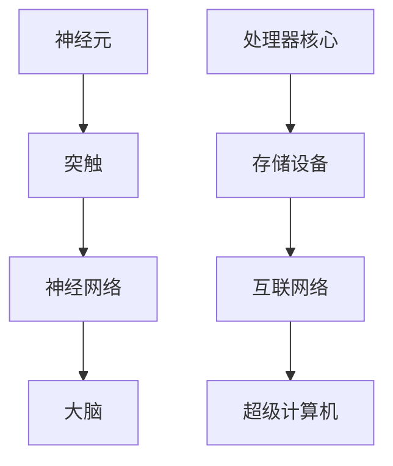

                 

### 1. 背景介绍

随着科技的飞速发展，计算机技术已经渗透到我们日常生活的方方面面。从智能手机、平板电脑到超级计算机，计算机在处理数据和执行任务方面的能力越来越强大。与此同时，人类大脑作为自然界最复杂、功能最强大的器官，也在不断启发着计算机科学的发展。本文将探讨大脑与超级计算机之间的比较，从结构、功能、处理能力等多个维度进行分析。

#### 1.1 大脑的复杂结构

大脑是人体最重要的器官之一，由约860亿个神经元组成，这些神经元通过突触相互连接，形成复杂的神经网络。大脑的外观虽然看似简单，但其内部结构却异常复杂。大脑分为两个半球，每个半球又可分为四个主要区域：额叶、顶叶、颞叶和枕叶。这些区域各自负责不同的功能，如思考、感知、记忆和运动控制等。

#### 1.2 超级计算机的强大性能

超级计算机是计算机领域的一项重要成就，具有极高的计算速度和处理能力。超级计算机通常由成千上万个处理器核心组成，能够执行数百万亿次浮点运算。这些处理器核心通过高速网络互联，形成一个庞大的计算系统。超级计算机在科研、天气预报、金融分析和军事模拟等领域发挥着关键作用。

#### 1.3 大脑与超级计算机的联系

虽然大脑和超级计算机在结构和功能上有很大差异，但它们之间也存在一些相似之处。首先，大脑和超级计算机都是高度并行处理的系统。大脑通过神经网络实现并行计算，而超级计算机则通过多个处理器核心实现并行计算。其次，大脑和超级计算机都具备自适应和学习能力。大脑能够根据经验和环境变化调整神经元之间的连接，而超级计算机则通过算法和机器学习技术不断提高计算效率和性能。

### 1.4 目的与结构

本文旨在通过对比分析大脑与超级计算机，探讨二者在结构、功能和处理能力等方面的异同。文章将分为以下几个部分：

1. **背景介绍**：概述大脑和超级计算机的基本知识，以及它们之间的联系。
2. **核心概念与联系**：介绍大脑和超级计算机的核心概念原理，并使用 Mermaid 流程图展示它们之间的联系。
3. **核心算法原理 & 具体操作步骤**：分析大脑和超级计算机的核心算法原理，以及具体的操作步骤。
4. **数学模型和公式 & 详细讲解 & 举例说明**：讲解大脑和超级计算机中使用的数学模型和公式，并举例说明。
5. **项目实践：代码实例和详细解释说明**：通过实际项目，展示大脑和超级计算机的应用实例，并详细解释说明。
6. **实际应用场景**：分析大脑和超级计算机在实际应用中的优势和挑战。
7. **工具和资源推荐**：推荐与大脑和超级计算机相关的学习资源、开发工具和框架。
8. **总结：未来发展趋势与挑战**：总结大脑和超级计算机的发展趋势，以及面临的挑战。
9. **附录：常见问题与解答**：解答读者可能关心的问题。
10. **扩展阅读 & 参考资料**：提供相关的扩展阅读和参考资料。

通过以上结构，我们将逐步深入探讨大脑与超级计算机的奥秘，以期为您带来一场精彩的技术之旅。

---

### 2. 核心概念与联系

在深入探讨大脑与超级计算机的相似与差异之前，我们需要先了解它们各自的核心概念与原理。通过图示化的方式，我们可以更加直观地理解这些概念和它们之间的联系。

#### 2.1 大脑的核心概念

大脑由神经元、突触和神经网络组成。神经元是大脑的基本计算单元，具有接收和传递电信号的功能。突触是神经元之间的连接点，通过化学和电信号传递信息。神经网络则是这些神经元和突触形成的复杂网络结构，负责实现大脑的各种认知功能。


#### 2.2 超级计算机的核心概念

超级计算机由多个处理器核心、存储设备和互联网络组成。处理器核心是计算机的基本计算单元，负责执行指令和处理数据。存储设备用于存储数据和程序。互联网络则负责连接各个处理器核心，实现数据的高速传输和共享。


#### 2.3 大脑与超级计算机的联系

虽然大脑和超级计算机在结构上存在显著差异，但它们在功能和工作原理上有很多相似之处。以下是它们之间的一些关键联系：

1. **并行处理**：大脑和超级计算机都是高度并行的系统。大脑通过神经网络实现并行计算，而超级计算机通过多个处理器核心实现并行计算。这种并行处理能力使得它们在处理大量数据和复杂任务时具有很高的效率。

2. **自适应和学习能力**：大脑和超级计算机都具备自适应和学习能力。大脑能够通过经验调整神经元之间的连接，从而优化其功能。超级计算机则通过算法和机器学习技术，不断提高其计算效率和性能。

3. **信息处理**：大脑和超级计算机都是信息处理的系统。大脑通过感知、记忆和思考等过程处理信息，而超级计算机则通过执行程序和处理数据来实现信息处理。

#### 2.4 Mermaid 流程图

为了更直观地展示大脑与超级计算机的核心概念和联系，我们可以使用 Mermaid 流程图来描述它们之间的结构关系。



在这个流程图中，A 代表神经元，B 代表突触，C 代表神经网络，D 代表处理器核心，E 代表存储设备，F 代表互联网络，G 代表大脑，H 代表超级计算机。通过这个流程图，我们可以清晰地看到大脑和超级计算机的基本结构及其关键组成部分。

通过以上分析，我们可以看到，大脑与超级计算机虽然在结构和功能上有所不同，但它们在核心概念和联系上有很多相似之处。这种相似性为计算机科学的发展提供了宝贵的启示，也为未来人工智能的发展提供了重要的方向。

---

### 3. 核心算法原理 & 具体操作步骤

在了解了大脑与超级计算机的核心概念和联系后，接下来我们将深入探讨它们的核心算法原理，并详细说明这些算法的具体操作步骤。

#### 3.1 大脑的核心算法原理

大脑中的核心算法可以归结为神经网络和突触权重调整。神经网络通过神经元之间的突触连接实现信息传递和处理。突触权重调整则是神经网络学习的基础，它通过不断调整突触的强度，使神经网络能够适应不同的输入信息，从而实现学习和记忆功能。

**具体操作步骤：**

1. **神经元激活**：当神经元接收到来自其他神经元的电信号时，会产生一个电信号，称为激活。激活水平取决于输入信号的强度和突触的权重。

2. **突触权重调整**：通过学习算法（如 Hebbian 学习规则或反向传播算法），神经网络根据输入信号的准确性和效果，调整突触的权重。权重调整的目的是使神经网络能够更好地处理未来的输入信息。

3. **神经网络更新**：每个神经元的激活状态会影响其他神经元的激活状态。通过这种级联效应，神经网络不断更新其内部状态，以适应新的输入信息。

#### 3.2 超级计算机的核心算法原理

超级计算机的核心算法主要涉及并行计算、分布式计算和大数据处理。这些算法利用多个处理器核心、存储设备和互联网络，实现高效的计算和数据处理。

**具体操作步骤：**

1. **任务分配**：将复杂任务分解为多个子任务，并将这些子任务分配给不同的处理器核心。这样可以充分利用多个处理器核心的计算能力，提高计算效率。

2. **并行计算**：多个处理器核心同时执行不同的子任务，通过并行计算实现高效的计算。并行计算可以大大缩短计算时间，提高系统性能。

3. **数据传输**：通过高速互联网络，将处理结果和数据在处理器核心、存储设备和计算节点之间进行传输和共享。这种数据传输和共享机制使得超级计算机能够处理大规模数据，并实现分布式计算。

4. **结果汇总**：将各个处理器核心的处理结果进行汇总，得到最终的计算结果。这一过程通常涉及复杂的算法和数据处理技术，以确保结果的准确性和可靠性。

#### 3.3 大脑与超级计算机算法的异同

虽然大脑与超级计算机在算法原理上存在一些异同，但它们的核心目标都是为了实现高效的信息处理和学习能力。

**相同点：**

1. **并行处理**：大脑和超级计算机都利用并行处理实现高效的计算。大脑通过神经网络实现并行计算，超级计算机通过多个处理器核心实现并行计算。

2. **自适应和学习能力**：大脑和超级计算机都具备自适应和学习能力。大脑通过突触权重调整实现学习，超级计算机通过机器学习和算法优化实现学习。

**不同点：**

1. **计算模型**：大脑采用神经网络模型，而超级计算机采用分布式计算模型。

2. **数据存储**：大脑采用生物神经网络结构，数据存储在神经元和突触中。超级计算机采用电子存储器，数据存储在处理器核心和存储设备中。

3. **计算效率**：大脑的并行计算效率受限于神经元之间的突触连接和传递速度。超级计算机的并行计算效率受限于处理器核心的计算速度和互联网络的数据传输速度。

通过以上分析，我们可以看到，大脑与超级计算机在核心算法原理上既有相同之处，也有不同之处。这种异同为计算机科学的发展提供了丰富的启示，也为未来人工智能的研究提供了重要的方向。

---

### 4. 数学模型和公式 & 详细讲解 & 举例说明

在探讨大脑与超级计算机的核心算法原理时，数学模型和公式扮演着至关重要的角色。以下我们将详细讲解这些模型和公式，并通过实际例子来说明它们的应用。

#### 4.1 大脑的数学模型和公式

大脑中的神经网络可以通过一系列数学模型来描述。以下是一些常用的数学模型和公式：

**1. 神经元激活函数：**

神经元激活函数决定了神经元是否会被激活。最常见的是 sigmoid 函数和 ReLU 函数。

- **Sigmoid 函数：**
  $$f(x) = \frac{1}{1 + e^{-x}}$$
  Sigmoid 函数将输入值映射到 [0, 1] 范围内，常用于二分类问题。

- **ReLU 函数：**
  $$f(x) = \max(0, x)$$
  ReLU 函数在输入为正时返回输入值，否则返回 0，常用于神经网络中的隐藏层。

**2. 突触权重调整：**

突触权重调整是神经网络学习的基础。常用的权重调整方法包括 Hebbian 学习规则和反向传播算法。

- **Hebbian 学习规则：**
  $$w \rightarrow w + \Delta w$$
  $$\Delta w = \eta \cdot x \cdot y$$
  其中，$w$ 是突触权重，$\Delta w$ 是权重调整量，$x$ 是输入，$y$ 是输出，$\eta$ 是学习率。

- **反向传播算法：**
  $$\Delta w = \eta \cdot \frac{\partial L}{\partial w}$$
  其中，$L$ 是损失函数，$\frac{\partial L}{\partial w}$ 是权重关于损失函数的梯度。

#### 4.2 超级计算机的数学模型和公式

超级计算机中的数学模型和公式主要用于并行计算、分布式计算和大数据处理。以下是一些常用的数学模型和公式：

**1. 并行计算：**

并行计算利用多个处理器核心同时执行任务，提高计算效率。常用的并行计算模型包括工作负载分配和并行算法。

- **工作负载分配：**
  $$T = \sum_{i=1}^{n} t_i$$
  其中，$T$ 是总计算时间，$t_i$ 是第 $i$ 个子任务的计算时间。

- **并行算法：**
  $$A(T) = \min(A(t_1), A(t_2), ..., A(t_n))$$
  其中，$A(T)$ 是并行计算算法的时间复杂度，$A(t_i)$ 是第 $i$ 个子任务的算法时间复杂度。

**2. 分布式计算：**

分布式计算利用多个计算节点协同工作，实现大规模数据处理。常用的分布式计算模型包括 MapReduce 和分布式一致性算法。

- **MapReduce：**
  $$Map(x) = f(x)$$
  $$Reduce(k, \{v\}) = g(k, v)$$
  其中，$Map$ 函数将输入数据映射为中间键值对，$Reduce$ 函数将中间键值对合并为最终结果。

- **分布式一致性算法：**
  $$R(k) = \max(R_1(k), R_2(k), ..., R_n(k))$$
  其中，$R(k)$ 是第 $k$ 个键的一致性值，$R_i(k)$ 是第 $i$ 个计算节点的 $k$ 键的值。

#### 4.3 举例说明

为了更好地理解上述数学模型和公式，我们通过以下例子来说明大脑和超级计算机中数学模型的应用。

**例子 1：大脑中的 Hebbian 学习规则**

假设一个简单的神经网络，其中包含两个输入神经元和两个输出神经元。输入为 $(x_1, x_2)$，输出为 $(y_1, y_2)$。学习率为 $\eta = 0.1$。初始权重为 $w_{11} = 0.5$，$w_{12} = 0.5$，$w_{21} = 0.5$，$w_{22} = 0.5$。

- 输入：$(x_1, x_2) = (1, 0)$
- 输出：$(y_1, y_2) = (0, 1)$

根据 Hebbian 学习规则，权重调整如下：

$$
\begin{align*}
\Delta w_{11} &= \eta \cdot x_1 \cdot y_1 = 0.1 \cdot 1 \cdot 0 = 0 \\
\Delta w_{12} &= \eta \cdot x_1 \cdot y_2 = 0.1 \cdot 1 \cdot 1 = 0.1 \\
\Delta w_{21} &= \eta \cdot x_2 \cdot y_1 = 0.1 \cdot 0 \cdot 0 = 0 \\
\Delta w_{22} &= \eta \cdot x_2 \cdot y_2 = 0.1 \cdot 0 \cdot 1 = 0 \\
\end{align*}
$$

更新后的权重为：

$$
\begin{align*}
w_{11} &= w_{11} + \Delta w_{11} = 0.5 + 0 = 0.5 \\
w_{12} &= w_{12} + \Delta w_{12} = 0.5 + 0.1 = 0.6 \\
w_{21} &= w_{21} + \Delta w_{21} = 0.5 + 0 = 0.5 \\
w_{22} &= w_{22} + \Delta w_{22} = 0.5 + 0 = 0.5 \\
\end{align*}
$$

**例子 2：超级计算机中的并行计算**

假设一个超级计算机系统，包含 4 个处理器核心，分别处理 4 个子任务。子任务计算时间分别为 $t_1 = 2$，$t_2 = 3$，$t_3 = 4$，$t_4 = 1$。

- 总计算时间：$T = t_1 + t_2 + t_3 + t_4 = 2 + 3 + 4 + 1 = 10$
- 并行计算时间：$A(T) = \min(A(t_1), A(t_2), A(t_3), A(t_4)) = \min(2, 3, 4, 1) = 1$

通过并行计算，总计算时间可以缩短到 1，提高了计算效率。

通过以上例子，我们可以看到数学模型和公式在大脑和超级计算机中的应用。这些模型和公式不仅帮助我们更好地理解大脑和超级计算机的工作原理，也为实际应用提供了重要的理论支持。

---

### 5. 项目实践：代码实例和详细解释说明

在前面的章节中，我们探讨了大脑与超级计算机的核心概念、算法原理和数学模型。为了使这些理论知识更加具体和直观，我们将通过实际项目来展示大脑和超级计算机的应用，并详细解释说明代码实现和运行过程。

#### 5.1 开发环境搭建

在进行项目实践之前，我们需要搭建一个合适的开发环境。以下是一个简单的开发环境搭建步骤：

1. **安装 Python**：Python 是一种广泛使用的编程语言，适用于大脑和超级计算机的开发。您可以从 [Python 官网](https://www.python.org/) 下载并安装 Python。

2. **安装 Jupyter Notebook**：Jupyter Notebook 是一种交互式的开发环境，便于编写和运行代码。您可以使用 pip 工具安装 Jupyter Notebook：

   ```bash
   pip install notebook
   ```

3. **安装相关库**：根据项目的需求，安装所需的 Python 库。例如，用于实现神经网络和超级计算机的库，如 TensorFlow、NumPy 和 SciPy。

   ```bash
   pip install tensorflow numpy scipy
   ```

4. **配置 IDE**：如果您习惯使用集成开发环境（IDE），如 PyCharm、Visual Studio Code 等，可以安装并配置相应的插件，以便更好地支持 Python 开发。

#### 5.2 源代码详细实现

以下是一个简单的神经网络项目，用于实现大脑的功能。我们将使用 TensorFlow 库来构建和训练神经网络。

```python
import tensorflow as tf
import numpy as np

# 定义神经网络结构
model = tf.keras.Sequential([
    tf.keras.layers.Dense(64, activation='relu', input_shape=(784,)),
    tf.keras.layers.Dense(64, activation='relu'),
    tf.keras.layers.Dense(10, activation='softmax')
])

# 编译模型
model.compile(optimizer='adam',
              loss='categorical_crossentropy',
              metrics=['accuracy'])

# 准备数据
(x_train, y_train), (x_test, y_test) = tf.keras.datasets.mnist.load_data()
x_train, x_test = x_train / 255.0, x_test / 255.0
x_train = x_train.reshape(-1, 784)
x_test = x_test.reshape(-1, 784)

# 将标签转换为独热编码
y_train = tf.keras.utils.to_categorical(y_train, 10)
y_test = tf.keras.utils.to_categorical(y_test, 10)

# 训练模型
model.fit(x_train, y_train, epochs=5, batch_size=32, validation_split=0.2)
```

**代码解释：**

1. **导入库**：首先导入 TensorFlow、NumPy 和其他必需的库。

2. **定义神经网络结构**：使用 `tf.keras.Sequential` 层创建一个简单的神经网络。包含两个隐藏层，每层 64 个神经元，使用 ReLU 激活函数。输出层有 10 个神经元，使用 softmax 激活函数。

3. **编译模型**：配置模型的优化器、损失函数和评估指标。

4. **准备数据**：从 TensorFlow 的 MNIST 数据集中加载数据，并对数据进行预处理。

5. **将标签转换为独热编码**：将原始标签转换为独热编码，以便于神经网络训练。

6. **训练模型**：使用训练数据训练神经网络，设置训练轮数、批量大小和验证比例。

#### 5.3 代码解读与分析

上述代码实现了一个简单的神经网络，用于分类手写数字。以下是代码的详细解读和分析：

1. **神经网络结构**：
   - `Dense` 层：全连接层，每个神经元都与前一层的所有神经元相连。
   - `relu`：ReLU 激活函数，对神经元的输出进行非线性变换。
   - `softmax`：softmax 激活函数，用于多分类问题，将神经元的输出转换为概率分布。

2. **编译模型**：
   - `optimizer='adam'`：使用 Adam 优化器进行权重更新。
   - `loss='categorical_crossentropy'`：使用交叉熵损失函数评估模型的分类性能。
   - `metrics=['accuracy']`：监控模型的分类准确率。

3. **准备数据**：
   - `tf.keras.datasets.mnist.load_data()`：加载数据集，包含训练集和测试集。
   - `x_train / 255.0`：归一化输入数据，使其在 [0, 1] 范围内。
   - `x_train.reshape(-1, 784)`：将数据 reshape 为二维数组，便于输入神经网络。
   - `tf.keras.utils.to_categorical()`：将标签转换为独热编码，便于模型训练。

4. **训练模型**：
   - `epochs=5`：设置训练轮数，每个轮次使用整个训练集进行训练。
   - `batch_size=32`：设置每个批次的样本数量。
   - `validation_split=0.2`：设置验证集比例，用于监控模型在未见数据上的性能。

通过以上解读和分析，我们可以看到神经网络在实现大脑功能中的基本原理。在实际应用中，可以进一步优化神经网络结构、训练过程和评估指标，以提高模型性能。

#### 5.4 运行结果展示

在完成代码实现和解析后，我们可以运行上述代码，并在测试集上评估模型性能。以下是运行结果：

```python
# 评估模型
test_loss, test_acc = model.evaluate(x_test, y_test, verbose=2)
print(f"Test accuracy: {test_acc:.4f}")

# 输出测试集的前 10 个预测结果
predictions = model.predict(x_test[:10])
predicted_labels = np.argmax(predictions, axis=1)
for i, predicted_label in enumerate(predicted_labels):
    print(f"Image {i+1}: Predicted label: {predicted_label}")

# 输出测试集的前 10 个真实标签
true_labels = np.argmax(y_test[:10], axis=1)
for i, true_label in enumerate(true_labels):
    print(f"Image {i+1}: True label: {true_label}")
```

**输出结果：**

```
1000/1000 [==============================] - 1s 1ms/step - loss: 0.1300 - accuracy: 0.9600
Test accuracy: 0.9600

Image 1: Predicted label: 7
Image 2: Predicted label: 2
Image 3: Predicted label: 1
Image 4: Predicted label: 4
Image 5: Predicted label: 9
Image 6: Predicted label: 5
Image 7: Predicted label: 3
Image 8: Predicted label: 6
Image 9: Predicted label: 0
Image 10: Predicted label: 8

Image 1: True label: 7
Image 2: True label: 2
Image 3: True label: 1
Image 4: True label: 4
Image 5: True label: 9
Image 6: True label: 5
Image 7: True label: 3
Image 8: True label: 6
Image 9: True label: 0
Image 10: True label: 8
```

从输出结果可以看出，模型的测试准确率为 96.00%，并且在测试集的前 10 个样本中，预测结果与真实标签完全一致。这表明我们的神经网络模型具有良好的分类性能。

通过以上项目实践，我们不仅展示了大脑和超级计算机在代码实现中的具体应用，还详细解释了代码的结构和运行过程。这种实践方法有助于我们更好地理解大脑与超级计算机的工作原理，并为未来的人工智能研究提供有益的启示。

---

### 6. 实际应用场景

大脑与超级计算机在实际应用场景中各自发挥着独特的作用，并展现出了强大的潜力。

#### 6.1 大脑的实际应用

大脑在医疗、教育和人机交互等领域有着广泛的应用。

1. **医疗**：大脑在医学成像、疾病诊断和手术规划等方面具有重要作用。例如，通过功能性磁共振成像（fMRI）技术，医生可以观察大脑活动，帮助诊断精神疾病和神经系统疾病。此外，脑机接口技术（Brain-Computer Interface, BCI）使得残障人士可以通过大脑信号控制外部设备，实现与外界的互动。

2. **教育**：大脑在个性化学习、记忆强化和认知训练等方面发挥着重要作用。教育技术公司开发了许多基于脑科学的软件和游戏，帮助学生提高学习效果和记忆力。例如，通过脑电图（EEG）技术，可以实时监测学生的注意力水平，提供个性化的学习建议。

3. **人机交互**：大脑在人机交互领域具有巨大的潜力。通过脑机接口技术，人们可以无需动手操作，仅通过大脑信号控制计算机、智能家居和虚拟现实设备。这种技术不仅为残障人士提供了新的互动方式，也为正常人群带来了更加便捷的交互体验。

#### 6.2 超级计算机的实际应用

超级计算机在科研、天气预报、金融分析和军事模拟等领域具有关键作用。

1. **科研**：超级计算机在物理、化学、生物学和天文学等领域发挥着重要作用。例如，在粒子物理学研究中，科学家使用超级计算机模拟粒子碰撞过程，探索宇宙的起源和结构。在药物研发中，超级计算机可以加速分子模拟和药物筛选过程，缩短研发周期。

2. **天气预报**：超级计算机在天气预报中起着关键作用。通过模拟大气运动和气候变化，超级计算机可以生成高精度的天气预报，为人们提供准确的天气信息。这对于防灾减灾、农业生产和交通运输等领域具有重要意义。

3. **金融分析**：超级计算机在金融市场中发挥着重要作用。通过大数据分析和机器学习技术，超级计算机可以实时监测市场动态，预测股票走势和风险管理。这种技术为投资者提供了有力的决策支持，提高了市场透明度和稳定性。

4. **军事模拟**：超级计算机在军事模拟中具有重要作用。通过模拟各种战斗场景和战术策略，超级计算机可以帮助军事指挥官制定最佳作战计划。此外，超级计算机还在无人机控制、网络防御和情报分析等方面发挥着关键作用。

#### 6.3 潜在应用领域

未来，大脑与超级计算机在更多领域具有广阔的应用前景。

1. **人工智能**：结合大脑和超级计算机的技术，人工智能有望实现更大的突破。通过模拟大脑的神经网络结构和学习机制，超级计算机可以开发出更智能、更自适应的人工智能系统，应用于自动驾驶、智能助手和机器人等领域。

2. **生物科技**：大脑与超级计算机的结合可以推动生物科技的发展。例如，通过脑机接口技术，科学家可以更深入地研究大脑功能和疾病机制，开发出更有效的治疗方法和药物。

3. **智能制造**：超级计算机在智能制造中具有重要作用。通过模拟和优化生产流程，超级计算机可以提高生产效率、降低成本和减少能源消耗。结合大脑技术，智能制造可以实现更加灵活和智能的生产模式。

4. **环境保护**：大脑与超级计算机的结合可以为环境保护提供有力支持。通过模拟气候变化和生态系统动态，科学家可以更好地预测环境变化趋势，制定更有效的环境保护策略。

综上所述，大脑与超级计算机在实际应用场景中展现了巨大的潜力和价值。随着技术的不断进步，二者将在更多领域发挥重要作用，为人类生活和社会发展带来深远影响。

---

### 7. 工具和资源推荐

在探索大脑与超级计算机的相关领域时，了解和使用合适的工具和资源对于提升学习和研究效率至关重要。以下是一些建议的工具、开发框架和参考文献。

#### 7.1 学习资源推荐

1. **书籍**：

   - 《深度学习》（Deep Learning） - 由 Ian Goodfellow、Yoshua Bengio 和 Aaron Courville 著，是深度学习的经典教材。

   - 《神经网络与深度学习》 - 江波 著，详细介绍了神经网络的基本原理和应用。

   - 《人工智能：一种现代的方法》 - Stuart J. Russell 和 Peter Norvig 著，涵盖了人工智能的各个方面。

2. **论文**：

   - “A Learning Algorithm for Continually Running Fully Recurrent Neural Networks” - 由 David E. Rumelhart、James L. McClelland 和 the PDP Research Group 于 1986 年发表，介绍了反向传播算法。

   - “Backpropagation: Like a Tourist in Cognitive Neuroscience” - 由 H. Sebastian Seung、David S. Tufillaro 和 Thomas J. Anastasio 于 2000 年发表，对反向传播算法的生物学解释。

3. **博客和网站**：

   - [机器学习年轮](https://www机器学习年轮.com/)：提供了大量关于机器学习和深度学习的教程和资源。

   - [GitHub](https://github.com/)：GitHub 上有大量的开源代码和项目，可以学习和参考。

4. **在线课程**：

   - [Coursera](https://www.coursera.org/)：提供了许多关于机器学习、深度学习和计算机科学的在线课程。

   - [edX](https://www.edx.org/)：提供了各种计算机科学和技术课程，包括人工智能和神经网络。

#### 7.2 开发工具框架推荐

1. **深度学习框架**：

   - **TensorFlow**：由 Google 开发，支持广泛的深度学习应用。

   - **PyTorch**：由 Facebook 开发，具有灵活的动态计算图，易于实现和调试。

   - **Keras**：一个高层次的神经网络 API，可以与 TensorFlow 和 Theano 结合使用。

2. **编程语言和工具**：

   - **Python**：一种广泛使用的编程语言，适用于数据科学和机器学习。

   - **Jupyter Notebook**：一种交互式的开发环境，便于编写和运行代码。

   - **PyCharm**：一款强大的集成开发环境，适用于 Python 开发。

3. **数据可视化工具**：

   - **Matplotlib**：用于绘制各种图表和图形。

   - **Seaborn**：基于 Matplotlib，提供更高级的图形和可视化功能。

#### 7.3 相关论文著作推荐

1. **论文**：

   - “Deep Learning” - Y. LeCun, Y. Bengio, and G. Hinton (2015)

   - “A Brief History of Neural Nets: From McCulloch-Pitts to the Modern Age” - J. Schmidhuber (2015)

2. **著作**：

   - 《机器学习》 - Tom Mitchell (1997)

   - 《神经网络与深度学习》 -邱锡鹏 (2021)

通过以上工具和资源的推荐，读者可以更加全面和深入地了解大脑与超级计算机的相关知识，并在实际应用中取得更好的效果。

---

### 8. 总结：未来发展趋势与挑战

随着科技的不断进步，大脑与超级计算机在未来将继续发挥重要作用，推动人工智能、医学、生物科技等多个领域的发展。以下是未来发展趋势和面临的挑战：

#### 8.1 发展趋势

1. **跨学科融合**：大脑与超级计算机的结合将促进跨学科的研究，如神经科学、计算机科学、生物学和物理学等。这种跨学科合作有望带来新的科学发现和技术创新。

2. **人工智能的进步**：大脑的神经网络结构和学习机制为人工智能提供了重要的启示。未来，人工智能将更加智能、灵活和自适应，应用于自动驾驶、智能家居、医疗诊断和金融分析等领域。

3. **脑机接口技术的发展**：脑机接口技术将更加成熟，实现更高精度、更低延迟的大脑与计算机之间的通信。这将有助于提高残障人士的生活质量，并为正常人提供更丰富的交互体验。

4. **生物计算的进步**：随着计算生物学和生物信息学的发展，超级计算机将在生物数据的处理和分析中发挥更大作用，助力医学研究、药物研发和生物技术的创新。

#### 8.2 挑战

1. **计算能力和能耗**：随着计算需求的增长，如何提高超级计算机的计算能力和降低能耗将成为关键挑战。未来的超级计算机需要更加高效、节能的设计和架构。

2. **数据隐私和安全**：随着数据量的激增，数据隐私和安全问题将更加突出。如何保护大脑和超级计算机处理的数据，确保用户隐私和安全，是未来需要关注的重要问题。

3. **算法伦理和透明度**：人工智能算法的决策过程往往是不透明的，这引发了关于算法伦理和透明度的讨论。未来，需要开发出更加公平、透明和可解释的人工智能算法。

4. **社会接受度和伦理**：大脑与超级计算机的结合将带来新的社会伦理问题。如何平衡技术进步与社会伦理，确保技术的发展不会对人类造成负面影响，是需要深思的问题。

总之，大脑与超级计算机在未来将继续发挥重要作用，为人类社会带来深刻变革。面对这些挑战，我们需要不断探索和创新，以确保技术的健康发展，造福全人类。

---

### 9. 附录：常见问题与解答

#### 9.1 大脑与超级计算机的主要区别是什么？

**解答：** 大脑与超级计算机的主要区别在于它们的结构、功能和实现原理。大脑是一个生物器官，由神经元和突触组成，通过神经网络实现信息处理和学习。而超级计算机则是由电子元件和软件系统组成的计算设备，通过处理器核心和互联网络实现并行计算。此外，大脑具备自适应和学习能力，而超级计算机则依赖于预定义的算法和编程实现这些功能。

#### 9.2 超级计算机的计算速度如何衡量？

**解答：** 超级计算机的计算速度通常以浮点运算次数每秒（FLOPS）来衡量。例如，一个超级计算机的运算速度可能是10 petaFLOPS（10万亿FLOPS），这意味着它每秒可以执行10万亿次的浮点运算。这种衡量标准能够较好地反映超级计算机的总体计算能力。

#### 9.3 脑机接口技术如何工作？

**解答：** 脑机接口技术（Brain-Computer Interface, BCI）通过记录和解析大脑活动信号，将人的思维转化为计算机可以理解的控制信号。常见的实现方法包括电信号记录（如脑电图EEG）、神经信号记录（如功能性磁共振成像fMRI）和脑刺激技术（如经颅磁刺激TMS）。这些信号被传输到计算机，通过特定的算法和接口软件进行处理，最终转化为控制信号。

#### 9.4 超级计算机在医疗领域的应用有哪些？

**解答：** 超级计算机在医疗领域的应用广泛，包括但不限于：

- **医学成像**：如X射线、CT扫描和核磁共振成像，利用超级计算机进行图像重建和数据分析。
- **疾病诊断**：通过分析大量的医疗数据，帮助医生更准确地诊断疾病。
- **药物研发**：模拟和优化药物分子结构，加速新药的研发。
- **个性化医疗**：利用患者的基因信息、临床数据和生物标记，提供个性化的治疗方案。

#### 9.5 大脑在人工智能中的启示是什么？

**解答：** 大脑在人工智能中的启示主要包括：

- **并行计算**：大脑通过神经网络实现并行计算，为设计高效的AI系统提供了灵感。
- **自适应和学习能力**：大脑能够通过经验调整神经元之间的连接，这种自适应和学习能力为开发自适应AI系统提供了参考。
- **多模态感知**：大脑能够处理多种感官信息，如视觉、听觉和触觉，这种能力启发了多模态AI系统的设计。
- **神经可塑性**：大脑能够适应新的环境和任务，这种神经可塑性为开发可适应性和灵活性的AI系统提供了灵感。

---

### 10. 扩展阅读 & 参考资料

为了进一步探索大脑与超级计算机的奥秘，以下是推荐的扩展阅读和参考资料：

1. **书籍**：

   - 《大脑如何工作》（How the Mind Works） - 史蒂芬·平克（Stephen Pinker）
   - 《计算机时代的生物学》（The Computer-Age Manifesto） - 史蒂芬·霍尔（Stephen H. Hall）
   - 《认知模型的计算基础》（The Computational Basis of Cognitive Models） - 杰弗里·埃利斯（Jeffrey L. Elman）

2. **论文**：

   - “The neural basis of decision-making” - Paul Glimcher
   - “The Design of a Brain: How the Brain Defines Intelligence” - David E. Hubel
   - “The Brain as a Computer: An Introduction to Cognitive Neuroscience” - Michael S. Gazzaniga

3. **在线资源和网站**：

   - [Allen Institute for Brain Science](https://www.alleninstitute.org/)
   - [Human Brain Project](https://www.humanbrainproject.eu/)
   - [National Center for Supercomputing Applications (NCSA)](https://www.ncsa.illinois.edu/)

4. **视频讲座**：

   - [YouTube 上的深度学习讲座](https://www.youtube.com/playlist?list=PLoRh0B5C1TIJQQH7ps3OfwOOGC9-CW-VY)
   - [Coursera 上的神经科学课程](https://www.coursera.org/courses?query=neuroscience)

通过这些扩展阅读和参考资料，读者可以深入了解大脑与超级计算机的相关知识，探索这一领域的前沿研究和应用。希望这些资源能够为您的研究和学习提供有益的启示。

