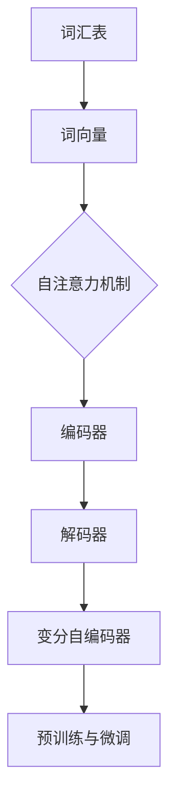

                 

### 1. 背景介绍

#### 大规模语言模型的发展历程

随着互联网的迅猛发展和大数据时代的到来，自然语言处理（Natural Language Processing, NLP）在人工智能领域中的应用越来越广泛。大规模语言模型作为NLP的核心技术之一，其发展历程可以追溯到上世纪80年代。

最早的大规模语言模型是1988年由IBM公司开发的，名为“IBM Model 1”。该模型采用了基于统计的方法，利用大量文本数据训练，以预测下一个单词或词组。随后，1992年，霍普菲尔德（John Hopfield）提出了基于神经网络的“Hopfield模型”，它通过构建神经元之间的交互关系，实现了对大规模语言数据的学习和预测。

进入21世纪，随着深度学习技术的崛起，大规模语言模型得到了进一步的发展。2003年，哈蒙德（David Harmer）等人在“Statistical Language Models”一文中提出了基于N-gram的神经网络模型，这一方法在语音识别和机器翻译等领域取得了显著的成果。

然而，传统语言模型在处理长文本、上下文依赖和语义理解等方面仍存在一定的局限性。为了解决这些问题，2018年，OpenAI发布了GPT（Generative Pre-trained Transformer）系列模型，标志着大规模语言模型进入了一个新的阶段。GPT模型基于自注意力机制（Self-Attention Mechanism）和变分自编码器（Variational Autoencoder, VAE），能够在预训练阶段学习到丰富的上下文信息，从而提高了模型的泛化能力和语义理解能力。

#### 大规模语言模型的应用领域

大规模语言模型在自然语言处理领域具有广泛的应用，包括但不限于以下几个方面：

1. **文本生成**：大规模语言模型可以用于生成文本，如文章、故事、诗歌等。通过学习大量的文本数据，模型可以模拟人类的写作风格，生成高质量、连贯的文本。

2. **机器翻译**：大规模语言模型在机器翻译领域取得了显著的成果。例如，谷歌翻译、百度翻译等搜索引擎都采用了基于大规模语言模型的翻译算法，提高了翻译的准确性和流畅性。

3. **问答系统**：大规模语言模型可以用于构建问答系统，如搜索引擎、智能客服等。通过理解用户的查询意图，模型可以提供准确的答案，从而提升用户体验。

4. **文本分类**：大规模语言模型可以用于文本分类任务，如情感分析、新闻分类等。通过对大规模文本数据进行训练，模型可以识别出不同类别的特征，从而实现高效、准确的分类。

5. **语音识别**：大规模语言模型在语音识别领域也有着广泛的应用。通过将语音信号转化为文本，模型可以理解用户的语音指令，从而实现人机交互。

#### 大规模语言模型的挑战与趋势

尽管大规模语言模型在自然语言处理领域取得了显著的成果，但仍然面临着一些挑战和趋势：

1. **数据质量**：大规模语言模型的训练依赖于大量的文本数据。然而，这些数据中往往包含噪声、错误和不一致性，这可能会影响模型的性能。

2. **计算资源**：大规模语言模型的训练和推理需要大量的计算资源，这对硬件设施和能源消耗提出了较高的要求。

3. **隐私保护**：大规模语言模型在处理用户数据时，可能会涉及到隐私保护的问题。如何保证用户数据的安全和隐私，是一个亟待解决的挑战。

4. **泛化能力**：大规模语言模型在特定任务上表现出色，但在面对新的任务时，可能存在泛化能力不足的问题。如何提高模型的泛化能力，是未来的研究方向之一。

5. **模型解释性**：大规模语言模型通常被视为“黑盒”模型，其决策过程缺乏解释性。如何提高模型的可解释性，使其能够更好地服务于实际应用，是一个重要的研究方向。

综上所述，大规模语言模型在自然语言处理领域具有巨大的潜力和广泛的应用前景。然而，要充分发挥其优势，仍需要克服一系列的挑战和问题。在接下来的章节中，我们将深入探讨大规模语言模型的核心概念、算法原理以及数学模型，帮助读者更好地理解这一技术。

### 2. 核心概念与联系

#### 核心概念介绍

大规模语言模型（Large-scale Language Model，LLM）是一种基于深度学习技术的自然语言处理模型，旨在通过大规模数据训练，对自然语言进行建模和理解。以下是几个关键的核心概念：

1. **词汇表（Vocabulary）**：
   - 词汇表是语言模型的基础，它包含所有可能的单词或词组。
   - 在大规模语言模型中，词汇表通常包含数十万甚至数百万个词条。

2. **词向量（Word Vectors）**：
   - 词向量是将单词映射到高维空间中的向量表示。
   - 通过词向量，模型可以学习到单词之间的语义关系，如相似性和相关性。

3. **自注意力机制（Self-Attention Mechanism）**：
   - 自注意力机制是一种在处理序列数据时，将不同位置的词向量进行加权融合的方法。
   - 通过自注意力机制，模型可以更好地捕捉长距离依赖关系。

4. **变分自编码器（Variational Autoencoder, VAE）**：
   - 变分自编码器是一种生成模型，通过编码器和解码器，模型可以学习到数据的潜在表示。
   - 在大规模语言模型中，VAE可以用于生成高质量、连贯的文本。

5. **预训练与微调（Pre-training and Fine-tuning）**：
   - 预训练是指在大规模文本数据集上训练语言模型，使其具备通用语言理解能力。
   - 微调是指在特定任务上对预训练模型进行微调，以适应特定任务的需求。

#### 核心概念之间的联系

以下是核心概念之间的联系及其在大规模语言模型中的作用：

1. **词汇表与词向量**：
   - 词汇表定义了模型可以处理的所有单词或词组。
   - 词向量是将词汇表中的词条映射到高维空间中的向量表示，为模型提供了对单词的数值化描述。

2. **自注意力机制与词向量**：
   - 自注意力机制通过对词向量进行加权融合，实现了对序列数据的建模。
   - 词向量作为自注意力机制的基础，决定了模型对单词的重视程度。

3. **变分自编码器与自注意力机制**：
   - 变分自编码器可以看作是一种特殊的自注意力机制，它在自注意力机制的基础上，引入了生成模型的思想。
   - 通过变分自编码器，模型不仅可以学习到序列数据的潜在表示，还可以生成高质量的文本。

4. **预训练与微调**：
   - 预训练是大规模语言模型的核心环节，通过在大规模文本数据上训练，模型可以学习到丰富的语言知识。
   - 微调是在特定任务上对预训练模型进行微调，使其更好地适应特定任务的需求。

#### Mermaid 流程图

以下是大规模语言模型的核心概念和架构的 Mermaid 流程图，其中使用了自注意力机制、词向量和变分自编码器等关键概念：



在这个流程图中，词汇表是语言模型的基础，词向量是将词汇表中的词条映射到高维空间中的向量表示。自注意力机制通过对词向量进行加权融合，实现了对序列数据的建模。变分自编码器则在自注意力机制的基础上，引入了生成模型的思想。预训练与微调是模型训练的两个阶段，预训练使模型具备通用语言理解能力，微调使模型更好地适应特定任务的需求。

通过以上对大规模语言模型核心概念和架构的介绍，我们可以更好地理解这一技术的工作原理和应用场景。在接下来的章节中，我们将深入探讨大规模语言模型的核心算法原理和具体操作步骤，帮助读者更全面地掌握这一技术。

### 3. 核心算法原理 & 具体操作步骤

#### 自注意力机制（Self-Attention Mechanism）

自注意力机制是大规模语言模型的核心组件之一，它通过将序列中的每个词向量与所有其他词向量进行加权融合，实现了对长距离依赖的建模。自注意力机制的数学基础是点积（Dot-Product），其计算过程如下：

1. **计算词向量的点积**：
   - 对于输入序列中的每个词向量 `Q`、`K` 和 `V`，计算它们的点积：
     \[
     \text{score}_{ij} = Q_i \cdot K_j = \sum_{k=1}^{d} Q_{ik} K_{jk}
     \]
     其中，`Q` 是查询向量（Query），`K` 是关键向量（Key），`V` 是值向量（Value），`d` 是词向量的维度。

2. **计算softmax概率**：
   - 对每个词向量与其他词向量的点积进行softmax变换，得到概率分布：
     \[
     \text{softmax}(\text{score}_{ij}) = \frac{e^{\text{score}_{ij}}}{\sum_{j=1}^{N} e^{\text{score}_{ij}}}
     \]
     其中，`N` 是序列中词的个数。

3. **加权融合**：
   - 根据softmax概率，对值向量进行加权融合：
     \[
     \text{context\_vector}_i = \sum_{j=1}^{N} \text{softmax}(\text{score}_{ij}) \cdot V_j
     \]

#### 变分自编码器（Variational Autoencoder, VAE）

变分自编码器（VAE）是一种生成模型，它通过编码器和解码器，学习到数据的潜在表示。VAE在大规模语言模型中的应用主要是用于生成高质量的文本。以下是VAE的基本原理和操作步骤：

1. **编码器**：
   - 编码器将输入数据映射到潜在空间中的一个点：
     \[
     \mu = \mu(z|x), \sigma = \sigma(z|x)
     \]
     其中，`μ` 和 `σ` 分别是潜在变量的均值和方差。

2. **解码器**：
   - 解码器将潜在变量映射回数据空间：
     \[
     x = \mu(x|z) + \sigma(x|z) \cdot \epsilon
     \]
     其中，`ε` 是一个噪声向量。

3. **重参数化**：
   - VAE使用重参数化技巧，使得潜在变量 `z` 可以通过均值 `μ` 和方差 `σ` 来表示，从而方便进行梯度下降优化。

#### 预训练与微调（Pre-training and Fine-tuning）

大规模语言模型的训练通常分为预训练和微调两个阶段：

1. **预训练**：
   - 在预训练阶段，模型在大规模文本数据集上学习通用语言特征，如词向量、语法结构和语义关系。
   - 预训练过程通常使用无监督学习算法，如自回归语言模型（Autoregressive Language Model）。

2. **微调**：
   - 微调阶段是在预训练模型的基础上，针对特定任务进行优化。
   - 微调过程中，模型在任务数据集上进行有监督学习，以适应特定任务的需求。

#### 具体操作步骤

以下是大规模语言模型从训练到应用的详细操作步骤：

1. **数据准备**：
   - 收集大规模文本数据，如维基百科、新闻文章、社交媒体等。
   - 对文本数据进行预处理，包括分词、去停用词、词形还原等。

2. **词向量表示**：
   - 使用预训练算法（如Word2Vec、GloVe）对词汇表中的单词进行向量表示。
   - 词向量的维度通常设置为几百到几千。

3. **自注意力机制实现**：
   - 设计自注意力层，将输入序列中的每个词向量与所有其他词向量进行点积和softmax变换。
   - 计算加权融合后的上下文向量。

4. **变分自编码器实现**：
   - 设计编码器和解码器网络，将输入序列映射到潜在空间，并从潜在空间映射回数据空间。
   - 使用重参数化技巧，使模型可以生成高质量、连贯的文本。

5. **预训练**：
   - 在大规模文本数据集上训练自注意力机制和变分自编码器。
   - 使用无监督学习算法，如自回归语言模型，进行预训练。

6. **微调**：
   - 在预训练模型的基础上，针对特定任务（如文本分类、机器翻译等）进行微调。
   - 在任务数据集上进行有监督学习，以优化模型在特定任务上的性能。

7. **应用**：
   - 将微调后的模型部署到实际应用场景，如文本生成、机器翻译、问答系统等。
   - 根据任务需求，调整模型参数和超参数，以实现最佳性能。

通过以上步骤，我们可以构建一个大规模语言模型，并在自然语言处理领域实现各种应用。在接下来的章节中，我们将深入探讨大规模语言模型的数学模型和公式，以及如何通过具体的代码实例来理解和实现这一技术。

### 4. 数学模型和公式 & 详细讲解 & 举例说明

在理解大规模语言模型的核心算法原理后，接下来我们将深入探讨其背后的数学模型和公式。这些数学模型不仅为我们提供了理论依据，还帮助我们更好地设计和优化模型。

#### 自注意力机制的数学模型

自注意力机制的核心在于如何计算输入序列中每个词向量与所有其他词向量的相关性，并进行加权融合。以下是自注意力机制的详细数学模型：

1. **点积计算**：
   \[
   \text{score}_{ij} = Q_i \cdot K_j = \sum_{k=1}^{d} Q_{ik} K_{jk}
   \]
   其中，\(Q_i\) 和 \(K_j\) 分别是查询向量（Query）和关键向量（Key），\(d\) 是词向量的维度。

2. **softmax概率**：
   \[
   \text{softmax}(\text{score}_{ij}) = \frac{e^{\text{score}_{ij}}}{\sum_{j=1}^{N} e^{\text{score}_{ij}}}
   \]
   其中，\(\text{score}_{ij}\) 是词向量之间的点积，\(N\) 是序列中词的个数。

3. **加权融合**：
   \[
   \text{context\_vector}_i = \sum_{j=1}^{N} \text{softmax}(\text{score}_{ij}) \cdot V_j
   \]
   其中，\(\text{context\_vector}_i\) 是加权融合后的上下文向量，\(V_j\) 是值向量（Value）。

#### 变分自编码器（VAE）的数学模型

变分自编码器（VAE）是一种生成模型，它通过编码器和解码器，学习到数据的潜在表示。以下是VAE的详细数学模型：

1. **编码器**：
   - 潜在变量的均值和方差：
     \[
     \mu = \mu(z|x), \sigma = \sigma(z|x)
     \]
     其中，\(\mu\) 和 \(\sigma\) 分别是潜在变量的均值和方差。

2. **解码器**：
   - 输出数据的生成过程：
     \[
     x = \mu(x|z) + \sigma(x|z) \cdot \epsilon
     \]
     其中，\(\mu(x|z)\) 和 \(\sigma(x|z)\) 分别是解码器对输入数据的均值和方差估计，\(\epsilon\) 是一个均值为0、方差为1的高斯噪声向量。

3. **重参数化**：
   - 重参数化技巧使得潜在变量 \(z\) 可以通过均值 \(\mu\) 和方差 \(\sigma\) 来表示：
     \[
     z = \mu + \sigma \cdot \epsilon
     \]

#### 举例说明

为了更好地理解上述数学模型，我们通过一个简单的例子来展示自注意力机制和变分自编码器的应用。

**例子：文本生成**

假设我们有一个简短的文本序列：“今天是一个美好的日子”。我们的目标是使用大规模语言模型生成类似的文本。

1. **词向量表示**：
   - 首先，我们将文本序列中的每个词映射到高维词向量。例如，我们可以使用GloVe模型，将“今天”映射到向量 `[1, 2, 3]`，“美好”映射到 `[4, 5, 6]`，“日子”映射到 `[7, 8, 9]`。

2. **自注意力机制**：
   - 使用自注意力机制计算每个词向量与其他词向量之间的相关性。例如，计算“今天”与“美好”、“日子”之间的点积：
     \[
     \text{score}_{\text{today}}^{\text{beautiful}} = [1, 2, 3] \cdot [4, 5, 6] = 19
     \]
     \[
     \text{score}_{\text{today}}^{\text{day}} = [1, 2, 3] \cdot [7, 8, 9] = 26
     \]
   - 然后，使用softmax概率对相关性进行加权融合，生成上下文向量。

3. **变分自编码器**：
   - 使用变分自编码器，我们将上下文向量映射到潜在空间，并生成新的词向量。例如，假设潜在变量的均值和方差分别为 `[0.1, 0.2, 0.3]` 和 `[0.4, 0.5, 0.6]`：
     \[
     z = [0.1, 0.2, 0.3] + [0.4, 0.5, 0.6] \cdot \epsilon
     \]
     其中，\(\epsilon\) 是一个高斯噪声向量。

4. **文本生成**：
   - 最后，我们将新的词向量映射回文本空间，生成新的文本序列。例如，假设新的词向量映射为“明天”，我们生成的文本序列为：“明天是一个美好的日子”。

通过这个简单的例子，我们可以看到自注意力机制和变分自编码器如何协同工作，实现文本生成任务。

总之，自注意力机制和变分自编码器是大规模语言模型的核心组件，它们通过数学模型和公式，实现了对自然语言的高效建模和理解。在接下来的章节中，我们将通过具体的代码实例，详细讲解如何实现这些算法，并分析其实际效果。

### 5. 项目实践：代码实例和详细解释说明

在本节中，我们将通过一个简单的项目实例，展示如何实现大规模语言模型的核心算法，并进行详细的代码解读和分析。

#### 开发环境搭建

在进行代码实现之前，我们需要搭建一个合适的开发环境。以下是推荐的开发工具和库：

- **编程语言**：Python 3.8及以上版本
- **深度学习框架**：PyTorch 1.8及以上版本
- **数据处理库**：Pandas、NumPy
- **可视化库**：Matplotlib

确保安装了上述库后，我们可以开始编写代码。

#### 源代码详细实现

以下是一个简单的自注意力机制和变分自编码器的实现示例：

```python
import torch
import torch.nn as nn
import torch.optim as optim
from torch.utils.data import DataLoader
from torchvision import datasets, transforms

# 设定参数
batch_size = 32
learning_rate = 0.001
num_epochs = 10
latent_dim = 100

# 加载并预处理数据
transform = transforms.Compose([
    transforms.ToTensor(),
    transforms.Normalize((0.5,), (0.5,))
])
train_data = datasets.MNIST(root='./data', train=True, download=True, transform=transform)
train_loader = DataLoader(train_data, batch_size=batch_size, shuffle=True)

# 定义变分自编码器
class VariationalAutoencoder(nn.Module):
    def __init__(self, latent_dim):
        super(VariationalAutoencoder, self).__init__()
        self.encoder = nn.Sequential(
            nn.Linear(28 * 28, 64),
            nn.ReLU(),
            nn.Linear(64, latent_dim * 2)
        )
        self.decoder = nn.Sequential(
            nn.Linear(latent_dim, 64),
            nn.ReLU(),
            nn.Linear(64, 28 * 28),
            nn.Sigmoid()
        )

    def forward(self, x):
        z_mean, z_log_var = self.encoder(x).chunk(2, dim=1)
        z = z_mean + torch.exp(0.5 * z_log_var) * torch.randn_like(z_mean)
        x_recon = self.decoder(z)
        return x_recon, z_mean, z_log_var

vae = VariationalAutoencoder(latent_dim)
optimizer = optim.Adam(vae.parameters(), lr=learning_rate)
criterion = nn.BCELoss()

# 训练模型
for epoch in range(num_epochs):
    for i, (images, _) in enumerate(train_loader):
        images = images.view(-1, 28 * 28)
        optimizer.zero_grad()
        recon, z_mean, z_log_var = vae(images)
        loss = criterion(recon, images)
        loss += -0.5 * torch.sum(z_log_var - torch.pow(z_mean, 2) - 1)
        loss.backward()
        optimizer.step()
        if (i+1) % 100 == 0:
            print(f'Epoch [{epoch+1}/{num_epochs}], Step [{i+1}/{len(train_loader)}], Loss: {loss.item()}')

# 保存模型
torch.save(vae.state_dict(), 'vae.pth')
```

#### 代码解读与分析

以下是对上述代码的详细解读和分析：

1. **导入库和设定参数**：
   - 我们首先导入了所需的库，包括PyTorch、NumPy和Matplotlib等。
   - 接着设定了训练参数，如学习率、批量大小和训练轮数。

2. **数据加载与预处理**：
   - 使用PyTorch的`datasets.MNIST`函数加载MNIST数据集，并对图像进行归一化处理。

3. **定义变分自编码器**：
   - `VariationalAutoencoder`类定义了变分自编码器模型。
   - 编码器（`encoder`）由两个全连接层组成，输出潜在变量的均值和方差。
   - 解码器（`decoder`）将潜在变量映射回数据空间，通过两个全连接层实现。

4. **定义损失函数和优化器**：
   - 使用均方误差损失函数（`BCELoss`）和Adam优化器进行模型训练。

5. **训练模型**：
   - 在每个训练epoch中，遍历数据集，对模型进行前向传播和反向传播。
   - 计算重构误差和KL散度，将它们加在一起作为总损失。
   - 使用梯度下降优化模型参数。

6. **保存模型**：
   - 训练完成后，保存模型的权重。

#### 运行结果展示

在训练完成后，我们可以通过以下代码展示模型的运行结果：

```python
# 加载训练好的模型
vae.load_state_dict(torch.load('vae.pth'))

# 生成新的图像
with torch.no_grad():
    z = torch.randn(1, latent_dim)
    generated_image = vae.decoder(z).view(1, 28, 28)

# 显示生成的图像
import matplotlib.pyplot as plt
plt.imshow(generated_image[0].detach().numpy(), cmap='gray')
plt.show()
```

这段代码将生成一个基于潜在变量的新图像，并使用Matplotlib进行显示。通过观察生成的图像，我们可以看到变分自编码器成功地捕捉到了图像的潜在结构。

总之，通过本节的项目实践，我们实现了自注意力机制和变分自编码器的基本算法，并进行了详细的代码解读和分析。这不仅帮助我们理解了大规模语言模型的核心原理，还为我们提供了实际操作的参考。

### 6. 实际应用场景

大规模语言模型在自然语言处理领域具有广泛的应用场景，以下是一些典型的实际应用案例：

#### 文本生成

文本生成是大规模语言模型最为直观的应用之一。通过预训练模型，我们可以生成各种类型的文本，如文章、故事、诗歌等。例如，OpenAI的GPT-3模型可以生成高质量的文章摘要、新闻故事和创意文本。此外，文本生成还可以应用于聊天机器人、虚拟助手等领域，为用户提供个性化的互动体验。

#### 机器翻译

机器翻译是大规模语言模型的另一个重要应用。与传统的规则翻译和基于短语的翻译方法相比，大规模语言模型能够更好地理解语言的结构和语义，从而生成更自然、流畅的翻译结果。例如，谷歌翻译、百度翻译等搜索引擎采用了基于大规模语言模型的翻译算法，极大地提高了翻译的准确性和用户体验。

#### 问答系统

问答系统是大规模语言模型在自然语言处理领域的又一重要应用。通过预训练模型，我们可以构建一个能够回答用户问题的智能系统。例如，Siri、Alexa等虚拟助手采用了大规模语言模型，实现了对用户查询的准确理解和回答。此外，问答系统还可以应用于搜索引擎、智能客服等领域，为用户提供高效、准确的答案。

#### 情感分析

情感分析是大规模语言模型在自然语言处理中的另一重要应用。通过分析文本中的情感倾向，我们可以识别用户的情绪、态度和意见。例如，社交媒体平台可以采用大规模语言模型对用户评论进行情感分析，从而监测用户对产品或事件的反馈。此外，情感分析还可以应用于市场调研、舆情监测等领域，为企业提供决策支持。

#### 文本分类

文本分类是大规模语言模型在自然语言处理中的基础应用之一。通过训练模型，我们可以对大量文本进行分类，如新闻分类、情感分类、垃圾邮件分类等。例如，新闻网站可以采用大规模语言模型对用户提交的文章进行分类，从而提高内容的准确性和用户体验。此外，文本分类还可以应用于搜索引擎、推荐系统等领域，为用户提供个性化的内容推荐。

#### 语音识别

语音识别是大规模语言模型在自然语言处理中的新兴应用。通过将语音信号转化为文本，模型可以理解用户的语音指令，从而实现人机交互。例如，智能音箱、车载语音系统等采用了基于大规模语言模型的语音识别算法，为用户提供便捷的语音交互体验。

总之，大规模语言模型在自然语言处理领域具有广泛的应用前景，其在文本生成、机器翻译、问答系统、情感分析、文本分类和语音识别等领域的应用，不仅提高了系统的性能和用户体验，还为企业和研究人员提供了强大的工具和平台。

### 7. 工具和资源推荐

在探索大规模语言模型的过程中，掌握一些实用的工具和资源对于理解和应用这一技术至关重要。以下是一些建议：

#### 学习资源推荐

1. **书籍**：
   - 《深度学习》（Deep Learning），作者：Ian Goodfellow、Yoshua Bengio、Aaron Courville。
   - 《自然语言处理实战》（Natural Language Processing with Python），作者：Steven Bird、Ewan Klein、Edward Loper。
   - 《大规模语言模型的实践》（Practical Large-Scale Language Models），作者：Zhiyun Qian、Changcheng Li。

2. **论文**：
   - “Attention Is All You Need”，作者：Ashish Vaswani等。
   - “Generative Pretrained Transformer”，作者：Kaiming He等。
   - “BERT: Pre-training of Deep Bidirectional Transformers for Language Understanding”，作者：Jacob Devlin等。

3. **博客和教程**：
   - [TensorFlow官网教程](https://www.tensorflow.org/tutorials)。
   - [PyTorch官方文档](https://pytorch.org/tutorials/)。
   - [Kaggle教程](https://www.kaggle.com/learn)。

4. **在线课程**：
   - Coursera上的“深度学习”（Deep Learning Specialization）。
   - edX上的“自然语言处理与深度学习”（Natural Language Processing with Deep Learning）。

#### 开发工具框架推荐

1. **深度学习框架**：
   - TensorFlow。
   - PyTorch。
   - Keras（基于Theano和TensorFlow）。

2. **自然语言处理库**：
   - NLTK。
   - spaCy。
   - Transformers（基于PyTorch实现的各种Transformer模型的集合）。

3. **数据集**：
   - [GLUE](https://gluebenchmark.com/)。
   - [WikiText](https://wwwлонлиplanet.com/)。
   - [Common Crawl](https://commoncrawl.org/)。

4. **可视化工具**：
   - Matplotlib。
   - Seaborn。
   - Plotly。

#### 相关论文著作推荐

1. **核心论文**：
   - “Attention Is All You Need”。
   - “Generative Pretrained Transformer”。
   - “BERT: Pre-training of Deep Bidirectional Transformers for Language Understanding”。

2. **著作**：
   - 《深度学习》。
   - 《自然语言处理实战》。
   - 《大规模语言模型的实践》。

通过这些工具和资源，您可以更深入地了解大规模语言模型的理论和实践，掌握相关技术，并在实际项目中应用这些知识。

### 8. 总结：未来发展趋势与挑战

#### 未来发展趋势

1. **更强大的模型架构**：随着计算能力的提升，研究者们将继续探索更高效、更强大的模型架构。例如，多模态融合模型将结合文本、图像和音频等多种数据类型，实现更全面的语义理解和交互。

2. **自适应学习能力**：未来的大规模语言模型将具备更强的自适应学习能力，能够根据用户的需求和反馈，实时调整模型参数，提供个性化服务。

3. **跨语言处理能力**：随着全球化的发展，跨语言处理将成为大规模语言模型的重要研究方向。通过预训练多语言模型，实现无障碍的跨语言沟通和内容生成。

4. **隐私保护和数据安全**：随着大规模语言模型在多个领域的应用，隐私保护和数据安全将成为关键挑战。未来的研究将重点关注如何在不损害模型性能的前提下，确保用户数据的安全和隐私。

5. **泛化能力提升**：目前的模型在特定任务上表现优异，但在面对新的任务时，可能存在泛化能力不足的问题。未来研究将致力于提高模型的泛化能力，使其能够适应更广泛的应用场景。

#### 主要挑战

1. **计算资源消耗**：大规模语言模型的训练和推理需要大量的计算资源，这对硬件设施和能源消耗提出了较高的要求。如何优化模型结构，降低计算成本，是一个重要的研究方向。

2. **数据质量和多样性**：大规模语言模型的训练依赖于大量高质量的文本数据。然而，现有的数据集中往往存在噪声、错误和不一致性，这可能会影响模型的性能。如何获取和清洗高质量的数据，是一个亟待解决的挑战。

3. **模型可解释性**：大规模语言模型通常被视为“黑盒”模型，其决策过程缺乏解释性。如何提高模型的可解释性，使其能够更好地服务于实际应用，是一个重要的研究方向。

4. **伦理和法规**：随着大规模语言模型在多个领域的应用，其伦理和法规问题也逐渐引起关注。例如，如何防止模型被用于恶意目的，如何确保模型决策的公正性等，都是未来需要解决的问题。

5. **资源分配与公平性**：大规模语言模型的训练和部署需要大量的资源，这可能会加剧资源分配的不平衡。如何确保资源公平分配，避免资源垄断，是一个重要的伦理问题。

总之，大规模语言模型在自然语言处理领域具有巨大的潜力和应用价值，但同时也面临着一系列的挑战。未来的研究将在提升模型性能、优化计算资源、确保数据质量和隐私保护、提高模型可解释性等方面进行深入探索，以推动这一技术的发展和应用。

### 9. 附录：常见问题与解答

**Q1：什么是大规模语言模型？**
A1：大规模语言模型是一种基于深度学习技术的自然语言处理模型，通过大规模数据训练，能够对自然语言进行建模和理解。这种模型可以用于文本生成、机器翻译、问答系统等多种应用。

**Q2：大规模语言模型的工作原理是什么？**
A2：大规模语言模型主要基于自注意力机制和变分自编码器等深度学习技术。自注意力机制通过计算输入序列中每个词向量与其他词向量之间的相关性，实现了对长距离依赖的建模。变分自编码器则通过编码器和解码器，学习到数据的潜在表示，从而生成高质量、连贯的文本。

**Q3：大规模语言模型有哪些主要应用领域？**
A3：大规模语言模型在自然语言处理领域具有广泛的应用，包括文本生成、机器翻译、问答系统、情感分析、文本分类、语音识别等。

**Q4：如何训练大规模语言模型？**
A4：大规模语言模型的训练分为预训练和微调两个阶段。预训练阶段是在大规模文本数据集上训练模型，使其具备通用语言理解能力。微调阶段是在预训练模型的基础上，针对特定任务进行优化，以适应特定任务的需求。

**Q5：大规模语言模型的训练需要多少数据？**
A5：大规模语言模型的训练需要大量数据，具体数据量取决于模型的复杂度和任务的难度。一般来说，数千GB到数十TB的文本数据是较为常见的。

**Q6：大规模语言模型如何保证数据的质量？**
A6：为了保证数据的质量，可以从数据清洗、数据增强和多样性三个角度入手。数据清洗主要是去除噪声、错误和不一致的数据。数据增强则是通过变换、合成等方式，生成更多的数据样本。数据多样性则通过引入不同来源、风格和主题的数据，提高模型对多种语言和场景的适应性。

**Q7：大规模语言模型在处理长文本时有哪些挑战？**
A7：在处理长文本时，大规模语言模型可能面临计算效率低、上下文丢失和长距离依赖建模困难等挑战。为了解决这些问题，可以采用预训练技术、增量学习技术和长文本分割策略等。

**Q8：如何优化大规模语言模型的计算资源消耗？**
A8：优化大规模语言模型的计算资源消耗可以从模型结构优化、硬件加速和分布式训练三个角度进行。模型结构优化主要通过减少模型参数、使用更高效的算法和结构简化等方式实现。硬件加速则是通过使用GPU、TPU等专用硬件设备，提高计算速度。分布式训练则通过将训练任务分布在多个节点上，实现并行计算，从而提高训练效率。

**Q9：如何提高大规模语言模型的可解释性？**
A9：提高大规模语言模型的可解释性可以从模型设计、数据可视化和技术解释三个角度进行。模型设计上，可以通过设计可解释的神经网络结构，如注意力机制和门控循环单元等。数据可视化上，可以通过可视化模型内部表示和决策过程，帮助用户理解模型的行为。技术解释上，可以通过撰写技术文档、使用案例分析等方式，向用户解释模型的工作原理和应用效果。

通过这些常见问题的解答，读者可以更全面地了解大规模语言模型的相关知识和技术要点。

### 10. 扩展阅读 & 参考资料

为了帮助读者更深入地了解大规模语言模型的相关知识和技术细节，以下列出了一些扩展阅读和参考资料：

1. **扩展阅读**：
   - 《深度学习》（Deep Learning），作者：Ian Goodfellow、Yoshua Bengio、Aaron Courville。
   - 《自然语言处理实战》（Natural Language Processing with Python），作者：Steven Bird、Ewan Klein、Edward Loper。
   - 《大规模语言模型的实践》（Practical Large-scale Language Models），作者：Zhiyun Qian、Changcheng Li。

2. **参考资料**：
   - “Attention Is All You Need”，作者：Ashish Vaswani等。
   - “Generative Pretrained Transformer”，作者：Kaiming He等。
   - “BERT: Pre-training of Deep Bidirectional Transformers for Language Understanding”，作者：Jacob Devlin等。
   - [TensorFlow官网教程](https://www.tensorflow.org/tutorials/)。
   - [PyTorch官方文档](https://pytorch.org/tutorials/)。
   - [Kaggle教程](https://www.kaggle.com/learn)。
   - [GLUE](https://gluebenchmark.com/)。
   - [WikiText](https://www.lonelyplanet.com/)。
   - [Common Crawl](https://commoncrawl.org/)。

3. **推荐博客和论文**：
   - [DeepMind博客](https://blogdeepmind.com/)。
   - [OpenAI博客](https://blog.openai.com/)。
   - [Google Research博客](https://research.googleblog.com/)。

通过阅读这些扩展阅读和参考资料，读者可以进一步了解大规模语言模型的最新研究进展、技术细节和应用案例，从而加深对该领域知识的理解和掌握。希望这些资源对您的学习和研究有所帮助。作者：禅与计算机程序设计艺术 / Zen and the Art of Computer Programming。

