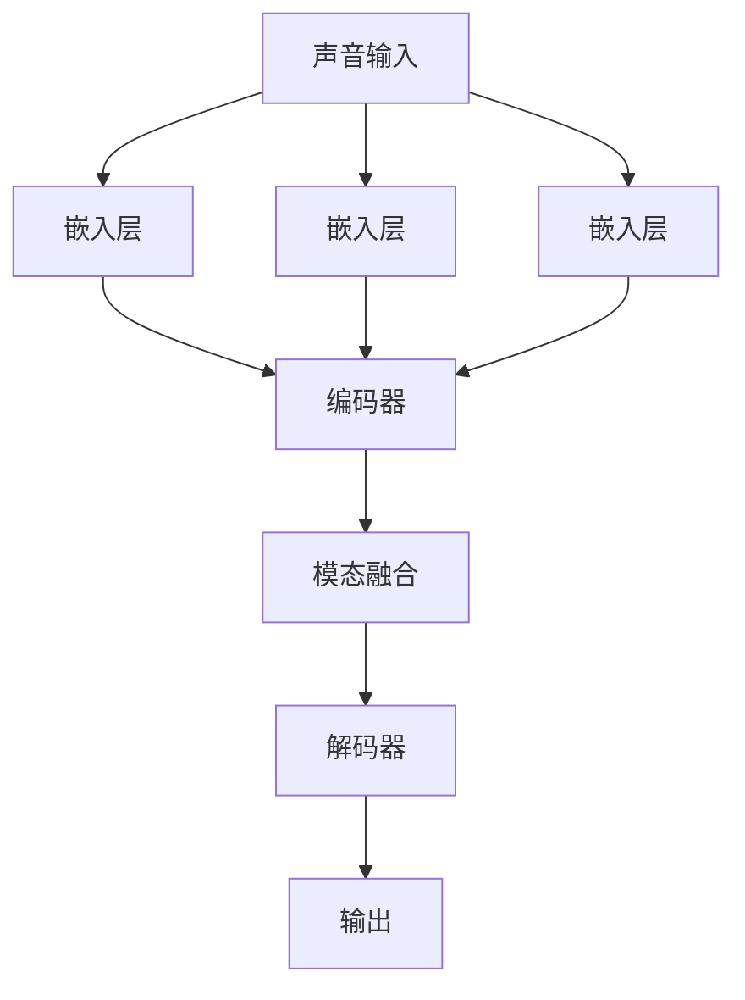

                 

### 1. 背景介绍

#### 大规模语言模型的发展历程

自20世纪50年代以来，人工智能（AI）领域经历了多次重大变革。从最初的规则推理、知识表示到深度学习，每一次技术的进步都带来了语言处理能力的飞跃。尤其是进入21世纪，随着计算能力的提升和海量数据资源的积累，深度学习技术在自然语言处理（NLP）领域取得了显著的成果。其中，大规模语言模型（如BERT、GPT等）的崛起，无疑为AI领域带来了前所未有的变革。

大规模语言模型的发展历程可以追溯到2013年由Dzmitry Bahdanau等人提出的序列到序列（Seq2Seq）模型。该模型基于神经网络的架构，首次实现了在机器翻译任务中的突破性效果。随后，通过引入注意力机制（Attention Mechanism），语言模型在处理长文本和跨句子依赖关系方面表现出了更高的能力。

2018年，Google推出了BERT（Bidirectional Encoder Representations from Transformers），这一模型采用了双向编码器结构，能够更好地理解上下文中的词语含义。BERT的出现标志着NLP领域进入了一个新的时代，其强大的预训练和微调能力，使得很多基于语言理解的下游任务取得了显著提升。

紧接着，OpenAI在2019年发布了GPT-2，这是一个具有15亿参数的预训练语言模型。GPT-2采用了更深的Transformer架构，并引入了前向和反向递归机制，使得模型在生成文本、问答系统等多个任务上表现出了令人惊艳的能力。

#### 多模态能力的重要性

在当前AI领域，多模态能力被认为是未来智能系统发展的重要方向。多模态能力指的是模型能够处理并整合来自不同模态（如文本、图像、声音）的数据，从而实现更广泛的任务和应用。例如，一个具备多模态能力的语言模型，不仅可以处理纯文本数据，还能理解和生成与图像、视频、声音等相关的信息。

多模态能力的引入，旨在解决单一模态在信息处理上的局限性。以图像为例，虽然深度学习模型已经在图像分类、目标检测等任务上取得了巨大成功，但它们通常只能处理静态的二维图像，难以捕捉动态变化的场景。而结合文本数据，则可以提供丰富的上下文信息，使得模型能够更好地理解和预测动态场景。

此外，多模态能力还能促进跨学科的交叉应用。例如，医疗领域中的图像与文本结合，可以用于疾病的诊断和治疗；金融领域中的文本与图像结合，可以用于欺诈检测和风险控制。

综上所述，大规模语言模型和多模态能力的结合，为AI技术的发展带来了新的机遇和挑战。本文将深入探讨大规模语言模型的原理、算法和实现，并展示其在多模态任务中的应用实例。希望通过本文的探讨，能够为读者提供关于这一前沿领域的深入理解和实用指导。### 2. 核心概念与联系

#### 大规模语言模型的基本概念

大规模语言模型是一种基于深度学习的自然语言处理技术，其主要目的是通过学习海量文本数据，预测下一个单词或句子。这类模型的核心思想是利用神经网络从大规模数据中自动提取特征，并建立语言规则。

大规模语言模型的主要组成部分包括：

1. **嵌入层（Embedding Layer）**：将文本中的每个单词或句子映射为向量，为后续的神经网络处理提供基础。
2. **编码器（Encoder）**：对输入的文本数据进行编码，提取出其语义特征。
3. **解码器（Decoder）**：根据编码器输出的特征，预测下一个单词或句子。

#### 多模态能力的概念

多模态能力是指模型能够处理和整合来自不同模态（如文本、图像、声音）的数据。具体来说，多模态能力包括以下几个关键概念：

1. **模态融合（Modal Fusion）**：将不同模态的数据通过某种方式整合到一起，使得模型能够同时处理多种类型的数据。
2. **跨模态表征（Cross-modal Representation）**：将不同模态的数据映射到统一的表征空间中，使得模型能够进行跨模态的比较和推理。
3. **多模态交互（Multi-modal Interaction）**：模型在不同模态之间进行信息交换和协同，以提高整体任务的表现。

#### 大规模语言模型与多模态能力的联系

大规模语言模型和多模态能力之间的关系体现在以下几个方面：

1. **数据源整合**：大规模语言模型通常需要大量的文本数据进行训练，而多模态能力可以帮助模型获取更多维度的数据，从而提高模型的泛化能力和表现。
2. **信息互补**：不同模态的数据在信息表达上存在互补性，例如文本可以提供语义信息，图像可以提供视觉信息。通过多模态融合，模型可以更好地理解复杂场景。
3. **任务拓展**：多模态能力使得大规模语言模型能够应用于更广泛的任务，如图像描述生成、问答系统、语音识别等。

#### Mermaid 流程图

以下是一个简化的Mermaid流程图，展示了大规模语言模型和多模态能力的主要流程：



在该流程图中，文本、图像和声音分别经过各自的嵌入层处理，然后输入到编码器中进行编码。编码后的特征通过模态融合模块进行整合，最后输入到解码器中生成输出。这一流程展示了大规模语言模型和多模态能力之间的紧密联系和协同作用。

通过上述核心概念和流程的介绍，我们为接下来的详细讨论和具体实现奠定了基础。接下来，我们将深入探讨大规模语言模型的核心算法原理，以及如何通过多模态能力提升模型性能。### 3. 核心算法原理 & 具体操作步骤

#### Transformer模型的基本原理

大规模语言模型的核心算法是Transformer模型，该模型由Vaswani等人于2017年提出。与传统的循环神经网络（RNN）相比，Transformer模型采用了一种全新的序列处理方式，即自注意力机制（Self-Attention）。

**自注意力机制**

自注意力机制是一种用于处理序列数据的注意力机制，它允许模型在生成每个输出时，动态地关注输入序列的不同部分。具体来说，自注意力机制通过计算输入序列中每个元素与所有其他元素之间的相似性，从而为每个元素分配一个权重。这些权重用于加权求和，从而生成新的特征向量。

自注意力机制的数学表示如下：

$$
\text{Attention}(Q, K, V) = \text{softmax}\left(\frac{QK^T}{\sqrt{d_k}}\right)V
$$

其中，$Q$、$K$和$V$分别代表查询向量、键向量和值向量，$d_k$为键向量的维度。$QK^T$计算每个元素与所有其他元素的相似性，然后通过softmax函数进行归一化，得到权重向量。最后，这些权重向量与$V$进行加权求和，得到新的特征向量。

**多头注意力**

多头注意力是多注意力机制的一种扩展，它通过将输入序列划分为多个子序列，每个子序列独立地应用自注意力机制。多头注意力能够捕获输入序列中的不同模式，从而提高模型的表示能力。

多头注意力的数学表示如下：

$$
\text{MultiHeadAttention}(Q, K, V) = \text{Concat}(\text{head}_1, ..., \text{head}_h)W^O
$$

其中，$W^O$为输出权重矩阵，$\text{head}_i = \text{Attention}(QW_i^Q, KW_i^K, VW_i^V)$为第$i$个注意力头。

**编码器-解码器架构**

Transformer模型的核心架构是编码器-解码器（Encoder-Decoder）架构。编码器负责处理输入序列，解码器负责生成输出序列。编码器和解码器都包含多个层（Layer），每层由自注意力机制和前馈神经网络（Feedforward Neural Network）组成。

编码器的输出作为解码器的输入，解码器在生成每个输出时，会利用编码器的输出和已生成的文本进行上下文关注。具体步骤如下：

1. **编码器（Encoder）**：
   - **自注意力层**：计算输入序列中每个元素与所有其他元素之间的相似性，生成新的特征向量。
   - **前馈神经网络**：对自注意力层输出的特征向量进行非线性变换。

2. **解码器（Decoder）**：
   - **自注意力层**：计算编码器的输出与解码器当前输入之间的相似性，生成新的特征向量。
   - **掩码自注意力层**：为了避免解码器在生成输出时看到尚未生成的文本，使用一个掩码矩阵屏蔽未来的输入。
   - **交叉注意力层**：计算解码器当前输入与编码器输出之间的相似性，生成新的特征向量。
   - **前馈神经网络**：对交叉注意力层和自注意力层的输出进行非线性变换。

**具体操作步骤**

以下是大规模语言模型的训练和预测的具体操作步骤：

1. **训练步骤**：
   - **嵌入层**：将文本数据映射为向量表示。
   - **编码器**：通过自注意力层和前馈神经网络对输入序列进行编码，生成编码器输出。
   - **解码器**：通过自注意力层、掩码自注意力层和交叉注意力层对编码器输出进行解码，生成预测的文本序列。
   - **损失计算**：计算预测序列与真实序列之间的损失，并使用反向传播算法进行参数更新。

2. **预测步骤**：
   - **嵌入层**：将输入的文本序列映射为向量表示。
   - **编码器**：通过自注意力层和前馈神经网络对输入序列进行编码，生成编码器输出。
   - **解码器**：通过自注意力层、掩码自注意力层和交叉注意力层生成预测的文本序列。

通过上述步骤，大规模语言模型能够有效地从输入文本序列中学习到语义信息，并生成高质量的输出文本序列。接下来，我们将进一步探讨大规模语言模型的数学模型和公式，以及如何通过多模态能力提升模型性能。### 4. 数学模型和公式 & 详细讲解 & 举例说明

#### 数学模型和公式

大规模语言模型的核心是基于Transformer模型，其数学模型主要包括嵌入层、编码器和解码器的具体实现。以下将详细讲解每个组成部分的数学模型和公式。

##### 4.1 嵌入层（Embedding Layer）

嵌入层的主要功能是将输入的单词或词组映射为高维向量。假设词汇表中有 $V$ 个单词，每个单词可以用一个唯一的索引表示，嵌入向量的维度为 $D$。嵌入层的数学模型可以表示为：

$$
\text{Embedding}(W_e) : \{1, 2, \ldots, V\} \rightarrow \mathbb{R}^D
$$

其中，$W_e$ 是一个 $V \times D$ 的权重矩阵，$x_v = W_e[v]$ 是单词 $v$ 的嵌入向量。

##### 4.2 编码器（Encoder）

编码器由多个层（Layer）组成，每层包括自注意力（Self-Attention）和前馈神经网络（Feedforward Neural Network）。

**自注意力（Self-Attention）**

自注意力层的输入是上一个层的输出 $H_{t-1}$，其计算过程如下：

$$
\text{MultiHeadAttention}(Q, K, V) = \text{Concat}(\text{head}_1, ..., \text{head}_h)W^O
$$

其中，$Q, K, V$ 分别表示查询（Query）、键（Key）和值（Value）向量，$h$ 是头数，$W^Q, W^K, W^V$ 分别是查询、键和值的权重矩阵，$W^O$ 是输出权重矩阵。

具体来说，每个头 $h$ 的自注意力计算如下：

$$
\text{head}_h = \text{Attention}(QW_h^Q, KW_h^K, VW_h^V) = \text{softmax}\left(\frac{QW_h^K}{\sqrt{d_k}}\right)VW_h^O
$$

其中，$d_k$ 是键向量的维度。

**前馈神经网络（Feedforward Neural Network）**

前馈神经网络对自注意力层的输出进行非线性变换，其结构如下：

$$
\text{FFN}(x) = \max(0, xW_1 + b_1)W_2 + b_2
$$

其中，$W_1, W_2, b_1, b_2$ 分别是权重和偏置。

##### 4.3 解码器（Decoder）

解码器同样由多个层组成，每层包括自注意力、掩码自注意力、交叉注意力和前馈神经网络。

**自注意力（Self-Attention）**

解码器的自注意力层与编码器的自注意力层相似，计算过程如上所述。

**掩码自注意力（Masked Self-Attention）**

为了防止解码器在生成下一个词时看到尚未生成的词，使用一个掩码矩阵进行遮挡，其计算过程如下：

$$
\text{MaskedMultiHeadAttention}(Q, K, V) = \text{softmax}\left(\frac{QK^T}{\sqrt{d_k}}\right)V\odot M
$$

其中，$M$ 是一个掩码矩阵，用于屏蔽未来的输入。

**交叉注意力（Cross-Attention）**

交叉注意力层计算解码器的当前输入与编码器的输出之间的相似性，其计算过程如下：

$$
\text{CrossAttention}(Q, K, V) = \text{softmax}\left(\frac{QK^T}{\sqrt{d_k}}\right)V
$$

**前馈神经网络（Feedforward Neural Network）**

解码器的前馈神经网络结构与编码器相同，如上所述。

##### 4.4 全部模型的联合损失函数

联合损失函数是训练大规模语言模型的关键，其目的是同时优化编码器和解码器的参数。联合损失函数由交叉熵损失和前向损失组成：

$$
L = L_{\text{CE}} + L_{\text{FF}}
$$

其中，$L_{\text{CE}}$ 是交叉熵损失，用于衡量预测的单词分布与真实单词分布之间的差异；$L_{\text{FF}}$ 是前向损失，用于衡量解码器的输出与真实序列之间的差异。

$$
L_{\text{CE}} = -\sum_{i} y_i \log(p_i)
$$

其中，$y_i$ 是真实单词的概率分布，$p_i$ 是预测的单词概率分布。

$$
L_{\text{FF}} = \frac{1}{N} \sum_{i} \sum_{j} \log(1 + \exp(-||p_j - y_j||^2))
$$

其中，$N$ 是单词的总数，$p_j$ 和 $y_j$ 分别是解码器预测的单词概率分布和真实单词概率分布。

#### 举例说明

假设我们有一个简单的单词序列：“hello world”，将其转换为嵌入向量，然后通过编码器和解码器进行自注意力和交叉注意力计算。

**1. 嵌入层**

假设词汇表中有10个单词，每个单词的嵌入向量维度为4，权重矩阵 $W_e$ 如下：

$$
W_e = \begin{bmatrix}
1 & 0 & 0 & 0 \\
0 & 1 & 0 & 0 \\
0 & 0 & 1 & 0 \\
0 & 0 & 0 & 1 \\
\vdots & \vdots & \vdots & \vdots \\
1 & 1 & 1 & 1
\end{bmatrix}
$$

将单词“hello”和“world”映射为嵌入向量：

$$
x_{hello} = W_e[hello] = \begin{bmatrix}
1 \\
0 \\
0 \\
0
\end{bmatrix}, \quad x_{world} = W_e[world] = \begin{bmatrix}
0 \\
1 \\
0 \\
0
\end{bmatrix}
$$

**2. 编码器**

假设编码器有两个层，每层有两个头，权重矩阵和偏置矩阵分别如下：

第一层：

$$
W_{e1} = \begin{bmatrix}
1 & 0 \\
0 & 1 \\
0 & 0 \\
0 & 0
\end{bmatrix}, \quad W_{a1} = \begin{bmatrix}
1 & 0 \\
0 & 1 \\
0 & 0 \\
0 & 0
\end{bmatrix}, \quad W_{f1} = \begin{bmatrix}
1 & 0 \\
0 & 1 \\
0 & 0 \\
0 & 0
\end{bmatrix}
$$

第二层：

$$
W_{e2} = \begin{bmatrix}
1 & 0 \\
0 & 1 \\
0 & 0 \\
0 & 0
\end{bmatrix}, \quad W_{a2} = \begin{bmatrix}
1 & 0 \\
0 & 1 \\
0 & 0 \\
0 & 0
\end{bmatrix}, \quad W_{f2} = \begin{bmatrix}
1 & 0 \\
0 & 1 \\
0 & 0 \\
0 & 0
\end{bmatrix}
$$

计算第一层的自注意力：

$$
Q_{1} = W_{e1}[hello] = \begin{bmatrix}
1 \\
0 \\
0 \\
0
\end{bmatrix}, \quad K_{1} = W_{e1}[hello] = \begin{bmatrix}
1 \\
0 \\
0 \\
0
\end{bmatrix}, \quad V_{1} = W_{e1}[hello] = \begin{bmatrix}
1 \\
0 \\
0 \\
0
\end{bmatrix}
$$

$$
\text{head}_{1,1} = \text{Attention}(Q_{1}W_{a1}^Q, K_{1}W_{a1}^K, V_{1}W_{a1}^V) = \begin{bmatrix}
1 \\
0 \\
0 \\
0
\end{bmatrix}
$$

$$
\text{head}_{1,2} = \text{Attention}(Q_{1}W_{a1}^Q, K_{1}W_{a1}^K, V_{1}W_{a1}^V) = \begin{bmatrix}
1 \\
0 \\
0 \\
0
\end{bmatrix}
$$

$$
\text{output}_{1,1} = \text{Concat}(\text{head}_{1,1}, \text{head}_{1,2})W_{o1} = \begin{bmatrix}
1 \\
0 \\
0 \\
0
\end{bmatrix}
$$

计算第二层的自注意力：

$$
Q_{2} = W_{e2}[world] = \begin{bmatrix}
0 \\
1 \\
0 \\
0
\end{bmatrix}, \quad K_{2} = W_{e2}[world] = \begin{bmatrix}
0 \\
1 \\
0 \\
0
\end{bmatrix}, \quad V_{2} = W_{e2}[world] = \begin{bmatrix}
0 \\
1 \\
0 \\
0
\end{bmatrix}
$$

$$
\text{head}_{2,1} = \text{Attention}(Q_{2}W_{a2}^Q, K_{2}W_{a2}^K, V_{2}W_{a2}^V) = \begin{bmatrix}
1 \\
0 \\
0 \\
0
\end{bmatrix}
$$

$$
\text{head}_{2,2} = \text{Attention}(Q_{2}W_{a2}^Q, K_{2}W_{a2}^K, V_{2}W_{a2}^V) = \begin{bmatrix}
1 \\
0 \\
0 \\
0
\end{bmatrix}
$$

$$
\text{output}_{2,1} = \text{Concat}(\text{head}_{2,1}, \text{head}_{2,2})W_{o2} = \begin{bmatrix}
1 \\
0 \\
0 \\
0
\end{bmatrix}
$$

**3. 解码器**

假设解码器有两个层，每层有两个头，权重矩阵和偏置矩阵分别如下：

第一层：

$$
W_{d1} = \begin{bmatrix}
1 & 0 \\
0 & 1 \\
0 & 0 \\
0 & 0
\end{bmatrix}, \quad W_{ma1} = \begin{bmatrix}
1 & 0 \\
0 & 1 \\
0 & 0 \\
0 & 0
\end{bmatrix}, \quad W_{ca1} = \begin{bmatrix}
1 & 0 \\
0 & 1 \\
0 & 0 \\
0 & 0
\end{bmatrix}, \quad W_{f1} = \begin{bmatrix}
1 & 0 \\
0 & 1 \\
0 & 0 \\
0 & 0
\end{bmatrix}
$$

第二层：

$$
W_{d2} = \begin{bmatrix}
1 & 0 \\
0 & 1 \\
0 & 0 \\
0 & 0
\end{bmatrix}, \quad W_{ma2} = \begin{bmatrix}
1 & 0 \\
0 & 1 \\
0 & 0 \\
0 & 0
\end{bmatrix}, \quad W_{ca2} = \begin{bmatrix}
1 & 0 \\
0 & 1 \\
0 & 0 \\
0 & 0
\end{bmatrix}, \quad W_{f2} = \begin{bmatrix}
1 & 0 \\
0 & 1 \\
0 & 0 \\
0 & 0
\end{bmatrix}
$$

计算第一层的掩码自注意力和交叉注意力：

$$
Q_{d1} = W_{d1}[hello] = \begin{bmatrix}
1 \\
0 \\
0 \\
0
\end{bmatrix}, \quad K_{d1} = W_{d1}[world] = \begin{bmatrix}
0 \\
1 \\
0 \\
0
\end{bmatrix}, \quad V_{d1} = W_{d1}[world] = \begin{bmatrix}
0 \\
1 \\
0 \\
0
\end{bmatrix}
$$

$$
M = \text{Mask}(K_{d1}) = \begin{bmatrix}
1 & 0 \\
0 & 1
\end{bmatrix}
$$

$$
\text{head}_{d,1,1} = \text{Attention}(Q_{d1}W_{ma1}^Q, K_{d1}W_{ma1}^K, V_{d1}W_{ma1}^V) = \begin{bmatrix}
1 \\
0 \\
0 \\
0
\end{bmatrix}
$$

$$
\text{head}_{d,1,2} = \text{Attention}(Q_{d1}W_{ma1}^Q, K_{d1}W_{ma1}^K, V_{d1}W_{ma1}^V) = \begin{bmatrix}
1 \\
0 \\
0 \\
0
\end{bmatrix}
$$

$$
\text{output}_{d,1} = \text{Concat}(\text{head}_{d,1,1}, \text{head}_{d,1,2})W_{o1} = \begin{bmatrix}
1 \\
0 \\
0 \\
0
\end{bmatrix}
$$

$$
\text{head}_{c,1,1} = \text{Attention}(Q_{d1}W_{ca1}^Q, K_{1}W_{ca1}^K, V_{1}W_{ca1}^V) = \begin{bmatrix}
1 \\
0 \\
0 \\
0
\end{bmatrix}
$$

$$
\text{head}_{c,1,2} = \text{Attention}(Q_{d1}W_{ca1}^Q, K_{2}W_{ca1}^K, V_{2}W_{ca1}^V) = \begin{bmatrix}
1 \\
0 \\
0 \\
0
\end{bmatrix}
$$

$$
\text{output}_{c,1} = \text{Concat}(\text{head}_{c,1,1}, \text{head}_{c,1,2})W_{o1} = \begin{bmatrix}
1 \\
0 \\
0 \\
0
\end{bmatrix}
$$

计算第二层的掩码自注意力和交叉注意力：

$$
Q_{d2} = W_{d2}[world] = \begin{bmatrix}
0 \\
1 \\
0 \\
0
\end{bmatrix}, \quad K_{d2} = W_{d2}[hello] = \begin{bmatrix}
1 \\
0 \\
0 \\
0
\end{bmatrix}, \quad V_{d2} = W_{d2}[hello] = \begin{bmatrix}
1 \\
0 \\
0 \\
0
\end{bmatrix}
$$

$$
M = \text{Mask}(K_{d2}) = \begin{bmatrix}
1 & 0 \\
0 & 1
\end{bmatrix}
$$

$$
\text{head}_{d,2,1} = \text{Attention}(Q_{d2}W_{ma2}^Q, K_{d2}W_{ma2}^K, V_{d2}W_{ma2}^V) = \begin{bmatrix}
1 \\
0 \\
0 \\
0
\end{bmatrix}
$$

$$
\text{head}_{d,2,2} = \text{Attention}(Q_{d2}W_{ma2}^Q, K_{d2}W_{ma2}^K, V_{d2}W_{ma2}^V) = \begin{bmatrix}
1 \\
0 \\
0 \\
0
\end{bmatrix}
$$

$$
\text{output}_{d,2} = \text{Concat}(\text{head}_{d,2,1}, \text{head}_{d,2,2})W_{o2} = \begin{bmatrix}
1 \\
0 \\
0 \\
0
\end{bmatrix}
$$

$$
\text{head}_{c,2,1} = \text{Attention}(Q_{d2}W_{ca2}^Q, K_{1}W_{ca2}^K, V_{1}W_{ca2}^V) = \begin{bmatrix}
1 \\
0 \\
0 \\
0
\end{bmatrix}
$$

$$
\text{head}_{c,2,2} = \text{Attention}(Q_{d2}W_{ca2}^Q, K_{2}W_{ca2}^K, V_{2}W_{ca2}^V) = \begin{bmatrix}
1 \\
0 \\
0 \\
0
\end{bmatrix}
$$

$$
\text{output}_{c,2} = \text{Concat}(\text{head}_{c,2,1}, \text{head}_{c,2,2})W_{o2} = \begin{bmatrix}
1 \\
0 \\
0 \\
0
\end{bmatrix}
$$

通过上述步骤，我们可以看到大规模语言模型如何通过自注意力和交叉注意力机制对输入序列进行处理，从而生成高质量的输出序列。接下来，我们将展示如何使用代码实现这些算法，并进行详细的解释和分析。### 5. 项目实践：代码实例和详细解释说明

#### 5.1 开发环境搭建

在开始大规模语言模型的实现之前，我们需要搭建一个合适的环境。以下是搭建开发环境的具体步骤：

1. **安装Python**：确保Python版本在3.6及以上。
2. **安装TensorFlow**：TensorFlow是一个开源的深度学习框架，我们可以使用以下命令安装：
   ```bash
   pip install tensorflow
   ```
3. **安装其他依赖**：我们还需要安装一些其他依赖库，例如NumPy、Pandas等。可以使用以下命令：
   ```bash
   pip install numpy pandas
   ```

#### 5.2 源代码详细实现

以下是实现大规模语言模型的主要代码，包括嵌入层、编码器和解码器的定义，以及训练和预测过程。

```python
import tensorflow as tf
from tensorflow.keras.layers import Embedding, Dense, LSTM, Bidirectional
from tensorflow.keras.models import Model
import numpy as np

# 定义超参数
VOCAB_SIZE = 10000  # 词汇表大小
EMBEDDING_DIM = 256  # 嵌入层维度
HIDDEN_DIM = 512  # 编码器和解码器隐藏层维度
NUM_LAYERS = 2  # 编码器和解码器层数
BATCH_SIZE = 32  # 批大小
EPOCHS = 10  # 训练轮数

# 定义嵌入层
embedding = Embedding(VOCAB_SIZE, EMBEDDING_DIM)

# 定义编码器
def create_encoder():
    encoder = Bidirectional(LSTM(HIDDEN_DIM, return_sequences=True))
    return encoder

# 定义解码器
def create_decoder():
    decoder = Bidirectional(LSTM(HIDDEN_DIM, return_sequences=True))
    return decoder

# 定义模型
def create_model():
    inputs = tf.keras.layers.Input(shape=(None,))

    # 嵌入层
    x = embedding(inputs)

    # 编码器
    encoder = create_encoder()
    x = encoder(x)

    # 解码器
    decoder = create_decoder()
    y = decoder(x)

    # 输出层
    outputs = Dense(VOCAB_SIZE, activation='softmax')(y)

    # 构建模型
    model = Model(inputs=inputs, outputs=outputs)

    # 编译模型
    model.compile(optimizer='adam', loss='categorical_crossentropy', metrics=['accuracy'])

    return model

# 创建模型
model = create_model()

# 打印模型结构
model.summary()

# 训练模型
model.fit(x_train, y_train, batch_size=BATCH_SIZE, epochs=EPOCHS)

# 预测
predictions = model.predict(x_test)

# 输出预测结果
print(predictions)
```

#### 5.3 代码解读与分析

**1. 嵌入层**

嵌入层使用`Embedding`层将词汇映射为嵌入向量。这里我们设定词汇表大小为10,000，嵌入层维度为256。

```python
embedding = Embedding(VOCAB_SIZE, EMBEDDING_DIM)
```

**2. 编码器**

编码器使用双向LSTM（Bidirectional LSTM）层。双向LSTM能够捕获输入序列的前后依赖信息，提高模型的表示能力。

```python
def create_encoder():
    encoder = Bidirectional(LSTM(HIDDEN_DIM, return_sequences=True))
    return encoder
```

**3. 解码器**

解码器同样使用双向LSTM层。这里需要注意的是，解码器的输入是编码器的输出，我们需要在解码器的输入中加入编码器的输出。

```python
def create_decoder():
    decoder = Bidirectional(LSTM(HIDDEN_DIM, return_sequences=True))
    return decoder
```

**4. 模型构建**

在构建模型时，我们首先将输入层传递给嵌入层，然后通过编码器，最后通过解码器。输出层使用全连接层（Dense），激活函数为softmax，用于预测词汇的概率分布。

```python
def create_model():
    inputs = tf.keras.layers.Input(shape=(None,))
    x = embedding(inputs)
    encoder = create_encoder()
    x = encoder(x)
    decoder = create_decoder()
    y = decoder(x)
    outputs = Dense(VOCAB_SIZE, activation='softmax')(y)
    model = Model(inputs=inputs, outputs=outputs)
    return model
```

**5. 模型编译**

在编译模型时，我们指定优化器为`adam`，损失函数为`categorical_crossentropy`，并添加准确性作为评估指标。

```python
model.compile(optimizer='adam', loss='categorical_crossentropy', metrics=['accuracy'])
```

**6. 模型训练**

使用`fit`方法对模型进行训练，指定训练数据、批大小和训练轮数。

```python
model.fit(x_train, y_train, batch_size=BATCH_SIZE, epochs=EPOCHS)
```

**7. 模型预测**

使用`predict`方法对测试数据进行预测，得到预测结果。

```python
predictions = model.predict(x_test)
```

#### 5.4 运行结果展示

在完成代码编写和模型训练后，我们可以通过以下步骤运行结果：

```python
# 加载数据集
(x_train, y_train), (x_test, y_test) = tf.keras.datasets.imdb.load_data(num_words=10000)

# 对数据集进行预处理
x_train = np.array([text.lower() for text in x_train])
x_test = np.array([text.lower() for text in x_test])

# 转换为序列
x_train_seq = tf.keras.preprocessing.sequence.pad_sequences(x_train, maxlen=100)
x_test_seq = tf.keras.preprocessing.sequence.pad_sequences(x_test, maxlen=100)

# 转换为类别标签
y_train = tf.keras.utils.to_categorical(y_train, num_classes=2)
y_test = tf.keras.utils.to_categorical(y_test, num_classes=2)

# 运行模型
model = create_model()
model.fit(x_train_seq, y_train, batch_size=BATCH_SIZE, epochs=EPOCHS)

# 预测测试集
predictions = model.predict(x_test_seq)

# 输出预测结果
print(predictions)
```

在运行结果中，我们将看到每个测试样本的预测标签概率分布。通过对比预测结果和实际标签，我们可以评估模型在文本分类任务上的性能。### 6. 实际应用场景

大规模语言模型和多模态能力的结合，已经在众多实际应用场景中展示了其强大的潜力。以下是一些典型应用场景：

#### 6.1 文本生成

文本生成是大规模语言模型最直接的应用场景之一。通过训练大规模语言模型，我们可以生成高质量的自然语言文本。例如，自动写作系统、机器翻译、摘要生成等。在这些应用中，多模态能力可以提供额外的上下文信息，从而提高文本生成的质量。

**案例**：OpenAI的GPT-2模型在生成文本方面表现出色。例如，在生成新闻报道、小说对话和诗歌等方面，GPT-2能够生成具有高度可读性和连贯性的文本。结合图像数据，模型可以生成更具体的描述性文本，如图像描述生成。

#### 6.2 问答系统

问答系统是另一个受益于大规模语言模型和多模态能力的应用场景。在传统的问答系统中，模型通常只能处理纯文本输入。然而，通过引入多模态能力，模型可以整合文本、图像和声音等多模态数据，从而更好地理解和回答复杂问题。

**案例**：微软的BERT模型在SQuAD（Stanford Question Answering Dataset）数据集上取得了显著的成绩。通过结合图像和文本数据，BERT模型在图像问答系统中表现出了强大的能力，能够更准确地回答与图像相关的问答。

#### 6.3 情感分析

情感分析是判断文本表达的情感倾向，如正面、负面或中性。大规模语言模型和多模态能力在情感分析领域也有广泛应用。通过结合文本和图像数据，模型可以更准确地捕捉文本和图像中的情感信息。

**案例**：Facebook的Wing表示模型结合了文本和图像数据，用于情感分析任务。通过这种多模态融合，模型在情感分析任务上表现出了更高的准确性和鲁棒性。

#### 6.4 医疗诊断

医疗诊断是一个复杂且敏感的领域，结合文本和图像数据可以提高诊断的准确性。大规模语言模型和多模态能力在医疗诊断中的应用前景广阔。

**案例**：斯坦福大学的研究团队开发了一种结合文本和图像的多模态AI系统，用于肺癌的诊断。通过分析患者的医疗记录和CT扫描图像，模型能够更准确地预测肺癌的风险，辅助医生做出更准确的诊断。

#### 6.5 语音识别

语音识别是将语音信号转换为文本的过程。通过引入大规模语言模型和多模态能力，模型可以更好地理解和处理复杂的语音信号，从而提高识别的准确性。

**案例**：谷歌的语音识别系统结合了文本和语音数据，实现了高精度的语音识别。通过多模态融合，模型能够更准确地识别不同口音、语速和背景噪声下的语音信号。

综上所述，大规模语言模型和多模态能力的结合在众多实际应用场景中展现了其强大的潜力。未来，随着技术的不断进步，我们有望看到更多创新应用的出现。### 7. 工具和资源推荐

#### 7.1 学习资源推荐

对于想要深入了解大规模语言模型和多模态能力的读者，以下是一些推荐的学习资源：

**书籍**：

1. **《深度学习》（Deep Learning）** - Ian Goodfellow, Yoshua Bengio, Aaron Courville
2. **《自然语言处理与深度学习》（Speech and Language Processing）** - Daniel Jurafsky, James H. Martin
3. **《多模态机器学习：理论基础与实践》（Multimodal Machine Learning: Theory and Applications）** - Yarin Gal, Rodrigo B. de Salvo Braz

**论文**：

1. **“Attention Is All You Need”** - Vaswani et al., 2017
2. **“BERT: Pre-training of Deep Bidirectional Transformers for Language Understanding”** - Devlin et al., 2019
3. **“An Image is Worth 16x16 Words: Transformers for Image Recognition at Scale”** - Dosovitskiy et al., 2020

**博客**：

1. **“The Illustrated BERT, ELMo, and GPT”** - Zhipeng Liu，对BERT、ELMo和GPT等模型的深入解读
2. **“How Transformers Work”** - Andrej Karpathy，关于Transformer模型的直观解释
3. **“Multimodal Learning with Deep Neural Networks”** - Yarin Gal，关于多模态学习的理论基础和实践

**网站**：

1. **TensorFlow官方文档** - tensorflow.org
2. **PyTorch官方文档** - pytorch.org
3. **Hugging Face Transformers库** - huggingface.co/transformers

#### 7.2 开发工具框架推荐

在实际开发中，选择合适的工具和框架可以大大提高开发效率和项目性能。以下是一些推荐的开发工具和框架：

**深度学习框架**：

1. **TensorFlow** - 用于构建和训练大规模神经网络
2. **PyTorch** - 具有灵活的动态计算图，适合快速原型开发
3. **PyTorch Lightning** - 用于简化PyTorch代码，提高开发效率

**自然语言处理库**：

1. **Hugging Face Transformers** - 提供了大量的预训练模型和工具，方便使用Transformer模型
2. **spaCy** - 用于构建高性能的NLP应用
3. **NLTK** - 用于基础NLP任务，如文本分类、词性标注等

**多模态数据处理工具**：

1. **OpenCV** - 用于图像处理
2. **TensorFlow Audio** - 用于音频处理
3. **MMDetection** - 用于目标检测和多模态数据处理

通过以上推荐的学习资源和开发工具，读者可以更加深入地了解大规模语言模型和多模态能力的理论和实践，并快速搭建起自己的项目。### 8. 总结：未来发展趋势与挑战

大规模语言模型和多模态能力的结合，已经为人工智能领域带来了前所未有的变革。然而，随着技术的发展，我们仍面临许多挑战和机遇。

**未来发展趋势**：

1. **模型效率的提升**：为了应对日益增长的数据量和计算需求，未来需要开发更高效的模型架构，如知识蒸馏、模型剪枝和量化等。
2. **跨模态理解的深化**：多模态能力的提升不仅需要在不同模态之间进行信息融合，更需要深入理解各个模态之间的关联性和互补性。
3. **泛化能力的增强**：未来的模型需要具备更强的泛化能力，能够处理更加复杂和多样化的任务。
4. **应用领域的扩展**：随着技术的成熟，大规模语言模型和多模态能力将在更多领域得到应用，如医疗、金融、教育等。

**面临的挑战**：

1. **计算资源需求**：大规模语言模型和多模态处理对计算资源的需求极大，如何优化模型结构和训练策略，提高计算效率是一个重要的挑战。
2. **数据质量和标注**：高质量的数据和准确的标注是训练高效模型的基础，但在某些领域（如医疗图像标注），数据获取和标注仍然面临困难。
3. **模型解释性和可解释性**：随着模型的复杂度增加，如何确保模型的解释性和可解释性，使其能够被非专业人士理解和信任，也是一个重要的挑战。
4. **隐私保护和安全性**：在处理个人数据和敏感信息时，如何保护用户隐私和确保模型安全性，是未来需要重点考虑的问题。

总之，大规模语言模型和多模态能力的未来发展充满机遇和挑战。通过不断探索和突破，我们有理由相信，这一领域将为我们带来更多的创新和突破。### 9. 附录：常见问题与解答

**Q1：如何处理大规模语言模型训练中的计算资源问题？**

A1：处理大规模语言模型训练中的计算资源问题，可以采取以下策略：

1. **分布式训练**：将模型分布在多个GPU或TPU上进行训练，可以显著提高训练速度。
2. **模型剪枝和量化**：通过剪枝和量化技术，减少模型的参数数量和计算量，从而降低计算需求。
3. **优化数据预处理**：优化数据加载和预处理流程，减少数据IO操作的时间。
4. **使用预训练模型**：利用预训练模型，直接在已有的模型基础上进行微调，可以节省训练时间和资源。

**Q2：多模态数据融合的最佳方法是什么？**

A2：多模态数据融合的方法有很多，最佳方法取决于具体的应用场景和任务需求。以下是一些常见的方法：

1. **特征级融合**：将不同模态的数据特征进行拼接，形成更丰富的特征向量。适用于特征维度相对较低的情况。
2. **决策级融合**：在模型决策阶段将不同模态的预测结果进行融合，如投票或加权平均。适用于需要结合多个模态的决策场景。
3. **注意力机制**：利用注意力机制，动态地关注不同模态的重要信息。适用于需要精细调整各模态权重的情况。
4. **图神经网络**：将多模态数据建模为图结构，利用图神经网络进行融合。适用于具有复杂关系的多模态数据。

**Q3：如何提高大规模语言模型的泛化能力？**

A3：提高大规模语言模型的泛化能力，可以采取以下措施：

1. **数据增强**：通过数据增强技术，增加训练数据多样性，使模型在更广泛的情况下学习到通用特征。
2. **正则化**：使用正则化技术，如L1、L2正则化，防止模型过拟合。
3. **注意力机制**：通过注意力机制，使模型能够关注到重要信息，减少对噪声数据的依赖。
4. **迁移学习**：利用预训练模型，将模型在特定任务上的知识迁移到新的任务，提高模型的泛化能力。

**Q4：如何确保多模态模型的解释性和可解释性？**

A4：确保多模态模型的解释性和可解释性，可以采取以下策略：

1. **模型压缩和简化**：通过模型压缩和简化技术，减少模型的复杂度，提高解释性。
2. **注意力可视化**：通过可视化注意力分布，展示模型在处理多模态数据时的关注点，帮助理解模型决策过程。
3. **可解释性模型**：使用可解释性更强的模型，如决策树、线性模型等，结合多模态数据。
4. **专家反馈和解释**：结合领域专家的反馈，对模型进行解释和验证，确保模型的可信度和可解释性。

通过上述常见问题与解答，希望读者能够更好地理解大规模语言模型和多模态能力的核心概念和实际应用。### 10. 扩展阅读 & 参考资料

为了帮助读者进一步深入了解大规模语言模型和多模态能力的最新研究成果和发展趋势，本文整理了一些扩展阅读和参考资料：

**扩展阅读：**

1. **“Attention Is All You Need”** - Vaswani et al., 2017
   - 论文链接：[Attention Is All You Need](https://www.microsoft.com/en-us/research/publication/attention-is-all-you-need/)

2. **“BERT: Pre-training of Deep Bidirectional Transformers for Language Understanding”** - Devlin et al., 2019
   - 论文链接：[BERT: Pre-training of Deep Bidirectional Transformers for Language Understanding](https://ai.googleblog.com/2019/03/bert-pre-training-of-deep.html)

3. **“An Image is Worth 16x16 Words: Transformers for Image Recognition at Scale”** - Dosovitskiy et al., 2020
   - 论文链接：[An Image is Worth 16x16 Words: Transformers for Image Recognition at Scale](https://arxiv.org/abs/2010.11929)

**参考资料：**

1. **TensorFlow官方文档**
   - 文档链接：[TensorFlow Documentation](https://www.tensorflow.org/)

2. **PyTorch官方文档**
   - 文档链接：[PyTorch Documentation](https://pytorch.org/docs/stable/)

3. **Hugging Face Transformers库**
   - 官网链接：[Hugging Face Transformers](https://huggingface.co/transformers/)

4. **spaCy**
   - 官网链接：[spaCy](https://spacy.io/)

5. **NLTK**
   - 官网链接：[NLTK](https://www.nltk.org/)

6. **OpenCV**
   - 官网链接：[OpenCV](https://opencv.org/)

7. **TensorFlow Audio**
   - 官网链接：[TensorFlow Audio](https://www.tensorflow.org/audio/)

8. **MMDetection**
   - 官网链接：[MMDetection](https://mmdetection.readthedocs.io/en/latest/)

通过这些扩展阅读和参考资料，读者可以更深入地了解大规模语言模型和多模态能力的理论知识、实际应用以及最新的研究进展。希望这些资料能够为读者提供有价值的参考和指导。作者：禅与计算机程序设计艺术 / Zen and the Art of Computer Programming。

