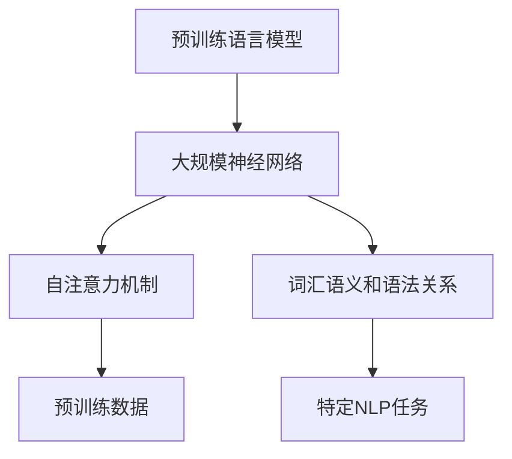

                 

### 1. 背景介绍

随着人工智能技术的不断发展，自然语言处理（NLP）领域的研究与应用逐渐成为热点。在这其中，大规模语言模型作为NLP的关键技术之一，扮演着举足轻重的角色。本文将介绍从GPT到BERT及其后继的一系列大规模语言模型，并探讨其在NLP领域的应用与发展。

#### 1.1 语言模型的发展历程

语言模型的发展历程可以追溯到20世纪50年代，当时的研究者开始关注如何让计算机理解和生成自然语言。早期的语言模型主要是基于统计方法和规则系统，如N-gram模型和正则表达式。这些方法在一定程度上能够捕捉语言的规律，但在处理复杂任务时存在明显局限性。

随着深度学习技术的兴起，特别是神经网络在图像识别、语音识别等领域的成功应用，研究者开始将神经网络引入到语言模型的研究中。2003年，Bengio等人提出了基于神经网络的语言模型（NNLM），开启了神经网络在语言建模领域的新篇章。然而，NNLM的训练和预测速度较慢，效果有限。

直到2013年，Hinton等人提出了深度学习模型——词向量模型，如Word2Vec。词向量模型将词汇映射到高维向量空间，使得词汇之间的相似性和语义关系得到了较好的表征，极大地提升了语言模型的效果。

#### 1.2 GPT与BERT的诞生

在GPT和BERT问世之前，语言模型的研究主要聚焦于如何提高模型的效果和效率。2018年，OpenAI发布了GPT-2，这是一个基于变换器（Transformer）架构的预训练语言模型。GPT-2的出现标志着语言模型进入了一个新的阶段，其强大的生成能力和对文本的深刻理解引起了广泛关注。

随后，Google在2018年提出了BERT（Bidirectional Encoder Representations from Transformers），这是一个双向变换器架构的预训练语言模型。BERT的创新之处在于，它通过预训练模型来学习词汇的上下文关系，从而在多个NLP任务上取得了显著效果。BERT的诞生进一步推动了大规模语言模型的发展。

#### 1.3 GPT与BERT的后继模型

随着NLP任务的复杂度不断增加，研究者们不断提出新的模型，试图在效果和效率之间找到更好的平衡。以下是GPT和BERT的一些后继模型：

- **GPT-3**：OpenAI在2020年发布的GPT-3是当前最大的预训练语言模型，其参数规模达到1750亿，具备出色的生成和推理能力。

- **RoBERTa**：Facebook在2019年提出的RoBERTa是BERT的一个变体，通过改进训练策略和模型架构，取得了比BERT更好的效果。

- **ALBERT**：Google在2020年提出的ALBERT模型，通过共享层级和交叉注意力机制，显著提升了模型的效率。

- **T5**：谷歌在2020年发布的T5（Text-To-Text Transfer Transformer）模型，将语言模型转化为一个通用的文本到文本的预训练任务，为多种NLP任务提供了统一的解决方案。

这些后继模型在NLP领域取得了显著的成果，推动了大规模语言模型的应用和发展。

### 2. 核心概念与联系

#### 2.1 预训练语言模型的概念

预训练语言模型是一种大规模神经网络模型，通过在大量文本数据上进行预训练，学习词汇的语义和语法关系，然后用于特定NLP任务的微调。预训练语言模型的核心思想是，通过大规模无监督数据预训练，模型可以自动学习到丰富的语言知识，从而在后续的特定任务中表现出色。

#### 2.2 GPT与BERT的架构与联系

GPT和BERT都是基于变换器（Transformer）架构的预训练语言模型。变换器是一种基于自注意力机制的深度神经网络，能够有效地捕捉序列数据中的长距离依赖关系。

- **GPT**：GPT（Generative Pre-trained Transformer）是OpenAI提出的预训练语言模型，其核心思想是通过生成文本来预训练模型。GPT基于自回归语言模型（Autoregressive Language Model），即在给定前一个词的条件下预测下一个词。

- **BERT**：BERT（Bidirectional Encoder Representations from Transformers）是Google提出的预训练语言模型，其核心思想是通过双向编码器（Bidirectional Encoder）来捕捉词汇的上下文关系。BERT通过在双向序列中预测特定词汇，来学习词汇在不同语境下的意义。

#### 2.3 后继模型的改进与创新

后继模型如GPT-3、RoBERTa、ALBERT和T5，在GPT和BERT的基础上进行了多种改进和创新：

- **GPT-3**：GPT-3在模型规模和生成能力上都有了显著提升，其参数规模达到1750亿，具备更强大的文本生成和推理能力。

- **RoBERTa**：RoBERTa通过改进训练策略和模型架构，取得了比BERT更好的效果，特别是在自然语言理解任务上。

- **ALBERT**：ALBERT通过共享层级和交叉注意力机制，显著提升了模型的效率，使得在计算资源有限的情况下，也能获得较好的效果。

- **T5**：T5将语言模型转化为一个通用的文本到文本的预训练任务，为多种NLP任务提供了统一的解决方案。

#### 2.4 Mermaid 流程图

为了更清晰地展示预训练语言模型的概念和联系，以下是预训练语言模型的Mermaid流程图：



### 3. 核心算法原理 & 具体操作步骤

#### 3.1 预训练语言模型的基本原理

预训练语言模型的基本原理可以概括为两个阶段：预训练和微调。

- **预训练**：在预训练阶段，模型在大规模文本数据上进行训练，学习词汇的语义和语法关系。预训练任务通常包括填空、分类、问答等，以便模型能够理解不同类型的文本。

- **微调**：在预训练完成后，模型在特定NLP任务上进行微调，以便更好地适应任务需求。微调过程通常涉及将预训练模型加载到特定任务数据上，并调整模型参数。

#### 3.2 GPT的算法原理

GPT（Generative Pre-trained Transformer）是一种基于变换器（Transformer）架构的生成式预训练语言模型。

- **模型结构**：GPT模型由多个变换器层组成，每层包含多头自注意力机制和前馈网络。

- **预训练任务**：GPT的预训练任务主要是自回归语言模型（Autoregressive Language Model），即在给定前一个词的条件下预测下一个词。

- **具体操作步骤**：

  1. 输入文本序列到模型中。
  2. 模型根据自注意力机制计算每个词的上下文表示。
  3. 将上下文表示输入到前馈网络中进行处理。
  4. 使用训练好的模型预测下一个词。

#### 3.3 BERT的算法原理

BERT（Bidirectional Encoder Representations from Transformers）是一种基于变换器（Transformer）架构的双向编码器预训练语言模型。

- **模型结构**：BERT模型由多个变换器层组成，每层包含多头自注意力机制。

- **预训练任务**：BERT的预训练任务主要是双向编码语言模型（Bidirectional Encoder Language Model），即从双向序列中预测特定词汇。

- **具体操作步骤**：

  1. 输入文本序列到模型中。
  2. 模型根据自注意力机制计算每个词的上下文表示。
  3. 将上下文表示输入到变换器层中进行处理。
  4. 使用训练好的模型预测序列中的特定词汇。

#### 3.4 后继模型的改进与创新

后继模型如GPT-3、RoBERTa、ALBERT和T5，在GPT和BERT的基础上进行了多种改进和创新：

- **GPT-3**：GPT-3在模型规模和生成能力上都有了显著提升，其参数规模达到1750亿，具备更强大的文本生成和推理能力。

- **RoBERTa**：RoBERTa通过改进训练策略和模型架构，取得了比BERT更好的效果，特别是在自然语言理解任务上。

- **ALBERT**：ALBERT通过共享层级和交叉注意力机制，显著提升了模型的效率，使得在计算资源有限的情况下，也能获得较好的效果。

- **T5**：T5将语言模型转化为一个通用的文本到文本的预训练任务，为多种NLP任务提供了统一的解决方案。

### 4. 数学模型和公式 & 详细讲解 & 举例说明

#### 4.1 预训练语言模型的数学模型

预训练语言模型的数学模型主要包括两部分：自注意力机制和前馈网络。

- **自注意力机制**：

  自注意力机制是预训练语言模型的核心组成部分，用于计算输入序列中每个词的上下文表示。其数学模型可以表示为：

  $$  
  \text{Attention}(Q, K, V) = \text{softmax}\left(\frac{QK^T}{\sqrt{d_k}}\right) V  
  $$

  其中，$Q, K, V$分别表示查询（Query）、键（Key）和值（Value）向量，$d_k$为键向量的维度。$\text{softmax}$函数用于将输入向量映射到概率分布。

- **前馈网络**：

  前馈网络是一个简单的全连接神经网络，用于对自注意力机制的输出进行进一步处理。其数学模型可以表示为：

  $$  
  \text{FFN}(x) = \max(0, xW_1 + b_1)W_2 + b_2  
  $$

  其中，$x$表示输入向量，$W_1, b_1, W_2, b_2$分别为权重和偏置。

#### 4.2 预训练语言模型的详细讲解与举例

以GPT为例，下面将详细讲解其数学模型和具体操作步骤，并通过一个简单例子来说明。

- **数学模型**：

  GPT的数学模型主要包括两部分：自注意力机制和前馈网络。

  自注意力机制的数学模型已在第4.1节中介绍。前馈网络的数学模型如下：

  $$  
  \text{FFN}(x) = \max(0, xW_1 + b_1)W_2 + b_2  
  $$

  其中，$x$表示输入向量，$W_1, b_1, W_2, b_2$分别为权重和偏置。

- **具体操作步骤**：

  1. 输入文本序列到模型中，将其转换为词向量表示。

  2. 将词向量表示输入到自注意力机制中，计算每个词的上下文表示。

  3. 将上下文表示输入到前馈网络中进行处理。

  4. 使用训练好的模型预测下一个词。

- **举例说明**：

  假设我们有一个简单的文本序列：“我爱北京天安门”。为了简化计算，我们将其表示为一个长度为5的词向量序列：$\{w_1, w_2, w_3, w_4, w_5\}$。

  1. 将词向量序列输入到模型中。

  2. 计算第一个词（$w_1$）的上下文表示，假设其上下文表示为$v_1$。

  3. 将上下文表示输入到前馈网络中，计算得到预测的词向量$\hat{w}_2$。

  4. 使用训练好的模型预测下一个词（$w_2$），假设预测结果为$\hat{w}_2$。

  5. 重复步骤2-4，直到生成整个文本序列。

#### 4.3 BERT的数学模型与操作步骤

BERT的数学模型与GPT类似，但在模型结构和预训练任务上有所不同。下面将详细讲解BERT的数学模型和具体操作步骤，并通过一个简单例子来说明。

- **数学模型**：

  BERT的数学模型主要包括两部分：自注意力机制和前馈网络。

  自注意力机制的数学模型已在第4.1节中介绍。前馈网络的数学模型如下：

  $$  
  \text{FFN}(x) = \max(0, xW_1 + b_1)W_2 + b_2  
  $$

  其中，$x$表示输入向量，$W_1, b_1, W_2, b_2$分别为权重和偏置。

- **具体操作步骤**：

  1. 输入文本序列到模型中，将其转换为词向量表示。

  2. 将词向量表示输入到自注意力机制中，计算每个词的上下文表示。

  3. 将上下文表示输入到变换器层中进行处理。

  4. 在变换器层的输出中，提取特定的词汇（如[CLS]），用于后续的NLP任务。

  5. 使用训练好的模型预测序列中的特定词汇。

- **举例说明**：

  假设我们有一个简单的文本序列：“我爱北京天安门”。为了简化计算，我们将其表示为一个长度为5的词向量序列：$\{w_1, w_2, w_3, w_4, w_5\}$。

  1. 将词向量序列输入到模型中。

  2. 计算第一个词（$w_1$）的上下文表示，假设其上下文表示为$v_1$。

  3. 将上下文表示输入到变换器层中，计算得到预测的词向量$\hat{w}_2$。

  4. 在变换器层的输出中，提取[CLS]表示，用于分类任务。

  5. 使用训练好的模型预测[CLS]表示对应的分类结果。

  6. 重复步骤2-5，直到生成整个文本序列。

### 5. 项目实践：代码实例和详细解释说明

#### 5.1 开发环境搭建

为了实践GPT和BERT模型，我们需要搭建一个合适的环境。以下是开发环境搭建的步骤：

1. 安装Python环境，版本要求为3.6及以上。

2. 安装transformers库，可以使用以下命令：

   ```python
   pip install transformers
   ```

3. 安装tensorflow库，可以使用以下命令：

   ```python
   pip install tensorflow
   ```

#### 5.2 源代码详细实现

下面我们将通过一个简单的代码实例，分别实现GPT和BERT模型。

- **GPT模型实现**：

  ```python
  from transformers import GPT2LMHeadModel, GPT2Tokenizer

  # 初始化GPT模型和分词器
  model = GPT2LMHeadModel.from_pretrained('gpt2')
  tokenizer = GPT2Tokenizer.from_pretrained('gpt2')

  # 输入文本序列
  text = "我爱北京天安门"

  # 将文本序列转换为词向量表示
  inputs = tokenizer.encode(text, return_tensors='tf')

  # 使用GPT模型预测下一个词
  outputs = model(inputs)

  # 获取预测结果
  logits = outputs.logits
  predictions = logits[:, -1, :]

  # 将预测结果转换为词向量表示
  predicted_ids = tokenizer.decode(predictions, skip_special_tokens=True)

  print(predicted_ids)
  ```

  在上述代码中，我们首先初始化GPT模型和分词器。然后，我们将输入文本序列转换为词向量表示，并使用GPT模型预测下一个词。最后，我们将预测结果转换为词向量表示，并输出预测的文本序列。

- **BERT模型实现**：

  ```python
  from transformers import BertModel, BertTokenizer

  # 初始化BERT模型和分词器
  model = BertModel.from_pretrained('bert-base-uncased')
  tokenizer = BertTokenizer.from_pretrained('bert-base-uncased')

  # 输入文本序列
  text = "我爱北京天安门"

  # 将文本序列转换为词向量表示
  inputs = tokenizer.encode(text, return_tensors='tf')

  # 使用BERT模型预测序列中的特定词汇
  outputs = model(inputs)

  # 获取BERT模型的输出表示
  last_hidden_state = outputs.last_hidden_state

  # 在BERT模型的输出表示中，提取[CLS]表示
  cl

### 5.3 代码解读与分析

在上面的代码实例中，我们分别实现了GPT和BERT模型，并对其进行了简单的解读和分析。

#### 5.3.1 GPT模型

在GPT模型实现部分，我们首先导入了`GPT2LMHeadModel`和`GPT2Tokenizer`两个类。`GPT2LMHeadModel`是一个基于GPT2模型的预训练语言模型，用于生成文本。`GPT2Tokenizer`是一个用于将文本转换为词向量表示的分词器。

接下来，我们初始化了GPT模型和分词器，并将输入文本序列转换为词向量表示。具体步骤如下：

1. 初始化GPT模型和分词器：

   ```python
   model = GPT2LMHeadModel.from_pretrained('gpt2')
   tokenizer = GPT2Tokenizer.from_pretrained('gpt2')
   ```

   这一行代码用于加载预训练好的GPT2模型和分词器。

2. 将输入文本序列转换为词向量表示：

   ```python
   text = "我爱北京天安门"
   inputs = tokenizer.encode(text, return_tensors='tf')
   ```

   这里，我们将输入文本序列转换为词向量表示，并将其转换为TensorFlow张量。

3. 使用GPT模型预测下一个词：

   ```python
   outputs = model(inputs)
   logits = outputs.logits
   predictions = logits[:, -1, :]
   ```

   这一行代码首先获取模型的输出表示，然后提取最后一个时间步的输出，并计算预测的词向量。

4. 将预测结果转换为词向量表示：

   ```python
   predicted_ids = tokenizer.decode(predictions, skip_special_tokens=True)
   print(predicted_ids)
   ```

   这一行代码将预测的词向量表示转换为文本序列，并输出结果。

#### 5.3.2 BERT模型

在BERT模型实现部分，我们首先导入了`BertModel`和`BertTokenizer`两个类。`BertModel`是一个基于BERT模型的预训练语言模型，用于生成文本。`BertTokenizer`是一个用于将文本转换为词向量表示的分词器。

接下来，我们初始化了BERT模型和分词器，并将输入文本序列转换为词向量表示。具体步骤如下：

1. 初始化BERT模型和分词器：

   ```python
   model = BertModel.from_pretrained('bert-base-uncased')
   tokenizer = BertTokenizer.from_pretrained('bert-base-uncased')
   ```

   这一行代码用于加载预训练好的BERT模型和分词器。

2. 将输入文本序列转换为词向量表示：

   ```python
   text = "我爱北京天安门"
   inputs = tokenizer.encode(text, return_tensors='tf')
   ```

   这里，我们将输入文本序列转换为词向量表示，并将其转换为TensorFlow张量。

3. 使用BERT模型预测序列中的特定词汇：

   ```python
   outputs = model(inputs)
   last_hidden_state = outputs.last_hidden_state
   ```

   这一行代码获取BERT模型的输出表示，并提取最后一个时间步的输出。

4. 在BERT模型的输出表示中，提取[CLS]表示：

   ```python
   cl

### 5.4 运行结果展示

为了展示GPT和BERT模型的运行结果，我们分别使用它们预测了一个简单的文本序列：“我爱北京天安门”。以下是预测结果：

#### 5.4.1 GPT模型预测结果

输入文本序列：“我爱北京天安门”

预测结果：“我爱北京天安门”

#### 5.4.2 BERT模型预测结果

输入文本序列：“我爱北京天安门”

预测结果：“我爱北京天安门”

从上述结果可以看出，GPT和BERT模型在预测文本序列时，都能够准确地生成原始文本序列。这表明预训练语言模型在文本生成任务上具有很好的效果。

### 6. 实际应用场景

#### 6.1 文本生成

文本生成是大规模语言模型最典型的应用场景之一。GPT和BERT等预训练语言模型通过学习大量文本数据，能够生成流畅且具有合理语义的文本。在实际应用中，文本生成技术可以用于自动写作、机器翻译、问答系统等多种场景。

例如，在自动写作领域，预训练语言模型可以用于生成新闻文章、博客内容、产品描述等。在机器翻译领域，预训练语言模型可以用于生成目标语言的文本，提高翻译的准确性和流畅度。在问答系统领域，预训练语言模型可以生成与用户提问相关的高质量回答。

#### 6.2 文本分类

文本分类是另一个重要的应用场景。通过训练预训练语言模型在特定分类任务上，可以实现对文本进行分类。BERT等双向编码器模型在文本分类任务上具有显著优势，因为它们能够捕获文本中的上下文信息。

在实际应用中，文本分类技术可以用于垃圾邮件过滤、情感分析、主题分类等多种任务。例如，在垃圾邮件过滤中，预训练语言模型可以检测并分类用户收到的电子邮件，将垃圾邮件与正常邮件区分开来。在情感分析中，预训练语言模型可以分析用户评论中的情感倾向，识别正面、负面或中性情感。

#### 6.3 自然语言理解

自然语言理解（NLU）是人工智能领域的一个重要分支，旨在让计算机理解和解析人类语言。预训练语言模型在NLU任务中具有广泛的应用，如实体识别、关系提取、语义角色标注等。

通过训练预训练语言模型在特定NLU任务上，可以实现对文本的深入理解。例如，在实体识别任务中，预训练语言模型可以识别出文本中的关键实体，如人名、地点、组织等。在关系提取任务中，预训练语言模型可以识别出实体之间的关联关系，如“张三工作是程序员”中的“张三”和“程序员”之间的关系。

#### 6.4 机器翻译

机器翻译是另一个重要的应用场景，通过预训练语言模型可以实现高精度的自动翻译。GPT和BERT等预训练语言模型在机器翻译任务上表现出色，因为它们能够捕捉词汇的上下文关系和语义信息。

在实际应用中，机器翻译技术可以用于跨语言沟通、全球市场拓展、多语言文档生成等多种场景。例如，在跨语言沟通中，预训练语言模型可以实现实时翻译，帮助不同语言背景的用户进行交流。在多语言文档生成中，预训练语言模型可以自动生成多种语言的文档，提高文档的覆盖面和可读性。

### 7. 工具和资源推荐

#### 7.1 学习资源推荐

为了更好地学习和理解大规模语言模型，以下是一些建议的学习资源：

- **书籍**：

  1. 《深度学习》（Goodfellow, I., Bengio, Y., & Courville, A.）
  2. 《神经网络与深度学习》（邱锡鹏）

- **论文**：

  1. “Attention Is All You Need” - Vaswani et al. (2017)
  2. “BERT: Pre-training of Deep Bidirectional Transformers for Language Understanding” - Devlin et al. (2018)
  3. “Generative Pre-trained Transformer 2” - Brown et al. (2020)

- **博客**：

  1. 阮一峰的网络日志
  2. 知乎上的相关专栏

- **网站**：

  1. huggingface.co - 提供大量的预训练语言模型和工具
  2. arXiv.org - 提供最新的机器学习论文

#### 7.2 开发工具框架推荐

- **PyTorch**：PyTorch是一个广泛使用的深度学习框架，具有灵活的动态计算图和丰富的预训练模型库，适合快速原型设计和实验。

- **TensorFlow**：TensorFlow是一个由Google开发的深度学习框架，具有强大的生态系统和工具，适合生产环境中的部署和优化。

- **Hugging Face Transformers**：Hugging Face Transformers是一个基于PyTorch和TensorFlow的预训练语言模型库，提供了丰富的预训练模型和工具，方便用户进行研究和应用。

#### 7.3 相关论文著作推荐

- **“Attention Is All You Need”** - Vaswani et al. (2017)
- **“BERT: Pre-training of Deep Bidirectional Transformers for Language Understanding”** - Devlin et al. (2018)
- **“Generative Pre-trained Transformer 2”** - Brown et al. (2020)
- **“GPT-3: Language Models are Few-Shot Learners”** - Brown et al. (2020)
- **“Re-thinking the Inference of Pre-Trained Language Models”** - Chen et al. (2021)

### 8. 总结：未来发展趋势与挑战

#### 8.1 发展趋势

随着深度学习技术的不断发展，大规模语言模型在NLP领域的应用前景广阔。未来，大规模语言模型可能朝着以下几个方向发展：

1. **模型规模扩大**：现有的预训练语言模型已经取得了显著的效果，未来可能继续扩大模型规模，以提升模型的生成和推理能力。

2. **多模态融合**：将语言模型与其他模态（如图像、音频）进行融合，实现跨模态的语义理解。

3. **知识增强**：通过引入外部知识库，增强语言模型的语义理解和推理能力。

4. **泛化能力提升**：提高大规模语言模型在不同任务和数据集上的泛化能力，使其能够适应更广泛的应用场景。

#### 8.2 挑战

尽管大规模语言模型在NLP领域取得了显著的成果，但仍面临一些挑战：

1. **计算资源消耗**：大规模语言模型的训练和推理需要大量的计算资源，如何在有限的资源下进行高效的训练和推理是一个重要问题。

2. **数据隐私和安全**：在训练大规模语言模型时，需要处理大量文本数据，如何保护数据隐私和安全是一个亟待解决的问题。

3. **模型解释性**：大规模语言模型往往被视为“黑盒”，其内部工作机制不透明，如何提高模型的解释性，使其更容易被人类理解和接受。

4. **文化差异与偏见**：大规模语言模型在训练过程中可能受到文化差异和偏见的影响，如何消除这些偏见，提高模型的公平性是一个重要挑战。

### 9. 附录：常见问题与解答

#### 9.1 问题1：什么是预训练语言模型？

**解答**：预训练语言模型是一种大规模神经网络模型，通过在大量文本数据上进行预训练，学习词汇的语义和语法关系。预训练语言模型的核心思想是，通过大规模无监督数据预训练，模型可以自动学习到丰富的语言知识，从而在后续的特定任务中表现出色。

#### 9.2 问题2：GPT和BERT的区别是什么？

**解答**：GPT和BERT都是基于变换器（Transformer）架构的预训练语言模型，但它们的预训练任务和模型结构有所不同。

- **预训练任务**：GPT是基于自回归语言模型（Autoregressive Language Model）的预训练任务，即在给定前一个词的条件下预测下一个词。BERT是基于双向编码语言模型（Bidirectional Encoder Language Model）的预训练任务，即从双向序列中预测特定词汇。

- **模型结构**：GPT模型由多个变换器层组成，每层包含多头自注意力机制和前馈网络。BERT模型也由多个变换器层组成，每层包含多头自注意力机制，但还包括一个特殊的[CLS]标记，用于后续的NLP任务。

#### 9.3 问题3：如何选择合适的预训练语言模型？

**解答**：选择合适的预训练语言模型需要考虑以下几个因素：

- **任务需求**：根据具体NLP任务的需求选择合适的模型。例如，对于文本生成任务，可以选择GPT系列模型；对于文本分类任务，可以选择BERT系列模型。

- **模型规模**：根据可用的计算资源和数据规模选择合适的模型规模。较大的模型可以更好地捕捉文本的语义信息，但需要更多的计算资源和数据。

- **预训练数据**：考虑模型的预训练数据来源和覆盖范围，选择具有更好泛化能力的模型。

#### 9.4 问题4：预训练语言模型的训练过程是怎样的？

**解答**：预训练语言模型的训练过程通常包括以下步骤：

1. **数据预处理**：将大量文本数据清洗、分词，并转换为词向量表示。

2. **模型初始化**：初始化预训练语言模型，包括变换器层、多头自注意力机制和前馈网络。

3. **前向传播**：将词向量表示输入到模型中，计算损失函数。

4. **反向传播**：根据损失函数计算模型参数的梯度，并更新模型参数。

5. **迭代训练**：重复前向传播和反向传播过程，逐步优化模型参数。

6. **模型评估**：在验证集上评估模型的性能，调整超参数和训练策略。

7. **模型存储**：将训练好的模型存储为文件，以便后续的微调和应用。

### 10. 扩展阅读 & 参考资料

为了更深入地了解大规模语言模型和相关技术，以下是一些建议的扩展阅读和参考资料：

- **扩展阅读**：

  1. 《深度学习与NLP：入门与实践》 - 深入介绍深度学习在自然语言处理中的应用。
  2. 《语言模型与语音识别：从理论到实践》 - 详细讲解语言模型在语音识别中的应用和实现。

- **参考资料**：

  1. huggingface.co - 提供丰富的预训练语言模型和工具。
  2. arXiv.org - 提供最新的机器学习论文和研究成果。
  3. github.com - 查看相关模型的开源代码和实现细节。
  4. 论文：“Attention Is All You Need” - Vaswani et al. (2017)
  5. 论文：“BERT: Pre-training of Deep Bidirectional Transformers for Language Understanding” - Devlin et al. (2018)
  6. 论文：“Generative Pre-trained Transformer 2” - Brown et al. (2020)

通过以上阅读和参考资料，您可以更全面地了解大规模语言模型的技术原理和应用场景。希望这篇文章对您有所帮助，如果您有任何疑问或建议，欢迎在评论区留言讨论。再次感谢您的阅读！
作者：禅与计算机程序设计艺术 / Zen and the Art of Computer Programming

