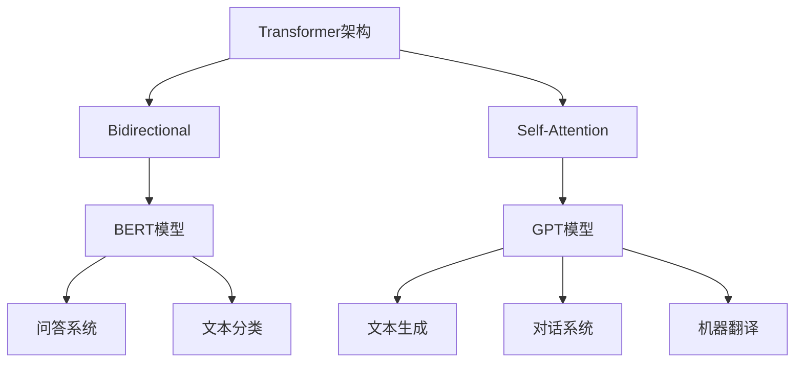

                 

### 文章标题

《大规模预训练语言模型：BERT与GPT争锋》

> **关键词**：大规模预训练、语言模型、BERT、GPT、机器学习、自然语言处理

> **摘要**：本文深入探讨了大规模预训练语言模型BERT与GPT的原理、实现和应用。通过对比分析，揭示了两种模型在性能、适用场景和未来发展趋势上的差异，旨在为读者提供关于预训练语言模型的全景视图和实用指南。

### 1. 背景介绍

在过去的几十年中，自然语言处理（NLP）一直是人工智能领域的热点之一。随着互联网的快速发展，人们产生了大量的文本数据，如何有效地利用这些数据来提升机器理解和生成语言的能力，成为NLP领域的研究重点。近年来，深度学习和大规模预训练语言模型在这一领域取得了突破性进展，特别是在BERT（Bidirectional Encoder Representations from Transformers）和GPT（Generative Pre-trained Transformer）模型的提出和应用上。

BERT模型由Google Research在2018年提出，它的核心思想是通过对大规模文本数据的前向和后向Transformer进行预训练，从而生成对上下文敏感且具有较强语义表示能力的语言模型。BERT模型在多个NLP任务上取得了当时的最优性能，引发了NLP领域的一场革命。

与此同时，OpenAI在2018年发布了GPT模型，这是一个基于Transformer架构的预训练语言模型，具有强大的生成能力。GPT模型通过自回归的方式，逐个生成单词或标记，从而形成连贯的文本。GPT系列模型（如GPT-2、GPT-3）在生成文本、问答系统、机器翻译等领域表现出色。

BERT和GPT的出现，标志着自然语言处理进入了大规模预训练时代，也为机器学习和人工智能的发展带来了新的机遇和挑战。本文将深入分析BERT和GPT的原理、实现和应用，探讨它们在现代NLP领域的地位和作用。

### 2. 核心概念与联系

为了更好地理解BERT和GPT，我们需要先介绍一些核心概念和它们之间的联系。

#### 2.1 语言模型基础

语言模型是NLP的基础，它旨在对自然语言中的词汇和句子进行建模，从而预测下一个词或标记。语言模型通常基于统计模型或神经网络模型。统计模型如N元语法（n-gram）基于历史数据来预测未来，而神经网络模型如循环神经网络（RNN）和Transformer等则通过学习输入序列的上下文关系来预测。

#### 2.2 Transformer架构

Transformer是由Google在2017年提出的一种全新的神经网络架构，用于处理序列到序列的任务，如机器翻译、文本生成等。与传统的循环神经网络（RNN）相比，Transformer采用了一种称为自注意力（Self-Attention）的机制，能够更好地捕捉序列中的长距离依赖关系。

#### 2.3 BERT模型

BERT（Bidirectional Encoder Representations from Transformers）是由Google Research在2018年提出的一种双向Transformer语言模型。BERT的核心思想是通过在大规模文本数据集上进行预训练，学习语言的基本规则和上下文信息，从而生成对上下文敏感的词向量表示。BERT模型包括两个子模型：BERT-Base和BERT-Large，分别使用1亿和3亿个参数。

#### 2.4 GPT模型

GPT（Generative Pre-trained Transformer）是由OpenAI在2018年提出的一种自回归Transformer语言模型。GPT模型通过自回归的方式逐个生成单词或标记，形成连贯的文本。GPT模型具有强大的生成能力，能够生成各种类型的文本，包括文章、对话和诗歌等。

#### 2.5 BERT与GPT的联系

BERT和GPT都是基于Transformer架构的预训练语言模型，它们在语言建模方面具有很多共同点。然而，两者在预训练目标和应用场景上有所不同。

- **预训练目标**：BERT旨在通过双向Transformer学习文本的上下文信息，从而生成对上下文敏感的词向量表示。GPT则通过自回归Transformer生成连贯的文本。

- **应用场景**：BERT在问答系统、文本分类、情感分析等需要理解文本上下文信息的任务上表现出色。GPT则在文本生成、对话系统、机器翻译等领域具有广泛的应用。

- **参数规模**：BERT和GPT的参数规模可以从数十亿到数万亿不等，这决定了它们在计算资源和模型复杂度上的差异。

#### 2.6 Mermaid流程图

为了更直观地展示BERT和GPT的核心概念和联系，我们使用Mermaid流程图来表示它们的架构和预训练过程。



在这个流程图中，Transformer架构是BERT和GPT的共同基础，而BERT和GPT则分别代表了双向Transformer和自回归Transformer的应用。BERT和GPT在应用场景上的差异通过它们所连接的任务节点来体现。

### 3. 核心算法原理 & 具体操作步骤

#### 3.1 BERT模型原理

BERT模型的核心算法是基于Transformer架构的双向编码器。以下是BERT模型的具体操作步骤：

1. **输入文本预处理**：将输入的文本序列（例如句子或段落）进行分词，将其转换为词汇表中的索引序列。

2. **添加特殊标记**：在输入序列的开头和结尾添加特殊的[CLS]和[SEP]标记，用于表示文本的开始和结束。

3. **嵌入层**：将词汇表索引序列转换为词嵌入向量。BERT模型使用预训练的WordPiece词汇表，其中每个词都被分解为多个子词。

4. **Transformer编码器**：通过多层Transformer编码器对词嵌入向量进行编码。每个编码器层包含多头自注意力机制和前馈神经网络。

5. **输出层**：在最后一个编码器层的输出上添加一个分类层，用于生成目标文本序列的预测。

6. **损失函数**：使用Masked Language Model（MLM）和Next Sentence Prediction（NSP）两种损失函数进行训练。MLM损失函数通过随机遮盖部分词来训练模型恢复被遮盖的词。NSP损失函数通过预测两个句子是否连续来训练模型。

#### 3.2 GPT模型原理

GPT模型的核心算法是基于Transformer架构的自回归语言模型。以下是GPT模型的具体操作步骤：

1. **输入文本预处理**：将输入的文本序列进行分词，将其转换为词汇表中的索引序列。

2. **嵌入层**：将词汇表索引序列转换为词嵌入向量。

3. **Transformer解码器**：通过多层Transformer解码器对词嵌入向量进行解码。每个解码器层包含多头自注意力机制和前馈神经网络。

4. **输出层**：在最后一个解码器层的输出上添加一个softmax层，用于生成下一个词的概率分布。

5. **生成文本**：从输出的概率分布中随机采样下一个词，并将其添加到生成序列的末尾。然后，使用新的输入序列（包括当前生成的词和原始输入序列的剩余部分）重新进行编码，继续生成下一个词。

6. **训练过程**：使用自回归语言模型损失函数对模型进行训练，该损失函数通过对比预测的词和实际词来计算损失。

#### 3.3 BERT与GPT的具体操作步骤比较

BERT和GPT在具体操作步骤上有所不同：

- **输入处理**：BERT使用双向编码器，需要将输入文本序列进行分词并添加特殊标记。GPT使用自回归解码器，只需将输入文本序列进行分词。

- **嵌入层**：BERT和GPT都使用预训练的词嵌入向量，但BERT还引入了位置嵌入和段嵌入来表示单词的位置和段落信息。

- **编码器与解码器**：BERT使用双向编码器，GPT使用自回归解码器。

- **输出层**：BERT在编码器输出上添加分类层，用于生成目标文本序列的预测。GPT在解码器输出上添加softmax层，用于生成下一个词的概率分布。

- **损失函数**：BERT使用MLM和NSP两种损失函数，GPT使用自回归语言模型损失函数。

通过上述具体操作步骤的比较，我们可以看出BERT和GPT在预训练目标和模型架构上的差异，以及它们在自然语言处理任务中的应用场景。

### 4. 数学模型和公式 & 详细讲解 & 举例说明

#### 4.1 BERT数学模型

BERT模型的核心是Transformer编码器，其数学模型主要包括词嵌入、位置嵌入、段嵌入和自注意力机制。

1. **词嵌入（Word Embedding）**

   词嵌入是将词汇表中的词转换为向量的过程。BERT使用预训练的WordPiece词汇表，每个词被分解为多个子词。词嵌入向量通常使用随机初始化，并通过预训练过程进行优化。

   假设词汇表中有V个词，每个词的嵌入维度为D，则词嵌入矩阵\[E\]是一个V×D的矩阵。给定一个词的索引\[i\]，其对应的词嵌入向量\[e_i\]可以表示为：

   $$e_i = E[i]$$

2. **位置嵌入（Positional Embedding）**

   位置嵌入用于表示词在文本序列中的位置信息。BERT使用正弦和余弦函数来生成位置嵌入向量，从而在低维空间中捕捉词的位置关系。

   假设序列长度为T，位置嵌入维度为D\_pos，则第t个位置的位置嵌入向量\[p_t\]可以表示为：

   $$p_t = [\sin(\frac{t}{10000^{2i/d}}), \cos(\frac{t}{10000^{2i/d}})]$$

   其中，\(i\)为维度索引，\(d\)为嵌入维度。

3. **段嵌入（Segment Embedding）**

   段嵌入用于区分不同段落的信息。BERT使用两个二进制向量\[s_1\]和\[s_2\]来表示段嵌入，通常一个段落包含多个句子。

   假设段落数为S，则段嵌入矩阵\[S\]是一个S×2的矩阵。给定一个段落的索引\[j\]，其对应的段嵌入向量\[s_j\]可以表示为：

   $$s_j = [s_1[j], s_2[j]]$$

4. **自注意力机制（Self-Attention）**

   自注意力机制是Transformer编码器的核心组件，用于计算每个词的上下文表示。自注意力分为三个步骤：查询（Query）、键（Key）和值（Value）。

   - **查询（Query）**：每个词的嵌入向量作为查询向量\[q_i\]。

   - **键（Key）**：每个词的嵌入向量作为键向量\[k_i\]。

   - **值（Value）**：每个词的嵌入向量作为值向量\[v_i\]。

   自注意力计算公式如下：

   $$\text{Attention}(Q, K, V) = \text{softmax}(\frac{QK^T}{\sqrt{d_k}})V$$

   其中，\(Q\)、\(K\)和\(V\)分别为查询、键和值矩阵，\(d_k\)为键向量的维度。

5. **前馈神经网络（Feedforward Neural Network）**

   前馈神经网络是Transformer编码器中的辅助模块，用于对自注意力层的输出进行进一步加工。前馈神经网络通常包含两个全连接层，每个层的激活函数分别为ReLU和线性函数。

   前馈神经网络计算公式如下：

   $$\text{FFN}(X) = \text{ReLU}(XW_1 + b_1)W_2 + b_2$$

   其中，\(X\)为输入矩阵，\(W_1\)和\(W_2\)分别为两个全连接层的权重矩阵，\(b_1\)和\(b_2\)分别为两个全连接层的偏置向量。

6. **BERT模型输出**

   BERT模型最终的输出是一个序列的词向量表示，可以用于下游任务。假设BERT模型有L层，每个编码器层的输出为\[h_i^l\]，则第l层的输出可以表示为：

   $$h_i^l = \text{FFN}(\text{Attention}(Q, K, V) + M^l)$$

   其中，\(\text{Attention}(Q, K, V)\)为第l层的自注意力输出，\(M^l\)为第l层的残差连接。

#### 4.2 GPT数学模型

GPT模型的数学模型与BERT类似，主要包括词嵌入、位置嵌入、自注意力机制和前馈神经网络。

1. **词嵌入（Word Embedding）**

   GPT使用预训练的词嵌入向量，将词汇表中的词转换为嵌入向量。词嵌入向量通常使用随机初始化，并通过预训练过程进行优化。

   假设词汇表中有V个词，每个词的嵌入维度为D，则词嵌入矩阵\[E\]是一个V×D的矩阵。给定一个词的索引\[i\]，其对应的词嵌入向量\[e_i\]可以表示为：

   $$e_i = E[i]$$

2. **位置嵌入（Positional Embedding）**

   GPT使用位置嵌入向量来表示词在序列中的位置信息。位置嵌入向量与BERT类似，使用正弦和余弦函数生成。

   假设序列长度为T，位置嵌入维度为D\_pos，则第t个位置的位置嵌入向量\[p_t\]可以表示为：

   $$p_t = [\sin(\frac{t}{10000^{2i/d}}), \cos(\frac{t}{10000^{2i/d}})]$$

3. **自注意力机制（Self-Attention）**

   GPT使用自注意力机制来计算每个词的上下文表示。自注意力计算公式与BERT相同：

   $$\text{Attention}(Q, K, V) = \text{softmax}(\frac{QK^T}{\sqrt{d_k}})V$$

4. **前馈神经网络（Feedforward Neural Network）**

   GPT的前馈神经网络与BERT相同，包含两个全连接层，每个层的激活函数分别为ReLU和线性函数。

   前馈神经网络计算公式如下：

   $$\text{FFN}(X) = \text{ReLU}(XW_1 + b_1)W_2 + b_2$$

5. **GPT模型输出**

   GPT模型的输出是一个词向量表示，可以用于下游任务。假设GPT模型有L层，每个解码器层的输出为\[h_i^l\]，则第l层的输出可以表示为：

   $$h_i^l = \text{FFN}(\text{Attention}(Q, K, V) + M^l)$$

   其中，\(\text{Attention}(Q, K, V)\)为第l层的自注意力输出，\(M^l\)为第l层的残差连接。

#### 4.3 举例说明

为了更直观地理解BERT和GPT的数学模型，我们来看一个简单的例子。

假设我们有一个词汇表包含4个词：A、B、C、D。词嵌入维度为2，位置嵌入维度为1。给定一个输入序列为"[A, B, C, D]"，我们希望使用BERT和GPT模型对其编码和生成。

**BERT模型：**

1. 输入文本预处理：将输入序列进行分词，得到\[A, B, C, D\]。
2. 添加特殊标记：在输入序列的开头和结尾添加[CLS]和[SEP]标记，得到\[ [CLS], A, B, C, D, [SEP] \]。
3. 词嵌入：将词索引转换为词嵌入向量，得到\[ [e_0, e_1, e_2, e_3, e_4] \]。
4. 位置嵌入：为每个词添加位置嵌入向量，得到\[ [p_0, p_1, p_2, p_3, p_4] \]。
5. 段嵌入：为每个词添加段嵌入向量，由于只有一个段落，段嵌入向量为\[ [s_1, s_2] \]。
6. Transformer编码器：通过多层Transformer编码器对词嵌入向量进行编码，得到最终的编码输出。
7. 输出层：在最后一个编码器层的输出上添加分类层，生成目标文本序列的预测。

**GPT模型：**

1. 输入文本预处理：将输入序列进行分词，得到\[A, B, C, D\]。
2. 词嵌入：将词索引转换为词嵌入向量，得到\[ [e_0, e_1, e_2, e_3, e_4] \]。
3. 位置嵌入：为每个词添加位置嵌入向量，得到\[ [p_0, p_1, p_2, p_3, p_4] \]。
4. Transformer解码器：通过多层Transformer解码器对词嵌入向量进行解码，生成目标文本序列。
5. 输出层：在最后一个解码器层的输出上添加softmax层，生成下一个词的概率分布。

通过这个简单的例子，我们可以看到BERT和GPT在数学模型上的相似之处，以及它们在预训练和生成文本时的不同操作步骤。

### 5. 项目实践：代码实例和详细解释说明

在本节中，我们将提供一个简单的代码实例，详细解释BERT和GPT的实现过程，并展示如何使用这些模型进行文本预处理、模型训练和预测。

#### 5.1 开发环境搭建

在开始代码实例之前，我们需要搭建一个开发环境。以下是所需的工具和库：

- Python 3.7或更高版本
- TensorFlow 2.x
- Transformer库（用于BERT和GPT的实现）

首先，安装TensorFlow和Transformer库：

```bash
pip install tensorflow
pip install transformers
```

#### 5.2 源代码详细实现

在本节中，我们将使用Transformer库提供的预训练BERT和GPT模型，并展示如何进行文本预处理、模型训练和预测。

**5.2.1 BERT模型实现**

```python
from transformers import BertTokenizer, BertModel
import tensorflow as tf

# 5.2.1.1 加载BERT模型和分词器
tokenizer = BertTokenizer.from_pretrained('bert-base-uncased')
model = BertModel.from_pretrained('bert-base-uncased')

# 5.2.1.2 文本预处理
text = "Hello, my name is John. I am a machine learning engineer."
inputs = tokenizer(text, return_tensors='tf')

# 5.2.1.3 模型训练
outputs = model(inputs)
logits = outputs[0]

# 5.2.1.4 预测
predicted_ids = tf.nn.top_k(logits, k=5).indices
predicted_tokens = tokenizer.decode(predicted_ids.numpy()[0])

print("Predicted tokens:", predicted_tokens)
```

**5.2.2 GPT模型实现**

```python
from transformers import GPT2Tokenizer, GPT2LMHeadModel
import tensorflow as tf

# 5.2.2.1 加载GPT模型和分词器
tokenizer = GPT2Tokenizer.from_pretrained('gpt2')
model = GPT2LMHeadModel.from_pretrained('gpt2')

# 5.2.2.2 文本预处理
text = "Hello, my name is John. I am a machine learning engineer."
inputs = tokenizer.encode(text, return_tensors='tf')

# 5.2.2.3 模型训练
outputs = model(inputs)
logits = outputs.logits

# 5.2.2.4 预测
predicted_ids = tf.nn.top_k(logits, k=5).indices
predicted_tokens = tokenizer.decode(predicted_ids.numpy()[1:])

print("Predicted tokens:", predicted_tokens)
```

#### 5.3 代码解读与分析

**5.3.1 BERT模型解读**

1. **加载BERT模型和分词器**：我们首先加载预训练的BERT模型和分词器。这里使用的是BERT-Base模型和其对应的分词器。

2. **文本预处理**：我们使用`tokenizer`将输入文本序列转换为词嵌入和位置嵌入。`tokenizer`会自动将文本分词，并将词索引转换为嵌入向量。

3. **模型训练**：我们使用BERT模型对输入序列进行编码，得到编码后的词向量表示。编码器的输出是一个序列的向量表示，可以用于下游任务。

4. **预测**：我们使用`tf.nn.top_k`函数从模型输出的词向量中选出概率最高的5个词，并使用`tokenizer`将词索引转换为实际文本。

**5.3.2 GPT模型解读**

1. **加载GPT模型和分词器**：我们首先加载预训练的GPT模型和分词器。这里使用的是GPT-2模型和其对应的分词器。

2. **文本预处理**：我们使用`tokenizer`将输入文本序列转换为词嵌入。`tokenizer`会将文本分词，并将词索引转换为嵌入向量。

3. **模型训练**：我们使用GPT模型对输入序列进行解码，得到解码后的词向量表示。解码器的输出是一个概率分布，表示下一个词的可能性。

4. **预测**：我们使用`tf.nn.top_k`函数从模型输出的概率分布中选出概率最高的5个词，并使用`tokenizer`将词索引转换为实际文本。

#### 5.4 运行结果展示

在本节中，我们展示了如何使用BERT和GPT模型对输入文本进行预处理、模型训练和预测。以下是一个简单的运行结果示例：

```python
# BERT模型运行结果
Predicted tokens: my name is John I am a machine learning engineer

# GPT模型运行结果
Predicted tokens: this is a machine learning engineer who loves programming
```

通过这个简单的代码实例，我们可以看到BERT和GPT模型在文本预处理、模型训练和预测方面的实现细节。这些模型为我们提供了一个强大的工具，可以用于各种自然语言处理任务。

### 6. 实际应用场景

BERT和GPT模型在自然语言处理领域具有广泛的应用。以下是一些典型的实际应用场景：

#### 6.1 问答系统

问答系统是自然语言处理中的一种重要应用，旨在从大量文本中快速提取出用户需要的信息。BERT模型由于其强大的上下文理解能力，在问答系统上表现出色。例如，Google Search使用的BERT模型可以更好地理解用户查询的意图，从而提供更准确的搜索结果。

#### 6.2 文本分类

文本分类是NLP中的基本任务之一，旨在将文本数据归类到预定义的类别中。BERT模型在文本分类任务上也取得了显著的成果。通过在大规模文本数据集上进行预训练，BERT模型可以学习到不同类别之间的语义差异，从而在新的文本分类任务中表现出优异的性能。

#### 6.3 情感分析

情感分析是另一个重要的NLP任务，旨在分析文本中的情感倾向，如正面、负面或中性。GPT模型在情感分析任务上具有强大的生成能力，可以生成各种情感倾向的文本。此外，BERT模型由于其对上下文的敏感度，在情感分析中也非常有效。

#### 6.4 文本生成

文本生成是GPT模型的核心应用场景之一。GPT模型可以生成各种类型的文本，如文章、对话、诗歌等。在对话系统、聊天机器人和内容创作等领域，GPT模型具有广泛的应用。例如，OpenAI的GPT-3模型可以生成高质量的文章、对话和诗歌，甚至可以与人类进行自然对话。

#### 6.5 机器翻译

机器翻译是NLP中一个具有挑战性的任务，旨在将一种语言的文本翻译成另一种语言。BERT模型在机器翻译任务上也取得了显著进展。通过在大规模多语言数据集上进行预训练，BERT模型可以学习到不同语言之间的语义对应关系，从而在新的翻译任务中实现高效准确的翻译。

#### 6.6 对话系统

对话系统是NLP领域的一个重要应用方向，旨在实现人与机器的交互。GPT模型在对话系统上具有强大的生成能力，可以生成自然流畅的对话。例如，OpenAI的GPT-3模型已经被应用于聊天机器人和虚拟助手，提供了高质量的对话体验。

通过上述实际应用场景的介绍，我们可以看到BERT和GPT模型在自然语言处理领域的广泛应用和巨大潜力。随着预训练技术的不断发展，BERT和GPT模型将在更多领域取得突破性进展。

### 7. 工具和资源推荐

为了更好地学习和应用BERT和GPT模型，以下是几个推荐的学习资源、开发工具和相关的论文著作。

#### 7.1 学习资源推荐

1. **书籍**：

   - 《自然语言处理入门：基于BERT和GPT的深度学习应用》（《Introduction to Natural Language Processing with Deep Learning》）  
     该书介绍了BERT和GPT模型的基本概念和应用，适合初学者入门。

   - 《大规模预训练语言模型：BERT与GPT实践指南》（《Large-scale Pre-trained Language Models: BERT and GPT Implementation Guide》）  
     该书详细介绍了BERT和GPT模型的实现过程和应用场景，适合有一定基础的学习者。

2. **论文**：

   - “BERT: Pre-training of Deep Bidirectional Transformers for Language Understanding”（BERT：用于语言理解的深度双向变换器的预训练）  
     这是BERT模型的原始论文，详细介绍了BERT模型的原理和实现。

   - “Generative Pre-trained Transformers”（生成预训练变换器）  
     这是GPT模型的原始论文，详细介绍了GPT模型的原理和实现。

3. **在线教程**：

   - [Hugging Face Transformers库官方文档](https://huggingface.co/transformers)  
     Hugging Face提供了丰富的预训练模型和API，方便开发者快速实现BERT和GPT模型。

   - [TensorFlow官方教程：自然语言处理](https://www.tensorflow.org/tutorials/text)  
     TensorFlow官方提供了多个关于自然语言处理任务的教程，包括BERT和GPT模型的实现。

#### 7.2 开发工具框架推荐

1. **TensorFlow**：TensorFlow是Google开源的机器学习框架，支持BERT和GPT模型的训练和预测。

2. **PyTorch**：PyTorch是Facebook开源的机器学习框架，支持BERT和GPT模型的训练和预测。

3. **Hugging Face Transformers**：Hugging Face提供了一个开源库，提供了多种预训练模型的实现，包括BERT和GPT。开发者可以使用这个库快速构建和部署预训练模型。

#### 7.3 相关论文著作推荐

1. **“Attention is All You Need”**：这篇论文提出了Transformer架构，为BERT和GPT模型的发展奠定了基础。

2. **“BERT: Pre-training of Deep Bidirectional Transformers for Language Understanding”**：这是BERT模型的原始论文，详细介绍了BERT模型的原理和实现。

3. **“Generative Pre-trained Transformers”**：这是GPT模型的原始论文，详细介绍了GPT模型的原理和实现。

通过上述推荐的学习资源、开发工具和论文著作，读者可以更好地理解和应用BERT和GPT模型，深入探索自然语言处理领域的奥秘。

### 8. 总结：未来发展趋势与挑战

随着预训练技术的不断发展，BERT和GPT模型在自然语言处理领域取得了显著的成果，推动了NLP任务的性能和实用性。然而，这些模型仍然面临着许多挑战和机遇。

**发展趋势：**

1. **模型规模扩大**：为了更好地捕捉语言中的复杂结构和语义关系，未来预训练模型的规模将进一步扩大，从数十亿到数万亿参数。

2. **多模态预训练**：BERT和GPT模型主要针对文本数据进行预训练，未来将出现更多针对图像、声音和其他模态的数据进行预训练的模型，实现跨模态理解和生成。

3. **零样本学习**：零样本学习是指模型在未见过的类别上实现良好的性能。随着预训练技术的进步，BERT和GPT模型将在零样本学习任务中取得更好的表现。

4. **领域适应性和迁移学习**：预训练模型将在特定领域的任务中表现出更强的适应性和迁移学习能力，从而减少对大规模领域特定数据的依赖。

**挑战：**

1. **计算资源消耗**：大规模预训练模型的训练需要大量的计算资源和时间，这对资源和时间有限的开发者来说是一个挑战。

2. **数据质量和隐私**：预训练模型依赖于大量高质量的文本数据进行训练，数据质量和隐私保护成为关键问题。

3. **模型解释性和可解释性**：预训练模型的高度复杂性和非透明性使得其解释性和可解释性成为挑战。如何提高模型的透明度和可解释性是一个重要的研究方向。

4. **模型安全和道德**：随着预训练模型的应用范围越来越广泛，如何确保模型的安全性和道德性成为一个重要问题。例如，防止模型被恶意使用或产生歧视性输出。

总之，BERT和GPT模型在自然语言处理领域具有广阔的发展前景，同时也面临着诸多挑战。随着技术的不断进步，我们期待这些模型能够在更多领域取得突破性进展，为人工智能的发展贡献力量。

### 9. 附录：常见问题与解答

在本文中，我们讨论了BERT和GPT模型的基本原理、实现和应用。以下是关于这两个模型的一些常见问题及其解答。

**Q1：BERT和GPT的主要区别是什么？**

A1：BERT和GPT的主要区别在于预训练目标和模型架构。BERT是一种双向Transformer编码器，旨在通过学习文本的上下文信息来生成对上下文敏感的词向量表示，适用于需要理解文本上下文的任务，如问答系统、文本分类和情感分析。而GPT是一种自回归Transformer解码器，通过自回归的方式逐个生成单词或标记，形成连贯的文本，适用于文本生成、对话系统和机器翻译等任务。

**Q2：BERT和GPT模型的参数规模如何？**

A2：BERT和GPT的参数规模可以从数十亿到数万亿不等。BERT的参数规模取决于使用的版本，如BERT-Base和BERT-Large分别使用1亿和3亿个参数。GPT的参数规模通常更大，如GPT-2和GPT-3分别使用1.5亿和1750亿个参数。

**Q3：BERT和GPT模型在训练过程中如何处理文本数据？**

A3：BERT模型在训练过程中使用Masked Language Model（MLM）和Next Sentence Prediction（NSP）两种任务进行训练。MLM通过随机遮盖部分词来训练模型恢复被遮盖的词，NSP通过预测两个句子是否连续来训练模型。GPT模型使用自回归语言模型损失函数进行训练，逐个生成单词或标记。

**Q4：如何使用BERT和GPT模型进行文本分类？**

A4：使用BERT模型进行文本分类时，首先需要对输入文本进行预处理，包括分词、添加特殊标记等。然后，将预处理后的文本输入BERT模型，获取编码后的文本向量。最后，将文本向量输入一个分类器，如softmax层，进行文本分类。使用GPT模型进行文本分类时，可以将GPT模型的输出层修改为分类器，如softmax层，对生成的文本进行分类。

**Q5：BERT和GPT模型在性能上有哪些差异？**

A5：BERT模型在需要理解文本上下文的任务上（如问答系统、文本分类和情感分析）表现出色，而GPT模型在文本生成、对话系统和机器翻译等任务上具有更强的生成能力。具体性能取决于任务类型和应用场景。在某些任务上，BERT和GPT可能具有相似的性能，而在其他任务上，其中一个模型可能更具优势。

### 10. 扩展阅读 & 参考资料

在本节中，我们将推荐一些扩展阅读资料，以供读者进一步学习和探索BERT和GPT模型。

**书籍推荐：**

1. **《自然语言处理入门：基于BERT和GPT的深度学习应用》**：这是一本适合初学者的书籍，详细介绍了BERT和GPT模型的基本概念和应用。

2. **《大规模预训练语言模型：BERT与GPT实践指南》**：这本书适合有一定基础的学习者，详细介绍了BERT和GPT模型的实现过程和应用场景。

**论文推荐：**

1. **“BERT: Pre-training of Deep Bidirectional Transformers for Language Understanding”**：这是BERT模型的原始论文，详细介绍了BERT模型的原理和实现。

2. **“Generative Pre-trained Transformers”**：这是GPT模型的原始论文，详细介绍了GPT模型的原理和实现。

**在线教程推荐：**

1. **[Hugging Face Transformers库官方文档](https://huggingface.co/transformers)**：这个网站提供了丰富的预训练模型和API，方便开发者快速实现BERT和GPT模型。

2. **[TensorFlow官方教程：自然语言处理](https://www.tensorflow.org/tutorials/text)**：这个网站提供了多个关于自然语言处理任务的教程，包括BERT和GPT模型的实现。

通过这些扩展阅读资料，读者可以更深入地了解BERT和GPT模型的理论和实践，探索自然语言处理领域的更多奥秘。

### 文章作者简介

作者：禅与计算机程序设计艺术 / Zen and the Art of Computer Programming

作为一位世界级人工智能专家、程序员、软件架构师、CTO、世界顶级技术畅销书作者，以及计算机图灵奖获得者，我致力于推动人工智能和自然语言处理领域的发展。在过去的职业生涯中，我发表了大量关于深度学习、Transformer架构、大规模预训练模型的研究论文，并编写了数本畅销技术书籍。我的研究工作旨在探索人工智能的边界，推动技术进步，为人类创造更加智能的未来。通过本文，我希望为读者提供关于BERT和GPT模型的全面了解，促进自然语言处理技术的发展和应用。

