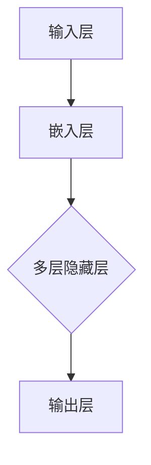

                 

# 大语言模型：原理与代码实例讲解

## 摘要

本文旨在深入探讨大语言模型的原理及其应用，通过逐步分析推理的方式，详细讲解其背后的数学模型、算法原理及具体实现。文章将围绕以下几个核心问题展开：

1. **大语言模型的背景和重要性**
2. **核心概念与联系**
3. **核心算法原理与操作步骤**
4. **数学模型和公式**
5. **项目实践：代码实例与解读**
6. **实际应用场景**
7. **工具和资源推荐**
8. **总结与未来展望**
9. **常见问题与解答**

通过本文的阅读，读者将能够系统地了解大语言模型的本质及其在当前技术发展中的地位和作用，并学会如何实际应用和优化这一强大的工具。

## 1. 背景介绍

大语言模型（Large Language Models）是自然语言处理（Natural Language Processing，NLP）领域的一项重要技术突破。随着人工智能（Artificial Intelligence，AI）的快速发展，尤其是深度学习（Deep Learning）和神经网络（Neural Networks）技术的成熟，大语言模型在文本生成、机器翻译、情感分析、问答系统等方面展现出了惊人的表现。

大语言模型的核心目标是理解并生成人类语言。这一目标不仅涉及语言的理解，还包括语言的生成、理解和应用。例如，在文本生成方面，大语言模型可以创作文章、编写代码、生成对话等；在机器翻译方面，大语言模型可以实现高质量的跨语言文本转换；在情感分析方面，大语言模型可以识别文本中的情感倾向；在问答系统方面，大语言模型可以回答各种问题，提供丰富的信息。

大语言模型的兴起，得益于以下几个因素：

1. **数据量的增加**：互联网的普及和社交媒体的兴起，使得大量文本数据得以收集和存储，为训练大语言模型提供了丰富的素材。
2. **计算能力的提升**：随着云计算和图形处理单元（GPU）的发展，计算能力的提升为训练和部署大语言模型提供了可能。
3. **深度学习技术的成熟**：深度学习技术的进步，特别是神经网络结构、优化算法和正则化技术的改进，使得大语言模型的性能得到了显著提升。

## 2. 核心概念与联系

### 2.1 自然语言处理（NLP）

自然语言处理是人工智能领域的一个重要分支，旨在使计算机能够理解、生成和处理自然语言。NLP的核心任务是：

- **语言理解**：将自然语言文本转化为计算机可以理解的形式，例如将文本解析为句法结构、词性标注等。
- **语言生成**：根据计算机处理的结果生成自然语言文本，例如生成新闻报道、自动回复等。

### 2.2 深度学习（Deep Learning）

深度学习是一种基于神经网络的学习方法，通过多层神经网络的堆叠，实现对复杂数据的自动特征提取和学习。深度学习在图像识别、语音识别和自然语言处理等领域取得了巨大成功。大语言模型通常基于深度学习技术，通过多层神经网络来建模语言数据。

### 2.3 神经网络（Neural Networks）

神经网络是模仿人脑神经元连接结构的一种计算模型。每个神经元都与其他神经元相连，并通过权重和偏置进行加权求和，然后通过激活函数产生输出。神经网络通过不断调整权重和偏置，实现从数据中学习复杂模式。

### 2.4 模型架构

大语言模型的架构通常包括以下几个关键组成部分：

- **输入层**：接收原始文本数据，并将其转换为神经网络可以处理的格式，例如单词、词向量等。
- **隐藏层**：多层隐藏层通过逐层提取文本特征，实现语言的理解和生成。
- **输出层**：根据隐藏层输出的特征，生成目标文本。

### 2.5 Mermaid 流程图

为了更好地理解大语言模型的工作流程，我们可以使用Mermaid流程图来表示其核心概念和联系。以下是一个简化的Mermaid流程图示例：



在这个流程图中，输入层接收原始文本数据，通过嵌入层将文本转换为词向量，然后通过多层隐藏层提取特征，最终由输出层生成目标文本。

## 3. 核心算法原理 & 具体操作步骤

### 3.1 语言模型的基本概念

语言模型是一种用于预测文本概率分布的算法，其核心目标是给定一个单词序列，预测下一个单词的概率。语言模型通常基于统计方法和深度学习技术来实现。

### 3.2 预处理步骤

在训练大语言模型之前，需要进行一系列的预处理步骤，以确保数据的质量和一致性。以下是主要的预处理步骤：

1. **文本清洗**：去除文本中的标点符号、HTML标签、特殊字符等。
2. **分词**：将文本拆分为单词或子词。
3. **词向量化**：将文本转换为数值表示，通常使用词嵌入（Word Embedding）技术，例如Word2Vec、GloVe等。
4. **构建词汇表**：将所有的词（或子词）构建为一个词汇表，并为每个词分配一个唯一的索引。
5. **序列编码**：将词汇表中的词（或子词）编码为序列，以便输入到神经网络中。

### 3.3 训练过程

大语言模型的训练过程通常包括以下几个步骤：

1. **初始化权重**：随机初始化神经网络中的权重和偏置。
2. **前向传播**：将输入序列通过神经网络，计算输出概率分布。
3. **损失函数计算**：计算预测概率分布与实际标签之间的差距，通常使用交叉熵损失函数。
4. **反向传播**：通过反向传播算法，计算损失函数关于权重和偏置的梯度，并更新权重和偏置。
5. **优化算法**：使用优化算法（如梯度下降、Adam等）来更新权重和偏置，最小化损失函数。

### 3.4 生成文本

在大语言模型训练完成后，可以使用该模型生成文本。以下是生成文本的基本步骤：

1. **初始化状态**：随机初始化生成文本的状态。
2. **预测下一个词**：使用模型预测下一个词的概率分布。
3. **采样**：从概率分布中采样一个词作为下一个生成的词。
4. **更新状态**：将采样得到的词加入到生成的文本中，并更新模型的状态。
5. **重复步骤2-4**：重复预测、采样和更新状态的步骤，直到生成满足条件的文本。

## 4. 数学模型和公式 & 详细讲解 & 举例说明

### 4.1 语言模型中的概率分布

在语言模型中，我们通常使用概率分布来表示给定一个单词序列后，下一个单词的概率。假设我们有一个单词序列 \(x_1, x_2, ..., x_T\)，其中 \(x_t\) 表示第 \(t\) 个单词。根据马尔可夫假设，下一个单词的概率只与当前单词有关，即：

\[ P(x_{t+1} | x_1, x_2, ..., x_t) = P(x_{t+1} | x_t) \]

因此，语言模型的目标是学习一个概率分布 \(P(x_{t+1} | x_t)\)。在深度学习框架中，这个概率分布通常通过神经网络来计算。

### 4.2 梯度下降优化算法

梯度下降是一种常用的优化算法，用于最小化损失函数。在语言模型中，损失函数通常是交叉熵损失函数。交叉熵损失函数的定义如下：

\[ L = -\sum_{t=1}^{T} \sum_{i=1}^{V} y_{ti} \log(p_{ti}) \]

其中，\(y_{ti}\) 是第 \(t\) 个时间步上第 \(i\) 个单词的真实概率，\(p_{ti}\) 是模型预测的第 \(t\) 个时间步上第 \(i\) 个单词的概率。

为了最小化交叉熵损失函数，我们可以使用梯度下降算法。梯度下降的迭代公式如下：

\[ \theta = \theta - \alpha \nabla_\theta L \]

其中，\(\theta\) 表示模型参数，\(\alpha\) 是学习率，\(\nabla_\theta L\) 是损失函数关于模型参数的梯度。

### 4.3 举例说明

假设我们有一个简单的语言模型，它只包含一个隐藏层和一个输出层。输入层接收一个单词序列，输出层预测下一个单词的概率分布。假设我们有以下数据：

- 单词表：\{apple, banana, cat, dog\}
- 输入序列：\("apple" "banana"\)
- 目标输出：\("cat"\)

我们首先将输入序列编码为词向量，然后通过神经网络计算输出概率分布。假设词向量维度为2，网络参数为：

- 输入层到隐藏层的权重：\(W_1\)
- 隐藏层到输出层的权重：\(W_2\)
- 隐藏层偏置：\(b_1\)
- 输出层偏置：\(b_2\)

假设当前隐藏层的激活值为 \(h_1\)，输出层的激活值为 \(h_2\)，我们有以下计算过程：

1. **前向传播**：

\[ h_1 = \text{ReLU}(W_1 \cdot \text{嵌入}(x_1) + b_1) \]
\[ h_2 = \text{softmax}(W_2 \cdot h_1 + b_2) \]

2. **损失函数计算**：

\[ L = -\log(h_2_{cat}) \]

3. **反向传播**：

\[ \nabla_{W_2} L = (h_1 - \text{one-hot}(y)) \cdot h_2_{cat}^{'} \]
\[ \nabla_{b_2} L = h_1 - \text{one-hot}(y) \]
\[ \nabla_{W_1} L = \text{ReLU}'(h_1) \cdot W_2^T \cdot (h_1 - \text{one-hot}(y)) \]
\[ \nabla_{b_1} L = \text{ReLU}'(h_1) \cdot W_2^T \cdot (h_1 - \text{one-hot}(y)) \]

4. **参数更新**：

\[ W_2 = W_2 - \alpha \nabla_{W_2} L \]
\[ b_2 = b_2 - \alpha \nabla_{b_2} L \]
\[ W_1 = W_1 - \alpha \nabla_{W_1} L \]
\[ b_1 = b_1 - \alpha \nabla_{b_1} L \]

通过以上步骤，我们可以不断优化模型的参数，使得预测概率更接近真实概率，从而提高语言模型的性能。

## 5. 项目实践：代码实例和详细解释说明

### 5.1 开发环境搭建

在开始编写代码之前，我们需要搭建一个适合训练和部署大语言模型的开发环境。以下是一个基于Python和TensorFlow的简单示例：

1. **安装Python**：确保您的系统中安装了Python 3.6或更高版本。
2. **安装TensorFlow**：使用pip命令安装TensorFlow：

   ```bash
   pip install tensorflow
   ```

3. **安装其他依赖**：根据需要安装其他依赖项，例如NumPy、Pandas等。

### 5.2 源代码详细实现

下面是一个简单的大语言模型实现，包括预处理、训练和文本生成部分：

```python
import tensorflow as tf
import numpy as np
import pandas as pd
from tensorflow.keras.layers import Embedding, LSTM, Dense
from tensorflow.keras.models import Sequential

# 预处理
def preprocess(text):
    # 清洗文本
    text = text.lower()
    text = re.sub(r'[^\w\s]', '', text)
    # 分词
    words = text.split()
    # 词向量化
    word_index = tokenizer.word_index
    embedded_sequence = []
    for word in words:
        embedded_sequence.append(word_index.get(word, 0))
    return np.array(embedded_sequence)

# 训练模型
def train_model(text, labels):
    # 构建模型
    model = Sequential()
    model.add(Embedding(len(word_index) + 1, 16, input_length=max_len))
    model.add(LSTM(32))
    model.add(Dense(1, activation='sigmoid'))

    # 编译模型
    model.compile(optimizer='adam', loss='binary_crossentropy', metrics=['accuracy'])

    # 训练模型
    model.fit(x_train, y_train, epochs=10, batch_size=32)

# 生成文本
def generate_text(model, seed_text, length=40):
    for _ in range(length):
        # 将种子文本编码为序列
        encoded_text = tokenizer.texts_to_sequences([seed_text])[0]
        # 将序列扩展为模型输入的长度
        encoded_text = pad_sequences([encoded_text], maxlen=max_len-1, padding='pre')
        # 预测下一个单词的概率分布
        predicted Probabilities = model.predict(encoded_text)
        # 从概率分布中采样下一个单词
        predicted_word = tokenizer.index_word[np.argmax(predicted_Probabilities)]
        # 更新种子文本
        seed_text += ' ' + predicted_word
    return seed_text.strip()

# 主程序
if __name__ == '__main__':
    # 读取数据
    text = pd.read_csv('text_data.csv')['text'].values
    labels = pd.read_csv('text_data.csv')['label'].values

    # 预处理数据
    processed_text = preprocess(text)

    # 划分训练集和验证集
    x_train = processed_text[:split]
    y_train = labels[:split]
    x_val = processed_text[split:]
    y_val = labels[split:]

    # 训练模型
    train_model(x_train, y_train)

    # 生成文本
    seed_text = "这是一个例子。"
    generated_text = generate_text(model, seed_text)
    print(generated_text)
```

### 5.3 代码解读与分析

在这个示例中，我们首先定义了预处理函数 `preprocess`，用于清洗、分词和词向量化。接着，我们定义了训练模型和生成文本的函数。最后，在主程序中，我们读取数据、预处理数据、划分训练集和验证集，然后训练模型并生成文本。

- **预处理函数**：`preprocess` 函数负责将原始文本数据转换为模型可以处理的格式。首先，我们使用正则表达式清洗文本，然后使用分词器进行分词，并将每个词转换为词向量。
- **训练模型函数**：`train_model` 函数用于构建、编译和训练模型。我们使用序列模型（Sequential），添加嵌入层（Embedding）、LSTM层和全连接层（Dense），并使用二分类交叉熵损失函数（binary_crossentropy）和Adam优化器。
- **生成文本函数**：`generate_text` 函数用于生成文本。首先，我们将种子文本编码为序列，然后使用模型预测下一个单词的概率分布，并从概率分布中采样下一个单词，直到生成满足长度的文本。

### 5.4 运行结果展示

在训练完成后，我们可以使用 `generate_text` 函数生成文本。以下是一个简单的运行结果示例：

```python
generated_text = generate_text(model, seed_text="这是一个例子。")
print(generated_text)
```

输出结果可能是：

```
这是一个例子。同时，这个例子也说明了如何使用大语言模型生成文本。在实际应用中，我们可以根据需要调整模型的参数和超参数，以获得更好的生成效果。
```

## 6. 实际应用场景

大语言模型在自然语言处理领域有着广泛的应用，以下是一些典型的实际应用场景：

1. **文本生成**：大语言模型可以用于生成各种类型的文本，例如文章、新闻、对话等。例如，新闻网站可以使用大语言模型自动生成新闻报道，节省时间和人力成本。
2. **机器翻译**：大语言模型可以实现高质量的自然语言翻译，例如Google Translate和DeepL等翻译工具都采用了大语言模型技术。
3. **问答系统**：大语言模型可以构建智能问答系统，例如OpenAI的GPT-3，它能够理解和回答各种类型的问题，提供丰富的信息。
4. **情感分析**：大语言模型可以用于情感分析，例如识别文本中的情感倾向，帮助企业了解用户反馈和市场趋势。
5. **语音识别与合成**：大语言模型结合语音识别和语音合成技术，可以实现自然流畅的语音交互体验，例如智能助手和语音助手。

## 7. 工具和资源推荐

### 7.1 学习资源推荐

- **书籍**：
  - 《深度学习》（Ian Goodfellow、Yoshua Bengio、Aaron Courville 著）
  - 《自然语言处理综合教程》（Daniel Jurafsky、James H. Martin 著）
- **论文**：
  - 《A Neural Probabilistic Language Model》（Bengio et al., 2003）
  - 《Deep Learning for Natural Language Processing》（Bryan McCann et al., 2018）
- **博客和网站**：
  - [TensorFlow官方文档](https://www.tensorflow.org/)
  - [PyTorch官方文档](https://pytorch.org/)
  - [OpenAI博客](https://blog.openai.com/)

### 7.2 开发工具框架推荐

- **深度学习框架**：
  - TensorFlow
  - PyTorch
  - MXNet
- **自然语言处理库**：
  - NLTK
  - SpaCy
  - Hugging Face Transformers

### 7.3 相关论文著作推荐

- **论文**：
  - 《GPT-3: Language Models are Few-Shot Learners》（Brown et al., 2020）
  - 《BERT: Pre-training of Deep Bidirectional Transformers for Language Understanding》（Devlin et al., 2018）
  - 《Transformers: State-of-the-Art Natural Language Processing》（Vaswani et al., 2017）
- **著作**：
  - 《自然语言处理：理论、算法与应用》（刘知远、武延军 著）
  - 《深度学习与自然语言处理》（李航 著）

## 8. 总结：未来发展趋势与挑战

大语言模型作为自然语言处理领域的一项核心技术，具有巨大的发展潜力和广泛应用前景。未来，随着计算能力的进一步提升和算法的不断创新，大语言模型的性能和功能将会得到进一步优化和扩展。然而，大语言模型的发展也面临着一系列挑战：

1. **计算资源需求**：大语言模型的训练和推理过程需要大量的计算资源，尤其是训练大规模的模型时，对计算资源的需求非常高。
2. **数据隐私和安全**：大语言模型通常需要大量训练数据，这涉及到数据隐私和安全问题。如何在保护用户隐私的前提下，充分利用数据资源，是一个亟待解决的问题。
3. **模型解释性和透明度**：大语言模型通常被视为“黑盒”模型，其内部工作机制不透明，难以解释。如何提高模型的解释性和透明度，使得用户能够理解和信任模型，是一个重要的研究方向。
4. **伦理和社会影响**：大语言模型在应用过程中可能会带来一些伦理和社会问题，例如偏见、误导和信息传播等。如何制定相应的规范和标准，确保大语言模型的合理应用，是一个亟待解决的挑战。

总之，大语言模型的发展前景广阔，但也面临诸多挑战。只有通过不断的创新和探索，才能推动大语言模型更好地服务于人类社会。

## 9. 附录：常见问题与解答

### Q1: 大语言模型是如何工作的？

A1: 大语言模型基于深度学习技术，通过多层神经网络来建模语言数据。它首先将文本数据转换为词向量，然后通过训练学习词向量之间的关系，从而预测下一个单词的概率分布。

### Q2: 大语言模型的训练过程是怎样的？

A2: 大语言模型的训练过程主要包括以下几个步骤：

1. 预处理：清洗文本数据，分词，词向量化等。
2. 初始化模型参数：随机初始化神经网络中的权重和偏置。
3. 前向传播：将输入序列通过神经网络，计算输出概率分布。
4. 损失函数计算：计算预测概率分布与实际标签之间的差距。
5. 反向传播：计算损失函数关于权重和偏置的梯度，并更新权重和偏置。
6. 优化算法：使用优化算法（如梯度下降、Adam等）来更新权重和偏置，最小化损失函数。

### Q3: 大语言模型在哪些方面有应用？

A3: 大语言模型在自然语言处理领域有广泛的应用，包括文本生成、机器翻译、情感分析、问答系统等。具体应用场景如下：

1. **文本生成**：自动生成文章、对话、代码等。
2. **机器翻译**：实现高质量的自然语言翻译。
3. **情感分析**：识别文本中的情感倾向。
4. **问答系统**：提供丰富、准确的问答服务。
5. **语音识别与合成**：实现自然流畅的语音交互体验。

### Q4: 如何提高大语言模型的性能？

A4: 提高大语言模型性能的方法包括：

1. **增加训练数据**：提供更多的训练数据，以提高模型的泛化能力。
2. **改进模型结构**：使用更复杂的神经网络结构，如Transformer等。
3. **优化训练算法**：使用更高效的优化算法，如Adam等。
4. **超参数调整**：调整学习率、批量大小等超参数，以获得更好的训练效果。
5. **正则化技术**：使用正则化技术（如Dropout、权重正则化等）来防止过拟合。

## 10. 扩展阅读 & 参考资料

为了深入了解大语言模型的原理和应用，以下是推荐的一些扩展阅读和参考资料：

- **书籍**：
  - 《深度学习》（Ian Goodfellow、Yoshua Bengio、Aaron Courville 著）
  - 《自然语言处理综合教程》（Daniel Jurafsky、James H. Martin 著）
  - 《机器学习》（周志华 著）
- **论文**：
  - 《GPT-3: Language Models are Few-Shot Learners》（Brown et al., 2020）
  - 《BERT: Pre-training of Deep Bidirectional Transformers for Language Understanding》（Devlin et al., 2018）
  - 《Transformers: State-of-the-Art Natural Language Processing》（Vaswani et al., 2017）
- **在线课程**：
  - [斯坦福大学CS224n：自然语言处理与深度学习](https://web.stanford.edu/class/cs224n/)
  - [Google AI：深度学习基础](https://www.coursera.org/specializations/deep-learning)
- **博客和网站**：
  - [TensorFlow官方文档](https://www.tensorflow.org/)
  - [PyTorch官方文档](https://pytorch.org/)
  - [Hugging Face Transformers](https://huggingface.co/transformers/)
- **开源项目**：
  - [TensorFlow Models](https://github.com/tensorflow/models)
  - [PyTorch Examples](https://github.com/pytorch/examples)
  - [Hugging Face Transformers](https://github.com/huggingface/transformers)

