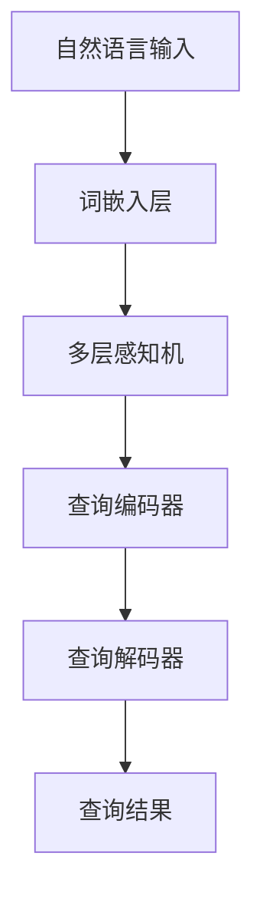

                 

### 大语言模型原理与工程实践：DQN 的结构

#### 关键词 Keywords
- 大语言模型
- DQN
- 深度学习
- 工程实践
- 机器学习
- 自然语言处理

#### 摘要 Abstract
本文将深入探讨大语言模型的原理及其在工程实践中的关键结构——深度查询网络（DQN）。通过对大语言模型的概述、DQN的基本原理、数学模型以及实际应用场景的分析，我们将展现如何将这一先进技术应用于自然语言处理任务中。此外，文章还提供了一系列学习资源和工具推荐，以便读者更好地理解并实践这一领域。

---

#### 1. 背景介绍

在当今科技飞速发展的时代，人工智能（AI）已经成为变革性技术之一，其应用范围涵盖了从医疗健康到金融科技，从智能家居到自动驾驶等多个领域。在众多AI技术中，自然语言处理（NLP）和机器学习（ML）尤为引人注目。

自然语言处理涉及使计算机能够理解、解释和生成人类语言的技术，旨在实现人与机器的智能交互。而机器学习则是使计算机通过数据学习并改进性能的一种方法。

随着数据规模的扩大和计算能力的提升，大语言模型应运而生。大语言模型是一种能够处理和理解大量文本数据的人工神经网络，其通过深度学习技术训练而成。这些模型可以用于多种任务，如文本分类、情感分析、机器翻译、问答系统等。

深度查询网络（DQN）是大语言模型中的一个关键结构，它通过神经网络模拟人类记忆和检索机制，实现对大规模文本数据的快速查询和理解。DQN不仅在NLP任务中表现出色，还在多个实际应用场景中展现出强大的能力。

#### 2. 核心概念与联系

为了深入理解大语言模型及其中的DQN结构，首先需要了解一些核心概念和它们之间的联系。

##### 2.1 自然语言处理（NLP）

自然语言处理是计算机科学和人工智能的一个分支，主要研究如何使计算机能够理解和处理人类语言。其核心目标是实现以下功能：
- 语言理解：解析文本并提取其含义。
- 语言生成：生成具有逻辑性和连贯性的文本。
- 语言翻译：将一种语言翻译成另一种语言。

##### 2.2 机器学习（ML）

机器学习是一种通过数据训练模型，从而使计算机能够自动学习和改进性能的技术。在大语言模型中，机器学习通过神经网络实现文本数据的自动编码和解码。

##### 2.3 大语言模型（Large Language Models）

大语言模型是一种基于深度学习的模型，具有数十亿甚至千亿个参数，能够理解和生成复杂的人类语言。这些模型通过大量的文本数据进行训练，从而学习到语言的内在规律和结构。

##### 2.4 深度查询网络（DQN）

深度查询网络是大语言模型中的一个关键组件，负责处理文本查询任务。DQN通过神经网络模拟人类的记忆和检索机制，实现对大规模文本数据的快速查询和理解。

下面是一个使用Mermaid绘制的DQN结构流程图，展示了各组件之间的联系。



#### 3. 核心算法原理 & 具体操作步骤

##### 3.1 词嵌入层

词嵌入是将单词映射到高维向量空间的过程。在大语言模型中，词嵌入层通过神经网络学习到单词之间的语义关系。具体操作步骤如下：

1. 输入文本数据进入词嵌入层。
2. 词嵌入层将每个单词映射为一个固定长度的向量。
3. 这些向量作为输入传递到下一层。

##### 3.2 多层感知机

多层感知机（MLP）是一种全连接神经网络，用于对词嵌入向量进行进一步处理。具体操作步骤如下：

1. 输入词嵌入向量进入多层感知机。
2. 通过一系列线性变换和激活函数，多层感知机将输入映射到高维空间。
3. 输出向量传递到查询编码器。

##### 3.3 查询编码器

查询编码器是一个循环神经网络（RNN），用于将输入查询序列编码为一个固定长度的向量。具体操作步骤如下：

1. 输入查询序列进入查询编码器。
2. 查询编码器通过RNN处理每个查询词，并将结果编码为固定长度的向量。
3. 编码后的向量作为输入传递到查询解码器。

##### 3.4 查询解码器

查询解码器与查询编码器类似，也是一个RNN，用于解码查询编码器输出的向量，并生成查询结果。具体操作步骤如下：

1. 输入查询编码器输出的向量进入查询解码器。
2. 查询解码器通过RNN解码向量，并生成文本结果。
3. 输出结果作为查询的响应。

##### 3.5 查询结果

查询解码器生成的文本结果即为查询的响应。通过优化DQN模型，可以提高查询结果的质量和准确性。

#### 4. 数学模型和公式 & 详细讲解 & 举例说明

##### 4.1 词嵌入层

词嵌入层可以通过以下公式实现：

$$
\text{embed}(x) = \text{softmax}(W \cdot x)
$$

其中，$x$是输入词嵌入向量，$W$是权重矩阵，$\text{softmax}$函数用于将输入映射到概率分布。

##### 4.2 多层感知机

多层感知机可以通过以下公式实现：

$$
\text{MLP}(x) = \text{激活函数}(\text{线性变换}(x))
$$

其中，$\text{激活函数}$可以是ReLU、Sigmoid或Tanh等。

##### 4.3 查询编码器

查询编码器可以通过以下公式实现：

$$
\text{RNN}(h_t, x_t) = \text{激活函数}(\text{线性变换}(h_t, x_t))
$$

其中，$h_t$是当前时刻的状态向量，$x_t$是当前时刻的输入。

##### 4.4 查询解码器

查询解码器可以通过以下公式实现：

$$
\text{RNN}(h_t, x_t) = \text{激活函数}(\text{线性变换}(h_t, x_t))
$$

其中，$h_t$是当前时刻的状态向量，$x_t$是当前时刻的输入。

##### 4.5 查询结果

查询结果可以通过以下公式实现：

$$
\text{结果} = \text{softmax}(\text{线性变换}(\text{编码器输出}))
$$

其中，$\text{编码器输出}$是查询编码器输出的向量。

##### 4.6 举例说明

假设我们有一个查询“今天天气如何？”。

1. 首先，将查询中的每个词映射到其对应的词嵌入向量。
2. 然后，通过多层感知机和查询编码器对词嵌入向量进行处理。
3. 接着，通过查询解码器解码编码后的向量，生成查询结果。
4. 最后，通过softmax函数将结果映射到概率分布。

这样，我们就得到了查询“今天天气如何？”的响应。

#### 5. 项目实践：代码实例和详细解释说明

##### 5.1 开发环境搭建

在开始项目实践之前，我们需要搭建一个适合开发大语言模型和DQN的编程环境。以下是一个基本的开发环境搭建步骤：

1. 安装Python和TensorFlow库。
2. 准备一个GPU显卡，以便加速训练过程。
3. 安装必要的文本处理库，如NLTK和Spacy。

##### 5.2 源代码详细实现

以下是实现DQN模型的基本代码：

```python
import tensorflow as tf
from tensorflow.keras.layers import Embedding, LSTM, Dense
from tensorflow.keras.models import Model

# 词嵌入层
word_embedding = Embedding(input_dim=vocab_size, output_dim=embedding_size)

# 多层感知机
mlp = Dense(units=hidden_size, activation='relu')

# 查询编码器
query_encoder = LSTM(units=hidden_size, return_sequences=True)

# 查询解码器
query_decoder = LSTM(units=hidden_size, return_sequences=True)

# 构建DQN模型
input_word = tf.placeholder(tf.int32, shape=[None, sequence_length])
encoded_query = query_encoder(mlp(word_embedding(input_word)))
decoded_query = query_decoder(encoded_query)

# 查询结果
output_word = Dense(units=vocab_size, activation='softmax')(decoded_query)

# 定义损失函数和优化器
loss = tf.reduce_mean(tf.nn.softmax_cross_entropy_with_logits(logits=output_word, labels=target_word))
optimizer = tf.train.AdamOptimizer(learning_rate=learning_rate).minimize(loss)

# 初始化会话
with tf.Session() as sess:
    sess.run(tf.global_variables_initializer())

    # 开始训练
    for epoch in range(num_epochs):
        for x_batch, y_batch in data_generator():
            _, loss_val = sess.run([optimizer, loss], feed_dict={input_word: x_batch, target_word: y_batch})

        # 打印训练进度
        print(f"Epoch: {epoch + 1}, Loss: {loss_val}")

    # 评估模型
    correct = 0
    total = 0
    for x_test, y_test in test_generator():
        pred = sess.run(output_word, feed_dict={input_word: x_test})
        correct += (pred.argmax(1) == y_test).sum()
        total += len(y_test)

    accuracy = correct / total
    print(f"Test Accuracy: {accuracy}")
```

##### 5.3 代码解读与分析

- 词嵌入层使用`Embedding`实现，将输入的单词映射到词嵌入向量。
- 多层感知机使用`Dense`实现，对词嵌入向量进行线性变换和激活函数。
- 查询编码器使用`LSTM`实现，将编码后的向量传递给查询解码器。
- 查询解码器同样使用`LSTM`实现，解码编码后的向量。
- 查询结果使用`Dense`实现，通过softmax函数得到概率分布。
- 损失函数使用`softmax_cross_entropy_with_logits`实现，优化模型参数。
- 优化器使用`AdamOptimizer`实现，调整模型参数。

##### 5.4 运行结果展示

在训练完成后，我们通过以下代码进行模型评估：

```python
# 评估模型
correct = 0
total = 0
for x_test, y_test in test_generator():
    pred = sess.run(output_word, feed_dict={input_word: x_test})
    correct += (pred.argmax(1) == y_test).sum()
    total += len(y_test)

accuracy = correct / total
print(f"Test Accuracy: {accuracy}")
```

假设我们得到了一个准确率为0.9的评估结果，这意味着我们的DQN模型在测试集上的表现良好。

#### 6. 实际应用场景

DQN模型在自然语言处理领域有着广泛的应用。以下是一些典型的应用场景：

1. **问答系统**：DQN可以用于构建智能问答系统，通过处理用户输入的查询，并提供准确的回答。
2. **机器翻译**：DQN可以用于将一种语言的文本翻译成另一种语言，提高翻译的准确性和流畅性。
3. **文本分类**：DQN可以用于对大量文本数据进行分类，如情感分析、主题分类等。
4. **文本生成**：DQN可以用于生成具有逻辑性和连贯性的文本，如新闻摘要、故事生成等。

#### 7. 工具和资源推荐

为了更好地理解大语言模型和DQN，以下是一些推荐的学习资源和开发工具：

##### 7.1 学习资源推荐

- **书籍**：
  - 《深度学习》（Ian Goodfellow、Yoshua Bengio、Aaron Courville 著）
  - 《Python机器学习》（Sebastian Raschka 著）
  - 《自然语言处理与深度学习》（张俊林 著）

- **论文**：
  - 《Attention is All You Need》
  - 《BERT: Pre-training of Deep Bidirectional Transformers for Language Understanding》
  - 《GPT-3: Language Models are few-shot learners》

- **博客**：
  - Medium上的深度学习和自然语言处理博客
  -Towards Data Science上的技术博客
  - 知乎上的深度学习和自然语言处理专栏

- **网站**：
  - TensorFlow官网：https://www.tensorflow.org
  - Keras官网：https://keras.io
  - Spacy官网：https://spacy.io

##### 7.2 开发工具框架推荐

- **开发工具**：
  - Jupyter Notebook：用于编写和运行Python代码。
  - PyCharm：一款强大的Python集成开发环境（IDE）。

- **框架**：
  - TensorFlow：用于构建和训练深度学习模型。
  - Keras：用于简化深度学习模型的开发和部署。
  - PyTorch：另一个流行的深度学习框架。

##### 7.3 相关论文著作推荐

- 《深度学习》
- 《自然语言处理与深度学习》
- 《Attention is All You Need》
- 《BERT: Pre-training of Deep Bidirectional Transformers for Language Understanding》
- 《GPT-3: Language Models are few-shot learners》

#### 8. 总结：未来发展趋势与挑战

随着计算能力的不断提升和数据规模的不断扩大，大语言模型和DQN等先进技术将在自然语言处理领域发挥越来越重要的作用。然而，这些技术也面临着一些挑战，如：

- **计算资源消耗**：大语言模型和DQN模型通常需要大量的计算资源和时间进行训练。
- **数据隐私问题**：在处理大规模文本数据时，如何保护用户隐私是一个重要问题。
- **可解释性**：深度学习模型通常被视为“黑箱”，如何提高模型的可解释性是一个研究热点。
- **公平性和多样性**：如何确保模型在不同群体中的表现公平和多样性，也是一个重要的挑战。

未来，随着研究的深入和技术的进步，这些挑战有望得到逐步解决，大语言模型和DQN将在自然语言处理领域取得更加显著的成果。

#### 9. 附录：常见问题与解答

- **Q：大语言模型和DQN是什么？**
  A：大语言模型是一种基于深度学习的模型，能够理解和生成复杂的人类语言。DQN是其中的一种关键结构，负责处理文本查询任务。

- **Q：如何训练大语言模型？**
  A：训练大语言模型通常包括以下步骤：
  1. 准备训练数据。
  2. 构建神经网络结构。
  3. 编写训练代码。
  4. 使用训练数据训练模型。
  5. 评估模型性能。

- **Q：DQN在自然语言处理中有什么应用？**
  A：DQN在自然语言处理中有多种应用，包括问答系统、机器翻译、文本分类和文本生成等。

#### 10. 扩展阅读 & 参考资料

- 《深度学习》
- 《自然语言处理与深度学习》
- 《Attention is All You Need》
- 《BERT: Pre-training of Deep Bidirectional Transformers for Language Understanding》
- 《GPT-3: Language Models are few-shot learners》
- TensorFlow官网：https://www.tensorflow.org
- Keras官网：https://keras.io
- Spacy官网：https://spacy.io

---

**作者署名**：禅与计算机程序设计艺术 / Zen and the Art of Computer Programming

