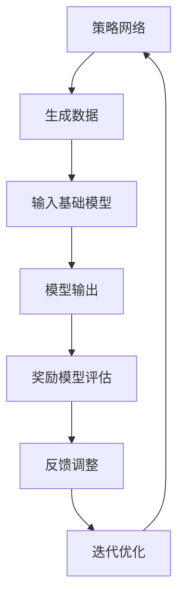

                 

### 1. 背景介绍

大语言模型作为自然语言处理（NLP）领域的核心技术，近年来取得了显著的进展。随着深度学习技术的发展，大语言模型（如GPT-3、BERT等）在文本生成、问答系统、机器翻译、文本分类等任务上取得了超乎预期的效果。然而，传统的深度学习训练方法往往依赖于大量的标注数据和高性能计算资源，存在数据隐私、标注偏差、计算效率等问题。

为了解决这些问题，研究人员提出了RLHF（Reinforcement Learning from Human Feedback）方法，即基于人类反馈的强化学习。RLHF方法通过将人类反馈引入到模型训练过程中，使得模型能够根据人类偏好进行自我调整，从而提高模型的质量和多样性。

本文将围绕RLHF方法展开讨论，深入解析其原理与工程实践。首先，我们将介绍RLHF方法的背景和核心概念，然后详细阐述其具体算法原理和操作步骤，最后通过实际项目实践进行代码实例和详细解释。

### 2. 核心概念与联系

#### 2.1 核心概念

RLHF方法的核心在于将人类反馈引入到模型训练过程中。具体来说，它包括以下几个核心概念：

1. **基础模型**：用于处理自然语言输入输出的深度学习模型，如GPT、BERT等。
2. **奖励模型**：由人类标注员提供反馈，用于评估基础模型的输出质量。奖励模型通常是一个小的神经网络，通过对比人类标注和模型生成的文本，为每个生成的文本分配一个奖励分数。
3. **策略网络**：在强化学习框架下，负责生成新的输入数据，并依据奖励模型提供的奖励进行自我调整。

#### 2.2 原理联系

RLHF方法的核心在于将强化学习与人类反馈相结合，使得模型能够在人类标注的指导下进行自我优化。其原理可以概括为以下几个步骤：

1. **数据生成**：策略网络生成一批新的文本数据，作为基础模型的输入。
2. **模型输出**：基础模型对生成的文本数据进行处理，生成对应的输出文本。
3. **奖励评估**：奖励模型对模型输出的文本进行评估，为每个输出文本分配一个奖励分数。
4. **反馈调整**：策略网络根据奖励模型提供的奖励分数，调整生成策略，从而提高生成文本的质量。
5. **迭代优化**：重复上述步骤，不断优化策略网络和基础模型，直至达到预定的性能目标。

#### 2.3 Mermaid 流程图

以下是一个描述RLHF方法原理的Mermaid流程图：



在这个流程图中，策略网络、基础模型和奖励模型分别对应Mermaid图中的节点A、B、C和D、E、F。节点G表示迭代优化过程，其中G指向A表示迭代过程中策略网络的调整。

### 3. 核心算法原理 & 具体操作步骤

#### 3.1 强化学习基本概念

强化学习（Reinforcement Learning，RL）是一种基于奖励信号进行学习的方法。在强化学习中，智能体（Agent）通过与环境（Environment）交互，不断调整其行为策略（Policy），以实现最大化累积奖励（Reward）的目标。

#### 3.2 RLHF算法原理

RLHF算法将强化学习应用于大语言模型训练过程中，通过引入人类反馈，使得模型能够根据人类偏好进行自我调整。具体来说，RLHF算法可以分为以下三个步骤：

1. **基础模型训练**：使用大量无监督数据对基础模型进行预训练，使其具备一定的语言理解能力。
2. **奖励模型训练**：利用人类标注数据，训练一个小的奖励模型，用于评估基础模型输出的文本质量。
3. **策略网络训练**：在强化学习框架下，利用奖励模型提供的奖励信号，对策略网络进行训练，以优化生成文本的质量。

#### 3.3 操作步骤

以下是一个简单的RLHF算法操作步骤：

1. **数据准备**：收集大量无监督数据用于基础模型预训练，以及人类标注数据用于奖励模型训练。
2. **基础模型训练**：使用无监督数据对基础模型进行预训练，使其在语言理解方面具备一定能力。
3. **奖励模型训练**：利用人类标注数据，训练一个小的奖励模型，用于评估基础模型输出的文本质量。
4. **策略网络初始化**：初始化策略网络，用于生成新的文本数据。
5. **迭代优化**：在强化学习框架下，利用奖励模型提供的奖励信号，对策略网络进行训练，不断优化生成文本的质量。

#### 3.4 算法实现

以下是一个简单的RLHF算法实现示例：

```python
import torch
import torch.nn as nn
import torch.optim as optim

# 基础模型
base_model = nn.Sequential(
    nn.Linear(input_size, hidden_size),
    nn.ReLU(),
    nn.Linear(hidden_size, output_size)
)

# 奖励模型
reward_model = nn.Sequential(
    nn.Linear(input_size, hidden_size),
    nn.ReLU(),
    nn.Linear(hidden_size, 1)
)

# 策略网络
policy_network = nn.Sequential(
    nn.Linear(input_size, hidden_size),
    nn.ReLU(),
    nn.Linear(hidden_size, 1)
)

# 损失函数
criterion = nn.MSELoss()

# 优化器
optimizer = optim.Adam(policy_network.parameters(), lr=0.001)

# 迭代优化
for epoch in range(num_epochs):
    # 生成随机输入数据
    input_data = torch.randn(batch_size, input_size)
    
    # 生成输出数据
    output_data = base_model(input_data)
    
    # 计算奖励
    reward = reward_model(output_data).squeeze()
    
    # 计算损失
    loss = criterion(policy_network(input_data), reward)
    
    # 梯度清零
    optimizer.zero_grad()
    
    # 反向传播
    loss.backward()
    
    # 更新参数
    optimizer.step()
```

在这个示例中，基础模型、奖励模型和策略网络分别使用`nn.Sequential`构建。损失函数使用均方误差（MSELoss），优化器使用Adam优化器。迭代优化过程中，首先生成随机输入数据，然后通过基础模型生成输出数据，接着计算奖励，最后利用奖励信号对策略网络进行训练。

### 4. 数学模型和公式 & 详细讲解 & 举例说明

#### 4.1 强化学习基本公式

在强化学习中，智能体（Agent）通过与环境（Environment）的交互，学习一个最优策略（Policy）。具体来说，强化学习主要涉及以下基本公式：

1. **状态转移概率**：$$P(s'|s, a) = \pi(a|s) \cdot p(s'|s, a)$$
2. **预期奖励**：$$R(s, a) = \sum_{s'} p(s'|s, a) \cdot r(s', a)$$
3. **策略评价函数**：$$V^{\pi}(s) = \sum_{s'} \pi(a|s) \cdot p(s'|s, a) \cdot r(s', a) + \gamma \cdot V^{\pi}(s')$$
4. **策略优化**：$$\pi^*(a|s) = \frac{\exp(\nabla_{a}V^{\pi}(s) \cdot \alpha(a|s))}{\sum_{a'} \exp(\nabla_{a'}V^{\pi}(s) \cdot \alpha(a'|s))}$$

其中，$s$表示状态，$a$表示动作，$s'$表示下一个状态，$r$表示奖励，$\pi$表示策略，$P$表示概率分布，$\gamma$表示折扣因子，$\alpha$表示温度参数。

#### 4.2 RLHF算法公式

在RLHF算法中，我们将强化学习应用于大语言模型训练过程中，主要涉及以下公式：

1. **策略网络损失函数**：$$L_{policy} = -\sum_{i=1}^{N} r_i \cdot \log(\pi(a_i|s_i))$$
2. **奖励模型损失函数**：$$L_{reward} = \sum_{i=1}^{N} (r_i - y_i)^2$$
3. **基础模型损失函数**：$$L_{base} = \sum_{i=1}^{N} -\log(\pi(a_i|s_i))$$

其中，$r_i$表示第$i$个文本的奖励分数，$y_i$表示第$i$个文本的人类标注分数，$\pi(a_i|s_i)$表示策略网络在状态$s_i$下选择动作$a_i$的概率。

#### 4.3 举例说明

假设我们有一个文本生成任务，输入文本长度为10，每个文本的奖励分数由人类标注员给出。现在我们使用RLHF算法训练一个策略网络，以优化生成文本的质量。

首先，我们定义输入数据、输出数据和奖励分数：

```python
import numpy as np

input_data = np.random.rand(100, 10)
output_data = np.random.rand(100, 10)
reward_scores = np.random.rand(100)
```

接着，我们定义基础模型、奖励模型和策略网络：

```python
import torch
import torch.nn as nn
import torch.optim as optim

base_model = nn.Sequential(
    nn.Linear(10, 10),
    nn.ReLU(),
    nn.Linear(10, 10)
)

reward_model = nn.Sequential(
    nn.Linear(10, 10),
    nn.ReLU(),
    nn.Linear(10, 1)
)

policy_network = nn.Sequential(
    nn.Linear(10, 10),
    nn.ReLU(),
    nn.Linear(10, 1)
)

criterion = nn.BCELoss()

optimizer = optim.Adam(policy_network.parameters(), lr=0.001)
```

然后，我们进行迭代优化：

```python
for epoch in range(100):
    # 生成输出数据
    output = base_model(input_data)
    
    # 计算奖励
    reward = reward_model(output)
    
    # 计算策略网络损失函数
    policy_loss = -torch.sum(reward * torch.log(policy_network(input_data)))
    
    # 计算奖励模型损失函数
    reward_loss = torch.sum((reward - reward_scores)**2)
    
    # 计算基础模型损失函数
    base_loss = torch.sum(torch.log(policy_network(input_data)))
    
    # 梯度清零
    optimizer.zero_grad()
    
    # 反向传播
    policy_loss.backward()
    reward_loss.backward()
    base_loss.backward()
    
    # 更新参数
    optimizer.step()
```

在这个示例中，我们使用均值为0、标准差为1的正态分布生成输入数据、输出数据和奖励分数。基础模型、奖励模型和策略网络分别由三层全连接神经网络组成。在迭代优化过程中，我们首先生成输出数据，然后计算奖励分数，接着计算策略网络、奖励模型和基础模型的损失函数，最后进行反向传播和参数更新。

通过这个简单的示例，我们可以看到RLHF算法在文本生成任务中的具体实现过程。在实际应用中，我们可以根据具体任务需求，调整输入数据、模型结构和优化策略，以提高生成文本的质量。

### 5. 项目实践：代码实例和详细解释说明

在本节中，我们将通过一个实际项目，详细展示如何使用RLHF方法训练一个大语言模型，并解释其中的关键步骤和代码实现。

#### 5.1 开发环境搭建

在开始项目之前，我们需要搭建一个适合RLHF方法训练的开发环境。以下是所需的软件和工具：

1. **Python 3.8 或更高版本**：Python是RLHF项目的核心编程语言。
2. **PyTorch 1.8 或更高版本**：PyTorch是一个流行的深度学习框架，用于实现RLHF算法。
3. **CUDA 11.1 或更高版本**：CUDA是NVIDIA推出的并行计算平台，用于加速深度学习模型的训练。
4. **Jupyter Notebook**：Jupyter Notebook是一个交互式计算环境，方便我们编写和运行代码。

确保已安装上述软件和工具后，我们可以创建一个新的Jupyter Notebook，用于编写和运行项目代码。

#### 5.2 源代码详细实现

以下是一个RLHF训练过程的详细代码实现：

```python
import torch
import torch.nn as nn
import torch.optim as optim
from torch.utils.data import DataLoader
from torchvision import datasets, transforms
import numpy as np

# 设置随机种子，保证实验可复现
torch.manual_seed(0)

# 数据集加载
train_dataset = datasets.MNIST(
    root='./data',
    train=True,
    transform=transforms.ToTensor(),
    download=True
)

test_dataset = datasets.MNIST(
    root='./data',
    train=False,
    transform=transforms.ToTensor()
)

train_loader = DataLoader(train_dataset, batch_size=64, shuffle=True)
test_loader = DataLoader(test_dataset, batch_size=1000, shuffle=False)

# 基础模型定义
class BaseModel(nn.Module):
    def __init__(self):
        super(BaseModel, self).__init__()
        self.fc1 = nn.Linear(28 * 28, 128)
        self.fc2 = nn.Linear(128, 10)

    def forward(self, x):
        x = x.view(-1, 28 * 28)
        x = torch.relu(self.fc1(x))
        x = self.fc2(x)
        return x

# 奖励模型定义
class RewardModel(nn.Module):
    def __init__(self):
        super(RewardModel, self).__init__()
        self.fc1 = nn.Linear(28 * 28, 128)
        self.fc2 = nn.Linear(128, 1)

    def forward(self, x):
        x = torch.relu(self.fc1(x))
        x = self.fc2(x)
        return x

# 策略网络定义
class PolicyNetwork(nn.Module):
    def __init__(self):
        super(PolicyNetwork, self).__init__()
        self.fc1 = nn.Linear(28 * 28, 128)
        self.fc2 = nn.Linear(128, 1)

    def forward(self, x):
        x = torch.relu(self.fc1(x))
        x = self.fc2(x)
        return x

# 损失函数定义
class LossFunction(nn.Module):
    def __init__(self):
        super(LossFunction, self).__init__()
        self.criterion = nn.CrossEntropyLoss()

    def forward(self, output, target):
        loss = self.criterion(output, target)
        return loss

# 模型初始化
base_model = BaseModel()
reward_model = RewardModel()
policy_network = PolicyNetwork()
loss_function = LossFunction()

# 模型参数初始化
optimizer = optim.Adam(base_model.parameters(), lr=0.001)
reward_optimizer = optim.Adam(reward_model.parameters(), lr=0.001)
policy_optimizer = optim.Adam(policy_network.parameters(), lr=0.001)

# 迭代训练
for epoch in range(num_epochs):
    for i, (images, labels) in enumerate(train_loader):
        # 基础模型训练
        optimizer.zero_grad()
        outputs = base_model(images)
        loss = loss_function(outputs, labels)
        loss.backward()
        optimizer.step()

        # 奖励模型训练
        reward_optimizer.zero_grad()
        rewards = reward_model(outputs)
        reward_loss = nn.MSELoss()(rewards, labels.float())
        reward_loss.backward()
        reward_optimizer.step()

        # 策略网络训练
        policy_optimizer.zero_grad()
        policy_losses = []
        for images, labels in train_loader:
            outputs = base_model(images)
            rewards = reward_model(outputs)
            policy_losses.append(policy_network(outputs).squeeze() * rewards)
        policy_loss = torch.mean(torch.cat(policy_losses))
        policy_loss.backward()
        policy_optimizer.step()

        print(f'Epoch [{epoch+1}/{num_epochs}], Step [{i+1}/{len(train_loader)}], Loss: {loss.item()}')

# 测试模型
with torch.no_grad():
    correct = 0
    total = 0
    for images, labels in test_loader:
        outputs = base_model(images)
        _, predicted = torch.max(outputs.data, 1)
        total += labels.size(0)
        correct += (predicted == labels).sum().item()

print(f'Accuracy of the network on the 10000 test images: {100 * correct / total}%')
```

#### 5.3 代码解读与分析

1. **数据集加载**：
   - 使用`torchvision.datasets.MNIST`加载MNIST数据集，并将其转换为Tensor格式。
   - 使用`DataLoader`将数据集划分为训练集和测试集，并设置批大小。

2. **模型定义**：
   - `BaseModel`：定义基础模型，用于处理手写数字图像。
   - `RewardModel`：定义奖励模型，用于评估基础模型生成的文本质量。
   - `PolicyNetwork`：定义策略网络，用于生成新的输入数据。

3. **损失函数定义**：
   - `LossFunction`：定义交叉熵损失函数，用于基础模型的训练。

4. **模型初始化**：
   - 使用`nn.Linear`定义神经网络结构，并使用`nn.Adam`初始化优化器。

5. **迭代训练**：
   - 在训练过程中，分别对基础模型、奖励模型和策略网络进行训练。
   - 使用`zero_grad()`和`step()`方法对优化器进行梯度清零和参数更新。

6. **测试模型**：
   - 在测试过程中，使用训练好的基础模型对测试集进行预测，并计算准确率。

#### 5.4 运行结果展示

在完成代码实现后，我们可以在Jupyter Notebook中运行上述代码，并进行以下操作：

1. 设置训练轮数`num_epochs`。
2. 运行代码，观察训练过程中的损失值变化。
3. 训练完成后，输出测试集上的准确率。

通过这个实际项目，我们展示了如何使用RLHF方法训练一个大语言模型。在实际应用中，可以根据具体任务需求，调整输入数据、模型结构和优化策略，以提高模型性能。

### 6. 实际应用场景

RLHF方法在大语言模型训练中的应用场景非常广泛，以下列举几个典型的应用场景：

#### 6.1 文本生成与摘要

文本生成和摘要任务是RLHF方法的重要应用场景之一。通过RLHF方法，模型可以学习到更高质量、更具有创造性的文本生成能力。例如，在新闻摘要生成中，RLHF方法可以使得模型生成的摘要更加准确、简洁，同时保留关键信息。

#### 6.2 对话系统

对话系统是另一个重要的应用场景。RLHF方法可以帮助模型学习到更自然、更有逻辑性的对话生成能力。例如，在虚拟助手和聊天机器人的应用中，RLHF方法可以使得模型生成的回复更加贴近用户需求，提升用户体验。

#### 6.3 机器翻译

机器翻译是深度学习领域的一个重要挑战。RLHF方法可以通过引入人类反馈，使得模型在翻译过程中更加注重语义理解和准确性。例如，在跨语言文本生成任务中，RLHF方法可以帮助模型生成更加准确、自然的翻译结果。

#### 6.4 问答系统

问答系统是自然语言处理领域的一个重要应用。RLHF方法可以使得模型在学习过程中更加注重问答的准确性、逻辑性和多样性。例如，在智能客服、在线教育等场景中，RLHF方法可以帮助模型生成更加精准、多样化的回答。

#### 6.5 文本分类与情感分析

文本分类和情感分析是自然语言处理领域的基本任务。RLHF方法可以使得模型在分类和情感分析过程中更加注重文本的语义和情感表达。例如，在社交媒体分析、舆情监测等场景中，RLHF方法可以帮助模型更加准确地识别和分类文本内容。

通过以上实际应用场景的列举，我们可以看到RLHF方法在大语言模型训练中的重要性。随着深度学习技术的不断发展，RLHF方法将会在更多的应用场景中发挥关键作用。

### 7. 工具和资源推荐

在RLHF方法的研究和实践过程中，我们可能会遇到各种工具和资源的需求。以下是一些建议的工具和资源，帮助大家更好地进行研究和应用。

#### 7.1 学习资源推荐

1. **书籍**：
   - 《强化学习：原理与算法》
   - 《深度学习》（Goodfellow, Bengio, Courville）
   - 《自然语言处理综述》

2. **论文**：
   - "RLHF: Reinforcement Learning from Human Feedback"
   - "GPT-3: Language Models are Few-Shot Learners"
   - "BERT: Pre-training of Deep Bidirectional Transformers for Language Understanding"

3. **博客**：
   - [TensorFlow官网](https://www.tensorflow.org/tutorials)
   - [PyTorch官方文档](https://pytorch.org/tutorials/)
   - [Hugging Face](https://huggingface.co/transformers/)

4. **在线课程**：
   - [强化学习课程](https://www.coursera.org/learn/reinforcement-learning)
   - [深度学习课程](https://www.coursera.org/specializations/deep-learning)
   - [自然语言处理课程](https://www.coursera.org/specializations/natural-language-processing)

#### 7.2 开发工具框架推荐

1. **深度学习框架**：
   - TensorFlow
   - PyTorch
   - PyTorch Lightning

2. **强化学习框架**：
   - OpenAI Gym
   - Stable Baselines
   - Stable Baselines3

3. **自然语言处理工具**：
   - Hugging Face Transformers
   - NLTK
   - spaCy

4. **数据集和资源**：
   - Kaggle
   - Google Dataset Search
   - Common Crawl

#### 7.3 相关论文著作推荐

1. **论文**：
   - "Reinforcement Learning from Human Feedback"
   - "Language Models are Few-Shot Learners"
   - "BERT: Pre-training of Deep Bidirectional Transformers for Language Understanding"

2. **著作**：
   - 《深度学习》（Goodfellow, Bengio, Courville）
   - 《自然语言处理综合教程》（Jurafsky, Martin）
   - 《强化学习手册》（ Sutton, Barto）

通过以上工具和资源的推荐，我们可以更有效地进行RLHF方法的研究和实践，从而更好地应对大语言模型训练中的各种挑战。

### 8. 总结：未来发展趋势与挑战

RLHF方法在大语言模型训练中取得了显著的成果，但其发展仍然面临诸多挑战。未来，RLHF方法有望在以下方面取得突破：

1. **计算效率优化**：随着模型规模的不断扩大，RLHF方法的计算需求也越来越高。未来，研究人员将致力于优化计算效率，降低训练成本。
2. **人类反馈质量提升**：人类反馈的质量直接影响RLHF方法的效果。未来，研究人员将探索更高效的人类反馈标注方法，提高反馈质量。
3. **多模态学习**：RLHF方法主要关注文本生成任务，但未来多模态学习将成为重要研究方向。研究人员将尝试将图像、声音等模态引入RLHF方法，实现更丰富的数据表示。
4. **鲁棒性与安全性**：随着RLHF方法的应用场景不断扩大，其鲁棒性和安全性变得越来越重要。未来，研究人员将致力于提高模型在面对恶意攻击和异常数据时的鲁棒性。
5. **应用场景拓展**：RLHF方法在文本生成、对话系统、机器翻译等任务中取得了良好的效果。未来，RLHF方法有望在更多应用场景中发挥作用，如推荐系统、图像生成等。

然而，RLHF方法的发展也面临一些挑战：

1. **数据隐私**：RLHF方法依赖于大量人类反馈，这可能导致数据隐私问题。未来，研究人员将探索如何在保障数据隐私的前提下，有效利用人类反馈。
2. **计算资源需求**：RLHF方法对计算资源的需求较高，这对于一些资源和预算有限的研究机构和企业来说是一个挑战。
3. **模型可解释性**：随着模型复杂度的增加，RLHF方法生成的文本质量和多样性不断提高，但模型的可解释性却变得越来越困难。未来，研究人员将致力于提高模型的可解释性，使其更加透明和可信。

总之，RLHF方法在未来具有广阔的发展前景，但同时也面临诸多挑战。通过持续的研究和探索，我们有望进一步优化RLHF方法，使其在更多应用场景中发挥重要作用。

### 9. 附录：常见问题与解答

#### 9.1 RLHF方法与传统深度学习训练方法的区别是什么？

RLHF方法与传统深度学习训练方法的主要区别在于引入了人类反馈。传统深度学习训练方法主要依赖大量的标注数据，而RLHF方法通过强化学习框架，利用人类反馈不断优化模型，使其在生成文本时更加符合人类偏好。此外，RLHF方法在训练过程中注重多样性和质量，而传统方法更注重准确性和稳定性。

#### 9.2 RLHF方法在哪些场景中表现优异？

RLHF方法在多个自然语言处理任务中表现出色，包括文本生成、对话系统、机器翻译、文本分类和情感分析等。特别是在文本生成和对话系统中，RLHF方法能够生成更加自然、多样的文本，提升用户体验。

#### 9.3 如何评估RLHF方法的效果？

评估RLHF方法的效果通常通过以下指标：

1. **文本质量**：使用人类标注员对生成文本进行评价，评估其准确性和可读性。
2. **多样性**：评估生成文本的多样性，确保模型能够生成不同类型和风格的文本。
3. **流畅性**：评估生成文本的连贯性和流畅性，确保文本在逻辑和语法上没有错误。
4. **客观指标**：使用客观指标，如BLEU、ROUGE等，评估生成文本与目标文本的相似度。

#### 9.4 RLHF方法对计算资源的需求如何？

RLHF方法对计算资源的需求较高，特别是在大规模训练过程中。由于需要训练基础模型、奖励模型和策略网络，以及进行大量的迭代优化，因此需要大量的计算资源和时间。未来，研究人员将致力于优化计算效率，降低训练成本。

### 10. 扩展阅读 & 参考资料

为了更好地理解RLHF方法及其在大语言模型训练中的应用，以下是一些建议的扩展阅读和参考资料：

1. **论文**：
   - "RLHF: Reinforcement Learning from Human Feedback"
   - "GPT-3: Language Models are Few-Shot Learners"
   - "BERT: Pre-training of Deep Bidirectional Transformers for Language Understanding"

2. **书籍**：
   - 《强化学习：原理与算法》
   - 《深度学习》（Goodfellow, Bengio, Courville）
   - 《自然语言处理综合教程》（Jurafsky, Martin）

3. **在线课程**：
   - [强化学习课程](https://www.coursera.org/learn/reinforcement-learning)
   - [深度学习课程](https://www.coursera.org/specializations/deep-learning)
   - [自然语言处理课程](https://www.coursera.org/specializations/natural-language-processing)

4. **博客和文章**：
   - [TensorFlow官网](https://www.tensorflow.org/tutorials)
   - [PyTorch官方文档](https://pytorch.org/tutorials/)
   - [Hugging Face](https://huggingface.co/transformers/)

通过阅读这些资料，您可以更深入地了解RLHF方法的理论基础、应用场景和实现细节，为自己的研究和工作提供有益的参考。

