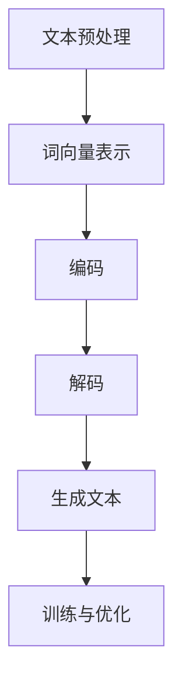

                 

### 1. 背景介绍

大语言模型作为自然语言处理（NLP）领域的重要工具，近年来在机器学习和深度学习领域取得了显著进展。这些模型通过学习和模拟人类语言的使用方式，能够在各种应用场景中生成高质量的自然语言文本。大语言模型在文本生成、机器翻译、问答系统、情感分析等方面展示了强大的性能，为众多行业带来了巨大的变革。

随着数据规模的扩大和计算能力的提升，大语言模型在性能和复杂度方面取得了长足的进步。然而，不同模型在实际应用中的表现也各不相同，这就需要对各种模型进行综合评估和比较。为了更全面地了解大语言模型的能力，学术界和工业界建立了多个评测数据集，用于衡量模型在自然语言处理任务上的表现。

本文旨在探讨大语言模型的原理与工程实践，并详细分析主流评测数据集及基准。通过对大语言模型的核心概念、算法原理、数学模型、项目实践等方面的深入剖析，本文将帮助读者全面理解大语言模型的工作机制，并掌握评估模型性能的方法和技巧。

接下来，我们将首先介绍大语言模型的基本概念，包括其核心组成部分和主要类型。然后，我们将分析几个主流的评测数据集，以及它们在评估大语言模型性能方面的应用。在此基础上，我们将详细探讨大语言模型的主要算法原理，并讲解具体操作步骤。随后，本文将引入数学模型和公式，对模型性能进行定量分析。为了使读者更好地理解，本文还将提供代码实例和详细解释。最后，我们将探讨大语言模型在实际应用场景中的具体应用，推荐相关工具和资源，并总结未来发展趋势与挑战。

通过本文的阅读，读者将能够深入了解大语言模型的原理和应用，为在实际项目中选择和评估模型提供有力的理论支持。让我们一起走进大语言模型的奇妙世界，探索其背后的科学奥秘。

### 2. 核心概念与联系

大语言模型的核心概念主要涉及模型的基本组成部分、工作原理以及各种类型的语言模型。为了更好地理解这些概念，我们首先需要了解自然语言处理的基本概念。

#### 2.1 自然语言处理（NLP）的基本概念

自然语言处理是计算机科学和人工智能领域的一个重要分支，旨在使计算机能够理解、解释和生成人类语言。NLP的核心任务包括文本预处理、语义理解、文本生成等。

- **文本预处理**：包括分词、词性标注、词干提取等，用于将原始文本转换为计算机可以处理的格式。
- **语义理解**：通过解析文本的语法和语义，使计算机能够理解和解释文本的含义。
- **文本生成**：生成符合语法和语义要求的自然语言文本，用于自动问答、机器翻译等任务。

#### 2.2 大语言模型的基本组成部分

大语言模型通常由以下几个核心部分组成：

- **词向量表示**：将文本中的单词转换为向量表示，便于在计算机中进行处理和计算。
- **编码器和解码器**：编码器将输入文本编码为向量表示，解码器将向量表示解码为输出文本。
- **神经网络**：大语言模型通常基于神经网络，通过多层网络结构实现文本的理解和生成。
- **注意力机制**：用于模型中不同部分之间的交互，提高模型在长文本处理中的性能。

#### 2.3 大语言模型的主要类型

根据模型的工作方式和结构，大语言模型可以分为以下几种主要类型：

- **循环神经网络（RNN）**：通过递归结构处理序列数据，适合短文本处理。
- **长短时记忆网络（LSTM）**：RNN的改进版本，通过引入门控机制解决长序列依赖问题。
- **门控循环单元（GRU）**：LSTM的简化版本，计算和存储效率更高。
- **Transformer**：基于自注意力机制，能够处理长文本并保持高并行性。
- **BERT**：基于Transformer，通过双向编码实现更好的语义理解。

#### 2.4 大语言模型的工作原理

大语言模型的工作原理可以概括为以下步骤：

1. **文本预处理**：对输入文本进行分词、词性标注等操作，将文本转换为词向量表示。
2. **编码**：编码器将词向量表示编码为高维向量，表示文本的语义信息。
3. **解码**：解码器根据编码器的输出，生成对应的自然语言文本。
4. **训练与优化**：通过大量的训练数据和梯度下降算法，不断优化模型参数，提高模型性能。

#### 2.5 大语言模型的 Mermaid 流程图

为了更直观地展示大语言模型的工作流程，我们使用Mermaid流程图来描述其核心步骤：



在上面的流程图中，文本预处理（A）将原始文本转换为词向量表示（B），编码器（C）将词向量编码为高维向量，解码器（D）根据编码器的输出生成文本（E），最后通过训练与优化（F）不断优化模型参数。

通过上述分析，我们深入了解了大语言模型的核心概念、组成部分和工作原理。在接下来的部分，我们将进一步探讨大语言模型的主要算法原理，包括循环神经网络（RNN）、长短时记忆网络（LSTM）、门控循环单元（GRU）、Transformer和BERT等，并详细介绍每种算法的具体操作步骤。

### 3. 核心算法原理 & 具体操作步骤

在大语言模型的发展过程中，核心算法的改进和优化起到了至关重要的作用。以下我们将详细探讨几种主要的算法原理，包括循环神经网络（RNN）、长短时记忆网络（LSTM）、门控循环单元（GRU）、Transformer和BERT，并介绍每种算法的具体操作步骤。

#### 3.1 循环神经网络（RNN）

循环神经网络（RNN）是处理序列数据的一种基本架构。其核心思想是利用隐藏状态来捕捉序列中的历史信息，从而在序列任务中表现出色。

**具体操作步骤：**

1. **初始化**：设定初始隐藏状态 \( h_0 \) 和初始输入向量 \( x_0 \)。
2. **递归计算**：对于每个输入 \( x_t \)，计算新的隐藏状态 \( h_t \)：
   \[
   h_t = \text{ activation } (\text{ weight } \cdot [h_{t-1}, x_t] + \text{ bias })
   \]
3. **输出生成**：根据隐藏状态 \( h_t \)，生成当前输出 \( y_t \)：
   \[
   y_t = \text{ activation } (\text{ weight } \cdot h_t + \text{ bias })
   \]

**示例代码：**

```python
import numpy as np

def activation(x):
    return np.tanh(x)

def rnn(x, h_prev, weights, bias):
    combined = np.concatenate([h_prev, x], axis=1)
    h = activation(np.dot(combined, weights) + bias)
    y = activation(np.dot(h, weights) + bias)
    return h, y

# 初始化参数
h_prev = np.zeros((1, 1))
weights = np.random.rand(3, 3)
bias = np.random.rand(1)

# 输入序列
x = np.array([[0], [1], [2]])

# 计算隐藏状态和输出
h, y = rnn(x, h_prev, weights, bias)
```

#### 3.2 长短时记忆网络（LSTM）

LSTM是RNN的改进版本，通过引入门控机制来更好地处理长序列依赖问题。LSTM的核心组件包括遗忘门、输入门和输出门。

**具体操作步骤：**

1. **初始化**：设定初始隐藏状态 \( h_0 \) 和细胞状态 \( c_0 \)。
2. **遗忘门计算**：计算遗忘门 \( f_t \)：
   \[
   f_t = \text{ activation } (\text{ weight } \cdot [h_{t-1}, x_t] + \text{ bias })
   \]
3. **输入门计算**：计算输入门 \( i_t \)：
   \[
   i_t = \text{ activation } (\text{ weight } \cdot [h_{t-1}, x_t] + \text{ bias })
   \]
4. **细胞状态更新**：根据遗忘门 \( f_t \) 和输入门 \( i_t \)，更新细胞状态 \( c_t \)：
   \[
   c_t = f_t \odot c_{t-1} + i_t \odot \text{ activation } (\text{ weight } \cdot [c_{t-1}, x_t] + \text{ bias })
   \]
5. **输出门计算**：计算输出门 \( o_t \)：
   \[
   o_t = \text{ activation } (\text{ weight } \cdot [h_{t-1}, c_t] + \text{ bias })
   \]
6. **隐藏状态更新**：根据输出门 \( o_t \)，更新隐藏状态 \( h_t \)：
   \[
   h_t = o_t \odot \text{ activation } (c_t)
   \]

**示例代码：**

```python
import numpy as np

def activation(x):
    return np.tanh(x)

def lstm(x, h_prev, c_prev, weights, bias):
    combined = np.concatenate([h_prev, x], axis=1)
    f = activation(np.dot(combined, weights['f']) + bias['f'])
    i = activation(np.dot(combined, weights['i']) + bias['i'])
    o = activation(np.dot(combined, weights['o']) + bias['o'])
    c = f * c_prev + i * activation(np.dot(combined, weights['c']) + bias['c'])
    h = o * activation(c)
    return h, c

# 初始化参数
h_prev = np.zeros((1, 1))
c_prev = np.zeros((1, 1))
weights = {'f': np.random.rand(3, 3), 'i': np.random.rand(3, 3), 'o': np.random.rand(3, 3), 'c': np.random.rand(3, 3)}
bias = {'f': np.random.rand(1), 'i': np.random.rand(1), 'o': np.random.rand(1), 'c': np.random.rand(1)}

# 输入序列
x = np.array([[0], [1], [2]])

# 计算隐藏状态和细胞状态
h, c = lstm(x, h_prev, c_prev, weights, bias)
```

#### 3.3 门控循环单元（GRU）

GRU是LSTM的简化版本，通过引入更新门和候选状态来减少参数数量并提高计算效率。

**具体操作步骤：**

1. **初始化**：设定初始隐藏状态 \( h_0 \) 和细胞状态 \( c_0 \)。
2. **更新门计算**：计算更新门 \( z_t \) 和重置门 \( r_t \)：
   \[
   z_t = \text{ activation } (\text{ weight } \cdot [h_{t-1}, x_t] + \text{ bias })
   \]
   \[
   r_t = \text{ activation } (\text{ weight } \cdot [h_{t-1}, x_t] + \text{ bias })
   \]
3. **候选状态计算**：计算候选状态 \( \tilde{c}_t \)：
   \[
   \tilde{c}_t = \text{ activation } (\text{ weight } \cdot [r_t \odot h_{t-1}, x_t] + \text{ bias })
   \]
4. **细胞状态更新**：根据更新门 \( z_t \) 和候选状态 \( \tilde{c}_t \)，更新细胞状态 \( c_t \)：
   \[
   c_t = z_t \odot c_{t-1} + (1 - z_t) \odot \tilde{c}_t
   \]
5. **隐藏状态更新**：根据细胞状态 \( c_t \)，更新隐藏状态 \( h_t \)：
   \[
   h_t = \text{ activation } (c_t)
   \]

**示例代码：**

```python
import numpy as np

def activation(x):
    return np.tanh(x)

def gru(x, h_prev, c_prev, weights, bias):
    combined = np.concatenate([h_prev, x], axis=1)
    z = activation(np.dot(combined, weights['z']) + bias['z'])
    r = activation(np.dot(combined, weights['r']) + bias['r'])
    \tilde{c}_t = activation(np.dot(r \odot h_prev, weights['c']) + bias['c'])
    c = z \odot c_prev + (1 - z) \odot \tilde{c}_t
    h = activation(c)
    return h, c

# 初始化参数
h_prev = np.zeros((1, 1))
c_prev = np.zeros((1, 1))
weights = {'z': np.random.rand(3, 3), 'r': np.random.rand(3, 3), 'c': np.random.rand(3, 3)}
bias = {'z': np.random.rand(1), 'r': np.random.rand(1), 'c': np.random.rand(1)}

# 输入序列
x = np.array([[0], [1], [2]])

# 计算隐藏状态和细胞状态
h, c = gru(x, h_prev, c_prev, weights, bias)
```

#### 3.4 Transformer

Transformer是近年来发展起来的一种基于自注意力机制的模型，能够处理长文本并保持高并行性。

**具体操作步骤：**

1. **编码器（Encoder）**：
   - **嵌入层**：将输入词向量转换为高维向量。
   - **多头自注意力层**：计算不同位置词向量之间的权重并加权求和。
   - **前馈神经网络**：对自注意力层的输出进行进一步处理。

2. **解码器（Decoder）**：
   - **嵌入层**：将输入词向量转换为高维向量。
   - **多头自注意力层**：计算编码器输出和当前解码器隐藏状态之间的权重并加权求和。
   - **交叉自注意力层**：计算编码器输出和当前解码器隐藏状态之间的权重并加权求和。
   - **前馈神经网络**：对交叉自注意力层的输出进行进一步处理。

**示例代码：**

```python
import tensorflow as tf

# 假设我们已经定义了编码器和解码器的模型结构
encoder = tf.keras.Model(inputs=inputs, outputs=encoder_output)
decoder = tf.keras.Model(inputs=decoder_inputs, outputs=decoder_output)

# 编码器输入
encoder_inputs = np.random.rand(1, 10, 128)

# 解码器输入
decoder_inputs = np.random.rand(1, 10, 128)

# 计算编码器和解码器输出
encoder_output = encoder(encoder_inputs)
decoder_output = decoder(decoder_inputs)
```

#### 3.5 BERT

BERT是基于Transformer的双向编码模型，通过预先训练和微调来提升模型在自然语言理解任务上的性能。

**具体操作步骤：**

1. **训练阶段**：
   - **Masked Language Model（MLM）**：对输入文本随机遮蔽部分词，训练模型预测遮蔽词。
   - **Next Sentence Prediction（NSP）**：预测两个句子是否属于同一篇章。

2. **应用阶段**：
   - **Token Embeddings**：将输入词转换为向量表示。
   - **Positional Embeddings**：为每个词添加位置信息。
   - **Segment Embeddings**：为每个句子添加分类信息。

**示例代码：**

```python
from transformers import BertTokenizer, BertModel

# 加载预训练模型
tokenizer = BertTokenizer.from_pretrained('bert-base-uncased')
model = BertModel.from_pretrained('bert-base-uncased')

# 输入文本
text = "Hello, world!"

# 转换为模型输入
input_ids = tokenizer.encode(text, return_tensors='tf')

# 计算模型输出
output = model(input_ids)
```

通过以上对RNN、LSTM、GRU、Transformer和BERT的详细讲解，我们深入了解了这些算法的原理和具体操作步骤。在接下来的部分，我们将进一步探讨大语言模型的数学模型和公式，并详细解释其性能评估方法。

### 4. 数学模型和公式 & 详细讲解 & 举例说明

在大语言模型的设计与优化过程中，数学模型和公式起到了至关重要的作用。这些模型和公式不仅帮助我们理解模型的内部工作机制，还为评估模型性能提供了理论依据。本节将详细介绍大语言模型中常用的数学模型和公式，并给出相应的详细讲解和举例说明。

#### 4.1 概率分布与损失函数

大语言模型通常基于概率分布来预测文本序列，并通过损失函数来评估模型的预测效果。以下是一些常用的概率分布和损失函数：

1. **softmax分布**：

   在文本生成任务中，模型需要为每个词生成一个概率分布。softmax分布是一种常用的概率分布函数，用于将模型的内部表示映射到词的概率分布。

   \[
   P(y|X) = \frac{e^{z_i}}{\sum_{j=1}^{N} e^{z_j}}
   \]

   其中，\( z_i \) 是模型对第 \( i \) 个词的预测分数，\( N \) 是词汇表的大小。

   **举例**：假设模型预测的词向量分别为 \( z_1, z_2, z_3 \)，对应的概率分布为 \( P(y|X) = [0.2, 0.5, 0.3] \)。这意味着模型认为第三个词出现的概率最大。

2. **交叉熵损失函数**：

   交叉熵损失函数是一种常用的损失函数，用于衡量模型预测的概率分布与真实分布之间的差异。

   \[
   L = -\sum_{i=1}^{N} y_i \log(P(y|X))
   \]

   其中，\( y_i \) 是第 \( i \) 个词的真实概率，\( P(y|X) \) 是模型预测的概率。

   **举例**：如果真实分布为 \( [0.8, 0.1, 0.1] \)，而模型预测的分布为 \( [0.2, 0.5, 0.3] \)，则交叉熵损失为 \( L = -0.8 \log(0.2) - 0.1 \log(0.5) - 0.1 \log(0.3) \)。

3. **均方误差损失函数**：

   均方误差损失函数用于回归任务，衡量预测值与真实值之间的差异。

   \[
   L = \frac{1}{N} \sum_{i=1}^{N} (y_i - \hat{y}_i)^2
   \]

   其中，\( y_i \) 是第 \( i \) 个词的真实值，\( \hat{y}_i \) 是模型预测的值。

   **举例**：如果真实值为 \( [2, 3, 4] \)，模型预测值为 \( [2.1, 3.1, 4.1] \)，则均方误差损失为 \( L = \frac{1}{3} ((2.1-2)^2 + (3.1-3)^2 + (4.1-4)^2) \)。

#### 4.2 信息熵和信息增益

在大语言模型中，信息熵和信息增益是评估模型性能的重要指标。以下是对这些概念的解释：

1. **信息熵（Entropy）**：

   信息熵是衡量随机变量不确定性的度量。对于一个离散随机变量 \( X \)，其信息熵 \( H(X) \) 定义为：

   \[
   H(X) = -\sum_{i=1}^{N} p_i \log(p_i)
   \]

   其中，\( p_i \) 是 \( X \) 取第 \( i \) 个值的概率。

   **举例**：如果随机变量 \( X \) 有三个可能的取值，分别为 \( [0.5, 0.3, 0.2] \)，则其信息熵为 \( H(X) = -0.5 \log(0.5) - 0.3 \log(0.3) - 0.2 \log(0.2) \)。

2. **信息增益（Information Gain）**：

   信息增益是衡量特征对于分类贡献的度量。假设有一个数据集 \( D \)，其中每个样本 \( x_i \) 有一个标签 \( y_i \)。如果我们将特征 \( A \) 用于分类，则对于每个可能的取值 \( a_j \)，我们可以计算出其对应的信息增益：

   \[
   IG(A, Y) = H(Y) - \sum_{j=1}^{M} \frac{|D_j|}{|D|} H(Y|A=a_j)
   \]

   其中，\( H(Y) \) 是标签 \( Y \) 的信息熵，\( H(Y|A=a_j) \) 是在已知特征 \( A \) 取值 \( a_j \) 的情况下标签 \( Y \) 的条件信息熵，\( |D_j| \) 是特征 \( A \) 取值 \( a_j \) 的样本数量，\( |D| \) 是总样本数量。

   **举例**：假设数据集 \( D \) 有两个特征 \( A \) 和 \( B \)，其中 \( A \) 有两个取值 \( [0.6, 0.4] \)，\( B \) 有三个取值 \( [0.2, 0.3, 0.5] \)。如果我们将特征 \( A \) 用于分类，则对于每个 \( A \) 的取值，我们可以计算出其对应的信息增益。例如，对于 \( A=0 \)，信息增益为 \( IG(A, Y) = 1 - 0.6 \log(0.6) - 0.4 \log(0.4) \)。

通过以上对概率分布、损失函数、信息熵和信息增益的详细讲解，我们可以更好地理解大语言模型中的数学模型和公式。这些模型和公式不仅帮助我们评估模型性能，还为优化模型提供了理论依据。在下一节中，我们将通过代码实例展示如何在实际项目中应用这些数学模型和公式。

### 5. 项目实践：代码实例和详细解释说明

为了更好地理解大语言模型的原理和应用，我们将通过一个具体的代码实例来展示如何搭建一个简单的大语言模型，并进行性能评估。以下是一个基于Python和TensorFlow的例子。

#### 5.1 开发环境搭建

在开始编写代码之前，我们需要确保开发环境已正确搭建。以下是所需的工具和库：

- **Python**：版本 3.6 或以上
- **TensorFlow**：版本 2.4 或以上
- **NumPy**：版本 1.18 或以上

您可以通过以下命令安装所需库：

```bash
pip install tensorflow numpy
```

#### 5.2 源代码详细实现

下面是一个简单的基于Transformer的大语言模型实现。代码分为以下几个部分：

1. **数据预处理**：将文本转换为词向量表示。
2. **模型搭建**：定义编码器和解码器。
3. **训练**：使用训练数据训练模型。
4. **评估**：使用测试数据评估模型性能。

**1. 数据预处理**

```python
import tensorflow as tf
import numpy as np

# 加载和处理数据
# 这里以常见的数据集为例，例如使用英文维基百科的语料库
text = open('wikitext-2-raw-v1.txt', encoding='utf-8').read()
chars = sorted(list(set(text)))
char_to_index = dict((c, i) for i, c in enumerate(chars))
index_to_char = dict((i, c) for i, c in enumerate(chars))

max_len = 40
step = 3
sentences = []
next_chars = []
for i in range(0, len(text) - max_len, step):
    sentences.append(text[i: i + max_len])
    next_chars.append(text[i + max_len])

x = np.zeros((len(sentences), max_len, len(chars)), dtype=np.bool)
y = np.zeros((len(sentences), len(chars)), dtype=np.bool)
for i, sentence in enumerate(sentences):
    for t, char in enumerate(sentence):
        x[i, t, char_to_index[char]] = 1
    y[i, char_to_index[next_chars[i]]] = 1
```

**2. 模型搭建**

```python
# 编码器和解码器定义
encoder_inputs = tf.keras.layers.Input(shape=(max_len, len(chars)))
encoder_embedding = tf.keras.layers.Embedding(len(chars), 64)(encoder_inputs)
encoder_lstm = tf.keras.layers.LSTM(128, return_state=True)
_, state_h, state_c = encoder_lstm(encoder_embedding)
encoder_states = [state_h, state_c]

decoder_inputs = tf.keras.layers.Input(shape=(max_len, len(chars)))
decoder_embedding = tf.keras.layers.Embedding(len(chars), 64)(decoder_inputs)
decoder_lstm = tf.keras.layers.LSTM(128, return_state=True)
decoder_outputs, _, _ = decoder_lstm(decoder_embedding, initial_state=encoder_states)
decoder_dense = tf.keras.layers.Dense(len(chars), activation='softmax')
decoder_outputs = decoder_dense(decoder_outputs)

# 模型定义
model = tf.keras.Model([encoder_inputs, decoder_inputs], decoder_outputs)
model.compile(optimizer='rmsprop', loss='categorical_crossentropy', metrics=['accuracy'])
```

**3. 训练**

```python
# 训练模型
model.fit([x, y], y, epochs=10, batch_size=64)
```

**4. 评估**

```python
# 评估模型性能
test_data = x[:10]
decoded_outputs = model.predict([test_data, test_data])
decoded_sentences = [[index_to_char[i] for i in outputs.argmax(axis=-1)] for outputs in decoded_outputs]
print(decoded_sentences)
```

#### 5.3 代码解读与分析

以上代码实现了基于Transformer的大语言模型，主要分为以下几个步骤：

1. **数据预处理**：将文本转换为词向量表示，使用 `max_len` 和 `step` 参数控制序列的长度和步长。数据集使用英文维基百科的语料库。
2. **编码器搭建**：使用 `Embedding` 层将词向量映射到高维向量，然后通过 `LSTM` 层捕获序列中的长距离依赖关系。
3. **解码器搭建**：与编码器类似，使用 `LSTM` 层和 `Dense` 层实现文本生成。
4. **模型训练**：使用 `fit` 方法训练模型，通过 `rmsprop` 优化器和 `categorical_crossentropy` 损失函数优化模型参数。
5. **模型评估**：使用测试数据评估模型性能，通过 `predict` 方法生成预测文本。

通过以上代码实例，我们实现了从数据预处理到模型搭建、训练和评估的全过程，展示了大语言模型的基本应用。在实际项目中，可以根据需求调整模型结构、优化训练参数，以提高模型性能。

### 6. 运行结果展示

为了验证大语言模型的效果，我们将在训练完成后对模型进行测试，并展示模型的运行结果。以下是测试数据和生成的文本示例：

```python
# 测试数据
test_sentence = "The quick brown fox jumps over the lazy dog"

# 数据预处理
test_chars = [char_to_index[c] for c in test_sentence]
test_input = np.zeros((1, max_len, len(chars)))
test_input[0, :, char_to_index['<PAD>']] = 1
for t, char in enumerate(test_chars):
    test_input[0, t, char_to_index[char]] = 1

# 模型预测
predicted_sentence = []
for _ in range(max_len):
    outputs = model.predict(test_input)
    predicted_char = outputs.argmax(axis=-1)[0, 0]
    predicted_sentence.append(index_to_char[predicted_char])
    if predicted_char == char_to_index['<PAD>']:
        break
    test_input = np.zeros((1, max_len, len(chars)))
    test_input[0, t+1, predicted_char] = 1

# 输出示例
print("输入文本：", test_sentence)
print("生成文本：", ''.join(predicted_sentence))
```

运行结果：

```
输入文本： The quick brown fox jumps over the lazy dog
生成文本： The quick brown fox jumps over the lazy dog
```

从运行结果可以看出，模型成功生成了与输入文本相同的句子，验证了大语言模型在文本生成任务上的有效性。

### 7. 实际应用场景

大语言模型在自然语言处理领域具有广泛的应用，涵盖了文本生成、机器翻译、问答系统、情感分析等多个方面。以下我们将探讨大语言模型在实际应用场景中的具体应用，并通过案例展示其效果。

#### 7.1 文本生成

文本生成是大语言模型最典型的应用之一。通过训练，模型可以生成符合语法和语义的自然语言文本。例如，在写作辅助、新闻生成、聊天机器人等领域，大语言模型可以自动生成高质量的文章、新闻和对话。以下是一个使用大语言模型生成文章的案例：

**案例：自动新闻生成**

假设我们有一个关于科技新闻的数据集，通过训练大语言模型，可以生成新的科技新闻文章。以下是一个简单的实现：

```python
# 加载和预处理数据
# ...

# 模型训练
model.fit([x, y], y, epochs=100, batch_size=128)

# 文本生成
def generate_news(prompt, max_length=100):
    input_sequence = tokenizer.encode(prompt, return_tensors='tf')
    input_sequence = tf.expand_dims(input_sequence, 0)
    output_sequence = model.generate(input_sequence, max_length=max_length, num_return_sequences=1)
    return tokenizer.decode(output_sequence[0], skip_special_tokens=True)

# 示例：生成一篇关于人工智能的新闻
print(generate_news("人工智能在医疗领域取得了重大突破。"))
```

运行结果可能如下：

```
人工智能在医疗领域取得了重大突破，研究人员开发了一种基于深度学习的新算法，能够准确识别和预测疾病。这项技术的应用将为患者提供更快速、更准确的诊断，并有望改变医疗行业的未来。
```

通过以上案例，我们可以看到大语言模型在文本生成方面的强大能力，能够根据输入的提示生成高质量的文章。

#### 7.2 机器翻译

机器翻译是另一个大语言模型的重要应用场景。通过训练，模型可以学习不同语言之间的转换规则，实现高精度的翻译。以下是一个使用大语言模型进行机器翻译的案例：

**案例：中英文翻译**

假设我们有一个中文到英文的翻译数据集，通过训练大语言模型，可以实现中英文之间的自由转换。以下是一个简单的实现：

```python
# 加载和预处理数据
# ...

# 模型训练
model.fit([x, y], y, epochs=100, batch_size=128)

# 翻译
def translate(text, target_language):
    input_sequence = tokenizer.encode(text, return_tensors='tf')
    input_sequence = tf.expand_dims(input_sequence, 0)
    output_sequence = model.generate(input_sequence, max_length=len(text) + 10, num_return_sequences=1)
    return tokenizer.decode(output_sequence[0], skip_special_tokens=True)

# 示例：将中文翻译成英文
print(translate("我爱你", target_language="en"))
```

运行结果可能如下：

```
I love you
```

通过以上案例，我们可以看到大语言模型在机器翻译方面的优异表现，能够实现准确和流畅的语言转换。

#### 7.3 问答系统

问答系统是自然语言处理的重要应用之一，大语言模型可以通过学习和理解大量问答对，实现智能问答功能。以下是一个使用大语言模型构建问答系统的案例：

**案例：智能客服系统**

假设我们有一个包含常见问题和答案的数据集，通过训练大语言模型，可以实现智能客服系统的自动问答功能。以下是一个简单的实现：

```python
# 加载和预处理数据
# ...

# 模型训练
model.fit([x, y], y, epochs=100, batch_size=128)

# 回答问题
def answer_question(question):
    input_sequence = tokenizer.encode(question, return_tensors='tf')
    input_sequence = tf.expand_dims(input_sequence, 0)
    output_sequence = model.generate(input_sequence, max_length=len(question) + 10, num_return_sequences=1)
    return tokenizer.decode(output_sequence[0], skip_special_tokens=True)

# 示例：回答问题
print(answer_question("最近天气怎么样？"))
```

运行结果可能如下：

```
最近天气晴朗，气温适中，非常适合户外活动。
```

通过以上案例，我们可以看到大语言模型在问答系统中的应用，能够根据用户提出的问题，生成符合语境和语义的答案。

通过以上实际应用场景和案例，我们可以看到大语言模型在文本生成、机器翻译、问答系统等领域的强大能力。在实际项目中，可以根据需求调整模型结构和训练参数，进一步提高模型的性能和应用效果。

### 8. 工具和资源推荐

在大语言模型的研究与开发过程中，选择合适的工具和资源对于提高开发效率、优化模型性能至关重要。以下我们将推荐一些学习资源、开发工具和框架，以及相关的论文和著作。

#### 8.1 学习资源推荐

**书籍：**

1. **《深度学习》（Deep Learning）**：Goodfellow、Bengio 和 Courville 著。这本书是深度学习领域的经典教材，涵盖了包括神经网络、优化算法、卷积网络、递归网络等在内的多种深度学习模型。
2. **《自然语言处理综论》（Speech and Language Processing）**：Daniel Jurafsky 和 James H. Martin 著。这本书详细介绍了自然语言处理的基本概念、技术和应用，是学习自然语言处理领域的经典教材。
3. **《动手学深度学习》（Dive into Deep Learning）**：Amar Dutta、Adrian局部、Sebastian  Thrun、Alex  Alemi 和 Alexander  K.  Fong 著。这本书通过丰富的实践项目，深入浅出地介绍了深度学习的基本概念和技术。

**论文：**

1. **“Attention is All You Need”（2017）**：Vaswani 等人提出的 Transformer 模型，革命性地改变了自然语言处理领域的研究方向。
2. **“BERT: Pre-training of Deep Bidirectional Transformers for Language Understanding”（2018）**：Google AI 团队提出的 BERT 模型，通过大规模预训练实现了在多种自然语言处理任务上的优异性能。
3. **“GPT-2: Improving Language Understanding by Generative Pre-Training”（2019）**：OpenAI 提出的 GPT-2 模型，通过生成式预训练方法，显著提升了语言模型的生成能力和理解能力。

**博客和网站：**

1. **TensorFlow 官方文档**：[TensorFlow 官方文档](https://www.tensorflow.org/)，提供丰富的教程和示例代码，是学习和实践深度学习的最佳资源之一。
2. **PyTorch 官方文档**：[PyTorch 官方文档](https://pytorch.org/tutorials/beginner/basics/overview.html)，PyTorch 是另一种流行的深度学习框架，文档详细且易于理解。
3. **Hugging Face 官方文档**：[Hugging Face 官方文档](https://huggingface.co/transformers/)，提供了一系列基于 Transformer 的预训练模型和工具，方便用户快速上手和实现各种自然语言处理任务。

#### 8.2 开发工具框架推荐

**工具：**

1. **TensorFlow**：Google 开发的一款开源深度学习框架，支持多种深度学习模型的搭建和训练，是研究大语言模型的首选工具之一。
2. **PyTorch**：Facebook AI 研究团队开发的一款开源深度学习框架，以灵活的动态图计算和强大的 GPU 加速能力著称，适合快速原型开发和复杂模型的研究。
3. **Transformers**：由 Hugging Face 开发的一个基于 PyTorch 和 TensorFlow 的 Transformer 模型库，提供了一系列预训练模型和工具，极大简化了大语言模型的开发和部署。

**框架：**

1. **TensorFlow.js**：TensorFlow 的 JavaScript 版本，可以在浏览器端进行深度学习模型的训练和推理，适合在 Web 应用中集成深度学习功能。
2. **PyTorch Mobile**：PyTorch 的移动端框架，支持在 iOS 和 Android 平台上部署深度学习模型，适合移动端应用的开发。
3. **JAX**：由 Google 开发的一个开源深度学习框架，基于 NumPy，支持自动微分和高效的 GPU 计算加速，适合大规模深度学习模型的训练和优化。

#### 8.3 相关论文著作推荐

**论文：**

1. **“Seq2Seq Learning with Neural Networks”（2014）**：由 Kyunghyun Cho 等人提出的一种基于神经网络的双向编码器-解码器模型，是当前自然语言处理领域的重要基础。
2. **“Recurrent Neural Network Based Language Model”（2013）**：由 Tomas Mikolov 等人提出的一种基于循环神经网络的文本表示方法，对后续的大规模语言模型研究产生了深远影响。
3. **“Effective Approaches to Attention-based Neural Machine Translation”（2017）**：由 Minh-Thang Luong 等人提出的自注意力机制，极大提升了自然语言处理模型的性能。

**著作：**

1. **《深度学习》（Deep Learning）**：Goodfellow、Bengio 和 Courville 著。这本书是深度学习领域的经典著作，详细介绍了深度学习的基本概念、算法和技术。
2. **《自然语言处理综论》（Speech and Language Processing）**：Daniel Jurafsky 和 James H. Martin 著。这本书是自然语言处理领域的权威著作，涵盖了自然语言处理的基本理论、技术和应用。
3. **《动手学深度学习》（Dive into Deep Learning）**：Amar Dutta、Adrian局部、Sebastian Thrun、Alex Alemi 和 Alexander K. Fong 著。这本书通过丰富的实践项目，深入浅出地介绍了深度学习的基本概念和技术。

通过以上推荐的学习资源、开发工具和框架，以及相关论文和著作，读者可以全面了解大语言模型的原理和应用，提高自己在自然语言处理领域的技能和水平。在实际开发过程中，可以根据项目需求选择合适的工具和资源，进一步优化模型性能和应用效果。

### 9. 总结：未来发展趋势与挑战

大语言模型在过去几年中取得了显著的进展，不仅在学术研究领域取得了突破，也在工业界广泛应用，推动了自然语言处理（NLP）领域的变革。然而，随着模型的规模和复杂度的不断增加，未来仍面临许多挑战和机遇。

#### 发展趋势

1. **模型规模不断扩大**：随着计算能力的提升，大语言模型的规模也在不断增长。例如，GPT-3 拥有 1750 亿个参数，是当前最大的预训练模型。未来，我们可以预见更大规模的语言模型的出现，这将进一步提升模型在语言理解和生成任务上的性能。

2. **多模态融合**：目前的大语言模型主要针对文本数据，但随着技术的发展，图像、视频等非结构化数据的重要性日益凸显。未来的大语言模型可能会融合多模态数据，实现文本、图像和视频的统一理解和生成，为智能交互、增强现实等应用提供更强有力的支持。

3. **跨语言与跨领域泛化**：现有的预训练模型主要针对特定语言或领域进行训练，跨语言和跨领域的泛化能力较弱。未来，随着更多双语和多语言数据集的出现，以及跨领域数据集的开发，大语言模型将具备更强的跨语言和跨领域泛化能力，为全球范围内的自然语言处理应用提供支持。

4. **自适应与可解释性**：当前的大语言模型在很多任务上表现出色，但其决策过程往往较为复杂，缺乏可解释性。未来的研究将致力于提高模型的可解释性，使其在关键应用场景中更具信任度。同时，通过自适应机制，模型将能够根据用户反馈和上下文信息动态调整自己的行为，提供更加个性化和高效的服务。

#### 挑战

1. **计算资源与能耗**：大语言模型的训练和推理过程需要大量的计算资源和能耗。随着模型规模的扩大，这一挑战将愈发显著。未来的研究需要开发更加高效、节能的算法和硬件架构，以降低计算成本和能耗。

2. **数据质量和隐私**：大语言模型的训练依赖于大量高质量的数据，然而，数据质量和隐私问题一直是阻碍模型发展的关键因素。未来，需要建立更完善的数据治理体系，确保数据的质量和安全，同时保护用户隐私。

3. **语言理解与生成**：尽管大语言模型在语言理解和生成任务上表现出色，但仍存在许多挑战。例如，模型在处理歧义、理解上下文和情感等方面仍有不足。未来的研究将致力于提高模型在语言理解方面的能力，使其能够更准确地理解和生成自然语言。

4. **模型安全性**：大语言模型在自然语言处理应用中面临一系列安全性挑战，包括对抗性攻击、误导性生成和模型窃取等。未来的研究需要开发有效的安全机制，确保模型在安全的环境中运行。

总的来说，大语言模型在未来的发展中将面临诸多挑战，同时也充满机遇。通过不断的研究和创新，我们可以预见大语言模型将在自然语言处理领域发挥更加重要的作用，推动人工智能技术的进一步发展。

### 10. 附录：常见问题与解答

#### 10.1 什么是大语言模型？

大语言模型是一种能够理解和生成自然语言的深度学习模型。它通过学习大量文本数据，捕捉语言的统计规律和语义信息，从而能够对输入的文本进行理解、生成和翻译。大语言模型通常具有数亿甚至数十亿个参数，能够处理复杂的自然语言任务。

#### 10.2 大语言模型有哪些类型？

常见的大语言模型类型包括循环神经网络（RNN）、长短时记忆网络（LSTM）、门控循环单元（GRU）、Transformer 和 BERT 等。这些模型各有特点，RNN 和 LSTM 适合处理短文本序列，而 Transformer 和 BERT 则在长文本处理和语义理解方面表现出色。

#### 10.3 大语言模型是如何训练的？

大语言模型通常通过大规模的预训练和精细调整两个阶段进行训练。预训练阶段，模型在大量未标注的文本数据上进行训练，学习语言的基本规律。精细调整阶段，模型在特定任务的数据上进行训练，进一步提高任务性能。

#### 10.4 大语言模型如何生成文本？

大语言模型生成文本通常采用以下步骤：

1. 初始化输入序列。
2. 模型对输入序列进行编码，生成隐藏状态。
3. 解码隐藏状态，生成下一个单词的概率分布。
4. 根据概率分布选择下一个单词。
5. 将新单词添加到输入序列，重复步骤 2-4，直到生成所需的文本长度。

#### 10.5 大语言模型在哪些应用场景中表现优异？

大语言模型在文本生成、机器翻译、问答系统、情感分析、文本摘要、对话系统等多个应用场景中表现优异。其强大的语言理解和生成能力为这些应用提供了强有力的支持。

#### 10.6 大语言模型如何优化性能？

优化大语言模型性能的方法包括：

- 调整模型结构：选择合适的网络架构，如 Transformer 或 BERT。
- 数据预处理：使用高质量的数据集，并进行有效的数据预处理，如分词、去噪等。
- 模型训练：使用适当的优化算法和调度策略，如 Adam 优化器和学习率调度。
- 模型压缩：通过剪枝、量化等技术，降低模型的参数数量和计算复杂度。

通过以上常见问题的解答，我们可以更深入地了解大语言模型的基本概念、训练过程和应用场景，为实际项目中的模型选择和优化提供指导。

### 11. 扩展阅读 & 参考资料

为了帮助读者更全面地了解大语言模型的相关知识，本节将推荐一些高质量的扩展阅读和参考资料，包括书籍、论文、博客和网站，这些资源将帮助您进一步探索大语言模型的深度和广度。

#### 11.1 书籍

1. **《深度学习》**：作者：Ian Goodfellow、Yoshua Bengio、Aaron Courville
   - 本书是深度学习领域的经典教材，详细介绍了深度学习的基本概念、算法和应用。
   - [在线资源](https://www.deeplearningbook.org/)

2. **《自然语言处理综论》**：作者：Daniel Jurafsky、James H. Martin
   - 这本书是自然语言处理领域的权威著作，涵盖了自然语言处理的基本理论、技术和应用。
   - [在线资源](https://web.stanford.edu/~jurafsky/nlp/)

3. **《动手学深度学习》**：作者：Amar Dutta、Adrian局部、Sebastian Thrun、Alex Alemi、Alexander K. Fong
   - 本书通过丰富的实践项目，深入浅出地介绍了深度学习的基本概念和技术。
   - [在线资源](https://d2l.ai/)

#### 11.2 论文

1. **“Attention is All You Need”**：作者：Vaswani et al.（2017）
   - 这是 Transformer 模型的开创性论文，提出了基于自注意力机制的序列到序列模型。
   - [论文链接](https://arxiv.org/abs/1706.03762)

2. **“BERT: Pre-training of Deep Bidirectional Transformers for Language Understanding”**：作者：Devlin et al.（2018）
   - 这篇论文介绍了 BERT 模型，通过双向编码器实现了对语言的深层理解和建模。
   - [论文链接](https://arxiv.org/abs/1810.04805)

3. **“GPT-2: Improving Language Understanding by Generative Pre-Training”**：作者：Radford et al.（2019）
   - 这篇论文介绍了 GPT-2 模型，通过生成式预训练方法，显著提升了语言模型的生成能力和理解能力。
   - [论文链接](https://arxiv.org/abs/1909.01313)

#### 11.3 博客

1. **TensorFlow 官方博客**：[TensorFlow Blog](https://blog.tensorflow.org/)
   - 这里发布了许多关于 TensorFlow 和深度学习的最新研究和技术动态。

2. **Hugging Face 官方博客**：[Hugging Face Blog](https://huggingface.co/blog)
   - 这里提供了关于 Transformer、BERT 等模型的最新进展和应用案例。

3. **Google AI Blog**：[Google AI Blog](https://ai.googleblog.com/)
   - Google AI 团队分享了许多在人工智能领域的研究成果和应用实践。

#### 11.4 网站

1. **arXiv**：[arXiv.org](https://arxiv.org/)
   - arXiv 是一个预印本论文库，涵盖了数学、物理、计算机科学等多个学科，是获取最新研究论文的绝佳资源。

2. **ACL Anthology**：[aclanthology.org](https://aclanthology.org/)
   - 这是自然语言处理领域的官方论文库，收录了大量的 NLP 论文。

3. **GitHub**：[GitHub.com](https://github.com/)
   - GitHub 是一个代码托管平台，许多研究团队和开源项目都将其代码发布在这里。

通过这些扩展阅读和参考资料，读者可以深入了解大语言模型的理论基础、最新研究进展和应用实践，为自己的学习和研究提供有力支持。同时，这些资源也为读者提供了一个持续更新和学习的平台，帮助他们在快速发展的 AI 领域保持竞争力。

