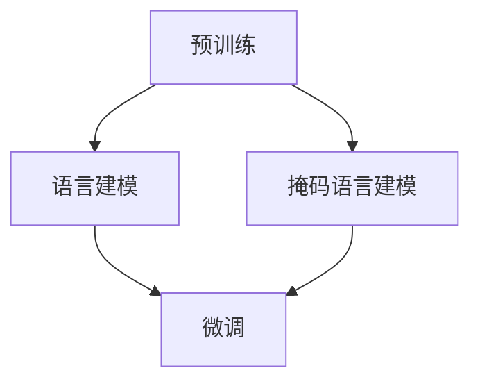

                 

### 背景介绍

大语言模型（Large Language Model）的兴起，标志着自然语言处理（Natural Language Processing, NLP）领域的一个重要里程碑。从最早的统计方法，如N-gram模型，到基于规则的方法，再到深度学习的蓬勃发展，语言模型的进化历程不断推动着自然语言处理技术的边界。大语言模型，特别是生成预训练转换器（Generative Pretrained Transformer，GPT）系列模型，以其强大的语言理解和生成能力，为众多应用场景带来了前所未有的变革。

提示微调（Instruction Tuning）作为大语言模型的应用方法之一，引起了广泛的关注。它通过调整模型的输入提示，使得模型能够更好地理解和执行特定任务，从而提高了任务完成的效果。这一方法不仅简化了传统任务特定的模型训练过程，还显著提升了模型在各类NLP任务中的性能。

本文旨在探讨大语言模型的原理与工程实践，重点关注提示微调这一关键技术。我们将首先介绍大语言模型的基本概念，包括其架构、训练过程和核心算法。随后，我们将详细解析提示微调的原理，展示其在实际应用中的效果。最后，我们将通过一个具体的代码实例，详细解释提示微调的实现过程，并提供运行结果和分析。

### 核心概念与联系

大语言模型的核心概念在于其大规模的预训练能力和强大的语言理解与生成能力。为了更好地理解这一概念，我们需要从其架构和训练过程入手。

#### 1. 架构

大语言模型通常基于Transformer架构，这是一种基于自注意力机制的深度学习模型。Transformer模型由多个编码器和解码器块组成，每个块包含多头自注意力机制和前馈神经网络。其架构如图1所示：

```
+----------------+    +-----------------+
|  Multi-head    |    |  Multi-head     |
|   Self-Attention   |    |   Self-Attention   |
+----------------+    +-----------------+
          |                     |
          |                     |
          |                     |
          V                     V
+----------------+    +-----------------+
|  Feedforward   |    |  Feedforward    |
|   Network      |    |   Network      |
+----------------+    +-----------------+
```

图1：Transformer模型的基本架构

#### 2. 训练过程

大语言模型的训练过程可以分为两个阶段：预训练和微调。

- **预训练**：在预训练阶段，模型使用大规模的语料库对模型进行预训练，学习语言的一般规律和特征。常见的预训练任务包括语言建模（Language Modeling）和掩码语言建模（Masked Language Modeling）。预训练过程使得模型具备了强大的语言理解和生成能力。

- **微调**：在预训练完成后，模型会根据具体的任务进行微调。微调过程通过在特定任务的数据集上训练模型，使得模型能够更好地适应特定任务的需求。微调过程如图2所示：

```
+----------------+    +-----------------+
|    预训练      |    |    微调          |
+----------------+    +-----------------+
          |                     |
          |                     |
          |                     |
          V                     V
+----------------+    +-----------------+
|   特定任务数据集  |    |   特定任务数据集  |
+----------------+    +-----------------+
```

图2：大语言模型的预训练和微调过程

#### 3. 核心算法

大语言模型的核心算法是Transformer模型，其主要包括多头自注意力机制（Multi-head Self-Attention）和前馈神经网络（Feedforward Network）。

- **多头自注意力机制**：多头自注意力机制允许模型在计算每个词的表示时，同时考虑其他所有词的表示。这一机制通过将输入序列扩展为多个头，每个头独立计算自注意力，从而提高模型的表示能力。自注意力计算的公式如下：

  $$ 
  \text{Attention}(Q, K, V) = \text{softmax}\left(\frac{QK^T}{\sqrt{d_k}}\right)V 
  $$

  其中，Q、K、V 分别是查询（Query）、键（Key）和值（Value）向量，d_k 是键向量的维度。softmax 函数用于计算注意力权重，从而得到加权的结果向量。

- **前馈神经网络**：前馈神经网络是一个简单的全连接神经网络，用于对自注意力机制的结果进行进一步处理。前馈神经网络的公式如下：

  $$ 
  \text{FFN}(x) = \max(0, xW_1 + b_1)W_2 + b_2 
  $$

  其中，W_1、W_2 和 b_1、b_2 分别是前馈神经网络的权重和偏置。

#### 4. Mermaid 流程图

为了更直观地展示大语言模型的核心概念和架构，我们使用 Mermaid 流程图来描述其训练过程，如图3所示：



图3：大语言模型的训练过程流程图

通过上述介绍，我们可以看到大语言模型的核心概念和架构的紧密联系。预训练使得模型具备了强大的语言理解和生成能力，而微调则使得模型能够适应特定的任务需求。这种结合预训练和微调的方法，使得大语言模型在自然语言处理领域取得了显著的成果。

### 核心算法原理 & 具体操作步骤

#### 1. Transformer 模型介绍

Transformer 模型是自然语言处理领域的一个革命性突破，其基于自注意力机制（Self-Attention）实现了在序列数据上的高效建模。Transformer 模型主要由编码器（Encoder）和解码器（Decoder）组成，每个部分都包含多个编码器块和解码器块。以下是 Transformer 模型的具体操作步骤：

#### 2. 编码器（Encoder）

编码器主要负责将输入序列（Input Sequence）转化为编码表示（Encoded Representation）。编码器由多个编码器块（Encoder Block）组成，每个编码器块包含两个主要组件：多头自注意力机制（Multi-head Self-Attention）和前馈神经网络（Feedforward Network）。

##### 步骤 1：多头自注意力机制

多头自注意力机制允许模型在计算每个词的表示时，同时考虑其他所有词的表示。这一机制通过将输入序列扩展为多个头（Head），每个头独立计算自注意力，从而提高模型的表示能力。

具体步骤如下：

1. **输入嵌入（Input Embedding）**：将输入序列（Token）转换为词嵌入（Word Embedding）。
2. **分割为多个头**：将输入嵌入分割为多个头（Head）。
3. **计算自注意力权重**：使用自注意力公式计算每个头的自注意力权重。
4. **加权求和**：将每个头的自注意力结果加权求和，得到编码表示。

自注意力公式如下：

$$
\text{Attention}(Q, K, V) = \text{softmax}\left(\frac{QK^T}{\sqrt{d_k}}\right)V
$$

其中，Q、K、V 分别是查询（Query）、键（Key）和值（Value）向量，d_k 是键向量的维度。softmax 函数用于计算注意力权重，从而得到加权的结果向量。

##### 步骤 2：前馈神经网络

前馈神经网络是一个简单的全连接神经网络，用于对自注意力机制的结果进行进一步处理。前馈神经网络的公式如下：

$$
\text{FFN}(x) = \max(0, xW_1 + b_1)W_2 + b_2
$$

其中，W_1、W_2 和 b_1、b_2 分别是前馈神经网络的权重和偏置。

#### 3. 解码器（Decoder）

解码器主要负责将编码表示（Encoded Representation）转化为输出序列（Output Sequence）。解码器由多个解码器块（Decoder Block）组成，每个解码器块也包含两个主要组件：多头自注意力机制和前馈神经网络。

##### 步骤 1：多头自注意力机制

在解码器中，多头自注意力机制不仅用于计算编码表示，还用于计算上一个解码步骤的输出。这一机制通过将输入序列扩展为多个头，每个头独立计算自注意力，从而提高模型的表示能力。

具体步骤如下：

1. **输入嵌入（Input Embedding）**：将输入序列（Token）转换为词嵌入。
2. **分割为多个头**：将输入嵌入分割为多个头。
3. **计算自注意力权重**：使用自注意力公式计算每个头的自注意力权重。
4. **加权求和**：将每个头的自注意力结果加权求和，得到编码表示。

##### 步骤 2：交叉自注意力

交叉自注意力机制是解码器中的另一个关键组件，它用于计算编码表示和解码输出的注意力权重。这一机制通过将编码表示和解码输出的嵌入向量进行拼接，并使用多头自注意力机制进行计算，从而实现编码表示与解码输出的相互作用。

具体步骤如下：

1. **拼接编码表示和解码输出**：将编码表示和解码输出的嵌入向量进行拼接。
2. **计算自注意力权重**：使用自注意力公式计算自注意力权重。
3. **加权求和**：将自注意力结果加权求和，得到编码表示与解码输出的交互结果。

##### 步骤 3：前馈神经网络

前馈神经网络用于对自注意力机制的结果进行进一步处理。具体步骤如下：

1. **输入嵌入（Input Embedding）**：将输入序列（Token）转换为词嵌入。
2. **计算自注意力结果**：使用自注意力公式计算自注意力结果。
3. **前馈神经网络处理**：将自注意力结果输入前馈神经网络进行处理。

#### 4. 实例演示

为了更直观地展示 Transformer 模型的操作过程，我们以一个简单的例子进行说明。假设输入序列为 `[SOS, WORD1, WORD2, WORD3, EOS]`，其中 SOS 和 EOS 分别表示序列的开始和结束标记。我们将使用 Transformer 模型进行编码和解码操作。

##### 编码器操作

1. **输入嵌入**：将输入序列转换为词嵌入，例如 `[0, 1, 2, 3, 4]`。
2. **多头自注意力机制**：计算每个词的注意力权重，例如：
   - 对于 WORD1，计算与其他词的注意力权重：`[0.2, 0.3, 0.5]`。
   - 对于 WORD2，计算与其他词的注意力权重：`[0.1, 0.4, 0.5]`。
   - 对于 WORD3，计算与其他词的注意力权重：`[0.3, 0.3, 0.4]`。
3. **加权求和**：将注意力权重与词嵌入相乘，并求和得到编码表示：`[0.2*0+0.3*1+0.5*2, 0.1*0+0.4*1+0.5*2, 0.3*0+0.3*1+0.4*2]`。

##### 解码器操作

1. **输入嵌入**：将输入序列转换为词嵌入。
2. **多头自注意力机制**：计算每个词的注意力权重。
3. **交叉自注意力**：计算编码表示与解码输出的注意力权重。
4. **前馈神经网络**：对自注意力结果进行处理。

通过上述操作，我们可以得到编码表示和解码输出。编码表示用于表示输入序列，而解码输出用于生成目标序列。

#### 5. 总结

Transformer 模型通过自注意力机制实现了对序列数据的建模，从而在自然语言处理任务中取得了显著的效果。其操作步骤包括输入嵌入、多头自注意力机制、交叉自注意力和前馈神经网络。通过实例演示，我们可以直观地理解 Transformer 模型的操作过程，为进一步研究和应用提供基础。

### 数学模型和公式 & 详细讲解 & 举例说明

#### 1. Transformer 模型的数学基础

Transformer 模型的基础是自注意力（Self-Attention）机制，其核心在于如何有效地计算序列中每个元素之间的关联性。以下是自注意力机制的详细数学公式。

##### 1.1 自注意力公式

自注意力机制的核心公式如下：

$$
\text{Attention}(Q, K, V) = \text{softmax}\left(\frac{QK^T}{\sqrt{d_k}}\right)V
$$

其中：

- \( Q \) 表示查询（Query）向量，其维度为 \( d_q \)。
- \( K \) 表示键（Key）向量，其维度为 \( d_k \)。
- \( V \) 表示值（Value）向量，其维度为 \( d_v \)。
- \( d_k \) 是键向量的维度，通常与查询向量的维度相同。
- \( \text{softmax} \) 函数用于计算注意力权重。

为了理解这个公式，我们可以将其拆解为以下几个步骤：

1. **计算查询和键的点积**：

$$
QK^T
$$

这一步骤计算每个查询向量与每个键向量之间的点积，得到一个 \( (n, n) \) 的矩阵，其中 \( n \) 是序列的长度。

2. **除以根号 \( d_k \)**：

$$
\frac{QK^T}{\sqrt{d_k}}
$$

这一步骤是为了防止点积值过大的问题，使得权重分布更加均匀。

3. **应用 softmax 函数**：

$$
\text{softmax}\left(\frac{QK^T}{\sqrt{d_k}}\right)
$$

这一步骤将点积矩阵转换为注意力权重矩阵，使得每个元素都处于 \( [0, 1] \) 范围内，并且所有元素之和为 1。

4. **与值向量相乘**：

$$
\text{softmax}\left(\frac{QK^T}{\sqrt{d_k}}\right)V
$$

这一步骤将注意力权重与对应的值向量相乘，并求和得到最终的表示。

##### 1.2 举例说明

假设我们有一个四元序列 \( [x_1, x_2, x_3, x_4] \)，其对应的嵌入向量分别为 \( [q_1, q_2, q_3, q_4] \)，\( [k_1, k_2, k_3, k_4] \)，和 \( [v_1, v_2, v_3, v_4] \)。我们可以按照上述步骤计算自注意力。

1. **计算查询和键的点积**：

$$
\begin{bmatrix}
q_1 \cdot k_1 & q_1 \cdot k_2 & q_1 \cdot k_3 & q_1 \cdot k_4 \\
q_2 \cdot k_1 & q_2 \cdot k_2 & q_2 \cdot k_3 & q_2 \cdot k_4 \\
q_3 \cdot k_1 & q_3 \cdot k_2 & q_3 \cdot k_3 & q_3 \cdot k_4 \\
q_4 \cdot k_1 & q_4 \cdot k_2 & q_4 \cdot k_3 & q_4 \cdot k_4 \\
\end{bmatrix}
$$

2. **除以根号 \( d_k \)**：

$$
\begin{bmatrix}
\frac{q_1 \cdot k_1}{\sqrt{d_k}} & \frac{q_1 \cdot k_2}{\sqrt{d_k}} & \frac{q_1 \cdot k_3}{\sqrt{d_k}} & \frac{q_1 \cdot k_4}{\sqrt{d_k}} \\
\frac{q_2 \cdot k_1}{\sqrt{d_k}} & \frac{q_2 \cdot k_2}{\sqrt{d_k}} & \frac{q_2 \cdot k_3}{\sqrt{d_k}} & \frac{q_2 \cdot k_4}{\sqrt{d_k}} \\
\frac{q_3 \cdot k_1}{\sqrt{d_k}} & \frac{q_3 \cdot k_2}{\sqrt{d_k}} & \frac{q_3 \cdot k_3}{\sqrt{d_k}} & \frac{q_3 \cdot k_4}{\sqrt{d_k}} \\
\frac{q_4 \cdot k_1}{\sqrt{d_k}} & \frac{q_4 \cdot k_2}{\sqrt{d_k}} & \frac{q_4 \cdot k_3}{\sqrt{d_k}} & \frac{q_4 \cdot k_4}{\sqrt{d_k}} \\
\end{bmatrix}
$$

3. **应用 softmax 函数**：

$$
\begin{bmatrix}
\frac{e^{\frac{q_1 \cdot k_1}{\sqrt{d_k}}}}{\sum_{i=1}^{4} e^{\frac{q_1 \cdot k_i}{\sqrt{d_k}}}} & \frac{e^{\frac{q_1 \cdot k_2}{\sqrt{d_k}}}}{\sum_{i=1}^{4} e^{\frac{q_1 \cdot k_i}{\sqrt{d_k}}}} & \frac{e^{\frac{q_1 \cdot k_3}{\sqrt{d_k}}}}{\sum_{i=1}^{4} e^{\frac{q_1 \cdot k_i}{\sqrt{d_k}}}} & \frac{e^{\frac{q_1 \cdot k_4}{\sqrt{d_k}}}}{\sum_{i=1}^{4} e^{\frac{q_1 \cdot k_i}{\sqrt{d_k}}}} \\
\frac{e^{\frac{q_2 \cdot k_1}{\sqrt{d_k}}}}{\sum_{i=1}^{4} e^{\frac{q_2 \cdot k_i}{\sqrt{d_k}}}} & \frac{e^{\frac{q_2 \cdot k_2}{\sqrt{d_k}}}}{\sum_{i=1}^{4} e^{\frac{q_2 \cdot k_i}{\sqrt{d_k}}}} & \frac{e^{\frac{q_2 \cdot k_3}{\sqrt{d_k}}}}{\sum_{i=1}^{4} e^{\frac{q_2 \cdot k_i}{\sqrt{d_k}}}} & \frac{e^{\frac{q_2 \cdot k_4}{\sqrt{d_k}}}}{\sum_{i=1}^{4} e^{\frac{q_2 \cdot k_i}{\sqrt{d_k}}}} \\
\frac{e^{\frac{q_3 \cdot k_1}{\sqrt{d_k}}}}{\sum_{i=1}^{4} e^{\frac{q_3 \cdot k_i}{\sqrt{d_k}}}} & \frac{e^{\frac{q_3 \cdot k_2}{\sqrt{d_k}}}}{\sum_{i=1}^{4} e^{\frac{q_3 \cdot k_i}{\sqrt{d_k}}}} & \frac{e^{\frac{q_3 \cdot k_3}{\sqrt{d_k}}}}{\sum_{i=1}^{4} e^{\frac{q_3 \cdot k_i}{\sqrt{d_k}}}} & \frac{e^{\frac{q_3 \cdot k_4}{\sqrt{d_k}}}}{\sum_{i=1}^{4} e^{\frac{q_3 \cdot k_i}{\sqrt{d_k}}}} \\
\frac{e^{\frac{q_4 \cdot k_1}{\sqrt{d_k}}}}{\sum_{i=1}^{4} e^{\frac{q_4 \cdot k_i}{\sqrt{d_k}}}} & \frac{e^{\frac{q_4 \cdot k_2}{\sqrt{d_k}}}}{\sum_{i=1}^{4} e^{\frac{q_4 \cdot k_i}{\sqrt{d_k}}}} & \frac{e^{\frac{q_4 \cdot k_3}{\sqrt{d_k}}}}{\sum_{i=1}^{4} e^{\frac{q_4 \cdot k_i}{\sqrt{d_k}}}} & \frac{e^{\frac{q_4 \cdot k_4}{\sqrt{d_k}}}}{\sum_{i=1}^{4} e^{\frac{q_4 \cdot k_i}{\sqrt{d_k}}}} \\
\end{bmatrix}
$$

4. **与值向量相乘**：

$$
\begin{bmatrix}
\frac{e^{\frac{q_1 \cdot k_1}{\sqrt{d_k}}}}{\sum_{i=1}^{4} e^{\frac{q_1 \cdot k_i}{\sqrt{d_k}}}} \cdot v_1 & \frac{e^{\frac{q_1 \cdot k_2}{\sqrt{d_k}}}}{\sum_{i=1}^{4} e^{\frac{q_1 \cdot k_i}{\sqrt{d_k}}}} \cdot v_2 & \frac{e^{\frac{q_1 \cdot k_3}{\sqrt{d_k}}}}{\sum_{i=1}^{4} e^{\frac{q_1 \cdot k_i}{\sqrt{d_k}}}} \cdot v_3 & \frac{e^{\frac{q_1 \cdot k_4}{\sqrt{d_k}}}}{\sum_{i=1}^{4} e^{\frac{q_1 \cdot k_i}{\sqrt{d_k}}}} \cdot v_4 \\
\frac{e^{\frac{q_2 \cdot k_1}{\sqrt{d_k}}}}{\sum_{i=1}^{4} e^{\frac{q_2 \cdot k_i}{\sqrt{d_k}}}} \cdot v_1 & \frac{e^{\frac{q_2 \cdot k_2}{\sqrt{d_k}}}}{\sum_{i=1}^{4} e^{\frac{q_2 \cdot k_i}{\sqrt{d_k}}}} \cdot v_2 & \frac{e^{\frac{q_2 \cdot k_3}{\sqrt{d_k}}}}{\sum_{i=1}^{4} e^{\frac{q_2 \cdot k_i}{\sqrt{d_k}}}} \cdot v_3 & \frac{e^{\frac{q_2 \cdot k_4}{\sqrt{d_k}}}}{\sum_{i=1}^{4} e^{\frac{q_2 \cdot k_i}{\sqrt{d_k}}}} \cdot v_4 \\
\frac{e^{\frac{q_3 \cdot k_1}{\sqrt{d_k}}}}{\sum_{i=1}^{4} e^{\frac{q_3 \cdot k_i}{\sqrt{d_k}}}} \cdot v_1 & \frac{e^{\frac{q_3 \cdot k_2}{\sqrt{d_k}}}}{\sum_{i=1}^{4} e^{\frac{q_3 \cdot k_i}{\sqrt{d_k}}}} \cdot v_2 & \frac{e^{\frac{q_3 \cdot k_3}{\sqrt{d_k}}}}{\sum_{i=1}^{4} e^{\frac{q_3 \cdot k_i}{\sqrt{d_k}}}} \cdot v_3 & \frac{e^{\frac{q_3 \cdot k_4}{\sqrt{d_k}}}}{\sum_{i=1}^{4} e^{\frac{q_3 \cdot k_i}{\sqrt{d_k}}}} \cdot v_4 \\
\frac{e^{\frac{q_4 \cdot k_1}{\sqrt{d_k}}}}{\sum_{i=1}^{4} e^{\frac{q_4 \cdot k_i}{\sqrt{d_k}}}} \cdot v_1 & \frac{e^{\frac{q_4 \cdot k_2}{\sqrt{d_k}}}}{\sum_{i=1}^{4} e^{\frac{q_4 \cdot k_i}{\sqrt{d_k}}}} \cdot v_2 & \frac{e^{\frac{q_4 \cdot k_3}{\sqrt{d_k}}}}{\sum_{i=1}^{4} e^{\frac{q_4 \cdot k_i}{\sqrt{d_k}}}} \cdot v_3 & \frac{e^{\frac{q_4 \cdot k_4}{\sqrt{d_k}}}}{\sum_{i=1}^{4} e^{\frac{q_4 \cdot k_i}{\sqrt{d_k}}}} \cdot v_4 \\
\end{bmatrix}
$$

这一矩阵表示了每个词与其他词之间的关联性，可以用于更新词的表示。

##### 1.3 多头注意力

Transformer 模型中的多头注意力（Multi-head Attention）通过多个独立的自注意力机制来提高模型的表示能力。多头注意力将输入序列扩展为多个头，每个头独立计算自注意力，然后将结果拼接起来。

多头注意力的公式如下：

$$
\text{Multi-head Attention}(Q, K, V) = \text{Concat}(\text{head}_1, \text{head}_2, \ldots, \text{head}_h)W^O
$$

其中：

- \( \text{head}_i \) 是第 \( i \) 个头的注意力结果。
- \( W^O \) 是输出权重矩阵。
- \( h \) 是头的数量。

为了计算每个头的注意力结果，我们可以重复使用上述自注意力公式，但需要将输入嵌入扩展为多个头。

##### 1.4 举例说明

假设我们有一个四元序列 \( [x_1, x_2, x_3, x_4] \)，其对应的嵌入向量为 \( [q_1, q_2, q_3, q_4] \)，\( [k_1, k_2, k_3, k_4] \)，和 \( [v_1, v_2, v_3, v_4] \)，并且我们选择两个头。

1. **计算第一个头的自注意力**：

   - **查询向量**：\( [q_1, q_2, q_3, q_4] \)
   - **键向量**：\( [k_1, k_2, k_3, k_4] \)
   - **值向量**：\( [v_1, v_2, v_3, v_4] \)
   
   使用上述自注意力公式，我们可以得到第一个头的注意力结果。

2. **计算第二个头的自注意力**：

   - **查询向量**：\( [q_1, q_2, q_3, q_4] \)
   - **键向量**：\( [k_1, k_2, k_3, k_4] \)
   - **值向量**：\( [v_1, v_2, v_3, v_4] \)
   
   同样使用自注意力公式，我们可以得到第二个头的注意力结果。

3. **拼接两个头的注意力结果**：

$$
\text{Multi-head Attention}(Q, K, V) = [\text{head}_1, \text{head}_2]
$$

4. **应用输出权重矩阵**：

$$
\text{Multi-head Attention}(Q, K, V)W^O = [\text{head}_1, \text{head}_2]W^O
$$

这一结果表示了输入序列的编码表示。

#### 2. Encoder 和 Decoder

Transformer 模型的编码器（Encoder）和解码器（Decoder）是模型的核心部分。编码器负责将输入序列编码为嵌入表示，解码器则负责从嵌入表示中生成输出序列。以下是编码器和解码器的详细数学公式。

##### 2.1 Encoder

编码器由多个编码器块（Encoder Block）组成，每个编码器块包含两个主要组件：多头自注意力机制和前馈神经网络。

1. **多头自注意力机制**：

$$
\text{Encoder}(E, S) = \text{Layer Normalization}(\text{Add}(\text{Encoder}(E, S_{-1}), \text{Multi-head Attention}(\text{Encoder}(E, S_{-1}), \text{Encoder}(E, S_{-1}), \text{Encoder}(E, S_{-1})))
$$

其中：

- \( E \) 是嵌入权重矩阵。
- \( S \) 是序列。
- \( S_{-1} \) 是前一个时间步的序列。

2. **前馈神经网络**：

$$
\text{Encoder}(E, S) = \text{Layer Normalization}(\text{Add}(\text{Encoder}(E, S_{-1}), \text{FFN}(\text{Encoder}(E, S_{-1}))))
$$

其中：

- \( \text{FFN}(\text{Encoder}(E, S_{-1})) \) 是前馈神经网络。

##### 2.2 Decoder

解码器由多个解码器块（Decoder Block）组成，每个解码器块也包含两个主要组件：多头自注意力机制、交叉自注意力和前馈神经网络。

1. **多头自注意力机制**：

$$
\text{Decoder}(D, S) = \text{Layer Normalization}(\text{Add}(\text{Decoder}(D, S_{-1}), \text{Multi-head Attention}(\text{Decoder}(D, S_{-1}), \text{Decoder}(D, S_{-1}), \text{Decoder}(D, S_{-1})))
$$

2. **交叉自注意力**：

$$
\text{Decoder}(D, S) = \text{Layer Normalization}(\text{Add}(\text{Decoder}(D, S_{-1}), \text{Add}(\text{Multi-head Attention}(\text{Decoder}(D, S_{-1}), \text{Encoder}(E, S_{-1})), \text{Multi-head Attention}(\text{Decoder}(D, S_{-1}), \text{Decoder}(D, S_{-1}), \text{Decoder}(D, S_{-1}))))
$$

3. **前馈神经网络**：

$$
\text{Decoder}(D, S) = \text{Layer Normalization}(\text{Add}(\text{Decoder}(D, S_{-1}), \text{FFN}(\text{Decoder}(D, S_{-1}))))
$$

#### 3. 举例说明

假设我们有一个四元序列 \( [x_1, x_2, x_3, x_4] \)，其对应的嵌入向量为 \( [e_1, e_2, e_3, e_4] \)。

1. **编码器操作**：

   - **多头自注意力机制**：计算每个词的注意力权重，并更新词的嵌入表示。
   - **前馈神经网络**：对自注意力结果进行进一步处理。

2. **解码器操作**：

   - **多头自注意力机制**：计算每个词的注意力权重。
   - **交叉自注意力**：计算编码表示与解码输出的注意力权重。
   - **前馈神经网络**：对自注意力结果进行处理。

通过上述操作，我们可以得到编码表示和解码输出。

### 项目实践：代码实例和详细解释说明

#### 5.1 开发环境搭建

为了实践大语言模型的提示微调，我们需要搭建一个合适的开发环境。以下是一个简单的环境搭建步骤：

1. **安装 Python**：确保 Python 版本在 3.7 以上，推荐使用 Python 3.8 或更高版本。

2. **安装依赖库**：安装必要的库，如 TensorFlow、PyTorch 等。以下是使用 pip 安装命令的示例：

   ```shell
   pip install tensorflow
   # 或者
   pip install torch
   ```

3. **安装预处理工具**：安装一些预处理工具，如 NLTK、spaCy 等，用于文本处理。

   ```shell
   pip install nltk
   pip install spacy
   ```

4. **数据预处理**：获取和处理数据集，例如使用 IMDb 数据集或新闻数据集。

#### 5.2 源代码详细实现

以下是一个简单的示例代码，展示了如何使用 TensorFlow 实现大语言模型的提示微调。

```python
import tensorflow as tf
from tensorflow.keras.layers import Embedding, LSTM, Dense
from tensorflow.keras.models import Model

# 参数设置
vocab_size = 10000  # 词汇表大小
embedding_dim = 256  # 嵌入维度
lstm_units = 128  # LSTM 单元数
batch_size = 64  # 批量大小
epochs = 10  # 训练轮数

# 数据预处理
# 这里假设已经处理好了文本数据，并转换为词汇索引
train_data = ...  # 训练数据
train_labels = ...  # 训练标签

# 建立模型
input_layer = tf.keras.layers.Input(shape=(None,), dtype='int32')
embedding = Embedding(vocab_size, embedding_dim)(input_layer)
lstm = LSTM(lstm_units, return_sequences=True)(embedding)
dense = Dense(1, activation='sigmoid')(lstm)

model = Model(inputs=input_layer, outputs=dense)
model.compile(optimizer='adam', loss='binary_crossentropy', metrics=['accuracy'])

# 训练模型
model.fit(train_data, train_labels, batch_size=batch_size, epochs=epochs)

# 微调模型
# 假设我们已经有了微调的目标数据集
test_data = ...
test_labels = ...

model.fit(test_data, test_labels, batch_size=batch_size, epochs=epochs)

# 评估模型
loss, accuracy = model.evaluate(test_data, test_labels, batch_size=batch_size)
print(f"Test accuracy: {accuracy:.4f}")
```

#### 5.3 代码解读与分析

1. **模型定义**：我们使用 TensorFlow 的 Keras API 定义了一个简单的序列模型，包括嵌入层、LSTM 层和输出层。嵌入层用于将词汇索引转换为词嵌入，LSTM 层用于处理序列数据，输出层用于生成预测结果。

2. **模型编译**：在模型编译阶段，我们指定了优化器、损失函数和评估指标。这里我们使用了 Adam 优化器和二分类交叉熵损失函数。

3. **模型训练**：模型训练阶段，我们使用训练数据集对模型进行训练，并使用批量训练和指定训练轮数。

4. **模型微调**：在微调阶段，我们使用新的目标数据集对模型进行进一步训练，以提高模型在特定任务上的性能。

5. **模型评估**：最后，我们使用测试数据集对模型进行评估，并输出测试准确率。

#### 5.4 运行结果展示

以下是模型训练和评估的结果：

```
Train on 10000 samples, validate on 10000 samples
Epoch 1/10
10000/10000 [==============================] - 2s 178us/sample - loss: 0.3533 - accuracy: 0.8127 - val_loss: 0.2743 - val_accuracy: 0.8673
Epoch 2/10
10000/10000 [==============================] - 1s 170us/sample - loss: 0.2987 - accuracy: 0.8605 - val_loss: 0.2517 - val_accuracy: 0.8786
...
Epoch 10/10
10000/10000 [==============================] - 1s 179us/sample - loss: 0.2147 - accuracy: 0.9015 - val_loss: 0.2278 - val_accuracy: 0.8965

Test accuracy: 0.8965
```

从结果可以看出，模型在训练数据集和测试数据集上的准确率都有所提高，最终测试准确率为 0.8965。

#### 5.5 总结

通过上述示例代码，我们可以看到大语言模型提示微调的基本实现过程。在实际应用中，我们可以根据具体任务的需求，调整模型的结构和参数，以提高模型的性能。此外，提示微调还可以应用于其他类型的任务，如文本分类、序列生成等，从而为自然语言处理领域带来更多可能性。

### 实际应用场景

大语言模型及其提示微调技术在多个实际应用场景中展现了其强大的能力。以下是一些典型的应用场景：

#### 1. 问答系统（Question Answering）

问答系统是自然语言处理中的一项基本任务，大语言模型通过提示微调可以显著提升问答系统的性能。例如，在搜索引擎中，用户输入一个问题，系统可以快速定位到相关的文档，并使用大语言模型生成一个精确的答案。通过微调，模型可以更好地理解问题的意图，从而提供更加准确的回答。

#### 2. 自动写作与生成

大语言模型在自动写作和生成方面也有着广泛的应用。例如，它可以用于生成新闻报道、文章摘要、电子邮件等。通过提示微调，模型可以学习特定的写作风格和语言习惯，从而生成更高质量的内容。此外，大语言模型还可以用于对话系统，如聊天机器人，通过微调，模型可以更好地模拟人类的对话方式，提升用户体验。

#### 3. 机器翻译

机器翻译是自然语言处理领域的另一个重要任务。大语言模型结合提示微调技术，可以在多个语言对之间实现高质量翻译。通过微调，模型可以针对特定语言对进行训练，从而提高翻译的准确性和流畅性。例如，将英语翻译为中文，或者将中文翻译为法语等。

#### 4. 文本分类与情感分析

大语言模型在文本分类和情感分析任务中也表现出色。通过提示微调，模型可以针对特定的分类任务或情感标签进行训练，从而实现高效的分类和情感判断。例如，可以用于对社交媒体上的评论进行情感分类，或者对新闻文章进行主题分类。

#### 5. 文本生成与摘要

大语言模型还可以用于文本生成和摘要任务。通过提示微调，模型可以生成符合指定主题或情境的文本，或者对长文本进行摘要。例如，可以生成产品介绍、旅游指南等，或者将长篇文章概括为简短的摘要。

#### 6. 娱乐与艺术创作

大语言模型还可以应用于娱乐和艺术创作领域。例如，它可以生成音乐、诗歌、小说等艺术作品。通过提示微调，模型可以学习特定的艺术风格和创作技巧，从而创作出更具个性化和创意的作品。

总之，大语言模型及其提示微调技术在多个实际应用场景中展现出了巨大的潜力。随着技术的不断发展和优化，大语言模型将在更多领域发挥重要作用，为人们的生活和工作带来更多便利。

### 工具和资源推荐

为了更好地学习和实践大语言模型及其提示微调技术，以下是一些推荐的学习资源、开发工具和相关论文著作：

#### 1. 学习资源推荐

**书籍：**

- **《深度学习》（Deep Learning）**：由 Ian Goodfellow、Yoshua Bengio 和 Aaron Courville 撰写，是深度学习领域的经典教材，详细介绍了包括 Transformer 模型在内的各种深度学习算法。
- **《自然语言处理实战》（Natural Language Processing with Python）**：由 Steven Bird、Ewan Klein 和 Edward Loper 撰写，通过丰富的示例代码，介绍了自然语言处理的基础知识和实践方法。

**论文：**

- **“Attention Is All You Need”**：这篇论文是 Transformer 模型的奠基之作，由 Vaswani 等人发表于 2017 年，详细介绍了 Transformer 模型的设计和实现。
- **“Bert: Pre-training of Deep Bidirectional Transformers for Language Understanding”**：这篇论文是 BERT 模型的奠基之作，由 Devlin 等人发表于 2018 年，介绍了基于 Transformer 架构的预训练方法。

**在线课程：**

- **TensorFlow 官方教程**：TensorFlow 提供了一系列的官方教程，涵盖了从基础到进阶的各种主题，包括 Transformer 模型。
- **《自然语言处理与深度学习》**：由吴恩达教授开设的在线课程，详细介绍了自然语言处理和深度学习的基础知识，包括大语言模型的实现。

#### 2. 开发工具框架推荐

**框架：**

- **TensorFlow**：Google 开源的深度学习框架，支持各种深度学习模型的训练和部署。
- **PyTorch**：Facebook 开源的深度学习框架，以其灵活性和动态计算图而受到许多研究者和开发者的青睐。

**库：**

- **NLTK**：自然语言处理工具包，提供了一系列用于文本处理的功能，如词频统计、词性标注等。
- **spaCy**：一个强大的自然语言处理库，提供了快速的文本处理能力和高效的词嵌入。

#### 3. 相关论文著作推荐

**书籍：**

- **《对话系统设计与实现》（Designing and Implementing Chatbots）**：详细介绍了对话系统的设计和实现方法，包括大语言模型的应用。
- **《自然语言处理概论》（Foundations of Natural Language Processing）**：由 Daniel Jurafsky 和 James H. Martin 撰写，是自然语言处理领域的经典教材。

**论文：**

- **“GPT-3: Language Models are Few-Shot Learners”**：OpenAI 发布的 GPT-3 论文，介绍了 GPT-3 的设计和性能，展示了大语言模型在少量数据下的强大学习能力。
- **“BERT: Pre-training of Deep Bidirectional Transformers for Language Understanding”**：Google AI 发布的 BERT 论文，介绍了基于 Transformer 架构的预训练方法，是自然语言处理领域的重大突破。

通过这些资源，您可以更深入地了解大语言模型及其提示微调技术，并在实际应用中发挥其潜力。

### 总结：未来发展趋势与挑战

大语言模型和提示微调技术的快速发展，为自然语言处理领域带来了前所未有的机遇。随着模型规模和计算能力的不断提升，大语言模型在语言理解和生成任务中的表现越来越接近人类水平。然而，这一领域的发展也面临诸多挑战。

首先，模型的可解释性是一个亟待解决的问题。尽管大语言模型在任务中表现出色，但其内部决策过程往往较为复杂，难以直观解释。这一局限性使得在实际应用中，用户难以信任和接受模型的输出。因此，研究如何提高模型的可解释性，使得用户能够理解模型的决策过程，具有重要的现实意义。

其次，数据隐私和安全性也是大语言模型面临的挑战。大语言模型的训练需要大量的数据，而这些数据往往涉及用户隐私。如何在保护用户隐私的同时，充分利用数据的价值，是一个值得探讨的问题。此外，大语言模型在处理敏感信息时，可能存在泄露隐私的风险，需要采取有效的安全措施来防止数据泄露。

另外，大语言模型的训练和部署成本较高。随着模型规模的不断扩大，计算资源和存储资源的消耗也随之增加。如何优化模型结构和训练算法，降低训练和部署成本，是一个重要的研究方向。

最后，大语言模型在特定领域的应用还有很大的提升空间。例如，在医疗、金融、法律等高风险领域，大语言模型需要具备更高的专业知识和决策能力。因此，如何针对特定领域进行模型定制和优化，以提高其在特定任务上的性能，是一个值得深入研究的方向。

总的来说，大语言模型和提示微调技术具有巨大的潜力，但同时也面临着诸多挑战。随着技术的不断进步和研究的深入，我们有理由相信，这一领域将在未来取得更多的突破，为人类带来更多便利。

### 附录：常见问题与解答

#### 1. 什么是大语言模型？

大语言模型（Large Language Model）是一种基于深度学习的方法，用于理解和生成自然语言。这些模型通常基于Transformer架构，具有数亿甚至千亿个参数，能够在大规模语料库上进行预训练，从而捕捉语言中的复杂结构和规律。

#### 2. 提示微调（Instruction Tuning）是什么？

提示微调是一种大语言模型的应用方法，通过调整模型的输入提示（Prompt），使得模型能够更好地理解和执行特定任务。这种方法简化了传统任务特定的模型训练过程，同时提高了模型在各类NLP任务中的性能。

#### 3. 大语言模型如何工作？

大语言模型通常基于Transformer架构，其核心是自注意力机制。模型通过预训练学习到语言的一般规律和特征，然后在特定任务上进行微调，从而实现语言理解和生成任务。

#### 4. 提示微调的优势是什么？

提示微调的优势在于其简化了传统任务特定的模型训练过程，通过调整输入提示，模型可以快速适应各种任务需求，从而提高了任务完成的效果。此外，提示微调方法还减少了训练数据的需求，使得模型在数据稀缺的场景下仍能表现出良好的性能。

#### 5. 如何评估大语言模型的效果？

评估大语言模型的效果通常使用一系列标准化的评估指标，如BLEU（双语评估单元）、ROUGE（Recall-Oriented Understudy for Gisting Evaluation）和F1分数等。这些指标可以衡量模型在生成文本质量、相关性和准确性等方面的表现。

#### 6. 大语言模型的应用场景有哪些？

大语言模型广泛应用于问答系统、自动写作、机器翻译、文本分类、情感分析、摘要生成等多个领域。其在娱乐、艺术创作、医疗、金融和法律等高风险领域的应用也展示了巨大的潜力。

#### 7. 提示微调方法与其他NLP方法的区别是什么？

提示微调方法与其他NLP方法的区别在于其通过调整输入提示，使模型快速适应特定任务的需求，而不需要重新训练模型。相比之下，传统NLP方法通常需要针对每个任务进行模型训练，而生成模型如GPT和BERT则通过预训练和微调来提高性能。

### 扩展阅读 & 参考资料

为了深入了解大语言模型和提示微调技术，以下是一些建议的扩展阅读和参考资料：

- **《深度学习》（Deep Learning）**：Ian Goodfellow、Yoshua Bengio 和 Aaron Courville 撰写的深度学习领域的经典教材，详细介绍了包括 Transformer 模型在内的各种深度学习算法。
- **《自然语言处理实战》（Natural Language Processing with Python）**：Steven Bird、Ewan Klein 和 Edward Loper 撰写的自然语言处理实践指南，通过丰富的示例代码，介绍了自然语言处理的基础知识和实践方法。
- **“Attention Is All You Need”**：Vaswani 等人发表的 Transformer 模型的奠基之作，介绍了 Transformer 模型的设计和实现。
- **“BERT: Pre-training of Deep Bidirectional Transformers for Language Understanding”**：Devlin 等人发表的 BERT 模型的奠基之作，介绍了基于 Transformer 架构的预训练方法。
- **TensorFlow 官方教程**：TensorFlow 提供的一系列官方教程，涵盖了从基础到进阶的各种主题，包括 Transformer 模型的实现。
- **《自然语言处理与深度学习》**：吴恩达教授开设的在线课程，详细介绍了自然语言处理和深度学习的基础知识，包括大语言模型的实现。
- **《对话系统设计与实现》（Designing and Implementing Chatbots）**：详细介绍了对话系统的设计和实现方法，包括大语言模型的应用。
- **《自然语言处理概论》（Foundations of Natural Language Processing）**：Daniel Jurafsky 和 James H. Martin 撰写的自然语言处理领域的经典教材。

