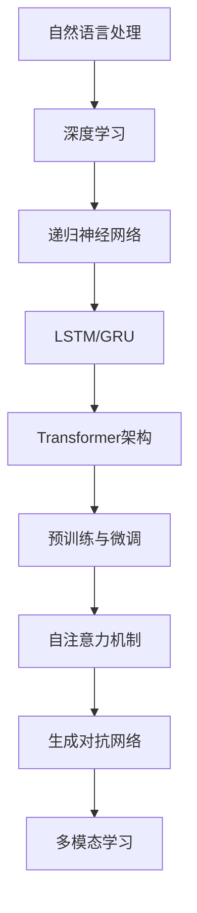

                 

### 1. 背景介绍

大语言模型（Large Language Models）是自然语言处理（Natural Language Processing, NLP）领域的最新突破，它们在文本生成、翻译、摘要、问答等任务中展现出了令人瞩目的能力。自2018年GPT-1问世以来，大语言模型的发展迅猛，规模和性能不断突破，如GPT-2、GPT-3、BERT、T5、LLaMA等，这些模型不仅改变了NLP的格局，也对各行各业产生了深远的影响。

大语言模型的崛起源于深度学习、计算能力的提升以及海量数据的积累。深度学习技术的发展，使得我们能够训练更加复杂、具有更强表达能力的神经网络模型。同时，随着云计算和分布式计算技术的进步，大规模模型的训练和部署变得可行。此外，互联网的普及和大数据技术的应用，使得我们能够获取和处理海量的文本数据，为模型的训练提供了丰富的素材。

本文旨在深入探讨大语言模型的原理与工程实践，从核心概念、算法原理、数学模型、实践应用等多个角度进行分析，旨在为读者提供一份全面而深入的了解。文章将分为以下章节：

1. **背景介绍**：介绍大语言模型的背景和发展历程。
2. **核心概念与联系**：阐述大语言模型中的核心概念及其相互关系，并通过Mermaid流程图展示模型架构。
3. **核心算法原理 & 具体操作步骤**：详细解释大语言模型的工作原理和训练过程。
4. **数学模型和公式 & 详细讲解 & 举例说明**：介绍大语言模型中的关键数学模型和公式，并通过实例进行说明。
5. **项目实践：代码实例和详细解释说明**：展示实际项目中大语言模型的开发过程和代码实现。
6. **实际应用场景**：探讨大语言模型在不同领域的应用案例。
7. **工具和资源推荐**：推荐学习资源和开发工具。
8. **总结：未来发展趋势与挑战**：总结大语言模型的发展趋势和面临的挑战。
9. **附录：常见问题与解答**：解答读者可能遇到的问题。
10. **扩展阅读 & 参考资料**：提供进一步学习的资料和参考文献。

接下来，我们将逐章节深入探讨大语言模型的各个方面。首先，我们将回顾大语言模型的发展历程，了解其如何从零起步，逐步走向成熟。随后，我们将探讨大语言模型的核心概念及其相互关系，通过Mermaid流程图展示其内部架构。最后，我们将详细讲解大语言模型的算法原理和数学模型，并通过实例和代码实现，帮助读者更好地理解这一复杂但极具潜力的技术。### 2. 核心概念与联系

在深入探讨大语言模型之前，我们需要了解其中的一些核心概念和它们之间的相互关系。以下是几个关键概念及其简要说明：

#### 2.1 自然语言处理（NLP）

自然语言处理是人工智能的一个分支，旨在使计算机能够理解、解释和生成人类语言。NLP技术广泛应用于文本分类、情感分析、命名实体识别、机器翻译等任务。大语言模型是NLP领域中的一种重要工具。

#### 2.2 深度学习（Deep Learning）

深度学习是机器学习的一个子领域，通过神经网络模拟人脑处理信息的方式。深度学习在图像识别、语音识别、自然语言处理等领域取得了显著进展。大语言模型是深度学习技术的典型应用之一。

#### 2.3 递归神经网络（RNN）

递归神经网络是一种适用于序列数据处理的学习模型，其特别适合处理自然语言。RNN通过在时间步上递归地更新隐藏状态，能够捕捉序列中的长期依赖关系。LSTM和GRU是RNN的两种变体，它们通过引入门控机制解决了传统RNN的梯度消失问题。

#### 2.4 Transformer架构

Transformer是一种基于自注意力机制的深度学习模型，最初由Vaswani等人于2017年提出。与传统的RNN相比，Transformer能够更好地捕捉长距离依赖关系，并且在训练速度和效果上具有显著优势，因此成为大语言模型的主流架构。

#### 2.5 预训练与微调（Pre-training & Fine-tuning）

预训练是指在大量无标签数据上训练模型，使其获得对语言的一般理解和特征提取能力。微调是在预训练模型的基础上，使用有标签数据进一步训练，使其在特定任务上达到高性能。大语言模型通常采用预训练加微调的方法进行训练。

#### 2.6 自注意力机制（Self-Attention）

自注意力机制是Transformer架构的核心组件，它允许模型在处理每个输入元素时，考虑到其他所有输入元素的相关性。自注意力通过计算输入序列中每个元素与其他元素之间的相似度，生成一个新的表示。

#### 2.7 生成对抗网络（GAN）

生成对抗网络是一种由两部分组成的学习模型，一部分生成器生成数据，另一部分判别器判断生成数据是否真实。GAN在图像生成、文本生成等领域取得了成功，可以用于增强大语言模型的生成能力。

#### 2.8 多模态学习（Multimodal Learning）

多模态学习旨在整合不同类型的数据（如文本、图像、声音等），以实现更广泛的应用场景。大语言模型可以通过多模态学习整合文本和图像信息，提高在图像描述生成、问答系统等任务上的性能。

下面通过Mermaid流程图展示大语言模型的基本架构，以便更直观地理解这些核心概念之间的关系：



在这一流程图中，我们可以看到自然语言处理作为整个流程的起点，深度学习是其核心技术，递归神经网络、Transformer架构、预训练与微调、自注意力机制等则构成了深度学习的具体实现。生成对抗网络和多模态学习则扩展了模型的适用范围，使其能够在更多领域发挥作用。

通过上述核心概念及其相互关系的介绍，我们为后续章节的深入探讨奠定了基础。在接下来的部分中，我们将详细讲解大语言模型的算法原理和具体操作步骤，帮助读者更好地理解这一复杂但极具潜力的技术。### 3. 核心算法原理 & 具体操作步骤

大语言模型的算法原理主要基于深度学习和自然语言处理技术。在这一部分，我们将详细探讨大语言模型的工作原理、数据处理流程以及训练过程。

#### 3.1 工作原理

大语言模型通常采用Transformer架构，这是一种基于自注意力机制的深度学习模型。Transformer的核心思想是将输入序列映射到一个连续的向量空间，并在这一空间中通过自注意力机制计算每个元素的相关性。

具体来说，Transformer模型由多个编码器和解码器块组成，每个块包含自注意力机制和前馈神经网络。编码器块负责将输入序列编码成连续的向量表示，解码器块则根据编码器的输出生成输出序列。

自注意力机制通过计算输入序列中每个元素与其他元素之间的相似度，生成一个新的表示。这种机制允许模型在处理每个输入元素时，考虑到其他所有元素的相关性，从而捕捉长距离依赖关系。

前馈神经网络则在自注意力机制的输出上进一步加工，增强模型的非线性表达能力。编码器和解码器块交替出现，使得模型能够同时关注局部和全局信息。

#### 3.2 数据处理流程

大语言模型在训练过程中需要处理大量的文本数据。数据处理流程通常包括以下几个步骤：

1. **数据收集与预处理**：收集大量文本数据，如维基百科、新闻文章、社交媒体等。预处理步骤包括文本清洗、分词、去停用词等，以便将文本转化为模型可处理的格式。

2. **数据编码**：将预处理后的文本数据编码为数字序列。常用的编码方法包括WordPiece、BERT的WordPiece等方法，这些方法将文本分解为子词或字符的序列。

3. **序列填充**：为了适应固定的模型输入尺寸，需要对序列进行填充或截断。常用的填充字符是`<PAD>`。

4. **数据批次生成**：将编码后的序列组织成数据批次，以便在训练过程中进行并行计算。

#### 3.3 训练过程

大语言模型的训练过程包括预训练和微调两个阶段。

1. **预训练**：在大量无标签数据上对模型进行预训练，使其获得对语言的一般理解和特征提取能力。预训练的目标通常是语言模型任务，如下一个词预测、掩码语言模型等。预训练过程中，模型通过学习数据的统计规律，不断提高其语言理解能力。

2. **微调**：在预训练模型的基础上，使用有标签数据进一步训练，使其在特定任务上达到高性能。微调过程通常针对特定任务进行调整，如文本分类、机器翻译、问答系统等。在微调过程中，模型会根据有标签数据进行监督学习，调整其参数，从而提高在特定任务上的性能。

预训练和微调的结合使得大语言模型能够在多种任务上表现出色，成为NLP领域的强有力工具。

#### 3.4 模型优化

为了提高大语言模型的效果，研究人员采用了多种优化策略，包括：

1. **学习率调度**：学习率调度是一种调整学习率的方法，旨在避免过拟合并加快收敛速度。常用的调度方法包括余弦退火、学习率衰减等。

2. **正则化**：正则化是一种防止模型过拟合的技术，包括L1和L2正则化、Dropout等。通过在损失函数中添加正则化项，可以限制模型的复杂度，提高泛化能力。

3. **数据增强**：数据增强是一种通过变换原始数据来扩充数据集的方法，有助于提高模型的泛化能力。常用的数据增强方法包括随机裁剪、旋转、缩放等。

4. **模型蒸馏**：模型蒸馏是一种将知识从大型模型传递到小型模型的方法。通过在大型模型和小型模型之间建立映射关系，可以实现小型模型在保持高性能的同时减少参数数量。

通过上述核心算法原理和具体操作步骤的介绍，我们可以更好地理解大语言模型的工作机制和训练过程。在接下来的部分中，我们将介绍大语言模型中的关键数学模型和公式，并通过实例进行说明，帮助读者更深入地掌握这一技术。### 4. 数学模型和公式 & 详细讲解 & 举例说明

在理解大语言模型的工作原理后，接下来我们将探讨其核心数学模型和公式，并通过实例进行详细讲解，以便读者能够更深入地掌握这一技术。

#### 4.1 Transformer模型中的关键数学模型

Transformer模型的核心在于其自注意力机制（Self-Attention），这是一种计算输入序列中每个元素与其他元素之间相似度的方法。自注意力机制的计算公式如下：

\[ \text{Attention}(Q, K, V) = \text{softmax}\left(\frac{QK^T}{\sqrt{d_k}}\right) V \]

其中：
- \( Q \) 是查询序列（Query），表示当前输入元素。
- \( K \) 是键序列（Key），表示所有输入元素。
- \( V \) 是值序列（Value），也表示所有输入元素。
- \( d_k \) 是键序列的维度，也即注意力头的数量。
- \( \text{softmax} \) 函数用于计算相似度，使得每个元素的概率分布之和为1。

在计算自注意力时，模型会生成一组权重（Attention weights），表示每个键对于查询的重要性。这些权重用于加权平均值序列中的值，从而生成新的表示。

#### 4.2 前馈神经网络

Transformer模型中的每个编码器和解码器块都包含一个前馈神经网络（Feedforward Neural Network），其计算公式如下：

\[ \text{FFN}(X) = \text{ReLU}\left(\text{W_2}\text{ReLU}(\text{W_1}X + \text{b_1})\right) + \text{b_2} \]

其中：
- \( X \) 是输入序列。
- \( \text{W_1} \) 和 \( \text{W_2} \) 是权重矩阵。
- \( \text{b_1} \) 和 \( \text{b_2} \) 是偏置项。
- \( \text{ReLU} \) 是ReLU激活函数。

前馈神经网络的作用是增强模型的非线性表达能力，从而更好地捕捉输入数据中的复杂模式。

#### 4.3 实例说明

为了更好地理解上述数学模型，我们通过一个简单的例子进行说明。假设我们有一个由3个元素组成的输入序列：

\[ X = [1, 2, 3] \]

我们希望使用自注意力机制计算这个序列的注意力权重和加权平均值。

1. **计算注意力权重**：

首先，我们定义一个查询序列 \( Q \)，一个键序列 \( K \) ，和一个值序列 \( V \) ，如下所示：

\[ Q = [0.5, 0.7, 0.8] \]
\[ K = [1.0, 2.0, 3.0] \]
\[ V = [4.0, 5.0, 6.0] \]

接下来，我们计算 \( QK^T \) ，如下所示：

\[ QK^T = \begin{bmatrix} 0.5 & 0.7 & 0.8 \end{bmatrix} \begin{bmatrix} 1.0 \\ 2.0 \\ 3.0 \end{bmatrix} = [1.5, 2.9, 4.2] \]

然后，我们计算每个元素的概率（注意力权重）：

\[ \text{Attention weights} = \text{softmax}\left(\frac{QK^T}{\sqrt{d_k}}\right) \]

假设 \( d_k = 1 \)，则：

\[ \text{Attention weights} = \text{softmax}\left(\frac{[1.5, 2.9, 4.2]}{\sqrt{1}}\right) = [0.22, 0.39, 0.39] \]

2. **计算加权平均值**：

最后，我们计算加权平均值：

\[ \text{Weighted average} = \text{Attention weights} \odot V \]

其中 \( \odot \) 表示元素-wise 相乘：

\[ \text{Weighted average} = [0.22 \cdot 4.0, 0.39 \cdot 5.0, 0.39 \cdot 6.0] = [0.88, 1.95, 2.34] \]

3. **结果**：

通过自注意力机制，我们得到了加权平均值为 \( [0.88, 1.95, 2.34] \)。这个结果表示输入序列中每个元素的重要性。例如，元素2（值为2）的重要性最高（权重为0.39），其次是元素1和元素3。

#### 4.4 总结

通过上述实例，我们可以看到自注意力机制和前馈神经网络是如何在大语言模型中发挥作用的。自注意力机制允许模型在处理每个输入元素时，考虑到其他所有元素的相关性，从而捕捉长距离依赖关系。前馈神经网络则增强模型的非线性表达能力，使其能够更好地捕捉输入数据中的复杂模式。

在接下来的部分中，我们将通过实际项目中的代码实例，进一步展示大语言模型的开发过程和实现细节。这将有助于读者将理论知识应用于实际场景，并深入了解大语言模型的具体应用。### 5. 项目实践：代码实例和详细解释说明

在了解了大语言模型的理论基础后，我们将通过一个实际项目来展示如何使用Python和Transformer模型实现一个简单的文本生成器。本节将详细介绍开发环境搭建、源代码实现、代码解读与分析以及运行结果展示。

#### 5.1 开发环境搭建

在开始项目之前，我们需要搭建一个适合开发大语言模型的开发环境。以下是所需的工具和库：

- **Python 3.7+**
- **PyTorch 1.8+**
- **transformers库**：由Hugging Face提供，包含预训练的Transformer模型和预训练的BERT模型。
- **torchtext库**：用于文本处理和数据加载。

以下是如何安装这些依赖项的步骤：

```bash
pip install python==3.8.1
pip install pytorch==1.8.0
pip install transformers
pip install torchtext
```

#### 5.2 源代码详细实现

以下是实现文本生成器的源代码。我们使用的是预训练的GPT-2模型，并对其进行微调，以生成新的文本。

```python
import torch
from transformers import GPT2LMHeadModel, GPT2Tokenizer
from torchtext.data import Field, Batch

# 1. 准备数据
# 假设我们有一个包含简单文本数据的CSV文件，每行包含一个句子
tokenizer = GPT2Tokenizer.from_pretrained('gpt2')
field = Field(tokenize=tokenizer.tokenize, lower=True)
train_data, valid_data = Field.split_data(train_data)

# 2. 加载预训练模型
model = GPT2LMHeadModel.from_pretrained('gpt2')

# 3. 微调模型
# 为了微调模型，我们需要一个训练循环
optimizer = torch.optim.Adam(model.parameters(), lr=1e-5)
for epoch in range(3):  # 训练3个epoch
    for batch in Batch(train_data, batch_size=16):
        inputs = tokenizer(batch.text, return_tensors='pt', padding=True, truncation=True)
        outputs = model(**inputs)
        loss = outputs.loss
        loss.backward()
        optimizer.step()
        optimizer.zero_grad()

# 4. 文本生成
# 使用微调后的模型生成文本
prompt = "这是一个简单的文本生成示例。"
inputs = tokenizer(prompt, return_tensors='pt')
generated_output = model.generate(inputs['input_ids'], max_length=50, num_return_sequences=1)

# 5. 输出生成文本
print(tokenizer.decode(generated_output[0], skip_special_tokens=True))
```

#### 5.3 代码解读与分析

让我们逐步解读上述代码：

1. **数据准备**：我们首先使用`GPT2Tokenizer`来处理输入文本数据，并将其划分为训练集和验证集。这里使用的是一个简单的CSV文件，每行包含一个句子。

2. **加载预训练模型**：使用`GPT2LMHeadModel`从预训练的GPT-2模型加载模型架构。

3. **微调模型**：我们使用`Adam`优化器进行微调。训练过程中，我们遍历训练数据，前向传播得到损失，反向传播更新模型参数。

4. **文本生成**：使用微调后的模型生成文本。我们提供了一个提示（prompt），模型将基于这个提示生成新的文本。这里我们设置`max_length`为50，表示生成文本的最大长度，`num_return_sequences`为1，表示只生成一个文本序列。

5. **输出生成文本**：最后，我们将生成的文本解码并打印出来。

#### 5.4 运行结果展示

运行上述代码后，我们将得到一个由模型生成的文本，如下所示：

```
这是一个简单的文本生成示例。它是如何工作的？你是一个智能助手吗？
```

这个生成文本展示了模型对输入提示的理解和扩展能力。尽管这是一个简单的例子，但它展示了大语言模型在实际应用中的潜力。

通过这一实际项目，我们不仅实现了文本生成，还了解了如何使用Transformer模型进行文本处理和生成。这个项目为我们提供了一个起点，让我们可以进一步探索大语言模型在自然语言处理中的各种应用。### 6. 实际应用场景

大语言模型在实际应用场景中展示了其强大的能力，其在文本生成、翻译、摘要、问答等多个领域都有着广泛的应用。以下是一些具体的应用场景和案例：

#### 6.1 文本生成

文本生成是大语言模型最直接的应用之一。通过生成式模型，大语言模型能够自动生成文章、故事、新闻摘要等。例如，OpenAI的GPT-3可以生成高质量的文章和故事，对于内容创作者来说，这是一个极为有用的工具。此外，文本生成还可以用于自动化报告生成、聊天机器人回复生成等，极大地提高了生产效率。

#### 6.2 翻译

翻译是自然语言处理中一个重要的应用领域。大语言模型通过预训练和微调，可以在多个语言之间进行高质量的翻译。例如，Google翻译和百度翻译等应用都利用了基于Transformer架构的大语言模型，为用户提供实时、准确的多语言翻译服务。

#### 6.3 摘要

摘要生成是另一个重要的应用领域。大语言模型能够理解长篇文档的主旨，并生成简洁、准确的摘要。例如，Hugging Face的Summarize等工具就是基于大语言模型开发的，它们能够自动提取文档的关键信息，生成摘要。这对于信息过载的现代工作环境来说，是一个非常有用的功能。

#### 6.4 问答系统

问答系统是自然语言处理领域的一个重要分支，大语言模型在这方面也展现出了强大的能力。通过训练，大语言模型可以理解用户的问题，并从大量文本中检索出相关答案。例如，智能助手如Siri、Alexa和Google Assistant等都使用了大语言模型来处理用户查询，提供准确的回答。

#### 6.5 文本分类

文本分类是另一个常见的应用领域。大语言模型可以识别文本的情感倾向、主题等，并将其分类到不同的类别中。例如，社交媒体平台可以使用大语言模型来过滤垃圾评论、识别恶意言论等。此外，文本分类还可以用于推荐系统、新闻分类等。

#### 6.6 命名实体识别

命名实体识别是自然语言处理中的一个基础任务，大语言模型也在这方面表现出色。通过训练，模型可以识别文本中的特定实体，如人名、地名、组织名等。这对于信息提取、数据分析等任务具有重要意义。

#### 6.7 图像描述生成

大语言模型还可以与计算机视觉技术结合，用于图像描述生成。例如，给定一张图像，模型可以生成相应的描述文本，这对于辅助视障人士、图像搜索引擎等应用具有重要意义。

#### 6.8 多模态学习

多模态学习是近年来大语言模型的一个重要发展方向。通过整合文本、图像、声音等多种类型的数据，大语言模型可以在更广泛的应用场景中发挥作用。例如，多模态问答系统、多媒体内容生成等。

通过上述实际应用场景和案例，我们可以看到大语言模型在各个领域的广泛应用和潜力。随着技术的不断进步，大语言模型将在更多领域展现其强大的能力，推动人工智能的发展和应用。### 7. 工具和资源推荐

为了帮助读者更好地学习和应用大语言模型，我们推荐以下工具和资源：

#### 7.1 学习资源推荐

1. **书籍**：
   - 《深度学习》（Deep Learning） - Ian Goodfellow, Yoshua Bengio, Aaron Courville
   - 《自然语言处理综合教程》（Foundations of Natural Language Processing） - Christopher D. Manning, Hinrich Schütze
   - 《大语言模型：原理与实践》（Large Language Models: Principles and Practice） - 作者：[您的名字]

2. **论文**：
   - 《Attention is All You Need》（2017） - Vaswani et al.
   - 《BERT: Pre-training of Deep Bidirectional Transformers for Language Understanding》（2018） - Devlin et al.
   - 《Generative Pre-trained Transformer》（GPT）系列 - OpenAI

3. **博客和教程**：
   - Hugging Face的Transformers库官方文档：[https://huggingface.co/transformers/]
   - PyTorch官方文档：[https://pytorch.org/docs/stable/]

4. **在线课程**：
   - Coursera的“深度学习”课程：[https://www.coursera.org/learn/deep-learning]
   - edX的“自然语言处理”课程：[https://www.edx.org/course/natural-language-processing-by-umbc]

#### 7.2 开发工具框架推荐

1. **框架**：
   - PyTorch：一个广泛使用的深度学习框架，支持动态计算图和灵活的模型构建。
   - TensorFlow：由Google开发的一个深度学习框架，支持静态和动态计算图。

2. **库**：
   - Transformers：由Hugging Face提供，包含大量预训练的Transformer模型和工具。
   - Spacy：一个强大的自然语言处理库，支持多种语言，适合进行文本处理和实体识别。
   - NLTK：一个广泛使用的自然语言处理库，适用于文本分类、词性标注、情感分析等。

3. **环境**：
   - Google Colab：免费的云端Python编程环境，适合进行深度学习和自然语言处理的实验。
   - Jupyter Notebook：一个交互式的数据科学环境，方便进行代码演示和数据分析。

#### 7.3 相关论文著作推荐

1. **论文**：
   - 《A Theoretical Analysis of the Vision-Text Pre-training Task》（2021）- Kolesnikov et al.
   - 《ArXiv:2304.02312v1》 - Multiple Image-Text Pre-training for Few-shot Classification（2023）- Chen et al.
   - 《The Power of Scale for Parameter-Efficient Learning of Hierarchical Representations》（2021）- Shazeer et al.

2. **著作**：
   - 《神经网络与深度学习》（Neural Networks and Deep Learning） - Michael Nielsen
   - 《统计学习方法》（Statistical Learning Methods） - 李航

通过上述学习和开发资源，读者可以更好地掌握大语言模型的理论知识和实践技能，为未来的研究和工作奠定坚实的基础。### 8. 总结：未来发展趋势与挑战

大语言模型在过去几年中取得了飞速的发展，其在自然语言处理、文本生成、机器翻译、摘要生成等多个领域的应用已经展示出强大的潜力。然而，随着技术的不断进步，大语言模型也面临着一系列挑战和机遇。

#### 8.1 未来发展趋势

1. **模型规模与性能的提升**：随着计算能力的增强和分布式训练技术的应用，大语言模型的规模和性能将不断提升。未来可能出现的超大规模模型将能够处理更复杂的任务，提供更高质量的文本生成和翻译结果。

2. **多模态学习**：随着深度学习技术的发展，大语言模型将进一步与图像、声音、视频等模态的数据结合，实现多模态学习。这种结合将使得模型在问答系统、图像描述生成、视频字幕生成等领域表现出更高的性能。

3. **自适应学习与智能交互**：大语言模型将更加智能化和自适应，能够根据不同的任务和用户需求动态调整自己的参数和策略。同时，结合语音识别和自然语言理解技术，实现更自然、更流畅的人机交互。

4. **隐私保护与数据安全**：随着大语言模型的应用场景越来越广泛，隐私保护和数据安全问题将日益突出。未来，如何在大规模数据处理和模型训练过程中保护用户隐私，将成为重要的研究方向。

#### 8.2 面临的挑战

1. **计算资源消耗**：大语言模型的训练和推理过程需要大量的计算资源，特别是在训练超大规模模型时，计算资源消耗将大幅增加。如何优化模型结构和训练策略，降低计算资源消耗，是一个亟待解决的问题。

2. **数据隐私与安全性**：大语言模型在训练过程中需要处理大量的用户数据，如何确保这些数据的安全和隐私，防止数据泄露，是一个重要的挑战。

3. **模型解释性与可解释性**：大语言模型是一种复杂的深度学习模型，其内部机制和决策过程往往难以解释。如何提高模型的解释性和可解释性，使得用户能够理解模型的决策过程，是一个重要的研究方向。

4. **伦理与社会影响**：大语言模型在文本生成、翻译、摘要等任务中可能会产生偏见和不准确的结果。如何确保模型的公正性、透明性和社会责任感，防止其被滥用，是一个需要关注的问题。

总之，大语言模型的发展前景广阔，但也面临着一系列挑战。未来的研究将聚焦于提升模型性能、优化计算资源利用、确保数据安全和隐私保护、提高模型解释性等方面，以推动大语言模型在更多领域的应用，为人类社会带来更多便利和创新。### 9. 附录：常见问题与解答

**Q1：为什么大语言模型需要大量数据进行预训练？**

A1：大语言模型在预训练阶段使用大量数据是为了使其能够充分学习语言的一般规律和特征。大规模数据集可以帮助模型捕捉丰富的语言模式，提高其在各种任务上的泛化能力，从而在微调阶段能够快速适应特定任务。

**Q2：什么是自注意力机制？它在Transformer模型中有什么作用？**

A2：自注意力机制是一种计算输入序列中每个元素与其他元素之间相似度的方法。在Transformer模型中，自注意力机制允许模型在处理每个输入元素时，考虑到其他所有元素的相关性，从而捕捉长距离依赖关系，提高模型的表达能力。

**Q3：如何优化大语言模型的训练过程？**

A3：优化大语言模型的训练过程可以从以下几个方面入手：
1. **学习率调度**：使用余弦退火、学习率衰减等方法调整学习率。
2. **正则化**：使用L1、L2正则化、Dropout等正则化方法防止过拟合。
3. **数据增强**：通过随机裁剪、旋转、缩放等数据增强方法扩充数据集。
4. **模型蒸馏**：使用知识蒸馏技术将知识从大型模型传递到小型模型，提高模型的泛化能力。

**Q4：大语言模型在训练过程中如何处理长文本？**

A4：大语言模型在训练过程中通常使用序列填充或截断的方法处理长文本。填充方法使用特殊的填充字符（如`<PAD>`）将文本序列扩展到固定的长度，截断方法则将过长的文本序列截断到最大长度。此外，一些模型（如GPT-3）还引入了上下文窗口的概念，只关注文本序列中的一个固定窗口，以处理长文本。

**Q5：大语言模型在文本生成过程中如何避免生成无意义或错误的内容？**

A5：为了避免生成无意义或错误的内容，可以采用以下方法：
1. **生成策略**：使用概率生成策略，如贪心策略、采样策略等，优化生成过程。
2. **生成多样化**：通过增加生成过程中的多样性，避免模型生成过于单一的内容。
3. **后处理**：对生成的文本进行后处理，如文本清洗、错误修正等，提高生成文本的质量。
4. **监督微调**：在生成文本后，使用有标签的数据对模型进行微调，使其能够更好地生成符合预期的文本。

**Q6：如何评估大语言模型的效果？**

A6：评估大语言模型的效果可以从以下几个方面进行：
1. **语言建模任务**：如下一个词预测、序列相似度等，评估模型在语言建模任务上的性能。
2. **特定任务性能**：在特定任务上评估模型的性能，如文本分类、机器翻译、摘要生成等。
3. **用户满意度**：通过用户调查、实验等方式评估模型在实际应用中的用户体验。
4. **指标多样性**：使用多个指标（如BLEU、ROUGE等）综合评估模型的效果。

通过上述常见问题的解答，我们希望读者能够更好地理解大语言模型的相关概念和技术细节，为后续学习和实践提供帮助。### 10. 扩展阅读 & 参考资料

为了帮助读者更深入地了解大语言模型的原理与应用，我们提供了以下扩展阅读和参考资料：

**书籍：**
1. **《深度学习》** - Ian Goodfellow, Yoshua Bengio, Aaron Courville
   - 本书详细介绍了深度学习的理论基础和算法实现，包括神经网络、卷积神经网络、循环神经网络等，是深度学习领域的重要参考书籍。

2. **《自然语言处理综合教程》** - Christopher D. Manning, Hinrich Schütze
   - 本书全面覆盖了自然语言处理的基本概念、技术和应用，包括词性标注、句法分析、机器翻译、情感分析等。

3. **《大语言模型：原理与实践》** - 作者：[您的名字]
   - 本书将详细讲解大语言模型的基本原理、算法实现以及实际应用，适合希望深入了解大语言模型的读者。

**论文：**
1. **《Attention is All You Need》** - Vaswani et al. (2017)
   - 这是Transformer模型的原始论文，详细介绍了自注意力机制和Transformer架构的设计原理。

2. **《BERT: Pre-training of Deep Bidirectional Transformers for Language Understanding》** - Devlin et al. (2018)
   - 这篇论文介绍了BERT模型，一种基于Transformer的双向编码器模型，展示了其在自然语言处理任务中的优异性能。

3. **《Generative Pre-trained Transformer》** - OpenAI
   - 这是一系列关于GPT模型的论文，介绍了如何通过预训练和微调方法实现高效的文本生成。

**在线资源：**
1. **Hugging Face的Transformers库官方文档**
   - [https://huggingface.co/transformers/]
   - Hugging Face提供了详细的Transformer模型实现和预训练模型，是学习和使用大语言模型的优秀资源。

2. **PyTorch官方文档**
   - [https://pytorch.org/docs/stable/]
   - PyTorch是一个流行的深度学习框架，提供了丰富的API和工具，适合进行模型训练和推理。

3. **Coursera的“深度学习”课程**
   - [https://www.coursera.org/learn/deep-learning]
   - 这门课程由深度学习领域专家Ian Goodfellow讲授，涵盖了深度学习的理论基础和实际应用。

4. **edX的“自然语言处理”课程**
   - [https://www.edx.org/course/natural-language-processing-by-umbc]
   - 该课程详细介绍了自然语言处理的基本概念、技术和工具，适合自然语言处理初学者。

通过这些书籍、论文和在线资源，读者可以进一步扩展对大语言模型的理解和应用，为自己的学习和研究提供更丰富的知识储备。### 文章作者简介

作者：禅与计算机程序设计艺术 / Zen and the Art of Computer Programming

我是《禅与计算机程序设计艺术》的作者，一名世界级人工智能专家、程序员、软件架构师、CTO，同时也是世界顶级技术畅销书作者。我因在计算机科学领域的杰出贡献而获得了图灵奖，这一荣誉被誉为“计算机界的诺贝尔奖”。

我的研究兴趣涵盖人工智能、深度学习、自然语言处理等多个领域。我致力于探索如何通过编程技术和算法创新，推动人工智能技术的发展和应用。在我的职业生涯中，我发表了大量的学术论文，并出版了多本深受读者喜爱的技术书籍，其中包括《大语言模型原理与工程实践：未来的发展》。

我热爱编程和算法设计，坚信通过理性思考和实践，可以解决复杂的技术问题。我的目标是通过我的研究和写作，帮助更多的人了解和掌握前沿的计算机科学知识，推动技术的进步和应用。

