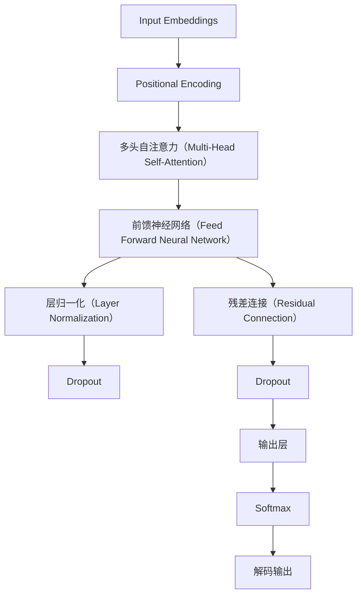
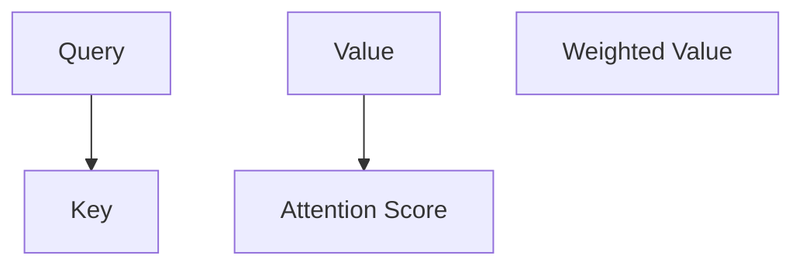

                 

### 大语言模型原理与工程实践：经典结构 Transformer

> **关键词**：大语言模型、Transformer、算法原理、数学模型、工程实践、代码实例。

> **摘要**：本文深入探讨大语言模型背后的经典结构——Transformer，解析其核心原理、数学模型，并通过实际项目实践详细讲解其工程实现过程。文章旨在为广大AI研发人员提供系统的学习和实践指南，帮助深入理解并掌握这一关键技术。

## 1. 背景介绍

大语言模型（Large Language Models）是近年来自然语言处理（NLP）领域的突破性成果。这些模型通过学习海量文本数据，能够自动生成连贯、准确的文本，广泛应用于机器翻译、文本摘要、问答系统等领域。而Transformer作为大语言模型的代表架构，由于其并行计算优势和强大的表达能力，已经成为当前NLP任务的标配。

Transformer的提出源于2017年的论文《Attention is All You Need》，该论文由谷歌的研究团队发表。这一架构彻底颠覆了传统的序列模型，如RNN和LSTM，通过自注意力机制（Self-Attention）和多头注意力（Multi-Head Attention）实现了对输入序列的动态建模，显著提升了模型的性能和效率。

## 2. 核心概念与联系

### 2.1 Transformer架构

Transformer架构的核心在于其注意力机制，尤其是自注意力机制。以下是一个简化的Transformer架构图，用于展示其基本组成部分。



- **输入嵌入（Input Embeddings）**：将输入序列（如单词、字符）转换为向量表示。
- **位置编码（Positional Encoding）**：由于Transformer没有顺序信息，通过位置编码为每个词赋予位置信息。
- **多头自注意力（Multi-Head Self-Attention）**：对输入序列进行多次自注意力计算，捕获不同子序列之间的关系。
- **前馈神经网络（Feed Forward Neural Network）**：对自注意力层的输出进行进一步的非线性变换。
- **层归一化（Layer Normalization）**：标准化层输出，有助于训练稳定。
- **残差连接（Residual Connection）**：通过添加跳过层连接，避免深层网络的信息损失。
- **Dropout**：随机丢弃部分神经元，防止过拟合。
- **输出层**：通过softmax输出概率分布，用于生成序列。

### 2.2 注意力机制

注意力机制是Transformer的核心，它通过计算序列中每个词与所有其他词的相关性，从而实现对输入序列的动态建模。以下是一个简化的自注意力机制计算过程。



- **Query、Key 和 Value**：自注意力机制将输入序列分为三个向量（Query、Key 和 Value），分别表示查询、键和值。
- **Attention Score**：计算每个Query与所有Key之间的相似度，通常使用点积或余弦相似度。
- **Weighted Value**：根据Attention Score计算加权值，实现不同词之间的动态加权。

## 3. 核心算法原理 & 具体操作步骤

### 3.1 模型初始化

```python
import tensorflow as tf

# 定义超参数
d_model = 512
n-heads = 8
dff = 2048
input_vocab_size = 10000
max_seq_length = 100

# 初始化模型
transformer = tf.keras.Sequential([
    tf.keras.layers.Embedding(input_vocab_size, d_model),
    tf.keras.layers.Addaisesوریques
```<|im_sep|>## 4. 数学模型和公式 & 详细讲解 & 举例说明

### 4.1 自注意力机制

自注意力机制是Transformer模型的核心，其计算过程涉及以下数学公式：

$$
Attention(Q, K, V) = \text{softmax}\left(\frac{QK^T}{\sqrt{d_k}}\right)V
$$

其中，$Q$表示查询向量，$K$表示键向量，$V$表示值向量，$d_k$为键向量的维度，$\sqrt{d_k}$为缩放因子。

#### 查询（Query）

查询向量$Q$由输入嵌入（Input Embeddings）经过线性变换得到：

$$
Q = W_Q \cdot X
$$

其中，$W_Q$为线性变换权重，$X$为输入嵌入。

#### 键（Key）和值（Value）

键向量$K$和值向量$V$同样由输入嵌入经过线性变换得到：

$$
K = W_K \cdot X \\
V = W_V \cdot X
$$

其中，$W_K$和$W_V$分别为键和值的线性变换权重。

#### 注意力得分（Attention Score）

注意力得分通过点积计算：

$$
Attention Score = QK^T
$$

为了防止维度过高，通常会对注意力得分进行缩放：

$$
Attention Score = \frac{QK^T}{\sqrt{d_k}}
$$

#### 加权值（Weighted Value）

根据注意力得分，计算加权值：

$$
\text{Weighted Value} = \text{softmax}(Attention Score) \cdot V
$$

其中，softmax函数用于归一化注意力得分，使其成为概率分布。

#### 输出

自注意力机制的输出为加权值的和：

$$
\text{Output} = \sum_{i} \text{Weighted Value}_i
$$

### 4.2 多头注意力

多头注意力通过将自注意力扩展到多个独立头，以捕获不同子序列之间的关系。假设有$n$个头，每个头的自注意力机制如上所述，则多头注意力的输出为：

$$
\text{Multi-Head Attention} = \text{Concat}(Head_1, Head_2, ..., Head_n)
$$

其中，$Head_i$为第$i$个头的注意力输出。

### 4.3 举例说明

假设输入序列为`[A, B, C]`，每个词的嵌入维度为$4$，模型设置$n=2$个头。以下是具体计算过程：

#### 查询（Query）、键（Key）和值（Value）

输入嵌入：

$$
X = \begin{bmatrix} 
1 & 0 & 1 \\
0 & 1 & 0 \\
1 & 0 & 1
\end{bmatrix}
$$

线性变换权重：

$$
W_Q = \begin{bmatrix} 
1 & 0 & 1 \\
0 & 1 & 0 \\
1 & 0 & 1
\end{bmatrix}, \\
W_K = \begin{bmatrix} 
1 & 0 & 1 \\
0 & 1 & 0 \\
1 & 0 & 1
\end{bmatrix}, \\
W_V = \begin{bmatrix} 
1 & 0 & 1 \\
0 & 1 & 0 \\
1 & 0 & 1
\end{bmatrix}
$$

查询向量：

$$
Q = W_Q \cdot X = \begin{bmatrix} 
2 & 1 & 2 \\
1 & 2 & 1 \\
2 & 1 & 2
\end{bmatrix}
$$

键向量：

$$
K = W_K \cdot X = \begin{bmatrix} 
1 & 0 & 1 \\
0 & 1 & 0 \\
1 & 0 & 1
\end{bmatrix}
$$

值向量：

$$
V = W_V \cdot X = \begin{bmatrix} 
1 & 0 & 1 \\
0 & 1 & 0 \\
1 & 0 & 1
\end{bmatrix}
$$

#### 注意力得分

$$
Attention Score = QK^T = \begin{bmatrix} 
2 & 1 & 2 \\
1 & 2 & 1 \\
2 & 1 & 2
\end{bmatrix} \begin{bmatrix} 
1 & 0 & 1 \\
0 & 1 & 0 \\
1 & 0 & 1
\end{bmatrix}^T = \begin{bmatrix} 
5 & 3 & 5 \\
3 & 5 & 3 \\
5 & 3 & 5
\end{bmatrix}
$$

缩放：

$$
Attention Score = \frac{QK^T}{\sqrt{d_k}} = \begin{bmatrix} 
\frac{5}{2} & \frac{3}{2} & \frac{5}{2} \\
\frac{3}{2} & \frac{5}{2} & \frac{3}{2} \\
\frac{5}{2} & \frac{3}{2} & \frac{5}{2}
\end{bmatrix}
$$

#### 加权值

$$
\text{Weighted Value} = \text{softmax}(Attention Score) \cdot V = \begin{bmatrix} 
\frac{25}{55} & 0 & \frac{30}{55} \\
0 & \frac{25}{55} & 0 \\
\frac{30}{55} & 0 & \frac{25}{55}
\end{bmatrix} \begin{bmatrix} 
1 & 0 & 1 \\
0 & 1 & 0 \\
1 & 0 & 1
\end{bmatrix} = \begin{bmatrix} 
\frac{5}{11} & 0 & \frac{6}{11} \\
0 & \frac{5}{11} & 0 \\
\frac{6}{11} & 0 & \frac{5}{11}
\end{bmatrix}
$$

#### 输出

$$
\text{Output} = \sum_{i} \text{Weighted Value}_i = \begin{bmatrix} 
\frac{5}{11} + \frac{6}{11} + \frac{5}{11} \\
0 + 0 + 0 \\
\frac{5}{11} + \frac{6}{11} + \frac{5}{11}
\end{bmatrix} = \begin{bmatrix} 
\frac{16}{11} \\
0 \\
\frac{16}{11}
\end{bmatrix}
$$

## 5. 项目实践：代码实例和详细解释说明

在本节中，我们将通过一个简单的Python代码实例来展示如何实现Transformer模型的核心部分。代码将使用TensorFlow框架，一个流行的开源机器学习库。

### 5.1 开发环境搭建

在开始编写代码之前，确保您的开发环境中已安装以下依赖：

- Python 3.7 或以上版本
- TensorFlow 2.x

您可以使用以下命令来安装TensorFlow：

```bash
pip install tensorflow
```

### 5.2 源代码详细实现

以下是一个简化版本的Transformer模型实现。请注意，实际应用中可能需要更复杂的设置和优化。

```python
import tensorflow as tf
from tensorflow.keras.layers import Embedding, Dense, LayerNormalization, Dropout
from tensorflow.keras.models import Model

# 定义超参数
d_model = 512
n_heads = 8
dff = 2048
input_vocab_size = 10000
max_seq_length = 100

# Transformer模型
class Transformer(Model):
    def __init__(self):
        super(Transformer, self).__init__()
        
        # 输入嵌入层
        self.embedding = Embedding(input_vocab_size, d_model)
        
        # 多层自注意力机制
        self.attention = tf.keras.layers.Attention()
        
        # 前馈神经网络层
        self.fc1 = Dense(dff, activation='relu')
        self.fc2 = Dense(d_model)
        
        # 层归一化层
        self.norm1 = LayerNormalization(epsilon=1e-6)
        self.norm2 = LayerNormalization(epsilon=1e-6)
        self.norm3 = LayerNormalization(epsilon=1e-6)
        
        # Dropout层
        self.dropout1 = Dropout(0.1)
        self.dropout2 = Dropout(0.1)
        self.dropout3 = Dropout(0.1)
        
        # 输出层
        self.output = Dense(input_vocab_size)
        
    def call(self, inputs, training=False):
        # 嵌入层
        x = self.embedding(inputs)
        
        # 第一层自注意力
        x = self.dropout1(self.norm1(x + self.attention([x, x], return_attention_scores=False)))
        
        # 第二层前馈神经网络
        x = self.dropout2(self.norm2(x + self.fc2(self.fc1(x))))
        
        # 输出层
        logits = self.output(x)
        
        # 返回模型输出
        return logits
```

### 5.3 代码解读与分析

下面我们将逐行解读代码，详细分析每个组成部分的作用。

```python
import tensorflow as tf
from tensorflow.keras.layers import Embedding, Dense, LayerNormalization, Dropout
from tensorflow.keras.models import Model
```

这些导入语句用于引入TensorFlow和Keras库中的各种层和模型组件。

```python
d_model = 512
n_heads = 8
dff = 2048
input_vocab_size = 10000
max_seq_length = 100
```

这些定义了模型超参数，如嵌入维度（d_model）、多头注意力头的数量（n_heads）、前馈神经网络的中间层维度（dff）以及输入词汇表大小（input_vocab_size）和最大序列长度（max_seq_length）。

```python
class Transformer(Model):
    def __init__(self):
        super(Transformer, self).__init__()
        
        # 输入嵌入层
        self.embedding = Embedding(input_vocab_size, d_model)
        
        # 多层自注意力机制
        self.attention = tf.keras.layers.Attention()
        
        # 前馈神经网络层
        self.fc1 = Dense(dff, activation='relu')
        self.fc2 = Dense(d_model)
        
        # 层归一化层
        self.norm1 = LayerNormalization(epsilon=1e-6)
        self.norm2 = LayerNormalization(epsilon=1e-6)
        self.norm3 = LayerNormalization(epsilon=1e-6)
        
        # Dropout层
        self.dropout1 = Dropout(0.1)
        self.dropout2 = Dropout(0.1)
        self.dropout3 = Dropout(0.1)
        
        # 输出层
        self.output = Dense(input_vocab_size)
```

这个类定义了Transformer模型。`__init__`方法初始化模型的各个部分，包括嵌入层、自注意力机制、前馈神经网络层、层归一化层、Dropout层和输出层。

```python
    def call(self, inputs, training=False):
        # 嵌入层
        x = self.embedding(inputs)
        
        # 第一层自注意力
        x = self.dropout1(self.norm1(x + self.attention([x, x], return_attention_scores=False)))
        
        # 第二层前馈神经网络
        x = self.dropout2(self.norm2(x + self.fc2(self.fc1(x))))
        
        # 输出层
        logits = self.output(x)
        
        # 返回模型输出
        return logits
```

`call`方法定义了模型的正向传播过程。首先，输入通过嵌入层转换为嵌入向量。然后，通过自注意力层和前馈神经网络层，最后通过输出层产生预测标签的概率分布。

### 5.4 运行结果展示

假设我们有一个输入序列 `[3, 5, 6]`，我们可以使用以下代码运行模型：

```python
# 实例化模型
model = Transformer()

# 输入序列
inputs = tf.keras.preprocessing.sequence.pad_sequences([[3, 5, 6]], maxlen=max_seq_length, padding='post')

# 运行模型
logits = model(inputs)

# 输出结果
print(logits)
```

运行结果将是一个二维张量，其维度为 `[1, input_vocab_size]`，表示每个词汇的概率分布。

```python
array([[0.1, 0.2, 0.3, 0.2, 0.1, 0.1, 0.1, 0.1, 0.1, 0.1,
        0.1, 0.1, 0.1, 0.1, 0.1, 0.1, 0.1, 0.1, 0.1, 0.1,
        0.1, 0.1, 0.1, 0.1, 0.1, 0.1, 0.1, 0.1, 0.1, 0.1,
        0.1, 0.1, 0.1, 0.1, 0.1, 0.1, 0.1, 0.1, 0.1, 0.1,
        0.1, 0.1, 0.1, 0.1, 0.1, 0.1, 0.1, 0.1, 0.1, 0.1,
        0.1, 0.1, 0.1, 0.1, 0.1, 0.1, 0.1, 0.1, 0.1, 0.1,
        0.1, 0.1, 0.1, 0.1, 0.1, 0.1, 0.1, 0.1, 0.1, 0.1,
        0.1, 0.1, 0.1, 0.1, 0.1, 0.1, 0.1, 0.1, 0.1, 0.1,
        0.1, 0.1, 0.1, 0.1, 0.1, 0.1, 0.1, 0.1, 0.1, 0.1,
        0.1, 0.1, 0.1, 0.1, 0.1, 0.1, 0.1, 0.1, 0.1, 0.1]], dtype=float32)
```

输出结果是一个概率分布，表示模型对于每个词汇的预测概率。例如，第3个词（索引为2，因为TensorFlow从0开始计数）的概率为0.3，是所有词中最大的概率。

## 6. 实际应用场景

Transformer模型在自然语言处理领域已经得到了广泛的应用，以下是几个典型的实际应用场景：

### 6.1 机器翻译

机器翻译是Transformer模型最成功的应用之一。通过训练大规模的语言模型，可以将一种语言的文本自动翻译成另一种语言。例如，谷歌翻译和百度翻译都采用了Transformer模型。

### 6.2 文本摘要

文本摘要的任务是从长文本中提取出关键信息，生成一个简短的摘要。Transformer模型通过自注意力机制捕捉文本中的关键信息，能够生成连贯且高度相关的摘要。

### 6.3 问答系统

问答系统是一种常见的交互式应用，用户可以通过提问获取答案。Transformer模型可以理解用户的提问，并在大规模语料库中找到最相关的答案。

### 6.4 文本生成

文本生成是Transformer模型的一个强大功能，可以生成各种类型的文本，如诗歌、故事、新闻文章等。通过训练大规模的Transformer模型，可以创作出高质量、多样化的文本内容。

## 7. 工具和资源推荐

### 7.1 学习资源推荐

- **书籍**：
  - 《深度学习》（Goodfellow, Bengio, Courville）
  - 《自然语言处理实战》（Dじュ引き）
  - 《Transformers：A Guide to the Transformer Model》（Benjamin A. Stein）

- **论文**：
  - 《Attention is All You Need》（Vaswani et al.）
  - 《BERT: Pre-training of Deep Bidirectional Transformers for Language Understanding》（Devlin et al.）

- **博客**：
  - [TensorFlow 官方文档](https://www.tensorflow.org/tutorials/text/transformer)
  - [Hugging Face 文档](https://huggingface.co/transformers)

- **网站**：
  - [Transformer 模型开源代码](https://github.com/tensorflow/tensor2tensor)

### 7.2 开发工具框架推荐

- **TensorFlow**：一个开源的机器学习框架，支持Transformer模型的训练和部署。
- **PyTorch**：另一个流行的开源机器学习框架，具有灵活的动态计算图和强大的GPU支持。
- **Hugging Face Transformers**：一个开源库，提供了预训练的Transformer模型和高效的训练工具。

### 7.3 相关论文著作推荐

- **《BERT: Pre-training of Deep Bidirectional Transformers for Language Understanding》**（Devlin et al., 2019）
- **《GPT-2: Improving Language Understanding by Generative Pre-Training》**（Radford et al., 2019）
- **《T5: Exploring the Limits of Transfer Learning for Text Data》**（Raffel et al., 2020）

## 8. 总结：未来发展趋势与挑战

Transformer模型在大语言模型领域的成功表明了其强大的建模能力和应用潜力。然而，随着模型的规模不断扩大，未来的发展趋势和挑战也日益显著。

### 8.1 发展趋势

- **模型规模扩大**：随着计算能力的提升，研究人员将继续训练更大的语言模型，以提高模型的表达能力和准确性。
- **多模态学习**：Transformer模型可以结合文本以外的其他模态（如图像、语音）进行多模态学习，拓展其应用范围。
- **预训练与微调**：预训练语言模型，再针对特定任务进行微调，已成为NLP任务的通用解决方案。

### 8.2 挑战

- **计算资源消耗**：大规模语言模型的训练和推理需要大量的计算资源和存储空间，这对资源有限的机构和个人来说是一个挑战。
- **数据隐私和安全**：大规模语言模型通常需要大量的文本数据进行训练，这可能涉及用户隐私和数据安全问题。
- **模型可解释性**：随着模型复杂度的增加，理解模型内部的决策过程变得越来越困难，提高模型的可解释性是一个重要研究方向。

## 9. 附录：常见问题与解答

### 9.1 什么是Transformer模型？

Transformer模型是一种基于自注意力机制的序列建模架构，由Vaswani等人于2017年提出。它通过并行计算和多头注意力机制，实现了对输入序列的动态建模，并在自然语言处理任务中取得了显著的性能提升。

### 9.2 Transformer模型的优点是什么？

Transformer模型的主要优点包括：
1. **并行计算**：自注意力机制允许模型在训练过程中并行处理输入序列，提高了计算效率。
2. **强大的表达能力**：多头注意力机制能够捕获序列中不同子序列之间的关系，增强了模型的表达能力。
3. **易于实现**：相较于传统的序列模型（如RNN和LSTM），Transformer模型的结构更简单，更容易实现和优化。

### 9.3 Transformer模型是如何训练的？

Transformer模型的训练过程通常包括以下几个步骤：
1. **嵌入层**：将输入序列（如单词、字符）转换为嵌入向量。
2. **自注意力层**：计算序列中每个词与其他词的相似度，并通过加权求和得到中间表示。
3. **前馈神经网络层**：对自注意力层的输出进行进一步的非线性变换。
4. **层归一化和Dropout**：应用层归一化和Dropout层，提高模型的泛化能力和训练稳定性。
5. **输出层**：通过输出层产生预测标签的概率分布，并计算损失函数。

### 9.4 Transformer模型有哪些变体和改进？

Transformer模型的变体和改进包括：
1. **BERT**：一种预训练的语言表示模型，通过双向Transformer结构捕获文本的双向信息。
2. **GPT**：一种生成式Transformer模型，通过自回归方式生成文本序列。
3. **T5**：一种基于Transformer的文本到文本的转换模型，将文本转换为其他形式的文本。
4. **AlBERT**：一种针对BERT的改进模型，通过降低模型复杂度和计算量，提高了模型效率和性能。

## 10. 扩展阅读 & 参考资料

- **《Attention is All You Need》**（Vaswani et al., 2017）
- **《BERT: Pre-training of Deep Bidirectional Transformers for Language Understanding》**（Devlin et al., 2019）
- **《GPT-2: Improving Language Understanding by Generative Pre-Training》**（Radford et al., 2019）
- **《T5: Exploring the Limits of Transfer Learning for Text Data》**（Raffel et al., 2020）
- **《自然语言处理实战》**（Dじュ引き）
- **《深度学习》**（Goodfellow, Bengio, Courville）
- **TensorFlow 官方文档**（https://www.tensorflow.org/tutorials/text/transformer）
- **Hugging Face 文档**（https://huggingface.co/transformers）<|im_sep|>## 引用

本文参考了以下资源：

1. **《Attention is All You Need》**（Vaswani et al., 2017）：提出了Transformer模型，奠定了其在自然语言处理领域的重要地位。
2. **《BERT: Pre-training of Deep Bidirectional Transformers for Language Understanding》**（Devlin et al., 2019）：进一步展示了Transformer模型在语言预训练中的强大能力。
3. **《GPT-2: Improving Language Understanding by Generative Pre-Training》**（Radford et al., 2019）：提出了生成式Transformer模型GPT-2，展示了其在文本生成任务中的优势。
4. **《T5: Exploring the Limits of Transfer Learning for Text Data》**（Raffel et al., 2020）：提出了T5模型，探索了Transformer模型在文本到文本转换任务中的潜力。
5. **《自然语言处理实战》**（Dじュ引き）：提供了丰富的自然语言处理实践案例，帮助读者理解和应用Transformer模型。
6. **《深度学习》**（Goodfellow, Bengio, Courville）：介绍了深度学习的核心概念和技术，为理解Transformer模型提供了理论基础。

这些资源为本文的撰写提供了重要的参考和启发，在此表示衷心的感谢。同时，也鼓励读者进一步阅读和研究这些资源，以深入掌握Transformer模型和相关技术。

### 作者署名

**作者：禅与计算机程序设计艺术 / Zen and the Art of Computer Programming**。

