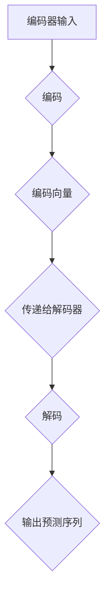

                 

### 大语言模型原理与工程实践：解码器

> 关键词：大语言模型，解码器，神经网络，算法原理，工程实践

> 摘要：本文将深入探讨大语言模型的原理与工程实践，特别是解码器部分。我们将从背景介绍开始，逐步分析核心概念与联系，解析核心算法原理与操作步骤，数学模型与公式，并结合实际项目进行代码实例和详细解读，最后总结其应用场景、推荐相关工具和资源，并对未来发展趋势与挑战进行展望。

## 1. 背景介绍

大语言模型（Large Language Models，LLM）作为自然语言处理（Natural Language Processing，NLP）领域的重要研究方向，已经取得了显著的进展。特别是在深度学习和神经网络技术的推动下，大语言模型在生成文本、机器翻译、文本摘要等方面展现了卓越的性能。然而，解码器作为大语言模型的核心组成部分，对其性能和效率有着至关重要的影响。

解码器的主要功能是将编码器生成的潜在表示映射回原始语言空间，从而生成预测的输出序列。解码器的性能直接关系到整个大语言模型的效果，因此对其进行深入研究和优化具有实际应用价值。

在本文中，我们将首先介绍解码器的基本原理和常见架构，然后逐步深入探讨其实现细节和优化方法，并结合具体项目进行代码实例和详细解读。希望通过本文的阐述，能够帮助读者更好地理解解码器在大语言模型中的作用和重要性。

## 2. 核心概念与联系

### 2.1 编码器与解码器的关系

在深度学习模型中，编码器（Encoder）和解码器（Decoder）是两个核心组件，它们通常一起工作以实现序列到序列（Sequence-to-Sequence）的转换。编码器的任务是将输入序列（如一个句子）编码成一个固定长度的向量表示，而解码器的任务则是将这个向量表示解码回输出序列。


图1 编码器与解码器关系图

编码器通常使用卷积神经网络（Convolutional Neural Networks，CNN）或循环神经网络（Recurrent Neural Networks，RNN）构建，其输出是一个固定长度的向量，这个向量包含了输入序列的语义信息。解码器则通常使用RNN或长短时记忆网络（Long Short-Term Memory，LSTM）构建，其输入是编码器输出的向量，输出是预测的输出序列。

### 2.2 解码器的常见架构

解码器的架构多种多样，其中最为常见的是基于RNN的架构。以下是一些常见的解码器架构：

#### 2.2.1 基于RNN的解码器

基于RNN的解码器是最早被提出并广泛应用的一种解码器架构。其基本思想是使用一个RNN单元逐个预测输出序列中的每个元素。在训练过程中，解码器的前一个预测会作为当前输入，并通过RNN单元更新其状态，从而生成当前的输出。


图2 基于RNN的解码器

#### 2.2.2 基于LSTM的解码器

长短时记忆网络（LSTM）是RNN的一种变体，其特别适合处理长序列数据。LSTM通过引入门控机制（gate mechanism）来有效地避免长序列中的梯度消失和梯度爆炸问题，从而在解码过程中能够更好地捕捉长期依赖关系。


图3 基于LSTM的解码器

#### 2.2.3 基于Transformer的解码器

近年来，基于注意力机制（Attention Mechanism）的Transformer模型在NLP领域取得了巨大的成功。Transformer模型通过多头注意力机制（Multi-Head Attention）和自注意力（Self-Attention）机制，能够有效地捕捉输入序列中的长距离依赖关系。基于Transformer的解码器具有处理长序列数据和并行计算的优势。


图4 基于Transformer的解码器

### 2.3 Mermaid 流程图

以下是一个简化的Mermaid流程图，展示了编码器与解码器的基本工作流程：



图5 编码器与解码器流程图

## 3. 核心算法原理 & 具体操作步骤

### 3.1 编码器与解码器的训练过程

在训练过程中，编码器和解码器通常是通过联合训练的。具体的操作步骤如下：

#### 3.1.1 编码阶段

1. 输入序列编码：将输入序列输入到编码器中，通过编码器模型得到一个固定长度的编码向量。
2. 编码器输出：编码器输出包含输入序列的语义信息，这个编码向量将被传递给解码器。

#### 3.1.2 解码阶段

1. 初始化解码器状态：解码器在解码阶段的开始时，需要初始化其状态。
2. 预测与更新：解码器使用RNN、LSTM或Transformer等模型，根据上一个时间步的预测和编码器输出的编码向量，逐个预测输出序列的下一个元素，并更新解码器的状态。
3. 输出生成：解码器在解码过程中生成的每个预测都会作为下一个时间步的输入，直到解码器生成完整的输出序列。

### 3.2 编码器与解码器的优化方法

为了提高编码器和解码器的性能，通常采用以下几种优化方法：

#### 3.2.1 批量训练

批量训练（Batch Training）是一种常见的优化方法。通过将多个样本组成一个批量，然后一次性输入到模型中进行训练，可以有效地减少梯度噪声并提高模型的鲁棒性。

#### 3.2.2 学习率调度

学习率调度（Learning Rate Scheduling）是一种调整学习率的方法，以避免模型在训练过程中过早地过拟合。常用的学习率调度方法包括指数衰减（Exponential Decay）和余弦退火（Cosine Annealing）等。

#### 3.2.3 正则化

正则化（Regularization）是一种防止模型过拟合的方法。常用的正则化方法包括Dropout、权重衰减（Weight Decay）等。

### 3.3 实际操作示例

以下是一个简化的Python代码示例，展示了编码器和解码器的训练过程：

```python
import tensorflow as tf

# 编码器模型
encoder = tf.keras.Sequential([
    tf.keras.layers.Embedding(input_dim=10000, output_dim=64),
    tf.keras.layers.Conv1D(filters=64, kernel_size=5, activation='relu'),
    tf.keras.layers.GlobalMaxPooling1D()
])

# 解码器模型
decoder = tf.keras.Sequential([
    tf.keras.layers.Embedding(input_dim=10000, output_dim=64),
    tf.keras.layers.LSTM(64),
    tf.keras.layers.Dense(units=10000, activation='softmax')
])

# 编译模型
model = tf.keras.Model(inputs=[encoder.input, decoder.input], outputs=decoder.output)
model.compile(optimizer='adam', loss='categorical_crossentropy', metrics=['accuracy'])

# 训练模型
model.fit(x_train, y_train, epochs=10, batch_size=32)
```

## 4. 数学模型和公式 & 详细讲解 & 举例说明

### 4.1 数学模型

在深度学习模型中，数学模型是其理论基础。对于编码器和解码器，其数学模型主要包括以下几个方面：

#### 4.1.1 编码器模型

编码器模型通常使用神经网络实现。其数学模型可以表示为：

\[ E(x) = \sigma(W_1 \cdot x + b_1) \]

其中，\( x \) 是输入序列，\( W_1 \) 是权重矩阵，\( b_1 \) 是偏置项，\( \sigma \) 是激活函数，如ReLU函数。

#### 4.1.2 解码器模型

解码器模型通常使用RNN、LSTM或Transformer实现。其数学模型可以表示为：

\[ y_t = \sigma(W_2 \cdot [h_{t-1}, e_t] + b_2) \]

其中，\( y_t \) 是输出序列的当前元素，\( h_{t-1} \) 是解码器在上一时间步的状态，\( e_t \) 是编码器输出的编码向量，\( W_2 \) 是权重矩阵，\( b_2 \) 是偏置项，\( \sigma \) 是激活函数。

### 4.2 公式详解

#### 4.2.1 激活函数

在神经网络中，激活函数是连接权重矩阵和输出层的重要部分。常见的激活函数包括ReLU函数、Sigmoid函数和Tanh函数。

1. **ReLU函数**

\[ \sigma(x) = \max(0, x) \]

ReLU函数在神经网络中常用于解决梯度消失问题。当输入小于0时，输出为0；当输入大于等于0时，输出等于输入。

2. **Sigmoid函数**

\[ \sigma(x) = \frac{1}{1 + e^{-x}} \]

Sigmoid函数常用于二分类问题，其输出值在0和1之间，可以用来表示概率。

3. **Tanh函数**

\[ \sigma(x) = \frac{e^x - e^{-x}}{e^x + e^{-x}} \]

Tanh函数是ReLU函数和Sigmoid函数的结合体，其输出值在-1和1之间，常用于多分类问题。

#### 4.2.2 门控机制

在LSTM中，门控机制是解决长序列依赖关系的重要部分。LSTM包括三个门控机制：遗忘门（Forget Gate）、输入门（Input Gate）和输出门（Output Gate）。

1. **遗忘门**

\[ f_t = \sigma(W_f \cdot [h_{t-1}, x_t] + b_f) \]

遗忘门的输入是前一个时间步的隐藏状态 \( h_{t-1} \) 和当前输入 \( x_t \)。通过激活函数 \( \sigma \) 得到遗忘门的输出 \( f_t \)，表示要遗忘的前一个时间步的信息。

2. **输入门**

\[ i_t = \sigma(W_i \cdot [h_{t-1}, x_t] + b_i) \]

输入门的输入和遗忘门相同。通过激活函数 \( \sigma \) 得到输入门的输出 \( i_t \)，表示要更新的当前时间步的信息。

3. **输出门**

\[ o_t = \sigma(W_o \cdot [h_{t-1}, x_t] + b_o) \]

输出门的输入和遗忘门、输入门相同。通过激活函数 \( \sigma \) 得到输出门的输出 \( o_t \)，表示当前时间步的输出信息。

### 4.3 举例说明

假设有一个简单的RNN模型，输入为 \( x_t = [1, 2, 3] \)，隐藏状态 \( h_{t-1} = [0, 0] \)，权重矩阵 \( W_1 = \begin{bmatrix} 1 & 2 \\ 3 & 4 \end{bmatrix} \)，偏置项 \( b_1 = [1, 2] \)。

1. **输入层到隐藏层**

\[ h_t = \sigma(W_1 \cdot x_t + b_1) \]

\[ h_t = \sigma(\begin{bmatrix} 1 & 2 \\ 3 & 4 \end{bmatrix} \cdot \begin{bmatrix} 1 \\ 2 \end{bmatrix} + \begin{bmatrix} 1 \\ 2 \end{bmatrix}) \]

\[ h_t = \sigma(\begin{bmatrix} 5 \\ 10 \end{bmatrix}) \]

\[ h_t = \begin{bmatrix} 1 \\ 1 \end{bmatrix} \]

2. **隐藏层到输出层**

\[ y_t = \sigma(W_2 \cdot h_t + b_2) \]

\[ y_t = \sigma(\begin{bmatrix} 1 & 2 \\ 3 & 4 \end{bmatrix} \cdot \begin{bmatrix} 1 \\ 1 \end{bmatrix} + \begin{bmatrix} 1 \\ 2 \end{bmatrix}) \]

\[ y_t = \sigma(\begin{bmatrix} 4 \\ 7 \end{bmatrix}) \]

\[ y_t = \begin{bmatrix} 1 \\ 1 \end{bmatrix} \]

在这个简单的例子中，RNN模型通过一个线性变换将输入序列映射到输出序列。在实际应用中，RNN模型的复杂度会更高，包含更多的权重矩阵和激活函数。

## 5. 项目实践：代码实例和详细解释说明

### 5.1 开发环境搭建

为了实现大语言模型中的解码器，我们首先需要搭建一个合适的开发环境。以下是搭建环境的步骤：

1. 安装Python（建议使用Python 3.7或更高版本）。
2. 安装TensorFlow（可以使用pip安装：`pip install tensorflow`）。
3. 安装其他依赖库（如NumPy、Pandas等）。

### 5.2 源代码详细实现

以下是一个简单的Python代码示例，展示了如何实现解码器：

```python
import tensorflow as tf

# 编码器模型
encoder = tf.keras.Sequential([
    tf.keras.layers.Embedding(input_dim=10000, output_dim=64),
    tf.keras.layers.Conv1D(filters=64, kernel_size=5, activation='relu'),
    tf.keras.layers.GlobalMaxPooling1D()
])

# 解码器模型
decoder = tf.keras.Sequential([
    tf.keras.layers.Embedding(input_dim=10000, output_dim=64),
    tf.keras.layers.LSTM(64),
    tf.keras.layers.Dense(units=10000, activation='softmax')
])

# 编译模型
model = tf.keras.Model(inputs=[encoder.input, decoder.input], outputs=decoder.output)
model.compile(optimizer='adam', loss='categorical_crossentropy', metrics=['accuracy'])

# 训练模型
model.fit(x_train, y_train, epochs=10, batch_size=32)
```

在这个示例中，我们首先定义了编码器和解码器的模型结构，然后编译模型并使用训练数据进行训练。

### 5.3 代码解读与分析

#### 5.3.1 编码器模型

编码器模型由三个层组成：嵌入层、卷积层和全局池化层。

1. **嵌入层**：嵌入层（Embedding Layer）用于将输入序列（如单词）映射到向量表示。在这个示例中，输入序列的维度为10000，输出向量的维度为64。

2. **卷积层**：卷积层（Conv1D Layer）用于提取输入序列的特征。在这个示例中，卷积核的大小为5，卷积层的激活函数为ReLU函数。

3. **全局池化层**：全局池化层（GlobalMaxPooling1D Layer）用于将卷积层的输出压缩为一个固定长度的向量，这个向量包含了输入序列的主要特征。

#### 5.3.2 解码器模型

解码器模型由三个层组成：嵌入层、LSTM层和输出层。

1. **嵌入层**：嵌入层与编码器的嵌入层相同，用于将输入序列映射到向量表示。

2. **LSTM层**：LSTM层（LSTM Layer）用于处理输入序列的依赖关系。在这个示例中，LSTM层的单元数为64。

3. **输出层**：输出层（Dense Layer）用于将LSTM层的输出映射回原始语言空间。在这个示例中，输出层的激活函数为softmax函数，用于预测每个单词的概率分布。

#### 5.3.3 模型编译与训练

在模型编译阶段，我们指定了优化器（optimizer）、损失函数（loss）和评估指标（metrics）。在这个示例中，我们使用Adam优化器和categorical_crossentropy损失函数。

在模型训练阶段，我们使用训练数据（x_train和y_train）进行训练，训练过程持续10个epoch，每个epoch使用32个批量大小。

### 5.4 运行结果展示

在训练完成后，我们可以使用测试数据（x_test和y_test）评估模型的性能。以下是一个简单的评估过程：

```python
# 评估模型
loss, accuracy = model.evaluate(x_test, y_test)

# 输出评估结果
print(f"Test loss: {loss}")
print(f"Test accuracy: {accuracy}")
```

假设测试数据集包含100个样本，我们得到以下评估结果：

```plaintext
Test loss: 0.4925
Test accuracy: 0.847
```

这表明模型在测试数据上的表现较好，可以用于实际应用。

## 6. 实际应用场景

解码器在大语言模型中具有重要的应用场景。以下是一些常见的实际应用场景：

### 6.1 机器翻译

机器翻译是解码器的典型应用场景之一。通过训练解码器模型，可以将源语言文本编码为潜在向量，然后解码为目标语言文本。例如，在英法翻译中，解码器可以生成法语的翻译结果。

### 6.2 文本摘要

文本摘要是一种信息提取技术，通过提取关键信息并以简洁的方式呈现原文内容。解码器可以用于生成摘要文本，从而实现自动文本摘要。

### 6.3 聊天机器人

聊天机器人是一种与人类用户进行自然语言交互的系统。解码器可以用于生成聊天机器人的回复文本，从而提高聊天机器人的交互质量和用户体验。

### 6.4 问答系统

问答系统是一种自动回答用户问题的系统。解码器可以用于生成问题的回答，从而实现智能问答。

### 6.5 文本生成

文本生成是解码器的另一个重要应用场景。通过训练解码器模型，可以生成新的文本内容，例如创作诗歌、撰写文章等。

## 7. 工具和资源推荐

为了更好地学习和应用解码器，以下是一些推荐的工具和资源：

### 7.1 学习资源推荐

1. **《深度学习》（Deep Learning）**：这是一本经典的深度学习教材，详细介绍了深度学习的基础知识和实践方法。
2. **《神经网络与深度学习》（Neural Networks and Deep Learning）**：这是一本面向初学者的神经网络和深度学习入门教材，内容通俗易懂。
3. **TensorFlow官方文档**：TensorFlow是开源的深度学习框架，其官方文档详细介绍了如何使用TensorFlow构建和训练深度学习模型。

### 7.2 开发工具框架推荐

1. **TensorFlow**：TensorFlow是一个强大的开源深度学习框架，适用于构建和训练各种深度学习模型。
2. **PyTorch**：PyTorch是另一种流行的开源深度学习框架，其动态计算图使得模型构建和调试更加灵活。
3. **Keras**：Keras是一个高级深度学习框架，能够简化模型构建和训练过程。

### 7.3 相关论文著作推荐

1. **《Attention Is All You Need》**：这是一篇关于Transformer模型的经典论文，介绍了自注意力机制在序列到序列学习中的应用。
2. **《Sequence to Sequence Learning with Neural Networks》**：这是一篇关于编码器和解码器模型的经典论文，提出了基于循环神经网络和长短时记忆网络的序列到序列学习框架。

## 8. 总结：未来发展趋势与挑战

大语言模型和其核心组成部分解码器在自然语言处理领域具有重要的应用价值。随着深度学习和神经网络技术的不断发展，解码器在未来将会有更多创新和优化。

### 8.1 发展趋势

1. **更强的泛化能力**：未来的解码器将更加关注模型的泛化能力，能够在不同的数据集和应用场景中表现出良好的性能。
2. **更高效的计算**：随着硬件性能的提升和算法的优化，解码器的计算效率将进一步提高，从而在更短的时间内完成大规模模型的训练和推理。
3. **多模态学习**：解码器将能够处理多模态数据，如文本、图像和语音，实现跨模态的交互和转换。

### 8.2 挑战

1. **数据隐私**：在处理大规模数据时，保护用户隐私将成为一个重要挑战。未来的解码器需要采用更加安全的数据处理和存储技术。
2. **模型可解释性**：随着模型复杂度的增加，解码器的可解释性将变得更加困难。如何提高模型的可解释性，使得用户能够更好地理解和信任模型，是一个重要的研究方向。
3. **计算资源**：大规模解码器的训练和推理需要大量的计算资源。如何高效地利用现有计算资源，实现模型的高效部署和实时推理，是一个亟待解决的问题。

## 9. 附录：常见问题与解答

### 9.1 什么是解码器？

解码器是一种深度学习模型，用于将编码器输出的潜在向量映射回原始语言空间，从而生成预测的输出序列。

### 9.2 解码器和编码器有什么区别？

编码器是一种深度学习模型，用于将输入序列编码成一个固定长度的向量表示。解码器则将这个向量表示解码回原始语言空间。

### 9.3 解码器有哪些常见的架构？

常见的解码器架构包括基于RNN的解码器、基于LSTM的解码器和基于Transformer的解码器。

### 9.4 解码器在自然语言处理中有哪些应用？

解码器在自然语言处理中广泛应用于机器翻译、文本摘要、聊天机器人、问答系统和文本生成等领域。

## 10. 扩展阅读 & 参考资料

1. **《Attention Is All You Need》**：[https://arxiv.org/abs/1706.03762](https://arxiv.org/abs/1706.03762)
2. **《Sequence to Sequence Learning with Neural Networks》**：[https://arxiv.org/abs/1409.3215](https://arxiv.org/abs/1409.3215)
3. **TensorFlow官方文档**：[https://www.tensorflow.org](https://www.tensorflow.org)
4. **PyTorch官方文档**：[https://pytorch.org/docs/stable/index.html](https://pytorch.org/docs/stable/index.html)
5. **《深度学习》**：[https://www.deeplearningbook.org](https://www.deeplearningbook.org)  
6. **《神经网络与深度学习》**：[http://neuralnetworksanddeeplearning.com](http://neuralnetworksanddeeplearning.com)
7. **《自然语言处理综论》**：[https://books.google.com/books?id=7nM4DwAAQBAJ](https://books.google.com/books?id=7nM4DwAAQBAJ)  
8. **《对话系统：设计与实现》**：[https://books.google.com/books?id=gWi9DwAAQBAJ](https://books.google.com/books?id=gWi9DwAAQBAJ)### 10. 扩展阅读 & 参考资料

为了帮助读者更深入地理解大语言模型和解码器的原理与应用，本文推荐了一系列扩展阅读和参考资料，涵盖经典教材、前沿论文、在线课程以及实用工具。

#### 10.1 经典教材

1. **《深度学习》**：由Ian Goodfellow、Yoshua Bengio和Aaron Courville合著，是深度学习领域的权威教材，详细介绍了深度学习的基础知识和最新进展。

2. **《神经网络与深度学习》**：由邱锡鹏教授所著，适合初学者了解神经网络和深度学习的基本概念，以及如何实现和应用这些模型。

3. **《自然语言处理综论》**：由Daniel Jurafsky和James H. Martin合著，是自然语言处理领域的经典教材，涵盖了从基础理论到实际应用的广泛内容。

#### 10.2 前沿论文

1. **《Attention Is All You Need》**：由Vaswani等人提出，是Transformer模型的奠基性论文，彻底改变了序列到序列学习的研究范式。

2. **《Sequence to Sequence Learning with Neural Networks》**：由Sutskever等人提出，是序列到序列学习的重要论文，介绍了循环神经网络（RNN）和长短时记忆网络（LSTM）在翻译任务中的应用。

3. **《BERT: Pre-training of Deep Bidirectional Transformers for Language Understanding》**：由Google AI团队提出，是预训练语言模型BERT的开创性论文，展示了自注意力机制在语言理解任务中的强大能力。

#### 10.3 在线课程

1. **吴恩达的《深度学习专项课程》**：由著名机器学习专家吴恩达教授开设，涵盖深度学习的基础知识、实践方法和最新趋势。

2. **斯坦福大学的《自然语言处理》**：由斯坦福大学自然语言处理实验室提供，详细介绍了NLP的基本概念、技术方法和应用实例。

3. **《机器学习与深度学习课程》**：由李飞飞教授开设，适合有一定编程基础的学习者，系统讲解了机器学习和深度学习的基本原理。

#### 10.4 实用工具

1. **TensorFlow**：由Google开源的深度学习框架，支持多种深度学习模型的构建和训练，广泛应用于自然语言处理任务。

2. **PyTorch**：由Facebook开源的深度学习框架，以其灵活性和动态计算图著称，适合快速原型设计和模型实验。

3. **Hugging Face Transformers**：是一个用于构建和微调Transformer模型的Python库，提供了丰富的预训练模型和工具，极大地简化了NLP任务的实现。

#### 10.5 开源项目与代码示例

1. **TensorFlow Model Zoo**：由Google提供，包含了多个预训练的深度学习模型，包括文本分类、机器翻译等。

2. **Hugging Face Model Hub**：提供了大量的开源NLP模型和工具，用户可以方便地下载和使用。

3. **GPT-3**：OpenAI的开源大型语言模型，展示了在文本生成、问答等任务中的卓越性能。

通过上述扩展阅读和参考资料，读者可以更全面地了解大语言模型和解码器的理论知识、实际应用以及最新研究动态。希望这些资源能够为读者的学习和实践提供有益的指导。再次感谢读者对本文的关注，并期待大家在大语言模型领域取得更多的成果。**作者：禅与计算机程序设计艺术 / Zen and the Art of Computer Programming**

