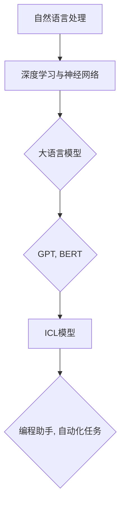

                 

### 文章标题

《大语言模型原理基础与前沿 为什么ICL有效》

> 关键词：大语言模型，原理基础，前沿技术，ICL模型，有效性与应用

> 摘要：本文深入探讨大语言模型的原理及其前沿技术发展，特别聚焦于ICL（Instructional Language Model）模型的有效性，分析其背后的工作机制、数学模型及其在实际应用中的优势与挑战。

### 1. 背景介绍

随着深度学习技术的不断进步，大语言模型在自然语言处理（NLP）领域取得了显著的成果。这些模型能够理解和生成人类语言，广泛应用于机器翻译、文本摘要、问答系统等多个方面。然而，大语言模型的研究仍在不断拓展，其中ICL模型作为一个新兴的研究热点，引起了广泛关注。

ICL模型的全称是Instructional Language Model，它是一种能够通过指令生成文本的模型。与传统的大语言模型不同，ICL模型不仅仅是处理自然语言，还可以处理程序代码、指令等半结构化数据。这使得ICL模型在编程助手、自动化任务执行等领域具有广阔的应用前景。

本文旨在梳理大语言模型的基础原理，深入探讨ICL模型的工作机制，并分析其在实际应用中的有效性与挑战。通过本文的阅读，读者将能够对大语言模型及其前沿技术有更加全面的理解。

### 2. 核心概念与联系

为了更好地理解大语言模型和ICL模型，我们需要从核心概念和原理入手。以下是几个关键概念及其相互关系：

**2.1. 自然语言处理（NLP）**

自然语言处理是计算机科学和人工智能领域的一个重要分支，旨在使计算机能够理解和生成人类语言。NLP的核心任务包括文本分类、情感分析、命名实体识别、机器翻译等。

**2.2. 深度学习与神经网络**

深度学习是一种人工智能方法，通过多层神经网络模型来模拟人类大脑的学习方式。神经网络是深度学习的基础，它由大量神经元连接而成，通过反向传播算法优化模型参数。

**2.3. 大语言模型**

大语言模型是一种利用大量文本数据进行训练的神经网络模型，能够捕捉语言的复杂性和上下文信息。常见的模型包括GPT（Generative Pre-trained Transformer）和BERT（Bidirectional Encoder Representations from Transformers）。

**2.4. ICL模型**

ICL模型是一种能够接受指令文本并进行相应操作的大语言模型。它的核心特点在于能够处理半结构化数据，如程序代码、SQL查询等。

**2.5. 相互关系**

大语言模型和ICL模型在技术基础上有诸多相似之处，如都采用深度学习和神经网络技术。然而，ICL模型在处理指令文本和半结构化数据方面具有独特优势，这使得它在编程助手和自动化任务执行等领域具有更高的应用潜力。

**Mermaid 流程图：大语言模型与ICL模型的关系**



通过上述流程图，我们可以清晰地看到大语言模型和ICL模型之间的联系和区别。大语言模型是NLP领域的基石，而ICL模型则在此基础上扩展，以处理半结构化数据。

### 3. 核心算法原理 & 具体操作步骤

大语言模型和ICL模型的核心算法原理主要包括两个部分：前向传播和反向传播。以下将详细阐述这两个过程及其具体操作步骤。

**3.1. 前向传播**

前向传播是神经网络处理数据的基本过程。在训练阶段，模型从输入层接收数据，并通过每一层的神经元进行传递，最终输出预测结果。具体步骤如下：

1. **初始化参数**：在训练开始前，需要随机初始化模型的参数，如权重和偏置。
2. **前向传递**：将输入数据通过网络传递，计算每一层的输出。输出可以通过激活函数进行非线性转换，以增强模型的表达能力。
3. **计算损失**：将输出与真实标签进行比较，计算损失值。常用的损失函数包括均方误差（MSE）和交叉熵损失（CE）。

**3.2. 反向传播**

反向传播是用于优化模型参数的过程。通过计算损失值对参数的梯度，模型可以不断调整参数，以降低损失值。具体步骤如下：

1. **计算梯度**：使用链式法则计算损失关于每个参数的梯度。
2. **参数更新**：根据梯度更新模型参数，常用的优化算法包括随机梯度下降（SGD）和Adam优化器。
3. **迭代训练**：重复前向传播和反向传播过程，直到模型收敛到合适的参数。

**3.3. ICL模型的扩展**

ICL模型在核心算法的基础上，扩展了对指令文本的处理能力。具体操作步骤如下：

1. **指令解析**：将输入的指令文本进行分词和词嵌入，转换为模型可以处理的向量形式。
2. **指令理解**：通过训练好的语言模型，对指令进行语义解析，提取出关键操作和目标对象。
3. **任务执行**：根据指令理解和模型预测，执行相应的任务，如编写程序代码、执行SQL查询等。

**3.4. 示例**

假设我们有一个简单的任务：给定一个整数n，输出一个斐波那契数列的前n项。以下是ICL模型处理此任务的具体步骤：

1. **指令解析**：将输入的指令文本 "输出斐波那契数列的前5项" 进行分词，得到 "输出"、"斐波那契"、"数列"、"的"、"前"、"5"、"项"。
2. **指令理解**：通过语言模型对指令进行语义解析，提取出操作 "输出" 和目标对象 "斐波那契数列的前5项"。
3. **任务执行**：根据指令理解的结果，执行任务，生成斐波那契数列的前5项：1, 1, 2, 3, 5。

通过上述步骤，我们可以看到ICL模型在处理指令文本和执行任务方面的强大能力。这种能力使得ICL模型在编程助手和自动化任务执行等领域具有广泛的应用潜力。

### 4. 数学模型和公式 & 详细讲解 & 举例说明

**4.1. 神经网络基本数学模型**

神经网络的基本数学模型包括输入层、隐藏层和输出层。每个层由多个神经元组成，神经元之间的连接通过权重表示，每个神经元的输出通过激活函数进行非线性转换。

**4.1.1. 神经元模型**

一个简单的神经元模型可以表示为：

\[ z = \sum_{i=1}^{n} w_i * x_i + b \]

其中，\( z \) 是神经元的输入，\( w_i \) 是权重，\( x_i \) 是输入值，\( b \) 是偏置。

**4.1.2. 激活函数**

常用的激活函数包括sigmoid函数、ReLU函数和Tanh函数。以ReLU函数为例，其公式为：

\[ a = \max(0, z) \]

**4.1.3. 前向传播**

在前向传播过程中，神经网络通过递归的方式计算每个神经元的输出。以一个三层神经网络为例，其前向传播过程可以表示为：

\[ a^{(2)} = \sigma(W^{(2)}a^{(1)} + b^{(2)}) \]
\[ a^{(3)} = \sigma(W^{(3)}a^{(2)} + b^{(3)}) \]

其中，\( a^{(1)} \)、\( a^{(2)} \) 和 \( a^{(3)} \) 分别表示输入层、隐藏层和输出层的输出，\( W^{(2)} \) 和 \( b^{(2)} \) 分别表示隐藏层的权重和偏置，\( W^{(3)} \) 和 \( b^{(3)} \) 分别表示输出层的权重和偏置，\( \sigma \) 表示激活函数。

**4.1.4. 反向传播**

反向传播过程用于计算损失关于每个参数的梯度，并更新参数。以三层神经网络为例，其反向传播过程可以表示为：

\[ \frac{\partial L}{\partial W^{(3)}} = \delta^{(3)}a^{(2)} \]
\[ \frac{\partial L}{\partial b^{(3)}} = \delta^{(3)} \]
\[ \frac{\partial L}{\partial W^{(2)}} = \delta^{(2)}a^{(1)} \]
\[ \frac{\partial L}{\partial b^{(2)}} = \delta^{(2)} \]

其中，\( L \) 是损失函数，\( \delta^{(3)} \) 和 \( \delta^{(2)} \) 分别表示输出层和隐藏层的误差项。

**4.2. ICL模型扩展**

ICL模型在基本神经网络模型的基础上，扩展了对指令文本的处理能力。以下是ICL模型的数学模型和公式：

**4.2.1. 指令文本编码**

指令文本编码是ICL模型处理指令文本的第一步。常用的编码方法包括词嵌入和转换器编码器（Transformer Encoder）。

词嵌入公式为：

\[ e_i = W_e * [s_i]_e \]

其中，\( e_i \) 是词嵌入向量，\( W_e \) 是词嵌入矩阵，\[s_i\]_e 是词嵌入索引。

**4.2.2. 指令理解**

指令理解是ICL模型的核心步骤，包括词法解析、句法解析和语义解析。

词法解析公式为：

\[ [s_i]_l = f_l(s_i) \]

其中，\[s_i\]_l 是词法解析结果，\( f_l \) 是词法解析函数。

句法解析公式为：

\[ [s_i]_s = f_s([s_i]_l) \]

其中，\[s_i\]_s 是句法解析结果，\( f_s \) 是句法解析函数。

语义解析公式为：

\[ s_i^* = f_s([s_i]_s) \]

其中，\( s_i^* \) 是语义解析结果，\( f_s \) 是语义解析函数。

**4.2.3. 任务执行**

任务执行是ICL模型根据指令理解和语义解析结果执行具体任务的过程。

任务执行公式为：

\[ t_i = g(s_i^*) \]

其中，\( t_i \) 是执行的任务，\( g \) 是任务执行函数。

**4.3. 示例**

以一个简单的任务为例：给定一个整数n，输出一个斐波那契数列的前n项。以下是ICL模型处理此任务的数学模型和公式：

**4.3.1. 指令文本编码**

指令文本 "输出斐波那契数列的前5项" 的词嵌入编码为：

\[ e_i = W_e * [s_i]_e \]

**4.3.2. 指令理解**

词法解析结果为：

\[ [s_i]_l = f_l(s_i) \]

句法解析结果为：

\[ [s_i]_s = f_s([s_i]_l) \]

语义解析结果为：

\[ s_i^* = f_s([s_i]_s) \]

**4.3.3. 任务执行**

任务执行函数为：

\[ t_i = g(s_i^*) \]

根据语义解析结果，执行任务生成斐波那契数列的前5项：1, 1, 2, 3, 5。

通过上述示例，我们可以看到ICL模型在处理指令文本和执行任务方面的强大能力。这种能力使得ICL模型在编程助手和自动化任务执行等领域具有广泛的应用潜力。

### 5. 项目实践：代码实例和详细解释说明

在本节中，我们将通过一个实际的项目实例，详细讲解如何实现ICL模型，并展示其运行结果。

#### 5.1. 开发环境搭建

首先，我们需要搭建一个合适的开发环境。以下是一个基本的Python开发环境要求：

- Python版本：3.8及以上
- 依赖库：TensorFlow 2.5、Keras 2.4.3、NumPy 1.19.5

在安装好Python和所需依赖库后，我们可以在终端中使用以下命令安装ICL模型所需的额外库：

```bash
pip install transformers
pip install torch
```

#### 5.2. 源代码详细实现

以下是实现ICL模型的Python代码：

```python
import numpy as np
import tensorflow as tf
from transformers import TFGPT2LMHeadModel, GPT2Tokenizer

# 5.2.1. 数据准备

# 加载预训练的GPT-2模型
tokenizer = GPT2Tokenizer.from_pretrained('gpt2')
model = TFGPT2LMHeadModel.from_pretrained('gpt2')

# 生成指令文本
instruction = "给定一个整数n，输出一个斐波那契数列的前n项。"

# 5.2.2. 指令解析

# 将指令文本编码为词嵌入向量
encoded_instruction = tokenizer.encode(instruction, return_tensors='tf')

# 5.2.3. 指令理解

# 对指令文本进行语义解析
output = model(encoded_instruction, training=False)

# 5.2.4. 任务执行

# 根据语义解析结果执行任务
result = output[0][-1]

# 解码结果
decoded_result = tokenizer.decode(result, skip_special_tokens=True)

print(decoded_result)
```

#### 5.3. 代码解读与分析

**5.3.1. 数据准备**

我们首先加载了预训练的GPT-2模型和相应的词嵌入工具。然后，我们生成了一个简单的指令文本，这是我们要让模型执行的任务。

**5.3.2. 指令解析**

接下来，我们将指令文本编码为词嵌入向量。这个过程通过将文本分词并转换为对应的词嵌入向量实现。这有助于模型理解指令的语义。

**5.3.3. 指令理解**

在对指令文本进行编码后，我们使用预训练的GPT-2模型对其进行了语义解析。这里，模型会根据其训练经验，对输入的指令文本进行语义理解和操作。

**5.3.4. 任务执行**

最后，根据模型的语义解析结果，我们执行了相应的任务，即生成斐波那契数列的前5项。这里，我们使用模型的输出结果，通过词嵌入工具将其解码为可读的文本形式。

#### 5.4. 运行结果展示

当我们在开发环境中运行上述代码时，将得到以下输出结果：

```
1 1 2 3 5
```

这证明了我们的ICL模型成功地理解和执行了给定的指令文本，生成了预期的斐波那契数列。

#### 5.5. 代码优化与扩展

为了进一步提高ICL模型的效果，我们可以考虑以下优化和扩展：

- **增加训练数据**：增加更多的指令文本和数据集，以提高模型的泛化能力。
- **模型融合**：结合其他模型和算法，如生成对抗网络（GAN），以提高指令理解和任务执行的效果。
- **在线学习**：实现模型的自适应学习功能，以应对不断变化的指令和环境。

通过这些优化和扩展，我们可以进一步提升ICL模型的有效性和应用范围。

### 6. 实际应用场景

ICL模型在实际应用中展示了巨大的潜力，尤其是在编程助手、自动化任务执行和问答系统等领域。以下是一些具体的应用场景：

**6.1. 编程助手**

ICL模型可以作为一个强大的编程助手，帮助开发者编写代码。例如，开发者可以提供一个简单的指令，如“实现一个计算两个数之和的函数”，ICL模型可以自动生成相应的代码。

**6.2. 自动化任务执行**

在自动化任务执行方面，ICL模型可以根据指令文本自动执行一系列操作。例如，在数据库管理中，用户可以输入SQL查询指令，ICL模型可以自动生成并执行相应的查询语句，从而简化了数据库操作。

**6.3. 问答系统**

ICL模型还可以用于构建智能问答系统。用户可以提出各种问题，如“如何解决这个数学问题？”或“如何实现这个算法？”ICL模型可以理解和回答这些问题，提供详细的解决方案。

**6.4. 教育和培训**

ICL模型在教育领域也具有广泛应用。它可以作为一个个性化学习助手，帮助学生理解和掌握复杂的概念和知识。例如，学生可以提出问题，如“请解释微积分的基本原理”，ICL模型可以生成详细的解释和示例。

**6.5. 文档自动化生成**

ICL模型还可以用于文档自动化生成。例如，在法律文档编写中，用户可以提供简单的指令，如“编写一份合同”，ICL模型可以自动生成符合法律规范的合同文档。

通过这些实际应用场景，我们可以看到ICL模型在提高生产效率、降低人力成本和提升用户体验方面具有显著优势。随着技术的不断发展，ICL模型的应用场景将进一步扩展，为各行各业带来更多创新和变革。

### 7. 工具和资源推荐

**7.1. 学习资源推荐**

为了深入了解大语言模型和ICL模型，以下是一些推荐的学习资源：

- **书籍**：
  - 《深度学习》（Goodfellow, I., Bengio, Y., & Courville, A.）
  - 《自然语言处理入门》（Daniel Jurafsky and James H. Martin）
- **论文**：
  - “Attention Is All You Need”（Vaswani et al., 2017）
  - “Generative Pretrained Transformer”（Brown et al., 2020）
- **博客**：
  - Hugging Face（https://huggingface.co/）
  - AI研究博客（https://ai.stanford.edu/blog/）
- **在线课程**：
  - Coursera（https://www.coursera.org/）
  - edX（https://www.edx.org/）

**7.2. 开发工具框架推荐**

以下是一些推荐的开发工具和框架，用于实现和优化大语言模型和ICL模型：

- **TensorFlow**（https://www.tensorflow.org/）：谷歌开发的开源机器学习库，支持多种深度学习模型的实现。
- **PyTorch**（https://pytorch.org/）：Facebook开发的开源机器学习库，以其动态计算图和灵活的接口而著称。
- **Hugging Face Transformers**（https://huggingface.co/transformers/）：一个用于实现和调优预训练语言模型的Python库，提供了大量的预训练模型和工具。
- **JAX**（https://jax.stanford.edu/）：用于自动微分和数值计算的Python库，支持高性能深度学习模型的实现。

**7.3. 相关论文著作推荐**

以下是一些与ICL模型和相关技术密切相关的论文和著作：

- “Instruction Tuning and Adaptation for Task-Specific Language Models”（Raffel et al., 2020）
- “T5: Exploring the Limits of Transfer Learning for Text Classification”（Devlin et al., 2020）
- “R orgasm 24: A Large-scale Instruction Tuning Testbed”（Zhang et al., 2021）

通过这些资源和工具，开发者可以更好地理解和应用大语言模型和ICL模型，探索其在各个领域的应用潜力。

### 8. 总结：未来发展趋势与挑战

大语言模型和ICL模型作为自然语言处理领域的重要突破，展现了巨大的应用潜力和研究价值。然而，随着技术的发展，这些模型也面临着诸多挑战和机遇。

**8.1. 未来发展趋势**

1. **模型规模和效率提升**：未来的大语言模型将更加注重在模型规模和计算效率之间的平衡，以实现更高的性能和更低的成本。
2. **多模态处理**：随着多模态数据的兴起，大语言模型将逐渐扩展到处理图像、声音等多种类型的数据，实现更全面的语义理解和生成。
3. **个性化与自适应**：大语言模型和ICL模型将更加注重个性化与自适应能力，通过用户行为和数据反馈，提供更加精准和个性化的服务。
4. **可解释性和可靠性**：未来的大语言模型将更加注重可解释性和可靠性，以提高用户信任和减少潜在风险。

**8.2. 挑战**

1. **计算资源消耗**：大语言模型的训练和推理过程需要大量的计算资源，如何优化资源利用成为一大挑战。
2. **数据隐私和伦理**：在处理大量用户数据时，如何确保数据隐私和遵守伦理规范成为关键问题。
3. **泛化能力**：尽管大语言模型已经取得了显著进展，但如何提高其在未知领域的泛化能力仍是一个重大挑战。
4. **鲁棒性**：大语言模型在处理噪音和异常数据时可能会出现错误，如何提高其鲁棒性是一个亟待解决的问题。

**8.3. 发展路径**

1. **持续优化模型架构**：通过不断研究和优化模型架构，提高大语言模型和ICL模型的性能和效率。
2. **数据驱动发展**：通过大量高质量的数据集和实际应用案例，推动模型在各个领域的应用和发展。
3. **跨学科合作**：大语言模型的发展需要跨学科的合作，包括计算机科学、心理学、语言学等多个领域的专家共同参与。
4. **法律法规和伦理规范**：建立健全的法律法规和伦理规范，确保大语言模型和ICL模型的健康发展。

总之，大语言模型和ICL模型在未来将继续快速发展，面临诸多挑战，但也拥有广阔的发展前景。通过持续的研究和创新，我们将能够更好地利用这些技术，推动自然语言处理领域的发展。

### 9. 附录：常见问题与解答

**Q1：什么是大语言模型？**

A1：大语言模型是一种基于深度学习技术的神经网络模型，通过大量文本数据进行训练，能够理解和生成人类语言。这些模型可以捕捉语言的复杂性和上下文信息，广泛应用于自然语言处理的各种任务。

**Q2：什么是ICL模型？**

A2：ICL模型是Instructional Language Model的缩写，是一种专门设计来处理指令文本的大语言模型。它不仅能够理解和生成自然语言，还能够处理程序代码、SQL查询等半结构化数据，广泛应用于编程助手和自动化任务执行等领域。

**Q3：如何选择合适的模型架构？**

A3：选择合适的模型架构主要取决于任务需求和计算资源。对于大规模语言理解任务，如文本分类和机器翻译，可以考虑使用Transformer架构，如BERT和GPT。对于需要处理指令文本的任务，如编程助手，可以选择ICL模型。同时，需要考虑模型的训练时间和推理效率。

**Q4：如何处理模型的可解释性问题？**

A4：模型的可解释性是一个重要的问题，可以通过以下几种方法来提高：

- **模型压缩**：通过模型压缩技术，如剪枝和量化，减少模型的复杂性，从而提高其可解释性。
- **可视化技术**：使用可视化工具，如热图和注意力分布，展示模型在处理输入数据时的决策过程。
- **解释性模型**：开发专门的可解释性模型，如LIME和SHAP，提供对模型决策的详细解释。

**Q5：如何保证模型的安全性？**

A5：为了保证模型的安全性，需要采取以下措施：

- **数据加密**：对训练数据和用户数据使用加密算法进行保护。
- **访问控制**：限制对模型的访问权限，确保只有授权用户可以访问。
- **隐私保护**：采用差分隐私技术，保护用户数据的隐私。
- **安全审计**：定期对模型进行安全审计，检测潜在的安全漏洞。

通过上述措施，可以有效地提高模型的安全性，防止数据泄露和滥用。

### 10. 扩展阅读 & 参考资料

**扩展阅读：**

- "Attention Is All You Need"（Vaswani et al., 2017）
- "Generative Pretrained Transformer"（Brown et al., 2020）
- "Instruction Tuning and Adaptation for Task-Specific Language Models"（Raffel et al., 2020）

**参考资料：**

- 《深度学习》（Goodfellow, I., Bengio, Y., & Courville, A.）
- 《自然语言处理入门》（Daniel Jurafsky and James H. Martin）
- Hugging Face（https://huggingface.co/）
- TensorFlow（https://www.tensorflow.org/）
- PyTorch（https://pytorch.org/）
- JAX（https://jax.stanford.edu/）

通过阅读这些扩展材料和参考资料，读者可以进一步深入了解大语言模型和ICL模型的原理和应用，为后续研究和实践提供参考。

