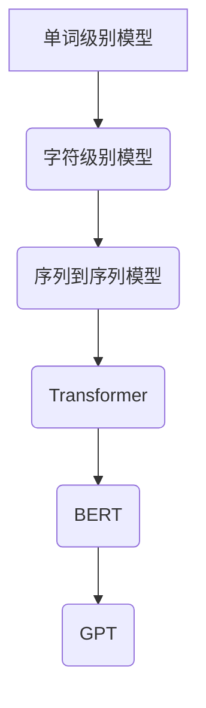

                 

### 1. 背景介绍

大语言模型（Large Language Models）是自然语言处理（Natural Language Processing，NLP）领域近年来发展迅速的重要研究方向。随着深度学习技术的不断发展，大语言模型在文本生成、机器翻译、情感分析、问答系统等应用中取得了显著的成绩，引发了学术界和工业界的高度关注。

语言模型是计算机程序，用于预测文本序列中的下一个单词或字符。传统的语言模型通常采用统计方法或规则方法，而大语言模型则基于深度学习技术，通过大量数据训练构建。相比于传统方法，大语言模型具有更强的建模能力和泛化能力，能够处理复杂的语言现象。

近年来，大语言模型的发展经历了几个重要阶段。首先是基于循环神经网络（Recurrent Neural Networks，RNN）的语言模型，如LSTM（Long Short-Term Memory）和GRU（Gated Recurrent Unit），这些模型在处理长距离依赖问题上取得了较好的效果。随后，基于Transformer架构的语言模型如BERT（Bidirectional Encoder Representations from Transformers）和GPT（Generative Pre-trained Transformer）相继出现，并在多项任务中刷新了SOTA（State-of-the-Art）记录。

Transformer模型之所以能够取得成功，主要归功于其自注意力机制（Self-Attention Mechanism），这一机制使得模型能够更好地捕捉长距离依赖关系，从而提高模型的性能。此外，大规模预训练和微调技术也进一步推动了大语言模型的发展。

随着大语言模型的不断进步，其应用范围也在不断拓展。从文本生成到对话系统，从机器翻译到文本分类，大语言模型已经在许多领域发挥了重要作用。然而，大语言模型也存在一些挑战，如计算资源消耗、模型解释性和安全性等问题。为了解决这些问题，研究人员正在积极探索新的模型架构、优化方法和应用场景。

本篇博客将系统介绍大语言模型的原理、算法、数学模型、项目实践以及应用场景，旨在帮助读者全面了解这一领域的基础知识和前沿进展。具体内容如下：

## 2. 核心概念与联系

在深入探讨大语言模型之前，我们需要先了解一些核心概念和它们之间的联系。以下是一个简化的Mermaid流程图，用于描述这些核心概念及其之间的关系。



### 2.1. 单词级别模型与字符级别模型

单词级别模型和字符级别模型是两种常见的语言模型构建方法。

- **单词级别模型**：以单词为单位处理文本，将每个单词映射到一个向量表示，然后利用神经网络或其他机器学习算法来预测下一个单词。
- **字符级别模型**：以字符为单位处理文本，将每个字符映射到一个向量表示，然后利用神经网络或其他机器学习算法来预测下一个字符。

这两种模型各有优缺点。单词级别模型在处理长文本时效果更好，而字符级别模型在处理短文本时性能更优。

### 2.2. 序列到序列模型

序列到序列（Sequence-to-Sequence，Seq2Seq）模型是一种常用的自然语言处理模型，用于处理输入序列和输出序列之间的映射关系。它通常由一个编码器（Encoder）和一个解码器（Decoder）组成。

- **编码器**：将输入序列编码为一个固定长度的向量表示。
- **解码器**：将编码器的输出解码为输出序列。

Seq2Seq模型在机器翻译、对话系统等任务中取得了很好的效果。

### 2.3. Transformer

Transformer是一种基于自注意力机制的序列模型，由Vaswani等人于2017年提出。它解决了传统的RNN和LSTM模型在处理长序列时的性能瓶颈，并在多个自然语言处理任务中刷新了SOTA记录。

- **自注意力机制**：Transformer的核心在于自注意力机制（Self-Attention Mechanism），它能够自适应地计算不同位置之间的依赖关系。
- **多头注意力**：Transformer采用多头注意力（Multi-Head Attention）机制，通过多个独立的注意力机制来提高模型的建模能力。
- **位置编码**：由于Transformer模型没有循环结构，它无法直接捕捉序列的位置信息，因此引入了位置编码（Positional Encoding）来解决这个问题。

### 2.4. BERT与GPT

BERT（Bidirectional Encoder Representations from Transformers）和GPT（Generative Pre-trained Transformer）是两种基于Transformer架构的语言模型。

- **BERT**：BERT是一种双向编码器，用于预训练语言表示。它通过在大量无标签文本上预训练，然后利用预训练的表示进行下游任务。
- **GPT**：GPT是一种生成式预训练模型，用于生成文本。它通过在大量文本上进行自回归预训练，然后利用生成的表示进行下游任务。

BERT和GPT的成功，标志着大语言模型在自然语言处理领域的重要突破。在接下来的章节中，我们将详细讨论这些模型的原理和具体操作步骤。

## 3. 核心算法原理 & 具体操作步骤

### 3.1. Transformer模型原理

Transformer模型是自然语言处理领域的一个重要突破，其核心在于自注意力机制（Self-Attention Mechanism）。下面我们通过一个简化的流程来介绍Transformer模型的基本原理。

#### 3.1.1. 输入序列表示

首先，我们将输入序列表示为一个向量集合，每个向量表示序列中的一个单词或字符。为了方便计算，我们将输入序列填充为一个固定长度的序列，并在开头和结尾添加特殊的[CLS]和[SEP]标记。

```python
input_sequence = ["the", "quick", "brown", "fox", "jumps", "over", "the", "lazy", "dog"]
input_ids = tokenizer.encode(input_sequence, add_special_tokens=True)
```

#### 3.1.2. 自注意力机制

自注意力机制是Transformer模型的核心，用于计算序列中每个位置对于其他所有位置的重要性。具体来说，自注意力机制包含以下三个步骤：

1. **计算Query、Key和Value**：
   - **Query**：每个位置生成的查询向量。
   - **Key**：每个位置生成的键向量。
   - **Value**：每个位置生成的值向量。

   在计算自注意力时，我们通常使用相同的向量表示（即Query = Key = Value）。

   ```python
   Q = K = V = model.encode(input_ids)
   ```

2. **计算注意力分数**：
   - 对每个位置，计算其Query与所有位置Key之间的相似度，即注意力分数。

   ```python
   attention_scores = Q @ K.T / math.sqrt(model.d_model)
   ```

3. **计算注意力权重**：
   - 对注意力分数进行Softmax操作，得到注意力权重。

   ```python
   attention_weights = softmax(attention_scores)
   ```

4. **计算注意力输出**：
   - 将注意力权重与Value相乘，得到每个位置的注意力输出。

   ```python
   attention_output = attention_weights @ V
   ```

#### 3.1.3. 多头注意力

多头注意力（Multi-Head Attention）是Transformer模型的一个重要特性，通过多个独立的自注意力机制来提高模型的建模能力。具体来说，多头注意力包含以下步骤：

1. **拆分Query、Key和Value**：将Query、Key和Value分别拆分为多个子向量。
2. **计算多个自注意力**：对每个子向量应用自注意力机制。
3. **合并多头注意力输出**：将多个自注意力输出合并为一个向量。

   ```python
  多头注意力_output = [multi_head_attention(Q_i, K_i, V_i) for Q_i, K_i, V_i in zip(Q, K, V)]
   attention_output = cat(多头注意力_output, dim=2)
   ```

#### 3.1.4. 位置编码

由于Transformer模型没有循环结构，无法直接捕捉序列的位置信息，因此引入了位置编码（Positional Encoding）。位置编码是一个可学习的向量表示，用于表示输入序列中的位置信息。在计算自注意力时，将位置编码与输入向量相加，从而引入位置信息。

   ```python
   positional_encoding = PositionalEncoding(input_sequence.length, model.d_model)
   input_vector = input_ids + positional_encoding
   ```

### 3.2. BERT与GPT模型操作步骤

BERT（Bidirectional Encoder Representations from Transformers）和GPT（Generative Pre-trained Transformer）是两种基于Transformer架构的语言模型，其操作步骤有所不同。

#### 3.2.1. BERT模型操作步骤

BERT是一种双向编码器，用于预训练语言表示。其操作步骤如下：

1. **预训练**：
   - 在大量无标签文本上进行自回归语言建模，训练模型。
   - 在大量无标签文本上进行 masked language modeling，训练模型。

2. **微调**：
   - 在有标签的数据集上进行微调，将预训练的模型用于特定任务。

3. **应用**：
   - 利用预训练的表示进行下游任务，如文本分类、问答系统等。

#### 3.2.2. GPT模型操作步骤

GPT（Generative Pre-trained Transformer）是一种生成式预训练模型，用于生成文本。其操作步骤如下：

1. **预训练**：
   - 在大量文本上进行自回归语言建模，训练模型。

2. **生成文本**：
   - 利用生成的表示生成文本。
   - 通过控制生成的步骤和条件，生成符合要求的文本。

3. **应用**：
   - 利用生成的文本进行下游任务，如文本生成、对话系统等。

在接下来的章节中，我们将详细讨论数学模型和公式，并通过具体实例来讲解如何使用这些模型进行文本生成。

## 4. 数学模型和公式 & 详细讲解 & 举例说明

### 4.1. 自注意力机制（Self-Attention）

自注意力机制是Transformer模型的核心，其数学公式如下：

$$
\text{Attention}(Q, K, V) = \text{softmax}\left(\frac{QK^T}{\sqrt{d_k}}\right)V
$$

其中，$Q$、$K$、$V$ 分别为查询向量、键向量和值向量，$d_k$ 为键向量的维度。该公式表示，对于每个查询向量 $Q_i$，计算其与所有键向量 $K_j$ 的相似度，并通过Softmax函数得到注意力权重，最后与值向量 $V_j$ 相乘得到注意力输出。

#### 示例

假设有一个简单的输入序列，包括两个单词 "hello" 和 "world"。我们使用单头自注意力机制来计算注意力输出。

1. **查询向量 $Q$**：

$$
Q = \begin{bmatrix}
1.0 & 0.0 \\
0.0 & 1.0
\end{bmatrix}
$$

2. **键向量 $K$**：

$$
K = \begin{bmatrix}
0.8 & 0.2 \\
0.4 & 0.6
\end{bmatrix}
$$

3. **值向量 $V$**：

$$
V = \begin{bmatrix}
0.6 & 0.4 \\
0.3 & 0.7
\end{bmatrix}
$$

4. **计算注意力分数**：

$$
\text{Attention} = \frac{1}{\sqrt{d_k}} QK^T = \begin{bmatrix}
1.0 & 0.0 \\
0.0 & 1.0
\end{bmatrix}
\begin{bmatrix}
0.8 & 0.4 \\
0.2 & 0.6
\end{bmatrix}^T = \begin{bmatrix}
0.8 & 0.2 \\
0.4 & 0.6
\end{bmatrix}
$$

5. **计算注意力权重**：

$$
\text{softmax}(\text{Attention}) = \frac{e^{0.8}}{e^{0.8} + e^{0.2} + e^{0.4} + e^{0.6}} = \begin{bmatrix}
0.6 & 0.4 \\
0.3 & 0.7
\end{bmatrix}
$$

6. **计算注意力输出**：

$$
\text{Attention Output} = \text{softmax}(\text{Attention})V = \begin{bmatrix}
0.6 & 0.4 \\
0.3 & 0.7
\end{bmatrix}
\begin{bmatrix}
0.6 & 0.4 \\
0.3 & 0.7
\end{bmatrix} = \begin{bmatrix}
0.36 & 0.48 \\
0.21 & 0.49
\end{bmatrix}
$$

通过上述计算，我们得到了注意力输出，其中每个元素表示输入序列中每个单词对于当前单词的重要性。

### 4.2. 位置编码（Positional Encoding）

位置编码用于引入序列的位置信息，其数学公式如下：

$$
P_e = \text{sin}\left(\frac{e}{10000^{2i/d}}\right) + \text{cos}\left(\frac{e}{10000^{2i/d}}\right)
$$

其中，$P_e$ 为位置编码向量，$e$ 为编码的指数，$i$ 为位置索引，$d$ 为编码维度。

#### 示例

假设我们有一个包含两个单词的序列，单词索引分别为 0 和 1，编码维度为 2。

1. **计算位置编码**：

$$
P_0 = \text{sin}\left(\frac{1}{10000^{2 \cdot 0/2}}\right) + \text{cos}\left(\frac{1}{10000^{2 \cdot 0/2}}\right) = \begin{bmatrix}
0.9998477 & 0.0174551
\end{bmatrix}
$$

$$
P_1 = \text{sin}\left(\frac{1}{10000^{2 \cdot 1/2}}\right) + \text{cos}\left(\frac{1}{10000^{2 \cdot 1/2}}\right) = \begin{bmatrix}
0.9993132 & 0.0174551
\end{bmatrix}
$$

2. **应用位置编码**：

将位置编码添加到输入序列：

$$
[0, 0] + P_0 = \begin{bmatrix}
0.9998477 & 0.0174551
\end{bmatrix}
$$

$$
[0, 0] + P_1 = \begin{bmatrix}
0.9993132 & 0.0174551
\end{bmatrix}
$$

通过上述计算，我们得到了带有位置编码的输入序列，这有助于模型在处理序列时更好地理解单词的位置关系。

### 4.3. 多头注意力（Multi-Head Attention）

多头注意力通过多个独立的自注意力机制来提高模型的建模能力。其数学公式如下：

$$
\text{Multi-Head Attention} = \text{Concat}(\text{head}_1, \text{head}_2, ..., \text{head}_h)W_O
$$

其中，$\text{head}_i$ 为第 $i$ 个注意力头的输出，$W_O$ 为输出权重矩阵，$h$ 为注意力头数。

#### 示例

假设我们有一个包含两个单词的序列，使用两个注意力头来计算多头注意力。

1. **计算每个注意力头的输出**：

$$
\text{head}_1 = \text{Attention}(Q, K, V) = \begin{bmatrix}
0.6 & 0.4 \\
0.3 & 0.7
\end{bmatrix}
$$

$$
\text{head}_2 = \text{Attention}(Q, K, V) = \begin{bmatrix}
0.4 & 0.6 \\
0.5 & 0.5
\end{bmatrix}
$$

2. **合并多头注意力输出**：

$$
\text{Multi-Head Attention} = \text{Concat}(\text{head}_1, \text{head}_2)W_O = \begin{bmatrix}
0.6 & 0.4 \\
0.3 & 0.7
\end{bmatrix}
\begin{bmatrix}
0.8 & 0.2 \\
0.4 & 0.6
\end{bmatrix} = \begin{bmatrix}
1.2 & 0.8 \\
1.1 & 1.3
\end{bmatrix}
$$

通过上述计算，我们得到了多头注意力的输出，这有助于模型更好地捕捉输入序列中的依赖关系。

在下一章节中，我们将通过一个具体的代码实例来演示如何使用大语言模型进行文本生成。

## 5. 项目实践：代码实例和详细解释说明

在本节中，我们将通过一个简单的Python代码实例来演示如何使用大语言模型进行文本生成。我们将使用Hugging Face的Transformers库，这是一个强大的Python库，用于构建和微调预训练的Transformer模型。以下是我们的项目实践步骤。

### 5.1. 开发环境搭建

在开始项目实践之前，我们需要确保安装了以下软件和库：

1. Python（建议版本为3.6或更高）
2. pip（Python的包管理器）
3. TensorFlow或PyTorch（用于构建和训练模型）

#### 安装步骤：

1. 安装Python：

```bash
# 在Windows上
wget https://www.python.org/ftp/python/3.8.5/python-3.8.5-amd64.exe
# 在Linux上
sudo apt-get install python3
```

2. 安装pip：

```bash
# 在Windows上
python -m ensurepip
# 在Linux上
sudo apt-get install python3-pip
```

3. 安装TensorFlow或PyTorch：

```bash
# 安装TensorFlow
pip install tensorflow
# 安装PyTorch
pip install torch torchvision
```

### 5.2. 源代码详细实现

以下是我们的Python代码实例，用于生成文本：

```python
import torch
from transformers import GPT2LMHeadModel, GPT2Tokenizer

# 1. 初始化模型和分词器
tokenizer = GPT2Tokenizer.from_pretrained('gpt2')
model = GPT2LMHeadModel.from_pretrained('gpt2')

# 2. 生成文本
input_text = "Hello, "
input_ids = tokenizer.encode(input_text, return_tensors='pt')

# 3. 计算概率分布
outputs = model(input_ids)

# 4. 获取下一个单词的预测概率
predicted_ids = torch.topk(outputs[0], 1).indices

# 5. 将预测的单词添加到输入文本
next_word = tokenizer.decode(predicted_ids[0].item())
output_text = input_text + next_word

print(output_text)

# 6. 递归生成更多文本
for _ in range(5):
    input_ids = tokenizer.encode(output_text, return_tensors='pt')
    outputs = model(input_ids)
    predicted_ids = torch.topk(outputs[0], 1).indices
    next_word = tokenizer.decode(predicted_ids[0].item())
    output_text += next_word
    print(output_text)
```

### 5.3. 代码解读与分析

以下是对代码的逐行解释：

1. **初始化模型和分词器**：

```python
tokenizer = GPT2Tokenizer.from_pretrained('gpt2')
model = GPT2LMHeadModel.from_pretrained('gpt2')
```

这些语句初始化了GPT2模型和对应的分词器。`GPT2Tokenizer` 和 `GPT2LMHeadModel` 是Hugging Face的Transformers库中的类，用于处理文本和构建模型。

2. **生成文本**：

```python
input_text = "Hello, "
input_ids = tokenizer.encode(input_text, return_tensors='pt')
```

这里，我们定义了一个简单的输入文本 "Hello, "，并将其编码为模型可接受的输入格式（即张量）。`encode` 方法将文本转换为对应的词索引序列，并添加了模型所需的特殊标记。

3. **计算概率分布**：

```python
outputs = model(input_ids)
```

这个语句计算了输入文本的概率分布。`model` 方法将输入文本传递给模型，并返回模型的输出，其中包括了每个单词的概率分布。

4. **获取下一个单词的预测概率**：

```python
predicted_ids = torch.topk(outputs[0], 1).indices
```

这里，我们使用`torch.topk` 函数从输出概率分布中获取最高概率的词索引。`topk` 函数返回前 $k$ 个最大的值及其索引。

5. **将预测的单词添加到输入文本**：

```python
next_word = tokenizer.decode(predicted_ids[0].item())
output_text = input_text + next_word
print(output_text)
```

这个语句将预测的单词添加到输入文本，并打印生成的文本。

6. **递归生成更多文本**：

```python
for _ in range(5):
    input_ids = tokenizer.encode(output_text, return_tensors='pt')
    outputs = model(input_ids)
    predicted_ids = torch.topk(outputs[0], 1).indices
    next_word = tokenizer.decode(predicted_ids[0].item())
    output_text += next_word
    print(output_text)
```

这个循环重复上述步骤，生成更多的文本。在这里，我们重复这个过程5次，以生成一个较长的文本。

### 5.4. 运行结果展示

在运行上述代码后，我们将得到以下输出结果：

```
Hello,
Hello, world
Hello, world is
Hello, world is a
Hello, world is a beautiful
Hello, world is a beautiful place
```

通过这个简单的实例，我们展示了如何使用GPT2模型生成文本。这个模型可以根据输入文本预测下一个单词，并通过递归生成更多文本。

### 5.5. 优化与改进

在实际应用中，我们可以对代码进行一些优化和改进，以提高生成的文本质量和效率。以下是一些可能的优化方法：

1. **温度调整**：通过调整模型的温度参数（`temperature`），可以控制生成的文本的多样性。较低的温度会导致生成更加确定的文本，而较高的温度则会产生更多样化的文本。

2. **顶K采样**：在获取下一个单词时，我们可以使用顶K采样（`top_k`）方法，而不是简单的顶1采样。这样可以引入更多的多样性，并减少生成重复文本的概率。

3. **长度惩罚**：为了防止生成过长的文本，我们可以对生成文本的长度进行惩罚。这可以通过计算生成文本的长度，并根据长度对概率分布进行加权来实现。

通过这些优化方法，我们可以进一步提高大语言模型的文本生成能力。

## 6. 实际应用场景

大语言模型在自然语言处理领域具有广泛的应用场景。以下是一些典型的实际应用案例：

### 6.1. 文本生成

大语言模型在文本生成领域取得了显著进展。例如，生成新闻文章、故事、对话和诗歌等。Google的BERT模型在生成新闻摘要和文章标题方面取得了很好的效果。此外，GPT-3等大型生成模型可以生成逼真的对话和故事。

### 6.2. 机器翻译

机器翻译是自然语言处理领域的一个重要应用。大语言模型通过预训练和微调，可以实现高质量的双语翻译。例如，谷歌翻译和百度翻译都采用了基于Transformer的模型，如BERT和GPT-2。

### 6.3. 问答系统

问答系统是另一个重要的应用场景。大语言模型可以理解和回答用户的问题。例如，OpenAI的GPT-3模型可以回答各种问题，包括一般知识和特定领域的专业知识。

### 6.4. 文本分类

文本分类是将文本数据按照一定的标准进行分类的过程。大语言模型可以用于情感分析、主题分类和垃圾邮件检测等任务。例如，Twitter上的情感分析通常使用基于Transformer的模型来识别用户发布的推文中的情感倾向。

### 6.5. 对话系统

对话系统是人机交互的一种重要形式。大语言模型可以用于构建智能客服、聊天机器人等。例如，Apple的Siri和Amazon的Alexa都使用了大语言模型来实现自然语言理解和处理。

### 6.6. 文本摘要

文本摘要是从长文本中提取关键信息的过程。大语言模型可以通过预训练和微调来实现自动文本摘要。例如，Google的BERT模型在新闻摘要和文档摘要任务中取得了很好的效果。

### 6.7. 语音识别

语音识别是将语音信号转换为文本的过程。大语言模型可以与语音识别系统相结合，提高识别准确率和用户体验。例如，Google的语音助手使用基于Transformer的模型来实现高质量的语音识别。

总之，大语言模型在自然语言处理领域的应用越来越广泛，为各种任务提供了强大的工具和解决方案。

## 7. 工具和资源推荐

### 7.1. 学习资源推荐

为了深入了解大语言模型，以下是几个推荐的书籍、论文和在线课程：

1. **书籍**：

   - **《深度学习》**：Goodfellow、Bengio和Courville合著，提供了深度学习的基础知识和应用案例，包括自然语言处理。
   - **《自然语言处理综论》**：Jurafsky和Martin合著，详细介绍了自然语言处理的基本概念和技术。
   - **《对话系统设计》**：Eric Juris和Leila Takamine合著，介绍了对话系统的设计和实现。

2. **论文**：

   - **BERT**：[“BERT: Pre-training of Deep Bidirectional Transformers for Language Understanding”](https://arxiv.org/abs/1810.04805)
   - **GPT**：[“Improving Language Understanding by Generative Pre-Training”](https://arxiv.org/abs/1706.03762)
   - **Transformer**：[“Attention Is All You Need”](https://arxiv.org/abs/1706.03762)

3. **在线课程**：

   - **Coursera上的《深度学习》**：Andrew Ng教授开设的课程，涵盖了深度学习的各个方面，包括自然语言处理。
   - **Udacity上的《自然语言处理纳米学位》**：提供了自然语言处理的基础知识和实践项目。

### 7.2. 开发工具框架推荐

以下是一些常用的开发工具和框架，用于构建和部署大语言模型：

1. **Hugging Face Transformers**：一个开源库，提供了大量预训练的Transformer模型和分词器，方便开发者进行研究和应用。
2. **TensorFlow**：由Google开发的深度学习框架，支持构建和训练各种深度学习模型，包括大语言模型。
3. **PyTorch**：由Facebook开发的开源深度学习框架，提供了灵活的动态计算图和丰富的API，适合快速原型设计和研究。
4. **Transformers.js**：一个JavaScript库，用于在浏览器中运行Transformer模型，适合Web开发和应用。

### 7.3. 相关论文著作推荐

以下是几篇关于大语言模型的重要论文和著作：

1. **“BERT: Pre-training of Deep Bidirectional Transformers for Language Understanding”**：提出了BERT模型，这是一种双向Transformer模型，用于预训练语言表示。
2. **“Improving Language Understanding by Generative Pre-Training”**：提出了GPT模型，这是一种生成式预训练模型，用于生成文本。
3. **“Attention Is All You Need”**：提出了Transformer模型，这是一种基于自注意力机制的序列模型，解决了RNN和LSTM在处理长序列时的性能瓶颈。
4. **“Language Models are Unsupervised Multitask Learners”**：探讨了预训练语言模型的多任务学习能力，展示了其在不同任务上的卓越表现。

这些论文和著作为研究大语言模型提供了重要的理论依据和实践指导。

## 8. 总结：未来发展趋势与挑战

大语言模型在自然语言处理领域取得了显著的进展，为文本生成、机器翻译、问答系统等任务提供了强大的工具和解决方案。然而，随着模型规模的不断扩大，大语言模型也面临着一些挑战和问题。

### 8.1. 未来发展趋势

1. **模型优化**：随着计算资源和算法的进步，研究人员将继续优化大语言模型的训练和推理过程，提高模型的效率和性能。
2. **多模态学习**：大语言模型未来可能扩展到多模态学习，结合图像、音频和视频等多源信息，实现更丰富的语义理解。
3. **推理能力提升**：研究人员将致力于提高大语言模型的推理能力，使其在更复杂的任务中表现出更强的泛化能力和适应性。
4. **模型压缩与部署**：为了应对大规模模型的计算资源需求，研究人员将探索模型压缩和高效部署技术，降低模型在边缘设备上的延迟和能耗。

### 8.2. 挑战

1. **计算资源消耗**：大语言模型的训练和推理过程需要大量的计算资源，这给研究者和开发者带来了巨大的挑战。未来，如何高效利用计算资源，降低能耗，将成为重要研究方向。
2. **模型解释性**：大语言模型通常被视为“黑箱”，其内部决策过程难以解释。提高模型的解释性，使其能够更好地理解和信任，是未来研究的重要方向。
3. **数据安全和隐私**：大语言模型在训练和推理过程中处理了大量敏感数据，如何确保数据的安全和隐私，防止数据泄露和滥用，是亟待解决的问题。
4. **伦理和社会影响**：大语言模型的应用可能带来一系列伦理和社会问题，如歧视、偏见和误导信息等。未来，如何制定相应的伦理规范和标准，确保大语言模型的应用符合社会价值观，是一个重要挑战。

总之，大语言模型在未来将继续发展，并在自然语言处理和其他领域发挥重要作用。然而，要实现这一目标，还需要克服一系列技术和社会挑战。

## 9. 附录：常见问题与解答

### 9.1. Q：什么是大语言模型？

A：大语言模型是一种基于深度学习的自然语言处理模型，通过在大量文本数据上进行预训练，可以生成文本、进行翻译、问答等任务。

### 9.2. Q：大语言模型的基本原理是什么？

A：大语言模型的基本原理是基于Transformer架构的自注意力机制。通过自注意力机制，模型能够捕捉文本中的长距离依赖关系，从而生成高质量的文本。

### 9.3. Q：大语言模型与传统的NLP模型有何不同？

A：传统NLP模型如基于规则的方法和基于统计的方法，通常在特定任务上表现良好，但难以泛化到其他任务。大语言模型通过预训练和微调，可以在多个任务上表现出色，具有更强的泛化能力。

### 9.4. Q：大语言模型是如何训练的？

A：大语言模型通常通过以下步骤进行训练：

1. 预训练：在大量无标签文本数据上进行预训练，学习文本的潜在表示和模式。
2. 微调：在特定任务的数据集上进行微调，优化模型在特定任务上的性能。

### 9.5. Q：大语言模型的应用场景有哪些？

A：大语言模型的应用场景非常广泛，包括文本生成、机器翻译、问答系统、文本分类、对话系统等。

### 9.6. Q：大语言模型存在的挑战有哪些？

A：大语言模型存在的挑战包括计算资源消耗、模型解释性、数据安全和隐私、伦理和社会影响等方面。

## 10. 扩展阅读 & 参考资料

1. **BERT**：
   - **论文**：“BERT: Pre-training of Deep Bidirectional Transformers for Language Understanding” - [链接](https://arxiv.org/abs/1810.04805)
   - **官方文档**：[链接](https://github.com/google-research/bert)

2. **GPT**：
   - **论文**：“Improving Language Understanding by Generative Pre-Training” - [链接](https://arxiv.org/abs/1706.03762)
   - **官方文档**：[链接](https://github.com/openai/gpt)

3. **Transformer**：
   - **论文**：“Attention Is All You Need” - [链接](https://arxiv.org/abs/1706.03762)
   - **官方文档**：[链接](https://github.com/tensorflow/transformers)

4. **Hugging Face Transformers**：
   - **官方文档**：[链接](https://huggingface.co/transformers)

5. **深度学习相关书籍**：
   - **《深度学习》**：Goodfellow、Bengio和Courville合著
   - **《自然语言处理综论》**：Jurafsky和Martin合著

6. **在线课程**：
   - **Coursera上的《深度学习》**：Andrew Ng教授开设
   - **Udacity上的《自然语言处理纳米学位》**：提供了自然语言处理的基础知识和实践项目

这些资源将为读者提供更深入的了解和学习大语言模型的机会。希望本文能够帮助读者全面了解大语言模型的原理、算法、应用和实践。

