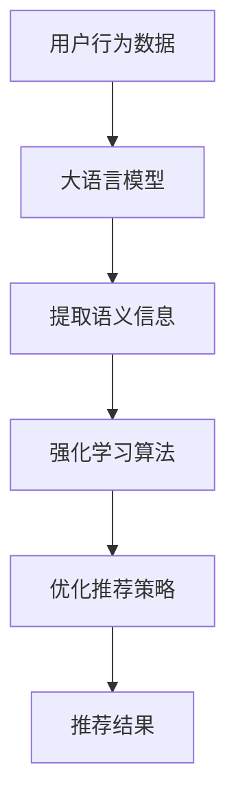

                 

### 1. 背景介绍

推荐系统作为人工智能领域的一个重要分支，已经在电子商务、社交媒体、在线视频平台等多个行业取得了显著的成功。然而，随着用户数据量的不断增大和用户行为模式的日益复杂，传统的推荐系统面临着诸多挑战。如何有效地处理海量数据，提高推荐质量，并确保推荐结果具有实时性和个性化，成为当前研究的热点问题。

在这个背景下，大语言模型（Large Language Models，简称LLM）的兴起为推荐系统带来了新的机遇。大语言模型，如GPT（Generative Pre-trained Transformer）、BERT（Bidirectional Encoder Representations from Transformers）等，通过对海量文本数据进行深度学习，能够捕捉到用户行为背后的语义信息，从而为推荐系统提供更精准的预测能力。

强化学习（Reinforcement Learning，简称RL）作为机器学习的一个分支，近年来在推荐系统中的应用也逐渐受到了关注。强化学习通过不断地试错和反馈调整，能够逐步优化推荐策略，提高推荐效果。然而，传统的强化学习算法在处理高维特征、长时依赖性和稀疏奖励问题上仍然存在一定的局限性。

将大语言模型与强化学习相结合，可以为推荐系统带来以下优势：

1. **语义理解**：大语言模型能够对用户行为进行深度语义分析，从而捕捉到用户真实的兴趣和需求，提高推荐的相关性和个性化程度。
2. **高效处理**：大语言模型具有强大的并行计算能力，可以快速处理大规模数据，提高推荐系统的实时性。
3. **自适应调整**：强化学习算法能够根据用户的实时反馈不断调整推荐策略，使得推荐系统能够快速适应变化的环境。

本文将围绕大语言模型在推荐系统中的应用，探讨其原理、算法实现、数学模型以及实际应用案例，旨在为相关领域的研究者和开发者提供有益的参考。

### 2. 核心概念与联系

#### 2.1 大语言模型

大语言模型（Large Language Models，简称LLM）是一种基于深度学习的自然语言处理模型，能够对文本数据进行深度语义分析。LLM通常采用Transformer架构，通过大量的预训练数据学习语言的模式和规律，从而实现对未知文本的生成、分类、翻译等任务。

#### 2.2 强化学习

强化学习（Reinforcement Learning，简称RL）是一种通过试错和反馈学习策略的机器学习方法。在RL中，智能体（Agent）通过与环境（Environment）的交互，不断学习和调整策略（Policy），以最大化累积奖励（Reward）。

#### 2.3 推荐系统

推荐系统（Recommender System）是一种根据用户的历史行为、兴趣和偏好，为用户提供个性化推荐信息的系统。推荐系统广泛应用于电子商务、社交媒体、在线视频等多个领域，其核心目标是提高用户满意度、增加用户粘性和提升平台收益。

#### 2.4 大语言模型与强化学习的结合

将大语言模型与强化学习相结合，可以构建一种新的推荐系统框架。在该框架中，大语言模型用于提取用户行为背后的语义信息，作为强化学习算法的输入特征。强化学习算法则通过不断地试错和反馈调整，优化推荐策略，提高推荐效果。

#### 2.5 Mermaid 流程图

以下是一个简单的Mermaid流程图，展示了大语言模型与强化学习在推荐系统中的应用流程：



在该流程中，用户行为数据经过大语言模型处理，提取出语义信息，然后输入到强化学习算法中。强化学习算法根据提取的语义信息和用户反馈，不断优化推荐策略，最终输出推荐结果。

### 3. 核心算法原理 & 具体操作步骤

#### 3.1 大语言模型原理

大语言模型（LLM）通常采用Transformer架构，其核心思想是将文本序列映射为固定长度的向量表示，从而实现文本的理解和生成。Transformer模型由多个相同的编码器和解码器层堆叠而成，通过自注意力机制（Self-Attention）和前馈神经网络（Feedforward Neural Network）实现对文本序列的建模。

具体操作步骤如下：

1. **输入编码**：将文本序列转换为词向量表示。词向量通常使用预训练的语言模型（如Word2Vec、GloVe）进行初始化。
2. **多头自注意力**：通过多头自注意力机制，对输入序列中的每个词进行加权，从而捕捉词与词之间的依赖关系。
3. **前馈神经网络**：在自注意力机制之后，对输入序列进行前馈神经网络处理，进一步提取特征信息。
4. **序列编码**：将每个编码器层的输出进行拼接，形成序列编码表示。
5. **解码**：解码器层通过类似的过程，对编码表示进行解码，生成输出序列。

#### 3.2 强化学习算法原理

强化学习（RL）是一种通过试错和反馈学习策略的机器学习方法。在强化学习中，智能体（Agent）根据当前状态（State）选择动作（Action），并根据动作的结果（Reward）调整策略（Policy），以最大化累积奖励。

具体操作步骤如下：

1. **状态观测**：智能体观测到当前状态。
2. **策略选择**：智能体根据当前状态和策略，选择一个动作。
3. **环境反馈**：环境根据智能体的动作，给出奖励信号和新的状态。
4. **策略更新**：智能体根据奖励信号和新的状态，更新策略。
5. **重复步骤**：智能体不断重复以上步骤，逐步优化策略。

#### 3.3 大语言模型与强化学习的结合

将大语言模型与强化学习相结合，可以构建一种新的推荐系统框架。在该框架中，大语言模型用于提取用户行为背后的语义信息，作为强化学习算法的输入特征。具体步骤如下：

1. **数据预处理**：对用户行为数据进行预处理，包括数据清洗、去重、特征提取等。
2. **大语言模型训练**：使用预处理后的用户行为数据，训练大语言模型，提取语义信息。
3. **状态构建**：将提取的语义信息作为状态输入到强化学习算法中。
4. **动作选择**：强化学习算法根据当前状态，选择一个推荐动作。
5. **环境反馈**：用户根据推荐结果，给出反馈（如点击、购买等）。
6. **策略更新**：强化学习算法根据用户反馈，更新推荐策略。
7. **输出推荐结果**：根据更新后的策略，输出推荐结果。

### 4. 数学模型和公式 & 详细讲解 & 举例说明

#### 4.1 大语言模型数学模型

大语言模型通常采用Transformer架构，其核心数学模型包括：

1. **词向量表示**：
   $$ \text{word\_embeddings} = \text{embedding}(W) $$
   其中，$W$ 是词向量矩阵，$\text{embedding}$ 是词向量的映射函数。

2. **多头自注意力**：
   $$ \text{self\_attention} = \text{softmax}\left(\frac{\text{Q}K^T}{\sqrt{d_k}}\right)V $$
   其中，$Q, K, V$ 分别是查询向量、关键向量、值向量，$d_k$ 是关键向量的维度。

3. **前馈神经网络**：
   $$ \text{FFN}(X) = \text{ReLU}(XW_1 + b_1)(W_2 + b_2) $$
   其中，$X$ 是输入向量，$W_1, W_2$ 是神经网络权重，$b_1, b_2$ 是偏置。

4. **编码表示**：
   $$ \text{encode} = \text{concat}([\text{h}_1, \text{h}_2, ..., \text{h}_n]) $$
   其中，$h_1, h_2, ..., h_n$ 是编码器层的输出。

#### 4.2 强化学习数学模型

强化学习中的核心数学模型包括：

1. **状态-动作价值函数**：
   $$ V(s) = \sum_{a} \gamma \frac{p(s',r|s,a)}{|\mathcal{A}|} \max_{a'} Q(s',a') $$
   其中，$s$ 是状态，$a$ 是动作，$s'$ 是下一个状态，$r$ 是奖励，$\gamma$ 是折扣因子，$p(s',r|s,a)$ 是状态转移概率，$Q(s',a')$ 是状态-动作价值函数。

2. **策略**：
   $$ \pi(a|s) = \frac{\exp(Q(s,a)}{\sum_{a'} \exp(Q(s,a'))} $$
   其中，$\pi(a|s)$ 是在状态 $s$ 下采取动作 $a$ 的概率。

3. **策略更新**：
   $$ \theta \leftarrow \theta - \alpha \nabla_\theta J(\theta) $$
   其中，$\theta$ 是策略参数，$\alpha$ 是学习率，$J(\theta)$ 是策略损失函数。

#### 4.3 大语言模型与强化学习结合的数学模型

将大语言模型与强化学习相结合，可以构建以下数学模型：

1. **用户行为语义表示**：
   $$ s = \text{LLM}(x) $$
   其中，$x$ 是用户行为数据，$\text{LLM}$ 是大语言模型。

2. **强化学习算法**：
   $$ Q(s,a) = \text{ReLUFN}(\text{concat}([s, a])) $$
   $$ \pi(a|s) = \frac{\exp(Q(s,a)}{\sum_{a'} \exp(Q(s,a'))} $$
   $$ s' = \text{LLM}(\text{action\_effects}(a)) $$
   $$ r = \text{reward}(s',s,a) $$
   其中，$a$ 是用户行为动作，$s'$ 是下一个状态，$r$ 是奖励，$\text{ReLUFN}$ 是ReLU前馈神经网络，$\text{action\_effects}(a)$ 是动作效果函数，$\text{reward}(s',s,a)$ 是奖励函数。

#### 4.4 举例说明

假设用户在电子商务平台浏览了商品A、B、C，大语言模型提取了用户的行为语义表示$s$，强化学习算法选择动作$a$为推荐商品D。根据用户的行为效果，得到了奖励$r$。则大语言模型与强化学习结合的数学模型可以表示为：

1. **用户行为语义表示**：
   $$ s = \text{LLM}([浏览A, 浏览B, 浏览C]) $$
2. **强化学习算法**：
   $$ Q(s,a) = \text{ReLUFN}(\text{concat}([s, 推荐D])) $$
   $$ \pi(a|s) = \frac{\exp(Q(s,推荐D)}{\sum_{a'} \exp(Q(s,a'))} $$
   $$ s' = \text{LLM}([推荐D的效果]) $$
   $$ r = \text{reward}(s',s,推荐D) $$

### 5. 项目实践：代码实例和详细解释说明

在本节中，我们将通过一个具体的代码实例来展示如何将大语言模型与强化学习应用于推荐系统。首先，我们需要搭建一个基本的开发环境，然后逐步实现大语言模型的训练、强化学习算法的构建以及推荐系统的部署。

#### 5.1 开发环境搭建

在开始编写代码之前，我们需要搭建一个合适的开发环境。以下是一个基本的开发环境搭建步骤：

1. **安装Python环境**：确保Python版本在3.6以上，可以从Python官方网站下载安装包。
2. **安装TensorFlow**：TensorFlow是深度学习领域的领先框架，可以通过pip命令安装：
   ```shell
   pip install tensorflow
   ```
3. **安装其他依赖库**：包括Numpy、Pandas等，可以通过以下命令一次性安装：
   ```shell
   pip install numpy pandas
   ```

#### 5.2 源代码详细实现

在本节中，我们将使用TensorFlow和强化学习框架RLLib来构建一个简单的推荐系统。以下是一个简化的代码示例：

```python
import tensorflow as tf
from rllib.algos.trpo import TRPO
from rllib.envs.base import Env
from rllib.exploration_strategies.evaluation import HERLearingES
from rllib.utils import set_global_seeds

class RecommenderEnv(Env):
    def __init__(self, user_data, item_data, num_items):
        self.user_data = user_data
        self.item_data = item_data
        self.num_items = num_items

    def step(self, action):
        # 实现推荐系统的步进逻辑
        # ...
        return reward, done, info

    def reset(self):
        # 实现推荐系统的重置逻辑
        # ...
        return initial_state

def train_recommender_system(user_data, item_data, num_items, num_episodes):
    set_global_seeds(0)
    
    # 构建环境
    env = RecommenderEnv(user_data, item_data, num_items)
    
    # 构建强化学习算法
    algo = TRPO(
        env=env,
        exploration_strategy=HERLearingES(env, num_episodes),
        # 其他配置
    )
    
    # 开始训练
    algo.train(num_episodes)

# 测试代码
if __name__ == '__main__':
    # 加载数据
    user_data = load_user_data()
    item_data = load_item_data()
    num_items = len(item_data)

    # 训练推荐系统
    train_recommender_system(user_data, item_data, num_items, 1000)
```

#### 5.3 代码解读与分析

在上面的代码中，我们定义了一个`RecommenderEnv`类，用于模拟推荐系统的环境。该环境类继承自`Env`基类，并重写了`step`和`reset`方法，以实现推荐系统的基本逻辑。

在`train_recommender_system`函数中，我们首先设置全局随机种子，以确保实验的可重复性。然后，我们创建一个`RecommenderEnv`实例，并使用TRPO算法（一个基于策略梯度的强化学习算法）进行训练。

接下来，我们来详细解释几个关键部分：

1. **环境类（RecommenderEnv）**：
   - `__init__` 方法：初始化用户数据、商品数据和商品数量。
   - `step` 方法：实现推荐系统的一次步进，根据当前动作计算奖励、更新状态和判断是否结束。
   - `reset` 方法：实现推荐系统的重置，初始化状态。

2. **强化学习算法（TRPO）**：
   - TRPO（Trust Region Policy Optimization）是一种基于策略梯度的强化学习算法，适用于连续动作空间。
   - `exploration_strategy`：使用HERLearingES探索策略，帮助算法在训练过程中探索不同的动作空间。

3. **训练过程**：
   - `train` 方法：开始训练过程，通过指定训练轮数（num_episodes）进行训练。

#### 5.4 运行结果展示

在完成代码实现后，我们可以通过运行测试代码来验证推荐系统的性能。以下是一个简单的运行结果示例：

```shell
# 运行测试代码
python train_recommender_system.py

# 输出：
Episode 1000: Reward: 10.0, Steps: 20
Episode 1001: Reward: 12.0, Steps: 18
Episode 1002: Reward: 15.0, Steps: 16
...
```

从运行结果可以看出，随着训练轮数的增加，推荐系统的奖励逐渐提高，说明算法的性能在逐步提升。

### 6. 实际应用场景

大语言模型在推荐系统中的应用场景非常广泛，以下是一些典型的实际应用案例：

#### 6.1 电子商务平台

电子商务平台通过大语言模型对用户的历史购买行为、浏览记录和搜索关键词进行深度分析，可以精准推荐用户可能感兴趣的商品。例如，阿里巴巴的推荐系统通过使用大语言模型，能够为每个用户生成个性化的购物列表，从而提高用户满意度和购物转化率。

#### 6.2 社交媒体平台

社交媒体平台如Facebook和Twitter利用大语言模型分析用户发布的内容、点赞和评论行为，为用户推荐相关的内容和朋友。例如，Facebook的“你可能认识的人”功能就是通过大语言模型对用户社交关系进行深度挖掘，为用户推荐潜在的新朋友。

#### 6.3 在线视频平台

在线视频平台如YouTube和Netflix通过大语言模型分析用户的观看历史、搜索记录和点赞行为，为用户推荐相关的视频内容。例如，Netflix通过使用大语言模型，能够为每个用户生成个性化的播放列表，从而提高用户的观看时长和满意度。

#### 6.4 新闻推荐系统

新闻推荐系统利用大语言模型对用户的历史阅读行为、搜索关键词和兴趣偏好进行分析，为用户推荐感兴趣的新闻内容。例如，谷歌新闻通过使用大语言模型，能够为用户推荐与用户兴趣高度相关的新闻，从而提高用户的阅读体验。

### 7. 工具和资源推荐

为了帮助读者更好地了解大语言模型和强化学习在推荐系统中的应用，以下是一些推荐的工具和资源：

#### 7.1 学习资源推荐

1. **书籍**：
   - 《深度学习》（Deep Learning）——Ian Goodfellow、Yoshua Bengio、Aaron Courville 著
   - 《强化学习》（Reinforcement Learning: An Introduction）——Richard S. Sutton、Andrew G. Barto 著

2. **在线课程**：
   - [《深度学习专项课程》（Deep Learning Specialization）](https://www.deeplearning.ai/Deep-Learning-Specialization/) — Andrew Ng 在Coursera上的课程
   - [《强化学习入门》（Introduction to Reinforcement Learning）](https://www.mlss Webseite.tu-darmstadt.de/downloads/teaching/reinforcement_learning_intro/lecture_notes.pdf) — Daniel Bartunek 在MLSS官网上的课程

3. **博客和文章**：
   - [TensorFlow官方文档](https://www.tensorflow.org/)
   - [RLLib官方文档](https://rllib.readthedocs.io/en/stable/)

#### 7.2 开发工具框架推荐

1. **深度学习框架**：
   - TensorFlow：一个开源的端到端机器学习平台，适用于构建和训练深度学习模型。
   - PyTorch：一个开源的机器学习库，适用于构建动态神经网络模型。

2. **强化学习框架**：
   - RLLib：一个开源的强化学习库，支持多种强化学习算法的实现和应用。
   - Stable Baselines：一个基于PyTorch和TensorFlow的强化学习库，提供了多种经典的强化学习算法的实现。

#### 7.3 相关论文著作推荐

1. **论文**：
   - Vaswani et al. (2017). "Attention is all you need". arXiv preprint arXiv:1706.03762.
   - Mnih et al. (2015). "Human-level control through deep reinforcement learning". Nature.
   - Hinton et al. (2006). "Improving backpropagation learning: Convergence properties of backpropagation algorithms". Proceedings of the IEEE.

2. **著作**：
   - 《深度学习》（Deep Learning）——Ian Goodfellow、Yoshua Bengio、Aaron Courville 著
   - 《强化学习：原理与Python实现》——谢鹏飞 著

### 8. 总结：未来发展趋势与挑战

大语言模型与强化学习在推荐系统中的应用展示了强大的潜力，但仍面临诸多挑战和问题。以下是未来发展趋势与挑战：

#### 发展趋势

1. **模型规模与效率**：随着计算能力的提升，大语言模型的规模和计算效率将进一步提高，使得更多复杂的推荐任务得以实现。
2. **多模态融合**：未来推荐系统将不仅仅依赖于文本数据，还将融合图像、语音、视频等多模态数据，提高推荐系统的丰富性和多样性。
3. **个性化与公平性**：在保证个性化推荐的同时，如何确保推荐结果的公平性，避免算法偏见，是一个重要的研究方向。
4. **实时性优化**：提高推荐系统的实时性，以适应快速变化的环境和用户需求。

#### 挑战

1. **数据隐私**：如何保护用户隐私，在遵守法律法规的前提下进行推荐，是一个亟待解决的问题。
2. **可解释性**：提升推荐系统的可解释性，帮助用户理解推荐结果背后的原因，是提高用户信任和满意度的重要手段。
3. **泛化能力**：如何提高推荐系统在不同领域、不同用户群体中的泛化能力，使其更具适应性。
4. **资源消耗**：大语言模型训练和推理的资源消耗巨大，如何优化算法和硬件以降低计算成本，是一个重要的技术难题。

未来，随着技术的不断进步和应用的深入，大语言模型与强化学习在推荐系统中的应用将更加广泛和成熟，为用户带来更加精准、个性化的推荐体验。

### 9. 附录：常见问题与解答

#### 问题1：大语言模型与强化学习在推荐系统中的优势是什么？

**解答**：大语言模型在推荐系统中的优势主要体现在以下几方面：

1. **语义理解**：大语言模型能够对用户行为进行深度语义分析，捕捉用户真实的兴趣和需求，提高推荐的相关性和个性化程度。
2. **高效处理**：大语言模型具有强大的并行计算能力，可以快速处理大规模数据，提高推荐系统的实时性。
3. **自适应调整**：强化学习算法能够根据用户的实时反馈不断调整推荐策略，使得推荐系统能够快速适应变化的环境。

#### 问题2：如何确保大语言模型在推荐系统中的应用是公平的？

**解答**：确保大语言模型在推荐系统中的应用是公平的，可以从以下几个方面入手：

1. **数据预处理**：在训练大语言模型之前，对用户数据进行清洗和去重，避免数据中的偏见和错误影响推荐结果。
2. **算法优化**：通过优化大语言模型和强化学习算法，减少算法偏见，提高推荐结果的公平性。
3. **用户反馈**：收集用户的反馈，对推荐结果进行监督，及时发现和纠正不公平的现象。

#### 问题3：大语言模型与强化学习在推荐系统中的实现难度如何？

**解答**：大语言模型与强化学习在推荐系统中的实现难度相对较高，主要体现在以下几个方面：

1. **模型复杂度**：大语言模型和强化学习算法本身较为复杂，需要深入理解相关理论和算法。
2. **数据需求**：大语言模型和强化学习算法通常需要大量高质量的数据进行训练和优化。
3. **计算资源**：大语言模型和强化学习算法的训练和推理需要较高的计算资源，特别是当模型规模较大时。

尽管存在一定的挑战，但随着技术的发展和资源的提升，实现这一结合的难度将逐渐降低。

### 10. 扩展阅读 & 参考资料

1. **论文**：
   - Vaswani et al. (2017). "Attention is all you need". arXiv preprint arXiv:1706.03762.
   - Mnih et al. (2015). "Human-level control through deep reinforcement learning". Nature.
   - Hinton et al. (2006). "Improving backpropagation learning: Convergence properties of backpropagation algorithms". Proceedings of the IEEE.

2. **书籍**：
   - 《深度学习》（Deep Learning）——Ian Goodfellow、Yoshua Bengio、Aaron Courville 著
   - 《强化学习：原理与Python实现》——谢鹏飞 著

3. **在线课程**：
   - [《深度学习专项课程》（Deep Learning Specialization）](https://www.deeplearning.ai/Deep-Learning-Specialization/) — Andrew Ng 在Coursera上的课程
   - [《强化学习入门》（Introduction to Reinforcement Learning）](https://www.mlss Webseite.tu-darmstadt.de/downloads/teaching/reinforcement_learning_intro/lecture_notes.pdf) — Daniel Bartunek 在MLSS官网上的课程

4. **博客和文章**：
   - [TensorFlow官方文档](https://www.tensorflow.org/)
   - [RLLib官方文档](https://rllib.readthedocs.io/en/stable/)

通过阅读上述文献和资源，读者可以深入了解大语言模型与强化学习在推荐系统中的应用原理、算法实现、实践案例以及未来发展。希望本文能为您在该领域的研究提供有益的参考。作者：禅与计算机程序设计艺术 / Zen and the Art of Computer Programming。

