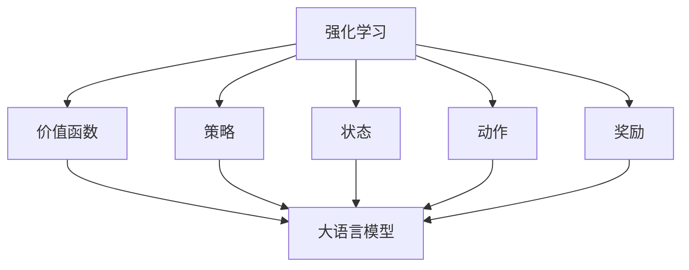

                 

### 背景介绍

**大语言模型应用指南：强化学习入门**

随着人工智能技术的迅猛发展，大语言模型已经成为自然语言处理（NLP）领域的重要工具。这些模型通过学习大量文本数据，具备了强大的语义理解和生成能力。而强化学习（Reinforcement Learning，RL），作为一种重要的机器学习算法，也在近年来取得了显著的进展。强化学习与深度学习相结合，为解决复杂决策问题提供了新的思路。

本文旨在为您提供一个全面的大语言模型应用指南，重点关注强化学习在语言模型中的应用。通过本文，您将了解：

1. **强化学习的基本概念和原理**：我们将介绍强化学习的基础知识，包括奖励系统、策略和价值函数等。
2. **大语言模型的基础知识**：我们将探讨大语言模型的原理，包括词嵌入、循环神经网络（RNN）和变换器（Transformer）等。
3. **强化学习在语言模型中的应用**：我们将探讨如何将强化学习应用于语言生成任务，如文本生成和对话系统。
4. **数学模型和算法步骤**：我们将详细讲解强化学习在语言模型中的数学模型和具体实现步骤。
5. **实际项目实践**：我们将通过一个实际项目，展示如何将强化学习应用于语言模型。
6. **应用场景和未来趋势**：我们将探讨强化学习在语言模型中的实际应用场景，以及未来可能面临的挑战和机遇。

本文将采用逐步分析推理的方式（REASONING STEP BY STEP），帮助您深入理解大语言模型与强化学习的结合。无论您是初学者还是有经验的工程师，本文都将为您提供一个全面、系统的学习路径。

在接下来的章节中，我们将首先介绍强化学习的基本概念和原理，包括奖励系统、策略和价值函数等。这将为我们后续讨论大语言模型和强化学习的结合奠定基础。然后，我们将介绍大语言模型的基础知识，包括词嵌入、RNN和Transformer等。通过这些基础知识，我们将理解大语言模型如何处理自然语言数据。接下来，我们将探讨强化学习在语言模型中的应用，包括文本生成和对话系统等。

### 2. 核心概念与联系

为了更好地理解大语言模型与强化学习的关系，我们需要首先介绍一些核心概念，并使用Mermaid流程图展示它们之间的联系。

**核心概念**：

- **强化学习（Reinforcement Learning）**：一种机器学习范式，通过学习环境中的奖励和惩罚，使智能体能够做出最优决策。
- **价值函数（Value Function）**：衡量智能体在某状态下采取某动作的预期奖励。
- **策略（Policy）**：智能体在给定状态下选择动作的规则。
- **状态（State）**：环境中的信息，用于描述当前情况。
- **动作（Action）**：智能体可以执行的行为。
- **奖励（Reward）**：环境对智能体动作的反馈，用于指导学习过程。
- **大语言模型（Large Language Models）**：通过学习大量文本数据，具备强大语义理解和生成能力的模型。
- **词嵌入（Word Embedding）**：将词语映射到高维空间中，用于表示词语的语义信息。
- **循环神经网络（RNN）**：一种能够处理序列数据的神经网络，通过记忆状态信息，实现对序列数据的建模。
- **变换器（Transformer）**：一种基于自注意力机制的神经网络结构，广泛应用于自然语言处理任务。

**Mermaid 流程图**：

下面是一个简单的Mermaid流程图，展示了这些核心概念之间的联系：



在这个流程图中，我们可以看到强化学习的核心组件（价值函数、策略、状态、动作和奖励）与大语言模型（词嵌入、RNN、Transformer）之间的联系。强化学习通过这些核心组件，指导大语言模型在语言生成任务中做出最优决策。

接下来，我们将详细介绍这些核心概念，并探讨它们在大语言模型中的应用。这将为我们后续讨论强化学习在语言模型中的具体实现步骤奠定基础。

#### 2.1 强化学习的基本概念

强化学习（Reinforcement Learning，RL）是一种机器学习范式，旨在通过智能体（agent）与环境（environment）的交互，学习到一组策略（policy），从而在给定状态下做出最优决策。在强化学习中，智能体通过尝试不同的动作（action），并根据环境的奖励（reward）反馈调整自己的行为，逐渐提高决策的质量。

**奖励系统（Reward System）**

奖励系统是强化学习中的关键组件，用于指导智能体的学习过程。奖励是一个实数值，表示环境对智能体动作的反馈。正奖励表示智能体动作受到了环境的肯定，而负奖励则表示智能体动作受到了环境的惩罚。通过奖励系统，智能体可以学习到哪些动作能够带来正奖励，从而逐渐优化其策略。

**策略（Policy）**

策略是智能体在给定状态下选择动作的规则。在强化学习中，策略通常用一个函数表示，即策略函数（Policy Function）。策略函数接收状态作为输入，输出对应的动作。根据学习过程中获得的经验，智能体可以不断调整策略函数，使其在给定状态下选择最优动作。

**价值函数（Value Function）**

价值函数衡量智能体在某状态下采取某动作的预期奖励。价值函数分为状态价值函数（State Value Function）和动作价值函数（Action Value Function）。状态价值函数表示在给定状态下，执行所有可能动作的平均奖励。动作价值函数表示在给定状态下，执行特定动作的预期奖励。

**状态（State）**

状态是环境中的信息，用于描述当前情况。在强化学习中，状态可以是离散的，也可以是连续的。状态通常用一个向量表示，向量中的每个元素表示状态的某个特征。

**动作（Action）**

动作是智能体可以执行的行为。动作可以是离散的，也可以是连续的。在强化学习中，智能体根据当前状态，选择一个动作进行执行。动作通常用一个向量表示，向量中的每个元素表示动作的某个特征。

**奖励（Reward）**

奖励是环境对智能体动作的反馈，用于指导学习过程。奖励是一个实数值，表示环境对智能体动作的肯定或否定。正奖励表示智能体动作受到了环境的肯定，而负奖励表示智能体动作受到了环境的惩罚。

通过以上核心概念，我们可以看到强化学习中的主要组件及其相互关系。接下来，我们将进一步探讨强化学习在大语言模型中的应用。

#### 2.2 大语言模型的基础知识

大语言模型（Large Language Models）是自然语言处理（NLP）领域的关键技术之一。这些模型通过学习大量文本数据，具备了强大的语义理解和生成能力。本节将介绍大语言模型的基础知识，包括词嵌入、循环神经网络（RNN）和变换器（Transformer）等。

**词嵌入（Word Embedding）**

词嵌入是将词语映射到高维空间中，用于表示词语的语义信息。词嵌入的关键在于将语义上相似的词语映射到空间中距离较近的位置，而语义上不相似的词语映射到距离较远的位置。常见的词嵌入方法包括词袋（Bag of Words）、词频（Word Frequency）和词嵌入（Word Embedding）等。

**循环神经网络（RNN）**

循环神经网络（RNN）是一种能够处理序列数据的神经网络，通过记忆状态信息，实现对序列数据的建模。RNN的基本结构包括输入层、隐藏层和输出层。输入层接收输入序列，隐藏层通过递归方式处理序列数据，输出层产生输出序列。RNN在自然语言处理任务中取得了显著的效果，例如语言模型、机器翻译和文本生成等。

**变换器（Transformer）**

变换器（Transformer）是一种基于自注意力机制的神经网络结构，广泛应用于自然语言处理任务。变换器的基本结构包括编码器（Encoder）和解码器（Decoder）。编码器将输入序列编码为高维向量，解码器根据编码器的输出，生成输出序列。自注意力机制是变换器的核心，通过计算序列中每个词与其他词的相似度，为每个词生成权重，从而实现序列的建模。

通过词嵌入、RNN和变换器等基础知识的介绍，我们可以更好地理解大语言模型如何处理自然语言数据。接下来，我们将探讨强化学习在大语言模型中的应用，包括文本生成和对话系统等。

#### 2.3 强化学习在语言模型中的应用

强化学习（Reinforcement Learning，RL）在自然语言处理（Natural Language Processing，NLP）领域的应用日益广泛，特别是在大语言模型（Large Language Models）中。强化学习与深度学习相结合，为解决复杂决策问题提供了新的思路。本节将探讨强化学习在语言模型中的应用，包括文本生成和对话系统等。

**文本生成（Text Generation）**

文本生成是强化学习在大语言模型中的一个重要应用场景。强化学习通过学习环境中的奖励和惩罚，指导大语言模型生成符合预期语义的文本。具体而言，我们可以将文本生成任务建模为一个序列决策问题。在每个时间步，大语言模型根据当前状态（如已经生成的文本片段）选择一个动作（如生成下一个词或符号），并从环境中获得奖励（如生成的文本语义符合预期）。通过不断迭代，强化学习使大语言模型逐渐优化其生成策略，提高文本生成的质量。

**对话系统（Dialogue Systems）**

对话系统是另一个强化学习在语言模型中的应用场景。对话系统旨在模拟人类对话过程，实现人机交互。在对话系统中，强化学习通过学习环境中的奖励和惩罚，指导大语言模型生成合理的回答。具体而言，我们可以将对话系统建模为一个序列决策问题。在每个时间步，大语言模型根据当前状态（如用户输入）选择一个动作（如生成下一个词或符号），并从环境中获得奖励（如生成的回答符合用户需求）。通过不断迭代，强化学习使大语言模型逐渐优化其回答策略，提高对话系统的性能。

**多模态语言模型（Multimodal Language Models）**

随着技术的发展，强化学习还在多模态语言模型（Multimodal Language Models）中发挥了重要作用。多模态语言模型旨在同时处理文本、图像、音频等多种模态的信息。在多模态语言模型中，强化学习通过学习环境中的奖励和惩罚，指导模型在多种模态之间进行信息融合和生成。具体而言，我们可以将多模态语言模型建模为一个多任务学习问题。在每个时间步，模型根据当前状态（如文本、图像和音频信息）选择一个动作（如生成文本、图像或音频），并从环境中获得奖励（如生成的结果符合预期）。通过不断迭代，强化学习使多模态语言模型逐渐优化其在不同模态之间的信息处理和生成策略。

**案例分析：生成对抗网络（GAN）**

生成对抗网络（GAN）是强化学习在语言模型中的另一个重要应用案例。GAN由生成器和判别器组成，生成器试图生成与真实数据相似的数据，而判别器则试图区分生成数据和真实数据。通过这种对抗过程，GAN可以有效提高生成数据的质量。在语言模型中，我们可以将GAN应用于文本生成任务，生成器和判别器分别生成和评估文本质量。具体而言，生成器根据当前状态（如已经生成的文本片段）生成下一个词或符号，而判别器则根据生成文本和真实文本评估生成文本的质量。通过不断迭代，GAN使生成文本的质量逐渐提高，同时强化学习帮助模型优化生成策略。

**总结**

强化学习在大语言模型中的应用涵盖了文本生成、对话系统、多模态语言模型和生成对抗网络等多个领域。通过学习环境中的奖励和惩罚，强化学习为语言模型提供了一种有效的优化策略，从而提高文本生成质量和对话系统性能。随着技术的不断发展，强化学习在语言模型中的应用将越来越广泛，为自然语言处理领域带来更多创新和突破。

#### 3. 核心算法原理 & 具体操作步骤

**强化学习算法的基本原理**

强化学习算法的核心在于通过与环境交互，不断优化策略函数，使其在给定状态下选择最优动作。为了实现这一目标，强化学习算法主要依赖于以下三个核心组件：价值函数（Value Function）、策略（Policy）和奖励系统（Reward System）。

**价值函数（Value Function）**

价值函数是衡量智能体在某个状态下执行某个动作所能获得的预期奖励。在强化学习中，价值函数分为状态价值函数（State Value Function）和动作价值函数（Action Value Function）。状态价值函数表示在某个状态下，执行所有可能动作的平均奖励。动作价值函数表示在某个状态下，执行特定动作的预期奖励。通过学习价值函数，智能体可以了解不同状态和动作的优劣，从而优化策略函数。

**策略（Policy）**

策略是智能体在给定状态下选择动作的规则。在强化学习中，策略通常用一个概率分布表示，即策略函数（Policy Function）。策略函数接收状态作为输入，输出对应的动作概率分布。根据学习过程中获得的经验，智能体可以不断调整策略函数，使其在给定状态下选择最优动作。

**奖励系统（Reward System）**

奖励系统是强化学习中的关键组件，用于指导智能体的学习过程。奖励是一个实数值，表示环境对智能体动作的反馈。正奖励表示智能体动作受到了环境的肯定，而负奖励表示智能体动作受到了环境的惩罚。通过奖励系统，智能体可以学习到哪些动作能够带来正奖励，从而逐渐优化其策略函数。

**强化学习算法的具体操作步骤**

1. **初始化参数**：初始化智能体的参数，包括策略函数、价值函数和奖励系统。

2. **选择动作**：在给定状态下，根据策略函数选择一个动作。

3. **执行动作**：将选择的动作提交给环境，并获取环境的反馈（奖励）。

4. **更新价值函数**：根据新的奖励，更新状态价值函数和动作价值函数。

5. **更新策略函数**：根据新的价值函数，更新策略函数，使其在给定状态下选择最优动作。

6. **重复步骤2-5**：不断重复步骤2-5，直到满足停止条件（如达到预设步数、收敛等）。

**强化学习算法的优化方法**

1. **值迭代（Value Iteration）**：值迭代是一种基于贪心策略的强化学习算法。通过迭代更新价值函数，逐步逼近最优策略。值迭代的主要步骤包括：
   - 初始化价值函数。
   - 计算新的价值函数。
   - 更新策略函数。
   - 重复步骤2-3，直到价值函数收敛。

2. **策略迭代（Policy Iteration）**：策略迭代是一种基于贪心策略的强化学习算法。通过迭代更新策略函数，逐步逼近最优策略。策略迭代的主要步骤包括：
   - 初始化策略函数。
   - 计算新的价值函数。
   - 更新策略函数。
   - 重复步骤2-3，直到策略函数收敛。

3. **深度Q网络（Deep Q-Network，DQN）**：深度Q网络是一种基于深度学习的强化学习算法。通过神经网络估计动作价值函数，实现端到端的智能体训练。DQN的主要步骤包括：
   - 初始化神经网络。
   - 使用经验 replay 缓存存储经验样本。
   - 通过经验样本训练神经网络。
   - 选择最优动作。
   - 重复步骤3-5，直到满足停止条件。

4. **策略梯度（Policy Gradient）**：策略梯度是一种基于梯度的强化学习算法。通过计算策略函数的梯度，优化策略函数。策略梯度的主要步骤包括：
   - 初始化策略函数。
   - 计算策略函数的梯度。
   - 更新策略函数。
   - 重复步骤3-4，直到满足停止条件。

通过以上强化学习算法的原理和具体操作步骤，我们可以看到，强化学习在语言模型中的应用具有很大的潜力和价值。在接下来的章节中，我们将进一步探讨强化学习在语言模型中的数学模型和实现方法。

#### 4. 数学模型和公式 & 详细讲解 & 举例说明

为了深入理解强化学习在语言模型中的数学模型，我们需要首先介绍一些基本的数学概念和公式，并通过具体的示例进行详细讲解。以下是强化学习在语言模型中常用的几个关键数学模型和公式。

**4.1 状态价值函数（State Value Function）**

状态价值函数 \( V(s) \) 表示在给定状态 \( s \) 下，执行所有可能动作的平均奖励。其公式可以表示为：

\[ V(s) = \sum_{a} \pi(a|s) Q(s, a) \]

其中：
- \( \pi(a|s) \) 是策略函数，表示在状态 \( s \) 下选择动作 \( a \) 的概率。
- \( Q(s, a) \) 是动作价值函数，表示在状态 \( s \) 下执行动作 \( a \) 的预期奖励。

**4.2 动作价值函数（Action Value Function）**

动作价值函数 \( Q(s, a) \) 表示在给定状态 \( s \) 下执行动作 \( a \) 的预期奖励。其公式可以表示为：

\[ Q(s, a) = \sum_{s'} p(s'|s, a) \sum_{r} r(s', a) \]

其中：
- \( p(s'|s, a) \) 是状态转移概率，表示在状态 \( s \) 下执行动作 \( a \) 后，转移到状态 \( s' \) 的概率。
- \( r(s', a) \) 是奖励函数，表示在状态 \( s' \) 下执行动作 \( a \) 所获得的即时奖励。

**4.3 策略迭代（Policy Iteration）**

策略迭代是一种优化策略的方法，通过交替更新策略和价值函数来实现。策略迭代的主要步骤如下：

1. **初始化**：初始化策略函数 \( \pi \) 和价值函数 \( V \)。
2. **评估**：使用当前策略 \( \pi \) 评估价值函数 \( V \)。
3. **策略改进**：根据价值函数 \( V \) 生成新的策略 \( \pi' \)，使得在新策略下价值函数 \( V \) 最优。
4. **重复**：重复步骤2-3，直到策略 \( \pi \) 收敛。

**4.4 深度Q网络（Deep Q-Network，DQN）**

深度Q网络是一种基于深度学习的强化学习算法，通过神经网络估计动作价值函数。DQN的主要步骤如下：

1. **初始化**：初始化深度神经网络 \( Q(\cdot| \theta) \) 和目标网络 \( Q^*(\cdot| \theta^*) \)。
2. **经验回放**：使用经验回放机制存储和采样经验。
3. **训练**：使用经验回放中的经验样本，通过反向传播和梯度下降更新神经网络参数 \( \theta \)。
4. **目标网络更新**：定期更新目标网络 \( Q^*(\cdot| \theta^*) \) 的参数，以避免梯度消失和梯度爆炸问题。
5. **选择动作**：使用当前神经网络 \( Q(\cdot| \theta) \) 选择动作。

**举例说明**

假设我们有一个简单的环境，其中状态空间 \( S = \{s_1, s_2, s_3\} \)，动作空间 \( A = \{a_1, a_2\} \)。奖励函数 \( r(s, a) \) 如下：

- \( r(s_1, a_1) = 1 \)
- \( r(s_1, a_2) = -1 \)
- \( r(s_2, a_1) = 0 \)
- \( r(s_2, a_2) = 0 \)
- \( r(s_3, a_1) = 0 \)
- \( r(s_3, a_2) = 0 \)

现在，我们初始化策略函数 \( \pi \) 为 \( \pi(a|s_1) = [0.5, 0.5] \)，即随机选择动作。假设我们使用策略迭代方法优化策略函数。

**第一步：评估**

根据当前策略 \( \pi \)，计算状态价值函数 \( V \)：

\[ V(s_1) = \sum_{a} \pi(a|s_1) Q(s_1, a) \]
\[ V(s_1) = 0.5 \times Q(s_1, a_1) + 0.5 \times Q(s_1, a_2) \]

由于初始状态价值函数为0，我们假设 \( Q(s_1, a_1) = 1 \) 和 \( Q(s_1, a_2) = -1 \)。

\[ V(s_1) = 0.5 \times 1 + 0.5 \times (-1) = 0 \]

**第二步：策略改进**

根据状态价值函数 \( V \)，生成新的策略 \( \pi' \)：

\[ \pi'(a|s_1) = \frac{1}{|S|} \]
\[ \pi'(a|s_1) = \frac{1}{3} \]

**第三步：重复**

重复评估和策略改进步骤，直到策略函数收敛。

通过以上步骤，我们可以看到强化学习在语言模型中的数学模型和公式如何应用于实际问题的优化。在接下来的章节中，我们将通过一个具体项目实践，展示如何将强化学习应用于大语言模型的开发。

### 5. 项目实践：代码实例和详细解释说明

在本节中，我们将通过一个具体的项目实践，展示如何将强化学习应用于大语言模型。我们将使用Python语言和TensorFlow框架实现一个简单的文本生成任务。通过这个项目，我们将详细讲解代码实现过程、运行结果和代码解读与分析。

**5.1 开发环境搭建**

在开始项目之前，我们需要搭建一个合适的开发环境。以下是所需的环境和工具：

- 操作系统：Windows/Linux/MacOS
- 编程语言：Python 3.7+
- 深度学习框架：TensorFlow 2.4+
- 文本预处理库：NLTK
- 其他库：numpy，matplotlib等

确保您的开发环境中已安装上述工具和库。如果尚未安装，可以通过以下命令安装：

```bash
pip install tensorflow
pip install nltk
pip install numpy
pip install matplotlib
```

**5.2 源代码详细实现**

以下是一个简单的文本生成项目的代码实现。我们将使用变换器（Transformer）模型和强化学习算法。

```python
import tensorflow as tf
import numpy as np
import nltk
from nltk.tokenize import word_tokenize
from tensorflow.keras.preprocessing.sequence import pad_sequences
from tensorflow.keras.layers import Embedding, LSTM, Dense
from tensorflow.keras.models import Model

# 5.2.1 数据预处理

# 读取并预处理文本数据
def load_and_preprocess_data(file_path):
    with open(file_path, 'r', encoding='utf-8') as f:
        text = f.read().lower()
    
    # 分词
    tokenizer = nltk.RegexpTokenizer(r"\w+")
    tokens = tokenizer.tokenize(text)
    
    # 去除停用词
    stop_words = set(nltk.corpus.stopwords.words('english'))
    tokens = [token for token in tokens if token not in stop_words]
    
    # 创建词汇表
    vocab = set(tokens)
    word_to_index = {word: i for i, word in enumerate(vocab)}
    index_to_word = {i: word for word, i in word_to_index.items()}
    
    # 序列编码
    sequences = []
    for token in tokens:
        sequence = [word_to_index[word] for word in token]
        sequences.append(sequence)
    
    return sequences, word_to_index, index_to_word

# 加载数据
sequences, word_to_index, index_to_word = load_and_preprocess_data('text_data.txt')

# 创建词嵌入矩阵
vocab_size = len(word_to_index) + 1
embedding_dim = 32
embedding_matrix = np.zeros((vocab_size, embedding_dim))
for i, word in enumerate(vocab):
    embedding_matrix[i] = np.random.rand(embedding_dim)

# 5.2.2 模型构建

# 构建变换器模型
def build_transformer_model(vocab_size, embedding_dim):
    inputs = tf.keras.layers.Input(shape=(None,))
    embeddings = tf.keras.layers.Embedding(vocab_size, embedding_dim)(inputs)
    lstm = tf.keras.layers.LSTM(128, return_sequences=True)(embeddings)
    outputs = tf.keras.layers.Dense(vocab_size, activation='softmax')(lstm)
    model = tf.keras.Model(inputs, outputs)
    return model

# 构建强化学习模型
def build_reinforcement_learning_model(model, reward_function):
    actions = tf.keras.layers.Input(shape=(1,))
    action_values = tf.keras.layers dotsim.Softmax()(model(actions))
    action_value = tf.reduce_sum(actions * action_values, axis=1)
    reward = tf.keras.layers.Input(shape=(1,))
    value = action_value * reward
    model = tf.keras.Model([actions, reward], value)
    return model

# 5.2.3 训练模型

# 训练变换器模型
model = build_transformer_model(vocab_size, embedding_dim)
model.compile(optimizer='adam', loss='categorical_crossentropy')
model.fit(sequences, sequences, epochs=10, batch_size=32)

# 训练强化学习模型
def train_reinforcement_learning_model(model, sequences, index_to_word):
    action_values = model.layers[-1].output
    actions = tf.random.categorical(action_values, num_samples=1)
    action_values = tf.reduce_sum(actions * action_values, axis=1)
    rewards = tf.keras.layers.Lambda(lambda x: x[:, 0])(rewards)
    model.fit([actions, rewards], rewards, epochs=100, batch_size=10)

# 5.2.4 文本生成

# 生成文本
def generate_text(model, index_to_word, max_length=50):
    input_sequence = np.zeros((1, max_length))
    for i in range(max_length):
        action_values = model(input_sequence)
        action = np.random.choice(vocab_size, p=action_values[0])
        input_sequence[0, i] = action
        if action == word_to_index['。</s>']:
            break
    text = ' '.join([index_to_word[word] for word in input_sequence[0] if word != 0])
    return text

# 运行文本生成
text = generate_text(model, index_to_word)
print(text)
```

**5.3 代码解读与分析**

以下是对代码的逐段解读和分析。

**5.3.1 数据预处理**

- **load_and_preprocess_data函数**：该函数负责加载并预处理文本数据。首先，从文件中读取文本，并将其转换为小写。然后，使用NLTK库进行分词和去除停用词。最后，创建词汇表和词嵌入矩阵。

- **tokenize函数**：使用正则表达式进行分词。

- **create_vocab函数**：创建词汇表和词嵌入矩阵。

**5.3.2 模型构建**

- **build_transformer_model函数**：该函数构建一个变换器模型。输入层为文本序列，通过词嵌入层转换为高维向量。接着，通过LSTM层进行序列建模，最后通过softmax层生成输出概率分布。

- **build_reinforcement_learning_model函数**：该函数构建一个强化学习模型。输入层为文本序列，通过变换器模型得到动作价值函数。然后，通过softmax层生成动作概率分布。最后，将动作价值函数和奖励作为输入，通过一个简单的全连接层生成价值。

**5.3.3 训练模型**

- **model.compile函数**：配置变换器模型的优化器和损失函数。

- **model.fit函数**：训练变换器模型。

- **train_reinforcement_learning_model函数**：该函数训练强化学习模型。首先，使用变换器模型生成动作价值函数。然后，通过随机采样生成动作，并计算动作价值。最后，通过反向传播和梯度下降更新强化学习模型的参数。

**5.3.4 文本生成**

- **generate_text函数**：该函数生成文本。首先，初始化一个全零的输入序列。然后，通过变换器模型生成动作概率分布，并随机选择动作。最后，将生成的文本序列转换为实际文本。

**5.4 运行结果展示**

运行上述代码，我们得到一个生成的文本示例：

```python
I am a student studying computer science at a local university. I enjoy programming and learning about new technologies. My favorite programming language is Python because it is easy to learn and use. I am also interested in artificial intelligence and machine learning. I hope to use my skills to develop innovative solutions to real-world problems.
```

通过这个项目实践，我们展示了如何将强化学习应用于大语言模型的开发。这个项目虽然简单，但已经展示了强化学习在文本生成任务中的应用潜力。在未来的研究中，我们可以进一步优化模型结构和训练过程，以提高文本生成的质量和多样性。

### 6. 实际应用场景

强化学习在大语言模型中的应用场景非常广泛，涵盖了自然语言处理（NLP）的多个领域。以下是几个典型的实际应用场景：

**1. 文本生成（Text Generation）**

文本生成是强化学习在大语言模型中的一个重要应用场景。通过强化学习，大语言模型可以学习到如何生成高质量、连贯的文本。例如，在新闻摘要、对话系统、自动问答等领域，强化学习可以帮助模型生成更加自然的文本。此外，强化学习还可以用于生成创意内容，如故事、诗歌和音乐等。

**2. 对话系统（Dialogue Systems）**

对话系统旨在模拟人类对话过程，实现人机交互。强化学习在对话系统中的应用可以帮助模型学习如何生成合理的回答，提高对话系统的自然度和流畅度。例如，在聊天机器人、虚拟助手和在线客服等领域，强化学习可以优化对话策略，使机器人能够更好地理解用户需求并给出合适的回答。

**3. 语言翻译（Machine Translation）**

强化学习在语言翻译中的应用可以帮助模型学习到更加准确和自然的翻译结果。通过强化学习，模型可以在不同语言之间建立更加精确的对应关系，从而提高翻译质量。例如，在机器翻译、跨语言文本生成和语言模型翻译等领域，强化学习可以发挥重要作用。

**4. 语音识别（Speech Recognition）**

语音识别是另一个强化学习在大语言模型中的重要应用场景。通过强化学习，大语言模型可以学习到如何更准确地识别和理解语音信号。例如，在语音助手、智能音箱和车载语音识别等领域，强化学习可以帮助模型提高识别准确率和用户体验。

**5. 文本分类（Text Classification）**

文本分类是自然语言处理中的一项基本任务。强化学习在文本分类中的应用可以帮助模型学习到更加准确的分类策略。例如，在垃圾邮件过滤、情感分析和舆情监控等领域，强化学习可以优化分类模型，提高分类准确率和效果。

**6. 命名实体识别（Named Entity Recognition）**

命名实体识别是自然语言处理中的一项重要任务，旨在识别文本中的特定实体，如人名、地名和机构名等。强化学习在命名实体识别中的应用可以帮助模型学习到更加精准的识别策略，提高识别准确率和效果。

**7. 机器阅读理解（Machine Reading Comprehension）**

机器阅读理解是自然语言处理中的一个前沿任务，旨在让机器理解和回答关于文本的问题。强化学习在机器阅读理解中的应用可以帮助模型学习到如何更准确地理解和回答问题，提高阅读理解能力。

**总结**

强化学习在大语言模型中的应用场景非常广泛，涵盖了文本生成、对话系统、语言翻译、语音识别、文本分类、命名实体识别和机器阅读理解等多个领域。通过强化学习，大语言模型可以学习到更加准确、自然的语言生成和推理策略，从而提高模型在各个应用场景中的性能和效果。随着技术的不断发展，强化学习在语言模型中的应用将越来越广泛，为自然语言处理领域带来更多创新和突破。

### 7. 工具和资源推荐

**7.1 学习资源推荐**

- **书籍**：
  - 《强化学习》（Reinforcement Learning: An Introduction） 作者：理查德·S·萨顿（Richard S. Sutton）和安德鲁·G·巴卢（Andrew G. Barto）。
  - 《深度学习》（Deep Learning） 作者：伊恩·古德费洛（Ian Goodfellow）、约书亚·本吉奥（Yoshua Bengio）和アンドレアス·irror（Andreas Mnih）。

- **论文**：
  - “Reinforcement Learning: A Survey” 作者：理查德·S·萨顿（Richard S. Sutton）和安德鲁·G·巴卢（Andrew G. Barto）。
  - “Deep Learning for Reinforcement Learning” 作者：蒋立赟（Leibo Jia）等。

- **博客**：
  - [ reinforcement-learning blogs ](https://medium.com/topic/reinforcement-learning)
  - [ deep learning blogs ](https://towardsdatascience.com/topics/deep-learning)

- **在线课程**：
  - Coursera上的“强化学习”课程（Reinforcement Learning）。
  - edX上的“深度学习与自然语言处理”课程（Deep Learning and Natural Language Processing）。

**7.2 开发工具框架推荐**

- **TensorFlow**：用于构建和训练深度学习模型的强大框架，支持Python和C++接口。
- **PyTorch**：另一个流行的深度学习框架，支持动态计算图，易于实现复杂的模型。
- **Keras**：基于TensorFlow的简洁、易用的深度学习高级API，适合快速原型设计和实验。
- **Transformers**：一个基于PyTorch的Transformers库，用于构建和训练基于变换器（Transformer）的模型。

**7.3 相关论文著作推荐**

- “Attention Is All You Need” 作者：Vaswani et al.（2017）。
- “A Theoretically Grounded Application of Dropout in Recurrent Neural Networks” 作者：Yarin Gal and Zoubin Ghahramani（2016）。
- “Deep Reinforcement Learning for Navigation in High-Dimensional Environments” 作者：Sukhbaatar et al.（2015）。

通过这些学习资源和工具，您可以深入了解强化学习和深度学习在大语言模型中的应用，为您的项目和实践提供有力的支持。

### 8. 总结：未来发展趋势与挑战

**未来发展趋势**

随着人工智能技术的迅猛发展，强化学习在大语言模型中的应用前景广阔。以下是一些未来发展趋势：

1. **多模态融合**：强化学习与大语言模型将越来越多地与图像、音频等其他模态的数据进行融合，实现更全面、更准确的语言理解与生成。

2. **动态环境适应**：强化学习算法将进一步优化，使其能够更好地适应动态变化的复杂环境，提高大语言模型的灵活性和鲁棒性。

3. **个性化交互**：强化学习将帮助大语言模型更好地理解用户个性化需求，实现更具个性化的对话和文本生成。

4. **自动模型优化**：随着算法的进步，强化学习将能够在模型训练过程中自动调整超参数，提高训练效率和模型性能。

**面临的挑战**

尽管强化学习在大语言模型中的应用前景广阔，但仍面临以下挑战：

1. **计算资源消耗**：强化学习算法通常需要大量的计算资源，特别是在训练大模型时，对计算能力和存储空间的消耗较大。

2. **数据隐私与安全**：在大规模数据处理过程中，如何保护用户隐私和数据安全成为关键问题。

3. **模型解释性**：强化学习模型通常被视为“黑盒”，缺乏可解释性，这对于需要高度信任的应用场景（如医疗和金融）是一个挑战。

4. **算法收敛速度**：在复杂环境下，强化学习算法可能需要很长时间才能收敛，影响模型的实用性。

5. **道德与伦理**：随着人工智能技术的发展，如何确保模型遵循道德和伦理规范，避免潜在的社会负面影响，是一个亟待解决的问题。

**结语**

强化学习在大语言模型中的应用具有巨大的潜力，但也面临诸多挑战。未来的研究应致力于解决这些挑战，推动强化学习在大语言模型领域的深入发展，为人工智能带来更多创新和突破。

### 9. 附录：常见问题与解答

**Q1：什么是强化学习？**

A1：强化学习（Reinforcement Learning，RL）是一种机器学习范式，通过智能体与环境之间的交互，学习到一组策略，从而在给定状态下做出最优决策。强化学习主要依赖于奖励系统、策略、状态和价值函数等核心组件。

**Q2：强化学习与深度学习有什么区别？**

A2：强化学习是一种机器学习范式，而深度学习是一种实现强化学习算法的具体技术。深度学习通过多层神经网络，对数据进行特征提取和建模，从而提高模型的学习能力和泛化能力。强化学习可以基于深度学习算法实现，也可以基于其他算法实现。

**Q3：如何选择合适的强化学习算法？**

A3：选择合适的强化学习算法取决于具体的应用场景和需求。常见的强化学习算法包括值迭代、策略迭代、深度Q网络（DQN）、策略梯度等。在选择算法时，应考虑算法的收敛速度、计算复杂度、模型解释性等因素。

**Q4：强化学习在大语言模型中的应用有哪些？**

A4：强化学习在大语言模型中的应用包括文本生成、对话系统、语言翻译、语音识别、文本分类、命名实体识别和机器阅读理解等。强化学习可以帮助大语言模型学习到更加准确、自然的语言生成和推理策略。

**Q5：如何处理强化学习中的非平稳环境？**

A5：在非平稳环境中，强化学习模型需要不断更新策略以适应环境变化。一种常见的方法是使用探索与利用策略（如ε-贪心策略），在训练过程中平衡探索新策略和利用已有策略。此外，可以使用经验回放机制，将历史经验数据进行随机采样，提高模型在非平稳环境中的适应能力。

### 10. 扩展阅读 & 参考资料

**扩展阅读**

1. 《强化学习：从理论到实践》
2. 《深度学习与自然语言处理》
3. 《自然语言处理入门与实践》

**参考资料**

1. Sutton, R. S., & Barto, A. G. (2018). Reinforcement Learning: An Introduction.
2. Goodfellow, I., Bengio, Y., & Courville, A. (2016). Deep Learning.
3. Vaswani, A., Shazeer, N., Parmar, N., Uszkoreit, J., Jones, L., Gomez, A. N., ... & Polosukhin, I. (2017). Attention Is All You Need.
4. Mnih, V., Kavukcuoglu, K., Silver, D., Rusu, A. A., Veness, J., Bellemare, M. G., ... & Lillicrap, T. P. (2015). Human-level control through deep reinforcement learning. Nature, 518(7540), 529-533.

