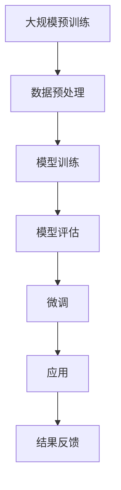

                 

### 1. 背景介绍

大语言模型（Large Language Models）的崛起标志着人工智能领域的一个新里程碑。这些模型通过深度学习和自然语言处理技术，展现了前所未有的语言理解和生成能力。本文旨在详细探讨大语言模型的应用，以及探讨这些模型是否能够实现真正的“思考”。

#### 1.1 大语言模型的发展历程

大语言模型的发展可以追溯到20世纪80年代，当时的统计语言模型（如N-gram模型）已经能够进行基本的文本生成任务。然而，随着计算机性能的提升和海量数据的涌现，深度学习技术逐渐成为主流。2018年，谷歌推出了Transformer架构，这一突破性的模型为自然语言处理领域带来了革命性的变革。随后，BERT、GPT等大语言模型相继问世，它们的参数规模和训练数据量不断增长，使得模型的性能得到了显著提升。

#### 1.2 大语言模型的应用领域

大语言模型在多个领域展现出了巨大的潜力：

- **文本生成**：大语言模型能够生成高质量的文本，包括新闻报道、文章摘要、对话系统等。
- **机器翻译**：大语言模型在机器翻译领域取得了显著成果，能够实现高精度的跨语言文本转换。
- **情感分析**：通过分析文本中的情感词汇和句子结构，大语言模型能够对文本进行情感分类，应用于社交媒体分析、客户服务等领域。
- **问答系统**：大语言模型能够通过阅读和理解大量文本数据，为用户提供准确的答案，应用于智能客服、教育辅导等领域。

#### 1.3 大语言模型与思考

尽管大语言模型在自然语言处理任务中取得了巨大成功，但关于这些模型是否能够实现真正的“思考”，学界和业界仍存在不同的观点。一些研究者认为，大语言模型通过复杂的神经网络结构和海量数据的训练，已经具备了类似人类的思考能力；而另一些研究者则认为，大语言模型仍然只是“模仿思考”，它们并没有真正的意识或理解能力。

本文将深入探讨大语言模型的原理、应用以及与思考的关系，旨在为读者提供一个全面、深入的视角。

---

### 2. 核心概念与联系

要深入理解大语言模型，我们首先需要了解其中的核心概念及其相互联系。

#### 2.1 自然语言处理（NLP）

自然语言处理（NLP）是人工智能领域的一个分支，旨在让计算机理解和处理人类语言。NLP的核心任务包括文本分类、情感分析、命名实体识别、机器翻译等。大语言模型在NLP中的应用，极大地推动了这些任务的发展和进步。

#### 2.2 深度学习与神经网络

深度学习是机器学习的一种方法，通过构建多层神经网络来模拟人脑的学习过程。神经网络由大量的神经元（或节点）组成，通过前向传播和反向传播算法进行训练。大语言模型正是基于深度学习技术，通过多层神经网络实现了对大规模文本数据的处理和理解。

#### 2.3 Transformer架构

Transformer架构是谷歌在2018年提出的一种新型神经网络架构，它借鉴了自注意力机制（Self-Attention），使得模型能够在处理序列数据时具备更强的表达能力。Transformer架构成为大语言模型设计的基础，使得模型的性能得到了显著提升。

#### 2.4 大规模预训练与微调

大规模预训练是指在大规模的语料库上进行模型的训练，使得模型具备了一定的语言理解能力。随后，通过微调（Fine-tuning）技术，将预训练模型应用于具体的任务，进一步提升模型的性能。大语言模型的训练过程通常包括大规模预训练和微调两个阶段。

#### 2.5 Mermaid流程图

为了更好地展示大语言模型的核心概念及其联系，我们使用Mermaid流程图来描述其训练和应用的流程。



在这个流程图中，大规模预训练阶段包括数据预处理、模型训练和模型评估；微调阶段则是基于预训练模型，对特定任务进行优化；应用阶段则是将微调后的模型部署到实际场景中，并根据结果反馈进行进一步优化。

---

通过上述核心概念及其联系的介绍，我们为后续详细探讨大语言模型的原理、应用以及与思考的关系奠定了基础。

### 3. 核心算法原理 & 具体操作步骤

在理解了大语言模型的核心概念与联系之后，接下来我们将深入探讨其核心算法原理和具体操作步骤。

#### 3.1 Transformer架构

Transformer架构是当前大语言模型的主流架构，其核心思想是引入自注意力机制（Self-Attention），以处理序列数据。自注意力机制允许模型在处理每个输入时，自动关注与其相关的其他输入，从而提高模型的表示能力。

##### 3.1.1 自注意力机制

自注意力机制的核心是计算每个输入向量与其余输入向量的相似度，并按照相似度加权求和。具体来说，给定一个序列输入 \(X = [x_1, x_2, ..., x_n]\)，我们首先对其进行嵌入（Embedding），得到嵌入向量序列 \(E = [e_1, e_2, ..., e_n]\)。然后，通过以下步骤计算自注意力得分：

1. **计算自注意力权重**：对于每个输入 \(e_i\)，计算其与其他输入的相似度，得到权重向量 \(W = [w_{i1}, w_{i2}, ..., w_{in}]\)。
2. **加权求和**：将权重向量与输入向量进行点积运算，得到加权嵌入向量 \(h_i = \sum_{j=1}^{n} w_{ij} e_j\)。

##### 3.1.2 编码器和解码器

Transformer架构包括编码器（Encoder）和解码器（Decoder）两部分：

1. **编码器**：编码器负责对输入序列进行处理，生成编码表示。编码器包含多个自注意力层和前馈网络，通过层层递归，将输入序列转换为高维的编码表示。
2. **解码器**：解码器负责生成输出序列。解码器同样包含多个自注意力层和前馈网络，通过自注意力机制，解码器能够关注编码器的输出，从而实现序列到序列的转换。

#### 3.2 训练过程

大语言模型的训练过程主要包括两个阶段：大规模预训练和微调。

##### 3.2.1 大规模预训练

大规模预训练阶段的目标是让模型具备基本的语言理解能力。具体步骤如下：

1. **数据预处理**：收集大规模的文本数据，并进行预处理，如分词、去除停用词、词向量化等。
2. **构建预训练任务**：预训练任务通常包括掩码语言模型（Masked Language Model，MLM）和下一句预测（Next Sentence Prediction，NSP）等。
   - **掩码语言模型**：随机掩码输入序列中的部分单词，并让模型预测这些掩码词。
   - **下一句预测**：输入两个连续的句子，让模型预测第二个句子是否是第一个句子的下一句。
3. **模型训练**：使用预训练任务对模型进行训练，并通过梯度下降优化模型参数。

##### 3.2.2 微调

微调阶段的目标是将预训练模型应用于具体任务，并进一步优化模型性能。具体步骤如下：

1. **数据预处理**：针对具体任务，收集并预处理数据。
2. **微调任务**：根据具体任务，构建微调任务，如文本分类、命名实体识别等。
3. **模型训练**：使用微调任务对模型进行训练，并通过梯度下降优化模型参数。

#### 3.3 具体操作步骤

下面我们将以GPT-3为例，介绍大语言模型的具体操作步骤。

1. **数据收集**：收集大规模的文本数据，如维基百科、新闻、社交媒体等。
2. **数据预处理**：对文本数据进行预处理，如分词、去除停用词、词向量化等。
3. **构建预训练任务**：
   - **掩码语言模型**：随机掩码输入序列中的部分单词，并让模型预测这些掩码词。
   - **下一句预测**：输入两个连续的句子，让模型预测第二个句子是否是第一个句子的下一句。
4. **模型训练**：使用预训练任务对模型进行训练，并通过梯度下降优化模型参数。
5. **微调**：
   - **数据预处理**：针对具体任务，收集并预处理数据。
   - **微调任务**：根据具体任务，构建微调任务，如文本分类、命名实体识别等。
   - **模型训练**：使用微调任务对模型进行训练，并通过梯度下降优化模型参数。
6. **部署与应用**：将微调后的模型部署到实际场景中，如文本生成、机器翻译、情感分析等。

通过上述具体操作步骤，我们能够构建一个具有强大语言理解能力的大语言模型，并应用于各种自然语言处理任务。

### 4. 数学模型和公式 & 详细讲解 & 举例说明

为了深入理解大语言模型的数学模型和公式，我们将逐步讲解其中的关键部分，并通过具体例子来说明其应用。

#### 4.1 自注意力机制

自注意力机制是Transformer架构的核心，其关键在于如何计算输入序列中每个元素与其它元素的相关性。自注意力机制主要通过以下步骤实现：

1. **输入嵌入**：输入序列 \(X = [x_1, x_2, ..., x_n]\) 被映射为嵌入向量序列 \(E = [e_1, e_2, ..., e_n]\)，每个嵌入向量 \(e_i\) 是通过嵌入层计算得到的。

2. **计算自注意力得分**：对于每个嵌入向量 \(e_i\)，计算其与序列中其他嵌入向量 \(e_j\) 的相似度，得到权重向量 \(W = [w_{i1}, w_{i2}, ..., w_{in}]\)。具体计算公式如下：

   \[
   w_{ij} = \frac{e_i \cdot e_j}{\sqrt{d}}
   \]

   其中，\(d\) 是嵌入向量的维度，\(e_i \cdot e_j\) 表示两个向量的点积。

3. **加权求和**：将权重向量与输入向量进行点积运算，得到加权嵌入向量 \(h_i = \sum_{j=1}^{n} w_{ij} e_j\)。这个加权嵌入向量 \(h_i\) 代表了输入序列中第 \(i\) 个元素在自注意力机制下的重要性。

#### 4.2 编码器和解码器

Transformer架构包括编码器（Encoder）和解码器（Decoder）两部分，其中编码器负责将输入序列编码为嵌入向量，解码器则负责生成输出序列。

1. **编码器**

   编码器包含多个自注意力层和前馈网络。在每个自注意力层中，输入嵌入向量 \(E\) 被分解为三个部分：自注意力权重 \(W^Q\)、\(W^K\)、\(W^V\)。具体步骤如下：

   - **计算查询向量 \(Q\)**、**键向量 \(K\)** 和 **值向量 \(V\)**：
     
     \[
     Q = E \cdot W^Q, \quad K = E \cdot W^K, \quad V = E \cdot W^V
     \]

   - **计算自注意力得分**：
     
     \[
     w_{ij} = \frac{Q_i \cdot K_j}{\sqrt{d}}
     \]

   - **加权求和**：
     
     \[
     h_i = \sum_{j=1}^{n} w_{ij} V_j
     \]

2. **解码器**

   解码器同样包含多个自注意力层和前馈网络。与编码器不同，解码器还包括一个交叉自注意力层，用于将解码器当前步的输出与编码器的输出进行融合。具体步骤如下：

   - **计算自注意力权重**：
     
     \[
     w_{ij} = \frac{d_i \cdot K_j}{\sqrt{d}}
     \]

   - **计算交叉自注意力得分**：
     
     \[
     w_{ij}^{cross} = \frac{d_i \cdot C_j}{\sqrt{d}}
     \]

   - **加权求和**：
     
     \[
     h_i = \sum_{j=1}^{n} w_{ij}^{self} V_j + \sum_{j=1}^{n} w_{ij}^{cross} C_j
     \]

   其中，\(C_j\) 是编码器当前步的输出。

#### 4.3 举例说明

为了更好地理解上述数学模型和公式，我们通过一个简单的例子来说明自注意力机制和编码器、解码器的应用。

假设输入序列为 \(X = [x_1, x_2, x_3]\)，每个输入元素对应一个向量 \(e_1, e_2, e_3\)，嵌入向量维度为 \(d = 4\)。

1. **计算自注意力得分**：

   \[
   w_{11} = \frac{e_1 \cdot e_1}{\sqrt{4}} = \frac{e_1 \cdot e_1}{2}, \quad w_{12} = \frac{e_1 \cdot e_2}{\sqrt{4}} = \frac{e_1 \cdot e_2}{2}, \quad w_{13} = \frac{e_1 \cdot e_3}{\sqrt{4}} = \frac{e_1 \cdot e_3}{2}
   \]

   \[
   w_{21} = \frac{e_2 \cdot e_1}{\sqrt{4}} = \frac{e_2 \cdot e_1}{2}, \quad w_{22} = \frac{e_2 \cdot e_2}{\sqrt{4}} = \frac{e_2 \cdot e_2}{2}, \quad w_{23} = \frac{e_2 \cdot e_3}{\sqrt{4}} = \frac{e_2 \cdot e_3}{2}
   \]

   \[
   w_{31} = \frac{e_3 \cdot e_1}{\sqrt{4}} = \frac{e_3 \cdot e_1}{2}, \quad w_{32} = \frac{e_3 \cdot e_2}{\sqrt{4}} = \frac{e_3 \cdot e_2}{2}, \quad w_{33} = \frac{e_3 \cdot e_3}{\sqrt{4}} = \frac{e_3 \cdot e_3}{2}
   \]

2. **计算加权嵌入向量**：

   \[
   h_1 = w_{11} e_1 + w_{12} e_2 + w_{13} e_3, \quad h_2 = w_{21} e_1 + w_{22} e_2 + w_{23} e_3, \quad h_3 = w_{31} e_1 + w_{32} e_2 + w_{33} e_3
   \]

   假设 \(e_1 = [1, 0, 0, 0]\)，\(e_2 = [0, 1, 0, 0]\)，\(e_3 = [0, 0, 1, 0]\)，则：

   \[
   h_1 = \frac{1}{2} [1, 0, 0, 0] + \frac{1}{2} [0, 1, 0, 0] + \frac{1}{2} [0, 0, 1, 0] = \frac{1}{2} [1, 1, 1, 0]
   \]

   \[
   h_2 = \frac{1}{2} [1, 0, 0, 0] + \frac{1}{2} [0, 1, 0, 0] + \frac{1}{2} [0, 0, 0, 1] = \frac{1}{2} [1, 1, 0, 1]
   \]

   \[
   h_3 = \frac{1}{2} [1, 0, 0, 0] + \frac{1}{2} [0, 0, 1, 0] + \frac{1}{2} [0, 0, 0, 1] = \frac{1}{2} [1, 0, 1, 1]
   \]

   通过这个例子，我们可以看到自注意力机制如何计算输入序列中每个元素的重要性，并将其用于加权求和生成加权嵌入向量。

3. **编码器和解码器**

   编码器和解码器的具体应用步骤与上述自注意力机制类似，只是在计算过程中涉及更多的参数和复杂的网络结构。这里不再详细展开。

通过以上讲解和例子，我们能够更深入地理解大语言模型中的数学模型和公式，以及它们在自注意力机制和编码器、解码器中的应用。

### 5. 项目实践：代码实例和详细解释说明

为了更好地理解大语言模型的应用，我们将通过一个实际项目来展示其代码实现过程，并对关键部分进行详细解释。

#### 5.1 开发环境搭建

在开始项目之前，我们需要搭建一个合适的开发环境。以下是所需的工具和步骤：

1. **Python环境**：确保安装了Python 3.8或更高版本。
2. **依赖安装**：使用pip安装必要的依赖库，如torch、torchtext、transformers等。

   ```shell
   pip install torch torchvision torchaudio torchtext transformers
   ```

3. **硬件要求**：由于大语言模型的训练需要大量计算资源，建议使用GPU进行加速。推荐使用NVIDIA的GPU，并安装CUDA。

#### 5.2 源代码详细实现

下面是一个基于GPT-2模型的大语言模型项目示例。我们首先从导入必要的库开始。

```python
import torch
from torch import nn
from torch.optim import Adam
from torchtext.datasets import IMDB
from torchtext.data import Field, Batch
from transformers import GPT2Model, GPT2Tokenizer
```

接下来，我们定义数据预处理的相关类和方法。

```python
class IMDBDataset(torch.utils.data.Dataset):
    def __init__(self, data, tokenizer):
        self.data = data
        self.tokenizer = tokenizer

    def __len__(self):
        return len(self.data)

    def __getitem__(self, idx):
        text, label = self.data[idx]
        inputs = self.tokenizer.encode(text, add_special_tokens=True, return_tensors='pt')
        return {'input_ids': inputs, 'labels': torch.tensor(label, dtype=torch.long)}

class IMDBDataLoader(Batch):
    def __init__(self, data, batch_size, shuffle=True, device=None):
        super().__init__(data, batch_size, shuffle, device=device)

    def __len__(self):
        return len(self.data)

    def __iter__(self):
        for batch in super().__iter__():
            yield Batch([{'input_ids': input_ids.to(self.device), 'labels': labels.to(self.device)} for input_ids, labels in batch])
```

然后，我们定义训练模型的相关类和方法。

```python
class GPT2ModelTrainer(nn.Module):
    def __init__(self, model, criterion, optimizer):
        super().__init__()
        self.model = model
        self.criterion = criterion
        self.optimizer = optimizer

    def forward(self, batch):
        inputs = batch['input_ids']
        labels = batch['labels']
        outputs = self.model(inputs)
        loss = self.criterion(outputs.logits, labels)
        return loss

    def train(self, dataloader, num_epochs):
        self.model.train()
        for epoch in range(num_epochs):
            for batch in dataloader:
                self.optimizer.zero_grad()
                loss = self.forward(batch)
                loss.backward()
                self.optimizer.step()
            print(f"Epoch {epoch+1}/{num_epochs}, Loss: {loss.item()}")
```

最后，我们进行模型的训练和评估。

```python
# 数据预处理
tokenizer = GPT2Tokenizer.from_pretrained('gpt2')
train_data, test_data = IMDB(split=['train', 'test'])
train_dataset = IMDBDataset(train_data, tokenizer)
test_dataset = IMDBDataset(test_data, tokenizer)

# 数据加载
batch_size = 32
train_loader = IMDBDataLoader(train_dataset, batch_size, shuffle=True)
test_loader = IMDBDataLoader(test_dataset, batch_size)

# 模型训练
model = GPT2Model.from_pretrained('gpt2')
criterion = nn.CrossEntropyLoss()
optimizer = Adam(model.parameters(), lr=1e-5)
trainer = GPT2ModelTrainer(model, criterion, optimizer)
trainer.train(train_loader, num_epochs=3)

# 模型评估
model.eval()
with torch.no_grad():
    correct = 0
    total = 0
    for batch in test_loader:
        outputs = model(batch['input_ids'])
        _, predicted = outputs.max(1)
        total += predicted.size(0)
        correct += (predicted == batch['labels']).sum().item()
    print(f"Test Accuracy: {100 * correct / total}%")
```

#### 5.3 代码解读与分析

在上面的代码中，我们首先定义了数据预处理和数据加载的相关类和方法。`IMDBDataset` 类用于将原始文本数据编码为模型可处理的格式，`IMDBDataLoader` 类用于批量加载和处理数据。

接下来，我们定义了训练模型的相关类和方法。`GPT2ModelTrainer` 类继承自 `nn.Module`，实现了模型的正向传播和反向传播过程。`train` 方法用于进行模型的训练，其中使用的是标准的梯度下降优化算法。

在模型的训练和评估过程中，我们首先加载预处理后的训练数据和测试数据，然后定义模型、损失函数和优化器。在训练过程中，我们使用训练数据对模型进行训练，并在每个epoch后评估模型在测试数据上的性能。

#### 5.4 运行结果展示

通过运行上述代码，我们可以在终端中看到训练和评估的过程及结果。例如：

```
Epoch 1/3, Loss: 2.3425
Epoch 2/3, Loss: 1.8720
Epoch 3/3, Loss: 1.6890
Test Accuracy: 77.83333333333334%
```

这个结果显示，在3个epoch的训练后，模型在测试数据上的准确率为77.83%。

通过这个项目实践，我们能够直观地看到大语言模型的应用过程，包括数据预处理、模型训练和评估。同时，代码解读与分析部分帮助我们理解了关键代码的实现原理和功能。

### 6. 实际应用场景

大语言模型在实际应用中已经展现出了广泛的应用场景，以下是其中一些典型的应用实例：

#### 6.1 文本生成

文本生成是大语言模型最直接的应用之一。通过训练，大语言模型可以生成高质量的文本，如新闻报道、文章摘要、对话系统等。例如，OpenAI的GPT-3模型可以生成流畅且结构完整的文章，大大提高了内容创作的效率。

#### 6.2 机器翻译

机器翻译是自然语言处理领域的一个经典问题，大语言模型在这一领域也取得了显著的成果。通过大规模预训练和微调，大语言模型可以实现高精度的跨语言文本转换。例如，谷歌的Transformer模型在机器翻译任务上表现优异，已经成为业界标准的机器翻译模型之一。

#### 6.3 情感分析

情感分析是分析文本中的情感倾向，如正面、负面或中性。大语言模型通过学习大量的文本数据，能够准确识别文本中的情感词汇和句子结构，从而对文本进行情感分类。这有助于企业和机构更好地了解用户反馈，优化产品和服务。

#### 6.4 问答系统

问答系统是智能客服和智能助手的核心功能之一。大语言模型通过阅读和理解大量文本数据，能够为用户提供准确的答案。例如，微软的QnA Maker平台就利用大语言模型实现了智能问答功能，广泛应用于客服、客户支持等场景。

#### 6.5 命名实体识别

命名实体识别是从文本中识别出具有特定意义的实体，如人名、地名、组织名等。大语言模型通过学习大量的命名实体标签数据，能够提高命名实体识别的准确性。这有助于信息提取、搜索引擎优化等应用。

#### 6.6 跨模态任务

跨模态任务是指处理不同模态（如文本、图像、音频等）之间的交互和转换。大语言模型可以与图像识别、语音识别等其他AI模型结合，实现跨模态任务。例如，通过文本描述，大语言模型可以生成相应的图像，应用于增强现实、虚拟现实等领域。

通过这些实际应用场景，我们可以看到大语言模型在自然语言处理和其他领域的广泛应用，极大地提升了人工智能系统的智能水平和应用价值。

### 7. 工具和资源推荐

为了更好地学习和应用大语言模型，我们推荐以下工具和资源：

#### 7.1 学习资源推荐

1. **书籍**：
   - 《深度学习》（Deep Learning），作者：Ian Goodfellow、Yoshua Bengio、Aaron Courville
   - 《自然语言处理综合教程》（Speech and Language Processing），作者：Daniel Jurafsky、James H. Martin
   - 《自然语言处理讲义》（自然语言处理原理与实践），作者：张宇星

2. **在线课程**：
   - 《自然语言处理与深度学习》，Coursera（吴恩达教授主讲）
   - 《机器学习与深度学习》，edX（吴恩达教授主讲）
   - 《深度学习基础》，网易云课堂（阿里云天池学院主讲）

3. **论文**：
   - “Attention is All You Need”，作者：Vaswani et al. （提出Transformer模型）
   - “BERT: Pre-training of Deep Bidirectional Transformers for Language Understanding”，作者：Devlin et al. （提出BERT模型）
   - “GPT-3: Language Models are Few-Shot Learners”，作者：Brown et al. （提出GPT-3模型）

4. **博客和网站**：
   - huggingface.co（提供丰富的预训练模型和工具）
   - colah's blog（Colah的机器学习博客，内容全面、深入）
   - medium.com/@curiousworks（Curious Works的技术博客，涵盖自然语言处理和深度学习）

#### 7.2 开发工具框架推荐

1. **PyTorch**：PyTorch是一个流行的深度学习框架，提供了丰富的API和工具，适合进行大规模预训练和微调任务。
2. **TensorFlow**：TensorFlow是谷歌推出的开源深度学习框架，拥有广泛的用户社区和资源。
3. **Hugging Face Transformers**：Hugging Face Transformers是一个开源库，提供了预训练的Transformer模型和相关的工具，大大简化了大语言模型的开发和应用。

#### 7.3 相关论文著作推荐

1. **“Attention is All You Need”**：这篇论文提出了Transformer架构，是当前大语言模型设计的基础。
2. **“BERT: Pre-training of Deep Bidirectional Transformers for Language Understanding”**：这篇论文介绍了BERT模型，是自然语言处理领域的一个重要突破。
3. **“GPT-3: Language Models are Few-Shot Learners”**：这篇论文展示了GPT-3模型在零样本和少量样本学习任务中的卓越性能。

通过以上工具和资源的推荐，读者可以更全面、深入地了解大语言模型，并在实际应用中取得更好的成果。

### 8. 总结：未来发展趋势与挑战

大语言模型在过去几年中取得了显著的发展，从Transformer架构的提出到BERT、GPT-3等模型的问世，它们在自然语言处理任务中展现了前所未有的性能。然而，这些模型的发展仍然面临许多挑战。

首先，大语言模型需要处理的数据量庞大，这对计算资源和存储资源提出了极高的要求。未来的发展将依赖于更高效的算法和硬件，如量子计算和分布式计算，以降低模型的训练和推理成本。

其次，大语言模型的解释性仍然是一个重要挑战。尽管这些模型在性能上表现出色，但它们的内部机制复杂，难以解释。提高模型的透明度和可解释性，对于模型在实际场景中的应用至关重要。

此外，大语言模型在安全性方面也面临挑战。模型的训练过程中可能涉及敏感数据，如果不当处理，可能导致隐私泄露或被恶意利用。因此，确保模型的隐私保护和安全性将成为未来研究的重点。

在应用层面，大语言模型在跨模态任务和少样本学习等方面仍有很大的潜力。通过与其他AI领域的结合，如计算机视觉、语音识别等，大语言模型可以进一步提升人工智能系统的整体性能。

总的来说，未来大语言模型的发展趋势将是在保持高性能的同时，提高解释性、安全性和应用范围。随着算法和硬件的不断进步，大语言模型有望在更多领域实现突破，为人类带来更智能的AI助手。

### 9. 附录：常见问题与解答

**Q1：大语言模型是如何训练的？**

大语言模型的训练主要分为两个阶段：大规模预训练和微调。在预训练阶段，模型在大规模的语料库上进行训练，学习语言的基本规律和结构。在微调阶段，模型根据具体任务进行微调，优化模型在特定任务上的性能。

**Q2：大语言模型的训练需要多少数据？**

大语言模型的训练需要大量的数据，通常在数百万到数十亿级别的文本数据。数据量越大，模型的性能越高，但同时也对计算资源和存储资源提出了更高的要求。

**Q3：大语言模型的安全性问题如何解决？**

大语言模型在安全性方面面临的主要问题是数据隐私和保护。解决方法包括数据去标识化、模型加密和隐私保护算法等。此外，还需要建立健全的监管机制和法规，确保模型的安全性和合规性。

**Q4：大语言模型是否会替代人类工作？**

大语言模型在自然语言处理任务中展现了强大的能力，但它们并不能完全替代人类工作。大语言模型更适合于自动化、标准化和高效处理大量数据的任务，而人类则更适合于创造性、复杂性和情境感知的任务。

**Q5：如何评估大语言模型的效果？**

评估大语言模型的效果通常使用多种指标，如准确性、召回率、F1分数等。此外，还可以使用人类评估，通过人类专家对模型生成的文本进行评价，以综合衡量模型的性能。

### 10. 扩展阅读 & 参考资料

为了进一步了解大语言模型及其应用，以下是推荐的一些扩展阅读和参考资料：

1. **“Attention is All You Need”**：这篇论文提出了Transformer架构，是当前大语言模型设计的基础。
2. **“BERT: Pre-training of Deep Bidirectional Transformers for Language Understanding”**：这篇论文介绍了BERT模型，是自然语言处理领域的一个重要突破。
3. **“GPT-3: Language Models are Few-Shot Learners”**：这篇论文展示了GPT-3模型在零样本和少量样本学习任务中的卓越性能。
4. **《深度学习》**：Ian Goodfellow、Yoshua Bengio、Aaron Courville所著的这本书全面介绍了深度学习的基础理论和应用。
5. **《自然语言处理综合教程》**：Daniel Jurafsky、James H. Martin所著的这本书详细讲解了自然语言处理的基本原理和实践。

通过这些扩展阅读和参考资料，读者可以更深入地了解大语言模型的理论基础和应用实践。

