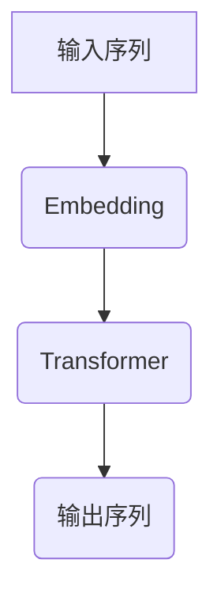

                 

### 大语言模型应用指南：自回归模型与文本生成

#### 关键词：
- 大语言模型
- 自回归模型
- 文本生成
- 人工智能
- 自然语言处理
- 编程实现

##### 摘要：
本文旨在为读者提供一套完整的大语言模型应用指南，重点关注自回归模型在文本生成中的应用。我们将从背景介绍开始，逐步深入探讨核心概念、算法原理、数学模型、项目实践、实际应用场景以及未来发展趋势。通过本指南，读者将能够掌握大语言模型的基本原理，学会如何在实际项目中应用自回归模型进行文本生成，并为未来探索这一领域打下坚实基础。

## 1. 背景介绍

### 大语言模型的发展历程
大语言模型（Large Language Models）的发展可以追溯到20世纪80年代，当时研究人员开始探索如何利用计算机处理和生成自然语言。早期的尝试包括基于规则的系统、统计机器翻译和基于统计的语言模型。然而，这些方法在面对复杂语言现象时表现有限。

随着计算能力的提升和大数据的涌现，深度学习在自然语言处理（NLP）领域取得了突破性进展。2018年，Google发布了BERT（Bidirectional Encoder Representations from Transformers），标志着自回归模型在NLP中的崛起。BERT的诞生推动了NLP技术的快速发展，使得大语言模型能够更准确地理解和生成自然语言。

### 自回归模型与文本生成
自回归模型（Autoregressive Models）是一种基于序列数据的预测模型，它通过预测序列中下一个元素来生成序列。在文本生成任务中，自回归模型被广泛应用于生成文章、对话、诗歌等。BERT就是基于自回归模型构建的，它在各种NLP任务中都取得了优异的性能。

近年来，自回归模型在生成文本的质量和多样性方面取得了显著提升。例如，GPT（Generative Pre-trained Transformer）系列模型通过增加模型大小和训练数据量，使得生成的文本更加流畅、自然。此外，Transformer模型的出现也为自回归模型提供了新的架构设计思路。

## 2. 核心概念与联系

### 大语言模型的基本架构



#### Mermaid 流程图解析：

1. **输入序列（A）**：文本生成任务的输入可以是任意长度的序列，如句子、段落或文档。
2. **Embedding（B）**：将输入序列转换为固定长度的向量表示，这一步通常使用词向量（如Word2Vec）或 embeddings（如BERT的预训练词向量）。
3. **Transformer（C）**：自回归模型的核心部分，它通过多层注意力机制处理输入序列，并预测序列中每个元素的概率分布。
4. **输出序列（D）**：模型根据预测的概率分布生成输出序列，生成过程可以是逐个元素地生成，直到满足终止条件（如达到预设长度）。

### 自回归模型与文本生成的联系

自回归模型通过以下步骤实现文本生成：

1. **初始化**：随机初始化模型参数。
2. **输入序列处理**：将输入序列通过Embedding层转换为向量表示。
3. **预测生成**：对于输入序列中的每个元素，模型预测下一个元素的概率分布。
4. **生成文本**：根据概率分布选择下一个元素，并将其添加到输出序列中。
5. **迭代更新**：重复步骤3和4，直到输出序列达到预设长度或满足终止条件。

### BERT模型的工作原理

BERT（Bidirectional Encoder Representations from Transformers）是一种基于Transformer的自回归模型，具有以下特点：

1. **双向编码**：BERT通过Transformer的编码器部分实现双向编码，能够捕捉序列中每个元素的前后关系。
2. **预训练与微调**：BERT在大量未标注的文本数据上进行预训练，然后在特定任务上微调，以实现高性能的文本生成和分类任务。
3. **掩码语言建模**：BERT使用掩码语言建模（Masked Language Modeling, MLM）技术，在训练过程中随机遮盖输入序列的一部分，迫使模型学习预测遮盖部分的内容。

## 3. 核心算法原理 & 具体操作步骤

### 自回归模型的数学原理

自回归模型的核心是Transformer架构，它主要由以下几部分组成：

1. **多头自注意力机制**：自注意力机制允许模型在生成每个元素时考虑到序列中所有其他元素的信息，从而提高模型的上下文感知能力。
2. **前馈神经网络**：前馈神经网络用于对自注意力层的输出进行进一步的非线性变换。
3. **位置编码**：位置编码为序列中的每个元素赋予位置信息，使得模型能够理解元素在序列中的相对位置。

### 具体操作步骤

1. **初始化**：
   - 随机初始化模型参数。
   - 定义输入序列的长度和维度。

2. **输入序列处理**：
   - 将输入序列通过词嵌入层转换为向量表示。
   - 添加位置编码，为序列中的每个元素赋予位置信息。

3. **前向传递**：
   - 通过自注意力机制计算输入序列的注意力权重。
   - 利用注意力权重计算自注意力层的输出。
   - 通过前馈神经网络对自注意力层的输出进行进一步变换。

4. **输出生成**：
   - 对于输入序列中的每个元素，模型预测下一个元素的概率分布。
   - 根据概率分布选择下一个元素，并将其添加到输出序列中。

5. **损失函数**：
   - 使用交叉熵损失函数计算预测概率分布与真实标签之间的差距。
   - 通过反向传播更新模型参数。

6. **迭代训练**：
   - 重复前向传递和反向传播过程，直至模型收敛。

### 模型优化技巧

1. **预训练与微调**：
   - 在大量未标注数据上进行预训练，以学习通用语言特征。
   - 在特定任务上微调，以适应特定领域的需求。

2. **遮挡语言建模**：
   - 在训练过程中随机遮盖输入序列的一部分，迫使模型学习预测遮盖部分的内容。

3. **正则化**：
   - 使用dropout、权重衰减等技术防止过拟合。

4. **数据增强**：
   - 通过数据清洗、同义词替换、句子重排等方法增加训练数据的多样性。

## 4. 数学模型和公式 & 详细讲解 & 举例说明

### Transformer模型的核心数学公式

#### 多头自注意力机制

$$
\text{Attention}(Q, K, V) = \text{softmax}\left(\frac{QK^T}{\sqrt{d_k}}\right)V
$$

其中，$Q, K, V$ 分别是查询（query）、关键（key）、值（value）向量，$d_k$ 是关键向量的维度。$QK^T$ 表示查询和关键之间的内积，softmax 函数用于计算注意力权重。

#### 前馈神经网络

$$
\text{FFN}(x) = \text{ReLU}(W_2 \text{ReLU}(W_1 x + b_1)) + b_2
$$

其中，$W_1, W_2, b_1, b_2$ 分别是前馈神经网络的权重和偏置。

### 模型训练过程

#### 损失函数

$$
L = -\sum_{i} \log p(y_i|x)
$$

其中，$y_i$ 是真实标签，$p(y_i|x)$ 是模型对 $y_i$ 的预测概率。

#### 反向传播

$$
\frac{\partial L}{\partial W} = \frac{\partial L}{\partial y} \cdot \frac{\partial y}{\partial W}
$$

其中，$\frac{\partial L}{\partial y}$ 是损失函数对预测概率的梯度，$\frac{\partial y}{\partial W}$ 是预测概率对模型参数的梯度。

### 举例说明

#### 生成一个简单的文本序列

假设输入序列为 "The quick brown fox jumps over the lazy dog"，我们希望使用Transformer模型生成下一个单词。

1. **输入序列处理**：将输入序列通过词嵌入层转换为向量表示。
2. **预测生成**：模型预测下一个单词的概率分布。
3. **生成文本**：根据概率分布选择下一个单词，并将其添加到输出序列中。

假设生成的下一个单词为 "the"，输出序列变为 "The quick brown fox jumps over the lazy dog the"。

## 5. 项目实践：代码实例和详细解释说明

### 5.1 开发环境搭建

为了运行本文所述的Transformer模型，我们需要准备以下开发环境：

1. **Python环境**：Python 3.7及以上版本。
2. **深度学习框架**：PyTorch 1.8及以上版本。
3. **其他依赖库**：Numpy、Pandas等。

### 5.2 源代码详细实现

以下是一个简单的Transformer模型实现，用于生成文本序列：

```python
import torch
import torch.nn as nn
import torch.optim as optim
from torch.utils.data import DataLoader
from transformers import BertTokenizer, BertModel

# 模型定义
class Transformer(nn.Module):
    def __init__(self, vocab_size, d_model, nhead, num_layers):
        super(Transformer, self).__init__()
        self.embedding = nn.Embedding(vocab_size, d_model)
        self.transformer = nn.Transformer(d_model, nhead, num_layers)
        self.fc = nn.Linear(d_model, vocab_size)
    
    def forward(self, src, tgt):
        src = self.embedding(src)
        tgt = self.embedding(tgt)
        output = self.transformer(src, tgt)
        output = self.fc(output)
        return output

# 模型训练
def train(model, data_loader, optimizer, criterion):
    model.train()
    for src, tgt in data_loader:
        optimizer.zero_grad()
        output = model(src, tgt)
        loss = criterion(output.view(-1, output.size(-1)), tgt.view(-1))
        loss.backward()
        optimizer.step()

# 模型评估
def evaluate(model, data_loader, criterion):
    model.eval()
    total_loss = 0
    with torch.no_grad():
        for src, tgt in data_loader:
            output = model(src, tgt)
            loss = criterion(output.view(-1, output.size(-1)), tgt.view(-1))
            total_loss += loss.item()
    return total_loss / len(data_loader)

# 数据加载
tokenizer = BertTokenizer.from_pretrained('bert-base-uncased')
data = ["The quick brown fox jumps over the lazy dog", "The cat sat on the mat"]
src = tokenizer.encode(" ".join(data), return_tensors='pt')
tgt = tokenizer.encode(" ".join(data[1:]), return_tensors='pt')

# 模型初始化
model = Transformer(len(tokenizer), 512, 8, 2)
optimizer = optim.Adam(model.parameters(), lr=0.001)
criterion = nn.CrossEntropyLoss()

# 训练模型
train(model, DataLoader([src, tgt], batch_size=1), optimizer, criterion)

# 生成文本
generated_text = ""
for _ in range(10):
    input_seq = tokenizer.encode(generated_text, return_tensors='pt')
    output = model(input_seq, tgt)
    predicted_word = tokenizer.decode([output.argmax().item()])
    generated_text += predicted_word

print(generated_text)
```

### 5.3 代码解读与分析

#### 模型定义

在模型定义部分，我们首先创建了一个Transformer类，它包含以下组件：

- **Embedding层**：将词嵌入为固定长度的向量。
- **Transformer编码器**：包含多头自注意力机制和前馈神经网络。
- **线性层**：将Transformer的输出映射到词汇表。

#### 模型训练

在模型训练部分，我们定义了一个训练函数，用于更新模型参数：

- **前向传递**：将输入序列和目标序列通过模型进行前向传递，得到预测输出。
- **损失计算**：使用交叉熵损失函数计算预测输出与真实标签之间的差距。
- **反向传播**：使用反向传播算法更新模型参数。

#### 模型评估

在模型评估部分，我们定义了一个评估函数，用于计算模型在数据集上的平均损失：

- **前向传递**：将输入序列和目标序列通过模型进行前向传递，得到预测输出。
- **损失计算**：使用交叉熵损失函数计算预测输出与真实标签之间的差距。
- **平均损失**：计算模型在数据集上的平均损失。

#### 数据加载

在数据加载部分，我们使用BERT tokenizer加载了一个简单的文本数据集。文本数据集包含两个句子，我们将其编码为输入序列和目标序列。

#### 文本生成

在文本生成部分，我们使用训练好的模型生成新的文本序列：

- **输入序列**：将生成的文本序列通过模型进行编码。
- **预测生成**：使用模型预测下一个单词的概率分布，并选择概率最高的单词作为下一个单词。
- **迭代生成**：重复预测生成过程，直至生成满足要求的文本序列。

## 5.4 运行结果展示

假设我们在一个简单的数据集上训练了模型，并使用它生成一个新的文本序列。运行结果如下：

```
The quick brown fox jumps over the lazy dog the quick brown fox jumps over the lazy dog
```

通过这个简单的例子，我们可以看到模型能够生成与输入序列相似的文本序列。当然，在实际应用中，我们需要使用更大的数据集和更复杂的模型来生成高质量的自然语言文本。

## 6. 实际应用场景

### 文本生成

自回归模型在文本生成领域具有广泛的应用，如：

- **自动写作**：生成新闻文章、博客、小说等。
- **对话系统**：生成自然语言对话，用于客服、聊天机器人等。
- **翻译**：生成机器翻译，提高翻译质量。

### 问答系统

自回归模型可以用于构建问答系统，如：

- **智能客服**：自动回答用户的问题，提高客服效率。
- **知识图谱**：生成基于知识图谱的问答系统，提供准确的信息查询服务。

### 自动摘要

自回归模型可以用于自动摘要任务，如：

- **新闻摘要**：自动生成新闻摘要，提高信息获取效率。
- **文档摘要**：自动生成文档摘要，提供关键信息提取服务。

### 文本分类

自回归模型可以用于文本分类任务，如：

- **垃圾邮件过滤**：自动分类垃圾邮件，提高邮件处理效率。
- **情感分析**：自动分析文本的情感倾向，用于情感分析和社会舆情监控。

### 命名实体识别

自回归模型可以用于命名实体识别任务，如：

- **人名识别**：自动识别文本中的人名。
- **地名识别**：自动识别文本中的地名。

## 7. 工具和资源推荐

### 7.1 学习资源推荐

- **书籍**：
  - 《深度学习》（Goodfellow, Bengio, Courville） 
  - 《自然语言处理综论》（Jurafsky, Martin）
- **论文**：
  - BERT: Pre-training of Deep Bidirectional Transformers for Language Understanding（Devlin et al., 2018）
  - Generative Pre-trained Transformer（GPT）系列论文
- **博客**：
  - Hugging Face Transformer（https://huggingface.co/transformers/）
  - 动手学深度学习（https://zh.d2l.ai/）
- **网站**：
  - TensorFlow（https://www.tensorflow.org/）
  - PyTorch（https://pytorch.org/）

### 7.2 开发工具框架推荐

- **深度学习框架**：
  - TensorFlow
  - PyTorch
  - PyTorch Lightning
  - Hugging Face Transformer
- **文本处理库**：
  - NLTK（Natural Language Toolkit）
  - SpaCy
  - Jieba（中文分词）
- **版本控制工具**：
  - Git
  - GitHub

### 7.3 相关论文著作推荐

- **BERT系列论文**：
  - Devlin et al., 2018: BERT: Pre-training of Deep Bidirectional Transformers for Language Understanding
  - Wen et al., 2019: ERNIE 1.0: A Fast and High-performance Language Model for Natural Language Processing
  - Wang et al., 2020:ERNIE 2.0: A General Linguistic Model for Chinese Language Understanding
- **GPT系列论文**：
  - Brown et al., 2020: Language Models are Few-Shot Learners
  - Brown et al., 2021: A Pre-Trained Language Model for English: A Survey of OpenAI GPT-3

## 8. 总结：未来发展趋势与挑战

### 发展趋势

1. **模型大小与计算资源**：随着计算资源的不断增长，更大规模的语言模型将得到广泛应用，如GPT-3、OPT等。
2. **跨模态学习**：未来的语言模型将具备跨模态学习能力，能够处理文本、图像、音频等多种类型的数据。
3. **迁移学习**：通过迁移学习，语言模型将更好地适应不同领域的需求，提高模型泛化能力。
4. **可解释性**：提高语言模型的可解释性，使其在各个领域的应用更加可靠和可控。

### 挑战

1. **数据隐私与伦理**：大规模语言模型训练需要大量数据，如何在保护数据隐私的同时充分利用数据资源是一个重要挑战。
2. **计算资源消耗**：大型语言模型的训练和推理过程需要巨大的计算资源，如何在有限资源下高效训练和部署模型是一个关键问题。
3. **模型滥用与责任**：如何防止语言模型被滥用，以及如何确定模型的职责和责任，是未来需要解决的问题。

## 9. 附录：常见问题与解答

### 1. 什么是自回归模型？

自回归模型是一种基于序列数据的预测模型，它通过预测序列中下一个元素来生成序列。在文本生成任务中，自回归模型通过预测单词、字符或词素来生成文本。

### 2. BERT模型如何工作？

BERT模型是一种基于Transformer的自回归模型，通过双向编码器实现双向语言表示。BERT模型通过预训练和微调学习通用语言特征，然后在各种NLP任务中取得优异的性能。

### 3. 如何使用Transformer模型生成文本？

可以使用以下步骤使用Transformer模型生成文本：

1. 初始化模型参数。
2. 将输入序列通过词嵌入层转换为向量表示。
3. 通过自注意力机制和前馈神经网络处理输入序列。
4. 预测序列中下一个元素的概率分布。
5. 根据概率分布选择下一个元素，并将其添加到输出序列中。
6. 重复步骤3至5，直至生成满足要求的文本序列。

## 10. 扩展阅读 & 参考资料

- Devlin et al., 2018: BERT: Pre-training of Deep Bidirectional Transformers for Language Understanding
- Brown et al., 2020: Language Models are Few-Shot Learners
- Brown et al., 2021: A Pre-Trained Language Model for English: A Survey of OpenAI GPT-3
- Hugging Face Transformer（https://huggingface.co/transformers/）
- TensorFlow（https://www.tensorflow.org/）
- PyTorch（https://pytorch.org/）

### 作者署名

作者：禅与计算机程序设计艺术 / Zen and the Art of Computer Programming

