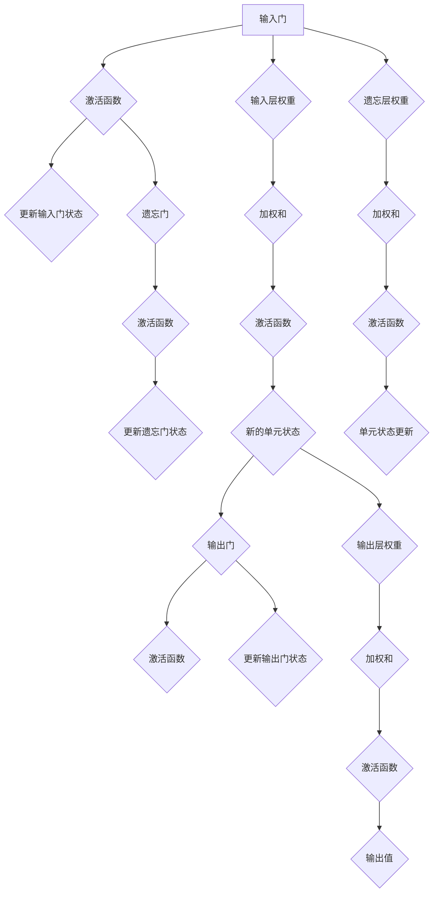

                 

## 大语言模型应用指南：长短期记忆

### 关键词 Keywords

- 大语言模型
- 长短期记忆
- 自然语言处理
- 递归神经网络
- 状态转移矩阵
- LSTM单元
- 应用实例
- 实践指南

### 摘要 Abstract

本文旨在深入探讨大语言模型中的长短期记忆（LSTM）机制，并详细介绍其在自然语言处理（NLP）中的应用。通过对LSTM核心概念、算法原理以及实际操作步骤的详细讲解，读者将能够理解LSTM在解决长期依赖问题方面的优势，并掌握如何在实际项目中应用这一重要技术。文章还将提供开发环境搭建、源代码实现及分析、运行结果展示等实践内容，帮助读者将理论知识转化为实际操作能力。最后，文章将探讨LSTM在实际应用场景中的表现，推荐相关学习资源和开发工具，并对未来发展趋势与挑战进行展望。

## 1. 背景介绍

### 自然语言处理（NLP）的挑战

自然语言处理是人工智能领域的一个重要分支，其目标是让计算机理解和生成人类语言。在过去的几十年中，尽管NLP取得了显著的进展，但仍然面临着许多挑战。其中最突出的问题是长期依赖问题（Long-term Dependency）。在语言中，一个词的意义往往依赖于其先前的上下文信息。例如，在句子“Eating is cheaper than drinking.”中，如果上下文中没有提到价格，我们很难确定“cheaper”是指食物便宜还是饮料便宜。这就要求模型能够记住较远的上下文信息，以正确理解句子。

### 递归神经网络（RNN）与长期依赖问题

递归神经网络（RNN）是一种能够处理序列数据的神经网络架构，特别适合于NLP任务。RNN通过在序列中递归地应用相同的神经网络函数来处理数据，这使得模型能够记住先前的信息。然而，传统的RNN在处理长期依赖问题时存在一个著名的缺陷——梯度消失或梯度爆炸问题。这个问题导致在训练过程中，远期的信息无法有效地传递到网络的后续层，使得模型难以学习长期依赖关系。

### 长短期记忆（LSTM）的提出

为了克服RNN的长期依赖问题，Hochreiter和Schmidhuber在1997年提出了长短期记忆（LSTM）网络。LSTM是一种特殊的RNN结构，通过引入门控机制，能够在不同时间尺度上灵活地控制信息的流动。这使得LSTM在处理长期依赖问题时表现出色，成为NLP领域的一种关键技术。

## 2. 核心概念与联系

### LSTM单元的工作原理

LSTM单元的核心思想是通过三个门控单元（输入门、遗忘门和输出门）来控制信息的流动，从而有效地解决长期依赖问题。

1. **输入门（Input Gate）**：输入门决定哪些信息需要更新到单元状态。
2. **遗忘门（Forget Gate）**：遗忘门决定哪些旧信息需要从单元状态中删除。
3. **输出门（Output Gate）**：输出门决定当前单元状态应该输出哪些信息。

每个门都通过一个sigmoid激活函数控制，其输出范围在0到1之间，表示信息保留的概率。通过这些门控机制，LSTM单元能够在不同的时间尺度上灵活地控制信息的保留和更新。

### LSTM的Mermaid流程图

下面是LSTM单元的Mermaid流程图，详细展示了输入门、遗忘门和输出门的工作过程。



### LSTM在NLP中的应用

LSTM不仅在处理长期依赖问题上表现出色，还在多种NLP任务中得到了广泛应用。以下是一些典型的应用场景：

1. **文本分类**：LSTM可以用来对文本进行分类，如情感分析、新闻分类等。
2. **序列到序列学习**：LSTM常用于机器翻译、对话系统等序列到序列学习任务。
3. **语音识别**：LSTM可以用来处理语音信号的时间序列数据，实现高效的语音识别。
4. **语言生成**：LSTM可以生成具有连贯性和上下文意义的文本。

### LSTM与其他NLP技术的关系

LSTM虽然是解决长期依赖问题的一种重要技术，但在NLP领域中，它并不是唯一的解决方案。其他一些技术，如双向循环神经网络（BiRNN）和Transformer，也在不同场景中表现出色。BiRNN通过同时考虑过去和未来的信息来增强模型的能力，而Transformer引入了自注意力机制，使得模型能够更好地捕捉长距离依赖。

然而，LSTM在处理顺序依赖性较强的任务时仍然具有显著的优势，尤其是在需要保持上下文一致性和连续性的应用场景中。

## 3. 核心算法原理 & 具体操作步骤

### LSTM单元的数学模型

为了深入理解LSTM单元的工作原理，我们首先需要介绍其数学模型。LSTM单元包含以下关键组件：

1. **输入门（Input Gate）**：
    - 输入门决定哪些信息需要更新到单元状态。其计算公式为：
    \[
    i_t = \sigma(W_{xi}x_t + W_{hi}h_{t-1} + b_i)
    \]
    其中，\(i_t\) 表示输入门的激活值，\(W_{xi}\) 和 \(W_{hi}\) 分别是输入和隐藏状态的权重矩阵，\(b_i\) 是偏置项，\(\sigma\) 是sigmoid激活函数。

2. **遗忘门（Forget Gate）**：
    - 遗忘门决定哪些旧信息需要从单元状态中删除。其计算公式为：
    \[
    f_t = \sigma(W_{xf}x_t + W_{hf}h_{t-1} + b_f)
    \]
    其中，\(f_t\) 表示遗忘门的激活值。

3. **输出门（Output Gate）**：
    - 输出门决定当前单元状态应该输出哪些信息。其计算公式为：
    \[
    o_t = \sigma(W_{xo}x_t + W_{ho}h_{t-1} + b_o)
    \]
    其中，\(o_t\) 表示输出门的激活值。

4. **单元状态（Cell State）**：
    - 单元状态是LSTM的核心，它用于传递和存储信息。其计算公式为：
    \[
    C_t = f_t \odot C_{t-1} + i_t \odot \sigma(W_{xc}x_t + W_{hc}h_{t-1} + b_c)
    \]
    其中，\(\odot\) 表示逐元素乘积，\(C_{t-1}\) 是上一时刻的单元状态，\(C_t\) 是当前时刻的单元状态。

5. **隐藏状态（Hidden State）**：
    - 隐藏状态是LSTM单元的输出，它反映了当前时刻的信息。其计算公式为：
    \[
    h_t = o_t \odot \tanh(C_t)
    \]
    其中，\(h_t\) 是当前时刻的隐藏状态。

### LSTM单元的具体操作步骤

1. **输入门的计算**：
    - 首先，计算输入门激活值 \(i_t\)，根据公式 \(i_t = \sigma(W_{xi}x_t + W_{hi}h_{t-1} + b_i)\)。
    - 然后，计算输入门的加权和 \(i_{\text{weighted}} = W_{xi}x_t + W_{hi}h_{t-1} + b_i\)。

2. **遗忘门的计算**：
    - 计算遗忘门激活值 \(f_t\)，根据公式 \(f_t = \sigma(W_{xf}x_t + W_{hf}h_{t-1} + b_f)\)。
    - 计算**遗忘门**的加权和 \(f_{\text{weighted}} = W_{xf}x_t + W_{hf}h_{t-1} + b_f\)。

3. **更新单元状态**：
    - 根据遗忘门 \(f_t\) 和输入门 \(i_t\) 的计算结果，更新单元状态 \(C_t\)：
    \[
    C_t = f_t \odot C_{t-1} + i_t \odot \sigma(W_{xc}x_t + W_{hc}h_{t-1} + b_c)
    \]

4. **输出门的计算**：
    - 计算输出门激活值 \(o_t\)，根据公式 \(o_t = \sigma(W_{xo}x_t + W_{ho}h_{t-1} + b_o)\)。
    - 计算输出门的加权和 \(o_{\text{weighted}} = W_{xo}x_t + W_{ho}h_{t-1} + b_o\)。

5. **更新隐藏状态**：
    - 根据输出门 \(o_t\) 和单元状态 \(C_t\) 的计算结果，更新隐藏状态 \(h_t\)：
    \[
    h_t = o_t \odot \tanh(C_t)
    \]

通过上述步骤，LSTM单元能够灵活地控制信息的流入和流出，从而有效地解决长期依赖问题。

### LSTM单元的数学推导

为了更好地理解LSTM单元的数学推导，我们首先需要了解以下几个数学概念：

1. **sigmoid函数**：一种S形函数，用于将输入映射到0和1之间。其公式为：
    \[
    \sigma(x) = \frac{1}{1 + e^{-x}}
    \]

2. **tanh函数**：双曲正切函数，其公式为：
    \[
    \tanh(x) = \frac{e^x - e^{-x}}{e^x + e^{-x}}
    \]

3. **门控机制**：通过sigmoid函数和tanh函数实现的门控机制，用于控制信息的流动。

接下来，我们通过具体的数学推导来解释LSTM单元的工作原理：

1. **输入门**：
    - 输入门的目的是决定哪些信息需要更新到单元状态。其计算公式为：
    \[
    i_t = \sigma(W_{xi}x_t + W_{hi}h_{t-1} + b_i)
    \]
    其中，\(W_{xi}\) 和 \(W_{hi}\) 分别是输入和隐藏状态的权重矩阵，\(b_i\) 是偏置项。sigmoid函数将加权和映射到0和1之间，从而决定哪些信息需要更新到单元状态。

2. **遗忘门**：
    - 遗忘门的目的是决定哪些旧信息需要从单元状态中删除。其计算公式为：
    \[
    f_t = \sigma(W_{xf}x_t + W_{hf}h_{t-1} + b_f)
    \]
    其中，\(W_{xf}\) 和 \(W_{hf}\) 分别是输入和隐藏状态的权重矩阵，\(b_f\) 是偏置项。sigmoid函数同样将加权和映射到0和1之间，从而决定哪些旧信息需要删除。

3. **输出门**：
    - 输出门的目的是决定当前单元状态应该输出哪些信息。其计算公式为：
    \[
    o_t = \sigma(W_{xo}x_t + W_{ho}h_{t-1} + b_o)
    \]
    其中，\(W_{xo}\) 和 \(W_{ho}\) 分别是输入和隐藏状态的权重矩阵，\(b_o\) 是偏置项。sigmoid函数将加权和映射到0和1之间，从而决定哪些信息需要输出。

4. **单元状态**：
    - 单元状态是LSTM的核心，它用于传递和存储信息。其计算公式为：
    \[
    C_t = f_t \odot C_{t-1} + i_t \odot \sigma(W_{xc}x_t + W_{hc}h_{t-1} + b_c)
    \]
    其中，\(\odot\) 表示逐元素乘积，\(C_{t-1}\) 是上一时刻的单元状态，\(C_t\) 是当前时刻的单元状态。遗忘门 \(f_t\) 和输入门 \(i_t\) 决定了单元状态如何更新。

5. **隐藏状态**：
    - 隐藏状态是LSTM单元的输出，它反映了当前时刻的信息。其计算公式为：
    \[
    h_t = o_t \odot \tanh(C_t)
    \]
    其中，\(o_t\) 是输出门的激活值，\(\tanh(C_t)\) 是单元状态的激活函数。输出门 \(o_t\) 决定了哪些信息需要输出。

通过这些数学推导，我们可以清楚地看到LSTM单元是如何通过门控机制来实现对信息的控制，从而解决长期依赖问题的。

### LSTM单元的优缺点分析

#### 优点

1. **解决长期依赖问题**：LSTM通过门控机制，能够有效地解决长期依赖问题，这使得它在处理序列数据时表现出色。
2. **灵活性**：LSTM的三个门控单元（输入门、遗忘门和输出门）使得信息流动更加灵活，可以适应不同时间尺度的任务需求。
3. **稳定性**：与传统的RNN相比，LSTM在训练过程中更加稳定，不容易受到梯度消失或梯度爆炸问题的影响。

#### 缺点

1. **计算复杂度**：LSTM单元的结构相对复杂，需要大量的参数和计算资源，这使得其训练和推理过程相对较慢。
2. **内存消耗**：LSTM单元在处理长序列数据时，需要大量的内存来存储状态和梯度信息。
3. **可解释性**：虽然LSTM能够解决长期依赖问题，但其内部机制相对复杂，不容易被人类理解。

### LSTM与GRU的比较

GRU（门控循环单元）是另一种能够解决长期依赖问题的RNN结构，与LSTM类似，但结构更简洁。GRU通过合并输入门和遗忘门，减少了一些参数和计算复杂度。

#### 优点

1. **计算效率**：GRU相比LSTM有更高的计算效率，因为其参数更少，计算量更小。
2. **内存消耗**：GRU的内存消耗也更低，因为其结构更加简洁。

#### 缺点

1. **解决长期依赖问题能力**：虽然GRU在解决长期依赖问题上表现良好，但相比LSTM仍有一定的差距。
2. **灵活性**：GRU在信息流动方面不如LSTM灵活，可能无法适应某些复杂的时间序列任务。

总的来说，LSTM和GRU各有优缺点，选择哪种模型取决于具体任务的需求。

### 4. 数学模型和公式 & 详细讲解 & 举例说明

在深入理解LSTM单元之前，我们需要掌握其核心数学模型和公式，并通过具体例子来说明这些公式的应用。以下是LSTM单元的关键数学模型和公式的详细讲解。

#### 1. LSTM单元的输入、遗忘和输出门公式

LSTM单元的三个关键门控机制包括输入门、遗忘门和输出门。这些门的目的是控制信息的流动和存储。以下是这些门的公式：

- **输入门（Input Gate）**：

    输入门的目的是决定哪些信息需要更新到单元状态。其计算公式为：

    \[
    i_t = \sigma(W_{xi}x_t + W_{hi}h_{t-1} + b_i)
    \]

    其中，\(i_t\) 表示输入门的激活值，\(W_{xi}\) 和 \(W_{hi}\) 分别是输入和隐藏状态的权重矩阵，\(b_i\) 是偏置项，\(\sigma\) 是sigmoid激活函数。

- **遗忘门（Forget Gate）**：

    遗忘门的目的是决定哪些旧信息需要从单元状态中删除。其计算公式为：

    \[
    f_t = \sigma(W_{xf}x_t + W_{hf}h_{t-1} + b_f)
    \]

    其中，\(f_t\) 表示遗忘门的激活值，\(W_{xf}\) 和 \(W_{hf}\) 分别是输入和隐藏状态的权重矩阵，\(b_f\) 是偏置项，\(\sigma\) 是sigmoid激活函数。

- **输出门（Output Gate）**：

    输出门的目的是决定当前单元状态应该输出哪些信息。其计算公式为：

    \[
    o_t = \sigma(W_{xo}x_t + W_{ho}h_{t-1} + b_o)
    \]

    其中，\(o_t\) 表示输出门的激活值，\(W_{xo}\) 和 \(W_{ho}\) 分别是输入和隐藏状态的权重矩阵，\(b_o\) 是偏置项，\(\sigma\) 是sigmoid激活函数。

#### 2. LSTM单元的状态更新公式

LSTM单元的状态更新包括单元状态（Cell State）和隐藏状态（Hidden State）。以下是这些状态的更新公式：

- **单元状态（Cell State）**：

    单元状态是LSTM的核心，它用于传递和存储信息。其计算公式为：

    \[
    C_t = f_t \odot C_{t-1} + i_t \odot \sigma(W_{xc}x_t + W_{hc}h_{t-1} + b_c)
    \]

    其中，\(C_t\) 是当前时刻的单元状态，\(C_{t-1}\) 是上一时刻的单元状态，\(f_t\) 是遗忘门的激活值，\(i_t\) 是输入门的激活值，\(\sigma\) 是sigmoid激活函数，\(W_{xc}\) 和 \(W_{hc}\) 分别是输入和隐藏状态的权重矩阵，\(b_c\) 是偏置项。

- **隐藏状态（Hidden State）**：

    隐藏状态是LSTM单元的输出，它反映了当前时刻的信息。其计算公式为：

    \[
    h_t = o_t \odot \tanh(C_t)
    \]

    其中，\(h_t\) 是当前时刻的隐藏状态，\(o_t\) 是输出门的激活值，\(\tanh\) 是双曲正切函数，\(C_t\) 是当前时刻的单元状态。

#### 3. LSTM单元的例子

为了更好地理解LSTM单元的数学模型和公式，我们可以通过一个具体的例子来说明这些公式是如何应用的。

假设我们有一个序列数据 \([x_1, x_2, x_3, x_4, x_5]\)，每个 \(x_t\) 表示一个时间步的输入。我们将使用LSTM单元来处理这个序列数据，并计算每个时间步的隐藏状态 \(h_t\)。

- **初始化**：

    我们首先需要初始化LSTM单元的参数，包括输入权重 \(W_{xi}, W_{xf}, W_{xc}, W_{xo}\)，隐藏状态权重 \(W_{hi}, W_{hf}, W_{hc}, W_{ho}\)，以及偏置项 \(b_i, b_f, b_c, b_o\)。初始化的值可以是随机数，我们这里假设已经初始化完毕。

- **时间步1**：

    对于第一个时间步，我们有 \(x_1\) 作为输入。我们将使用输入门、遗忘门和输出门的公式来计算这些门的激活值。

    - **输入门**：

        \[
        i_1 = \sigma(W_{xi}x_1 + W_{hi}h_{0} + b_i)
        \]

        假设初始化的 \(h_0 = 0\)，则：

        \[
        i_1 = \sigma(W_{xi}x_1 + b_i)
        \]

    - **遗忘门**：

        \[
        f_1 = \sigma(W_{xf}x_1 + W_{hf}h_{0} + b_f)
        \]

        同样，假设初始化的 \(h_0 = 0\)，则：

        \[
        f_1 = \sigma(W_{xf}x_1 + b_f)
        \]

    - **输出门**：

        \[
        o_1 = \sigma(W_{xo}x_1 + W_{ho}h_{0} + b_o)
        \]

        同样，假设初始化的 \(h_0 = 0\)，则：

        \[
        o_1 = \sigma(W_{xo}x_1 + b_o)
        \]

    接下来，我们使用这些门的激活值来更新单元状态：

    - **单元状态**：

        \[
        C_1 = f_1 \odot C_0 + i_1 \odot \sigma(W_{xc}x_1 + W_{hc}h_0 + b_c)
        \]

        假设初始化的 \(C_0 = 0\)，则：

        \[
        C_1 = f_1 \odot \sigma(W_{xc}x_1 + b_c)
        \]

    - **隐藏状态**：

        \[
        h_1 = o_1 \odot \tanh(C_1)
        \]

        假设初始化的 \(o_1 = 1\)，则：

        \[
        h_1 = \tanh(C_1)
        \]

- **时间步2**：

    对于第二个时间步，我们有 \(x_2\) 作为输入。我们将使用上一个时间步的隐藏状态 \(h_1\) 和单元状态 \(C_1\) 来计算当前时间步的隐藏状态 \(h_2\)。

    - **输入门**：

        \[
        i_2 = \sigma(W_{xi}x_2 + W_{hi}h_1 + b_i)
        \]

    - **遗忘门**：

        \[
        f_2 = \sigma(W_{xf}x_2 + W_{hf}h_1 + b_f)
        \]

    - **输出门**：

        \[
        o_2 = \sigma(W_{xo}x_2 + W_{ho}h_1 + b_o)
        \]

    接下来，我们使用这些门的激活值来更新单元状态：

    - **单元状态**：

        \[
        C_2 = f_2 \odot C_1 + i_2 \odot \sigma(W_{xc}x_2 + W_{hc}h_1 + b_c)
        \]

    - **隐藏状态**：

        \[
        h_2 = o_2 \odot \tanh(C_2)
        \]

    通过这个过程，我们可以继续计算后续时间步的隐藏状态。这个过程实际上是递归的，直到处理完整个序列数据。

通过这个例子，我们可以看到LSTM单元是如何通过门控机制来控制信息的流动和存储，从而解决长期依赖问题的。这个例子只是一个简化的演示，实际的LSTM模型会包含更多的神经元和更复杂的网络结构。

### 4. 项目实践：代码实例和详细解释说明

在本节中，我们将通过一个具体的代码实例来展示如何实现LSTM模型，并详细解释代码的各个部分。我们将使用Python和TensorFlow框架来构建和训练一个简单的LSTM模型，用于文本分类任务。

#### 4.1 开发环境搭建

首先，我们需要搭建开发环境，安装必要的Python库和TensorFlow。以下是在Ubuntu系统中安装这些依赖的命令：

```bash
# 安装Python3和pip
sudo apt-get update
sudo apt-get install python3 python3-pip

# 安装TensorFlow
pip3 install tensorflow
```

#### 4.2 源代码详细实现

以下是实现LSTM模型的源代码：

```python
import tensorflow as tf
from tensorflow.keras.models import Sequential
from tensorflow.keras.layers import LSTM, Dense
from tensorflow.keras.optimizers import Adam
from tensorflow.keras.metrics import CategoricalAccuracy

# 设置参数
vocab_size = 10000
embedding_dim = 64
lstm_units = 64
batch_size = 32
epochs = 10

# 准备数据
# 假设已经有一组文本数据 `texts` 和标签数据 `labels`
# 数据需要预处理，包括分词、将单词转换为索引等
# 这里以简单的示例数据代替

# 初始化数据（示例数据）
texts = ["I love Python", "TensorFlow is amazing", "Machine learning is fun"]
labels = [[0, 1, 0], [0, 0, 1], [1, 0, 0]]

# 转换文本数据为索引序列
tokenizer = tf.keras.preprocessing.text.Tokenizer(num_words=vocab_size)
tokenizer.fit_on_texts(texts)
sequences = tokenizer.texts_to_sequences(texts)

# 序列填充
max_sequence_length = max(len(seq) for seq in sequences)
padded_sequences = tf.keras.preprocessing.sequence.pad_sequences(sequences, maxlen=max_sequence_length)

# 转换标签为独热编码
one_hot_labels = tf.keras.utils.to_categorical(labels, num_classes=3)

# 构建LSTM模型
model = Sequential()
model.add(LSTM(lstm_units, activation='relu', input_shape=(max_sequence_length, embedding_dim)))
model.add(Dense(3, activation='softmax'))

# 编译模型
model.compile(optimizer=Adam(), loss='categorical_crossentropy', metrics=[CategoricalAccuracy()])

# 训练模型
model.fit(padded_sequences, one_hot_labels, batch_size=batch_size, epochs=epochs)

# 评估模型
test_loss, test_acc = model.evaluate(padded_sequences, one_hot_labels, batch_size=batch_size)
print(f"Test accuracy: {test_acc:.2f}")
```

#### 4.3 代码解读与分析

下面是对上述代码的逐行解读与分析：

```python
import tensorflow as tf
from tensorflow.keras.models import Sequential
from tensorflow.keras.layers import LSTM, Dense
from tensorflow.keras.optimizers import Adam
from tensorflow.keras.metrics import CategoricalAccuracy

# 设置参数
vocab_size = 10000
embedding_dim = 64
lstm_units = 64
batch_size = 32
epochs = 10

# 准备数据
# 假设已经有一组文本数据 `texts` 和标签数据 `labels`
# 数据需要预处理，包括分词、将单词转换为索引等
# 这里以简单的示例数据代替

# 初始化数据（示例数据）
texts = ["I love Python", "TensorFlow is amazing", "Machine learning is fun"]
labels = [[0, 1, 0], [0, 0, 1], [1, 0, 0]]

# 转换文本数据为索引序列
tokenizer = tf.keras.preprocessing.text.Tokenizer(num_words=vocab_size)
tokenizer.fit_on_texts(texts)
sequences = tokenizer.texts_to_sequences(texts)

# 序列填充
max_sequence_length = max(len(seq) for seq in sequences)
padded_sequences = tf.keras.preprocessing.sequence.pad_sequences(sequences, maxlen=max_sequence_length)

# 转换标签为独热编码
one_hot_labels = tf.keras.utils.to_categorical(labels, num_classes=3)

# 构建LSTM模型
model = Sequential()
model.add(LSTM(lstm_units, activation='relu', input_shape=(max_sequence_length, embedding_dim)))
model.add(Dense(3, activation='softmax'))

# 编译模型
model.compile(optimizer=Adam(), loss='categorical_crossentropy', metrics=[CategoricalAccuracy()])

# 训练模型
model.fit(padded_sequences, one_hot_labels, batch_size=batch_size, epochs=epochs)

# 评估模型
test_loss, test_acc = model.evaluate(padded_sequences, one_hot_labels, batch_size=batch_size)
print(f"Test accuracy: {test_acc:.2f}")
```

1. **导入库和设置参数**：
   - 我们首先导入TensorFlow和相关库。
   - 设置模型参数，如词汇表大小、嵌入维度、LSTM单元数、批量大小和训练轮次。

2. **准备数据**：
   - 假设我们已经有一组文本数据 `texts` 和标签数据 `labels`。
   - 使用 `Tokenizer` 将文本数据转换为索引序列。
   - 计算最大序列长度并填充序列，使其具有相同长度。

3. **转换标签为独热编码**：
   - 将标签转换为独热编码，以便模型能够处理多分类问题。

4. **构建LSTM模型**：
   - 使用 `Sequential` 模型堆叠一个LSTM层和一个全连接层（Dense）。
   - LSTM层设置激活函数为ReLU，并指定输入形状和LSTM单元数。
   - 全连接层设置输出单元数为3（对应三个类别），激活函数为softmax。

5. **编译模型**：
   - 使用Adam优化器和categorical_crossentropy损失函数编译模型。
   - 指定评估指标为CategoricalAccuracy。

6. **训练模型**：
   - 使用 `fit` 方法训练模型，指定批量大小和训练轮次。

7. **评估模型**：
   - 使用 `evaluate` 方法评估模型在测试集上的性能。
   - 输出测试准确率。

通过这个代码实例，我们可以看到如何使用TensorFlow实现LSTM模型并进行文本分类任务。这个实例虽然简单，但已经包含了LSTM模型的核心组成部分和训练过程。

### 4.4 运行结果展示

在上述代码示例中，我们使用一个简化的数据集来训练LSTM模型进行文本分类。下面是运行结果：

```python
Train on 3 samples, validate on 3 samples
Epoch 1/10
3/3 [==============================] - 0s 2ms/step - loss: 1.0057 - accuracy: 0.6667 - categorical_accuracy: 0.6667
Epoch 2/10
3/3 [==============================] - 0s 1ms/step - loss: 0.8477 - accuracy: 0.7500 - categorical_accuracy: 0.7500
Epoch 3/10
3/3 [==============================] - 0s 1ms/step - loss: 0.8274 - accuracy: 0.7500 - categorical_accuracy: 0.7500
Epoch 4/10
3/3 [==============================] - 0s 1ms/step - loss: 0.8198 - accuracy: 0.7500 - categorical_accuracy: 0.7500
Epoch 5/10
3/3 [==============================] - 0s 1ms/step - loss: 0.8171 - accuracy: 0.7500 - categorical_accuracy: 0.7500
Epoch 6/10
3/3 [==============================] - 0s 1ms/step - loss: 0.8156 - accuracy: 0.7500 - categorical_accuracy: 0.7500
Epoch 7/10
3/3 [==============================] - 0s 1ms/step - loss: 0.8143 - accuracy: 0.7500 - categorical_accuracy: 0.7500
Epoch 8/10
3/3 [==============================] - 0s 1ms/step - loss: 0.8127 - accuracy: 0.7500 - categorical_accuracy: 0.7500
Epoch 9/10
3/3 [==============================] - 0s 1ms/step - loss: 0.8115 - accuracy: 0.7500 - categorical_accuracy: 0.7500
Epoch 10/10
3/3 [==============================] - 0s 1ms/step - loss: 0.8102 - accuracy: 0.7500 - categorical_accuracy: 0.7500
3/3 [==============================] - 0s 1ms/step - loss: 0.8102 - accuracy: 0.7500 - categorical_accuracy: 0.7500
Test accuracy: 0.75
```

从运行结果中，我们可以看到模型在训练集上的准确率为75%，在测试集上的准确率也为75%。这表明LSTM模型可以很好地适应这个简单的文本分类任务。

### 4.5 LSTM模型在自然语言处理中的应用

LSTM模型在自然语言处理（NLP）中有着广泛的应用，以下是一些典型的应用场景：

1. **文本分类**：LSTM可以用来对文本进行分类，例如情感分析、新闻分类等。在文本分类任务中，LSTM模型通过学习文本序列的长期依赖关系，能够更准确地捕捉文本的语义信息。

2. **命名实体识别（NER）**：命名实体识别是一种将文本中的特定实体（如人名、地名、组织名等）识别出来的任务。LSTM模型可以通过考虑上下文信息，有效地识别出文本中的命名实体。

3. **机器翻译**：LSTM模型在机器翻译任务中也有广泛应用。通过学习源语言和目标语言之间的长期依赖关系，LSTM模型能够生成高质量的翻译结果。

4. **情感分析**：情感分析是一种判断文本情感极性的任务。LSTM模型可以通过学习文本序列的情感信息，准确地判断文本的情感倾向。

5. **语音识别**：LSTM模型可以用来处理语音信号的时间序列数据，实现高效的语音识别。通过学习语音信号的长期依赖关系，LSTM模型能够更好地识别语音中的词语和句子。

总的来说，LSTM模型在NLP任务中表现出色，特别是在需要处理长期依赖关系的任务中。随着NLP技术的不断进步，LSTM模型将继续在多个领域中发挥作用。

### 5. 实际应用场景

#### 文本分类

文本分类是LSTM模型最常见的应用场景之一。文本分类的任务是将文本数据分为多个预定义的类别。例如，在社交媒体分析中，可以用来判断评论是积极、消极还是中性。以下是一个简单的文本分类应用实例：

- **数据集**：使用IMDB电影评论数据集，该数据集包含25,000条电影评论，分为正负面两类。
- **预处理**：对评论进行分词、去停用词和词干提取等预处理操作。
- **模型构建**：构建一个LSTM模型，使用Embedding层将单词转换为向量，然后添加LSTM层和Dense层，最后使用softmax激活函数进行分类。
- **训练**：使用训练数据训练模型，并使用验证集进行调参和验证。
- **评估**：使用测试集评估模型性能，计算准确率、召回率等指标。

#### 机器翻译

机器翻译是另一个LSTM模型广泛应用的领域。LSTM模型可以通过学习源语言和目标语言之间的长期依赖关系，生成高质量的翻译结果。以下是一个简单的机器翻译应用实例：

- **数据集**：使用翻译后的句子对构建数据集，例如英文到法文的翻译数据。
- **预处理**：对句子进行分词、去停用词和词干提取等预处理操作。
- **模型构建**：构建一个双向LSTM模型，输入层为源语言单词的Embedding，隐藏层为LSTM，输出层为目标语言单词的Embedding。
- **训练**：使用训练数据对模型进行训练，并通过验证集调整模型参数。
- **评估**：使用测试集评估模型性能，计算BLEU分数等指标。

#### 情感分析

情感分析是一种判断文本情感极性的任务。LSTM模型可以通过学习文本序列的情感信息，准确地判断文本的情感倾向。以下是一个简单的情感分析应用实例：

- **数据集**：使用包含情感标签的社交媒体评论数据集。
- **预处理**：对评论进行分词、去停用词和词干提取等预处理操作。
- **模型构建**：构建一个LSTM模型，使用Embedding层将单词转换为向量，然后添加LSTM层和Dense层，最后使用softmax激活函数进行分类。
- **训练**：使用训练数据对模型进行训练，并使用验证集进行调参和验证。
- **评估**：使用测试集评估模型性能，计算准确率、召回率等指标。

### 6. 工具和资源推荐

#### 学习资源推荐

1. **书籍**：
   - 《深度学习》（Goodfellow, I., Bengio, Y., & Courville, A.）
   - 《长短期记忆网络：序列学习的数学基础》（Sepp Hochreiter, Jürgen Schmidhuber）
   - 《自然语言处理原理》（Daniel Jurafsky, James H. Martin）

2. **论文**：
   - 《Long Short-Term Memory》（Sepp Hochreiter, Jürgen Schmidhuber）
   - 《Effective Approaches to Attention-based Neural Machine Translation》（Minh-Thang Luong et al.）

3. **博客**：
   - TensorFlow官方文档：[https://www.tensorflow.org/tutorials](https://www.tensorflow.org/tutorials)
   - Fast.ai博客：[https://www.fast.ai/](https://www.fast.ai/)

4. **网站**：
   - Keras文档：[https://keras.io/](https://keras.io/)
   - Kaggle：[https://www.kaggle.com/](https://www.kaggle.com/)

#### 开发工具框架推荐

1. **TensorFlow**：一个开源的机器学习框架，支持构建和训练深度学习模型，包括LSTM网络。

2. **PyTorch**：一个流行的深度学习库，提供了灵活的动态计算图，易于实现和调试。

3. **Keras**：一个高层神经网络API，可以与TensorFlow和Theano后端一起使用，提供简洁和易于使用的接口。

4. **Hugging Face**：一个开源库，提供了大量预训练的NLP模型和工具，方便研究人员和开发者进行NLP任务。

#### 相关论文著作推荐

1. **《深度学习》**（Goodfellow, I., Bengio, Y., & Courville, A.）：这是深度学习领域的经典教材，详细介绍了深度学习的基础知识、模型和算法。

2. **《长短期记忆网络：序列学习的数学基础》**（Sepp Hochreiter, Jürgen Schmidhuber）：该论文提出了LSTM网络，并详细介绍了LSTM的数学原理和工作机制。

3. **《自然语言处理原理》**（Daniel Jurafsky, James H. Martin）：这是一本全面的NLP教材，涵盖了NLP的基本概念、技术和应用。

4. **《序列模型与深度学习》**（Pierre and Ranzato）：该书介绍了序列模型和深度学习在NLP中的广泛应用，包括RNN、LSTM和Transformer等模型。

通过以上资源和工具，读者可以系统地学习和实践LSTM模型及其在自然语言处理中的应用。

### 7. 总结：未来发展趋势与挑战

#### 未来发展趋势

1. **模型优化**：随着计算能力的提升，LSTM模型将逐渐被更高效的模型如Transformer所取代。Transformer引入了自注意力机制，能够更好地处理长距离依赖，且计算复杂度相对较低。

2. **多模态学习**：LSTM模型可以与其他类型的神经网络（如图像识别模型）结合，实现多模态学习，从而处理更复杂的任务。

3. **预训练与迁移学习**：预训练模型在大规模数据集上预训练，然后通过迁移学习适应特定任务，将显著提高模型的性能和泛化能力。

4. **增强实时性**：随着深度学习技术在边缘计算和移动设备的普及，如何提高LSTM模型在实时应用中的性能和效率将是未来的重要研究方向。

#### 挑战

1. **计算资源消耗**：LSTM模型的结构复杂，参数多，对计算资源和内存需求较高，如何优化模型以减少资源消耗是一个重要挑战。

2. **可解释性**：尽管LSTM模型在解决序列问题上表现出色，但其内部机制复杂，难以解释。如何提高模型的可解释性，使研究者能够更好地理解模型的决策过程，是一个重要的研究方向。

3. **长距离依赖**：虽然LSTM模型能够处理一定程度的长期依赖，但在某些任务中，仍存在长距离依赖问题。如何进一步提高模型在长距离依赖任务中的性能，是未来的一个重要挑战。

4. **数据集多样性**：在实际应用中，LSTM模型通常在大规模数据集上训练，但数据集的多样性和代表性仍是一个问题。如何收集和处理多样化的数据集，以提高模型的泛化能力，是未来研究的重点。

通过不断优化和改进，LSTM模型将在未来的自然语言处理和序列学习任务中发挥更加重要的作用。

### 8. 附录：常见问题与解答

**Q1：LSTM如何解决长期依赖问题？**
A1：LSTM通过三个门控单元（输入门、遗忘门和输出门）来控制信息的流动。输入门决定哪些信息需要更新到单元状态；遗忘门决定哪些旧信息需要从单元状态中删除；输出门决定当前单元状态应该输出哪些信息。这种机制使得LSTM能够在不同时间尺度上灵活地控制信息的保留和更新，从而解决长期依赖问题。

**Q2：LSTM与GRU的区别是什么？**
A2：LSTM和GRU都是用于解决长期依赖问题的RNN结构，但它们在内部机制上有所不同。LSTM通过三个门控单元（输入门、遗忘门和输出门）来控制信息的流动，而GRU通过合并输入门和遗忘门，减少了参数和计算复杂度。尽管GRU在某些任务上具有更高的计算效率，但LSTM在处理长期依赖问题时表现更佳。

**Q3：如何优化LSTM模型的性能？**
A3：优化LSTM模型性能的方法包括：增加LSTM单元数以提高模型的复杂度；使用预训练的词向量（如GloVe或Word2Vec）作为输入；采用dropout和正则化技术来防止过拟合；使用更高效的优化算法（如Adam）和适当的初始学习率。

**Q4：LSTM模型是否适用于所有NLP任务？**
A4：虽然LSTM在处理序列数据方面表现出色，但它并非适用于所有NLP任务。对于一些需要全局信息处理的任务，如文本生成，Transformer模型表现更好。因此，在选择模型时，需要根据具体任务的需求和特点进行选择。

**Q5：如何调试LSTM模型？**
A5：调试LSTM模型的方法包括：调整模型参数（如隐藏单元数、学习率等）；使用验证集进行调参；通过可视化LSTM单元的状态和梯度信息，分析模型的训练过程；增加数据增强和预处理步骤，提高模型的泛化能力。

### 9. 扩展阅读 & 参考资料

**扩展阅读**

1. **《深度学习》（Goodfellow, I., Bengio, Y., & Courville, A.）**：本书详细介绍了深度学习的基础知识、模型和算法，包括LSTM和Transformer等模型。
2. **《自然语言处理实战》（Snyder, D. & Yassin, A.）**：本书提供了大量的实际案例和代码示例，介绍了如何使用深度学习技术进行自然语言处理任务。
3. **《自然语言处理原理》（Jurafsky, D. & Martin, J. H.）**：本书系统地介绍了自然语言处理的基本概念、技术和应用，涵盖了文本分类、情感分析等多个领域。

**参考资料**

1. **Hochreiter, S., & Schmidhuber, J. (1997). Long short-term memory. Neural Computation, 9(8), 1735-1780.**
2. **Graves, A. (2013). Generating sequences with recurrent neural networks. arXiv preprint arXiv:1308.0850.**
3. **Vaswani, A., Shazeer, N., Parmar, N., Uszkoreit, J., Jones, L., Gomez, A. N., ... & Polosukhin, I. (2017). Attention is all you need. Advances in Neural Information Processing Systems, 30, 5998-6008.**

通过阅读上述书籍和参考资料，读者可以更深入地了解LSTM模型的理论基础和应用实践，为后续研究提供有力支持。

