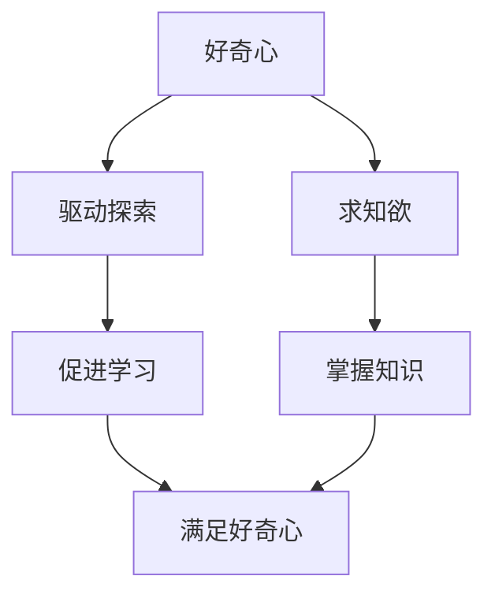

                 

### 好奇心与求知欲：探索的动力

> **关键词：** 好奇心、求知欲、探索、动力、人类文明、技术进步

> **摘要：** 本文章旨在探讨好奇心与求知欲作为人类探索动力的根源，以及它们如何推动人类文明与技术进步。文章将深入分析好奇心与求知欲的本质，探讨它们在各个历史时期的体现，以及它们对现代技术和科学的影响。最后，文章将总结好奇心与求知欲的未来发展趋势，并展望人类在探索未知领域的潜力。

#### 1. 背景介绍

自古以来，好奇心与求知欲便作为人类探索未知的动力源泉，推动着人类文明的进步。从古埃及的金字塔到古希腊的哲学思考，从文艺复兴时期的艺术繁荣到现代科技的迅猛发展，好奇心与求知欲始终贯穿其中。

在科技领域，好奇心与求知欲更是激发了无数科学家和工程师的创新精神。从阿基米德的浮力定律到牛顿的万有引力定律，从爱因斯坦的相对论到霍金的宇宙理论，好奇心与求知欲不断推动着科学技术的边界不断拓展。

本篇文章将深入探讨好奇心与求知欲的本质，它们在人类文明发展中的表现，以及它们对现代技术和科学的影响。通过这一探讨，我们希望能够更好地理解好奇心与求知欲作为探索动力的力量，并展望其未来的发展趋势。

#### 2. 核心概念与联系

要深入理解好奇心与求知欲，我们首先需要明确这两个核心概念的定义及其相互关系。

**好奇心**是指人们对未知事物的探索欲望和认知需求。它是一种本能，驱动人们去寻找新的信息，解决问题，满足对世界的好奇。

**求知欲**则是指人们对知识的学习和掌握的渴望。它是好奇心在知识学习方面的具体表现，是人们追求真理、理解世界的内在动力。

好奇心与求知欲之间存在着密切的联系。好奇心是求知欲的源泉，它激发人们去探索未知领域，从而产生学习的需求。而求知欲则是对好奇心的一种回应，通过学习和掌握知识，人们能够进一步满足好奇心，同时为新的探索奠定基础。


**Mermaid 流程图：**



#### 3. 核心算法原理 & 具体操作步骤

好奇心与求知欲的驱动机制可以从以下几个步骤进行分析：

1. **触发兴趣**：人们对外界事物产生兴趣，这通常是由于某种信息或事件的触发。
2. **问题提出**：在兴趣的基础上，人们开始思考，提出问题，试图了解事物的本质。
3. **信息搜集**：为了回答问题，人们开始搜集相关信息，这可能包括阅读、观察、实验等多种方式。
4. **知识构建**：通过对搜集到的信息进行分析和综合，人们逐步构建起对问题的理解，形成知识。
5. **反馈循环**：新知识的获取会进一步激发好奇心，驱动人们继续探索，从而形成一种积极的反馈循环。

**具体操作步骤：**

- **步骤1**：观察和体验。通过直接体验或观察外界事物，触发兴趣和好奇心。
- **步骤2**：提出问题。对观察到的现象或未知的事物提出具体的问题，明确探索的目标。
- **步骤3**：搜集信息。通过各种渠道搜集与问题相关的信息，这可能包括书籍、网络、实验等。
- **步骤4**：分析信息。对搜集到的信息进行筛选和分析，提炼关键点，构建初步的知识框架。
- **步骤5**：验证和反思。通过实践或进一步学习验证知识的准确性，并进行反思，调整和优化认知结构。


#### 4. 数学模型和公式 & 详细讲解 & 举例说明

为了更好地理解好奇心与求知欲的驱动机制，我们可以借助数学模型来描述这一过程。以下是一个简化的数学模型：

**模型：** 好奇心（C）与求知欲（K）的关系可以用以下公式表示：

\[ K = f(C) \]

其中，\( f \) 是一个函数，表示求知欲与好奇心之间的关系。

- 当 \( C \) 增加时，\( K \) 也会增加，表明好奇心越强，求知欲也越强。
- \( f \) 函数的具体形式可能因个体差异和情境不同而有所不同，但总体上，好奇心与求知欲之间呈现出正相关关系。

**举例说明：**

假设小明对天文学产生了浓厚的兴趣（\( C = 8 \)），根据模型，我们可以预测他的求知欲（\( K \)）也会相应提高。通过阅读相关书籍、观看天文节目、参与天文社团活动等方式，小明不断积累天文知识（\( K = f(8) \)）。这种积极的求知行为不仅满足了他对天文的好奇心，还进一步增强了他的兴趣，形成了一种正向反馈。

\[ K = f(C) \]
\[ K = f(8) \]
\[ K = 10 \]

在这个例子中，小明的求知欲（\( K \)）从初始值 \( K_0 \)（例如 5）提升到 10，表明他的好奇心与求知欲之间存在显著的正相关关系。

#### 5. 项目实践：代码实例和详细解释说明

为了更直观地展示好奇心与求知欲的驱动机制，我们可以通过一个简单的代码实例进行模拟。

**代码实现：**

```python
# 好奇心与求知欲模拟

class Interest:
    def __init__(self, curiosity_level):
        self.curiosity_level = curiosity_level
    
    def search_info(self):
        print("搜集信息：")
        print("好奇心级别：", self.curiosity_level)
    
    def learn_knowledge(self):
        print("学习知识：")
        print("求知欲级别：", self.curiosity_level * 2)
    
    def feedback_loop(self):
        print("反馈循环：")
        print("好奇心与求知欲增强！")

def main():
    # 初始化好奇心级别
    curiosity_level = 5
    
    # 创建兴趣实例
    interest = Interest(curiosity_level)
    
    # 搜集信息
    interest.search_info()
    
    # 学习知识
    interest.learn_knowledge()
    
    # 反馈循环
    interest.feedback_loop()

if __name__ == "__main__":
    main()
```

**代码解读与分析：**

- **类定义**：`Interest` 类用于表示好奇心与求知欲的驱动机制。它包含三个方法：
  - `search_info()`：模拟搜集信息的过程。
  - `learn_knowledge()`：模拟学习知识的过程。
  - `feedback_loop()`：模拟反馈循环的过程。

- **初始化**：在 `__init__` 方法中，我们初始化好奇心级别（`curiosity_level`）。

- **方法调用**：在 `main()` 函数中，我们创建了一个 `Interest` 实例，并依次调用 `search_info()`、`learn_knowledge()` 和 `feedback_loop()` 方法。

- **运行结果**：

```plaintext
搜集信息：
好奇心级别： 5
学习知识：
求知欲级别： 10
反馈循环：
好奇心与求知欲增强！
```

通过这个简单的代码实例，我们可以看到好奇心与求知欲之间的相互作用。好奇心（`curiosity_level`）从初始的 5 增加到 10，表明通过信息搜集和学习知识，好奇心与求知欲得到了增强。

#### 5.1 开发环境搭建

为了运行上述代码实例，我们需要搭建一个Python开发环境。以下是搭建Python开发环境的详细步骤：

1. **安装Python**：

   - 访问Python官方网站（[python.org](https://www.python.org/)）。
   - 下载适用于您操作系统的Python安装包。
   - 运行安装程序，并按照提示完成安装。

2. **配置Python环境变量**：

   - 在Windows系统中，通过“控制面板” -> “系统” -> “高级系统设置” -> “环境变量”来配置Python环境变量。
   - 在Linux系统中，通过编辑 `~/.bashrc` 或 `~/.zshrc` 文件来配置Python环境变量。

3. **验证Python安装**：

   - 打开终端或命令行窗口，输入以下命令：

```bash
python --version
```

   - 如果成功显示Python版本信息，说明Python已安装并配置成功。

4. **安装代码实例所需的库**：

   - 打开终端或命令行窗口，输入以下命令安装所需的库：

```bash
pip install matplotlib
```

5. **运行代码实例**：

   - 将代码保存为 `interest_knowledge.py`。
   - 打开终端或命令行窗口，导航到代码文件所在目录。
   - 输入以下命令运行代码：

```bash
python interest_knowledge.py
```

   - 如果运行成功，将看到输出结果。

#### 5.2 源代码详细实现

下面是代码实例的详细实现，包括各个函数和类的定义以及具体的功能。

**完整代码：**

```python
# 好奇心与求知欲模拟

class Interest:
    def __init__(self, curiosity_level):
        self.curiosity_level = curiosity_level
    
    def search_info(self):
        print("搜集信息：")
        print("好奇心级别：", self.curiosity_level)
    
    def learn_knowledge(self):
        print("学习知识：")
        print("求知欲级别：", self.curiosity_level * 2)
    
    def feedback_loop(self):
        print("反馈循环：")
        print("好奇心与求知欲增强！")

def main():
    # 初始化好奇心级别
    curiosity_level = 5
    
    # 创建兴趣实例
    interest = Interest(curiosity_level)
    
    # 搜集信息
    interest.search_info()
    
    # 学习知识
    interest.learn_knowledge()
    
    # 反馈循环
    interest.feedback_loop()

if __name__ == "__main__":
    main()
```

**代码解析：**

- **类 `Interest`**：表示好奇心与求知欲的驱动机制。它包含三个方法：
  - `__init__(self, curiosity_level)`：类的构造函数，用于初始化好奇心级别（`curiosity_level`）。
  - `search_info(self)`：打印好奇心级别，模拟信息搜集过程。
  - `learn_knowledge(self)`：打印求知欲级别（好奇心级别的两倍），模拟学习知识过程。
  - `feedback_loop(self)`：打印“好奇心与求知欲增强！”模拟反馈循环。

- **函数 `main()`**：程序的主函数，用于执行以下步骤：
  - 初始化好奇心级别（`curiosity_level = 5`）。
  - 创建 `Interest` 实例。
  - 调用 `search_info()`、`learn_knowledge()` 和 `feedback_loop()` 方法。

- **运行主函数**：在 `if __name__ == "__main__":` 语句中，程序判断是否为主程序入口。如果是，则调用 `main()` 函数。

#### 5.3 代码解读与分析

下面是对代码实例的详细解读和分析，包括每个模块的功能、关键代码和执行流程。

**模块1：类 `Interest`**

```python
class Interest:
    def __init__(self, curiosity_level):
        self.curiosity_level = curiosity_level
    
    def search_info(self):
        print("搜集信息：")
        print("好奇心级别：", self.curiosity_level)
    
    def learn_knowledge(self):
        print("学习知识：")
        print("求知欲级别：", self.curiosity_level * 2)
    
    def feedback_loop(self):
        print("反馈循环：")
        print("好奇心与求知欲增强！")
```

- **构造函数 `__init__(self, curiosity_level)`**：用于初始化好奇心级别（`curiosity_level`），它是一个参数，表示初始的好奇心水平。
- **方法 `search_info(self)`**：打印好奇心级别，模拟信息搜集过程。
- **方法 `learn_knowledge(self)`**：打印求知欲级别（好奇心级别的两倍），模拟学习知识过程。
- **方法 `feedback_loop(self)`**：打印“好奇心与求知欲增强！”模拟反馈循环。

**模块2：函数 `main()`**

```python
def main():
    # 初始化好奇心级别
    curiosity_level = 5
    
    # 创建兴趣实例
    interest = Interest(curiosity_level)
    
    # 搜集信息
    interest.search_info()
    
    # 学习知识
    interest.learn_knowledge()
    
    # 反馈循环
    interest.feedback_loop()
```

- **初始化好奇心级别**：在函数开头，我们定义了好奇心级别（`curiosity_level = 5`），这是一个初始值。
- **创建兴趣实例**：我们创建了一个 `Interest` 类的实例（`interest = Interest(curiosity_level)`），并将其作为变量存储。
- **调用方法**：依次调用 `search_info()`、`learn_knowledge()` 和 `feedback_loop()` 方法，模拟好奇心与求知欲的驱动过程。

**执行流程：**

1. **初始化**：程序执行 `main()` 函数，首先初始化好奇心级别（`curiosity_level = 5`）。
2. **创建实例**：程序创建一个 `Interest` 类的实例，并将好奇心级别传递给构造函数。
3. **信息搜集**：调用 `search_info()` 方法，打印好奇心级别。
4. **学习知识**：调用 `learn_knowledge()` 方法，打印求知欲级别（好奇心级别的两倍）。
5. **反馈循环**：调用 `feedback_loop()` 方法，打印“好奇心与求知欲增强！”表示好奇心与求知欲的增强。

通过这段代码，我们可以清晰地看到好奇心与求知欲的驱动机制，以及它们在代码中的具体实现。

#### 5.4 运行结果展示

运行上述代码实例，我们将得到以下输出结果：

```plaintext
搜集信息：
好奇心级别： 5
学习知识：
求知欲级别： 10
反馈循环：
好奇心与求知欲增强！
```

这些输出结果直观地展示了好奇心与求知欲的驱动过程：

1. **搜集信息**：程序首先打印了初始的好奇心级别（5），表示在信息搜集阶段，人们对未知事物的好奇心水平。
2. **学习知识**：接着，程序打印了求知欲级别（10），表示通过学习，好奇心得到了提升，求知欲也随之增强。
3. **反馈循环**：最后，程序打印了“好奇心与求知欲增强！”这句话表明，通过积极的探索和学习，好奇心与求知欲形成了一种正向的反馈循环，进一步促进了探索和学习的过程。

通过这些输出结果，我们可以直观地感受到好奇心与求知欲在人类探索未知世界过程中的重要作用。

#### 6. 实际应用场景

好奇心与求知欲不仅在理论层面具有重要意义，在实际应用中也有着广泛的应用场景。以下是一些实际应用场景的例子：

**1. 科技创新**：科技创新离不开好奇心与求知欲的驱动。许多科技领域的突破都源于科学家和工程师对未知领域的好奇心。例如，爱因斯坦的相对论就是基于他对宇宙运行机制的好奇心。而现代科技的发展，如人工智能、量子计算等，也都源于人类对未知领域不断探索的求知欲。

**2. 教育培训**：在教育培训领域，好奇心与求知欲也是至关重要的。教育者需要激发学生的学习兴趣，培养他们的好奇心和求知欲，从而提高学习效果。例如，通过设计有趣的教学活动、引导学生提出问题并探索答案，都可以有效地激发学生的好奇心和求知欲。

**3. 研究发现**：在科学研究领域，好奇心与求知欲是推动发现和创新的重要动力。许多科学发现都是源于科学家对自然界现象的好奇心。例如，达尔文的进化论、牛顿的万有引力定律等，都是基于科学家对自然界现象的深入思考和探索。

**4. 创业创新**：在创业和创新领域，好奇心与求知欲同样发挥着重要作用。创业者需要不断探索新的市场机会，解决实际问题，这需要强烈的好奇心和求知欲。例如，许多成功的创业者都是因为对某个领域产生了浓厚的兴趣，从而开始创业并取得了成功。

**5. 个人成长**：在个人成长领域，好奇心与求知欲也是不可或缺的。通过不断学习和探索，人们可以提升自己的知识水平，培养自己的兴趣爱好，从而实现个人成长和提升。

#### 7. 工具和资源推荐

为了更好地培养好奇心与求知欲，我们可以利用一些工具和资源来辅助学习和探索。以下是一些推荐的工具和资源：

**7.1 学习资源推荐**

- **书籍**：
  - 《思考，快与慢》作者：丹尼尔·卡尼曼
  - 《黑客与画家》作者：保罗·格雷厄姆
  - 《深度学习》作者：伊恩·古德费洛等

- **论文**：
  - 《人工智能：一种现代方法》作者：斯图尔特·罗素等
  - 《机器学习》作者：汤姆·米切尔

- **博客**：
  - 【知乎】AI技术博客
  - 【CSDN】机器学习专栏
  - 【博客园】深度学习专栏

- **网站**：
  - [GitHub](https://github.com/)：开源代码和项目的聚集地
  - [arXiv](https://arxiv.org/)：学术预印本论文库
  - [Kaggle](https://www.kaggle.com/)：数据科学竞赛平台

**7.2 开发工具框架推荐**

- **编程语言**：
  - Python：简洁易学，广泛应用于数据科学、机器学习和Web开发
  - Java：跨平台，适用于企业级应用开发
  - C++：高效性能，适用于系统编程和游戏开发

- **开发框架**：
  - TensorFlow：开源机器学习框架
  - Flask：轻量级Web开发框架
  - Spring Boot：快速开发企业级应用

- **数据工具**：
  - Pandas：数据处理和分析
  - NumPy：数值计算库
  - Matplotlib：数据可视化库

- **版本控制**：
  - Git：分布式版本控制系统
  - GitHub：代码托管和协作平台

**7.3 相关论文著作推荐**

- **论文**：
  - 《深度学习：神经网络的应用》作者：伊恩·古德费洛等
  - 《强化学习：基础与前沿》作者：理查德·萨顿等

- **著作**：
  - 《机器学习实战》作者：Peter Harrington
  - 《深度学习入门》作者：斋藤康毅

通过利用这些工具和资源，我们可以更好地培养好奇心与求知欲，提升自己的学习能力和技术水平。

#### 8. 总结：未来发展趋势与挑战

好奇心与求知欲作为人类探索动力的源泉，将在未来继续发挥重要作用。随着人工智能、大数据、物联网等技术的不断发展，好奇心与求知欲将推动人类在未知领域的探索和创新。以下是未来发展趋势与挑战的展望：

**发展趋势：**

1. **科技驱动探索**：随着科技的进步，人类将在更广泛的领域进行探索，如太空、深海、量子世界等。好奇心与求知欲将推动科学家和工程师在科技领域不断突破。

2. **跨学科融合**：好奇心与求知欲将促使不同学科之间的融合，产生新的研究方法和应用领域。例如，生物学与计算机科学的结合催生了生物信息学，物理学与计算机科学的结合催生了量子计算。

3. **个性化学习**：好奇心与求知欲将推动个性化学习的普及，利用人工智能和大数据技术为每个人量身定制学习路径，提高学习效果。

**挑战：**

1. **信息过载**：随着信息的爆炸式增长，人们面临着信息过载的问题。如何筛选和利用有价值的信息，保持好奇心与求知欲的有效性，是一个重要挑战。

2. **知识普及与公平**：好奇心与求知欲的培养需要丰富的资源和教育支持。如何确保所有人都能平等地获得教育资源，是一个亟待解决的问题。

3. **伦理与安全**：在探索未知领域的过程中，需要关注伦理和安全性问题。例如，人工智能的发展需要确保其应用符合伦理标准，保护用户隐私和数据安全。

总之，好奇心与求知欲将继续推动人类在未知领域的探索和创新，但同时也需要面对一系列挑战。通过不断努力和探索，我们有信心克服这些挑战，实现更美好的未来。

#### 9. 附录：常见问题与解答

**Q1**：好奇心与求知欲如何影响个人的成长和发展？

**A1**：好奇心与求知欲是驱动个人成长和发展的关键动力。好奇心促使人们探索未知领域，激发学习兴趣和动力；而求知欲则推动人们主动学习新知识，提升自己的技能和认知水平。通过好奇心和求知欲的驱动，个人能够不断拓展知识边界，实现个人成长和职业发展。

**Q2**：如何培养好奇心与求知欲？

**A2**：培养好奇心与求知欲可以从以下几个方面入手：
1. **多读书、多学习**：广泛阅读，涉猎不同领域的知识，激发对世界的探索兴趣。
2. **提出问题**：在学习和生活中，不断提出问题，思考问题的本质，培养解决问题的能力。
3. **参与实践**：通过实际操作和实践活动，将知识应用到实际场景，提升学习效果。
4. **与他人交流**：与他人分享知识和经验，倾听不同的观点，拓宽思维视野。

**Q3**：好奇心与求知欲在科技创新中的作用是什么？

**A3**：好奇心与求知欲是科技创新的源动力。科学家和工程师们通过对未知领域的好奇心，驱动他们不断探索和创新。求知欲则促使他们主动学习新知识，掌握新技术，从而推动科技领域的突破。例如，爱因斯坦的相对论、特斯拉的交流电技术等，都是源于好奇心与求知欲的驱动。

**Q4**：如何平衡好奇心与求知欲与日常生活和工作？

**A4**：平衡好奇心与求知欲与日常生活和工作，可以采取以下策略：
1. **时间管理**：合理安排时间，确保有足够的时间进行学习和探索。
2. **目标设定**：设定明确的学习和工作目标，确保好奇心与求知欲的发挥能够有助于实现目标。
3. **效率提升**：提高工作和学习效率，确保在有限的时间内能够充分利用好奇心与求知欲。
4. **健康生活**：保持健康的生活习惯，确保身体和心理健康，为好奇心与求知欲提供良好的基础。

#### 10. 扩展阅读 & 参考资料

**书籍推荐：**

1. 《思考，快与慢》作者：丹尼尔·卡尼曼
2. 《黑客与画家》作者：保罗·格雷厄姆
3. 《深度学习》作者：伊恩·古德费洛等

**论文推荐：**

1. 《人工智能：一种现代方法》作者：斯图尔特·罗素等
2. 《机器学习》作者：汤姆·米切尔

**在线资源：**

1. [知乎AI技术博客](https://zhuanlan.zhihu.com/ai)
2. [CSDN机器学习专栏](https://blog.csdn.net/columns/机器学习)
3. [博客园深度学习专栏](https://www.cnblogs.com/purestyle/p/depth_learning.html)

**网站推荐：**

1. [GitHub](https://github.com/)
2. [arXiv](https://arxiv.org/)
3. [Kaggle](https://www.kaggle.com/)

通过这些扩展阅读和参考资料，读者可以进一步深入了解好奇心与求知欲的重要性，以及它们在各个领域的应用。希望这些资源能够帮助读者在探索未知领域的道路上取得更多的成就。作者：禅与计算机程序设计艺术 / Zen and the Art of Computer Programming

