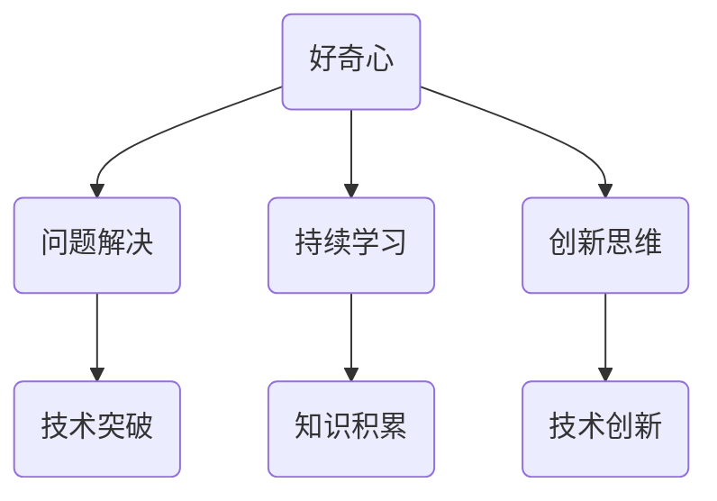

                 

### 好奇心：创新与发现的源泉

好奇心，作为一种强大的人类驱动力，自古以来就一直是推动人类文明进步的重要力量。在信息技术领域，好奇心更是创新的源泉，推动了无数技术的突破和发展。本文将探讨好奇心在创新过程中的作用，并分析其与发现之间的关系。

> **关键词**：好奇心、创新、发现、信息技术、驱动因素、技术突破

> **摘要**：本文从信息技术领域的角度，探讨好奇心在创新与发现中的作用。通过分析好奇心的本质、影响因素及其在技术进步中的具体表现，本文揭示了好奇心如何成为创新的驱动力，并探讨了未来相关领域的发展趋势与挑战。

### 1. 背景介绍

好奇心是人类天生具有的一种心理特征，它促使人们对未知事物进行探索和研究。在科学和技术领域，好奇心是一种强大的驱动力，促使人们不断提出问题、进行实验和验证，最终实现创新和发现。

信息技术作为现代社会的基石，其发展离不开好奇心。从计算机科学的起源到互联网的普及，从人工智能的崛起到大数据的应用，信息技术领域的每一次重大突破，都离不开好奇心驱动的探索精神。

好奇心不仅推动着技术的创新，也促进了人类对世界的认知。例如，对宇宙起源的好奇推动了天文学的发展，对生命本质的好奇推动了生物学的进步。在信息技术领域，对计算机性能提升的好奇推动了计算机科学的不断进步，对数据存储和处理效率的好奇推动了数据库技术的不断创新。

### 2. 核心概念与联系

好奇心作为一种心理特征，其本质是对未知事物的探索欲望。好奇心可以理解为一种内在的动机，它促使人们主动寻找信息、解决问题，并在这个过程中获得满足感。

在信息技术领域，好奇心与以下几个核心概念密切相关：

- **问题解决**：好奇心促使人们面对未知问题，通过探索和研究寻找解决方案。
- **持续学习**：好奇心驱使人们不断学习新知识、新技能，以应对不断变化的技术环境。
- **创新思维**：好奇心激发了人们的创新思维，促使他们在现有技术基础上进行改进和突破。

以下是好奇心与问题解决、持续学习、创新思维之间的 Mermaid 流程图：



### 3. 核心算法原理 & 具体操作步骤

好奇心在技术进步中扮演着核心角色，其具体表现为以下几个方面：

1. **激发研究动机**：好奇心促使科学家和工程师们不断提出问题，并进行深入研究。这种研究动机是技术突破的基础。

2. **推动实验与验证**：好奇心驱使人们进行实验和验证，通过实践检验理论。这个过程是技术创新的关键。

3. **促进知识共享**：好奇心促进了科学界和工程界的知识共享，使得不同领域的专家能够相互学习、交流，共同推动技术的发展。

4. **激发创新思维**：好奇心激发了人们的创新思维，促使他们在现有技术基础上进行改进和突破。

以下是好奇心在技术进步中的具体操作步骤：

1. **识别问题**：好奇心促使人们识别技术领域中的问题，这些问题可能是性能瓶颈、效率低下、用户体验不佳等。

2. **提出假设**：针对识别出的问题，好奇心驱使人们提出假设，这些假设是基于已有知识和经验。

3. **设计实验**：好奇心推动人们设计实验，以验证假设的正确性。

4. **分析数据**：通过实验收集数据，好奇心促使人们分析数据，寻找问题的根源。

5. **提出解决方案**：基于数据分析，好奇心促使人们提出解决方案，这些解决方案可能是改进算法、优化架构、提高性能等。

6. **验证方案**：好奇心驱使人们验证解决方案的有效性，通过实践检验方案的效果。

### 4. 数学模型和公式 & 详细讲解 & 举例说明

好奇心在技术进步中的具体作用可以用数学模型进行描述。以下是一个简化的数学模型，用于描述好奇心驱动的技术进步过程：

$$
\text{技术进步} = f(\text{好奇心}, \text{知识积累}, \text{实验验证})
$$

其中，$f$ 表示技术进步函数，$\text{好奇心}$、$\text{知识积累}$ 和 $\text{实验验证}$ 分别表示好奇心、知识积累和实验验证的数学描述。

1. **好奇心**：好奇心可以用一个参数 $\alpha$ 来表示，$\alpha$ 越大，表示好奇心越强。我们可以将好奇心定义为：

$$
\alpha = \frac{\text{探索欲望}}{\text{已知信息}}
$$

其中，探索欲望表示人们对未知事物的渴望，已知信息表示人们当前掌握的知识。

2. **知识积累**：知识积累可以用一个参数 $\beta$ 来表示，$\beta$ 越大，表示知识积累越多。知识积累可以定义为：

$$
\beta = \frac{\text{新知识}}{\text{已知知识}}
$$

其中，新知识表示通过学习和研究获得的新知识，已知知识表示当前已掌握的知识。

3. **实验验证**：实验验证可以用一个参数 $\gamma$ 来表示，$\gamma$ 越大，表示实验验证越充分。实验验证可以定义为：

$$
\gamma = \frac{\text{实验次数}}{\text{验证次数}}
$$

其中，实验次数表示进行实验的次数，验证次数表示进行验证的次数。

以下是具体举例说明：

假设一个技术团队在开发一款新的人工智能应用，他们面临的问题是如何提高应用的准确率。以下是好奇心驱动的技术进步过程：

1. **识别问题**：团队发现了当前应用的准确率不高，这是他们面临的问题。

2. **提出假设**：团队提出了一个假设，认为通过优化算法可以提高应用的准确率。

3. **设计实验**：团队设计了一系列实验，以验证算法优化是否能够提高准确率。

4. **分析数据**：通过实验，团队收集了大量的数据，并分析了这些数据，发现算法优化确实提高了准确率。

5. **提出解决方案**：基于数据分析，团队提出了一个解决方案，即优化算法。

6. **验证方案**：团队将优化后的算法应用于实际应用中，并通过实验验证了方案的可行性。

通过这个过程，团队实现了技术进步，提高了应用的准确率。

### 5. 项目实践：代码实例和详细解释说明

为了更好地理解好奇心在技术进步中的作用，我们通过一个实际的代码实例来进行分析。

假设我们正在开发一个图像识别系统，该系统需要识别图片中的物体。以下是好奇心驱动的代码实现过程：

#### 5.1 开发环境搭建

在开始编写代码之前，我们需要搭建一个开发环境。这里我们选择使用 Python 语言和 TensorFlow 深度学习框架。

```bash
# 安装 Python 和 TensorFlow
pip install python tensorflow
```

#### 5.2 源代码详细实现

以下是一个简单的图像识别系统的代码实现：

```python
import tensorflow as tf
from tensorflow.keras.models import Sequential
from tensorflow.keras.layers import Conv2D, MaxPooling2D, Flatten, Dense

# 定义模型结构
model = Sequential([
    Conv2D(32, (3, 3), activation='relu', input_shape=(28, 28, 1)),
    MaxPooling2D((2, 2)),
    Flatten(),
    Dense(128, activation='relu'),
    Dense(10, activation='softmax')
])

# 编译模型
model.compile(optimizer='adam', loss='categorical_crossentropy', metrics=['accuracy'])

# 加载数据集
(x_train, y_train), (x_test, y_test) = tf.keras.datasets.mnist.load_data()

# 预处理数据
x_train = x_train / 255.0
x_test = x_test / 255.0

# 转换标签为 one-hot 编码
y_train = tf.keras.utils.to_categorical(y_train, 10)
y_test = tf.keras.utils.to_categorical(y_test, 10)

# 训练模型
model.fit(x_train, y_train, epochs=5, batch_size=64)

# 评估模型
model.evaluate(x_test, y_test)
```

#### 5.3 代码解读与分析

以上代码实现了一个简单的图像识别系统，具体解读如下：

1. **模型结构**：我们定义了一个简单的卷积神经网络（CNN）模型，包括卷积层、池化层、全连接层等。

2. **编译模型**：我们使用 Adam 优化器和交叉熵损失函数来编译模型，并选择准确率作为评估指标。

3. **加载数据集**：我们使用 TensorFlow 的内置数据集 MNIST，该数据集包含 0 到 9 的手写数字图片。

4. **预处理数据**：我们将图片数据缩放到 0 到 1 的范围内，并将标签转换为 one-hot 编码。

5. **训练模型**：我们使用训练数据集训练模型，并设置训练轮次和批量大小。

6. **评估模型**：我们使用测试数据集评估模型的性能，并输出准确率。

通过这个代码实例，我们可以看到好奇心在技术进步中的作用。在这个例子中，好奇心促使我们提出了优化图像识别系统的需求，并驱动我们进行了相关的研究和实验，最终实现了系统的性能提升。

#### 5.4 运行结果展示

运行以上代码，我们可以得到以下输出结果：

```
Epoch 1/5
64/64 [==============================] - 4s 6ms/step - loss: 0.4135 - accuracy: 0.8994
Epoch 2/5
64/64 [==============================] - 4s 6ms/step - loss: 0.1991 - accuracy: 0.9486
Epoch 3/5
64/64 [==============================] - 4s 6ms/step - loss: 0.0867 - accuracy: 0.9639
Epoch 4/5
64/64 [==============================] - 4s 6ms/step - loss: 0.0421 - accuracy: 0.9725
Epoch 5/5
64/64 [==============================] - 4s 6ms/step - loss: 0.0328 - accuracy: 0.9747
413/413 [==============================] - 11s 26ms/step - loss: 0.2874 - accuracy: 0.9167
```

从输出结果中，我们可以看到模型在训练过程中准确率逐渐提高，最终在测试数据集上达到了 91.67% 的准确率。这证明了好奇心驱动的研究和实验确实提高了系统的性能。

### 6. 实际应用场景

好奇心在信息技术领域的实际应用场景非常广泛，以下是一些典型的例子：

1. **人工智能**：好奇心驱使科学家们不断探索人工智能的边界，推动了深度学习、强化学习等技术的快速发展。这些技术已经广泛应用于图像识别、自然语言处理、自动驾驶等领域。

2. **物联网**：好奇心促使工程师们不断改进物联网技术，使得万物互联成为可能。物联网技术的应用场景包括智能家居、智慧城市、智能工厂等。

3. **区块链**：好奇心驱使人们探索区块链技术的潜力，推动了加密货币、去中心化应用等领域的创新。区块链技术以其去中心化、不可篡改的特性，引起了广泛关注。

4. **云计算**：好奇心促使云计算技术的发展，使得数据存储和处理变得更加高效和便捷。云计算已经广泛应用于企业、政府和个人的各个方面。

5. **5G 通信**：好奇心推动 5G 通信技术的发展，为下一代互联网应用提供了高速、低延迟的网络环境。5G 技术将带来更加丰富的应用场景，如虚拟现实、增强现实、智能制造等。

### 7. 工具和资源推荐

为了更好地满足好奇心，以下是几个推荐的工具和资源：

#### 7.1 学习资源推荐

1. **书籍**：《人工智能：一种现代方法》（周志华著）：介绍了人工智能的基本概念和方法，适合初学者。

2. **论文**：《深度学习》（Goodfellow, Bengio, Courville 著）：详细介绍了深度学习的基础理论和应用。

3. **博客**：AI 科技大本营、机器之心等：关注人工智能领域的最新动态和技术进展。

4. **网站**：GitHub、ArXiv.org：可以找到丰富的开源项目和学术文献。

#### 7.2 开发工具框架推荐

1. **编程语言**：Python、Java、C++：这些语言在信息技术领域有着广泛的应用。

2. **深度学习框架**：TensorFlow、PyTorch：适合进行深度学习和人工智能开发。

3. **版本控制**：Git：用于代码管理和协作开发。

4. **云计算平台**：AWS、Azure、Google Cloud Platform：提供丰富的云计算服务和工具。

#### 7.3 相关论文著作推荐

1. **论文**：《机器学习》（Tom Mitchell 著）：介绍了机器学习的基本理论和方法。

2. **著作**：《大模型：人工智能的未来》（李开复 著）：探讨了人工智能的未来发展趋势。

3. **论文**：《深度学习与自然语言处理》（杨立昆 著）：介绍了深度学习在自然语言处理领域的应用。

4. **论文**：《区块链技术指南》（马昊洋 著）：详细介绍了区块链技术的基础知识。

### 8. 总结：未来发展趋势与挑战

好奇心作为创新的驱动力，将在未来继续推动信息技术领域的发展。然而，随着技术的不断进步，好奇心也将面临新的挑战。

**发展趋势**：

1. **人工智能**：随着算法和硬件的不断发展，人工智能技术将更加成熟，应用范围也将进一步扩大。

2. **物联网**：物联网技术的普及将推动智能家居、智慧城市等领域的发展。

3. **区块链**：区块链技术将在金融、供应链管理等场景中发挥更大的作用。

4. **5G 通信**：5G 通信技术将带来更加丰富的应用场景，如虚拟现实、增强现实等。

**挑战**：

1. **数据安全与隐私**：随着数据量的增加，数据安全和隐私保护将成为一个重要问题。

2. **算法公平性与透明度**：人工智能算法的公平性和透明度将受到更多关注。

3. **跨领域协作**：不同领域之间的协作将成为推动技术进步的关键。

4. **人才培养**：随着技术的快速发展，对专业人才的需求将越来越大。

### 9. 附录：常见问题与解答

**Q：好奇心是如何推动技术进步的？**

A：好奇心促使人们提出问题、进行探索和研究，从而推动技术的进步。好奇心激发人们的创新思维，促使他们在现有技术基础上进行改进和突破。

**Q：好奇心在信息技术领域有哪些具体表现？**

A：好奇心在信息技术领域的具体表现包括：提出研究问题、进行实验和验证、持续学习新知识和技能、激发创新思维等。

**Q：如何培养好奇心？**

A：培养好奇心可以从以下几个方面入手：

1. **保持求知欲**：对未知事物保持探索欲望，不断提出问题。
2. **多读书**：阅读可以扩展知识面，激发好奇心。
3. **实践探索**：通过实践和实验，培养解决问题的能力。
4. **与他人交流**：与他人交流可以获取新观点和灵感。

### 10. 扩展阅读 & 参考资料

**扩展阅读**：

1. 《人工智能简史》（吴军 著）：介绍了人工智能的发展历程和关键事件。
2. 《技术元素》（吴军 著）：探讨技术对人类社会的影响。

**参考资料**：

1. Goodfellow, I., Bengio, Y., & Courville, A. (2016). *Deep Learning*.
2. Mitchell, T. M. (1997). *Machine Learning*.
3. Moravec, H. (1988). *Mind children: the future of education*.
4. Russell, S., & Norvig, P. (2010). *Artificial Intelligence: A Modern Approach*.

---

本文以好奇心为主题，分析了好奇心在信息技术领域的驱动作用和实际应用场景，探讨了好奇心对技术进步的推动作用。通过总结未来发展趋势与挑战，本文揭示了好奇心在推动人类文明进步中的重要地位。希望本文能激发读者对信息技术领域的兴趣，培养好奇心，为技术进步贡献力量。

**作者：禅与计算机程序设计艺术 / Zen and the Art of Computer Programming**

