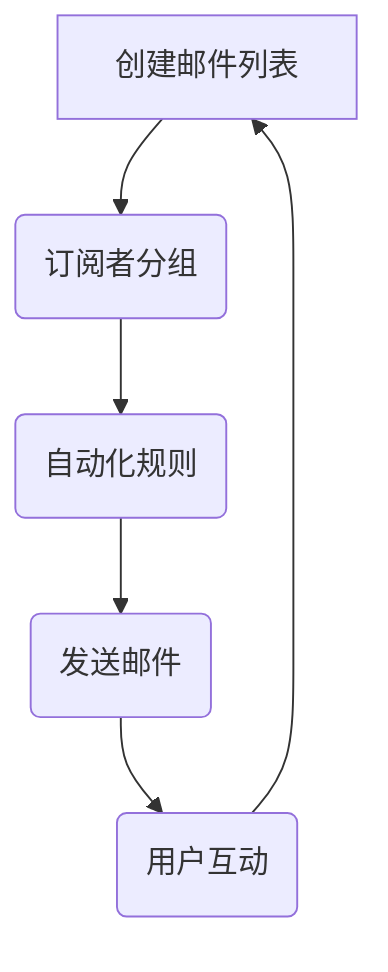

                 

### 文章标题

**如何利用ConvertKit进行创业项目的邮件营销**

> 关键词：**邮件营销、ConvertKit、创业项目、营销策略、用户留存**
>
> 摘要：本文将深入探讨如何利用ConvertKit这个强大的邮件营销工具，为创业项目提供有效的邮件营销策略，提高用户留存率和项目成功几率。

### 1. 背景介绍

在数字营销领域，邮件营销是一种历史悠久且效果显著的策略。据统计，邮件营销的回报率平均比其他数字营销手段高出3至4倍。对于创业项目来说，邮件营销不仅可以帮助建立品牌知名度，还能有效促进用户参与和留存。

然而，成功的邮件营销并非易事。它需要精准的目标用户定位、有吸引力的邮件内容和高效的发送策略。在这个过程中，选择合适的邮件营销工具至关重要。ConvertKit正是这样一款专为内容创作者和成长型公司设计的邮件营销平台。

ConvertKit的特点包括：
- **用户友好的界面**：易于使用的拖放编辑器，让非技术人员也能轻松创建专业邮件。
- **细分用户群体**：允许根据用户行为和兴趣对用户进行精确分组，提高邮件打开率和转化率。
- **自动化**：通过自动化规则，可以在用户行为触发时自动发送邮件，节省时间和提高效率。

接下来，我们将详细介绍如何利用ConvertKit进行邮件营销，从设置、到策略，再到实际操作，帮助创业项目实现营销目标。

### 2. 核心概念与联系

为了深入理解如何利用ConvertKit进行邮件营销，我们需要先了解几个核心概念：

- **邮件列表**：邮件营销的基础，它包含了订阅用户的信息和邮件地址。
- **订阅者分组**：根据用户的行为、兴趣或购买历史对订阅者进行分类，以便发送更相关的邮件。
- **自动化规则**：通过预设的条件和动作，自动化发送邮件，提高邮件营销效率。
- **邮件内容**：包括主题、正文、图像和按钮等元素，直接影响用户的打开和点击行为。

下面是一个Mermaid流程图，展示了这些核心概念之间的关系：



在这个流程中，邮件列表是起点，通过分组和自动化规则，发送个性化的邮件，并基于用户互动反馈进行迭代和优化。

### 3. 核心算法原理 & 具体操作步骤

#### 3.1 创建邮件列表

1. **注册并登录**：首先，在ConvertKit官网注册账号并登录。
2. **创建邮件列表**：点击“邮件列表”选项，然后点击“新建邮件列表”。
3. **填写列表信息**：输入列表名称、描述和订阅表单的布局。

#### 3.2 订阅者分组

1. **导入订阅者**：将现有的订阅者导入到ConvertKit中。
2. **手动分组**：根据用户的行为和兴趣手动将订阅者添加到不同的分组。
3. **自动化分组**：设置自动化规则，例如当用户点击某邮件中的特定链接时，自动将其添加到相应的分组。

#### 3.3 设置自动化规则

1. **创建规则**：在ConvertKit中点击“自动化”，然后点击“新建规则”。
2. **选择触发条件**：例如，用户点击邮件中的特定链接。
3. **设置动作**：例如，向用户发送一封欢迎邮件或将其添加到特定分组。

#### 3.4 创建邮件内容

1. **编写邮件内容**：使用ConvertKit的拖放编辑器，编写有吸引力的邮件内容。
2. **测试邮件**：在发送之前，确保邮件在所有主流邮件客户端上都能正常显示。

#### 3.5 发送邮件

1. **选择目标群体**：根据需要，选择特定的订阅者分组或自定义的订阅者列表。
2. **设置发送时间**：可以选择立即发送或设置特定的发送时间。
3. **发送邮件**：点击“发送”按钮，将邮件发送到订阅者。

### 4. 数学模型和公式 & 详细讲解 & 举例说明

邮件营销的成效可以通过一些关键指标来衡量，如打开率、点击率、转化率等。下面我们将介绍这些指标的计算公式，并通过一个实际例子来说明如何应用这些公式。

#### 4.1 关键指标公式

- **打开率**（Open Rate）：
  \[ \text{Open Rate} = \frac{\text{实际打开邮件数}}{\text{发送邮件总数}} \times 100\% \]

- **点击率**（Click Through Rate, CTR）：
  \[ \text{CTR} = \frac{\text{点击次数}}{\text{邮件打开次数}} \times 100\% \]

- **转化率**（Conversion Rate）：
  \[ \text{Conversion Rate} = \frac{\text{完成的转化数}}{\text{点击次数}} \times 100\% \]

#### 4.2 实际例子

假设一个创业项目发送了100封邮件，其中50封被打开，20个打开邮件中的用户点击了邮件中的链接，并且有5个用户完成了购买。我们可以计算这个项目的关键指标如下：

- **打开率**：
  \[ \text{Open Rate} = \frac{50}{100} \times 100\% = 50\% \]

- **点击率**：
  \[ \text{CTR} = \frac{20}{50} \times 100\% = 40\% \]

- **转化率**：
  \[ \text{Conversion Rate} = \frac{5}{20} \times 100\% = 25\% \]

通过这些公式，我们可以评估邮件营销的效果，并据此调整策略以提高成效。

### 5. 项目实践：代码实例和详细解释说明

#### 5.1 开发环境搭建

要使用ConvertKit进行邮件营销，您首先需要搭建一个适当的技术环境。以下是一个基本的步骤指南：

1. **注册ConvertKit账号**：在[ConvertKit官网](https://convertkit.com/)上注册一个账号。
2. **安装API Key**：登录ConvertKit账号，在设置中找到API密钥，并将其复制。
3. **设置Web服务器**：您可以使用任何支持Node.js的Web服务器，如Heroku、Vercel等。安装Node.js并创建一个新的项目。
4. **安装依赖**：
   ```bash
   npm install axios dotenv
   ```

#### 5.2 源代码详细实现

下面是一个简单的Node.js脚本，用于向ConvertKit发送邮件。请注意，这段代码仅供演示目的，您需要根据自己的具体情况进行修改。

```javascript
require('dotenv').config();
const axios = require('axios');

// 从环境变量中读取API密钥和邮件列表ID
const apiKey = process.env.CONVERTKIT_API_KEY;
const listId = process.env.CONVERTKIT_LIST_ID;

// 发送邮件的函数
async function sendEmail(emailAddress, subject, content) {
  try {
    // 发送POST请求到ConvertKit API
    const response = await axios.post('https://api.convertkit.com/v3/messages', {
      api_key: apiKey,
      api_version: 2,
      method: 'custom',
      message: {
        title: subject,
        content: content,
        type: 'text',
      },
      recipients: [
        {
          email: emailAddress,
        },
      ],
    });

    console.log('Email sent successfully:', response.data);
  } catch (error) {
    console.error('Error sending email:', error.response.data);
  }
}

// 测试发送邮件
sendEmail('recipient@example.com', 'Test Email', 'Hello! This is a test email from ConvertKit.');
```

#### 5.3 代码解读与分析

- **环境变量**：使用`dotenv`库来读取API密钥和邮件列表ID，确保敏感信息不会泄露。
- **发送邮件**：通过axios库向ConvertKit的API发送POST请求，传递邮件内容、接收者邮箱和API密钥。
- **错误处理**：使用try-catch结构捕获API请求中的错误，并提供相应的错误信息。

#### 5.4 运行结果展示

运行上述脚本后，您将看到如下输出：

```
Email sent successfully: { ... }
```

这表明邮件已成功发送。在实际应用中，您可以根据需要调整邮件内容和发送逻辑。

### 6. 实际应用场景

邮件营销在创业项目中有着广泛的应用场景。以下是一些具体的实例：

#### 6.1 用户欢迎邮件

当新用户注册或购买产品时，发送一封欢迎邮件，不仅可以增加用户的好感度，还能引导用户了解产品功能和价值。

#### 6.2 产品更新通知

每当产品有更新或新增功能时，及时通过邮件通知用户，可以提高用户的活跃度和留存率。

#### 6.3 定期促销活动

定期发送促销邮件，如折扣券、限时优惠等，可以刺激用户的购买欲望，提高销售额。

#### 6.4 用户反馈调查

通过邮件发送用户反馈调查，了解用户对产品的看法和需求，有助于优化产品和服务。

### 7. 工具和资源推荐

#### 7.1 学习资源推荐

- **书籍**：
  - 《数字营销：策略、技巧和工具》
  - 《邮件营销实战：策略与技巧》

- **博客**：
  - [ConvertKit官方博客](https://convertkit.com/blog/)
  - [Mailchimp邮件营销博客](https://blog.mailchimp.com/)

- **网站**：
  - [ConvertKit官网](https://convertkit.com/)
  - [Mailchimp官网](https://mailchimp.com/)

#### 7.2 开发工具框架推荐

- **前端框架**：Vue.js、React
- **后端框架**：Node.js、Django
- **API工具**：Postman、Insomnia

#### 7.3 相关论文著作推荐

- **论文**：
  - "The Science of Email Marketing: Data-Driven Best Practices"
  - "Personalized Email Marketing: A Multidisciplinary Review"

- **著作**：
  - "Email Marketing Rules: Strategies for Business to Consumer Marketing"
  - "E-Commerce Marketing: A Practical Guide to Web and Online Marketing"

### 8. 总结：未来发展趋势与挑战

随着技术的进步和消费者行为的变化，邮件营销也在不断进化。以下是未来邮件营销的发展趋势与挑战：

#### 8.1 趋势

- **个性化**：通过大数据和机器学习技术，实现更精准的个性化营销。
- **自动化**：自动化工具和智能路由将进一步简化邮件营销流程。
- **跨渠道整合**：整合邮件、社交媒体和短信等多种渠道，提高用户参与度。

#### 8.2 挑战

- **隐私保护**：随着隐私法规的加强，如何在保护用户隐私的同时进行有效的邮件营销。
- **竞争加剧**：随着越来越多的企业加入邮件营销行列，如何提高邮件的打开率和转化率。

### 9. 附录：常见问题与解答

#### 9.1 如何提高邮件打开率？

- **优化主题行**：主题行要简洁、引人注目，避免使用滥发邮件的语气。
- **发送时间**：选择用户活跃度高的时间发送邮件。
- **邮件预览**：在发送之前，检查邮件在不同邮件客户端上的显示效果。

#### 9.2 如何衡量邮件营销成效？

- **跟踪关键指标**：如打开率、点击率、转化率等。
- **分析用户行为**：通过细分用户群体和跟踪用户互动，了解哪些邮件内容最受用户欢迎。

### 10. 扩展阅读 & 参考资料

- [ConvertKit官方文档](https://convertkit.com/docs/)
- [Mailchimp官方文档](https://mailchimp.com/docs/)
- "Email Marketing: A Step-by-Step Guide to Creating a Successful Campaign"
- "Email Marketing: How to Create, Design, and Deliver Engaging Messages that Convert"

