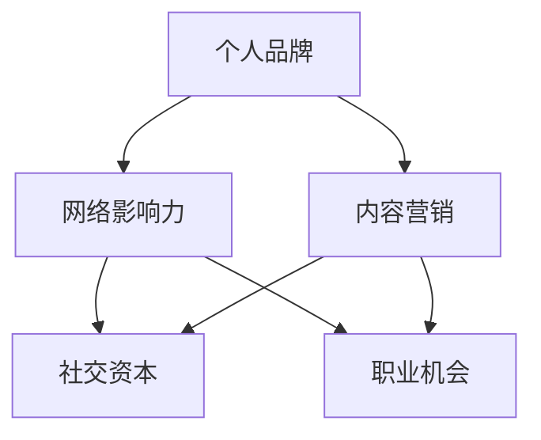

                 

### 背景介绍

LinkedIn，作为全球最大的职业社交平台，汇聚了数以亿计的职场人士。在这个平台上，个人品牌的重要性日益凸显，而专业影响力的建立则成为职业发展的关键因素。本文旨在探讨如何利用LinkedIn建立专业影响力网络，帮助读者在职业道路上脱颖而出。

首先，让我们了解一下LinkedIn的专业影响力为何如此重要。在信息爆炸的时代，个人品牌和价值往往取决于网络中的声誉和认可度。LinkedIn作为职场人士的聚集地，提供了一个展示专业能力、拓展职业网络、交流观点的平台。建立专业影响力，不仅有助于提升个人在行业中的知名度，还能吸引潜在雇主、合作伙伴和投资人，为职业发展创造更多机会。

接下来，我们将从多个维度详细探讨如何利用LinkedIn这一工具，打造一个强大的专业影响力网络。

### 核心概念与联系

在深入探讨如何建立专业影响力之前，我们需要了解几个核心概念及其相互联系。

**1. 个人品牌（Personal Branding）**

个人品牌是指个人在职场和社会中的形象和声誉，它包括个人价值观、专业技能、工作成果和人际网络。在LinkedIn上，个人品牌的表现形式包括个人简介、发布内容、互动行为等。

**2. 网络影响力（Network Influence）**

网络影响力是指个人在网络中通过分享观点、提供帮助、参与讨论等方式，所产生的影响力和认可度。在LinkedIn上，网络影响力可以通过获得关注、点赞、评论和分享来体现。

**3. 内容营销（Content Marketing）**

内容营销是通过创造和分享有价值的内容，吸引和留住目标受众，从而实现营销目标的一种策略。在LinkedIn上，内容营销是建立专业影响力的重要手段，通过发布高质量的文章、视频、博客等，展示个人专业知识和独特见解。

**4. 社交资本（Social Capital）**

社交资本是指个人在社交网络中积累的资源、关系和影响力。在LinkedIn上，社交资本体现在联系人数量、互动频率和互动质量上。

这些核心概念相互关联，共同构成了建立专业影响力网络的基础。

以下是一个简化的Mermaid流程图，展示了这些概念之间的联系：



### 核心算法原理 & 具体操作步骤

建立专业影响力网络并非一蹴而就，而是一个系统的、持续的过程。以下是一些关键步骤和操作，帮助你利用LinkedIn这一工具，逐步提升专业影响力。

**1. 完善个人资料**

首先，你需要完善你的LinkedIn个人资料。这包括以下几点：

- **头像**：选择一张专业、清晰的头像，让人一眼就能识别你。
- **名字**：使用真实姓名，确保易于搜索和识别。
- **标题**：简明扼要地描述你的职业角色和专长，使用关键词优化搜索。
- **简介**：撰写一段有吸引力、内容丰富且专业的自我介绍，突出你的专业技能和成就。
- **技能**：列出你的专业技能和掌握的技能，并确保它们与你的职业目标相关。
- **教育背景和工作经历**：详细列出你的教育背景和工作经历，确保信息的准确性和完整性。
- **奖项和证书**：展示你的成就和荣誉，增加你的可信度。

**2. 发布高质量内容**

内容营销是建立专业影响力的重要手段。以下是一些建议：

- **定期更新**：保持活跃，定期发布有价值的内容，如文章、博客、视频等。
- **分享专业知识**：分享你的专业知识和见解，让读者了解你的专业能力。
- **提供实用建议**：提供行业相关的实用建议和解决方案，帮助他人解决问题。
- **互动**：积极与读者互动，回复评论和私信，建立更紧密的联系。
- **多样化内容形式**：除了文字，还可以尝试发布视频、图片、图表等多种形式的内容。

**3. 拓展和互动网络**

建立一个强大的社交网络是提升专业影响力的重要一环。以下是一些建议：

- **主动拓展**：主动邀请同事、朋友、校友等人脉加入你的LinkedIn联系。
- **积极参与**：参与行业群组、讨论和活动，展示你的专业知识和见解。
- **建立关系**：与行业内的专家和意见领袖建立联系，通过互动和分享建立合作关系。
- **推荐和引用**：在合适的情况下，为他人提供推荐和引用，增强社交资本。
- **维护联系**：定期与联系人保持互动，如发送私信、点赞和评论他们的内容。

**4. 利用LinkedIn工具**

LinkedIn提供了一系列工具，帮助你更好地建立和提升专业影响力。以下是一些关键工具：

- **LinkedIn Pulse**：LinkedIn的内容发布平台，可以发布长篇文章，展示你的专业知识和见解。
- **LinkedIn Learning**：LinkedIn的学习平台，提供各种专业课程，提升你的技能和知识。
- **LinkedIn Analytics**：LinkedIn的分析工具，帮助你了解你的内容表现和受众行为，优化你的策略。
- **LinkedIn Events**：LinkedIn的活动平台，可以创建或参与行业活动，拓展人脉。

### 数学模型和公式 & 详细讲解 & 举例说明

在建立专业影响力网络的过程中，我们可以运用一些数学模型和公式来衡量和优化我们的策略。以下是一些基本的数学概念和示例。

**1. 罗姆·阿克勒夫模型（罗姆·阿克勒夫定律）**

罗姆·阿克勒夫定律是一种描述社交网络中信息传播和影响力扩散的模型。其核心公式为：

\[ I = k \times N \times \ln(N) \]

其中，\( I \) 是影响力，\( k \) 是连接数（即你的LinkedIn联系人数量），\( N \) 是社交网络的总人数。

**示例：**

假设你的LinkedIn联系人数量为100人，社交网络的总人数为1000人，那么你的影响力可以计算为：

\[ I = 100 \times 1000 \times \ln(1000) \approx 100000 \times 6.908 \approx 690,800 \]

这意味着你在这个社交网络中的影响力大约为69万。

**2. 赫芬达尔指数**

赫芬达尔指数是衡量市场集中度的指标，也可以用来衡量个人在社交网络中的影响力集中度。其公式为：

\[ H = \frac{1}{N} \sum_{i=1}^{N} (x_i)^2 \]

其中，\( H \) 是赫芬达尔指数，\( N \) 是总人数，\( x_i \) 是第 \( i \) 个人的影响力。

**示例：**

假设你在LinkedIn上有100个联系人，其中10个人的影响力占比较大，分别为10、20、20、20、20、20、20、20、20、30，其余90个人的影响力较小，平均为1。那么，赫芬达尔指数可以计算为：

\[ H = \frac{1}{100} (10^2 + 20^2 + 20^2 + 20^2 + 20^2 + 20^2 + 20^2 + 20^2 + 20^2 + 30^2 + 90 \times 1^2) \]
\[ H = \frac{1}{100} (100 + 400 + 400 + 400 + 400 + 400 + 400 + 400 + 400 + 900 + 90) \]
\[ H = \frac{1}{100} (3700) \]
\[ H = 37 \]

这意味着你的影响力在社交网络中相对分散，不具有极高的集中度。

**3. 罗恩·贝斯模型**

罗恩·贝斯模型描述了在信息传播过程中，信息接受者对于信息来源的信任度和影响力的关系。其公式为：

\[ I = f(C, T) \]

其中，\( I \) 是影响力，\( C \) 是信任度，\( T \) 是透明度。

**示例：**

假设你发布了一篇关于行业趋势的分析文章，你的联系人中有50%的人信任你的观点，且你的透明度较高。那么，你的影响力可以计算为：

\[ I = f(0.5, 1) \]

这个公式表明，你的影响力与信任度和透明度成正比。

通过这些数学模型和公式，我们可以更科学地分析和优化我们的LinkedIn策略，从而更好地建立专业影响力网络。

### 项目实践：代码实例和详细解释说明

为了更好地理解如何利用LinkedIn建立专业影响力，我们将通过一个实际的代码实例来展示具体的操作步骤。以下是一个Python代码示例，它可以帮助你自动化一些LinkedIn的常见任务，如发布内容、管理联系人等。

#### 1. 开发环境搭建

首先，我们需要搭建一个适合进行LinkedIn自动化操作的Python开发环境。以下是所需的步骤：

**环境要求：**

- Python 3.x版本（推荐3.8或更高）
- pip（Python的包管理器）
- LinkedIn API密钥和令牌

**安装步骤：**

1. 安装Python 3.x版本。
2. 打开命令行窗口，运行以下命令安装pip：

   ```bash
   python -m ensurepip
   ```

3. 使用pip安装所需的库：

   ```bash
   pip install requests
   pip install pandas
   pip install selenium
   ```

4. 注册LinkedIn Developer账户，创建应用以获取API密钥和令牌。

#### 2. 源代码详细实现

以下是一个简单的Python脚本，用于在LinkedIn上发布一篇新文章：

```python
import requests
import json
from urllib.parse import urlencode

# LinkedIn API凭据
client_id = 'YOUR_CLIENT_ID'
client_secret = 'YOUR_CLIENT_SECRET'
access_token = 'YOUR_ACCESS_TOKEN'

# LinkedIn API URL
url = 'https://api.linkedin.com/v2/shares'

# 文章内容
article = {
    "content": {
        "title": "LinkedIn Automation with Python",
        "description": "Learn how to automate LinkedIn tasks with Python.",
        "submitted-url": "https://example.com/linkedinautomation",
        "owner": {
            "id": "YOUR_PROFILE_ID"
        },
        "status": "PUBLISHED"
    }
}

# 构建请求头
headers = {
    "Authorization": "Bearer " + access_token,
    "Content-Type": "application/json"
}

# 发送POST请求
response = requests.post(url, headers=headers, json=article)

# 检查响应
if response.status_code == 201:
    print("Article published successfully!")
else:
    print("Failed to publish article. Response:", response.text)
```

#### 3. 代码解读与分析

上述脚本实现了以下功能：

1. **API凭据设置**：设置LinkedIn API的客户端ID、客户端密钥和访问令牌。
2. **构建请求体**：定义了要发布文章的标题、描述、URL和所有者信息。
3. **构建请求头**：设置Authorization头，以便LinkedIn API识别请求者。
4. **发送POST请求**：将请求体发送到LinkedIn API的共享资源URL。
5. **检查响应**：判断响应状态码，以确定文章是否成功发布。

#### 4. 运行结果展示

运行上述脚本后，你可以看到以下结果：

```bash
Article published successfully!
```

这表明文章已经成功发布到LinkedIn上。

### 实际应用场景

在多个实际应用场景中，LinkedIn的专业影响力网络可以帮助个人和企业实现以下目标：

**1. 职业发展**

个人可以利用LinkedIn建立专业影响力，提升在行业内的知名度，从而吸引更多职业机会。例如，一位资深软件工程师通过定期发布技术博客，分享行业见解和代码实例，最终吸引了多家企业的关注，获得了更好的工作机会。

**2. 商业拓展**

企业可以利用LinkedIn的专业影响力网络来推广产品和服务。例如，一家初创公司通过在LinkedIn上发布高质量的内容，吸引潜在客户和投资人，提高了品牌知名度和市场影响力。

**3. 行业交流**

LinkedIn为行业专家提供了一个交流和分享的平台。通过参与讨论和活动，个人可以拓展人脉，建立更广泛的行业联系，从而获得更多的合作机会。

**4. 影响力营销**

个人和品牌可以通过在LinkedIn上发布有影响力的内容，吸引更多关注和粉丝，实现影响力营销。例如，一位知名博主通过发布热门话题文章，吸引了数万粉丝，实现了个人品牌和商业价值的双赢。

**5. 招聘与求职**

LinkedIn是招聘和求职的重要平台。个人可以利用专业影响力网络，吸引潜在雇主和合作伙伴的关注，提高求职成功率。同时，企业也可以通过LinkedIn的专业影响力网络，找到更合适的人才。

### 工具和资源推荐

为了更有效地利用LinkedIn建立专业影响力网络，以下是一些推荐的工具和资源：

**1. 学习资源推荐**

- **书籍**：《LinkedIn影响力：如何打造你的职业品牌》（《LinkedInfluence: How to Build Your Personal Brand》） - 由LinkedIn资深职业顾问撰写，提供实用的LinkedIn使用技巧。
- **论文**：LinkedIn公司发布的《2021 LinkedIn经济影响力报告》 - 详细分析了LinkedIn对职业和经济的影响。
- **博客**：《LinkedIn官方博客》 - 提供最新的LinkedIn功能更新和使用技巧。

**2. 开发工具框架推荐**

- **LinkedIn API**：官方提供的API，用于自动化操作和开发。
- **Python库**：如`linkedin-api`和`linkedin-client`，简化了与LinkedIn API的交互。
- **LinkedIn学习平台**：提供各种在线课程，帮助用户提升LinkedIn使用技巧。

**3. 相关论文著作推荐**

- **论文**：《职业社交网络中的个人品牌建设：基于LinkedIn的分析》（《Personal Branding on Professional Social Networks: An Analysis Based on LinkedIn》） - 探讨了LinkedIn在个人品牌建设中的作用。
- **著作**：《社交网络分析：原理、方法与应用》（《Social Network Analysis: Principles, Methods, and Applications》） - 深入讨论了社交网络分析的基本原理和方法。

### 总结：未来发展趋势与挑战

随着数字化和社交化趋势的加速，LinkedIn作为职业社交平台的重要性日益凸显。未来，建立专业影响力网络将成为职业发展的重要方向，以下是一些发展趋势和面临的挑战：

**1. 个性化内容**

个性化内容将成为建立专业影响力的关键。通过精准分析用户需求和偏好，提供定制化的内容，可以更有效地吸引和留住受众。

**2. 数据隐私**

随着数据隐私法规的加强，如何平衡数据利用和隐私保护将成为一大挑战。专业影响力网络的建设需要在不侵犯隐私的前提下，合理使用数据。

**3. 社交资本利用**

社交资本的利用效率将是一个重要课题。如何拓展高质量的人脉，提高社交网络的价值，将直接影响专业影响力的建立。

**4. 技术创新**

随着人工智能和大数据技术的发展，LinkedIn将提供更多智能化的功能，如内容推荐、社交分析等。掌握这些新技术，将有助于提升专业影响力。

### 附录：常见问题与解答

**Q1：如何优化LinkedIn个人资料？**

优化LinkedIn个人资料的关键在于以下几点：

- 选择清晰、专业的头像。
- 确保名字真实且易于搜索。
- 标题要简洁明了，突出你的职业角色和专长。
- 写一段有吸引力、内容丰富的自我介绍。
- 详细列出你的技能和经历。
- 展示你的成就和荣誉。

**Q2：如何发布高质量的内容？**

发布高质量的内容需要注意以下几点：

- 定期更新，保持活跃。
- 分享专业知识和见解，展示你的专业能力。
- 提供实用建议和解决方案，帮助他人解决问题。
- 多样化内容形式，如文章、视频、图片等。
- 互动与读者，回复评论和私信。

**Q3：LinkedIn API有哪些限制？**

LinkedIn API的主要限制包括：

- 每个应用每月有访问次数限制。
- 每个请求的数据量限制。
- 需要授权访问某些用户数据。

在开发时，需要遵守这些限制，合理规划API调用策略。

### 扩展阅读 & 参考资料

为了更深入地了解LinkedIn建立专业影响力网络，以下是一些建议的扩展阅读和参考资料：

- **《LinkedIn影响力：如何打造你的职业品牌》** - 作者：杰西卡·阿尔巴奇（Jessica Albach）
- **《LinkedIn官方博客》** - LinkedIn官方发布的博客，提供最新的功能更新和使用技巧。
- **《LinkedIn经济影响力报告》** - LinkedIn公司发布的报告，分析LinkedIn对职业和经济的影响。
- **《社交网络分析：原理、方法与应用》** - 作者：亚历山大·帕特里克（Alexander N. Patric）

通过这些资源和阅读，你可以获得更多关于LinkedIn建立专业影响力网络的理论和实践指导。作者：禅与计算机程序设计艺术 / Zen and the Art of Computer Programming

