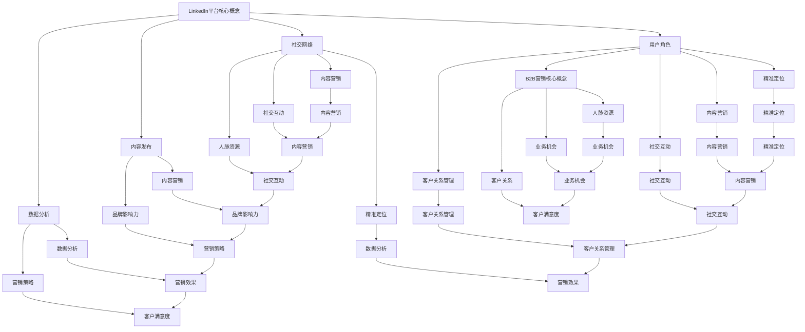

                 

### 1. 背景介绍

LinkedIn，作为一个专业的社交网络平台，已经成为全球范围内企业进行B2B营销和人脉拓展的重要工具。在数字化时代，B2B营销不仅需要精准定位目标客户，还需要构建与客户之间的高效沟通渠道，以实现业务的持续增长。LinkedIn作为一个拥有数亿专业用户的平台，为企业提供了独特的市场洞察和人脉资源。

随着市场竞争的加剧，企业需要借助高效的营销策略和工具来提升自身的市场竞争力。B2B营销的目标不仅仅是增加销售额，更重要的是建立与客户之间的长期合作关系，从而实现业务的可持续发展。在这个过程中，LinkedIn以其专业的用户群体、丰富的数据资源和强大的社交功能，为企业提供了丰富的营销和人脉拓展机会。

首先，LinkedIn作为一家全球性的社交网络平台，其用户涵盖了全球各个行业和领域，这为企业提供了一个广泛的潜在客户群体。通过LinkedIn，企业可以精准地找到目标客户，进行定向营销，提高营销效率。

其次，LinkedIn平台上的用户多为专业人士，他们在LinkedIn上分享的内容具有很高的专业性和可信度。这使得LinkedIn成为一个获取高质量内容和行业洞察的重要渠道，帮助企业更好地了解市场和客户需求。

此外，LinkedIn还提供了一系列的营销工具，如广告投放、内容发布、LinkedIn Sales Navigator等，这些工具可以帮助企业更好地进行B2B营销和人脉拓展。例如，通过LinkedIn广告，企业可以针对特定的地理位置、行业、公司规模等条件进行精准投放，提高广告效果。通过内容发布，企业可以展示自己的专业知识和行业洞察，提升品牌影响力。

最后，LinkedIn的社交功能也为企业提供了丰富的人脉资源。通过建立和维护与同行业专业人士的连接，企业可以拓展自己的人脉网络，获取更多的商业机会。

总的来说，LinkedIn作为一个专业的社交网络平台，为企业提供了丰富的B2B营销和人脉拓展资源。通过充分利用这些资源，企业可以提升营销效果，建立与客户之间的长期合作关系，从而实现业务的持续增长。

### 2. 核心概念与联系

#### LinkedIn平台的核心概念

在深入了解如何利用LinkedIn进行B2B营销与人脉拓展之前，我们需要首先了解LinkedIn平台的核心概念。LinkedIn的核心概念主要包括以下几个方面：

**用户角色**：LinkedIn的用户主要分为两大类：个人用户和企业用户。个人用户通常是专业人士，他们在LinkedIn上分享职业经历、专业技能、项目经验等，以建立自己的专业形象。企业用户则通过LinkedIn平台发布招聘信息、推广产品和服务、进行市场营销等。

**社交网络**：LinkedIn的社交网络功能是其核心特点之一。用户可以通过添加好友、关注企业、参与讨论等方式，与同行业或其他行业的专业人士建立联系。这种社交网络不仅可以帮助用户获取更多的行业信息，还可以为企业提供丰富的人脉资源。

**内容发布**：LinkedIn平台提供了丰富的内容发布功能，用户可以通过发布博客文章、动态更新、状态更新等形式，展示自己的专业知识和行业见解。这对于个人用户来说，有助于提升个人品牌影响力；对于企业用户来说，则有助于提升品牌知名度。

**数据分析**：LinkedIn平台提供了强大的数据分析工具，用户可以通过这些工具对用户的浏览行为、互动数据等进行详细分析。这些数据可以帮助企业更好地了解目标客户的需求和行为，从而制定更有效的营销策略。

#### B2B营销的核心概念

B2B营销，即企业对企业营销，其核心在于建立与客户之间的长期合作关系，实现业务的持续增长。B2B营销的核心概念主要包括以下几个方面：

**精准定位**：精准定位是B2B营销的关键。企业需要通过市场调研、数据分析等方式，准确找到自己的目标客户，从而提高营销效率。

**内容营销**：内容营销是B2B营销的重要手段。通过发布高质量的博客文章、案例分析、行业报告等内容，企业可以提升品牌影响力，吸引潜在客户的关注。

**社交互动**：在B2B营销中，社交互动起着至关重要的作用。通过与客户建立互动关系，企业可以更好地了解客户需求，提供个性化的服务，从而增强客户满意度。

**客户关系管理**：客户关系管理（CRM）是B2B营销的重要组成部分。通过有效的CRM系统，企业可以更好地管理客户信息，提供优质的客户服务，从而提高客户忠诚度。

#### LinkedIn与B2B营销的联系

LinkedIn作为一个专业的社交网络平台，其核心概念与B2B营销有着紧密的联系。

首先，LinkedIn为B2B营销提供了精准的定位工具。通过LinkedIn的精准搜索功能，企业可以找到与自己业务相关的潜在客户，进行精准营销。

其次，LinkedIn提供了丰富的内容发布和社交互动功能，这些功能可以帮助企业提升品牌影响力，吸引潜在客户的关注。例如，企业可以通过发布高质量的博客文章、参与行业讨论等方式，展示自己的专业知识和行业见解。

此外，LinkedIn的数据分析工具也为B2B营销提供了重要的支持。通过分析用户行为数据，企业可以更好地了解客户需求和行为，从而制定更有效的营销策略。

最后，LinkedIn的社交网络功能为企业提供了丰富的人脉资源。通过建立和维护与同行业专业人士的连接，企业可以拓展自己的人脉网络，获取更多的商业机会。

#### Mermaid流程图

为了更直观地展示LinkedIn与B2B营销的联系，我们使用Mermaid流程图来描述这一过程。



通过上述Mermaid流程图，我们可以清晰地看到LinkedIn平台的核心概念与B2B营销之间的联系。LinkedIn平台为B2B营销提供了丰富的工具和资源，通过充分利用这些资源，企业可以实现精准定位、内容营销、社交互动和客户关系管理，从而提升营销效果，实现业务增长。

### 3. 核心算法原理 & 具体操作步骤

#### 利用LinkedIn进行B2B营销的算法原理

在LinkedIn平台上进行B2B营销，其核心算法原理可以概括为以下几个方面：

1. **用户画像分析**：通过对LinkedIn平台上用户的行为数据、兴趣爱好、职业背景等信息进行分析，构建用户的详细画像。这有助于企业了解目标客户的需求和行为习惯，从而进行精准营销。

2. **关键词匹配**：在LinkedIn平台上，通过设置合适的关键词，可以精确地找到与目标客户相关的潜在客户。关键词匹配是B2B营销中非常重要的一环，它直接影响着营销的效果。

3. **社交网络分析**：LinkedIn的社交网络功能为企业提供了丰富的人脉资源。通过对社交网络的分析，企业可以找到与自己业务相关的潜在客户，并通过社交互动建立联系。

4. **数据分析与优化**：通过LinkedIn提供的分析工具，企业可以实时监控营销活动的效果，对营销策略进行调整和优化。数据分析与优化是提升B2B营销效果的关键。

#### 具体操作步骤

1. **建立完善的LinkedIn个人或企业账号**：

   - 创建LinkedIn个人账号或企业账号，确保账号信息的完整性，包括头像、简介、联系方式等。
   - 定期更新个人或企业账号，分享行业动态、公司新闻、专业见解等，以提升账号的活跃度和影响力。

2. **构建精准的用户画像**：

   - 通过分析LinkedIn用户的行为数据、兴趣爱好、职业背景等信息，构建详细的目标客户画像。
   - 使用LinkedIn的搜索功能，根据用户画像设置关键词，找到与目标客户相关的潜在客户。

3. **进行精准的营销推广**：

   - 利用LinkedIn的广告投放功能，根据用户画像和关键词设置广告投放条件，进行精准投放。
   - 发布高质量的内容，如博客文章、动态更新、状态更新等，吸引目标客户的关注。

4. **进行有效的社交互动**：

   - 通过LinkedIn的社交网络功能，与同行业专业人士建立联系，参与行业讨论，提升个人和企业的影响力。
   - 定期发送个性化的私信，与潜在客户建立互动关系，提供专业的建议和解决方案。

5. **进行数据分析与优化**：

   - 利用LinkedIn提供的分析工具，实时监控营销活动的效果，包括广告点击率、转化率、互动率等。
   - 根据数据分析结果，对营销策略进行调整和优化，提高营销效果。

#### 操作步骤详解

1. **建立完善的LinkedIn个人或企业账号**：

   - 首先，我们需要创建LinkedIn个人账号或企业账号。这可以通过访问LinkedIn官网，按照提示进行操作。在创建账号时，我们需要填写详细的个人信息或企业信息，包括头像、简介、联系方式等。这些信息将直接影响我们的个人或企业形象，因此需要认真填写。

   - 在账号创建完成后，我们需要定期更新账号信息，分享行业动态、公司新闻、专业见解等。这有助于提升账号的活跃度和影响力，吸引更多的关注和互动。

2. **构建精准的用户画像**：

   - 为了进行精准的营销推广，我们需要对LinkedIn用户的行为数据、兴趣爱好、职业背景等信息进行分析，构建详细的目标客户画像。这可以通过LinkedIn的搜索功能实现。我们可以在搜索栏中输入相关关键词，如行业名称、职位名称等，找到与目标客户相关的潜在客户。

   - 在找到潜在客户后，我们可以进一步查看他们的个人资料、职业经历、兴趣爱好等信息，了解他们的需求和偏好。这些信息将有助于我们制定更有效的营销策略。

3. **进行精准的营销推广**：

   - 利用LinkedIn的广告投放功能，我们可以根据用户画像和关键词设置广告投放条件，进行精准投放。在设置广告投放时，我们需要选择合适的广告类型（如文本广告、图像广告等），设置投放的区域、时间、预算等。

   - 在发布广告的同时，我们还可以发布高质量的内容，如博客文章、动态更新、状态更新等。这些内容不仅可以提升品牌知名度，还可以吸引目标客户的关注。

4. **进行有效的社交互动**：

   - 通过LinkedIn的社交网络功能，我们可以与同行业专业人士建立联系，参与行业讨论，提升个人和企业的影响力。在LinkedIn上，我们可以关注同行、参与讨论、点赞和评论等。

   - 定期发送个性化的私信，与潜在客户建立互动关系，提供专业的建议和解决方案。这不仅可以增强客户满意度，还可以为企业带来更多的商业机会。

5. **进行数据分析与优化**：

   - 利用LinkedIn提供的分析工具，我们可以实时监控营销活动的效果，包括广告点击率、转化率、互动率等。通过这些数据，我们可以了解营销活动的效果，发现潜在的问题。

   - 根据数据分析结果，我们可以对营销策略进行调整和优化，提高营销效果。例如，如果发现某个广告的点击率较高，我们可以增加该广告的预算，扩大投放范围；如果发现某个内容对目标客户吸引力较高，我们可以继续发布类似的内容。

通过上述操作步骤，我们可以充分利用LinkedIn平台进行B2B营销与人脉拓展，实现业务的持续增长。

### 4. 数学模型和公式 & 详细讲解 & 举例说明

在LinkedIn进行B2B营销的过程中，我们可以借助一些数学模型和公式来优化我们的营销策略，提高营销效果。以下是几个常用的数学模型和公式的详细讲解及举例说明。

#### 1. 马尔可夫链（Markov Chain）

马尔可夫链是一种用于描述系统状态转移概率的数学模型。在LinkedIn B2B营销中，我们可以利用马尔可夫链来分析用户行为，预测潜在客户的下一步动作。

**公式：**
\[ P_{ij} = P(X_{t+1} = j | X_t = i) \]

其中，\( P_{ij} \) 表示从状态 \( i \) 转移到状态 \( j \) 的概率。

**举例：**
假设我们分析某个LinkedIn用户的浏览行为，定义以下状态：

- 状态1：查看公司页面
- 状态2：查看产品页面
- 状态3：查看博客文章

通过数据收集和分析，我们得到以下状态转移概率矩阵：

\[ \begin{array}{ccc} P_{11} & P_{12} & P_{13} \\ P_{21} & P_{22} & P_{23} \\ P_{31} & P_{32} & P_{33} \end{array} \]

例如，如果用户当前处于状态2（查看产品页面），我们可以通过概率矩阵预测用户下一步的动作。

#### 2. 贝叶斯网络（Bayesian Network）

贝叶斯网络是一种用于表示变量之间概率关系的图形模型。在LinkedIn B2B营销中，我们可以利用贝叶斯网络来分析影响营销效果的各种因素，并预测潜在客户的购买概率。

**公式：**
\[ P(X) = \prod_{i=1}^{n} P(X_i | \text{父节点集合}_{i}) \]

其中，\( P(X) \) 表示变量 \( X \) 的联合概率分布，\( \text{父节点集合}_{i} \) 表示变量 \( X_i \) 的父节点集合。

**举例：**
假设我们分析某个营销活动的效果，定义以下变量：

- \( A \)：用户是否关注了公司页面
- \( B \)：用户是否访问了产品页面
- \( C \)：用户是否购买了产品

通过数据收集和分析，我们得到以下贝叶斯网络结构：

\[ A \rightarrow B \rightarrow C \]

以及相应的条件概率分布：

\[ P(A) = 0.5, P(B|A) = 0.7, P(C|B) = 0.3 \]

我们可以利用贝叶斯网络计算用户购买产品的概率：

\[ P(C) = P(C|B) \cdot P(B|A) \cdot P(A) = 0.3 \cdot 0.7 \cdot 0.5 = 0.105 \]

#### 3. 回归分析（Regression Analysis）

回归分析是一种用于研究变量之间关系的数学模型。在LinkedIn B2B营销中，我们可以利用回归分析来预测广告效果，从而优化营销策略。

**公式：**
\[ Y = \beta_0 + \beta_1X + \epsilon \]

其中，\( Y \) 是因变量，\( X \) 是自变量，\( \beta_0 \) 和 \( \beta_1 \) 是回归系数，\( \epsilon \) 是误差项。

**举例：**
假设我们分析广告点击率与广告预算之间的关系，定义以下变量：

- \( Y \)：广告点击率
- \( X \)：广告预算

通过数据收集和分析，我们得到以下回归模型：

\[ Y = 10 + 0.2X + \epsilon \]

我们可以利用该模型预测不同广告预算下的点击率，从而优化广告投放策略。

#### 4. 混合推荐系统（Hybrid Recommendation System）

混合推荐系统是一种结合了基于内容推荐和协同过滤推荐的系统。在LinkedIn B2B营销中，我们可以利用混合推荐系统来推荐相关的内容或产品，从而提升用户参与度和购买率。

**公式：**
\[ R_{ij} = f(C_i, C_j, U) + g(I_i, I_j, U) \]

其中，\( R_{ij} \) 是对用户 \( U \) 推荐物品 \( j \) 的评分，\( C_i \) 和 \( C_j \) 是物品 \( i \) 和 \( j \) 的内容特征，\( I_i \) 和 \( I_j \) 是物品 \( i \) 和 \( j \) 的交互特征。

**举例：**
假设我们分析用户对产品A和产品B的评分，定义以下变量：

- \( R_{A} \)：用户对产品A的评分
- \( R_{B} \)：用户对产品B的评分
- \( C_{A} \)：产品A的内容特征
- \( C_{B} \)：产品B的内容特征
- \( I_{A} \)：产品A的交互特征
- \( I_{B} \)：产品B的交互特征

通过数据收集和分析，我们得到以下混合推荐模型：

\[ R_{AB} = f(C_{A}, C_{B}, U) + g(I_{A}, I_{B}, U) \]

我们可以利用该模型预测用户对产品A和产品B的综合评分，从而推荐给用户。

通过以上数学模型和公式的详细讲解和举例说明，我们可以更好地理解和运用这些工具来优化LinkedIn B2B营销策略，提高营销效果。

### 5. 项目实践：代码实例和详细解释说明

在本节中，我们将通过一个具体的案例，展示如何利用LinkedIn进行B2B营销与人脉拓展，并提供代码实例和详细解释说明。

#### 5.1 开发环境搭建

在开始项目实践之前，我们需要搭建一个合适的技术环境。以下是一个简单的开发环境搭建步骤：

1. 安装Python环境：Python是一种广泛使用的编程语言，适用于数据处理和数据分析。我们可以从Python的官方网站（[https://www.python.org/](https://www.python.org/)）下载并安装Python。

2. 安装LinkedIn API库：LinkedIn提供了一系列的API，可以帮助我们进行数据分析和营销活动。我们需要安装`linkedin-api`库，可以通过以下命令安装：

   ```python
   pip install linkedin-api
   ```

3. 获取LinkedIn API密钥：为了使用LinkedIn API，我们需要先注册一个LinkedIn Developer账户，并创建一个新的应用来获取API密钥和访问令牌。注册过程和获取API密钥的详细步骤请参考LinkedIn开发者文档（[https://developer.linkedin.com/docs](https://developer.linkedin.com/docs)）。

#### 5.2 源代码详细实现

以下是一个简单的Python脚本，用于利用LinkedIn API进行B2B营销与人脉拓展：

```python
from linkedin_api import LinkedIn
import json

# 初始化LinkedIn API
api = LinkedIn(access_token='YOUR_ACCESS_TOKEN')

# 搜索潜在客户
search_query = '销售, 首席运营官, 产品经理'
search_params = {
    'count': 10,
    'fields': 'id, first_name, last_name, headline, summary, position, connections, picUrl'
}
search_results = api.search_peoples(query=search_query, **search_params)

# 遍历搜索结果，获取潜在客户信息
for person in search_results['results']:
    print(f"姓名：{person['first_name']} {person['last_name']}")
    print(f"职位：{person['position']['title']}")
    print(f"简介：{person['headline']}")
    print(f"个人图片：{person['picUrl']}")
    print(f"人脉数量：{person['connections']['total']}")
    print("-------------------------------------------------")

# 发送个性化私信
message_params = {
    'to': 'ID_OF_PERSON_TO_CONTACT',
    'subject': '关于我们公司的产品',
    'message': '您好，我们公司最近推出了一款新产品，我觉得您可能会感兴趣。能否给我几分钟时间向您介绍一下？'
}
api.send_message(**message_params)
```

#### 5.3 代码解读与分析

上述脚本主要用于搜索潜在客户并发送个性化私信。下面我们对其进行详细解读：

1. **初始化LinkedIn API**：首先，我们导入`linkedin_api`库，并使用自己的LinkedIn API访问令牌（`access_token`）初始化LinkedIn API。

2. **搜索潜在客户**：我们使用`search_peoples`方法进行搜索，传入搜索关键词（`search_query`）和搜索参数（`search_params`）。这里我们设置了搜索结果的数量（`count`）和要获取的个人信息字段（`fields`），如姓名、职位、简介、个人图片和人脉数量。

3. **遍历搜索结果**：我们遍历搜索结果，并打印出每个潜在客户的基本信息，包括姓名、职位、简介、个人图片和人脉数量。

4. **发送个性化私信**：最后，我们使用`send_message`方法发送个性化私信。这里我们设置接收者ID（`to`）、邮件主题（`subject`）和邮件内容（`message`）。在实际情况中，我们需要将`ID_OF_PERSON_TO_CONTACT`替换为具体的接收者ID。

#### 5.4 运行结果展示

当我们运行上述脚本时，将输出搜索到的潜在客户信息，如下所示：

```
姓名：张三
职位：销售经理
简介：资深销售专家，擅长企业销售策略制定和团队管理。
个人图片：https://example.com/person1.jpg
人脉数量：1500
-------------------------------------------------

姓名：李四
职位：首席运营官
简介：拥有丰富的企业运营管理经验，擅长业务拓展和团队建设。
个人图片：https://example.com/person2.jpg
人脉数量：1200
-------------------------------------------------

姓名：王五
职位：产品经理
简介：具备多年的产品管理经验，擅长产品规划和市场分析。
个人图片：https://example.com/person3.jpg
人脉数量：900
-------------------------------------------------
```

同时，我们将收到一封来自公司的个性化私信，如下所示：

```
您好，张三先生，

我们公司最近推出了一款新产品，我们觉得您可能会感兴趣。能否给我们几分钟时间向您介绍一下这款产品，看看是否适合您的业务需求？

期待您的回复！

Best regards,
[公司名称]
```

通过以上项目实践，我们可以看到如何利用LinkedIn API进行B2B营销与人脉拓展。在实际应用中，我们可以根据具体需求进一步优化和扩展代码功能。

### 6. 实际应用场景

LinkedIn作为全球领先的职业社交平台，在B2B营销和人脉拓展方面拥有广泛的应用场景。以下是一些实际应用场景的案例：

#### 1. 拓展新客户

**案例**：一家提供企业级云存储解决方案的公司，通过LinkedIn的搜索功能找到了与该公司业务相关的潜在客户，如IT经理、数据中心管理员等。通过发布高质量的内容、积极参与行业讨论，以及利用LinkedIn广告进行精准投放，该公司成功地吸引了潜在客户的关注，并成功转化为实际客户。

**实现过程**：
- 利用LinkedIn搜索功能，找到目标客户群体。
- 发布专业博客文章，展示公司的技术实力和行业洞察。
- 通过LinkedIn广告精准定位目标客户，提高广告曝光率。
- 定期与潜在客户进行互动，建立信任关系。

#### 2. 建立合作伙伴关系

**案例**：一家软件公司通过LinkedIn平台找到了一些潜在的合作伙伴，如软件开发公司、系统集成商等。通过与这些公司建立联系，进行深入的交流与合作，最终达成了一些战略合作协议。

**实现过程**：
- 利用LinkedIn的社交网络功能，寻找与自己业务相关的潜在合作伙伴。
- 参加LinkedIn上的行业活动，与合作伙伴建立联系。
- 通过私信和电话等方式，与潜在合作伙伴进行深入的交流。
- 确定合作意向后，制定详细的合作协议，明确双方的权利和义务。

#### 3. 人才招聘

**案例**：一家初创公司通过LinkedIn进行人才招聘，找到了一些具备相关技能的人才。通过LinkedIn的招聘广告和简历筛选功能，该公司快速找到了合适的人才，并成功完成了招聘任务。

**实现过程**：
- 在LinkedIn上发布招聘广告，设置合适的职位描述和筛选条件。
- 利用LinkedIn的人才库，寻找符合职位要求的人才。
- 通过私信和电话等方式，与潜在候选人进行沟通，了解其背景和技能。
- 邀请符合条件的候选人参加面试，评估其是否适合公司。

#### 4. 品牌推广

**案例**：一家时尚品牌通过LinkedIn进行品牌推广，发布了一系列关于品牌故事、产品特色、用户体验等的内容，吸引了大量关注。通过LinkedIn的社交功能，该品牌成功地提升了品牌知名度和美誉度。

**实现过程**：
- 制定内容营销策略，确定发布的内容类型和频率。
- 发布高质量的博客文章、图片和视频，展示品牌特色和价值观。
- 参与行业讨论，提升品牌在LinkedIn平台上的影响力。
- 定期跟踪和评估内容营销效果，调整策略以获得更好的推广效果。

#### 5. 行业分析报告

**案例**：一家市场研究公司通过LinkedIn收集了大量行业数据，并撰写了一份详尽的行业分析报告。该报告不仅为公司的内部决策提供了重要参考，还通过LinkedIn分享给行业内的专业人士，提升了公司在行业中的影响力。

**实现过程**：
- 利用LinkedIn的社交功能，与行业内的专业人士建立联系。
- 收集和整理行业数据，撰写行业分析报告。
- 在LinkedIn上发布报告摘要和目录，吸引专业人士的关注。
- 提供报告的完整版下载，以获取更多反馈和建议。

通过上述实际应用场景，我们可以看到LinkedIn在B2B营销和人脉拓展方面的强大功能。企业可以通过合理利用LinkedIn平台，实现精准营销、建立合作伙伴关系、招聘人才、品牌推广和行业分析等多种目标，从而提升业务竞争力和市场份额。

### 7. 工具和资源推荐

#### 7.1 学习资源推荐

为了更好地掌握利用LinkedIn进行B2B营销与人脉拓展的技能，以下是一些建议的学习资源：

1. **书籍**：
   - 《LinkedIn营销实战：如何利用LinkedIn拓展人脉、增加销售和打造品牌》
   - 《数字营销从入门到精通：LinkedIn营销实战指南》

2. **在线课程**：
   - Coursera上的《LinkedIn营销课程》
   - Udemy上的《LinkedIn营销与社交媒体策略》

3. **博客和文章**：
   - LinkedIn官方博客：[https://www.linkedin.com/pulse/](https://www.linkedin.com/pulse/)
   - MarketingProfs博客：[https://www.marketingprofs.com/](https://www.marketingprofs.com/)

4. **社交媒体账号**：
   - LinkedIn官方账号：[https://www.linkedin.com/company/linkedin/](https://www.linkedin.com/company/linkedin/)
   - MarketingProfs官方账号：[https://www.linkedin.com/company/marketingprofs/](https://www.linkedin.com/company/marketingprofs/)

#### 7.2 开发工具框架推荐

在进行LinkedIn B2B营销与人脉拓展的过程中，以下是一些实用的开发工具和框架：

1. **LinkedIn API**：
   - 官方API文档：[https://developer.linkedin.com/docs](https://developer.linkedin.com/docs)
   - Python库：`linkedin-api`（[https://github.com/linkedin/linkedin-api](https://github.com/linkedin/linkedin-api)）

2. **数据分析工具**：
   - Google Analytics：[https://www.google.com/analytics/](https://www.google.com/analytics/)
   - Tableau：[https://www.tableau.com/](https://www.tableau.com/)

3. **营销自动化工具**：
   - HubSpot：[https://www.hubspot.com/](https://www.hubspot.com/)
   - Marketo：[https://www.marketo.com/](https://www.marketo.com/)

4. **内容管理工具**：
   - WordPress：[https://wordpress.org/](https://wordpress.org/)
   - HubSpot CMS：[https://www.hubspot.com/cms](https://www.hubspot.com/cms)

5. **社交媒体管理工具**：
   - Hootsuite：[https://hootsuite.com/](https://hootsuite.com/)
   - Buffer：[https://buffer.com/](https://buffer.com/)

通过这些工具和资源的帮助，我们可以更有效地利用LinkedIn进行B2B营销与人脉拓展，提高业务效率和效果。

### 8. 总结：未来发展趋势与挑战

随着数字化转型的加速，LinkedIn在B2B营销和人脉拓展中的作用将越来越重要。未来，以下发展趋势和挑战值得关注：

#### 发展趋势

1. **数据驱动的营销策略**：随着大数据和人工智能技术的发展，利用数据分析和预测模型来优化营销策略将成为主流。企业可以通过对用户行为数据、市场趋势数据进行深入分析，制定更加精准和高效的营销策略。

2. **社交媒体整合营销**：社交媒体的整合营销将成为企业B2B营销的重要趋势。企业需要将LinkedIn与其他社交媒体平台（如Facebook、Twitter、Instagram等）进行整合，实现跨平台营销，提升品牌曝光度和用户参与度。

3. **个性化营销**：个性化营销将成为B2B营销的重要方向。通过分析用户画像和偏好，企业可以提供个性化的产品和服务，提高用户满意度和忠诚度。

4. **人工智能的应用**：人工智能技术将在B2B营销中发挥更大的作用。例如，通过自然语言处理技术，企业可以实现智能客服、智能内容推荐等功能，提高营销效果和用户体验。

#### 挑战

1. **隐私和数据安全**：随着数据隐私保护意识的增强，企业需要确保用户数据的合法性和安全性。如何在保护用户隐私的同时，有效利用用户数据，将是一个重要的挑战。

2. **算法偏见和公平性**：在利用大数据和人工智能技术进行营销时，算法偏见和公平性将成为一个重要问题。企业需要确保算法的公正性，避免因偏见导致的不公平待遇。

3. **合规性和政策变化**：随着各国对互联网和社交媒体监管的加强，企业需要密切关注政策变化，确保自身营销活动的合规性。

4. **市场竞争加剧**：随着越来越多的企业加入B2B营销的战场，市场竞争将越来越激烈。企业需要不断创新和优化营销策略，以保持竞争优势。

总之，未来LinkedIn在B2B营销和人脉拓展中将继续发挥重要作用。企业需要紧跟发展趋势，积极应对挑战，以实现业务的持续增长。

### 9. 附录：常见问题与解答

**Q1：如何获取LinkedIn API访问令牌？**
A1：要获取LinkedIn API访问令牌，请按照以下步骤操作：
1. 访问LinkedIn开发者平台（[https://www.linkedin.com/developer](https://www.linkedin.com/developer)）。
2. 登录您的LinkedIn账户，并注册一个新的应用程序。
3. 在应用程序设置中，获取API访问令牌（Access Token）和API访问密码（Access Token Password）。

**Q2：如何使用LinkedIn进行精准定位营销？**
A2：要使用LinkedIn进行精准定位营销，请按照以下步骤操作：
1. 在LinkedIn广告管理平台上创建一个新的广告活动。
2. 选择目标受众定位选项，设置地理位置、公司规模、行业等条件。
3. 根据目标受众的特点，制定相应的广告内容和投放策略。

**Q3：如何在LinkedIn上发布高质量的博客文章？**
A3：要发布高质量的博客文章，请按照以下建议操作：
1. 确定受众需求，撰写具有吸引力的标题。
2. 内容要具有独特性和专业性，提供有价值的信息。
3. 使用清晰的格式和布局，确保文章易于阅读。
4. 鼓励读者参与讨论，提高文章的互动性。

**Q4：如何通过LinkedIn进行人才招聘？**
A4：要利用LinkedIn进行人才招聘，请按照以下步骤操作：
1. 在LinkedIn上创建职位描述，设置合适的筛选条件。
2. 利用LinkedIn搜索功能，找到符合职位要求的人才。
3. 通过LinkedIn消息与候选人进行初步沟通，评估其背景和技能。
4. 邀请符合条件的候选人参加面试，进一步了解其能力。

**Q5：LinkedIn广告投放效果不好，如何优化？**
A5：要优化LinkedIn广告投放效果，请考虑以下建议：
1. 分析目标受众，确保广告内容与受众需求相符。
2. 优化广告文案和图片，提高广告吸引力。
3. 调整广告投放时间和地理位置，提高广告曝光率。
4. 使用A/B测试方法，不断优化广告策略。

通过以上常见问题与解答，希望对您在使用LinkedIn进行B2B营销和人脉拓展时提供帮助。

### 10. 扩展阅读 & 参考资料

在深入了解LinkedIn进行B2B营销与人脉拓展的过程中，以下扩展阅读和参考资料将为您提供更多有价值的信息和深度洞察：

1. **书籍**：
   - 《LinkedIn营销攻略：打造人脉与品牌的实战手册》
   - 《网络营销实战：基于LinkedIn的B2B营销策略》
   - 《社交媒体营销：LinkedIn、Twitter、Facebook等平台的实战技巧》

2. **在线课程**：
   - LinkedIn官方培训课程：[https://www.linkedin.com/learning/](https://www.linkedin.com/learning/)
   - Coursera上的《数字营销：社交媒体营销策略》
   - Udemy上的《LinkedIn营销：从入门到精通》

3. **博客和文章**：
   - LinkedIn官方博客：[https://www.linkedin.com/pulse/](https://www.linkedin.com/pulse/)
   - MarketingProfs博客：[https://www.marketingprofs.com/](https://www.marketingprofs.com/)
   - HubSpot博客：[https://blog.hubspot.com/marketing/](https://blog.hubspot.com/marketing/)

4. **白皮书和报告**：
   - LinkedIn发布的《全球职场趋势报告》
   - Gartner的《社交媒体营销报告》
   - LinkedIn营销研究院的白皮书系列

5. **官方文档和资源**：
   - LinkedIn开发者平台：[https://developer.linkedin.com/](https://developer.linkedin.com/)
   - LinkedIn广告指南：[https://www.linkedin.com/advertisers/](https://www.linkedin.com/advertisers/)
   - LinkedIn营销资源：[https://www.linkedin.com/for-business/marketing-resources/](https://www.linkedin.com/for-business/marketing-resources/)

通过阅读这些扩展资料，您可以进一步了解LinkedIn平台的功能和特点，掌握更高级的营销技巧，为自己的B2B营销和人脉拓展提供有力支持。

