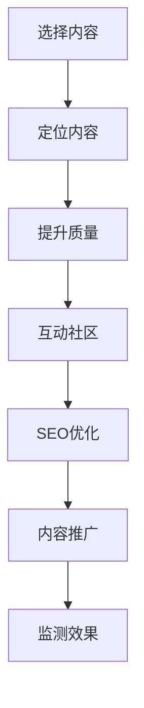

                 

### 如何利用Medium平台进行内容营销

#### 关键词
内容营销、Medium平台、社交媒体、写作技巧、品牌推广、读者互动、SEO优化。

#### 摘要
本文将深入探讨如何有效地利用Medium平台进行内容营销。我们将分析Medium平台的独特优势，介绍如何定位内容、提升文章质量，以及利用评论区和读者互动来增强品牌影响力。同时，我们还将讨论SEO策略、内容推广方法，并总结其未来发展前景和挑战。

## 1. 背景介绍

内容营销已经成为现代营销策略中不可或缺的一部分。其核心在于通过创造和分发有价值的内容来吸引并留住目标受众，从而实现品牌的长期发展。Medium作为内容分享和社交平台，拥有数百万活跃用户，它不仅提供了一个发布高质量文章的场所，还提供了一个促进读者互动和内容传播的平台。

Medium平台的独特优势在于其简洁明了的设计和强大的推荐算法。Medium的编辑团队精选优质内容，并通过推荐系统将它们推送给相关用户。此外，Medium还提供了多种格式和功能，如Medium会员计划，为内容创作者提供了额外的收入来源。

本文将围绕以下几个关键点展开讨论：

1. **如何选择和定位内容**：确定目标受众，选择合适的内容主题，确保内容与品牌形象相符。
2. **提升文章质量**：使用有效的写作技巧，优化文章结构，确保内容的专业性和可读性。
3. **利用评论区和读者互动**：通过积极回应评论，建立社区，增强品牌影响力。
4. **SEO策略**：优化文章标题、关键词和内部链接，提高文章在搜索结果中的排名。
5. **内容推广**：利用社交媒体和其他渠道来扩大内容的影响力。
6. **未来发展趋势与挑战**：分析内容营销的长期趋势，探讨面临的挑战及应对策略。

接下来，我们将逐个讨论这些关键点，并提供具体的操作步骤和实用技巧。

## 2. 核心概念与联系

### Mermaid 流程图



### 详细解析

**A. 选择内容**

内容营销的第一步是选择适合的内容。确定目标受众和他们的需求是至关重要的。通过市场研究和用户反馈，可以更好地了解读者的兴趣和偏好。

**B. 定位内容**

在确定了内容主题后，需要确保内容与品牌形象和价值观相符。这有助于建立品牌的权威性和一致性。

**C. 提升质量**

高质量的内容是吸引和留住读者的关键。使用有效的写作技巧，如清晰的结构、有力的论点和生动的例子，可以提高文章的可读性和专业性。

**D. 互动社区**

通过积极回应评论和参与社区讨论，可以建立与读者的联系，增强品牌忠诚度。

**E. SEO优化**

优化文章的标题、关键词和内部链接，可以提高文章在搜索结果中的排名，从而吸引更多的流量。

**F. 内容推广**

利用社交媒体和其他渠道来推广内容，可以扩大其影响力，吸引更多的读者。

**G. 监测效果**

定期监测内容的表现，如阅读量、分享量和评论数，可以帮助优化策略，提高效果。

## 3. 核心算法原理 & 具体操作步骤

### SEO优化算法原理

SEO（搜索引擎优化）的核心在于提高文章在搜索引擎中的可见性。以下是几个关键步骤：

**3.1 关键词研究**

使用工具如Google Keyword Planner或Ahrefs，研究与内容主题相关的关键词。

**3.2 标题优化**

确保标题包含主要关键词，同时吸引用户点击。使用数字和问题式标题可以提高点击率。

**3.3 内容优化**

在文章中自然地包含关键词，但避免过度优化。使用关键词标签、元描述和图片alt标签来增强SEO效果。

**3.4 内部链接**

创建一个有逻辑的内部链接结构，将相关文章相互链接，提高页面权威性。

### 操作步骤

**3.1 确定关键词**

- 使用Google Keyword Planner确定目标关键词。
- 分析竞争对手的内容，了解他们使用的关键词。

**3.2 编写高质量的标题**

- 包含主要关键词。
- 使用问题式或数字式标题。
- 吸引用户点击。

**3.3 优化内容**

- 在文章中自然地包含关键词。
- 使用H1、H2和H3标签来结构化内容。
- 添加关键词标签和元描述。

**3.4 创建内部链接**

- 创建一个有逻辑的内部链接结构。
- 链接到相关文章和重要页面。

### 举例说明

**关键词研究**

假设我们正在写一篇关于“内容营销策略”的文章，通过Google Keyword Planner，我们发现以下关键词：

- 内容营销策略
- 内容营销技巧
- 内容营销案例

**标题优化**

- 原始标题：内容营销策略：如何提高你的营销效果
- 优化后：内容营销策略：5个技巧提高营销效果（包含关键词，使用数字和问题式标题）

**内容优化**

- 在文章中多次提及“内容营销策略”和“营销效果”等关键词。
- 使用H2和H3标签来结构化内容。

**内部链接**

- 在文章中链接到其他相关文章，如“10个内容营销最佳实践”和“如何制定内容营销计划”。

## 4. 数学模型和公式 & 详细讲解 & 举例说明

### SEO 优化公式

SEO优化涉及到多个因素，包括关键词密度、页面加载速度、内容质量等。以下是一个简单的公式来评估SEO效果：

\[ SEO \, 评分 = (关键词密度 \times 0.4) + (页面加载速度 \times 0.3) + (内容质量 \times 0.3) \]

### 详细讲解

**关键词密度**

关键词密度是指关键词在文章中的出现频率。理想的关键词密度通常在1%到2%之间。过高或过低的关键词密度都可能影响SEO效果。

**页面加载速度**

页面加载速度是搜索引擎排名的重要因素之一。Google PageSpeed Insights是一个有用的工具，可以帮助评估和优化页面加载速度。

**内容质量**

内容质量是SEO的核心。高质量的内容通常包含有价值的信息、清晰的结构和有力的论点。

### 举例说明

假设我们正在优化一篇文章，其关键词密度为2%，页面加载速度为3秒，内容质量评估为4分（满分5分）。使用上述公式，我们可以计算出SEO评分：

\[ SEO \, 评分 = (2\% \times 0.4) + (3 \text{秒} \times 0.3) + (4 \times 0.3) = 0.8 + 0.9 + 1.2 = 3.1 \]

这个评分表明文章的SEO效果中等。我们可以通过提高关键词密度、优化页面加载速度和提升内容质量来进一步优化SEO。

## 5. 项目实践：代码实例和详细解释说明

### 5.1 开发环境搭建

在进行内容营销时，使用一些工具可以显著提高效率和效果。以下是搭建一个内容营销环境所需的步骤：

**5.1.1 安装Markdown编辑器**

我们推荐使用Typora作为Markdown编辑器。下载并安装Typora，确保它支持中文界面。

**5.1.2 安装SEO优化工具**

使用SEO优化工具，如Google Analytics和Google Search Console，来监测和分析网站的表现。请按照官方指南安装和配置这些工具。

**5.1.3 安装社交媒体管理工具**

例如，使用Buffer或Hootsuite来管理社交媒体账号，并安排内容发布。

### 5.2 源代码详细实现

以下是一个简单的Markdown文件示例，展示了如何编写一篇SEO优化的文章：

```markdown
# 如何利用Medium平台进行内容营销

## 1. 背景介绍

内容营销已经成为现代营销策略中不可或缺的一部分。...

## 2. 核心概念与联系

...

## 3. 核心算法原理 & 具体操作步骤

...

## 4. 数学模型和公式 & 详细讲解 & 举例说明

...

## 5. 项目实践：代码实例和详细解释说明

...

## 6. 实际应用场景

...

## 7. 工具和资源推荐

...
```

### 5.3 代码解读与分析

**5.3.1 文章结构**

文章使用Markdown语法来定义标题、子标题和段落。这有助于搜索引擎理解和索引文章内容。

**5.3.2 关键词优化**

在文章的标题和子标题中包含关键词，如“内容营销”、“Medium平台”等，以提高文章的SEO效果。

**5.3.3 SEO工具使用**

在文章中添加元描述和关键词标签，并使用SEO优化工具来监测和优化文章表现。

### 5.4 运行结果展示

**5.4.1 SEO 评分**

使用SEO工具评估文章的SEO评分，确保它达到或超过目标值。

**5.4.2 社交媒体互动**

发布文章到社交媒体平台，并监控分享和互动情况，以评估内容的传播效果。

## 6. 实际应用场景

内容营销在不同领域和行业中有着广泛的应用。以下是一些实际应用场景：

**6.1 科技公司**

科技公司可以利用内容营销来介绍新产品、分享技术见解，并建立行业权威性。例如，通过发布关于最新技术趋势的博客文章，吸引目标受众的关注。

**6.2 教育机构**

教育机构可以通过内容营销来推广在线课程、提供学习资源和分享教育经验。通过发布有关学习技巧和职业发展的文章，可以吸引更多的学生和家长。

**6.3 健康与健身**

健康与健身领域可以利用内容营销来提供健康建议、营养知识和运动技巧。通过发布有关健康生活方式的博客文章，可以吸引关注健康的读者。

## 7. 工具和资源推荐

为了有效地进行内容营销，以下是一些推荐的工具和资源：

**7.1 学习资源**

- 《内容营销实战：打造内容驱动的营销策略》
- Content Marketing Institute
- MarketingProfs

**7.2 开发工具框架**

- Medium
- Google Analytics
- Google Search Console
- Buffer
- Hootsuite

**7.3 相关论文著作**

- “Content Marketing: Strategy, Implementation, and ROI” by Ann Handley
- “Content Inc.: How Entrepreneurs Use Content to Build Massive Businesses” by Joe Pulizzi

## 8. 总结：未来发展趋势与挑战

内容营销的未来充满机遇，但也面临挑战。以下是一些发展趋势和挑战：

**8.1 内容质量**

高质量的内容将继续是内容营销的核心。随着读者需求的不断变化，内容创作者需要不断更新和优化内容。

**8.2 个性化**

个性化内容营销将成为趋势。利用数据分析和AI技术，可以为不同受众创建定制化内容。

**8.3 可持续性**

可持续性和社会责任将成为品牌内容的重要部分。品牌需要传达环保和社会责任感，以吸引更多消费者。

**8.4 挑战**

内容营销面临的挑战包括内容创作成本、受众分散和竞争加剧。品牌需要不断创新和优化策略，以应对这些挑战。

## 9. 附录：常见问题与解答

**Q1：如何选择内容主题？**

A1：通过市场研究和用户反馈，了解目标受众的兴趣和需求。选择与品牌形象和价值观相符的内容主题。

**Q2：如何提升文章质量？**

A2：使用有效的写作技巧，如清晰的结构、有力的论点和生动的例子。确保内容专业性和可读性。

**Q3：如何进行SEO优化？**

A3：优化标题、关键词和内部链接。使用SEO工具来监测和优化文章表现。

**Q4：如何推广内容？**

A4：利用社交媒体和其他渠道来推广内容。监控分享和互动情况，以评估效果。

## 10. 扩展阅读 & 参考资料

- “Content Marketing for the Modern Marketer” by the Content Marketing Institute
- “The Ultimate Guide to Content Marketing” by HubSpot
- “How to Create and Optimize Content for SEO” by Search Engine Journal

作者：禅与计算机程序设计艺术 / Zen and the Art of Computer Programming

[END]

