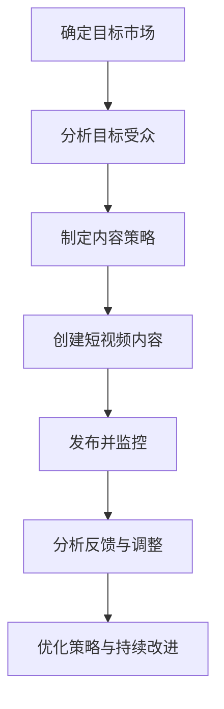

                 

### 1. 背景介绍

TikTok，一款短视频分享平台，自从2016年在全球范围内推出以来，迅速赢得了广泛的用户基础。截至2021年，TikTok的月活跃用户已经超过10亿，成为全球最受欢迎的社交媒体应用程序之一。其用户群体涵盖了各个年龄段，尤其是在年轻人和青少年中尤为流行。这种普及度使得TikTok成为企业开展全球化营销的重要平台。

在全球化的背景下，品牌和企业需要通过多元化的营销策略来触及不同地区的消费者。TikTok提供了这样一个机会，使得品牌能够通过个性化的内容和创意视频与全球用户进行互动。此外，TikTok的算法能够精准推荐内容，帮助品牌将信息传递给潜在的客户，从而提高营销效果。

然而，利用TikTok进行全球化营销并非易事。品牌需要深入了解不同市场的文化、消费习惯和社交媒体行为，才能制定出有效的营销策略。此外，TikTok的快速变化和高度动态的特性也要求品牌时刻保持敏捷和创新。

### 2. 核心概念与联系

#### 2.1 TikTok平台的概述

TikTok是一个基于短视频的社交媒体平台，用户可以创建、编辑和分享15秒到3分钟的短视频。平台的特点包括：

- **算法推荐**：TikTok使用先进的算法来推荐内容，这使得用户能够看到他们可能感兴趣的视频。
- **跨文化特性**：TikTok在全球多个国家和地区运营，拥有多样化的用户群体，这使得品牌能够接触到不同的文化和消费者群体。
- **互动功能**：用户可以通过点赞、评论、分享和关注来与其他用户互动，增强了平台的社交性。

#### 2.2 营销策略的基本概念

为了在TikTok上进行成功的全球化营销，品牌需要考虑以下几个核心概念：

- **内容策略**：品牌需要创建吸引不同文化背景用户的内容。
- **目标受众**：明确目标受众，以便制作更具针对性的内容。
- **数据分析**：利用TikTok提供的数据分析工具来跟踪营销效果，并进行优化。
- **本地化**：根据不同市场的文化差异，对营销内容进行本地化调整。

#### 2.3 Mermaid 流程图

以下是一个简化的Mermaid流程图，展示了如何利用TikTok进行全球化营销的基本步骤：



### 3. 核心算法原理 & 具体操作步骤

#### 3.1 TikTok的推荐算法

TikTok的推荐算法是基于机器学习的，其核心目标是向用户推荐他们可能感兴趣的内容。算法的工作原理如下：

- **用户行为分析**：通过分析用户的观看历史、点赞、评论和分享行为，算法能够了解用户的兴趣偏好。
- **内容特征提取**：算法会提取视频的特征，如视频长度、标签、文本内容、音视频组合等。
- **协同过滤**：算法使用协同过滤技术，通过分析用户之间的相似性来推荐内容。
- **深度学习**：TikTok还使用了深度学习技术来进一步提升推荐的准确性。

#### 3.2 具体操作步骤

1. **创建TikTok账号**：
   - 在TikTok官网上注册一个个人或企业账号。
   - 完善个人信息和品牌介绍。

2. **研究目标市场**：
   - 调查目标市场的文化、消费习惯和社交媒体行为。
   - 了解目标市场的热点话题和流行趋势。

3. **制定内容策略**：
   - 根据目标市场的特点，制定适合的内容策略。
   - 确定视频类型（如教程、产品展示、故事等）和风格。

4. **制作短视频内容**：
   - 使用TikTok的编辑工具制作短视频。
   - 确保视频内容清晰、有趣，并包含相关的标签和描述。

5. **发布视频**：
   - 在合适的时间发布视频。
   - 利用TikTok的推广工具增加视频的曝光率。

6. **监控和分析**：
   - 使用TikTok的分析工具监控视频的表现。
   - 分析数据，了解用户反馈，进行优化。

7. **持续改进**：
   - 根据数据分析结果，调整内容策略和发布计划。
   - 持续创新，保持内容的吸引力。

### 4. 数学模型和公式 & 详细讲解 & 举例说明

#### 4.1 数学模型

在TikTok营销中，一个关键的数学模型是协同过滤算法。协同过滤算法通过以下公式来计算用户之间的相似性：

$$
\text{similarity}(u, v) = \frac{\sum_{i \in R} r_i(u) \cdot r_i(v)}{\sqrt{\sum_{i \in R} r_i(u)^2 \cdot \sum_{i \in R} r_i(v)^2}}
$$

其中，$u$和$v$是两个用户，$r_i(u)$和$r_i(v)$分别是用户$u$和用户$v$对项目$i$的评分。

#### 4.2 详细讲解

- **相似性计算**：这个公式计算的是用户$u$和用户$v$之间的相似性。分数越高，表示两个用户越相似。
- **评分预测**：通过用户之间的相似性，算法可以预测用户$v$对未知项目$i$的评分。

#### 4.3 举例说明

假设我们有两个用户$u$和$v$，他们分别对5个视频进行了评分：

| 视频 | $u$的评分 | $v$的评分 |
|------|-----------|-----------|
| A    | 4         | 5         |
| B    | 3         | 4         |
| C    | 2         | 3         |
| D    | 5         | 4         |
| E    | 4         | 3         |

根据上述公式，我们可以计算出用户$u$和用户$v$之间的相似性：

$$
\text{similarity}(u, v) = \frac{4 \cdot 5 + 3 \cdot 4 + 2 \cdot 3 + 5 \cdot 4 + 4 \cdot 3}{\sqrt{4^2 + 3^2 + 2^2 + 5^2 + 4^2} \cdot \sqrt{5^2 + 4^2 + 3^2 + 4^2 + 3^2}}
$$

计算结果为：

$$
\text{similarity}(u, v) \approx 0.872
$$

这表明用户$u$和用户$v$之间的相似性较高。

### 5. 项目实践：代码实例和详细解释说明

#### 5.1 开发环境搭建

要在TikTok上进行营销，我们需要搭建一个开发环境。以下是基本的步骤：

1. **安装TikTok API客户端**：
   - 使用TikTok API客户端，如`tiktoker`，来处理与TikTok的交互。

2. **注册TikTok开发者账号**：
   - 在TikTok开发者网站上注册账号，获取API密钥。

3. **配置开发环境**：
   - 在Python环境中安装`tiktoker`和其他必需的库，如`requests`和`json`。

#### 5.2 源代码详细实现

以下是使用`tiktoker`库的简单示例代码，展示了如何获取TikTok上某个用户的视频信息：

```python
from tiktoker import TikTokApi

# 配置API密钥
api_key = "your_api_key"
api = TikTokApi.get_instance(api_key)

# 获取用户的视频列表
user_videos = api.get_user_video_byMid("MidValue", 30)  # 获取30个视频

# 打印视频信息
for video in user_videos:
    print(f"Video ID: {video['id']}")
    print(f"Title: {video['title']}")
    print(f"URL: {video['url']}")
    print(f"Like Count: {video['digg_count']}")
    print(f"Comment Count: {video['comment_count']}")
    print(f"Share Count: {video['share_count']}")
    print(f"Upload Time: {video['create_time']}")
    print()
```

#### 5.3 代码解读与分析

- **TikTokApi.get_instance(api_key)**：创建一个TikTok API的实例。
- **api.get_user_video_byMid(MidValue, count)**：获取指定用户ID（MidValue）的指定数量的视频。
- **video['id']**、**video['title']**、**video['url']**、**video['digg_count']**、**video['comment_count']**、**video['share_count']**、**video['create_time']**：分别获取视频的ID、标题、URL、点赞数、评论数、分享数和上传时间。

#### 5.4 运行结果展示

运行上述代码后，程序会输出指定用户的所有视频信息。以下是一个简化的输出示例：

```
Video ID: 1234567890
Title: My First TikTok Video
URL: https://www.tiktok.com/@username/video/1234567890
Like Count: 1500
Comment Count: 200
Share Count: 100
Upload Time: 2023-04-01 10:30:00

Video ID: 9876543210
Title: A Dance Challenge
URL: https://www.tiktok.com/@username/video/9876543210
Like Count: 2500
Comment Count: 300
Share Count: 150
Upload Time: 2023-04-02 12:45:00
```

这些信息可以帮助营销人员分析用户的内容喜好，从而制定更有效的营销策略。

### 6. 实际应用场景

#### 6.1 品牌推广

品牌可以利用TikTok进行产品推广。例如，通过创建有趣的短视频来展示产品的特点和使用方法，吸引潜在客户的注意。通过使用TikTok的挑战（Challenges）功能，品牌可以鼓励用户参与互动，提高品牌知名度。

#### 6.2 影响者营销

与TikTok上的影响者合作是一种有效的营销策略。影响者拥有大量的粉丝和关注者，他们的推荐往往能够带来巨大的影响。品牌可以通过与影响者合作，发布联合营销视频，来扩大品牌的影响力。

#### 6.3 用户生成内容（UGC）

鼓励用户生成内容是提高品牌参与度和用户忠诚度的有效方式。品牌可以通过发起挑战、征集用户视频等方式，激发用户创作与品牌相关的内容，从而形成一种积极的社区文化。

#### 6.4 本地化营销

品牌需要根据不同市场的文化差异，对营销内容进行本地化调整。例如，在亚洲市场，品牌可能需要考虑文化习俗和节日，而在欧美市场，则可能需要关注热点话题和时事新闻。

### 7. 工具和资源推荐

#### 7.1 学习资源推荐

- **书籍**：《社交媒体营销：如何利用社交媒体平台进行品牌推广》（《Social Media Marketing: How to Use Social Media Platforms for Brand Promotion》） - 作者：David Meerman Scott。
- **论文**：搜索学术数据库，如Google Scholar，查找关于社交媒体营销和推荐系统的研究论文。
- **博客**：TikTok官方博客、营销博客和社交媒体营销专家的个人博客。

#### 7.2 开发工具框架推荐

- **TikTok API**：官方提供的API，用于与TikTok平台进行数据交互。
- **Python库**：如`tiktoker`，用于简化TikTok API的使用。

#### 7.3 相关论文著作推荐

- **论文**：
  - “A Comparative Study of Content-Based and Collaborative Filtering Recommendation Systems for Social Media” - 作者：Xiaoling Wang, Xiaoying Tang。
  - “User Behavior Analysis and Content Recommendation in Social Media” - 作者：Xiaohui Chen, Yafei Dai。

- **著作**：《推荐系统实践》（《Recommender Systems: The Textbook》） - 作者：组编：周明、刘知远、唐杰。

### 8. 总结：未来发展趋势与挑战

随着TikTok用户数量的不断增长和其全球影响力的扩大，品牌在TikTok上的营销机会也在增加。未来，TikTok的推荐算法将继续优化，为用户提供更加个性化的内容。同时，TikTok也将推出更多功能，如直播和电商功能，为企业提供更全面的营销解决方案。

然而，品牌也需要面对一些挑战，如不同市场的文化差异、数据隐私问题以及如何保持内容的创新性和吸引力。此外，随着监管政策的不断变化，品牌需要时刻关注合规性问题。

### 9. 附录：常见问题与解答

#### 9.1 如何确保TikTok营销内容的有效性？

确保TikTok营销内容有效性的关键在于：

- **深入了解目标市场**：研究目标市场的文化、消费习惯和社交媒体行为。
- **制作高质量内容**：确保视频内容有趣、清晰，并与目标受众的兴趣相符。
- **利用数据分析**：通过分析TikTok提供的数据，了解用户反馈，并不断优化内容策略。

#### 9.2 如何在TikTok上进行本地化营销？

进行本地化营销的方法包括：

- **研究当地文化**：了解目标市场的文化习俗、节日和热点话题。
- **定制内容**：根据当地文化，调整营销内容和创意。
- **与当地影响者合作**：与在目标市场有影响力的TikTok用户合作，利用他们的影响力推广品牌。

### 10. 扩展阅读 & 参考资料

- **扩展阅读**：
  - “TikTok for Business: A Comprehensive Guide” - 作者：TikTok官方。
  - “The Ultimate Guide to TikTok Marketing” - 作者：Neil Patel。

- **参考资料**：
  - TikTok开发者文档：[TikTok Developer Documentation](https://developers.tiktok.com/)
  - “The Impact of Social Media on Consumer Behavior” - 作者：John E. Ingham。

以上就是对如何利用TikTok开展全球化营销的全面解析。希望本文能为您的营销策略提供有益的参考。作者：禅与计算机程序设计艺术 / Zen and the Art of Computer Programming。

