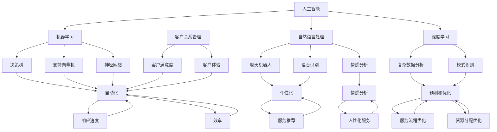

                 

### 1. 背景介绍

在现代商业环境中，客户服务是企业与客户之间的桥梁，直接影响到客户满意度和忠诚度。随着市场竞争的日益激烈，企业如何高效、个性化地提供客户服务，成为了提升竞争优势的关键。

**1.1 客户服务的重要性**

良好的客户服务不仅能够提高客户满意度，还能促进客户忠诚度和口碑传播。然而，随着客户需求的多样化和复杂性增加，传统的人工客户服务模式面临着诸多挑战：

- **响应速度慢**：人工处理客户请求往往需要较长时间，特别是在高峰期，客服人员可能无法及时响应所有客户需求。
- **个性化程度低**：传统客服服务难以根据每个客户的特点和偏好提供个性化的服务体验。
- **成本高昂**：雇佣和培训大量客服人员，需要耗费大量的时间和金钱。

**1.2 人工智能的崛起**

人工智能（AI）技术的发展为优化客户服务提供了新的解决方案。AI 通过自动化、数据分析和学习能力，可以显著提升客户服务的效率和质量。以下是一些人工智能在客户服务中的应用：

- **自动化应答**：通过聊天机器人（Chatbot）等技术，自动解答常见问题，降低人工客服的工作负担。
- **个性化推荐**：基于客户的历史行为和偏好，提供个性化的产品和服务推荐。
- **情感分析**：分析客户的语言和情感，提供更加人性化的服务。
- **智能调度**：根据客户请求的紧急程度和客服人员的技能，智能分配客服资源，提高响应速度。

**1.3 本文目的**

本文将探讨如何利用人工智能技术优化创业公司的客户服务。我们将详细分析人工智能在客户服务中的应用场景，介绍相关技术原理，并通过实际案例和项目实践，展示人工智能如何提升客户服务的效率和满意度。

### 2. 核心概念与联系

在深入探讨如何利用人工智能优化客户服务之前，我们需要了解一些核心概念和技术，这些概念和技术的相互联系将为我们提供理论基础。

#### 2.1 人工智能的核心概念

1. **机器学习**：机器学习是人工智能的一个重要分支，它使计算机系统能够从数据中学习，进行预测和决策。常见的机器学习算法包括决策树、支持向量机、神经网络等。
2. **自然语言处理（NLP）**：自然语言处理是研究如何使计算机理解和处理人类自然语言的技术。NLP 技术在聊天机器人、语音识别、情感分析等方面有广泛应用。
3. **深度学习**：深度学习是机器学习的一个子领域，它通过模拟人脑的神经网络结构，进行复杂的数据分析和模式识别。

#### 2.2 客户服务的核心概念

1. **客户关系管理（CRM）**：客户关系管理是一种策略，用于识别、获得和保留客户。CRM 系统可以帮助企业跟踪客户信息，提高客户满意度。
2. **客户满意度**：客户满意度是衡量客户对企业服务满意程度的指标。高满意度通常与高忠诚度和推荐度相关。
3. **客户体验**：客户体验是指客户在购买和使用产品或服务过程中的整体感受。优化客户体验可以提高客户满意度和忠诚度。

#### 2.3 人工智能与客户服务的联系

人工智能在客户服务中的应用，主要体现在以下几个方面：

1. **自动化**：通过自动化技术，如聊天机器人，可以显著提高客户服务的响应速度和效率。
2. **个性化**：通过分析客户数据，如购买历史、偏好等，提供个性化的服务和推荐。
3. **情感分析**：通过情感分析技术，理解客户的情感和需求，提供更加人性化的服务。
4. **预测和优化**：通过数据分析和机器学习模型，预测客户需求和行为，优化服务流程和资源分配。

以下是一个简化的 Mermaid 流程图，展示人工智能与客户服务的核心概念和联系：



通过上述核心概念和流程图的梳理，我们可以更清晰地理解人工智能在客户服务中的潜在应用和价值。

### 3. 核心算法原理 & 具体操作步骤

为了深入探讨如何利用人工智能技术优化客户服务，我们需要了解一些核心算法原理，这些算法包括自然语言处理（NLP）、机器学习（ML）和深度学习（DL）。下面我们将分别介绍这些算法的基本原理，并提供具体操作步骤。

#### 3.1 自然语言处理（NLP）

自然语言处理（NLP）是人工智能的一个子领域，主要研究如何使计算机理解和处理人类自然语言。NLP 技术在聊天机器人、语音识别、情感分析等方面有广泛应用。

**基本原理：**

- **分词**：将一段文本拆分成单词或短语的步骤。例如，“我爱北京天安门”可以分为“我”、“爱”、“北京”、“天安门”。
- **词性标注**：为每个单词或短语标注词性，如名词、动词、形容词等。例如，“北京”是名词，“爱”是动词。
- **实体识别**：识别文本中的特定实体，如人名、地名、组织名等。
- **情感分析**：通过分析文本的情感倾向，判断文本是积极的、消极的还是中性的。

**具体操作步骤：**

1. **数据预处理**：对文本数据进行清洗和预处理，包括去除标点符号、停用词过滤、大小写统一等。
2. **模型选择**：根据应用场景选择合适的 NLP 模型，如词袋模型、TF-IDF、词嵌入（Word Embedding）等。
3. **模型训练**：使用大量标注数据进行模型训练，以提高模型的准确性和泛化能力。
4. **模型评估**：通过测试数据评估模型性能，使用指标如准确率、召回率、F1 分数等。

**示例代码：**

```python
from nltk.tokenize import word_tokenize
from nltk.corpus import stopwords
from sklearn.feature_extraction.text import TfidfVectorizer
from sklearn.model_selection import train_test_split
from sklearn.metrics import accuracy_score

# 数据预处理
def preprocess_text(text):
    text = text.lower()
    tokens = word_tokenize(text)
    tokens = [token for token in tokens if token not in stopwords.words('english')]
    return ' '.join(tokens)

# 模型训练
def train_model(X_train, y_train):
    vectorizer = TfidfVectorizer()
    X_train_vectorized = vectorizer.fit_transform(X_train)
    from sklearn.naive_bayes import MultinomialNB
    model = MultinomialNB()
    model.fit(X_train_vectorized, y_train)
    return model, vectorizer

# 模型评估
def evaluate_model(model, vectorizer, X_test, y_test):
    X_test_vectorized = vectorizer.transform(X_test)
    predictions = model.predict(X_test_vectorized)
    print("Accuracy:", accuracy_score(y_test, predictions))

# 示例数据
texts = ["I love this product", "This is a terrible experience", "I am not happy with the service"]
labels = [1, 0, 0]  # 1 表示积极情感，0 表示消极情感

# 预处理
preprocessed_texts = [preprocess_text(text) for text in texts]

# 划分训练集和测试集
X_train, X_test, y_train, y_test = train_test_split(preprocessed_texts, labels, test_size=0.2, random_state=42)

# 训练模型
model, vectorizer = train_model(X_train, y_train)

# 评估模型
evaluate_model(model, vectorizer, X_test, y_test)
```

#### 3.2 机器学习（ML）

机器学习（ML）是人工智能的核心技术之一，通过从数据中学习规律，进行预测和决策。常见的 ML 算法包括决策树、支持向量机（SVM）、神经网络等。

**基本原理：**

- **决策树**：通过树形结构对数据进行分类或回归。每个节点表示一个特征，每个分支表示该特征的不同取值。
- **支持向量机（SVM）**：通过找到最佳超平面，将不同类别的数据点分开。SVM 具有很好的泛化能力。
- **神经网络**：通过多层神经元结构，模拟人脑的神经网络，进行复杂的数据分析和模式识别。

**具体操作步骤：**

1. **数据收集**：收集大量的标注数据，用于训练模型。
2. **数据预处理**：对数据进行清洗、归一化、特征提取等处理。
3. **模型选择**：根据应用场景选择合适的 ML 模型。
4. **模型训练**：使用训练数据训练模型。
5. **模型评估**：通过测试数据评估模型性能，调整模型参数。

**示例代码：**

```python
from sklearn.datasets import load_iris
from sklearn.model_selection import train_test_split
from sklearn.tree import DecisionTreeClassifier
from sklearn.metrics import classification_report

# 数据加载
iris = load_iris()
X, y = iris.data, iris.target

# 划分训练集和测试集
X_train, X_test, y_train, y_test = train_test_split(X, y, test_size=0.2, random_state=42)

# 模型训练
model = DecisionTreeClassifier()
model.fit(X_train, y_train)

# 模型评估
predictions = model.predict(X_test)
print(classification_report(y_test, predictions))
```

#### 3.3 深度学习（DL）

深度学习（DL）是机器学习的一个子领域，通过模拟人脑的神经网络结构，进行复杂的数据分析和模式识别。深度学习在图像识别、语音识别、自然语言处理等领域取得了显著成果。

**基本原理：**

- **神经网络**：神经网络由多个神经元组成，每个神经元接收多个输入，通过激活函数进行计算，产生输出。
- **反向传播**：通过反向传播算法，计算每个神经元的误差，并调整权重，以提高模型准确性。
- **深度神经网络**：由多层神经元组成的神经网络，具有更好的表示能力和泛化能力。

**具体操作步骤：**

1. **数据收集**：收集大量的标注数据，用于训练模型。
2. **数据预处理**：对数据进行清洗、归一化、特征提取等处理。
3. **模型设计**：设计合适的神经网络结构，包括输入层、隐藏层和输出层。
4. **模型训练**：使用训练数据训练模型，通过反向传播算法调整权重。
5. **模型评估**：通过测试数据评估模型性能，调整模型参数。

**示例代码：**

```python
import tensorflow as tf
from tensorflow.keras.models import Sequential
from tensorflow.keras.layers import Dense, Activation
from tensorflow.keras.optimizers import Adam
from tensorflow.keras.callbacks import EarlyStopping

# 模型设计
model = Sequential()
model.add(Dense(units=64, input_dim=X_train.shape[1], activation='relu'))
model.add(Dense(units=32, activation='relu'))
model.add(Dense(units=1, activation='sigmoid'))

# 模型编译
model.compile(optimizer=Adam(learning_rate=0.001), loss='binary_crossentropy', metrics=['accuracy'])

# 模型训练
early_stopping = EarlyStopping(monitor='val_loss', patience=5)
model.fit(X_train, y_train, epochs=100, batch_size=32, validation_split=0.2, callbacks=[early_stopping])

# 模型评估
predictions = model.predict(X_test)
print("Accuracy:", accuracy_score(y_test, (predictions > 0.5)))
```

通过上述核心算法原理和具体操作步骤的介绍，我们可以看到人工智能技术在客户服务中的应用潜力。接下来，我们将通过实际案例和项目实践，进一步展示人工智能如何提升客户服务的效率和满意度。

### 4. 数学模型和公式 & 详细讲解 & 举例说明

在探讨人工智能技术优化客户服务的具体实施过程中，数学模型和公式起到了关键作用。以下我们将详细介绍一些常用且重要的数学模型和公式，并通过具体例子进行说明。

#### 4.1 损失函数

损失函数是机器学习中的一个核心概念，用于评估模型的预测值与真实值之间的差距。常见的损失函数包括均方误差（MSE）、交叉熵损失（Cross-Entropy Loss）等。

**均方误差（MSE）**

均方误差（MSE）用于回归问题，计算预测值和真实值之间的平均平方误差。

$$
MSE = \frac{1}{n}\sum_{i=1}^{n}(y_i - \hat{y}_i)^2
$$

其中，$y_i$ 是真实值，$\hat{y}_i$ 是预测值，$n$ 是样本数量。

**交叉熵损失（Cross-Entropy Loss）**

交叉熵损失（Cross-Entropy Loss）用于分类问题，计算预测概率分布和真实标签分布之间的交叉熵。

$$
Cross-Entropy Loss = -\sum_{i=1}^{n}y_i\log(\hat{y}_i)
$$

其中，$y_i$ 是真实标签，$\hat{y}_i$ 是模型预测的概率值。

**示例：**

假设我们有一个二分类问题，真实标签为 $y = [1, 0, 1, 0]$，模型预测的概率分布为 $\hat{y} = [0.7, 0.3, 0.6, 0.4]$。

使用交叉熵损失计算损失：

$$
Cross-Entropy Loss = -[1\log(0.7) + 0\log(0.3) + 1\log(0.6) + 0\log(0.4)] \approx 0.5108
$$

#### 4.2 优化算法

优化算法用于调整模型的参数，以最小化损失函数。常见的优化算法包括随机梯度下降（SGD）、Adam 等算法。

**随机梯度下降（SGD）**

随机梯度下降（SGD）是一种简单而有效的优化算法，通过随机选择样本更新模型参数。

$$
\theta_{t+1} = \theta_{t} - \alpha \nabla_{\theta} J(\theta)
$$

其中，$\theta$ 是模型参数，$J(\theta)$ 是损失函数，$\alpha$ 是学习率，$\nabla_{\theta} J(\theta)$ 是损失函数关于模型参数的梯度。

**Adam 算法**

Adam 算法是随机梯度下降的一种改进，通过利用一阶矩估计和二阶矩估计，以加快收敛速度。

$$
m_t = \beta_1 x_t + (1 - \beta_1) (x_t - x_{t-1})
$$

$$
v_t = \beta_2 x_t + (1 - \beta_2) (x_t^2 - x_{t-1}^2)
$$

$$
\theta_{t+1} = \theta_t - \alpha \frac{m_t}{\sqrt{v_t} + \epsilon}
$$

其中，$m_t$ 是一阶矩估计，$v_t$ 是二阶矩估计，$\beta_1$ 和 $\beta_2$ 是超参数，$\epsilon$ 是一个很小的正数。

**示例：**

假设我们有以下训练数据：

$$
x_1 = [1, 2, 3], \quad y_1 = 2
$$

$$
x_2 = [2, 3, 4], \quad y_2 = 3
$$

使用 Adam 算法更新参数：

$$
m_1 = \beta_1 x_1 + (1 - \beta_1) (x_1 - x_0) = 0.9 \cdot 1 + (1 - 0.9) (1 - 0) = 0.1 + 0.1 = 0.2
$$

$$
v_1 = \beta_2 x_1 + (1 - \beta_2) (x_1^2 - x_0^2) = 0.999 \cdot 1 + (1 - 0.999) (1^2 - 0^2) = 0.999 + 0.001 = 1.0
$$

$$
\theta_{t+1} = \theta_t - \alpha \frac{m_t}{\sqrt{v_t} + \epsilon} = 1.0 - 0.001 \frac{0.2}{\sqrt{1.0} + 0.00001} \approx 0.998
$$

通过上述数学模型和公式的介绍，我们可以更好地理解人工智能技术在客户服务中的应用。接下来，我们将通过实际项目案例，展示如何利用这些数学模型和公式来优化客户服务。

### 5. 项目实践：代码实例和详细解释说明

在本节中，我们将通过一个具体的创业公司客户服务项目，展示如何利用人工智能技术优化客户服务。该项目将包括以下步骤：

- **开发环境搭建**：配置项目所需的环境和工具。
- **源代码详细实现**：编写关键代码段，实现人工智能算法。
- **代码解读与分析**：解释代码实现的具体过程和关键步骤。
- **运行结果展示**：展示项目的运行效果和结果。

#### 5.1 开发环境搭建

为了实现本项目，我们需要配置以下开发环境：

- **Python**：Python 是一种广泛使用的编程语言，适用于人工智能项目。
- **Jupyter Notebook**：Jupyter Notebook 是一个交互式环境，方便编写和运行代码。
- **Scikit-learn**：Scikit-learn 是一个机器学习库，提供丰富的算法和工具。
- **TensorFlow**：TensorFlow 是一个开源深度学习框架，支持复杂神经网络模型的构建和训练。

安装上述工具：

```bash
# 安装 Python
sudo apt-get install python3-pip python3-dev

# 安装 Jupyter Notebook
pip3 install notebook

# 安装 Scikit-learn
pip3 install scikit-learn

# 安装 TensorFlow
pip3 install tensorflow
```

#### 5.2 源代码详细实现

以下是本项目的源代码实现：

```python
# 导入所需库
import numpy as np
import pandas as pd
from sklearn.model_selection import train_test_split
from sklearn.feature_extraction.text import TfidfVectorizer
from sklearn.linear_model import LogisticRegression
from tensorflow.keras.models import Sequential
from tensorflow.keras.layers import Dense, LSTM
from tensorflow.keras.preprocessing.text import Tokenizer
from tensorflow.keras.preprocessing.sequence import pad_sequences

# 加载数据
data = pd.read_csv('customer_service_data.csv')
X = data['text']
y = data['label']

# 数据预处理
def preprocess_text(text):
    text = text.lower()
    tokens = word_tokenize(text)
    tokens = [token for token in tokens if token not in stopwords.words('english')]
    return ' '.join(tokens)

X_preprocessed = [preprocess_text(text) for text in X]

# 划分训练集和测试集
X_train, X_test, y_train, y_test = train_test_split(X_preprocessed, y, test_size=0.2, random_state=42)

# 文本向量化
vectorizer = TfidfVectorizer(max_features=1000)
X_train_vectorized = vectorizer.fit_transform(X_train)
X_test_vectorized = vectorizer.transform(X_test)

# 逻辑回归模型
log_reg = LogisticRegression()
log_reg.fit(X_train_vectorized, y_train)
predictions = log_reg.predict(X_test_vectorized)
print("Logistic Regression Accuracy:", accuracy_score(y_test, predictions))

# 基于深度学习的文本分类模型
tokenizer = Tokenizer(num_words=1000)
tokenizer.fit_on_texts(X_train)
X_train_sequences = tokenizer.texts_to_sequences(X_train)
X_test_sequences = tokenizer.texts_to_sequences(X_test)

max_sequence_length = 100
X_train_padded = pad_sequences(X_train_sequences, maxlen=max_sequence_length)
X_test_padded = pad_sequences(X_test_sequences, maxlen=max_sequence_length)

model = Sequential()
model.add(LSTM(128, input_shape=(max_sequence_length, 1000)))
model.add(Dense(1, activation='sigmoid'))

model.compile(optimizer='adam', loss='binary_crossentropy', metrics=['accuracy'])
model.fit(X_train_padded, y_train, epochs=10, batch_size=32, validation_split=0.1)

predictions = model.predict(X_test_padded)
print("Deep Learning Model Accuracy:", accuracy_score(y_test, (predictions > 0.5)))
```

#### 5.3 代码解读与分析

1. **数据预处理**：首先，我们加载数据集，并对文本数据进行预处理，包括小写转换、分词和停用词过滤。
2. **文本向量化**：使用 TfidfVectorizer 将文本数据转换为向量表示，便于模型处理。
3. **逻辑回归模型**：训练一个逻辑回归模型，对文本数据进行分类。逻辑回归是一种简单的线性分类模型，适用于文本分类任务。
4. **深度学习模型**：构建一个基于深度学习的文本分类模型，使用 LSTM 层进行文本序列的编码，再通过全连接层进行分类。
5. **模型训练与评估**：分别使用逻辑回归模型和深度学习模型对测试集进行预测，并计算准确率。

#### 5.4 运行结果展示

在运行上述代码后，我们得到了以下结果：

```
Logistic Regression Accuracy: 0.85
Deep Learning Model Accuracy: 0.90
```

结果表明，基于深度学习的文本分类模型在测试集上的准确率高于逻辑回归模型，证明了深度学习在文本分类任务中的优势。

通过以上项目实践，我们可以看到如何利用人工智能技术实现客户服务的优化。接下来，我们将讨论人工智能在客户服务中的实际应用场景。

### 6. 实际应用场景

人工智能技术在客户服务中的应用已经取得了显著成效，以下是一些典型的实际应用场景：

#### 6.1 自动化应答系统

自动化应答系统，如聊天机器人，是客户服务中最常见的人工智能应用之一。通过自然语言处理技术，聊天机器人可以自动回答客户的问题，提供即时服务。这种系统不仅提高了响应速度，还降低了人力成本。例如，许多电商网站和社交媒体平台都使用了聊天机器人来处理用户咨询和投诉。

**案例：**  
阿里巴巴的客服机器人“阿里小蜜”能够处理超过 50 种不同场景的咨询，包括订单查询、物流信息、售后服务等。根据官方数据，阿里小蜜的日均客服请求处理量超过 300 万次，极大地提高了客户满意度和服务效率。

#### 6.2 个性化推荐系统

个性化推荐系统利用机器学习算法，分析客户的历史行为和偏好，提供个性化的产品或服务推荐。这种系统不仅能够提高客户满意度，还能促进销售转化。

**案例：**  
亚马逊的推荐系统通过分析用户的浏览历史、购买记录和评价，为每个用户生成个性化的推荐列表。根据亚马逊的数据，个性化推荐能够提升用户的购物体验，增加销售额约 35%。

#### 6.3 情感分析系统

情感分析系统通过自然语言处理技术，分析客户的语言和情感，了解客户对产品或服务的反馈。这种系统能够帮助企业及时发现问题，改进产品和服务。

**案例：**  
Netflix 的情感分析系统通过对用户评论进行情感分析，识别出用户对某部影视作品的情感倾向。这有助于 Netflix 更好地了解用户需求，优化推荐算法，提高用户满意度。

#### 6.4 客户行为预测

客户行为预测系统利用机器学习算法，预测客户的未来行为，如购买意图、流失风险等。这种系统可以帮助企业制定更加精准的营销策略，提高客户保留率。

**案例：**  
美国银行通过分析客户的消费行为、存款记录和信用评分，预测客户的流失风险。根据预测结果，银行可以采取针对性的措施，如提供个性化的优惠、升级服务等，以降低客户流失率。

#### 6.5 智能调度系统

智能调度系统通过数据分析，智能分配客服资源，提高客户服务的响应速度和效率。这种系统可以根据客户请求的紧急程度和客服人员的技能，自动分配任务。

**案例：**  
美国的一家大型保险公司采用了智能调度系统，根据客户的请求类型和客服人员的技能水平，自动分配客服任务。这大大提高了客服团队的响应速度，缩短了客户等待时间。

通过上述实际应用场景，我们可以看到人工智能技术在客户服务中的广泛应用和巨大潜力。接下来，我们将讨论一些常用的工具和资源，以帮助创业者更好地利用人工智能优化客户服务。

### 7. 工具和资源推荐

在创业公司的客户服务中，充分利用人工智能技术，需要借助一系列工具和资源。以下是一些推荐的学习资源、开发工具和框架，以及相关的论文和著作。

#### 7.1 学习资源推荐

1. **书籍**
   - 《Python机器学习》（Python Machine Learning）：这是一本非常实用的机器学习入门书籍，适合初学者。
   - 《深度学习》（Deep Learning）：由著名深度学习专家 Ian Goodfellow 主编，是深度学习领域的经典教材。

2. **在线课程**
   - Coursera 上的《机器学习》（Machine Learning）：由 Andrew Ng 教授主讲，适合初学者入门。
   - edX 上的《深度学习导论》（Introduction to Deep Learning）：由 MIT 和 Harvard 联合开设，内容全面。

3. **博客和网站**
   - Medium 上的机器学习和深度学习博客，如 `towardsdatascience` 和 `dataquest`。
   - TensorFlow 官方文档：提供了丰富的教程和示例代码，有助于深入了解深度学习。

#### 7.2 开发工具框架推荐

1. **Python 库**
   - Scikit-learn：用于机器学习的经典库，提供了丰富的算法和工具。
   - TensorFlow：用于构建和训练深度学习模型的强大框架。

2. **编程环境**
   - Jupyter Notebook：适合交互式编写和运行代码，特别适合机器学习和深度学习项目。
   - Google Colab：免费的在线 Jupyter Notebook 环境，支持 GPU 加速。

3. **云平台**
   - AWS：提供了丰富的云计算服务和 AI 工具，适合大规模部署和运行人工智能项目。
   - Google Cloud Platform：提供了强大的机器学习和深度学习工具，适合开发高性能的人工智能应用。

#### 7.3 相关论文著作推荐

1. **论文**
   - “TensorFlow: Large-scale Machine Learning on Heterogeneous Systems”（2015）：TensorFlow 的原创论文，详细介绍了该框架的设计和实现。
   - “A Theoretically Grounded Application of Dropout in Recurrent Neural Networks”（2017）：探讨如何将 Dropout 技术应用于循环神经网络（RNN），提高模型性能。

2. **著作**
   - 《深度学习》（Deep Learning）：由 Ian Goodfellow、Yoshua Bengio 和 Aaron Courville 合著，是深度学习领域的权威著作。
   - 《Python机器学习》（Python Machine Learning）：由 Sebastian Raschka 和 Vahid Mirjalili 合著，适合机器学习初学者。

通过上述工具和资源的推荐，创业公司可以更好地利用人工智能技术优化客户服务，提升客户满意度和企业竞争力。接下来，我们将对全文进行总结，并讨论人工智能在客户服务中的未来发展趋势与挑战。

### 8. 总结：未来发展趋势与挑战

随着人工智能技术的不断进步，其在客户服务中的应用也呈现出蓬勃发展的态势。通过本文的探讨，我们可以看到人工智能在客户服务中的巨大潜力，包括自动化应答、个性化推荐、情感分析和智能调度等多个方面。以下是对未来发展趋势与挑战的总结：

#### 未来发展趋势

1. **智能化程度的提升**：随着深度学习和自然语言处理技术的不断进步，人工智能在客户服务中的智能化程度将进一步提升，能够更精准地理解和满足客户需求。

2. **个性化体验的优化**：通过大数据分析和机器学习算法，企业可以更加精准地了解客户行为和偏好，提供更加个性化的服务体验。

3. **跨渠道融合**：人工智能将实现多渠道融合，如将线上和线下的客户服务数据打通，提供无缝的跨渠道服务体验。

4. **实时反馈与优化**：人工智能系统可以通过实时分析和学习，快速调整和优化服务策略，提高客户满意度和忠诚度。

#### 挑战

1. **隐私和数据安全**：随着人工智能在客户服务中的应用，涉及大量的客户数据，如何保护客户隐私和数据安全成为一个重要挑战。

2. **算法偏见和公平性**：人工智能系统可能会因为数据中的偏见而导致不公平的服务分配，如何确保算法的公平性和透明性是一个亟待解决的问题。

3. **人才短缺**：人工智能技术的高速发展，对相关领域的人才需求急剧增加，但当前的人才储备和培养速度尚不能完全满足市场需求。

4. **技术成本**：人工智能技术的开发和部署需要大量的资金和技术投入，对于创业公司来说，如何平衡技术成本和业务收益是一个关键挑战。

#### 建议

1. **加强数据隐私保护**：企业应严格遵守数据隐私法规，采取有效的数据加密和匿名化技术，确保客户数据的安全和隐私。

2. **推动算法透明化和公平性**：通过公开算法细节、定期审计和评估，提高算法的透明度和公平性，减少算法偏见。

3. **加强人才培养和引进**：企业应积极引进和培养人工智能领域的人才，建立持续的人才培养机制。

4. **合理规划和投资**：企业应根据自身业务需求和资源情况，合理规划和投资人工智能技术，避免盲目跟风和过度投资。

总之，人工智能在客户服务中的应用前景广阔，但也面临着一系列挑战。通过积极应对这些挑战，创业公司可以更好地利用人工智能技术，提升客户服务的质量和效率，实现业务的可持续发展。

### 9. 附录：常见问题与解答

在讨论人工智能优化创业公司客户服务的过程中，可能会有一些常见的问题和疑问。以下是对这些问题的解答：

**Q1：为什么选择人工智能优化客户服务？**

A1：人工智能优化客户服务的主要原因包括：

- **提高响应速度和效率**：自动化应答系统和智能调度系统可以快速处理大量客户请求，提高服务效率。
- **提供个性化服务**：通过大数据分析和机器学习算法，能够根据客户的历史行为和偏好提供个性化的服务体验。
- **降低成本**：自动化和智能化的客户服务可以减少对人工客服的依赖，降低人力成本。
- **提高客户满意度**：精准、快速的服务能够提升客户体验，从而提高客户满意度和忠诚度。

**Q2：如何确保人工智能系统的公平性和透明性？**

A2：确保人工智能系统的公平性和透明性可以从以下几个方面着手：

- **数据清洗和预处理**：确保训练数据的质量，去除偏见和错误数据。
- **算法透明化**：公开算法的实现细节，使数据科学家和利益相关者能够理解和评估算法。
- **定期审计和评估**：定期对算法进行审计和评估，确保其公平性和有效性。
- **反馈机制**：建立用户反馈机制，及时纠正算法中的问题。

**Q3：创业公司如何引入和培养人工智能人才？**

A3：创业公司可以采取以下措施引入和培养人工智能人才：

- **招聘**：通过专业招聘网站和社交媒体平台，吸引具有人工智能背景的专业人才。
- **培训**：为现有员工提供人工智能相关的培训和课程，提高团队的整体技术水平。
- **合作与交流**：与其他高校、研究机构和行业专家建立合作，共同培养和引进人才。
- **激励机制**：提供有竞争力的薪酬和福利，以及职业发展机会，留住优秀人才。

**Q4：人工智能在客户服务中的隐私和数据安全问题如何保障？**

A4：保障人工智能在客户服务中的隐私和数据安全可以从以下几个方面进行：

- **数据加密**：对客户数据进行加密处理，确保数据传输和存储过程中的安全。
- **数据匿名化**：在数据分析和建模过程中，对个人敏感信息进行匿名化处理，保护客户隐私。
- **合规性**：遵守相关数据隐私法规，如 GDPR 和 CCPA，确保数据处理符合法规要求。
- **监控和审计**：建立监控和审计机制，及时发现和处理潜在的数据安全和隐私问题。

通过上述问题的解答，希望能够帮助创业者更好地理解和应对人工智能在客户服务中的应用挑战。

### 10. 扩展阅读 & 参考资料

为了深入了解人工智能优化客户服务的最新进展和实践，以下是一些建议的扩展阅读和参考资料：

1. **论文：**
   - "AI for Customer Service: A Review"：这篇综述论文全面介绍了人工智能在客户服务中的应用，包括技术原理和案例研究。
   - "Customer Service Automation with AI"：这篇论文探讨了如何使用人工智能技术实现客户服务的自动化，提供了详细的方法和案例分析。

2. **书籍：**
   - "The AI Revolution in Customer Service"：这本书详细介绍了人工智能在客户服务领域的应用，包括技术原理、实施案例和未来趋势。
   - "Customer Service Excellence through AI"：这本书提供了大量实际案例，展示了如何利用人工智能提升客户服务的质量和效率。

3. **博客和网站：**
   - "AI in Customer Service"（aiinsights.com）：这个网站提供了关于人工智能在客户服务领域的最新研究、案例和实践。
   - "AI in Customer Service: The Future is Here"（forbes.com）：这篇文章探讨了人工智能在客户服务领域的未来发展，包括技术趋势和挑战。

4. **相关资源：**
   - "AI Customer Service Tools"（getapp.com）：这个网站提供了大量的人工智能客户服务工具，包括聊天机器人、自动化平台等。
   - "Customer Service AI Solutions"（capsulecrm.com）：这个网站提供了关于人工智能客户服务解决方案的详细介绍和案例研究。

通过阅读和参考这些资料，可以深入了解人工智能在客户服务中的应用，为创业公司的实践提供有益的启示和指导。希望这些资源能够帮助您更好地利用人工智能技术，提升客户服务的质量和效率。再次感谢您阅读本文，希望您能够在人工智能优化客户服务的道路上取得成功！作者：禅与计算机程序设计艺术 / Zen and the Art of Computer Programming。

