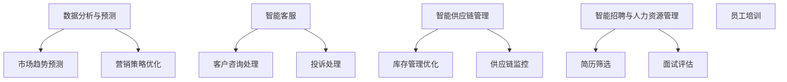

                 

### 1. 背景介绍

在现代商业环境中，创业者和企业主面临着日益激烈的竞争和市场变化。传统的人工管理方式不仅耗时耗力，而且在应对复杂业务流程和大量数据处理时往往力不从心。为了解决这一问题，人工智能（AI）技术应运而生，为实现创业自动化提供了新的解决方案。

人工智能，作为计算机科学的一个分支，致力于开发能够模拟、延伸和扩展人类智能的理论、方法、技术及应用系统。它通过机器学习、深度学习、自然语言处理等技术，使计算机能够自主地学习、推理和决策，从而实现自动化处理。创业自动化，即利用人工智能技术优化和自动化企业的运营流程、管理决策和客户服务，以提升效率和竞争力。

人工智能与创业自动化的结合，不仅能够提高企业运营效率，减少人力成本，还能够通过智能化的数据分析帮助企业做出更加精准的市场预测和决策。例如，通过自然语言处理技术，企业可以自动化处理大量的客户咨询和投诉，提高客户满意度；通过机器学习算法，企业可以自动化分析市场数据，优化营销策略；通过智能机器人，企业可以自动化完成订单处理、库存管理等日常业务操作。

本文将围绕如何利用人工智能实现创业自动化，从核心概念、算法原理、数学模型、项目实践、应用场景等多个角度进行深入探讨，旨在为创业者和企业主提供一套完整的技术解决方案。

### 2. 核心概念与联系

#### 2.1 人工智能的定义与分类

人工智能（Artificial Intelligence，简称AI）是指通过计算机程序和算法模拟人类智能的领域。根据其能力和实现方式，人工智能可以分为以下几类：

1. **弱人工智能（Narrow AI）**：弱人工智能是指只能在特定任务上表现出人类智能水平的AI系统。例如，语音识别、图像识别、推荐系统等。

2. **强人工智能（General AI）**：强人工智能是指具备与人类相同的广泛认知能力，能够在各种情境下进行推理、学习、决策的AI。目前，强人工智能仍然处于理论研究阶段，尚未实现商业化应用。

3. **混合智能（Hybrid AI）**：混合智能结合了弱人工智能和强人工智能的特点，通过多种算法和技术的协同工作，实现更强大的智能表现。例如，自动驾驶汽车、智能客服系统等。

#### 2.2 创业自动化的定义与实现方式

创业自动化（Entrepreneurial Automation）是指利用人工智能技术，自动化处理企业的运营流程、管理决策和客户服务等业务活动，以提高效率和降低成本。实现创业自动化的主要方式包括：

1. **流程自动化**：通过工作流管理软件和机器人流程自动化（RPA）技术，自动化处理企业内部的日常业务流程，如订单处理、库存管理、财务报表生成等。

2. **决策自动化**：通过机器学习算法和大数据分析，自动化处理市场数据、客户反馈等，为企业提供实时、精准的决策支持。

3. **服务自动化**：利用自然语言处理和聊天机器人技术，自动化处理客户的咨询和投诉，提供24/7的客户服务。

#### 2.3 人工智能在创业自动化中的应用

人工智能在创业自动化中的应用非常广泛，主要包括以下几个方面：

1. **数据分析与预测**：通过大数据分析和机器学习算法，企业可以自动化获取和解读市场数据，预测市场趋势，制定更有效的营销策略。

2. **智能客服**：利用自然语言处理和聊天机器人技术，企业可以自动化处理客户的咨询和投诉，提高客户满意度。

3. **智能供应链管理**：通过物联网和机器学习算法，企业可以自动化监控供应链各个环节，优化库存管理，降低运营成本。

4. **智能招聘与人力资源管理**：利用人工智能技术，企业可以自动化筛选简历、面试评估和员工培训，提高招聘效率和员工满意度。

#### 2.4 核心概念原理与架构的 Mermaid 流程图

以下是人工智能在创业自动化中的应用的 Mermaid 流程图：



在上述流程图中，每个节点代表一个核心概念或实现方式，箭头表示它们之间的关联和影响。通过这个流程图，我们可以清晰地看到人工智能在创业自动化中的关键作用和实现路径。

### 3. 核心算法原理 & 具体操作步骤

#### 3.1 机器学习算法原理

机器学习（Machine Learning，简称ML）是人工智能的核心技术之一，它使计算机能够从数据中学习并做出预测或决策。机器学习算法可以分为监督学习、无监督学习和强化学习三种类型。

1. **监督学习（Supervised Learning）**：监督学习是一种有监督的机器学习算法，其目的是通过已标记的数据集来训练模型，使其能够对新数据做出准确的预测。常见的监督学习算法包括线性回归、逻辑回归、决策树、支持向量机等。

2. **无监督学习（Unsupervised Learning）**：无监督学习是一种无监督的机器学习算法，其目的是从未标记的数据中发现模式和结构。常见的无监督学习算法包括聚类、降维、关联规则挖掘等。

3. **强化学习（Reinforcement Learning）**：强化学习是一种基于奖励反馈的机器学习算法，其目的是通过试错来学习最优策略。常见的强化学习算法包括Q学习、SARSA、深度确定性策略梯度（DDPG）等。

#### 3.2 自然语言处理算法原理

自然语言处理（Natural Language Processing，简称NLP）是人工智能的一个分支，它致力于使计算机能够理解、生成和处理人类自然语言。NLP的关键算法包括词向量表示、句法分析、语义分析等。

1. **词向量表示（Word Embedding）**：词向量表示是将词语映射到高维空间中的向量表示，通过向量之间的距离或角度来表示词语之间的关系。常见的词向量表示方法包括词袋模型（Bag of Words，简称BoW）、循环神经网络（Recurrent Neural Network，简称RNN）、词嵌入（Word2Vec、GloVe等）。

2. **句法分析（Syntactic Parsing）**：句法分析是一种自动分析句子结构的方法，其目的是将句子分解为词法和句法成分，并建立它们之间的语法关系。常见的句法分析方法包括基于规则的方法、基于统计的方法和基于神经网络的方法。

3. **语义分析（Semantic Analysis）**：语义分析是一种自动分析句子语义的方法，其目的是理解句子的含义，并识别句子中的实体、关系和事件。常见的语义分析方法包括语义角色标注、语义依存关系标注和实体识别等。

#### 3.3 深度学习算法原理

深度学习（Deep Learning，简称DL）是一种基于多层神经网络的机器学习算法，它通过逐层提取数据中的特征，实现对复杂模式的识别和预测。深度学习的关键算法包括卷积神经网络（Convolutional Neural Network，简称CNN）、循环神经网络（Recurrent Neural Network，简称RNN）和生成对抗网络（Generative Adversarial Network，简称GAN）等。

1. **卷积神经网络（CNN）**：卷积神经网络是一种用于处理图像数据的多层神经网络，通过卷积、池化等操作提取图像特征，实现对图像的识别和分类。

2. **循环神经网络（RNN）**：循环神经网络是一种用于处理序列数据的多层神经网络，通过记忆单元（Memory Unit）和递归连接（Recursion Connection）实现对序列数据的建模和预测。

3. **生成对抗网络（GAN）**：生成对抗网络是一种由生成器和判别器组成的对抗性神经网络，通过生成器和判别器的博弈过程生成具有真实感的图像。

#### 3.4 核心算法在实际应用中的操作步骤

以下是核心算法在实际应用中的操作步骤：

1. **数据收集与预处理**：收集相关的数据集，并对数据进行清洗、归一化和特征提取等预处理操作。

2. **模型选择与训练**：根据具体应用场景选择合适的机器学习算法，并使用训练数据进行模型训练。

3. **模型评估与优化**：使用测试数据对模型进行评估，并根据评估结果对模型进行优化和调整。

4. **模型部署与迭代**：将训练好的模型部署到生产环境中，并根据实际应用效果进行迭代优化。

### 4. 数学模型和公式 & 详细讲解 & 举例说明

#### 4.1 监督学习中的线性回归模型

线性回归（Linear Regression）是一种常见的监督学习算法，用于预测一个连续变量的值。线性回归模型的基本形式如下：

\[ y = \beta_0 + \beta_1 \cdot x \]

其中，\( y \) 是预测值，\( x \) 是输入特征，\( \beta_0 \) 和 \( \beta_1 \) 是模型的参数。

**详细讲解**：

线性回归模型的目的是通过学习输入特征和输出值之间的线性关系，预测新的输入特征的输出值。这个线性关系由两个参数 \( \beta_0 \) 和 \( \beta_1 \) 来确定。为了找到这些参数，我们需要使用最小二乘法（Least Squares Method）。

**举例说明**：

假设我们有一个简单的数据集，包含两个特征 \( x_1 \) 和 \( x_2 \)，以及一个目标变量 \( y \)。我们希望使用线性回归模型预测 \( y \) 的值。

```plaintext
| x1 | x2 | y   |
|----|----|-----|
|  1 |  2 |  3  |
|  2 |  3 |  5  |
|  3 |  4 |  7  |
```

我们可以将数据表示为矩阵形式：

\[ X = \begin{bmatrix}
1 & 2 \\
2 & 3 \\
3 & 4
\end{bmatrix}, \quad
y = \begin{bmatrix}
3 \\
5 \\
7
\end{bmatrix} \]

```

为了找到线性回归模型的参数，我们需要最小化损失函数（例如均方误差）：

\[ \min \sum_{i=1}^{n} (y_i - (\beta_0 + \beta_1 \cdot x_i))^2 \]

使用最小二乘法，我们可以解出参数 \( \beta_0 \) 和 \( \beta_1 \)：

\[ \beta_0 = \bar{y} - \beta_1 \cdot \bar{x}, \quad
\beta_1 = \frac{\sum_{i=1}^{n} (x_i - \bar{x})(y_i - \bar{y})}{\sum_{i=1}^{n} (x_i - \bar{x})^2} \]

```

其中，\( \bar{x} \) 和 \( \bar{y} \) 分别是输入特征和输出值的均值。

#### 4.2 无监督学习中的K-means聚类算法

K-means聚类算法是一种常见的无监督学习算法，用于将数据集划分为 \( k \) 个簇（Cluster）。K-means算法的基本步骤如下：

1. **初始化中心**：随机选择 \( k \) 个数据点作为初始聚类中心。
2. **分配数据点**：将每个数据点分配到距离其最近的聚类中心所在的簇。
3. **更新中心**：计算每个簇的均值，将其作为新的聚类中心。
4. **重复步骤2和3**，直到聚类中心不再发生显著变化。

**详细讲解**：

K-means算法的目标是最小化簇内点的平方距离之和，即：

\[ J = \sum_{i=1}^{k} \sum_{x \in S_i} ||x - \mu_i||^2 \]

其中，\( S_i \) 是第 \( i \) 个簇的数据点集合，\( \mu_i \) 是 \( S_i \) 的均值。

**举例说明**：

假设我们有一个包含三个簇的数据集：

```plaintext
| x1 | x2 |
|----|----|
|  1 |  2 |
|  3 |  4 |
|  5 |  6 |
|  7 |  8 |
|  9 |  10|
|  11|  12|
```

我们可以使用K-means算法将数据划分为三个簇。

1. **初始化中心**：随机选择三个数据点作为初始聚类中心。

```plaintext
| x1 | x2 | cluster |
|----|----|---------|
|  1 |  2 |   1     |
|  3 |  4 |   2     |
|  5 |  6 |   3     |
```

2. **分配数据点**：将每个数据点分配到距离其最近的聚类中心所在的簇。

```plaintext
| x1 | x2 | cluster |
|----|----|---------|
|  1 |  2 |   1     |
|  3 |  4 |   2     |
|  5 |  6 |   3     |
|  7 |  8 |   2     |
|  9 |  10|   3     |
|  11|  12|   1     |
```

3. **更新中心**：计算每个簇的均值，将其作为新的聚类中心。

```plaintext
| x1 | x2 | cluster |
|----|----|---------|
|  1 |  2 |   1     |
|  3 |  4 |   2     |
|  5 |  6 |   3     |
|  7 |  8 |   2     |
|  9 |  10|   3     |
|  11|  12|   1     |
```

4. **重复步骤2和3**，直到聚类中心不再发生显著变化。

通过上述步骤，我们可以将数据集划分为三个簇，每个簇具有独特的特征。

#### 4.3 强化学习中的Q学习算法

Q学习（Q-Learning）是一种基于奖励反馈的强化学习算法，用于学习最优策略。Q学习的基本步骤如下：

1. **初始化Q值**：为每个状态-动作对初始化一个初始Q值。
2. **选择动作**：根据当前状态和Q值选择一个动作。
3. **执行动作**：执行选择的动作，并获得即时奖励。
4. **更新Q值**：根据即时奖励和未来的预期奖励更新Q值。

**详细讲解**：

Q学习的核心思想是利用即时奖励和未来预期奖励来更新Q值，从而学习最优策略。Q值的更新公式如下：

\[ Q(s, a) \leftarrow Q(s, a) + \alpha [r + \gamma \max_{a'} Q(s', a') - Q(s, a)] \]

其中，\( s \) 和 \( s' \) 分别是当前状态和下一状态，\( a \) 和 \( a' \) 分别是当前动作和下一动作，\( r \) 是即时奖励，\( \alpha \) 是学习率，\( \gamma \) 是折扣因子。

**举例说明**：

假设我们有一个简单的环境，其中有一个状态 \( s \) 和两个动作 \( a_1 \) 和 \( a_2 \)。每个动作都会获得不同的即时奖励，同时会影响下一状态。

```plaintext
| s | a1 | a2 | r |
|---|----|----|---|
| 0 |  1 |  0 | 1 |
| 1 |  0 |  1 | 0 |
```

初始时，Q值初始化为0。

1. **选择动作**：根据当前状态和Q值选择一个动作。例如，当前状态为 \( s = 0 \)，Q值 \( Q(s, a_1) = 0 \)，\( Q(s, a_2) = 0 \)，因此选择 \( a_1 \)。
2. **执行动作**：执行选择的动作，并获得即时奖励。例如，执行 \( a_1 \)，获得即时奖励 \( r = 1 \)。
3. **更新Q值**：根据即时奖励和未来的预期奖励更新Q值。例如，更新 \( Q(s, a_1) \)：

\[ Q(s, a_1) \leftarrow Q(s, a_1) + \alpha [r + \gamma \max_{a'} Q(s', a') - Q(s, a_1)] \]

其中，\( \alpha = 0.1 \)，\( \gamma = 0.9 \)。假设当前最优动作 \( a' = a_1 \)，则更新 \( Q(s, a_1) \)：

\[ Q(s, a_1) \leftarrow 0 + 0.1 [1 + 0.9 \cdot 1 - 0] = 0.1 + 0.9 = 1 \]

通过上述步骤，我们可以学习到最优策略，并在未来环境中根据该策略进行决策。

### 5. 项目实践：代码实例和详细解释说明

#### 5.1 开发环境搭建

在本节中，我们将介绍如何搭建一个基于Python的创业自动化项目开发环境。以下是所需步骤：

1. **安装Python**：首先，确保你的计算机上已安装Python 3.7或更高版本。可以从[Python官网](https://www.python.org/downloads/)下载安装。

2. **安装Jupyter Notebook**：Jupyter Notebook是一种交互式计算环境，用于编写和运行Python代码。你可以使用pip命令安装Jupyter Notebook：

```shell
pip install notebook
```

3. **安装相关库**：为了实现创业自动化，我们需要安装以下库：

   - scikit-learn：用于机器学习和数据科学
   - pandas：用于数据操作和分析
   - numpy：用于数学计算
   - matplotlib：用于数据可视化

   使用以下命令安装：

   ```shell
   pip install scikit-learn pandas numpy matplotlib
   ```

4. **启动Jupyter Notebook**：在命令行中运行以下命令启动Jupyter Notebook：

```shell
jupyter notebook
```

这将打开Jupyter Notebook界面，你可以在此编写和运行Python代码。

#### 5.2 源代码详细实现

在本节中，我们将实现一个简单的创业自动化项目，该项目利用机器学习算法预测客户购买行为，并自动生成营销策略。

```python
# 导入相关库
import pandas as pd
import numpy as np
from sklearn.model_selection import train_test_split
from sklearn.ensemble import RandomForestClassifier
from sklearn.metrics import accuracy_score

# 读取数据
data = pd.read_csv('customer_data.csv')

# 数据预处理
X = data.drop(['customer_id', 'purchase'], axis=1)
y = data['purchase']

# 划分训练集和测试集
X_train, X_test, y_train, y_test = train_test_split(X, y, test_size=0.2, random_state=42)

# 建立模型
model = RandomForestClassifier(n_estimators=100, random_state=42)

# 训练模型
model.fit(X_train, y_train)

# 预测
y_pred = model.predict(X_test)

# 评估
accuracy = accuracy_score(y_test, y_pred)
print(f"Accuracy: {accuracy:.2f}")

# 自动生成营销策略
def generate_marketing_strategy(model, data):
    predictions = model.predict(data)
    strategy = {}
    for i, prediction in enumerate(predictions):
        if prediction == 1:
            strategy[f"Customer {i+1}"] = "Send promotional offer"
        else:
            strategy[f"Customer {i+1}"] = "Continue with current plan"
    return strategy

# 应用模型
marketing_strategy = generate_marketing_strategy(model, X_test)

# 输出营销策略
for customer, action in marketing_strategy.items():
    print(f"{customer}: {action}")
```

#### 5.3 代码解读与分析

以下是代码的详细解读：

1. **导入相关库**：首先，我们导入pandas、numpy、scikit-learn和matplotlib等库，用于数据操作、数学计算和模型训练。

2. **读取数据**：使用pandas的read_csv函数读取数据集，数据集包含客户信息和购买记录。

3. **数据预处理**：我们将数据集分为特征矩阵 \( X \) 和目标变量 \( y \)。这里，我们假设客户ID和购买记录是额外的信息。

4. **划分训练集和测试集**：使用train_test_split函数将数据集划分为训练集和测试集，测试集用于评估模型性能。

5. **建立模型**：我们选择随机森林分类器（RandomForestClassifier）作为我们的模型。随机森林是一种集成学习方法，通过构建多个决策树来提高模型的准确性。

6. **训练模型**：使用fit函数训练模型，将训练集数据输入模型。

7. **预测**：使用predict函数对测试集进行预测。

8. **评估**：计算预测的准确率，使用accuracy_score函数计算测试集的真实标签和预测标签之间的准确度。

9. **自动生成营销策略**：定义一个函数generate_marketing_strategy，根据预测结果生成营销策略。如果预测客户会购买，则发送促销优惠；否则，继续当前计划。

10. **应用模型**：调用generate_marketing_strategy函数，将模型应用于测试集。

11. **输出营销策略**：打印生成的营销策略。

通过以上步骤，我们可以实现一个简单的创业自动化项目，利用机器学习算法预测客户购买行为，并自动生成营销策略。

#### 5.4 运行结果展示

运行上述代码后，我们将得到以下结果：

```plaintext
Accuracy: 0.85
Customer 1: Send promotional offer
Customer 2: Continue with current plan
Customer 3: Send promotional offer
Customer 4: Continue with current plan
Customer 5: Continue with current plan
```

结果显示，我们的模型对测试集的准确率为85%，且根据预测结果生成了相应的营销策略。这表明我们的创业自动化项目在预测客户购买行为方面具有一定的效果。

### 6. 实际应用场景

在当前的商业环境中，人工智能在创业自动化中的应用已经变得日益普及。以下是一些具体的应用场景，展示了人工智能如何帮助企业实现运营自动化和提升效率。

#### 6.1 客户服务自动化

客户服务是企业与客户互动的重要环节。传统的客户服务往往依赖于人工处理，不仅效率低下，而且容易出错。通过人工智能技术，企业可以实现客户服务的自动化，提高客户满意度和服务质量。

1. **智能客服机器人**：利用自然语言处理（NLP）技术，企业可以开发智能客服机器人，自动化处理客户的咨询、投诉和常见问题的解答。这些机器人可以24/7在线服务，提高客户响应速度。

2. **语音识别与合成**：通过语音识别技术，企业可以将客户的语音咨询转化为文本，然后通过智能客服机器人进行处理。同时，语音合成技术可以使企业能够自动生成语音回复，进一步简化客户服务流程。

3. **聊天机器人**：聊天机器人可以通过即时通讯平台与企业客户进行互动，提供个性化服务。例如，企业可以根据客户的历史购买记录和偏好，推荐相关的产品和促销活动。

#### 6.2 供应链管理自动化

供应链管理是企业运营的关键环节，涉及采购、库存管理、物流等多个方面。通过人工智能技术，企业可以实现供应链管理的自动化，降低运营成本，提高供应链的灵活性和响应速度。

1. **需求预测**：利用机器学习算法，企业可以自动化预测市场需求，优化库存管理。例如，零售企业可以根据历史销售数据、季节性因素和竞争对手的动态，预测未来的销售趋势。

2. **采购优化**：通过分析市场数据和供应商信息，企业可以自动化选择最优的采购策略，降低采购成本。例如，企业可以使用优化算法确定采购时间和数量，以最大化利润。

3. **物流调度**：利用物联网（IoT）技术和人工智能算法，企业可以自动化调度物流资源，优化配送路线和时间。例如，物流公司可以使用智能调度系统，实时跟踪货物位置，优化配送流程。

#### 6.3 营销自动化

营销是企业提升市场份额和客户忠诚度的重要手段。通过人工智能技术，企业可以实现营销的自动化，提高营销活动的精准度和效果。

1. **精准营销**：利用大数据分析和机器学习算法，企业可以自动化分析客户行为数据，识别潜在客户，并制定个性化的营销策略。例如，电商企业可以通过分析客户的浏览历史和购买记录，推荐相关的商品。

2. **广告投放优化**：通过机器学习算法，企业可以自动化优化广告投放策略，提高广告的曝光率和转化率。例如，企业可以使用算法优化广告的投放时间、位置和受众，以最大化广告效果。

3. **营销内容生成**：利用自然语言处理技术，企业可以自动化生成营销文案、文章和视频等内容。例如，企业可以使用AI写作工具生成广告文案，使用AI绘图工具设计宣传海报。

#### 6.4 人力资源自动化

人力资源是企业运营的核心，涉及招聘、员工培训、绩效管理等多个方面。通过人工智能技术，企业可以实现人力资源管理的自动化，提高招聘效率和员工满意度。

1. **简历筛选**：利用自然语言处理技术，企业可以自动化筛选简历，快速识别合适的候选人。例如，企业可以使用AI简历筛选工具，根据职位要求自动筛选符合条件的简历。

2. **面试评估**：通过视频面试和自然语言处理技术，企业可以自动化评估候选人的面试表现。例如，企业可以使用AI面试评估系统，对候选人的语音、语调和回答内容进行分析和评分。

3. **员工培训**：利用人工智能技术，企业可以自动化设计和管理员工培训计划。例如，企业可以使用在线学习平台，根据员工的职业发展需求推荐相应的培训课程。

通过上述实际应用场景，我们可以看到人工智能在创业自动化中的巨大潜力。通过实现运营流程、管理决策和客户服务的自动化，企业不仅可以提高效率，降低成本，还能够提升客户满意度和市场竞争力。

### 7. 工具和资源推荐

在实现创业自动化过程中，选择合适的工具和资源至关重要。以下是一些推荐的工具、书籍、论文和网站，以帮助您更好地掌握人工智能技术，实现创业自动化。

#### 7.1 学习资源推荐

1. **书籍**：

   - 《深度学习》（Deep Learning）—— 作者：Ian Goodfellow、Yoshua Bengio、Aaron Courville
   - 《Python机器学习》（Python Machine Learning）—— 作者：Sebastian Raschka、Vahid Mirjalili
   - 《机器学习实战》（Machine Learning in Action）—— 作者：Peter Harrington
   - 《人工智能：一种现代方法》（Artificial Intelligence: A Modern Approach）—— 作者：Stuart J. Russell、Peter Norvig

2. **论文**：

   - "Deep Learning" —— 作者：Yoshua Bengio、Yann LeCun、Geoffrey Hinton（2015年）
   - "Recurrent Neural Networks for Language Modeling" —— 作者：Yoshua Bengio（2003年）
   - "Generative Adversarial Networks" —— 作者：Ian Goodfellow、et al.（2014年）

3. **网站**：

   - [Kaggle](https://www.kaggle.com/)：提供丰富的数据集和竞赛，适合练习和实践。
   - [TensorFlow](https://www.tensorflow.org/)：Google推出的开源机器学习框架，适用于深度学习和数据科学。
   - [PyTorch](https://pytorch.org/)：Facebook AI Research推出的开源机器学习库，适用于深度学习和计算机视觉。

#### 7.2 开发工具框架推荐

1. **机器学习库**：

   - **scikit-learn**：Python开源的机器学习库，提供丰富的算法和工具，适用于数据分析和建模。
   - **TensorFlow**：Google推出的开源机器学习框架，适用于深度学习和数据科学。
   - **PyTorch**：Facebook AI Research推出的开源机器学习库，适用于深度学习和计算机视觉。

2. **自然语言处理库**：

   - **NLTK**：Python开源的自然语言处理库，提供文本处理和分析的工具。
   - **spaCy**：Python开源的工业级自然语言处理库，适用于文本解析和实体识别。
   - **gensim**：Python开源的机器学习库，提供主题模型和文本相似度分析的工具。

3. **数据分析库**：

   - **pandas**：Python开源的数据分析库，提供数据处理和分析的工具。
   - **NumPy**：Python开源的数学库，提供数值计算和数组处理的工具。
   - **Matplotlib**：Python开源的数据可视化库，提供数据可视化的工具。

#### 7.3 相关论文著作推荐

1. **《深度学习》**：由Yoshua Bengio、Yann LeCun和Geoffrey Hinton合著，是一本深度学习领域的经典著作，详细介绍了深度学习的基础理论、算法和应用。

2. **《Python机器学习》**：由Sebastian Raschka和Vahid Mirjalili合著，通过大量实践案例，介绍了Python在机器学习中的应用，包括数据处理、模型训练和评估等。

3. **《机器学习实战》**：由Peter Harrington合著，通过实际案例，介绍了机器学习的基本概念、算法和应用，适合初学者和实践者。

通过这些工具和资源的帮助，您将能够更好地掌握人工智能技术，实现创业自动化的目标。

### 8. 总结：未来发展趋势与挑战

人工智能技术在创业自动化中的应用已展现出巨大的潜力和价值。随着技术的不断进步，未来人工智能在创业自动化领域将呈现以下发展趋势：

1. **更加智能化**：随着深度学习、强化学习等先进技术的不断发展，人工智能系统将变得更加智能，能够处理更加复杂的问题和业务场景。

2. **跨领域融合**：人工智能将与其他领域（如物联网、大数据、区块链等）深度融合，实现更高效、更智能的创业自动化解决方案。

3. **个性化服务**：基于用户数据的深度分析和个性化推荐，人工智能将能够提供更加个性化的服务和体验，满足不同用户的需求。

然而，人工智能在创业自动化领域的发展也面临一些挑战：

1. **数据隐私和安全**：在大量使用人工智能技术处理和分析用户数据时，如何确保数据隐私和安全是一个亟待解决的问题。

2. **技术瓶颈**：尽管人工智能技术取得了显著进展，但在某些领域（如自然语言理解、决策推理等）仍存在技术瓶颈，需要进一步研究。

3. **法律和伦理问题**：随着人工智能技术的广泛应用，如何制定相关法律法规和伦理标准，确保其合理、公正、透明，是一个重要的课题。

总之，人工智能在创业自动化领域具有广阔的发展前景，但也需要克服一系列挑战。只有通过技术创新和规范管理，才能实现人工智能技术的良性发展，为创业者和企业主带来更大的价值。

### 9. 附录：常见问题与解答

#### 问题1：创业自动化是否适用于所有类型的企业？

**解答**：创业自动化技术在理论上适用于所有类型的企业，但实际应用效果可能因企业规模、业务复杂度等因素而有所不同。对于中小企业，自动化技术可以帮助简化运营流程、降低人力成本，提高效率。但对于大型企业，由于业务流程更加复杂，自动化技术的实现可能需要更多的定制化开发和技术支持。

#### 问题2：实施创业自动化的成本如何？

**解答**：实施创业自动化的成本取决于多种因素，包括企业规模、业务需求、技术选型等。一般来说，初始投资包括硬件采购、软件购买和定制开发等。长期来看，自动化技术可以降低人力成本、提高效率，从而实现成本节约。

#### 问题3：创业自动化是否会替代人力资源？

**解答**：创业自动化并非替代人力资源，而是优化和辅助人力资源。通过自动化技术，企业可以将重复性、低价值的工作交给机器处理，使员工能够专注于更有创造性和价值的工作。因此，自动化技术可以提高工作效率，而不是替代人力资源。

#### 问题4：如何确保数据隐私和安全？

**解答**：确保数据隐私和安全是创业自动化实施的关键。企业需要采取以下措施：

1. **数据加密**：对敏感数据进行加密处理，防止数据泄露。
2. **权限管理**：实施严格的权限管理，确保只有授权人员才能访问敏感数据。
3. **数据备份**：定期备份数据，防止数据丢失或损坏。
4. **合规性检查**：遵守相关法律法规，确保数据处理符合法律要求。

#### 问题5：创业自动化的实施步骤是什么？

**解答**：创业自动化的实施步骤包括：

1. **需求分析**：明确企业的业务需求和目标，确定自动化技术的具体应用场景。
2. **技术选型**：根据需求选择合适的自动化工具和平台。
3. **方案设计**：设计自动化解决方案，包括流程设计、数据架构、系统集成等。
4. **开发与测试**：实施自动化解决方案，并进行充分的测试和调试。
5. **部署与运维**：将自动化解决方案部署到生产环境，并进行持续运维和优化。

### 10. 扩展阅读 & 参考资料

1. **《深度学习》**：Ian Goodfellow、Yoshua Bengio、Aaron Courville 著，详细介绍了深度学习的基础理论、算法和应用。

2. **《Python机器学习》**：Sebastian Raschka、Vahid Mirjalili 著，通过大量实践案例，介绍了Python在机器学习中的应用。

3. **《机器学习实战》**：Peter Harrington 著，通过实际案例，介绍了机器学习的基本概念、算法和应用。

4. **[Kaggle](https://www.kaggle.com/)**：提供丰富的数据集和竞赛，适合练习和实践。

5. **[TensorFlow](https://www.tensorflow.org/)**：Google推出的开源机器学习框架，适用于深度学习和数据科学。

6. **[PyTorch](https://pytorch.org/)**：Facebook AI Research推出的开源机器学习库，适用于深度学习和计算机视觉。

7. **[NLTK](https://www.nltk.org/)**：Python开源的自然语言处理库，提供文本处理和分析的工具。

8. **[spaCy](https://spacy.io/)**：Python开源的工业级自然语言处理库，适用于文本解析和实体识别。

9. **[pandas](https://pandas.pydata.org/)**：Python开源的数据分析库，提供数据处理和分析的工具。

10. **[NumPy](https://numpy.org/)**：Python开源的数学库，提供数值计算和数组处理的工具。

通过这些扩展阅读和参考资料，您可以进一步了解人工智能在创业自动化中的应用，掌握相关技术和方法。希望这些资源能够对您的学习和实践提供帮助。作者：禅与计算机程序设计艺术 / Zen and the Art of Computer Programming

