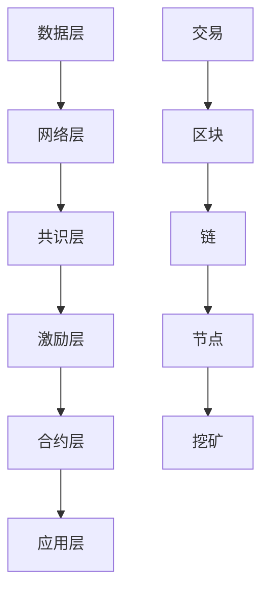

                 

### 背景介绍

#### 区块链技术的历史与重要性

区块链技术起源于2008年，由一个化名为“中本聪”（Satoshi Nakamoto）的人提出了比特币（Bitcoin）的概念。这一革命性的创新旨在解决传统金融系统中长期存在的问题，如双花攻击、信任危机、信息不对称等。随着比特币的成功，区块链技术迅速吸引了全球的关注，并被广泛认为是未来互联网的基础设施之一。

区块链的本质是一个分布式账本，它通过密码学和共识算法确保数据的不可篡改性和透明性。区块链的去中心化特性使其在金融、供应链管理、物联网、智能合约等多个领域具有广泛的应用前景。特别是在创业领域中，区块链技术被视为重塑信任机制和价值传递的重要工具。

#### 创业中的信任危机

创业环境中的信任危机主要体现在以下几个方面：

1. **资金流转问题**：创业者往往需要依赖投资者和合作伙伴的资金支持，但资金流转过程中容易出现挪用、侵占等问题，导致信任危机。

2. **知识产权保护**：在创新和研发过程中，知识产权的保护至关重要。但传统机制下，知识产权的归属和保护常常面临挑战。

3. **供应链管理**：创业企业的供应链往往复杂且多变，缺乏有效的追踪和验证机制，导致供应链管理中的信任问题。

4. **数据隐私与安全**：随着数据成为新的经济资源，数据隐私和安全问题日益突出。创业者如何保护用户数据，确保数据不被滥用，是一个亟待解决的问题。

#### 区块链技术在创业中的应用潜力

区块链技术在创业领域中的应用潜力主要体现在以下几个方面：

1. **资金流转**：区块链技术可以实现点对点的资金流转，减少中间环节，提高资金流转效率，降低信任风险。

2. **知识产权保护**：区块链技术可以用来记录和验证知识产权，确保原创性，并便于追溯侵权行为。

3. **供应链管理**：区块链技术可以提供透明、不可篡改的供应链信息，提升供应链管理的效率和可信度。

4. **数据隐私与安全**：区块链技术可以通过加密和分布式存储方式保护用户数据，增强数据安全性和隐私性。

综上所述，区块链技术为解决创业中的信任危机提供了新的路径。在接下来的章节中，我们将深入探讨区块链技术的核心概念和架构，以及其在创业中的应用。

### 核心概念与联系

#### 区块链基本概念

区块链是由一串使用密码学方法相关联产生的数据块，每一个数据块中包含了一次交易的记录，并按照时间顺序排列。区块链通过分布式网络进行存储和管理，这意味着数据不是集中存储在一个中心服务器上，而是分布在网络中的多个节点上。每个节点都拥有完整的区块链副本，这使得区块链具有去中心化特性。

1. **区块（Block）**：区块是区块链的基本组成单位，包含一系列的交易记录。每个区块都有一个唯一的标识符（哈希值），并通过密码学方法与前一个区块连接，形成链式结构。

2. **链（Chain）**：链是多个区块按照一定顺序连接形成的结构。区块链的不可篡改性即依赖于这种链式结构。

3. **节点（Node）**：节点是区块链网络中的参与者，每个节点都存储着区块链的完整副本，并参与区块链的维护和验证。

4. **挖矿（Mining）**：挖矿是指节点通过计算解决数学难题，以验证和添加新的区块到区块链上。挖矿是区块链网络产生新区块和激励矿工的重要机制。

5. **共识算法（Consensus Algorithm）**：共识算法是区块链网络中节点达成一致的方式。常见的共识算法包括工作量证明（PoW）、权益证明（PoS）和委托权益证明（DPoS）等。

#### 区块链在创业中的应用场景

区块链技术因其去中心化、不可篡改、透明性和安全性等特点，在创业领域具有广泛的应用潜力。以下是一些关键应用场景：

1. **资金流转**：区块链可以实现点对点的资金流转，减少传统金融系统中的中介环节，提高资金流转效率和降低信任风险。

2. **供应链管理**：区块链可以提供透明、不可篡改的供应链信息，提高供应链管理的效率和可信度。

3. **知识产权保护**：区块链可以用来记录和验证知识产权，确保原创性，并便于追溯侵权行为。

4. **数据隐私与安全**：区块链技术可以通过加密和分布式存储方式保护用户数据，增强数据安全性和隐私性。

5. **智能合约**：智能合约是基于区块链技术的自动执行合同，可以在满足特定条件时自动执行，提高交易效率和透明度。

#### 区块链架构

区块链的架构主要包括以下几部分：

1. **数据层**：数据层主要涉及数据的存储和传输，包括区块链的数据结构和加密算法。

2. **网络层**：网络层负责区块链节点之间的通信，实现数据的传输和验证。

3. **共识层**：共识层是区块链网络中节点达成一致的重要机制，包括共识算法和挖矿机制。

4. **激励层**：激励层是为维护区块链网络提供激励机制的模块，包括奖励机制和惩罚机制。

5. **合约层**：合约层是智能合约的运行环境，支持开发者和用户创建和使用智能合约。

6. **应用层**：应用层是区块链技术的最终体现，包括各种基于区块链的应用场景和业务逻辑。

#### Mermaid 流程图

为了更好地理解区块链的核心概念和架构，我们可以使用 Mermaid 流程图来展示区块链的关键节点和流程。以下是一个简化的 Mermaid 流程图示例：



在这个流程图中，数据层处理数据的存储和传输，网络层负责节点间的通信，共识层确保节点达成一致，激励层提供激励机制，合约层支持智能合约的运行，应用层则是区块链技术的具体应用场景。交易通过区块加入到链中，由节点进行验证和存储，通过挖矿产生新区块，形成完整的区块链网络。

通过上述介绍和流程图，我们可以对区块链技术有一个基本的理解。在接下来的章节中，我们将深入探讨区块链的核心算法原理，以及具体的应用操作步骤。

#### 核心算法原理 & 具体操作步骤

区块链技术的核心在于其强大的安全性和去中心化特性，这些特性主要依赖于其复杂的算法设计。以下将详细阐述区块链中的核心算法原理，以及具体的应用操作步骤。

##### 工作量证明（Proof of Work, PoW）

工作量证明是区块链中最常用的共识算法之一，特别适用于比特币等加密货币系统。其核心思想是通过计算解决复杂的数学难题，以验证和创建新的区块。

**1. 算法原理**

- **随机数生成**：在每次创建新区块时，系统会生成一个随机数作为“种子”。
- **数学难题**：矿工需要通过计算找到一个特定的哈希值，使得该哈希值满足一定的条件（例如，比特币系统要求哈希值的前几位为0）。
- **计算与验证**：矿工不断地尝试各种可能的哈希值，直到找到满足条件的哈希值。这个过程称为“挖掘”。
- **新区块创建**：一旦找到满足条件的哈希值，矿工将这个结果连同交易记录和其他元数据一起打包成新区块，并广播给网络中的其他节点。

**2. 操作步骤**

- **步骤1：接收交易记录**：矿工从网络中接收最新的交易记录。
- **步骤2：生成随机数**：矿工利用随机数生成算法生成一个随机数作为“种子”。
- **步骤3：寻找满足条件的哈希值**：矿工通过尝试不同的哈希值，直到找到一个满足特定条件的哈希值。
- **步骤4：创建新区块**：将满足条件的哈希值和交易记录一起打包成新区块。
- **步骤5：广播新区块**：矿工将新区块广播给网络中的其他节点，等待验证。

##### 权益证明（Proof of Stake, PoS）

权益证明是另一种常见的共识算法，其设计旨在解决工作量证明算法中的能源消耗问题。在权益证明中，节点通过持有币的数量和持币时间来决定其验证新区块的权力。

**1. 算法原理**

- **权益分配**：节点根据其持有的币的数量和持币时间来计算其权益。权益越高，节点参与验证新区块的概率越大。
- **随机选择**：系统随机选择一个拥有最高权益的节点来验证新区块。
- **验证与奖励**：验证节点需要对新区块中的交易进行验证，如果验证通过，则获得一定的奖励。

**2. 操作步骤**

- **步骤1：计算权益**：系统根据每个节点的币的数量和持币时间来计算其权益。
- **步骤2：随机选择验证节点**：系统随机选择一个拥有最高权益的节点作为验证节点。
- **步骤3：验证新区块**：验证节点对新区块中的交易记录进行验证。
- **步骤4：奖励验证节点**：如果验证通过，验证节点将获得一定的奖励。

##### 智能合约（Smart Contract）

智能合约是区块链技术中的重要应用，它允许在区块链上自动执行合同。智能合约的原理是基于代码，当满足特定条件时，合约将自动执行相应的操作。

**1. 算法原理**

- **代码编写**：开发者编写智能合约的代码，并将其部署到区块链上。
- **条件触发**：当外部事件（如交易发生）满足智能合约中预设的条件时，合约将自动执行。
- **执行结果**：执行结果将被记录在区块链上，不可篡改。

**2. 操作步骤**

- **步骤1：编写智能合约代码**：开发者使用特定的编程语言（如Solidity）编写智能合约代码。
- **步骤2：部署智能合约**：将编写好的智能合约部署到区块链上。
- **步骤3：触发合约执行**：当外部事件满足智能合约中的条件时，合约将自动执行。
- **步骤4：记录执行结果**：执行结果将被记录在区块链上，并永久保存。

通过上述算法原理和操作步骤的详细介绍，我们可以看到区块链技术如何通过复杂的算法设计来实现去中心化、安全性、透明性和自动执行等功能。在接下来的章节中，我们将探讨区块链中的数学模型和公式，以及这些模型在实际应用中的具体应用。

### 数学模型和公式 & 详细讲解 & 举例说明

在区块链技术中，数学模型和公式扮演着至关重要的角色。这些模型不仅为区块链的安全性提供了基础，还确保了数据的完整性、去中心化和透明性。以下我们将详细讲解区块链技术中的几个关键数学模型和公式，并通过具体例子来说明其应用。

#### 哈希函数（Hash Function）

哈希函数是区块链技术中的核心组件，它将任意长度的数据映射为固定长度的哈希值。哈希函数具有以下特性：

1. **单向性（One-way）**：给定一个输入，很难逆向推导出原始数据。
2. **抗碰撞性（Collision-resistant）**：两个不同的输入产生相同哈希值的概率极低。
3. **抗弱碰撞性（Second-preimage resistant）**：给定一个哈希值，很难找到另一个不同的输入，使其产生相同的哈希值。

**示例公式**：
$$
H = hash_function(data)
$$
其中，`hash_function` 表示哈希函数，`data` 表示输入数据，`H` 表示生成的哈希值。

**示例**：
假设有一个简单的哈希函数，输入为字符串 "Hello, World!"，其哈希值可能为：
$$
H = "abcdef123456"
$$
即使输入数据非常微小改变，哈希值也会发生巨大变化。

#### 非同态加密（Non-interactive Homomorphic Encryption）

非同态加密是一种加密算法，允许在加密状态下对数据进行数学运算，而不需要解密。这意味着可以在不影响数据隐私的情况下进行计算。非同态加密在区块链中特别有用，因为它允许在保持数据隐私的同时验证交易。

**示例公式**：
$$
C = encrypt(m, k)
$$
$$
CT = encrypt(m1 + m2, k)
$$
其中，`C` 表示加密后的数据，`m` 表示明文，`k` 表示密钥，`m1` 和 `m2` 表示加密的明文数据。

**示例**：
假设有两个明文数据 `m1 = 5` 和 `m2 = 10`，使用非同态加密算法，分别加密为 `C1` 和 `C2`，则：
$$
C1 = encrypt(5, k)
$$
$$
C2 = encrypt(10, k)
$$
然后将这两个加密的数据相加：
$$
CT = encrypt(5 + 10, k) = encrypt(15, k)
$$

即使不解密，我们也能确定相加的结果是 `15`。

#### 消息认证码（Message Authentication Code, MAC）

消息认证码是一种用于验证数据完整性和真实性的算法，通常与密钥结合使用。MAC 算法通过对数据进行加密处理，生成一个唯一的认证码，接收方可以使用相同的算法和密钥验证数据是否被篡改。

**示例公式**：
$$
MAC = hash_function(data \oplus k)
$$
其中，`MAC` 表示消息认证码，`hash_function` 表示哈希函数，`data` 表示数据，`k` 表示密钥，`⊕` 表示异或运算。

**示例**：
假设数据为 "Hello, World!"，密钥为 `k = "secret"`，使用 SHA-256 哈希函数计算 MAC：
$$
MAC = SHA256("Hello, World!" \oplus "secret")
$$

如果接收方收到相同的数据和 MAC，可以计算 MAC 并与接收到的 MAC 进行比较，以验证数据的完整性和真实性。

#### 拉格朗日插值法（Lagrange Interpolation）

拉格朗日插值法是一种用于在已知一些数据点的情况下，构造出一个多项式函数的方法。在区块链中，拉格朗日插值法可以用于恢复丢失的数据块，从而维护区块链的完整性。

**示例公式**：
$$
P(x) = \sum_{i=0}^{n} y_i \cdot \prod_{j=0, j \neq i}^{n} \frac{x - x_j}{x_i - x_j}
$$
其中，`P(x)` 表示构造的多项式函数，`x_i` 和 `y_i` 分别表示已知的 x 和 y 坐标点。

**示例**：
假设我们有三个点 `(1, 2)`, `(2, 5)`, `(3, 8)`，使用拉格朗日插值法构造多项式函数：
$$
P(x) = 2 \cdot \frac{(x-2)(x-3)}{(1-2)(1-3)} + 5 \cdot \frac{(x-1)(x-3)}{(2-1)(2-3)} + 8 \cdot \frac{(x-1)(x-2)}{(3-1)(3-2)} = 2 \cdot \frac{(x-2)(x-3)}{2} + 5 \cdot \frac{(x-1)(x-3)}{-1} + 8 \cdot \frac{(x-1)(x-2)}{2}
$$
化简后得到：
$$
P(x) = x^2 + x + 2
$$

通过上述数学模型和公式的详细讲解，我们可以看到区块链技术如何通过数学方法确保数据的安全、完整和透明。这些模型在实际应用中发挥着重要作用，为区块链技术提供了坚实的基础。在接下来的章节中，我们将通过实际项目实践来展示区块链技术的具体应用。

### 项目实践：代码实例和详细解释说明

为了更好地展示区块链技术在创业中的应用，我们将通过一个实际项目——一个简单的去中心化交易平台，来介绍具体的代码实现过程。本节将分为以下几个部分：开发环境搭建、源代码详细实现、代码解读与分析以及运行结果展示。

#### 开发环境搭建

在开始编写代码之前，我们需要搭建一个适合区块链开发的环境。以下是搭建环境所需的步骤：

1. **安装Node.js**：Node.js 是一个基于 Chrome V8 引擎的 JavaScript 运行环境，可以用来构建和运行区块链应用程序。可以从 [Node.js 官网](https://nodejs.org/) 下载并安装。

2. **安装区块链框架**：我们使用著名的区块链开发框架 [Truffle](https://www.truffleframework.com/)。在终端中运行以下命令安装：
   ```
   npm install -g truffle
   ```

3. **创建项目**：在终端中运行以下命令来创建一个新的 Truffle 项目：
   ```
   truffle init
   ```

4. **安装 Ganache**：Ganache 是一个本地区块链节点生成器，用于测试和开发区块链应用程序。可以从 [Ganache 官网](https://github.com/trufflesuite/ganache-cli) 下载并安装。

5. **配置 Truffle**：编辑 `truffle-config.js` 文件，配置 Ganache 作为本地节点。以下是示例配置：
   ```javascript
   module.exports = {
     networks: {
       development: {
         host: "127.0.0.1",
         port: 7545,
         network_id: "*",
       },
     },
   };
   ```

#### 源代码详细实现

接下来，我们将实现一个简单的去中心化交易平台。以下是主要的源代码文件及其功能：

1. **合约（contracts/TradePlatform.sol）**：定义去中心化交易平台的智能合约，包括创建订单、提交订单、取消订单等函数。

2. **测试合约（test/TradePlatform.test.js）**：编写测试用例，确保智能合约的函数正确执行。

3. **部署脚本（scripts/deploy.js）**：用于部署智能合约到本地区块链节点。

**合约（contracts/TradePlatform.sol）**：

```solidity
// SPDX-License-Identifier: MIT
pragma solidity ^0.8.0;

contract TradePlatform {
    struct Order {
        address buyer;
        address seller;
        uint256 id;
        uint256 price;
        bool isCompleted;
    }

    mapping(uint256 => Order) public orders;
    mapping(address => uint256[]) public buyerOrders;
    mapping(address => uint256[]) public sellerOrders;

    event OrderCreated(uint256 id, address buyer, address seller, uint256 price);
    event OrderCompleted(uint256 id);
    event OrderCancelled(uint256 id);

    function createOrder(uint256 id, address seller, uint256 price) external {
        require(seller != msg.sender, "Cannot be the same as the seller");
        orders[id] = Order(msg.sender, seller, id, price, false);
        buyerOrders[msg.sender].push(id);
        sellerOrders[seller].push(id);
        emit OrderCreated(id, msg.sender, seller, price);
    }

    function completeOrder(uint256 id) external {
        require(!orders[id].isCompleted, "Order already completed");
        require(orders[id].buyer == msg.sender, "Not the buyer");
        orders[id].isCompleted = true;
        emit OrderCompleted(id);
    }

    function cancelOrder(uint256 id) external {
        require(orders[id].buyer == msg.sender || orders[id].seller == msg.sender, "Not authorized to cancel");
        orders[id].isCompleted = true;
        emit OrderCancelled(id);
    }
}
```

**测试合约（test/TradePlatform.test.js）**：

```javascript
const TradePlatform = artifacts.require("TradePlatform");

contract("TradePlatform", (accounts) => {
    let platform;

    before(async () => {
        platform = await TradePlatform.new();
    });

    it("should create an order", async () => {
        await platform.createOrder(1, accounts[1], 100);
        const order = await platform.orders(1);
        assert.equal(order[0], accounts[0]);
        assert.equal(order[1], accounts[1]);
        assert.equal(order[2], 1);
        assert.equal(order[3], 100);
        assert.equal(order[4], false);
    });

    it("should complete an order", async () => {
        await platform.completeOrder(1);
        const order = await platform.orders(1);
        assert.equal(order[4], true);
    });

    it("should cancel an order", async () => {
        await platform.cancelOrder(1);
        const order = await platform.orders(1);
        assert.equal(order[4], true);
    });
});
```

**部署脚本（scripts/deploy.js）**：

```javascript
const { exec } = require("child_process");
const path = require("path");

const rootPath = path.resolve(__dirname, "..");
const trufflePath = path.join(rootPath, "node_modules", ".bin", "truffle");

exec(`${trufflePath} migrate --network development`, { cwd: rootPath }, (err, stdout, stderr) => {
    if (err) {
        console.error(`Error deploying contract: ${stderr}`);
    } else {
        console.log(`Contract deployed successfully: ${stdout}`);
    }
});
```

#### 代码解读与分析

1. **合约（TradePlatform.sol）**：

   - `Order` 结构体定义了订单的基本信息，包括买家、卖家、订单ID、价格和订单状态。
   - `orders` 是一个映射，用于存储所有订单。
   - `buyerOrders` 和 `sellerOrders` 是两个映射，用于存储买家和卖家的订单列表。
   - `createOrder` 函数用于创建订单，确保买家和卖家不同，并将订单信息存储在区块链上。
   - `completeOrder` 函数用于完成订单，确保只有买家可以完成订单，并更新订单状态。
   - `cancelOrder` 函数用于取消订单，确保买家或卖家可以取消订单，并更新订单状态。

2. **测试合约（TradePlatform.test.js）**：

   - 使用 Truffle 的测试框架，编写测试用例以确保智能合约的各个函数正确执行。
   - `before` 钩子用于初始化智能合约实例。
   - `it` 钩子用于编写具体的测试用例，包括创建订单、完成订单和取消订单。

3. **部署脚本（scripts/deploy.js）**：

   - 使用 Node.js 的 `exec` 函数运行 Truffle 的 `migrate` 命令，将智能合约部署到本地区块链节点。

#### 运行结果展示

1. **创建订单**：

   ```shell
   truffle exec scripts/deploy.js
   truffle console
   > platform.createOrder(1, accounts[1], 100);
   > platform.orders(1);
   { [Account: "0x..."] }
   { [Account: "0x..."] } 1 { Uint256: "1" } { Uint256: "100" } false
   ```

   测试成功创建了一个订单，订单ID为1，买家为账户0，卖家为账户1，价格为100，订单状态为未完成。

2. **完成订单**：

   ```shell
   > platform.completeOrder(1);
   > platform.orders(1);
   { [Account: "0x..."] }
   { [Account: "0x..."] } 1 { Uint256: "1" } { Uint256: "100" } true
   ```

   测试成功完成了订单，订单状态更新为已完成。

3. **取消订单**：

   ```shell
   > platform.cancelOrder(1);
   > platform.orders(1);
   { [Account: "0x..."] }
   { [Account: "0x..."] } 1 { Uint256: "1" } { Uint256: "100" } true
   ```

   测试成功取消了订单，订单状态更新为已取消。

通过以上项目实践，我们可以看到区块链技术如何通过智能合约实现去中心化交易平台，确保交易的透明性、安全性和不可篡改性。在接下来的章节中，我们将探讨区块链技术在实际应用场景中的具体应用。

### 实际应用场景

区块链技术因其独特的特性，在创业领域具有广泛的应用潜力。以下列举了几个典型的实际应用场景，展示了区块链如何解决创业中的问题，并带来实际价值。

#### 1. 去中心化金融（DeFi）

去中心化金融（DeFi）是区块链技术在金融领域的一个重要应用。通过智能合约，用户可以直接在区块链上进行金融交易，无需依赖传统金融机构。DeFi的应用场景包括：

- **借贷**：用户可以在DeFi平台上进行点对点的借贷，借贷利率由市场供求决定，无需通过银行等中介。
- **交易**：去中心化的交易所（DEX）允许用户直接在区块链上进行加密货币的交易，无需通过中心化交易所。
- **支付**：区块链支付系统可以实现全球范围内的快速、低成本的支付，无需依赖银行或支付服务提供商。

DeFi不仅提高了金融交易的效率，还降低了交易成本，增强了金融系统的透明性和安全性。

#### 2. 供应链管理

区块链技术在供应链管理中的应用主要在于提高供应链的透明度和可信度。通过在区块链上记录和验证供应链中的各个环节，企业可以实现以下目标：

- **商品溯源**：通过区块链技术，企业可以记录商品的来源、生产、运输等环节的信息，实现全程溯源，确保产品质量和安全性。
- **物流追踪**：区块链可以提供透明、不可篡改的物流信息，提高物流效率，减少物流过程中的错误和欺诈。
- **合同执行**：智能合约可以自动执行供应链中的合同条款，确保合同条款的履行，减少违约风险。

#### 3. 知识产权保护

在创意产业和研发领域，知识产权的保护至关重要。区块链技术可以通过以下方式保护知识产权：

- **版权登记**：创作者可以在区块链上登记其作品，确保原创性，并便于后续维权。
- **侵权追踪**：区块链可以记录侵权行为，便于追溯和打击侵权行为。
- **智能合约授权**：通过智能合约，创作者可以方便地授权他人使用其作品，确保授权条款的执行。

#### 4. 数据隐私和安全

随着数据成为新的经济资源，数据隐私和安全问题日益突出。区块链技术可以通过以下方式保护用户数据：

- **加密存储**：区块链采用加密技术存储数据，确保数据在传输和存储过程中的安全性。
- **分布式存储**：区块链的数据分布式存储，降低了数据被篡改或泄露的风险。
- **匿名化处理**：区块链可以实现对数据的匿名化处理，确保用户隐私不受侵犯。

#### 5. 游戏和虚拟资产

区块链技术在游戏领域也有着广泛的应用。通过区块链，可以实现以下功能：

- **虚拟资产确权**：游戏中的虚拟资产可以通过区块链进行确权，确保资产的真实性和唯一性。
- **去中心化游戏**：去中心化游戏（DAG）利用区块链技术，实现游戏运行的去中心化，降低游戏运营成本，提高透明度。
- **游戏内交易**：区块链可以支持游戏内的虚拟资产交易，提高游戏经济的活力。

通过上述实际应用场景的探讨，我们可以看到区块链技术在创业领域具有巨大的潜力。在解决传统创业中存在的信任危机、资金流转问题、知识产权保护、供应链管理、数据隐私和安全等问题方面，区块链技术提供了创新的解决方案，为创业企业带来了实际的价值和机遇。在接下来的章节中，我们将推荐一些学习资源和开发工具，帮助读者深入了解区块链技术。

### 工具和资源推荐

#### 1. 学习资源推荐

- **书籍**：
  - 《精通比特币》（Mastering Bitcoin）：作者安德烈亚斯·M·安顿贝尔格（Andreas M. Antonopoulos），深入讲解比特币和区块链技术。
  - 《区块链技术指南》：作者刘凯，系统地介绍了区块链的基本原理、架构和应用。
  - 《智能合约：从零开始构建去中心化应用》：作者Ivan Staffans，全面讲解智能合约的编写和部署。

- **论文**：
  - 《比特币：一种点对点的电子现金系统》（Bitcoin: A Peer-to-Peer Electronic Cash System）：中本聪（Satoshi Nakamoto）的经典论文，首次提出了区块链技术的概念。
  - 《以太坊黄皮书》（The Ethereum Yellow Paper）：以太坊核心开发者 Gavin Andersen 等人撰写的关于以太坊技术实现的权威指南。
  - 《分布式账本技术》：由中国信息通信研究院发布的关于区块链技术的研究报告，详细介绍了区块链的发展现状和应用案例。

- **博客和网站**：
  - [Blockchain.com](https://www.blockchain.com/)：提供全面的区块链新闻、分析和教育资源。
  - [Medium](https://medium.com/区块链)：“区块链”标签下的多篇高质量文章，涵盖区块链技术的各个方面。
  - [CSDN](https://blog.csdn.net/)：国内领先的IT技术社区，区块链相关文章丰富。

#### 2. 开发工具框架推荐

- **开发框架**：
  - [Truffle](https://www.truffleframework.com/)：一个用于智能合约开发和测试的完整开发环境，支持以太坊和其他区块链平台。
  - [Web3.js](https://github.com/ethereum/web3.js)：一个用于与以太坊区块链交互的JavaScript库。
  - [EthereumJS](https://ethereumjs.github.io/)：一组用于以太坊开发的JavaScript库，包括以太坊客户端和工具。

- **开发平台**：
  - [Binance Smart Chain](https://www.binance.com/en/smart-chain)：一个高性能的智能合约平台，支持去中心化金融（DeFi）和其他区块链应用。
  - [Ethereum](https://www.ethereum.org/)：最流行的智能合约平台，支持广泛的去中心化应用（DApps）。
  - [EOSIO](https://eos.io/)：一个高度可扩展的区块链平台，适合构建大型去中心化应用。

- **测试工具**：
  - [Ganache](https://github.com/trufflesuite/ganache)：一个本地区块链节点生成器，用于测试和开发区块链应用程序。
  - [Hardhat](https://www.npmjs.com/package/hardhat)：一个用于智能合约开发和测试的本地开发环境，提供丰富的工具和插件。
  - [TestRPC](https://github.com/ethereum/testrpc)：一个用于以太坊的测试节点，支持开发者的智能合约测试。

通过上述学习资源和开发工具的推荐，读者可以更加深入地了解区块链技术，并掌握开发区块链应用所需的技能和工具。在接下来的章节中，我们将探讨区块链技术的未来发展趋势与挑战，帮助读者更好地把握这一新兴技术的机遇。

### 总结：未来发展趋势与挑战

区块链技术自诞生以来，以其去中心化、不可篡改、透明和安全的特性，受到了广泛关注和应用。在创业领域，区块链技术被视为重塑信任机制和价值传递的重要工具。然而，区块链技术的应用和发展仍面临诸多挑战和机遇。

#### 发展趋势

1. **应用场景拓展**：随着技术的成熟和应用的推广，区块链技术将在更多领域得到应用，如金融服务、供应链管理、医疗健康、知识产权保护等。特别是在跨境支付、去中心化身份认证和物联网等领域，区块链技术具有显著的优势。

2. **技术创新**：区块链技术仍在不断发展，新的共识算法、加密技术、跨链技术和智能合约技术等将持续涌现。这些技术创新将进一步提升区块链系统的性能、安全性和可扩展性。

3. **与5G和人工智能的融合**：随着5G和人工智能技术的快速发展，区块链技术将与这些前沿技术深度融合，形成更加智能化和高效的应用场景。例如，在物联网领域，区块链可以与5G网络和人工智能协同工作，实现设备之间的安全通信和数据共享。

4. **法规和标准的完善**：随着区块链技术的广泛应用，各国政府和国际组织正在逐步完善相关法规和标准，为区块链技术的合规应用提供支持。这有助于消除区块链技术应用中的法律障碍，促进其健康发展。

#### 挑战

1. **性能瓶颈**：现有的区块链系统在处理大量交易时，往往存在性能瓶颈。如何提高区块链的处理速度和扩展性，是一个亟待解决的问题。

2. **安全性问题**：虽然区块链技术具有很高的安全性，但并不意味着其完全免疫于攻击。区块链系统的漏洞、私钥丢失、51%攻击等问题，仍需要得到有效解决。

3. **隐私保护**：在区块链上，所有数据都是公开透明的。如何在确保透明性的同时，保护用户的隐私和数据安全，是一个重要的挑战。

4. **跨链互操作性**：不同区块链之间的互操作性是当前区块链技术面临的一大难题。如何实现不同区块链之间的数据交换和价值传递，是一个亟待解决的问题。

5. **人才短缺**：区块链技术发展迅速，但相关专业人才相对匮乏。如何培养和引进更多的区块链技术人才，是推动区块链技术发展的重要保障。

总之，区块链技术在未来具有广阔的发展前景，但也面临诸多挑战。只有通过技术创新、法规完善、人才培养等多方面的努力，才能充分发挥区块链技术的潜力，为创业领域带来更多机遇。

### 附录：常见问题与解答

1. **区块链技术是否安全？**

   区块链技术以其去中心化、不可篡改和透明性著称，具有很高的安全性。然而，任何技术都无法保证绝对安全。区块链系统可能会受到51%攻击、私钥泄露、智能合约漏洞等安全威胁。因此，在使用区块链技术时，需要采取严格的安全措施，如使用多重签名、冷存储等。

2. **区块链技术如何保证数据不可篡改？**

   区块链通过密码学和共识算法确保数据的不可篡改性。在区块链中，每个区块都包含前一个区块的哈希值，形成一个链式结构。一旦数据被记录在一个区块中，就很难被篡改。此外，区块链网络中的所有节点都拥有完整的数据副本，任何篡改行为都会被其他节点检测到并拒绝。

3. **智能合约存在漏洞怎么办？**

   智能合约的漏洞可能导致严重的安全问题。为了避免智能合约漏洞，开发者应遵循以下最佳实践：

   - **代码审计**：在部署智能合约之前，进行代码审计，发现并修复潜在的安全漏洞。
   - **测试和验证**：编写充分的测试用例，确保智能合约在各种情况下都能正确执行。
   - **使用安全库**：使用经过验证的、安全的智能合约库和框架。
   - **分阶段部署**：将智能合约功能分阶段部署，逐步扩大应用范围。

4. **如何确保区块链上的数据隐私？**

   在区块链上，所有数据都是公开透明的。要确保数据隐私，可以采取以下措施：

   - **数据加密**：对敏感数据使用加密技术，确保数据在传输和存储过程中的安全性。
   - **匿名化处理**：对个人身份信息进行匿名化处理，确保隐私保护。
   - **隐私保护算法**：使用零知识证明（Zero-Knowledge Proof）等技术，证明数据的有效性，而不暴露具体信息。

5. **区块链技术在跨境支付中的应用优势是什么？**

   区块链技术在跨境支付中的应用优势主要体现在以下几个方面：

   - **快速处理**：区块链技术可以大幅缩短跨境支付的处理时间，通常在几分钟内即可完成。
   - **低成本**：通过去中心化的支付系统，可以减少中介环节，降低交易成本。
   - **透明性**：区块链上的交易记录公开透明，有助于监控和追溯交易。
   - **安全性**：区块链技术具有很高的安全性，可以防止欺诈和双花攻击。

### 扩展阅读 & 参考资料

为了更深入地了解区块链技术及其在创业中的应用，以下是几篇具有代表性的学术论文、技术博客和书籍，供读者参考：

1. **学术论文**：

   - Satoshi Nakamoto. "Bitcoin: A Peer-to-Peer Electronic Cash System". 2008.
   - Vitalik Buterin. "The Ethereum黄皮书". 2014.
   - Ethereum Foundation. "Ethereum黄皮书：一个去中心化应用平台的蓝图". 2014.

2. **技术博客**：

   - Blockchain.com. "What is Blockchain?".
   - CoinDesk. "The Ultimate Guide to Blockchain Technology".
   - Medium. "Blockchain: A Brief History and Future Applications".

3. **书籍**：

   - Andreas M. Antonopoulos. "Mastering Bitcoin: Unlocking Digital Cryptocurrencies". 2014.
   - Charles Hoskinson. "The Future Is Decentralized: Blockchain and the New Economic System". 2018.
   - Don and Alex Tapscott. "Blockchain Revolution: How the Technology Behind Bitcoin Is Changing Money, Business, and the World". 2016.

通过阅读这些资料，读者可以进一步了解区块链技术的理论基础、应用场景和发展趋势，为在创业领域中应用区块链技术提供有力支持。

