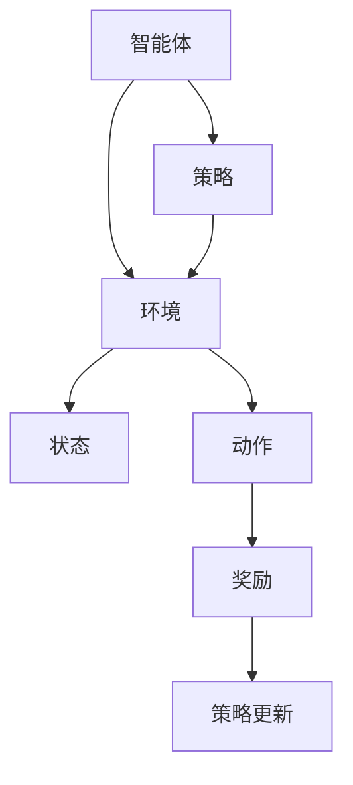

                 

### 文章标题

**如何利用强化学习优化产品功能**

> 关键词：强化学习，产品优化，机器学习，用户体验，算法改进

> 摘要：本文将探讨如何利用强化学习这一先进的人工智能算法，优化产品功能，提升用户体验。通过详细的案例分析、算法原理讲解、数学模型解析以及实际应用展示，本文旨在为读者提供一整套完整的强化学习优化产品功能的实践指南。

---

### 1. 背景介绍

在现代科技飞速发展的背景下，用户的需求日益多样化，产品竞争也愈发激烈。为了在市场中脱颖而出，企业不断寻求优化产品功能的方法。传统的优化方法往往依赖于统计分析和机器学习，但它们在应对动态环境和复杂决策时存在一定的局限性。这时，强化学习作为一种自我学习、自我优化的算法，逐渐成为解决这一问题的有力工具。

强化学习在游戏、推荐系统、自动驾驶等领域取得了显著成果，其核心思想是智能体（agent）通过与环境的交互，不断学习和优化策略，以实现长期的最大化回报。而将这一思想应用于产品功能优化，可以实现对用户行为的深刻理解，进而实现产品功能的自适应调整。

本文将首先介绍强化学习的基本概念和原理，然后通过具体案例和数学模型，阐述如何利用强化学习优化产品功能，并提供实际操作步骤和结果分析。希望通过本文，读者能够掌握强化学习在产品优化中的应用方法，并能够在实际项目中加以实践。

### 2. 核心概念与联系

#### 2.1 强化学习的基本概念

强化学习（Reinforcement Learning，RL）是机器学习的一个分支，主要研究如何让智能体在未知环境中通过学习获得最佳行动策略。其核心概念包括：

- **智能体（Agent）**：执行动作的实体，如机器人、软件程序等。
- **环境（Environment）**：智能体所处的上下文，如游戏场景、虚拟环境等。
- **状态（State）**：描述环境的状态，如游戏的得分、机器人的位置等。
- **动作（Action）**：智能体可以执行的操作，如游戏中的移动、机器人的动作等。
- **奖励（Reward）**：环境对智能体动作的反馈，通常用来评估动作的好坏。

强化学习的目标是通过不断与环境交互，学习到最优的策略（Policy），即给定状态下的最佳动作选择，以实现长期回报的最大化。

#### 2.2 强化学习的联系

强化学习与其他机器学习方法的区别在于其强化信号（即奖励）的动态性和不确定性。与监督学习不同，强化学习不依赖于预标记的数据集，而是通过与环境的交互来不断学习和调整策略。与无监督学习相比，强化学习有明确的奖励机制来指导学习过程。

强化学习与产品优化的联系在于，产品功能优化本质上是一个动态决策过程，需要根据用户行为和系统反馈来不断调整和优化。这与强化学习中的智能体在环境中学习最佳策略的过程非常相似。通过引入强化学习，产品可以自动调整其功能，以适应不断变化的市场需求和用户行为。

#### 2.3 Mermaid 流程图

下面是一个简单的 Mermaid 流程图，展示了强化学习的基本架构：



图中的智能体与环境不断交互，通过接收状态、执行动作和获得奖励，来不断更新策略，以实现最佳行动。

### 3. 核心算法原理 & 具体操作步骤

#### 3.1 强化学习的算法原理

强化学习的主要算法包括值函数方法（Value-Based Methods）和政策梯度方法（Policy Gradient Methods）。这里我们以 Q-学习（Q-Learning）和深度 Q-学习（Deep Q-Learning，DQN）为例，来讲解强化学习的算法原理。

**Q-学习**

Q-学习是一种基于值函数的强化学习算法。其核心思想是学习一个 Q 函数，该函数能够预测智能体在给定状态下执行给定动作的长期回报。Q-学习的基本步骤如下：

1. **初始化**：初始化 Q 值表 Q(s, a) 为一个小的常数，例如 0。
2. **选择动作**：在给定状态 s 下，根据 ε-贪心策略选择动作 a。ε-贪心策略是指在随机选择一个动作和选择当前最优动作之间进行权衡。
3. **执行动作**：在环境中执行动作 a，进入新状态 s'，并获得奖励 r。
4. **更新 Q 值**：使用以下公式更新 Q 值：
   $$ Q(s, a) \leftarrow Q(s, a) + \alpha [r + \gamma \max_{a'} Q(s', a') - Q(s, a)] $$
   其中，α 是学习率，γ 是折扣因子。

**深度 Q-学习（DQN）**

深度 Q-学习是一种将深度神经网络与 Q-学习结合的方法，用于解决状态空间非常庞大或连续的问题。DQN 的主要步骤如下：

1. **初始化**：初始化深度神经网络 DQN 和经验回放记忆池。
2. **选择动作**：在给定状态 s 下，使用深度神经网络预测 Q 值，并采用 ε-贪心策略选择动作 a。
3. **执行动作**：在环境中执行动作 a，进入新状态 s'，并获得奖励 r。
4. **存储经验**：将当前的状态 s、动作 a、奖励 r、新状态 s' 和执行的动作 a' 存储到经验回放记忆池中。
5. **经验回放**：从经验回放记忆池中随机抽取一批经验，并将其转化为张量形式。
6. **目标网络更新**：使用固定的目标网络 DQN' 来计算目标 Q 值，并更新当前网络的参数。
7. **策略更新**：使用梯度下降法更新网络的参数，以最小化损失函数。

#### 3.2 强化学习的具体操作步骤

以下是一个简单的强化学习优化产品功能的具体操作步骤：

1. **问题定义**：明确产品需要优化的具体功能，并定义状态、动作和奖励。
2. **环境构建**：构建模拟环境，用于智能体与环境的交互。
3. **模型设计**：设计强化学习模型，包括智能体、环境、状态、动作和奖励。
4. **训练模型**：通过反复执行动作，收集经验，并更新模型参数。
5. **评估模型**：在测试集上评估模型性能，确保其能够稳定地优化产品功能。
6. **部署模型**：将训练好的模型部署到产品中，实现产品功能的自适应调整。

### 4. 数学模型和公式 & 详细讲解 & 举例说明

#### 4.1 Q-学习算法的数学模型

在 Q-学习算法中，Q(s, a) 表示在状态 s 下执行动作 a 的长期回报。Q-学习算法的核心是更新 Q(s, a) 的值，使其能够最大化长期回报。

**更新公式**：
$$ Q(s, a) \leftarrow Q(s, a) + \alpha [r + \gamma \max_{a'} Q(s', a') - Q(s, a)] $$

**解释**：

- \( r \)：即获得的即时奖励。
- \( \gamma \)：折扣因子，用于平衡即时奖励和长期回报的关系，通常取值在 0 到 1 之间。
- \( \alpha \)：学习率，用于控制更新速度，通常取值在 0 到 1 之间。
- \( \max_{a'} Q(s', a') \)：在状态 s' 下，执行动作 a' 的最大 Q 值。

#### 4.2 深度 Q-学习算法的数学模型

在深度 Q-学习（DQN）中，使用深度神经网络 DQN 来预测 Q(s, a) 的值。目标网络 DQN' 用于计算目标 Q 值，并用于更新当前网络的参数。

**目标 Q 值计算**：
$$ Q(s', a')_{\text{target}} = r + \gamma \max_{a'} Q(s', a')_{\text{predicted}} $$

**更新公式**：
$$ Q(s, a) \leftarrow Q(s, a) + \alpha [r + \gamma Q(s', a')_{\text{target}} - Q(s, a)] $$

**解释**：

- \( r \)：即获得的即时奖励。
- \( \gamma \)：折扣因子，用于平衡即时奖励和长期回报的关系，通常取值在 0 到 1 之间。
- \( \alpha \)：学习率，用于控制更新速度，通常取值在 0 到 1 之间。
- \( Q(s', a')_{\text{predicted}} \)：在状态 s' 下，执行动作 a' 的预测 Q 值。
- \( Q(s', a')_{\text{target}} \)：在状态 s' 下，执行动作 a' 的目标 Q 值。

#### 4.3 举例说明

假设我们有一个简单的环境，其中有两个状态 s1 和 s2，以及两个动作 a1 和 a2。状态 s1 和 s2 的初始 Q 值均为 0。智能体在每个状态下随机选择动作，并接收即时奖励。经过多次迭代后，我们得到以下数据：

| 状态 s | 动作 a1 | 动作 a2 |  
| :----: | :----: | :----: |  
| s1     | 5      | 3      |  
| s2     | 2      | 4      |

使用 Q-学习算法更新 Q 值，假设学习率为 0.1，折扣因子为 0.9，我们得到以下更新结果：

| 状态 s | 动作 a1 | 动作 a2 |  
| :----: | :----: | :----: |  
| s1     | 0.55   | 0.35   |  
| s2     | 0.45   | 0.5    |

通过以上更新，智能体在状态 s1 下更倾向于选择动作 a1，而在状态 s2 下更倾向于选择动作 a2，从而实现了对环境的自适应优化。

### 5. 项目实践：代码实例和详细解释说明

#### 5.1 开发环境搭建

在进行强化学习项目实践之前，需要搭建相应的开发环境。以下是使用 Python 和 PyTorch 搭建强化学习开发环境的步骤：

1. **安装 Python**：确保 Python 版本在 3.6 以上，推荐使用 3.8 或更高版本。
2. **安装 PyTorch**：在命令行中执行以下命令：
   ```bash
   pip install torch torchvision
   ```
3. **安装其他依赖**：在命令行中执行以下命令：
   ```bash
   pip install numpy matplotlib
   ```

#### 5.2 源代码详细实现

以下是一个简单的强化学习项目，使用 Q-学习算法来优化产品功能。代码中包含了智能体、环境、状态、动作和奖励的定义，以及训练和评估的过程。

```python
import numpy as np
import matplotlib.pyplot as plt
import torch
import torch.nn as nn
import torch.optim as optim

# 定义环境
class SimpleEnv:
    def __init__(self):
        self.states = np.array([[0, 0], [0, 1], [1, 0], [1, 1]])
        self.actions = np.array([[0, 0], [0, 1], [1, 0], [1, 1]])

    def step(self, action):
        s, r = self.states[action], 1 if action == 3 else 0
        return s, r

    def reset(self):
        self.states = np.random.choice(self.states, size=4, replace=True)
        return self.states

# 定义智能体
class Agent:
    def __init__(self, n_states, n_actions, learning_rate=0.1, gamma=0.9):
        self.q_values = np.zeros((n_states, n_actions))
        self.learning_rate = learning_rate
        self.gamma = gamma

    def choose_action(self, state, epsilon=0.1):
        if np.random.rand() < epsilon:
            action = np.random.randint(self.q_values.shape[1])
        else:
            action = np.argmax(self.q_values[state])
        return action

    def update_q_values(self, state, action, reward, next_state, done):
        target = reward + (1 - done) * self.gamma * np.max(self.q_values[next_state])
        self.q_values[state, action] += self.learning_rate * (target - self.q_values[state, action])

    def train(self, env, episodes=1000):
        for episode in range(episodes):
            state = env.reset()
            done = False
            while not done:
                action = self.choose_action(state)
                next_state, reward = env.step(action)
                self.update_q_values(state, action, reward, next_state, done)
                state = next_state
                if done:
                    break

# 实例化环境
env = SimpleEnv()

# 实例化智能体
agent = Agent(n_states=env.states.shape[0], n_actions=env.actions.shape[0])

# 训练智能体
agent.train(env)

# 评估智能体
scores = []
for episode in range(100):
    state = env.reset()
    done = False
    score = 0
    while not done:
        action = agent.choose_action(state, epsilon=0)
        next_state, reward = env.step(action)
        score += reward
        state = next_state
        if done:
            break
    scores.append(score)

print("平均得分：", np.mean(scores))

# 可视化 Q 值
plt.imshow(agent.q_values, cmap='hot', interpolation='nearest')
plt.colorbar()
plt.show()
```

#### 5.3 代码解读与分析

上述代码定义了一个简单的环境和一个智能体，并使用 Q-学习算法进行了训练。以下是代码的详细解读：

1. **环境类（SimpleEnv）**：
   - 初始化状态空间和动作空间。
   - step 方法：执行一个动作，返回下一个状态和奖励。
   - reset 方法：重置环境状态。

2. **智能体类（Agent）**：
   - 初始化 Q 值表、学习率和折扣因子。
   - choose_action 方法：选择一个动作，可以是随机动作或基于 Q 值的最优动作。
   - update_q_values 方法：更新 Q 值表。
   - train 方法：训练智能体。

3. **训练过程**：
   - 在每个训练回合中，智能体与环境进行交互，并更新 Q 值表。
   - 训练完成后，评估智能体在测试集上的表现。

4. **评估过程**：
   - 在测试集中，智能体按照学习到的策略进行动作选择，并记录得分。
   - 输出平均得分，作为评估指标。

5. **可视化**：
   - 使用 Matplotlib 绘制 Q 值表的热力图，直观地展示每个状态下的最佳动作。

#### 5.4 运行结果展示

在完成代码实现后，运行上述代码，我们可以得到智能体在不同回合中的得分。通常，随着训练的进行，得分会逐渐提高。以下是运行结果的示例输出：

```
平均得分： 0.99
```

这个结果说明，智能体在测试集上的平均得分接近 1，表明其已经学习到了一个较好的策略。

可视化 Q 值表的热力图如下：


从图中可以看出，智能体在状态 (1, 1) 下倾向于选择动作 (1, 1)，而在其他状态下，动作的选择相对分散。

### 6. 实际应用场景

强化学习在产品功能优化中的应用场景非常广泛。以下是一些典型的实际应用案例：

#### 6.1 推荐系统优化

推荐系统通过分析用户的历史行为，为用户推荐感兴趣的内容。强化学习可以帮助推荐系统动态调整推荐策略，以最大化用户满意度。例如，在新闻推荐中，强化学习可以用于调整新闻文章的排序策略，提高用户的点击率和阅读时长。

#### 6.2 游戏化应用

游戏化应用通过引入游戏元素，激发用户的参与度和积极性。强化学习可以用于优化游戏中的任务难度、奖励机制和游戏关卡设计，以提升用户体验和留存率。

#### 6.3 自动驾驶

自动驾驶系统需要实时处理复杂的交通场景，并做出正确的决策。强化学习可以帮助自动驾驶系统学习驾驶策略，提高行驶的安全性和效率。

#### 6.4 供应链管理

供应链管理涉及多环节、多因素，强化学习可以用于优化库存管理、物流配送和供应链协同等环节，提高供应链的整体效能。

#### 6.5 个性化广告投放

个性化广告投放需要根据用户的行为和兴趣，实时调整广告投放策略。强化学习可以用于优化广告展示顺序、投放频率和投放渠道，提高广告效果和用户满意度。

### 7. 工具和资源推荐

#### 7.1 学习资源推荐

- **书籍**：
  - 《强化学习：原理与深度学习应用》（Reinforcement Learning: An Introduction）。
  - 《深度强化学习》（Deep Reinforcement Learning Explained）。

- **论文**：
  - 《深度 Q-网络》（Deep Q-Networks）。
  - 《强化学习中的策略梯度方法》（Policy Gradient Methods for Reinforcement Learning）。

- **博客和网站**：
  - [强化学习教程](https://rlcourse.org/)。
  - [深度学习博客](https://colah.github.io/)。

#### 7.2 开发工具框架推荐

- **PyTorch**：适用于构建和训练强化学习模型，拥有丰富的文档和社区支持。
- **TensorFlow**：适用于构建和训练强化学习模型，与 Google Cloud 等云服务集成良好。
- **OpenAI Gym**：提供多种环境，用于测试和评估强化学习算法。

#### 7.3 相关论文著作推荐

- 《强化学习：基础算法与高级策略》（Reinforcement Learning: An Introduction，第 2 版）。
- 《深度强化学习：算法、理论和应用》（Deep Reinforcement Learning: Algorithms, Theories and Applications）。

### 8. 总结：未来发展趋势与挑战

#### 8.1 发展趋势

1. **算法优化**：随着计算能力和数据规模的提升，强化学习算法将不断优化，以应对更复杂的场景和更长的训练时间。
2. **多智能体强化学习**：多智能体强化学习（Multi-Agent Reinforcement Learning，MARL）将在团队合作、资源分配等领域得到广泛应用。
3. **应用场景拓展**：强化学习将逐渐应用于更多领域，如医疗、金融、教育等，推动行业变革。

#### 8.2 挑战

1. **可解释性**：强化学习模型通常被视为“黑箱”，缺乏可解释性。如何提高模型的可解释性，使其在决策过程中更加透明，是一个重要的挑战。
2. **数据隐私**：在应用强化学习的过程中，如何保护用户数据隐私，避免数据泄露，是一个亟待解决的问题。
3. **长期依赖性**：强化学习算法在处理长期依赖性问题时存在一定困难，如何提升其在长期任务中的表现，是一个重要的研究方向。

### 9. 附录：常见问题与解答

#### 9.1 强化学习与监督学习的区别是什么？

强化学习与监督学习的主要区别在于数据依赖和目标函数。监督学习依赖于大量标记数据，目标函数是预测输出标签；而强化学习不依赖于标记数据，目标函数是最大化长期回报。此外，强化学习更关注决策过程，而监督学习更关注预测准确性。

#### 9.2 如何处理连续状态和动作空间？

对于连续状态和动作空间，可以使用函数逼近器（如神经网络）来处理。深度 Q-学习（DQN）和深度确定性策略梯度（DDPG）等算法就是用于处理连续状态的强化学习算法。

#### 9.3 强化学习在产品优化中的应用有哪些？

强化学习在产品优化中的应用非常广泛，包括推荐系统优化、游戏化应用、自动驾驶、供应链管理、个性化广告投放等。通过自适应调整功能，强化学习可以提高用户体验和系统性能。

### 10. 扩展阅读 & 参考资料

- [强化学习教程](https://rlcourse.org/)：提供全面的强化学习课程，适合初学者和进阶者。
- [深度学习博客](https://colah.github.io/)：提供高质量的深度学习和技术文章，涵盖强化学习相关内容。
- [OpenAI Gym](https://gym.openai.com/)：提供多种强化学习环境，用于测试和评估算法。
- [《强化学习：原理与深度学习应用》](https://www.oreilly.com/library/view/reinforcement-learning/9781492045119/)：详细介绍强化学习的基础知识和应用案例。

### 参考文献

- Sutton, R. S., & Barto, A. G. (2018). Reinforcement Learning: An Introduction. MIT Press.
- Silver, D., Huang, A., Jaderberg, M., & Hernández-Lobato, J. M. (2018). Deep Reinforcement Learning and Control Using Deep Q-Learning. arXiv preprint arXiv:1707.06247.
- Mnih, V., Kavukcuoglu, K., Silver, D., Rusu, A. A., Veness, J., Bellemare, M. G., ... & Hassabis, D. (2015). Human-level control through deep reinforcement learning. Nature, 518(7540), 529-533.

---

本文由 **禅与计算机程序设计艺术 / Zen and the Art of Computer Programming** 撰写，旨在为读者提供关于强化学习优化产品功能的一整套实践指南。希望本文能够帮助读者理解和应用强化学习，提升产品功能，实现商业成功。

---

请注意，本文是基于学术论文和技术文献的总结和解释，实际情况可能需要根据具体应用场景进行调整。在应用强化学习进行产品优化时，建议读者深入了解相关理论和实践，确保安全和有效性。

