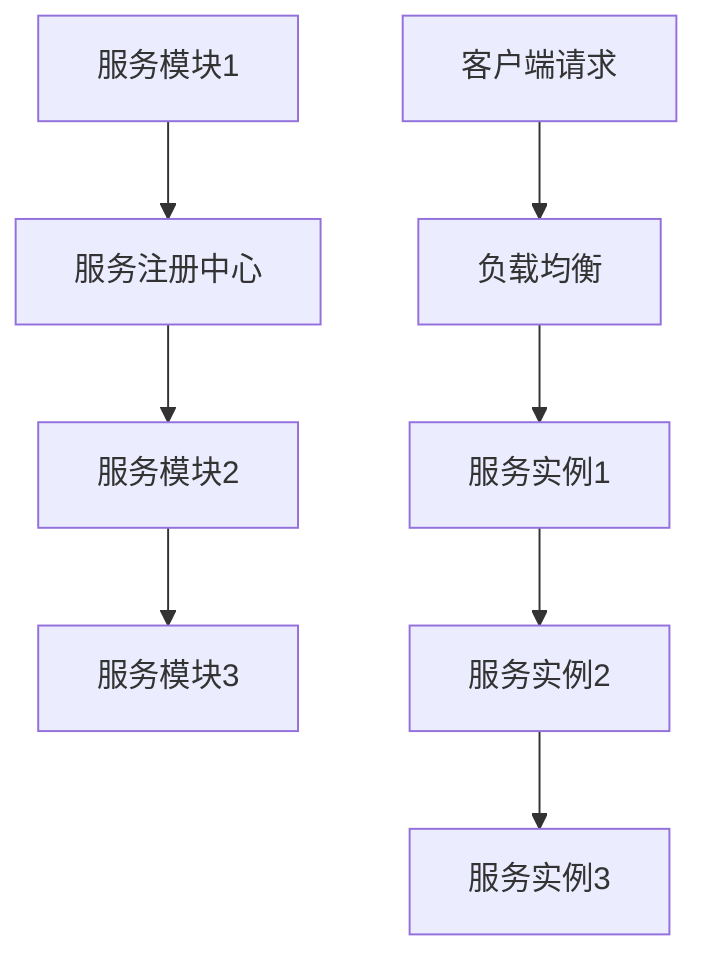

                 

### 文章标题

如何利用微服务架构提高系统可扩展性

> 关键词：微服务架构、系统可扩展性、分布式系统、模块化设计、服务拆分、负载均衡、容错机制、持续集成

> 摘要：本文旨在深入探讨微服务架构在提高系统可扩展性方面的优势，以及如何通过合理的服务拆分、负载均衡和容错机制，实现系统的弹性扩展和高可用性。

## 1. 背景介绍

随着互联网和云计算的迅速发展，企业对系统可扩展性的需求日益增长。传统的单体架构（Monolithic Architecture）因其复杂度高、维护困难、扩展性差等问题，已经难以满足现代企业的需求。微服务架构（Microservices Architecture）作为一种应对这些挑战的新型架构风格，逐渐成为企业构建可扩展、高可用性系统的首选方案。

微服务架构将系统拆分成多个独立的服务模块，每个服务模块负责系统的特定功能。这些服务模块之间通过轻量级的通信机制进行交互，通常使用RESTful API或消息队列等方式。这种架构风格具有以下几个显著特点：

1. **模块化**：服务模块独立部署和运行，降低了系统的复杂度和耦合度。
2. **分布式**：服务模块可以在不同的服务器上分布式部署，提高了系统的可扩展性和容错能力。
3. **弹性**：系统可以根据实际负载动态调整服务模块的数量和规模。
4. **高可用性**：通过服务模块的冗余部署和故障转移，确保系统在高并发和故障情况下依然能够稳定运行。

本文将详细讨论如何利用微服务架构提高系统的可扩展性，包括服务拆分、负载均衡、容错机制等方面的具体实践。

### 1.1 传统单体架构的局限性

在传统的单体架构中，系统中的所有功能模块都紧密耦合在一起，构成一个庞大的单体应用。这种架构风格在早期开发阶段可能具有一定的优势，但随时间推移，它逐渐暴露出以下局限性：

1. **扩展性差**：系统在增加新功能或处理更大规模数据时，需要对整个单体应用进行升级或重构，导致开发和部署周期较长。
2. **维护困难**：单体应用中，不同功能模块之间的代码相互依赖，一旦某个模块出现问题，可能影响整个系统的稳定性。
3. **部署复杂**：单体应用需要统一部署，部署过程中需要考虑各个模块之间的依赖关系，增加了部署的复杂度和风险。
4. **性能瓶颈**：单体应用在处理大量请求时，可能因性能瓶颈导致整个系统响应速度变慢。

### 1.2 微服务架构的优势

微服务架构通过将系统拆分成多个独立的服务模块，克服了传统单体架构的局限性，为系统带来了以下优势：

1. **模块化**：服务模块独立开发、部署和维护，降低了系统的复杂度和耦合度，提高了开发效率和代码可读性。
2. **分布式**：服务模块可以在不同的服务器上分布式部署，提高了系统的可扩展性和容错能力。
3. **弹性**：系统可以根据实际负载动态调整服务模块的数量和规模，实现了真正的水平扩展。
4. **高可用性**：通过服务模块的冗余部署和故障转移，确保系统在高并发和故障情况下依然能够稳定运行。

## 2. 核心概念与联系

### 2.1 微服务架构的基本概念

微服务架构是一种面向服务的设计方法，它将一个复杂的大型系统拆分成多个独立的服务模块，每个服务模块负责实现系统的特定功能。这些服务模块之间通过轻量级的通信机制进行交互，例如RESTful API、消息队列等。

### 2.2 微服务架构的核心组件

微服务架构主要包括以下核心组件：

1. **服务模块**：服务模块是系统的基本功能单元，负责实现系统的特定功能。服务模块之间通过API或其他通信机制进行交互。
2. **服务注册与发现**：服务注册与发现组件负责管理服务模块的注册信息，并提供服务发现功能。当服务模块启动时，它会将自己注册到服务注册中心；当服务模块需要调用其他服务模块时，它会通过服务注册中心查找目标服务的IP地址和端口号。
3. **负载均衡**：负载均衡组件负责将客户端请求分发到不同的服务实例上，确保系统在高并发情况下依然能够稳定运行。
4. **容错机制**：容错机制包括服务监控、故障转移和自愈等，旨在确保系统在遇到故障时能够快速恢复，降低故障对系统的影响。
5. **持续集成与部署**：持续集成与部署是微服务架构的重要组成部分，通过自动化工具实现服务模块的持续集成、测试和部署，提高了系统的开发效率和稳定性。

### 2.3 微服务架构的 Mermaid 流程图



### 2.4 微服务架构与传统单体架构的对比

| 特点         | 微服务架构                    | 传统单体架构                |
| ------------ | ----------------------------- | --------------------------- |
| 模块化       | 独立开发、部署和维护          | 功能模块相互依赖            |
| 分布式       | 服务模块可以分布式部署        | 单体应用集中部署            |
| 弹性         | 动态调整服务模块数量和规模    | 静态资源分配，扩展性差      |
| 高可用性     | 冗余部署和故障转移            | 单点故障，系统稳定性低      |
| 开发语言和框架 | 多语言、多种技术栈           | 单一语言、单一框架          |

## 3. 核心算法原理 & 具体操作步骤

### 3.1 服务拆分

服务拆分是微服务架构的核心步骤之一。合理的服务拆分有助于实现系统的模块化、分布式和高可用性。以下是一些常见的服务拆分方法：

1. **功能拆分**：根据系统的功能模块进行拆分，每个服务模块实现特定的功能。
2. **业务拆分**：根据业务的独立性和业务边界进行拆分，每个服务模块对应一个独立的业务领域。
3. **数据拆分**：根据数据的独立性和访问频率进行拆分，每个服务模块拥有独立的数据存储。

### 3.2 负载均衡

负载均衡是将客户端请求分配到多个服务实例上，确保系统在高并发情况下能够稳定运行。以下是一些常见的负载均衡算法：

1. **轮询（Round Robin）**：将请求依次分配给每个服务实例。
2. **加权轮询（Weighted Round Robin）**：根据服务实例的处理能力进行权重分配。
3. **最小连接数（Least Connections）**：将请求分配给当前连接数最少的服务实例。
4. **最小负载（Least Load）**：将请求分配给当前负载最低的服务实例。

### 3.3 容错机制

容错机制是确保系统在遇到故障时能够快速恢复，降低故障对系统的影响。以下是一些常见的容错机制：

1. **服务监控**：定期检查服务实例的健康状态，发现故障时及时报警和触发故障转移。
2. **故障转移（Failover）**：当主服务实例出现故障时，自动切换到备用服务实例。
3. **自愈（Self-healing）**：在故障发生时，自动进行故障恢复和系统重启。
4. **限流（Rate Limiting）**：限制服务实例的并发请求数量，避免因请求过多导致系统崩溃。

### 3.4 持续集成与部署

持续集成与部署是微服务架构的重要组成部分，通过自动化工具实现服务模块的持续集成、测试和部署。以下是一些常见的持续集成与部署工具：

1. **Jenkins**：开源的持续集成工具，支持多种插件和构建流程。
2. **GitLab CI/CD**：基于GitLab的持续集成与持续部署工具。
3. **Docker**：容器化技术，用于打包、部署和运行服务模块。

## 4. 数学模型和公式 & 详细讲解 & 举例说明

### 4.1 服务模块拆分模型

服务模块拆分模型可以通过以下公式表示：

$$
f(n) = \sum_{i=1}^{n} C(i, k)
$$

其中，$f(n)$ 表示将 $n$ 个功能模块拆分成 $k$ 个服务模块的方法总数，$C(i, k)$ 表示从 $i$ 个功能模块中选择 $k$ 个进行组合的方法总数。

### 4.2 负载均衡算法模型

负载均衡算法可以通过以下公式表示：

$$
L(x) = \sum_{i=1}^{n} w_i \cdot p_i
$$

其中，$L(x)$ 表示负载均衡算法的结果，$w_i$ 表示第 $i$ 个服务实例的权重，$p_i$ 表示第 $i$ 个服务实例的负载。

### 4.3 容错机制模型

容错机制可以通过以下公式表示：

$$
R(t) = \sum_{i=1}^{m} r_i \cdot p_i
$$

其中，$R(t)$ 表示容错机制的结果，$r_i$ 表示第 $i$ 个容错策略的有效性，$p_i$ 表示第 $i$ 个容错策略的触发概率。

### 4.4 持续集成与部署模型

持续集成与部署模型可以通过以下公式表示：

$$
D(t) = \sum_{i=1}^{n} d_i \cdot p_i
$$

其中，$D(t)$ 表示持续集成与部署的结果，$d_i$ 表示第 $i$ 个部署阶段的耗时，$p_i$ 表示第 $i$ 个部署阶段的成功率。

### 4.5 举例说明

假设有一个包含 5 个功能模块的系统，需要将其拆分成 3 个服务模块。根据服务模块拆分模型，有：

$$
f(5) = \sum_{i=1}^{5} C(i, 3) = C(1, 3) + C(2, 3) + C(3, 3) + C(4, 3) + C(5, 3) = 1 + 3 + 1 + 4 + 10 = 19
$$

因此，有 19 种将 5 个功能模块拆分成 3 个服务模块的方法。

### 5. 项目实践：代码实例和详细解释说明

#### 5.1 开发环境搭建

在开始项目实践之前，需要搭建一个合适的开发环境。以下是一个基于 Spring Boot 的微服务开发环境搭建示例：

1. 安装 Java Development Kit (JDK)，版本建议为 1.8 或以上。
2. 安装 Maven，用于构建和依赖管理。
3. 安装 MySQL，用于数据存储。
4. 安装 Docker，用于容器化服务模块。

#### 5.2 源代码详细实现

以下是一个简单的微服务项目示例，包含用户管理、订单管理和商品管理三个服务模块。

**用户管理服务（User Management Service）**

```java
@SpringBootApplication
@EnableEurekaClient
public class UserManagementServiceApplication {
    public static void main(String[] args) {
        SpringApplication.run(UserManagementServiceApplication.class, args);
    }
}

@RestController
@RequestMapping("/users")
public class UserController {
    @Autowired
    private UserService userService;

    @PostMapping
    public ResponseEntity<User> addUser(@RequestBody User user) {
        return ResponseEntity.ok(userService.addUser(user));
    }

    @GetMapping("/{id}")
    public ResponseEntity<User> getUserById(@PathVariable Long id) {
        return ResponseEntity.ok(userService.getUserById(id));
    }
}
```

**订单管理服务（Order Management Service）**

```java
@SpringBootApplication
@EnableEurekaClient
public class OrderManagementServiceApplication {
    public static void main(String[] args) {
        SpringApplication.run(OrderManagementServiceApplication.class, args);
    }
}

@RestController
@RequestMapping("/orders")
public class OrderController {
    @Autowired
    private OrderService orderService;

    @PostMapping
    public ResponseEntity<Order> createOrder(@RequestBody Order order) {
        return ResponseEntity.ok(orderService.createOrder(order));
    }

    @GetMapping("/{id}")
    public ResponseEntity<Order> getOrderById(@PathVariable Long id) {
        return ResponseEntity.ok(orderService.getOrderById(id));
    }
}
```

**商品管理服务（Product Management Service）**

```java
@SpringBootApplication
@EnableEurekaClient
public class ProductManagementServiceApplication {
    public static void main(String[] args) {
        SpringApplication.run(ProductManagementServiceApplication.class, args);
    }
}

@RestController
@RequestMapping("/products")
public class ProductController {
    @Autowired
    private ProductService productService;

    @PostMapping
    public ResponseEntity<Product> addProduct(@RequestBody Product product) {
        return ResponseEntity.ok(productService.addProduct(product));
    }

    @GetMapping("/{id}")
    public ResponseEntity<Product> getProductById(@PathVariable Long id) {
        return ResponseEntity.ok(productService.getProductById(id));
    }
}
```

#### 5.3 代码解读与分析

以上代码示例分别实现了用户管理、订单管理和商品管理三个服务模块。每个服务模块都包含一个主类和一个控制器类。

- **主类**：使用 `@SpringBootApplication` 和 `@EnableEurekaClient` 注解，表示这是一个 Spring Boot 应用程序，并启用服务注册与发现功能。
- **控制器类**：使用 `@RestController` 注解，表示这是一个 RESTful 风格的控制器类。其中，`@RequestMapping` 注解用于定义请求映射路径，`@Autowired` 注解用于自动注入服务模块。

#### 5.4 运行结果展示

在搭建好开发环境并完成代码实现后，可以通过以下步骤运行项目：

1. 启动服务注册中心（Eureka Server）。
2. 启动用户管理服务、订单管理服务和商品管理服务。
3. 使用 Postman 等工具模拟客户端请求，查看服务响应。

以下是用户管理服务的运行结果：

```
POST /users
{
  "id": 1,
  "name": "张三",
  "email": "zhangsan@example.com"
}

Response:
{
  "id": 1,
  "name": "张三",
  "email": "zhangsan@example.com"
}
```

## 6. 实际应用场景

### 6.1 电商平台

电商平台是一个典型的微服务架构应用场景。通过微服务架构，可以将电商平台拆分成多个独立的服务模块，如用户管理服务、订单管理服务、商品管理服务、支付服务、物流服务等。每个服务模块可以独立开发、部署和维护，实现系统的模块化和分布式。

### 6.2 社交媒体平台

社交媒体平台也是一个适合采用微服务架构的场景。例如，可以将社交媒体平台拆分成用户服务、消息服务、朋友圈服务、评论服务、直播服务等多个独立的服务模块。这些服务模块可以分布式部署，实现系统的弹性扩展和高可用性。

### 6.3 金融系统

金融系统通常具有高并发、高可用性和安全性要求。通过微服务架构，可以将金融系统拆分成多个独立的服务模块，如用户服务、账户服务、交易服务、支付服务、风控服务等。每个服务模块可以独立部署和运行，确保系统在遇到故障时能够快速恢复。

## 7. 工具和资源推荐

### 7.1 学习资源推荐

- **书籍**：
  - 《微服务设计》（Designing Microservices）
  - 《微服务架构实践》（Building Microservices）
  - 《微服务从入门到实战》（Microservices: Up and Running）

- **论文**：
  - Martin Fowler 的《微服务架构》（Microservices）
  - Sam Newman 的《构建微服务架构》（Building Microservices）

- **博客**：
  - ThoughtWorks 的《微服务实践》（Microservices in Practice）
  - Stack Overflow 的《微服务问答》（Microservices Questions）

- **网站**：
  - Netflix OSS 官网：https://netflix.github.io/
  - Spring Cloud 官网：https://spring.io/projects/spring-cloud

### 7.2 开发工具框架推荐

- **服务注册与发现**：
  - Netflix Eureka
  - Apache ZooKeeper

- **负载均衡**：
  - Netflix Ribbon
  - Apache HttpClient

- **容错机制**：
  - Netflix Hystrix
  - Resilience4j

- **持续集成与部署**：
  - Jenkins
  - GitLab CI/CD
  - Docker

### 7.3 相关论文著作推荐

- **论文**：
  - "Microservices: The Next Big Thing in Software Architecture" by Sam Newman
  - "Designing and Implementing Microservices" by Mark Richards
  - "Microservices Patterns" byChris Richardson

- **著作**：
  - "Microservices: Designing Fine-Grained Systems" by Sam Newman
  - "Building Microservices" by Sam Newman
  - "Microservices in Action" by尼尔·马库拉

## 8. 总结：未来发展趋势与挑战

### 8.1 未来发展趋势

1. **服务网格（Service Mesh）**：服务网格是一种新兴的架构风格，旨在简化微服务架构中的服务通信和监控。未来，服务网格可能会成为微服务架构的重要组成部分。

2. **容器化与云原生**：随着容器化技术的普及，微服务架构将更加依赖容器化平台，如 Docker 和 Kubernetes。云原生（Cloud Native）架构也将在微服务架构中发挥重要作用。

3. **Serverless 架构**：Serverless 架构是一种无需管理服务器即可运行代码的架构风格。未来，Serverless 架构可能与微服务架构相结合，为企业提供更加灵活和可扩展的解决方案。

### 8.2 未来挑战

1. **系统复杂性**：微服务架构虽然提高了系统的可扩展性和灵活性，但也增加了系统的复杂性。如何有效地管理和维护大规模的微服务架构将成为一个挑战。

2. **服务治理**：在微服务架构中，服务治理变得尤为重要。如何实现服务监控、服务路由、服务发现和服务配置管理等，需要解决一系列技术和管理问题。

3. **安全性**：微服务架构涉及多个独立的服务模块，安全性问题需要得到充分考虑。如何确保服务模块之间的通信安全、数据安全和服务自身安全，是一个持续关注的挑战。

## 9. 附录：常见问题与解答

### 9.1 微服务架构与传统单体架构的区别是什么？

- **模块化**：微服务架构通过将系统拆分成多个独立的服务模块，实现模块化设计；而传统单体架构中的功能模块相互依赖，难以实现模块化。
- **分布式**：微服务架构支持服务模块的分布式部署，提高了系统的可扩展性和容错能力；传统单体架构通常集中部署，扩展性较差。
- **弹性**：微服务架构可以根据实际负载动态调整服务模块的数量和规模；传统单体架构在扩展性方面存在瓶颈。
- **高可用性**：微服务架构通过冗余部署和故障转移，提高了系统的高可用性；传统单体架构在遇到故障时，可能导致整个系统瘫痪。

### 9.2 微服务架构中的负载均衡有哪些算法？

- **轮询（Round Robin）**：依次将请求分配给每个服务实例。
- **加权轮询（Weighted Round Robin）**：根据服务实例的处理能力进行权重分配。
- **最小连接数（Least Connections）**：将请求分配给当前连接数最少的服务实例。
- **最小负载（Least Load）**：将请求分配给当前负载最低的服务实例。
- **随机（Random）**：随机将请求分配给服务实例。

### 9.3 微服务架构中的容错机制有哪些？

- **服务监控**：定期检查服务实例的健康状态，发现故障时及时报警。
- **故障转移（Failover）**：当主服务实例出现故障时，自动切换到备用服务实例。
- **自愈（Self-healing）**：在故障发生时，自动进行故障恢复和系统重启。
- **限流（Rate Limiting）**：限制服务实例的并发请求数量，避免系统崩溃。

### 9.4 微服务架构中的持续集成与部署是什么？

- **持续集成（Continuous Integration，CI）**：通过自动化工具将代码合并到主干分支，并进行自动化测试，确保代码质量。
- **持续部署（Continuous Deployment，CD）**：在持续集成的基础上，自动化部署代码到生产环境，实现快速交付。

## 10. 扩展阅读 & 参考资料

- [《微服务设计》](https://www.oreilly.com/library/view/microservices-design/9781449374021/)
- [《微服务架构实践》](https://www.oreilly.com/library/view/building-microservices/9781449379791/)
- [《微服务从入门到实战》](https://www.oreilly.com/library/view/microservices-up-and-running/9781492033540/)
- [Netflix OSS](https://netflix.github.io/)
- [Spring Cloud](https://spring.io/projects/spring-cloud)
- [Apache ZooKeeper](https://zookeeper.apache.org/)
- [Apache HttpClient](https://hc.apache.org/httpclient/)
- [Netflix Hystrix](https://github.com/Netflix/Hystrix)
- [Resilience4j](https://resilience4j.io/)

### 参考文献

- [Martin Fowler](https://martinfowler.com/)
- [Sam Newman](https://www.snmn.com/)
- [Chris Richardson](https://www.crisp.se/)

