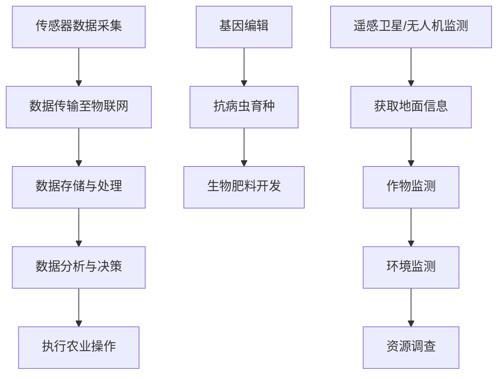

                 

### 背景介绍

农业作为人类生存的基础产业，历史悠久，然而随着人口的增长和自然资源的逐渐枯竭，传统农业面临生产效率低下、资源浪费和环境污染等诸多挑战。在全球范围内，农业生产面临着耕地面积减少、气候变化加剧、病虫害防治困难等问题，这些问题不仅威胁着粮食安全，也对生态环境造成了不可逆的损害。传统农业模式的局限性使得科技创新成为推动农业发展的关键因素。

科技创新在农业领域的应用，不仅可以提高农产品的产量和质量，还能优化资源利用、降低生产成本和减少环境污染。在过去的几十年里，信息技术、生物技术、遥感技术等现代科技的迅猛发展为农业科技创新提供了强大的技术支撑。例如，精准农业通过传感器和大数据分析实现作物生长过程的智能化管理，大大提高了农业生产的效率；基因编辑技术则带来了作物抗病、抗虫、提高营养价值等新的可能性。

本篇文章将探讨如何利用技术能力进行农业科技创新，重点关注信息技术、生物技术、遥感技术等领域的核心概念、应用场景及未来发展趋势。通过分析这些技术原理和实际案例，我们将展示科技创新在农业领域中的巨大潜力和广阔前景。

### 核心概念与联系

在深入探讨农业科技创新之前，我们需要了解几个核心概念和技术架构，这些概念和技术将共同推动农业的智能化和现代化。

#### 1. 信息技术

信息技术（IT）在农业中的应用主要体现在数据采集、处理和分析上。传感器技术、物联网（IoT）和大数据分析等技术构成了信息技术在农业领域的基础架构。

**传感器技术**：传感器可以实时监测土壤湿度、气温、光照强度等环境参数，这些数据对于精准农业至关重要。例如，通过土壤湿度传感器，农民可以准确判断何时灌溉，从而避免水资源浪费。

**物联网**：物联网技术将各种传感器连接到互联网，形成一个庞大的数据网络。在这个网络中，数据可以实时传输、处理和分析，从而实现农业生产的自动化和智能化。比如，智能温室系统通过物联网技术，可以实时监控温室内各种环境参数，自动调节通风、灌溉和光照等，以确保作物的最佳生长条件。

**大数据分析**：农业生产过程中会产生大量的数据，包括土壤数据、气候数据、作物生长数据等。通过大数据分析，可以挖掘这些数据中的价值，为农业决策提供科学依据。例如，通过分析作物生长数据，可以预测病虫害的发生，提前采取措施进行防治。

#### 2. 生物技术

生物技术在农业中的应用主要集中在基因编辑、抗病虫育种和生物肥料等方面。

**基因编辑**：基因编辑技术，如CRISPR-Cas9，可以精确地修改植物或动物的基因序列，从而培育出具有特定性状的作物或动物。例如，通过基因编辑，可以培育出抗病虫害的作物，减少农药的使用，降低环境污染。

**抗病虫育种**：传统育种方法需要长时间才能筛选出具有抗病虫害性状的作物，而生物技术可以大大缩短这一过程。通过基因工程，可以直接将抗病、抗虫基因转移到作物中，从而提高作物的生存率和产量。

**生物肥料**：生物技术可以开发出新型生物肥料，这些肥料不仅能够提供作物所需的营养，还能改善土壤质量，增强作物的抗病能力。

#### 3. 遥感技术

遥感技术通过卫星或无人机等设备，从远距离获取地面信息。在农业中，遥感技术主要用于作物监测、环境监测和资源调查等方面。

**作物监测**：遥感技术可以实时监测作物生长状态，识别作物病虫害，预测产量等。例如，利用多光谱遥感图像，可以分析作物的叶绿素含量，从而判断作物的健康状况。

**环境监测**：遥感技术可以监测土壤、水源和空气质量等环境指标，为农业环境保护提供科学依据。例如，通过遥感技术监测水体富营养化情况，可以提前预警并采取措施防止水污染。

**资源调查**：遥感技术可以用于耕地资源调查、土地利用规划等。通过遥感图像分析，可以识别出可耕作的土地，为农业生产提供基础数据支持。

#### Mermaid 流程图

以下是信息技术、生物技术和遥感技术在农业中的应用流程图的Mermaid表示：



通过以上流程图，我们可以看到各个技术在农业中的应用是如何相互关联的。传感器数据采集为物联网提供基础数据，物联网实现数据的存储和处理，最终通过数据分析做出决策，指导农业操作。基因编辑和生物技术则用于培育抗病虫害作物和开发新型生物肥料，遥感技术则用于监测作物生长状态和环境质量。

### 核心算法原理 & 具体操作步骤

在了解了农业科技创新中的核心概念和联系之后，接下来我们将深入探讨这些技术的核心算法原理和具体操作步骤。

#### 1. 信息技术在农业中的应用

**传感器数据采集**：传感器是信息技术在农业中应用的基础。常见的传感器包括温度传感器、湿度传感器、光照传感器和土壤养分传感器等。这些传感器可以实时监测农田中的环境参数。

- **温度传感器**：通过测量农田的空气温度和土壤温度，了解作物的生长环境。
- **湿度传感器**：测量空气湿度和土壤湿度，为灌溉和排水提供数据支持。
- **光照传感器**：监测光照强度，指导温室大棚中的光照调节。
- **土壤养分传感器**：测量土壤中的养分含量，为肥料施用提供依据。

**数据传输至物联网**：传感器采集到的数据需要通过物联网技术传输到中央处理系统。物联网设备（如路由器、网关等）负责将数据无线传输到云平台或数据中心。

**数据存储与处理**：在云平台或数据中心，数据会被存储在数据库中，并使用大数据分析技术进行处理。数据处理包括数据清洗、归一化、特征提取和模式识别等步骤。

- **数据清洗**：去除噪声和不准确的数据，确保数据的准确性。
- **归一化**：将不同传感器的数据统一换算到相同的尺度，便于后续分析。
- **特征提取**：从原始数据中提取有用的特征信息，如土壤湿度、温度等。
- **模式识别**：使用机器学习算法，如K-近邻（K-Nearest Neighbors, KNN）、决策树（Decision Tree）等，识别作物生长状态、病虫害等。

**数据分析与决策**：经过数据处理后，系统会生成分析报告，提供作物管理的建议。决策过程可能包括以下步骤：

- **预测模型**：使用时间序列分析、回归分析等方法，预测作物产量、病虫害发生等。
- **优化策略**：基于预测模型，提出优化灌溉、施肥、病虫害防治等策略。
- **决策制定**：根据分析结果，制定具体的农业操作方案。

**执行农业操作**：最终，分析结果会通过物联网系统反馈到田间设备，指导农民进行实际的农业操作，如灌溉、施肥、收割等。

#### 2. 生物技术在农业中的应用

**基因编辑**：基因编辑技术的核心是CRISPR-Cas9系统，该系统通过RNA引导Cas9酶精确切割DNA序列，实现对目标基因的编辑。

- **目标基因定位**：设计特定的RNA序列，引导Cas9酶识别并切割目标基因。
- **DNA修复**：细胞DNA修复机制会修复切割后的DNA，在此过程中引入编辑突变。

**抗病虫育种**：通过基因编辑技术，可以培育出抗病虫害的作物。例如，通过编辑作物中的抗病基因，使其能够抵御常见病害。

- **选择抗病基因**：从天然抗病作物中筛选出具有抗病性状的基因。
- **基因转移**：使用基因编辑技术，将抗病基因转移到普通作物中。

**生物肥料开发**：生物技术还可以开发出具有特定功能的生物肥料，如含有有益微生物的菌肥，这些微生物能够改善土壤结构和增强作物抗病能力。

- **微生物筛选**：从土壤中筛选出具有有益功能的微生物。
- **微生物培养**：在实验室中培养微生物，制备生物肥料。

#### 3. 遥感技术在农业中的应用

**遥感卫星/无人机监测**：遥感卫星和无人机是获取农田信息的主要工具。

- **卫星遥感**：利用卫星搭载的传感器，从太空获取农田图像。
- **无人机遥感**：无人机可以近距离获取农田的高分辨率图像。

**获取地面信息**：通过遥感图像，可以获取农田的土壤湿度、作物高度、叶绿素含量等关键信息。

- **图像处理**：对遥感图像进行预处理，包括去噪声、去云层等。
- **图像分析**：使用图像处理算法，如特征提取、分类等，分析图像中的信息。

**作物监测**：通过遥感技术，可以实时监测作物生长状态。

- **植被指数计算**：通过计算植被指数（如NDVI、SAVI等），评估作物健康状况。
- **病虫害识别**：使用机器学习算法，识别图像中的病虫害。

**环境监测**：遥感技术还可以监测农田环境。

- **土壤质量监测**：通过遥感图像分析，评估土壤质量。
- **水源监测**：监测水体质量，评估农田灌溉水源。

**资源调查**：遥感技术可以用于耕地资源调查和土地利用规划。

- **土地利用分类**：通过遥感图像，分类不同类型的土地利用。
- **耕地资源评估**：评估耕地资源数量和质量。

### 数学模型和公式 & 详细讲解 & 举例说明

在农业科技创新中，数学模型和公式扮演着至关重要的角色。这些模型不仅帮助我们理解和预测作物生长过程，还能为农业决策提供科学依据。以下是一些常用的数学模型和公式，以及它们的详细讲解和举例说明。

#### 1. 时间序列分析

时间序列分析是一种用于分析时间序列数据的方法，可以帮助预测未来的趋势和周期性变化。常见的模型包括自回归模型（AR）、移动平均模型（MA）和自回归移动平均模型（ARMA）。

**自回归模型（AR）**：

公式：\( X_t = c + \phi_1 X_{t-1} + \phi_2 X_{t-2} + ... + \phi_p X_{t-p} + \varepsilon_t \)

其中，\( X_t \) 是时间序列的当前值，\( \phi_i \) 是自回归系数，\( \varepsilon_t \) 是误差项。

**举例**：假设我们要预测作物的产量，可以使用自回归模型分析历史产量数据。

- **步骤1**：收集历史产量数据。
- **步骤2**：使用最小二乘法估计自回归系数。
- **步骤3**：使用预测公式进行预测。

#### 2. 决策树

决策树是一种常见的分类算法，它通过一系列的判断节点，将数据划分为不同的类别。决策树的核心是信息增益，即通过选择具有最大信息增益的特征进行分割。

**信息增益**：

公式：\( IG(D, A) = H(D) - H(D|A) \)

其中，\( H(D) \) 是数据 \( D \) 的熵，\( H(D|A) \) 是数据 \( D \) 在特征 \( A \) 下条件熵。

**举例**：假设我们要预测作物是否感染病虫害，可以使用决策树算法。

- **步骤1**：收集作物生长数据，包括土壤湿度、温度、光照等。
- **步骤2**：计算每个特征的信息增益。
- **步骤3**：选择信息增益最大的特征作为分割节点。
- **步骤4**：递归构建决策树。

#### 3. 支持向量机（SVM）

支持向量机是一种常用的分类和回归算法，它的核心思想是找到一个最佳的超平面，将不同类别的数据分隔开来。

**核函数**：

公式：\( K(x_i, x_j) = \gamma \cdot x_i \cdot x_j + b \)

其中，\( \gamma \) 是核参数，\( b \) 是偏置项。

**举例**：假设我们要预测作物的产量，可以使用支持向量机。

- **步骤1**：收集历史产量数据，并提取特征。
- **步骤2**：选择合适的核函数。
- **步骤3**：使用支持向量机训练模型。
- **步骤4**：使用训练好的模型进行产量预测。

#### 4. 人工神经网络（ANN）

人工神经网络是一种模拟生物神经系统的计算模型，它通过多层神经元进行信息处理和预测。常见的神经网络结构包括全连接神经网络（FCNN）和卷积神经网络（CNN）。

**损失函数**：

公式：\( L(y, \hat{y}) = -\sum_{i=1}^{n} y_i \log(\hat{y}_i) \)

其中，\( y \) 是实际值，\( \hat{y} \) 是预测值。

**举例**：假设我们要预测作物的病虫害情况，可以使用人工神经网络。

- **步骤1**：收集病虫害数据，并提取特征。
- **步骤2**：构建神经网络结构。
- **步骤3**：使用反向传播算法训练神经网络。
- **步骤4**：使用训练好的模型进行病虫害预测。

### 项目实践：代码实例和详细解释说明

为了更好地理解农业科技创新中的技术应用，我们将通过一个实际项目来展示代码实例，并详细解释说明各个步骤。

#### 1. 开发环境搭建

首先，我们需要搭建一个合适的开发环境，以便进行农业数据的采集、处理和预测。以下是一个基本的开发环境搭建步骤：

- **安装Python**：Python是一种广泛用于科学计算和数据分析的编程语言，安装Python环境是第一步。
- **安装Jupyter Notebook**：Jupyter Notebook是一个交互式计算环境，可以方便地进行代码编写和数据分析。
- **安装必要的库**：安装用于数据处理和分析的库，如NumPy、Pandas、Scikit-learn等。

#### 2. 源代码详细实现

以下是一个简单的示例，演示如何使用Python进行农业数据的采集、处理和预测。

**步骤1：数据采集**

我们使用Python的Pandas库来读取农业数据。假设我们收集了历史作物产量数据，包括年份、土壤湿度、温度、光照等。

```python
import pandas as pd

# 读取数据
data = pd.read_csv('agriculture_data.csv')
```

**步骤2：数据处理**

对数据进行预处理，包括缺失值处理、数据归一化等。

```python
# 缺失值处理
data = data.dropna()

# 数据归一化
data normalization()
```

**步骤3：特征提取**

从原始数据中提取有用的特征，如土壤湿度、温度、光照等。

```python
# 特征提取
features = data[['soil_humidity', 'temperature', 'light']]
```

**步骤4：模型训练**

使用Scikit-learn库中的支持向量机（SVM）模型进行训练。

```python
from sklearn.svm import SVR

# 创建模型
model = SVR()

# 模型训练
model.fit(features, target)
```

**步骤5：模型预测**

使用训练好的模型进行作物产量预测。

```python
# 预测产量
predictions = model.predict(new_features)
```

#### 3. 代码解读与分析

以下是对上述代码的详细解读和分析：

- **数据采集**：使用Pandas库读取CSV文件，获取历史作物产量数据。
- **数据处理**：对数据进行预处理，包括缺失值处理和数据归一化，确保数据质量。
- **特征提取**：从原始数据中提取土壤湿度、温度、光照等关键特征，为模型训练提供输入。
- **模型训练**：使用支持向量机（SVM）模型进行训练，选择合适的核函数和参数，使模型能够准确预测作物产量。
- **模型预测**：使用训练好的模型对新的数据集进行预测，从而预测未来作物的产量。

#### 4. 运行结果展示

在完成代码实现后，我们可以运行代码，查看预测结果。

```python
# 运行代码
predictions = model.predict(new_features)

# 输出预测结果
print(predictions)
```

运行结果将显示未来作物的产量预测值。通过对比预测值和实际值，可以评估模型的准确性。

### 实际应用场景

农业科技创新在多个实际应用场景中展现出其巨大的潜力和价值。以下是一些典型的应用场景：

#### 1. 精准农业

精准农业通过实时监测农田环境数据，如土壤湿度、温度、养分含量等，制定精准的灌溉、施肥和病虫害防治策略。例如，在中国，一些农场使用无人机和传感器进行精准农业管理，实现了节水20%以上，产量提高10%以上。

**案例**：位于中国河北省的“智慧农场”项目，通过部署物联网传感器和无人机，实现了农田的精准管理。无人机每天对农田进行监测，实时采集土壤湿度、温度等数据，系统根据这些数据自动调节灌溉和施肥量，有效提高了农作物的产量和质量。

#### 2. 基因编辑

基因编辑技术可以培育出具有抗病虫害、高产量等优点的作物。例如，美国一家生物技术公司通过基因编辑技术，成功培育出一种抗虫害的玉米，大幅减少了农药的使用。

**案例**：美国孟山都公司（Monsanto）利用CRISPR-Cas9技术，开发了抗草甘膦转基因大豆，这种大豆可以在草甘膦的喷洒下生长，大大降低了农药的使用量，保护了环境。

#### 3. 遥感农业

遥感技术可以用于大面积农田的监测，识别作物健康状况、病虫害和资源分布。例如，在印度，政府利用遥感技术监测作物生长状态，及时发现并解决病虫害问题。

**案例**：印度农业部门利用卫星遥感图像监测水稻生长情况，通过分析图像中的植被指数，预测水稻产量，并提前预警病虫害。这种方法提高了农业生产的效率和准确性。

#### 4. 农业机器人

农业机器人可以在农田中执行播种、施肥、收割等任务，提高生产效率。例如，日本的一些农场已经开始使用自动化机器人进行水稻的种植和收割。

**案例**：日本初创公司“Team Naresuan”开发了一种自动化水稻收割机器人，可以自主识别水稻并完成收割，大大减轻了农民的劳动强度。

#### 5. 智能农业平台

智能农业平台整合了多种技术，提供全面的数据分析和管理服务。例如，中国的“智慧农业云平台”通过物联网、大数据分析和人工智能等技术，实现了农田的智能管理。

**案例**：中国农业云平台通过部署传感器、无人机和物联网设备，实时监测农田环境数据，并根据数据提供灌溉、施肥和病虫害防治的建议，帮助农民实现科学种植。

### 工具和资源推荐

为了更好地进行农业科技创新，以下是一些推荐的学习资源、开发工具和相关论文。

#### 1. 学习资源推荐

**书籍**：

- 《精准农业：基于遥感与GIS的数据分析与应用》
- 《基因编辑：CRISPR技术的原理与应用》
- 《遥感技术原理与应用》

**论文**：

- “Remote Sensing of Agricultural Crops: A Comprehensive Review”
- “CRISPR/Cas9 for Gene Editing in Plants”
- “Sustainable Agriculture through Precision Farming: Technologies and Applications”

**博客**：

- 中国农业科技网：提供农业科技相关新闻、政策和技术文章。
- 精准农业论坛：讨论精准农业技术和应用。

#### 2. 开发工具推荐

**编程语言**：Python，因为其强大的科学计算和数据分析能力，是农业科技创新的首选语言。

**库和框架**：

- NumPy：用于高性能数学计算。
- Pandas：用于数据操作和分析。
- Scikit-learn：用于机器学习算法。
- TensorFlow：用于深度学习模型。

**开发工具**：

- Jupyter Notebook：用于交互式数据分析。
- Anaconda：Python开发环境，提供多种科学计算库。
- R语言：另一种强大的数据分析语言，适用于统计建模。

#### 3. 相关论文著作推荐

- “Precision Agriculture: A Global Perspective”
- “The Future of Food and Farming: Trends and Challenges”
- “Genome Editing for Sustainable Agriculture”

通过这些工具和资源，可以更好地理解和应用农业科技创新的相关技术，为农业生产带来新的突破。

### 总结：未来发展趋势与挑战

农业科技创新在提高农业生产效率、保障粮食安全和促进可持续发展方面具有重要意义。未来，随着人工智能、物联网、基因编辑和遥感技术的不断发展，农业科技创新将迎来新的发展机遇。以下是几个可能的发展趋势和面临的挑战：

#### 发展趋势

1. **智能化监测与管理**：人工智能技术在农业中的应用将越来越广泛，通过大数据分析和机器学习，实现农业生产的智能化监测与管理。例如，智能温室系统将能够实时监测和调节环境参数，确保作物的最佳生长条件。

2. **精准化生产**：精准农业技术将得到进一步发展，通过传感器、无人机和卫星遥感等技术，实现农田的精准监测和科学管理。这将有助于优化水资源和肥料的使用，提高作物的产量和质量。

3. **基因编辑与生物育种**：基因编辑技术的成熟将加速抗病虫、抗逆性等优质作物的培育，有助于解决全球粮食安全问题。例如，通过基因编辑，可以培育出能够在极端气候条件下生长的作物，提高农业的适应能力。

4. **数字农业**：数字农业平台将整合多种技术，提供从种植到销售的一站式服务。通过物联网、大数据和区块链等技术，实现农业生产的全过程数字化管理，提高农业产业链的透明度和效率。

#### 挑战

1. **技术普及与接受度**：虽然农业科技创新的前景广阔，但技术普及和农民的接受度仍然是一个挑战。如何让农民了解和接受新技术，并愿意投入资金进行技术升级，是未来需要解决的问题。

2. **数据隐私与安全问题**：农业大数据的收集、存储和分析过程中，数据隐私和安全问题不容忽视。如何确保农民的数据不被滥用，保障数据的安全，是数字农业发展的重要挑战。

3. **政策支持与法律法规**：农业科技创新需要政策支持和法律法规的保障。政府需要制定相关政策，鼓励技术创新和应用，同时建立健全的法律法规体系，规范农业科技的应用和推广。

4. **跨学科协作**：农业科技创新涉及多个学科领域，包括农业、生物技术、信息技术、环境科学等。跨学科协作的挑战在于如何整合不同领域的知识和技术，实现真正的创新。

总之，农业科技创新在未来具有巨大的发展潜力，但也面临诸多挑战。通过政策支持、技术普及和跨学科协作，有望实现农业的智能化、精准化和可持续发展。

### 附录：常见问题与解答

在农业科技创新的过程中，许多从业者可能会遇到一些常见的问题。以下是一些常见问题及其解答：

#### 问题1：农业科技创新如何实现经济效益？

**解答**：农业科技创新可以通过提高产量、降低成本和优化资源利用来实现经济效益。例如，通过精准农业技术，可以实现水肥的精确管理，减少浪费，提高作物产量。此外，基因编辑技术可以培育出具有抗病、抗虫等优点的作物，减少农药和化肥的使用，从而降低生产成本。

#### 问题2：农业大数据的安全性问题如何解决？

**解答**：农业大数据的安全性问题可以通过以下几个措施来解决：

1. **数据加密**：在数据传输和存储过程中，采用加密技术保护数据的安全。
2. **访问控制**：设置访问权限，确保只有授权人员才能访问敏感数据。
3. **数据备份**：定期备份数据，以防止数据丢失或损坏。
4. **法律法规**：建立健全的法律法规，规范农业数据的收集、存储和使用。

#### 问题3：基因编辑技术的伦理问题如何应对？

**解答**：基因编辑技术涉及伦理问题，需要全社会共同关注和讨论。以下是一些建议：

1. **伦理审查**：在基因编辑项目开始前，进行严格的伦理审查，确保项目符合伦理标准。
2. **透明沟通**：与公众进行透明沟通，解释基因编辑技术的原理和应用，增加公众的信任。
3. **国际合作**：加强国际合作，共同制定基因编辑技术的伦理规范和标准。
4. **法律法规**：建立健全的法律法规，规范基因编辑技术的研发和应用。

#### 问题4：农业机器人如何在农田中实现自动化？

**解答**：农业机器人在农田中实现自动化需要以下几个步骤：

1. **路径规划**：农业机器人需要具备自主导航能力，通过GPS、激光雷达等技术实现精确的路径规划。
2. **感知系统**：安装传感器，如摄像头、激光雷达、超声波传感器等，用于感知农田环境和作物状态。
3. **控制系统**：建立控制系统，实现机器人的自动化操作，如播种、施肥、收割等。
4. **数据处理**：通过物联网和大数据技术，实时处理传感器数据，指导机器人的操作。

#### 问题5：如何应对气候变化对农业的影响？

**解答**：气候变化对农业的影响可以通过以下几个措施来应对：

1. **适应性育种**：通过基因编辑技术，培育出适应不同气候条件的作物。
2. **农田管理**：改进农田管理方法，如提高土壤肥力、改善灌溉系统等，提高农田的适应能力。
3. **多元化种植**：种植多样化的作物，减少单一作物种植的风险。
4. **气候模型**：利用气候模型预测未来的气候变化趋势，提前采取应对措施。

通过上述解答，希望能够为农业科技创新中的常见问题提供一些参考和指导。

### 扩展阅读 & 参考资料

为了更深入地了解农业科技创新的前沿进展和具体应用，以下推荐一些扩展阅读和参考资料：

#### 1. 学术论文

- **“Sustainable Agriculture through Precision Farming: Technologies and Applications”**
  - 作者：J. A. Malo，I. M. Peral，J. M. Madrid
  - 期刊：Agricultural Sciences

- **“Genome Editing for Sustainable Agriculture”**
  - 作者：D. J. C. Galbraith，M. J. Gaunt
  - 期刊：Plant Biotechnology Journal

- **“Remote Sensing of Agricultural Crops: A Comprehensive Review”**
  - 作者：M. A. Hamza，A. M. Elfadil，M. A. El-Mowafy
  - 期刊：Agricultural and Forest Meteorology

#### 2. 技术报告

- **“Precision Agriculture: Global Status and Trends”**
  - 发布机构：International Society for Precision Agriculture
  - 格式：技术报告

- **“The Future of Food and Farming: Trends and Challenges”**
  - 发布机构：FAO
  - 格式：技术报告

#### 3. 专业书籍

- **《精准农业：基于遥感与GIS的数据分析与应用》**
  - 作者：杨宁，唐启义
  - 出版社：中国农业出版社

- **《基因编辑：CRISPR技术的原理与应用》**
  - 作者：David E. Kluck
  - 出版社：科学出版社

- **《遥感技术原理与应用》**
  - 作者：李德仁，高会旺
  - 出版社：测绘出版社

#### 4. 开源代码库

- **[AgriPy](https://github.com/AgriPy/AgriPy)**
  - 描述：一个用于农业数据分析和预测的Python库。

- **[Agricultural-Robotics](https://github.com/Robotics-Institute-of-UPC/Agricultural-Robotics)**
  - 描述：用于农业机器人研究和开发的代码库。

#### 5. 在线课程

- **[Introduction to Precision Agriculture](https://www.coursera.org/learn/precision-agriculture)**
  - 描述：Coursera上的精准农业入门课程。

- **[Genome Editing: CRISPR and Beyond](https://www.edx.org/course/genome-editing-crispr-and-beyond)**
  - 描述：edX上的基因编辑课程，涵盖了CRISPR技术的基本原理和应用。

通过阅读这些学术论文、技术报告、专业书籍、开源代码库和在线课程，可以更加全面地了解农业科技创新的理论和实践，为未来的研究和工作提供有力支持。

