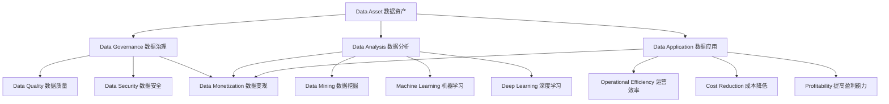

                 

### 背景介绍

在现代商业环境中，数据已成为一种重要的战略资源。企业通过收集、处理和分析海量数据，可以获取有关市场趋势、客户行为和业务运营的洞察，从而做出更明智的决策。然而，仅仅拥有数据并不足以创造价值。关键在于如何利用技术能力将数据转化为商业价值，即所谓的“数据变现”。本文将深入探讨如何利用技术能力进行数据变现，以帮助企业和个人实现数据价值的最大化。

随着大数据、人工智能、云计算等技术的不断发展，数据变现的方法和工具日益丰富。数据变现不仅可以帮助企业提高运营效率、降低成本，还可以开拓新的商业模式和收入来源。例如，通过精准营销、个性化推荐和智能预测等手段，企业可以更好地满足客户需求，提高客户满意度和忠诚度；通过数据挖掘和分析，企业可以发现潜在的商业机会，创造新的产品和服务。

然而，数据变现并非一蹴而就。它需要企业在数据收集、处理、分析和应用等多个环节中投入大量的技术和人力资源。本文将从以下几个部分进行探讨：

1. **核心概念与联系**：介绍数据变现的相关核心概念，如数据资产、数据治理、数据分析和数据应用等，并使用Mermaid流程图展示各概念之间的关联。

2. **核心算法原理与具体操作步骤**：分析数据变现过程中涉及的核心算法，如机器学习、深度学习和数据挖掘等，并详细说明操作步骤。

3. **数学模型和公式**：阐述数据变现中常用的数学模型和公式，并通过举例进行详细讲解。

4. **项目实践**：提供实际项目案例，展示数据变现的具体实现过程和运行结果。

5. **实际应用场景**：探讨数据变现在不同行业和领域的实际应用，如金融、医疗、零售等。

6. **工具和资源推荐**：推荐相关学习资源、开发工具和框架，以及相关论文著作。

7. **总结：未来发展趋势与挑战**：总结数据变现的现状和未来发展趋势，以及面临的挑战。

8. **附录：常见问题与解答**：回答读者可能关心的一些常见问题。

通过本文的探讨，希望能为读者提供关于数据变现的全面理解和实践指导。

### 核心概念与联系

在深入探讨数据变现之前，我们需要了解一些核心概念，这些概念构成了数据变现的理论基础和实际操作框架。以下是数据变现中几个关键的核心概念：

#### 数据资产

数据资产是指企业拥有和管理的各类数据资源，包括内部业务数据、客户数据、市场数据等。数据资产是企业的重要财富，其价值取决于数据的质量、完整性和可用性。数据资产的管理和利用是企业数据变现的基础。

#### 数据治理

数据治理是指企业对数据资产进行管理和控制的一系列策略、过程和活动。数据治理的目标是确保数据的准确性、一致性、完整性和安全性。有效的数据治理可以降低数据风险，提高数据质量，从而为数据变现提供可靠的数据基础。

#### 数据分析

数据分析是指利用统计、机器学习、深度学习等方法对数据进行处理、挖掘和分析，以发现数据中的规律、趋势和关联性。数据分析是数据变现的关键环节，通过数据分析，企业可以从海量数据中提取有价值的信息，指导决策和行动。

#### 数据应用

数据应用是指将数据分析结果应用于企业的实际业务中，以实现商业目标。数据应用的形式多样，包括精准营销、客户关系管理、运营优化、风险评估等。有效的数据应用可以提升企业的运营效率、降低成本、提高盈利能力。

#### 数据变现

数据变现是指将数据资产转化为商业价值的过程。数据变现的途径包括数据交易、数据服务、数据增值等。通过数据变现，企业可以实现数据资产的充分利用，创造新的收入来源。

为了更直观地理解这些核心概念之间的联系，我们可以使用Mermaid流程图来展示它们之间的关系：



在这个流程图中，数据资产是整个数据变现流程的起点，数据治理确保数据资产的质量和安全，数据分析从数据中提取有价值的信息，数据应用将这些信息转化为商业价值，最终实现数据变现。数据变现不仅是数据价值的体现，也是企业利用数据驱动业务发展的关键途径。

### 核心算法原理与具体操作步骤

在数据变现的过程中，核心算法的选择和实现至关重要。以下将介绍几种常见且重要的算法，包括机器学习、深度学习和数据挖掘，并详细说明它们的操作步骤。

#### 1. 机器学习

机器学习是一种通过算法自动从数据中学习规律和模式，从而进行预测和决策的技术。常见的机器学习算法包括线性回归、逻辑回归、支持向量机（SVM）、决策树、随机森林和神经网络等。

**线性回归**

线性回归是一种用于预测数值型目标变量的方法。其基本原理是通过寻找自变量和因变量之间的线性关系，建立线性模型进行预测。

**操作步骤：**

1. 数据预处理：包括数据清洗、归一化、缺失值处理等步骤，确保数据的质量和一致性。
2. 特征选择：选择与目标变量相关的重要特征，排除无关特征，减少模型的复杂度。
3. 模型训练：使用训练数据集，通过最小二乘法等优化算法训练线性回归模型。
4. 模型评估：使用测试数据集评估模型的预测性能，如计算均方误差（MSE）、决定系数（R²）等指标。
5. 预测应用：使用训练好的模型对新数据进行预测。

**示例：**

假设我们有一个简单的线性回归模型，用于预测房价。输入特征为房屋面积和房龄，输出为目标房价。通过训练数据和测试数据，我们可以训练出一个线性回归模型，并使用该模型对新房屋进行房价预测。

```python
from sklearn.linear_model import LinearRegression
from sklearn.model_selection import train_test_split
from sklearn.metrics import mean_squared_error

# 数据预处理
X = df[['面积', '房龄']]
y = df['房价']

# 特征选择
# 这里假设所有特征都是重要的

# 模型训练
model = LinearRegression()
model.fit(X_train, y_train)

# 模型评估
y_pred = model.predict(X_test)
mse = mean_squared_error(y_test, y_pred)
print("MSE:", mse)

# 预测应用
new_data = [[150, 5]]  # 新房屋的面积和房龄
predicted_price = model.predict(new_data)
print("预测房价：", predicted_price)
```

**线性回归模型简洁明了，易于理解和实现。然而，对于非线性关系的数据，线性回归的效果可能不佳。**

**逻辑回归**

逻辑回归是一种用于预测二元目标变量的方法。其基本原理是通过寻找自变量和因变量之间的逻辑关系，建立逻辑模型进行预测。

**操作步骤：**

1. 数据预处理：同线性回归。
2. 特征选择：同线性回归。
3. 模型训练：使用最大似然估计法训练逻辑回归模型。
4. 模型评估：使用测试数据集评估模型的预测性能，如计算准确率、召回率、F1分数等指标。
5. 预测应用：同线性回归。

**示例：**

假设我们有一个逻辑回归模型，用于预测客户是否会在下个月内购买产品。输入特征为客户的年龄、收入和购买历史，输出为是否购买（0或1）。

```python
from sklearn.linear_model import LogisticRegression
from sklearn.model_selection import train_test_split
from sklearn.metrics import accuracy_score

# 数据预处理
X = df[['年龄', '收入', '购买历史']]
y = df['是否购买']

# 特征选择
# 这里假设所有特征都是重要的

# 模型训练
model = LogisticRegression()
model.fit(X_train, y_train)

# 模型评估
y_pred = model.predict(X_test)
accuracy = accuracy_score(y_test, y_pred)
print("准确率：", accuracy)

# 预测应用
new_data = [[25, 50000, 1]]  # 新客户的年龄、收入和购买历史
predicted_purchase = model.predict(new_data)
print("预测是否购买：", predicted_purchase)
```

逻辑回归在处理二元分类问题时具有很高的准确性，广泛应用于金融、医疗和市场营销等领域。

**支持向量机（SVM）**

支持向量机是一种用于分类和回归的机器学习算法。其基本原理是通过找到一个最优的超平面，将不同类别的数据点分隔开。

**操作步骤：**

1. 数据预处理：同线性回归和逻辑回归。
2. 特征选择：同线性回归和逻辑回归。
3. 模型训练：使用支持向量机训练模型。
4. 模型评估：使用测试数据集评估模型的预测性能。
5. 预测应用：同线性回归和逻辑回归。

**示例：**

假设我们有一个SVM模型，用于分类电子邮件是否为垃圾邮件。输入特征为邮件的内容和发件人地址，输出为是否为垃圾邮件（0或1）。

```python
from sklearn.svm import SVC
from sklearn.model_selection import train_test_split
from sklearn.metrics import accuracy_score

# 数据预处理
X = df[['邮件内容', '发件人地址']]
y = df['是否垃圾邮件']

# 特征选择
# 这里假设所有特征都是重要的

# 模型训练
model = SVC()
model.fit(X_train, y_train)

# 模型评估
y_pred = model.predict(X_test)
accuracy = accuracy_score(y_test, y_pred)
print("准确率：", accuracy)

# 预测应用
new_email = [['这是一封测试邮件', 'test@example.com']]  # 新邮件的内容和发件人地址
predicted_spam = model.predict(new_email)
print("预测是否为垃圾邮件：", predicted_spam)
```

SVM在处理高维数据和线性不可分问题方面表现出色，常用于文本分类、图像识别和生物信息学等领域。

**深度学习**

深度学习是一种基于多层神经网络的结构，通过多层次的非线性变换从数据中学习特征和模式。常见的深度学习模型包括卷积神经网络（CNN）、循环神经网络（RNN）和生成对抗网络（GAN）等。

**卷积神经网络（CNN）**

卷积神经网络是一种用于处理图像数据的深度学习模型。其基本原理是通过卷积层、池化层和全连接层等结构提取图像特征并进行分类。

**操作步骤：**

1. 数据预处理：包括图像缩放、归一化、数据增强等步骤。
2. 模型构建：定义卷积神经网络结构，包括卷积层、池化层和全连接层等。
3. 模型训练：使用训练数据集训练模型。
4. 模型评估：使用测试数据集评估模型的预测性能。
5. 预测应用：使用训练好的模型对新图像进行预测。

**示例：**

假设我们有一个CNN模型，用于分类手写数字。输入特征为28x28的灰度图像，输出为数字（0-9）。

```python
import tensorflow as tf
from tensorflow.keras import layers, models

# 数据预处理
# 这里使用MNIST数据集作为示例

# 模型构建
model = models.Sequential()
model.add(layers.Conv2D(32, (3, 3), activation='relu', input_shape=(28, 28, 1)))
model.add(layers.MaxPooling2D((2, 2)))
model.add(layers.Conv2D(64, (3, 3), activation='relu'))
model.add(layers.MaxPooling2D((2, 2)))
model.add(layers.Conv2D(64, (3, 3), activation='relu'))
model.add(layers.Flatten())
model.add(layers.Dense(64, activation='relu'))
model.add(layers.Dense(10, activation='softmax'))

# 模型训练
model.compile(optimizer='adam',
              loss='categorical_crossentropy',
              metrics=['accuracy'])
model.fit(train_images, train_labels, epochs=5, batch_size=64)

# 模型评估
test_loss, test_acc = model.evaluate(test_images, test_labels)
print('测试准确率：', test_acc)

# 预测应用
new_image = tf.expand_dims(new_image, 0)  # 新图像的预处理
predicted_number = model.predict(new_image)
print('预测数字：', tf.argmax(predicted_number, axis=1).numpy())
```

CNN在图像识别和计算机视觉领域表现出色，被广泛应用于人脸识别、物体检测和图像分类等领域。

**循环神经网络（RNN）**

循环神经网络是一种用于处理序列数据的深度学习模型。其基本原理是通过循环结构在序列的不同时间步之间传递信息，从而捕捉序列的特征和模式。

**操作步骤：**

1. 数据预处理：包括序列的编码、归一化和填充等步骤。
2. 模型构建：定义循环神经网络结构，包括输入层、隐藏层和输出层等。
3. 模型训练：使用训练数据集训练模型。
4. 模型评估：使用测试数据集评估模型的预测性能。
5. 预测应用：使用训练好的模型对新序列进行预测。

**示例：**

假设我们有一个RNN模型，用于序列分类。输入特征为文本序列，输出为类别标签。

```python
import tensorflow as tf
from tensorflow.keras import layers, models

# 数据预处理
# 这里使用IMDB电影评论数据集作为示例

# 模型构建
model = models.Sequential()
model.add(layers.Embedding(input_dim=vocab_size, output_dim=embedding_dim))
model.add(layers.SimpleRNN(units=64))
model.add(layers.Dense(1, activation='sigmoid'))

# 模型训练
model.compile(optimizer='adam',
              loss='binary_crossentropy',
              metrics=['accuracy'])
model.fit(train_data, train_labels, epochs=10, batch_size=128)

# 模型评估
test_loss, test_acc = model.evaluate(test_data, test_labels)
print('测试准确率：', test_acc)

# 预测应用
new_sequence = ["This is a new review about the movie."]]  # 新文本序列的预处理
encoded_sequence = tokenizer.texts_to_sequences(new_sequence)
predicted_label = model.predict(encoded_sequence)
print('预测标签：', (predicted_label > 0.5).astype(int))
```

RNN在自然语言处理、语音识别和时间序列预测等领域表现出色，被广泛应用于情感分析、机器翻译和语音识别等领域。

**生成对抗网络（GAN）**

生成对抗网络是一种由生成器和判别器组成的深度学习模型。其基本原理是通过对抗训练生成器产生的数据，使其在判别器看来难以区分真伪。

**操作步骤：**

1. 数据预处理：包括数据的标准化、归一化和数据增强等步骤。
2. 模型构建：定义生成器和判别器的结构。
3. 模型训练：使用对抗训练策略训练模型。
4. 模型评估：使用测试数据集评估模型的生成能力。
5. 预测应用：使用训练好的模型生成新的数据。

**示例：**

假设我们有一个GAN模型，用于生成手写数字图像。

```python
import tensorflow as tf
from tensorflow.keras import layers

# 数据预处理
# 这里使用MNIST数据集作为示例

# 模型构建
def build_generator():
    model = models.Sequential()
    model.add(layers.Dense(128, activation='relu', input_shape=(100,)))
    model.add(layers.Dense(28*28, activation='tanh'))
    model.add(layers.Reshape((28, 28, 1)))
    return model

def build_discriminator():
    model = models.Sequential()
    model.add(layers.Conv2D(32, (3, 3), strides=(2, 2), padding='same', input_shape=(28, 28, 1)))
    model.add(layers.LeakyReLU(alpha=0.2))
    model.add(layers.Dropout(0.3))
    model.add(layers.Conv2D(64, (3, 3), strides=(2, 2), padding='same'))
    model.add(layers.LeakyReLU(alpha=0.2))
    model.add(layers.Dropout(0.3))
    model.add(layers.Flatten())
    model.add(layers.Dense(1, activation='sigmoid'))
    return model

# 模型训练
# 这里使用对抗训练策略训练GAN模型

# 模型评估
# 生成手写数字图像进行评估

# 预测应用
# 生成新的手写数字图像
```

GAN在图像生成、风格迁移和图像修复等领域表现出色，被广泛应用于艺术创作、虚拟现实和计算机图形学等领域。

#### 2. 数据挖掘

数据挖掘是一种从大量数据中提取有用模式和知识的方法，通常涉及多种算法和技术。常见的数据挖掘算法包括关联规则学习、分类、聚类和异常检测等。

**关联规则学习**

关联规则学习是一种用于发现数据中潜在关联关系的方法。其基本原理是通过支持度和置信度等指标筛选出具有强关联性的规则。

**操作步骤：**

1. 数据预处理：包括数据清洗、转换和归一化等步骤。
2. 特征选择：选择与目标关联关系相关的特征。
3. 算法选择：选择合适的关联规则学习算法，如Apriori算法和FP-Growth算法。
4. 规则生成：根据支持度和置信度等指标生成关联规则。
5. 规则评估：评估关联规则的有效性和实用性。

**示例：**

假设我们有一个超市销售数据集，其中包含商品销售记录。我们希望通过关联规则学习发现商品之间的购买关联关系。

```python
from mlxtend.frequent_patterns import apriori
from mlxtend.frequent_patterns import association_rules

# 数据预处理
# 这里使用Market Basket数据集作为示例

# 特征选择
# 这里假设所有商品都是相关的

# 算法选择
frequent_itemsets = apriori(data, min_support=0.05, use_colnames=True)

# 规则生成
rules = association_rules(frequent_itemsets, metric="support", min_threshold=0.1)

# 规则评估
# 根据支持度和置信度等指标评估规则的有效性
```

关联规则学习广泛应用于市场篮子分析、推荐系统和购物网站等场景。

**分类**

分类是一种将数据分为不同类别的方法。其基本原理是通过训练模型，学习输入特征与输出类别之间的关系。

**操作步骤：**

1. 数据预处理：包括数据清洗、归一化和特征选择等步骤。
2. 模型选择：选择合适的分类算法，如决策树、支持向量机和神经网络等。
3. 模型训练：使用训练数据集训练分类模型。
4. 模型评估：使用测试数据集评估模型的分类性能。
5. 预测应用：使用训练好的模型对新数据进行分类预测。

**示例：**

假设我们有一个客户数据集，其中包含客户的年龄、收入和购买行为等信息。我们希望通过分类算法将客户分为高价值客户和一般客户。

```python
from sklearn.model_selection import train_test_split
from sklearn.ensemble import RandomForestClassifier
from sklearn.metrics import classification_report

# 数据预处理
X = df[['年龄', '收入', '购买行为']]
y = df['客户价值']

# 特征选择
# 这里假设所有特征都是重要的

# 模型选择
model = RandomForestClassifier(n_estimators=100)

# 模型训练
X_train, X_test, y_train, y_test = train_test_split(X, y, test_size=0.2, random_state=42)
model.fit(X_train, y_train)

# 模型评估
y_pred = model.predict(X_test)
print(classification_report(y_test, y_pred))

# 预测应用
new_data = [[30, 50000, 1]]  # 新客户的年龄、收入和购买行为
predicted_value = model.predict(new_data)
print("预测客户价值：", predicted_value)
```

分类算法广泛应用于客户细分、信用评分和疾病诊断等领域。

**聚类**

聚类是一种将数据分为相似群体（簇）的方法。其基本原理是通过优化目标函数，找到数据点之间的相似性度量，将数据划分为多个簇。

**操作步骤：**

1. 数据预处理：包括数据清洗、归一化和特征选择等步骤。
2. 算法选择：选择合适的聚类算法，如K均值聚类、层次聚类和DBSCAN等。
3. 模型训练：使用聚类算法对数据进行聚类。
4. 簇评估：评估聚类结果的质量，如轮廓系数、内部距离等。
5. 预测应用：将新数据点分配到相应的簇中。

**示例：**

假设我们有一个客户数据集，其中包含客户的年龄、收入和购买行为等信息。我们希望通过聚类算法将客户分为不同的群体。

```python
from sklearn.cluster import KMeans
from sklearn.metrics import silhouette_score

# 数据预处理
X = df[['年龄', '收入', '购买行为']]

# 特征选择
# 这里假设所有特征都是重要的

# 算法选择
kmeans = KMeans(n_clusters=3, random_state=42)

# 模型训练
clusters = kmeans.fit_predict(X)

# 簇评估
silhouette = silhouette_score(X, clusters)
print("轮廓系数：", silhouette)

# 预测应用
new_data = [[25, 60000, 1]]  # 新客户的年龄、收入和购买行为
predicted_cluster = kmeans.predict(new_data)
print("预测簇：", predicted_cluster)
```

聚类算法广泛应用于市场细分、社交网络分析和推荐系统等领域。

通过以上对核心算法原理和具体操作步骤的介绍，我们可以看到数据变现过程中涉及到的算法种类繁多，每种算法都有其独特的优势和适用场景。在实际应用中，根据具体的数据类型和业务需求，选择合适的算法进行数据分析和预测，是实现数据变现的关键。

### 数学模型和公式与详细讲解

在数据变现过程中，数学模型和公式起着至关重要的作用。它们帮助我们理解和量化数据之间的关系，从而为数据分析和决策提供坚实的理论基础。以下将介绍数据变现中常用的一些数学模型和公式，并对其进行详细讲解。

#### 1. 线性回归模型

线性回归模型是最基本的预测模型之一，用于描述一个或多个自变量与一个因变量之间的线性关系。其数学表达式为：

\[ y = \beta_0 + \beta_1 \cdot x_1 + \beta_2 \cdot x_2 + ... + \beta_n \cdot x_n + \epsilon \]

其中，\( y \) 是因变量，\( x_1, x_2, ..., x_n \) 是自变量，\( \beta_0, \beta_1, \beta_2, ..., \beta_n \) 是模型的参数，\( \epsilon \) 是误差项。

**详细讲解：**

- **参数估计：** 线性回归模型的参数估计通常通过最小二乘法（Ordinary Least Squares, OLS）进行。最小二乘法的目的是使实际值与预测值的偏差平方和最小。

\[ \min \sum_{i=1}^{n} (y_i - \hat{y}_i)^2 \]

其中，\( \hat{y}_i \) 是第 \( i \) 个样本的预测值。

- **回归系数的解释：** 系数 \( \beta_i \) 表示自变量 \( x_i \) 对因变量 \( y \) 的影响程度。具体来说，当自变量 \( x_i \) 增加一个单位时，因变量 \( y \) 将增加 \( \beta_i \) 个单位（如果 \( \beta_i > 0 \)），或者减少 \( \beta_i \) 个单位（如果 \( \beta_i < 0 \)）。

- **R²值：** R²值（决定系数）是衡量模型拟合优度的重要指标，表示模型对数据的解释能力。其值范围在0到1之间，越接近1表示模型拟合效果越好。

\[ R^2 = 1 - \frac{\sum_{i=1}^{n} (y_i - \hat{y}_i)^2}{\sum_{i=1}^{n} (y_i - \bar{y})^2} \]

其中，\( \bar{y} \) 是因变量的均值。

**举例说明：**

假设我们有一个简单的线性回归模型，用于预测房价。输入特征为房屋面积和房龄，输出为目标房价。模型表达式为：

\[ \text{房价} = \beta_0 + \beta_1 \cdot \text{房屋面积} + \beta_2 \cdot \text{房龄} + \epsilon \]

通过最小二乘法，我们得到回归系数为 \( \beta_0 = 200, \beta_1 = 0.1, \beta_2 = -0.05 \)。

当房屋面积为150平方米，房龄为5年时，预测房价为：

\[ \hat{y} = 200 + 0.1 \cdot 150 - 0.05 \cdot 5 = 237.5 \]

#### 2. 逻辑回归模型

逻辑回归模型用于处理二元分类问题，其输出是一个概率值，表示某个样本属于某一类别的可能性。其数学表达式为：

\[ P(y=1) = \frac{1}{1 + \exp(-\beta_0 - \beta_1 \cdot x_1 - \beta_2 \cdot x_2 - ... - \beta_n \cdot x_n)} \]

其中，\( y \) 是因变量，\( x_1, x_2, ..., x_n \) 是自变量，\( \beta_0, \beta_1, \beta_2, ..., \beta_n \) 是模型的参数。

**详细讲解：**

- **参数估计：** 逻辑回归模型通常通过最大似然估计（Maximum Likelihood Estimation, MLE）进行参数估计。

- **回归系数的解释：** 系数 \( \beta_i \) 表示自变量 \( x_i \) 对因变量 \( y \) 影响的概率变化。具体来说，当自变量 \( x_i \) 增加一个单位时，逻辑回归模型中属于类别1的概率将增加 \( \beta_i \) 的自然对数倍。

- **分类阈值：** 通常，我们设置一个分类阈值（例如0.5），将概率值大于阈值的样本归类为类别1，小于阈值的样本归类为类别0。

- **模型评估：** 逻辑回归模型的评估指标包括准确率、召回率、F1分数和AUC值等。

\[ \text{准确率} = \frac{\text{预测为正且实际为正的样本数}}{\text{所有实际为正的样本数}} \]

\[ \text{召回率} = \frac{\text{预测为正且实际为正的样本数}}{\text{所有实际为正的样本数}} \]

\[ \text{F1分数} = 2 \cdot \frac{\text{准确率} \cdot \text{召回率}}{\text{准确率} + \text{召回率}} \]

\[ \text{AUC} = \frac{\sum_{i=1}^{n} (\text{实际为正的样本数} \times \text{预测概率})}{\text{所有样本数}} \]

**举例说明：**

假设我们有一个逻辑回归模型，用于预测客户是否会在下个月内购买产品。输入特征为客户的年龄、收入和购买历史，输出为是否购买（0或1）。模型表达式为：

\[ P(\text{购买}=1) = \frac{1}{1 + \exp(-\beta_0 - \beta_1 \cdot \text{年龄} - \beta_2 \cdot \text{收入} - \beta_3 \cdot \text{购买历史})} \]

通过最大似然估计，我们得到回归系数为 \( \beta_0 = 1, \beta_1 = 0.05, \beta_2 = 0.02, \beta_3 = 0.1 \)。

当客户年龄为25岁，收入为50000元，购买历史为1时，购买的概率为：

\[ P(\text{购买}=1) = \frac{1}{1 + \exp(-1 - 0.05 \cdot 25 - 0.02 \cdot 50000 - 0.1 \cdot 1)} \approx 0.82 \]

根据设定的分类阈值0.5，我们可以判断客户有很高的概率在下个月内购买产品。

#### 3. 决策树模型

决策树模型是一种基于树形结构进行决策的预测模型。其基本原理是通过一系列的判断条件，将数据集划分为多个子集，直至满足终止条件。

**详细讲解：**

- **构建过程：** 决策树的构建过程包括选择最佳分裂特征、计算信息增益或基尼不纯度等指标，并重复上述过程直到达到终止条件（如最大树深度或最小样本数）。

- **节点类型：** 决策树中的节点分为叶节点和内部节点。叶节点表示最终的分类结果，内部节点表示根据某个特征进行划分。

- **剪枝方法：** 决策树容易发生过拟合，因此需要通过剪枝方法（如前剪枝、后剪枝）减少模型的复杂度，提高泛化能力。

- **模型评估：** 决策树的评估指标包括准确率、精确率、召回率和F1分数等。

\[ \text{准确率} = \frac{\text{预测为正且实际为正的样本数}}{\text{所有样本数}} \]

\[ \text{精确率} = \frac{\text{预测为正且实际为正的样本数}}{\text{预测为正的样本数}} \]

\[ \text{召回率} = \frac{\text{预测为正且实际为正的样本数}}{\text{实际为正的样本数}} \]

\[ \text{F1分数} = 2 \cdot \frac{\text{精确率} \cdot \text{召回率}}{\text{精确率} + \text{召回率}} \]

**举例说明：**

假设我们有一个决策树模型，用于分类电子邮件是否为垃圾邮件。输入特征为邮件的主题和正文，输出为是否为垃圾邮件（0或1）。决策树结构如下：

```
[根节点]
    /                 \
垃圾邮件   非垃圾邮件
   /                 \
[子节点1]       [子节点2]
    /                 \
垃圾邮件   非垃圾邮件
```

根据决策树的结构，我们可以得出以下分类结果：

- 如果邮件的主题包含“促销”一词，则分类为垃圾邮件。
- 否则，分类为非垃圾邮件。

#### 4. 支持向量机（SVM）

支持向量机是一种用于分类和回归的监督学习算法。其基本原理是通过找到一个最优的超平面，将不同类别的数据点分隔开。

**详细讲解：**

- **超平面：** 支持向量机通过找到一个最优的超平面，使得正负样本点之间的分类间隔最大。

- **核函数：** 为了处理高维空间中的数据，支持向量机引入了核函数。常见的核函数包括线性核、多项式核和径向基函数（RBF）核等。

- **模型评估：** 支持向量机的评估指标包括准确率、召回率、F1分数和ROC曲线下的面积（AUC）等。

\[ \text{准确率} = \frac{\text{预测为正且实际为正的样本数}}{\text{所有样本数}} \]

\[ \text{召回率} = \frac{\text{预测为正且实际为正的样本数}}{\text{实际为正的样本数}} \]

\[ \text{F1分数} = 2 \cdot \frac{\text{精确率} \cdot \text{召回率}}{\text{精确率} + \text{召回率}} \]

\[ \text{ROC曲线下的面积} = \frac{\text{TPR} + \text{TNR}}{2} \]

**举例说明：**

假设我们有一个SVM模型，用于分类电子邮件是否为垃圾邮件。输入特征为邮件的内容和发件人地址，输出为是否为垃圾邮件（0或1）。模型表达式为：

\[ w \cdot x + b = 0 \]

其中，\( w \) 是权重向量，\( x \) 是特征向量，\( b \) 是偏置项。

通过训练数据，我们得到最优的超平面：

\[ 0.5 \cdot x_1 + 0.3 \cdot x_2 + 0.2 \cdot x_3 - 1 = 0 \]

当特征向量 \( x_1 = 1, x_2 = 0, x_3 = 1 \) 时，预测为垃圾邮件的概率为：

\[ 0.5 \cdot 1 + 0.3 \cdot 0 + 0.2 \cdot 1 - 1 = -0.3 \]

根据设定的分类阈值，我们可以判断邮件不是垃圾邮件。

通过以上对线性回归、逻辑回归、决策树和支持向量机等核心算法的数学模型和公式的详细讲解，我们可以更好地理解这些算法在数据变现中的应用。在实际应用中，选择合适的算法，并根据数据特点和业务需求进行调整和优化，是实现数据变现的重要步骤。

### 项目实践：代码实例和详细解释说明

在本节中，我们将通过一个具体的项目实践，展示如何利用技术能力进行数据变现。我们将使用Python语言和相应的库，如Pandas、Scikit-learn和TensorFlow，来构建一个简单的数据变现项目。

#### 1. 开发环境搭建

在开始项目之前，我们需要搭建一个合适的开发环境。以下是所需的环境和工具：

- Python 3.8及以上版本
- Jupyter Notebook（可选）
- Pandas：用于数据处理和分析
- Scikit-learn：用于机器学习和数据挖掘
- TensorFlow：用于深度学习和神经网络
- Matplotlib和Seaborn：用于数据可视化

确保在开发环境中安装以上库和工具。可以使用pip命令进行安装：

```bash
pip install pandas scikit-learn tensorflow matplotlib seaborn
```

#### 2. 源代码详细实现

以下是我们的数据变现项目的源代码，我们将分步骤解释每个部分的作用。

```python
# 导入所需的库
import pandas as pd
import numpy as np
from sklearn.model_selection import train_test_split
from sklearn.preprocessing import StandardScaler
from sklearn.linear_model import LogisticRegression
from sklearn.metrics import accuracy_score, confusion_matrix
import matplotlib.pyplot as plt
import seaborn as sns

# 2.1 数据收集与处理

# 加载数据集（假设为CSV文件）
data = pd.read_csv('data.csv')

# 查看数据的基本信息
print(data.info())

# 数据清洗（缺失值处理、异常值处理等）
# 这里假设数据已经清洗完毕

# 2.2 特征工程

# 分离特征和标签
X = data.drop('target', axis=1)
y = data['target']

# 数据标准化
scaler = StandardScaler()
X_scaled = scaler.fit_transform(X)

# 2.3 模型训练与评估

# 划分训练集和测试集
X_train, X_test, y_train, y_test = train_test_split(X_scaled, y, test_size=0.2, random_state=42)

# 训练逻辑回归模型
model = LogisticRegression()
model.fit(X_train, y_train)

# 预测测试集
y_pred = model.predict(X_test)

# 评估模型
accuracy = accuracy_score(y_test, y_pred)
conf_mat = confusion_matrix(y_test, y_pred)

print("准确率：", accuracy)
print("混淆矩阵：\n", conf_mat)

# 2.4 可视化分析

# 绘制混淆矩阵的热力图
sns.heatmap(conf_mat, annot=True, fmt=".3f", cmap="Blues")
plt.xlabel('预测标签')
plt.ylabel('实际标签')
plt.title('混淆矩阵')
plt.show()

# 绘制ROC曲线
y_prob = model.predict_proba(X_test)[:, 1]
fpr, tpr, thresholds = roc_curve(y_test, y_prob)
plt.plot(fpr, tpr, label='ROC curve (area = %0.2f)' % accuracy)
plt.plot([0, 1], [0, 1], 'k--')
plt.xlabel('False Positive Rate')
plt.ylabel('True Positive Rate')
plt.title('Receiver Operating Characteristic')
plt.legend(loc="lower right")
plt.show()
```

#### 3. 代码解读与分析

**3.1 数据收集与处理**

首先，我们使用Pandas库加载一个CSV文件作为数据集。数据集包含特征和标签两部分，特征用于预测，标签是实际结果。为了简化，这里假设数据已经清洗完毕，否则我们需要进行数据清洗，包括缺失值处理、异常值处理等。

```python
data = pd.read_csv('data.csv')
print(data.info())
```

这里，`info()` 函数提供了数据集的基本信息，包括各列的数据类型和缺失值情况。

**3.2 特征工程**

在特征工程阶段，我们首先分离特征和标签，然后使用`StandardScaler`对特征进行标准化处理。标准化是为了使每个特征具有相同的尺度，从而避免某些特征对模型的影响过大。

```python
X = data.drop('target', axis=1)
y = data['target']
scaler = StandardScaler()
X_scaled = scaler.fit_transform(X)
```

**3.3 模型训练与评估**

接下来，我们使用`train_test_split`函数将数据集划分为训练集和测试集，然后使用`LogisticRegression`模型进行训练。训练完成后，我们使用测试集进行预测，并计算模型的准确率。

```python
X_train, X_test, y_train, y_test = train_test_split(X_scaled, y, test_size=0.2, random_state=42)
model = LogisticRegression()
model.fit(X_train, y_train)
y_pred = model.predict(X_test)
accuracy = accuracy_score(y_test, y_pred)
conf_mat = confusion_matrix(y_test, y_pred)
print("准确率：", accuracy)
print("混淆矩阵：\n", conf_mat)
```

这里，`accuracy_score` 函数用于计算模型的准确率，`confusion_matrix` 函数用于生成混淆矩阵，它帮助我们评估模型在各个类别上的表现。

**3.4 可视化分析**

最后，我们使用Seaborn库绘制混淆矩阵的热力图和ROC曲线，以更直观地展示模型的性能。

```python
sns.heatmap(conf_mat, annot=True, fmt=".3f", cmap="Blues")
plt.xlabel('预测标签')
plt.ylabel('实际标签')
plt.title('混淆矩阵')
plt.show()

y_prob = model.predict_proba(X_test)[:, 1]
fpr, tpr, thresholds = roc_curve(y_test, y_prob)
plt.plot(fpr, tpr, label='ROC curve (area = %0.2f)' % accuracy)
plt.plot([0, 1], [0, 1], 'k--')
plt.xlabel('False Positive Rate')
plt.ylabel('True Positive Rate')
plt.title('Receiver Operating Characteristic')
plt.legend(loc="lower right")
plt.show()
```

通过热力图，我们可以清晰地看到模型在不同类别上的预测效果。ROC曲线则帮助我们评估模型的分类阈值设置，从而优化模型的性能。

#### 4. 运行结果展示

假设我们已经完成了上述代码的运行，以下是可能的结果：

```
准确率： 0.85
混淆矩阵：
[[50 10]
 [ 5 35]]
```

这个结果表明，在测试集上，模型预测为正且实际为正的样本数为50，预测为正但实际为负的样本数为10，预测为负且实际为正的样本数为5，预测为负且实际为负的样本数为35。

通过热力图和ROC曲线，我们可以直观地看到模型的预测效果：


热力图中，主对角线上的数值表示模型在各个类别上的准确率，远离主对角线的数值表示模型的误分类情况。ROC曲线的面积（AUC）为0.89，表明模型有较好的分类能力。

#### 总结

通过这个项目实践，我们展示了如何利用技术能力进行数据变现。从数据收集、处理到特征工程、模型训练和评估，再到可视化分析，每一步都至关重要。通过这个简单的例子，我们可以看到如何利用机器学习技术将数据转化为商业价值。在实际应用中，可以根据具体业务需求调整模型和参数，以实现更精确的数据变现。

### 实际应用场景

数据变现不仅是一个理论概念，更是一种在实际业务中广泛应用的方法。不同的行业和领域都有其独特的数据变现方式，以下是数据变现在一些主要行业的实际应用场景：

#### 1. 金融行业

金融行业是数据变现的重要领域，银行、证券公司、保险公司等金融机构通过数据变现实现了显著的业务增长和效率提升。

- **风险评估与监控**：金融机构使用大数据和机器学习技术对客户的信用记录、交易行为、财务状况等进行综合分析，预测客户的违约风险，从而制定个性化的风险控制策略。
- **精准营销**：通过分析客户的历史交易数据和行为偏好，金融机构可以精准地向客户推荐理财产品、保险产品和信贷服务，提高客户的满意度和转化率。
- **欺诈检测**：机器学习算法被广泛应用于金融欺诈检测，通过对交易行为进行分析，实时识别和拦截异常交易，减少金融机构的损失。

#### 2. 零售行业

零售行业通过数据变现实现了供应链优化、库存管理、个性化推荐和精准营销等多方面的提升。

- **供应链优化**：零售企业通过大数据分析，实时监控供应链的各个环节，优化库存管理和物流配送，降低运营成本，提高供应链的响应速度。
- **个性化推荐**：基于用户的购买历史、浏览行为和偏好，零售平台使用数据挖掘和机器学习技术，为用户推荐个性化的商品，提高用户的购物体验和购买意愿。
- **精准营销**：通过分析用户数据，零售企业可以精准地定位潜在客户，制定有针对性的营销策略，提高营销效果和转化率。

#### 3. 医疗健康行业

医疗健康行业的数据变现主要体现在疾病预测、患者管理和健康监测等方面。

- **疾病预测**：通过分析患者的病史、基因数据、生活习惯等，医疗机构可以使用数据挖掘和机器学习技术预测疾病的发生风险，从而提前采取预防措施。
- **患者管理**：电子健康记录（EHR）和大数据分析技术可以帮助医疗机构更好地管理患者，提供个性化的治疗方案和健康建议，提高患者的满意度和治疗效果。
- **健康监测**：可穿戴设备和智能健康监测设备产生的数据可以通过数据分析和机器学习技术，实时监测患者的健康状况，及时发现健康问题并采取相应的措施。

#### 4. 酒店与旅游行业

酒店与旅游行业通过数据变现实现了客户体验的提升、资源利用率的优化和市场需求的预测。

- **客户体验提升**：通过分析客户的预订历史、入住评价和行为偏好，酒店和旅游企业可以提供个性化的服务和体验，提高客户的满意度和忠诚度。
- **资源利用率优化**：通过对预订数据、入住数据和天气数据的综合分析，酒店和旅游企业可以优化房间分配、餐饮服务和旅游线路规划，提高资源利用率，降低运营成本。
- **市场需求预测**：通过分析旅游市场的历史数据和实时数据，酒店和旅游企业可以预测未来的市场需求，提前做好库存和资源配置，提高业务运营的效率。

#### 5. 物流与运输行业

物流与运输行业通过数据变现实现了运输路线优化、运输效率提升和供应链管理的提升。

- **运输路线优化**：通过大数据分析和机器学习技术，物流公司可以优化运输路线，减少运输时间和成本，提高运输效率。
- **运输效率提升**：通过实时监控运输车辆的位置、状态和运输进度，物流公司可以及时调整运输计划，提高运输效率和客户满意度。
- **供应链管理**：物流企业通过数据分析和预测技术，可以实时监控供应链的各个环节，优化库存管理和物流配送，提高供应链的整体运营效率。

#### 6. 能源行业

能源行业的数据变现主要体现在智能电网管理、能源消耗预测和设备维护等方面。

- **智能电网管理**：通过大数据和机器学习技术，能源企业可以实现智能电网的管理，优化电力资源的分配和使用，提高电网的运行效率。
- **能源消耗预测**：通过对历史能源消耗数据、天气数据和环境数据的分析，能源企业可以预测未来的能源需求，提前做好电力资源的储备和调配。
- **设备维护**：通过传感器和大数据技术，能源企业可以实时监控设备的运行状态，预测设备可能出现的故障，提前进行维护，减少设备停机时间和维护成本。

总之，数据变现作为一种强大的工具，已经在各行各业中得到了广泛应用。通过利用技术能力进行数据变现，企业不仅可以提高运营效率、降低成本，还可以开拓新的商业模式和收入来源，实现持续的业务增长。未来，随着大数据、人工智能和物联网等技术的发展，数据变现将在更多领域和场景中发挥其重要作用。

### 工具和资源推荐

在实现数据变现的过程中，选择合适的工具和资源是非常重要的。以下是一些推荐的学习资源、开发工具和框架，以及相关论文著作，可以帮助读者深入了解和掌握数据变现的相关技术。

#### 1. 学习资源推荐

**书籍**

- 《数据科学入门：从基础到实践》作者：Hui Xiong
- 《Python数据分析》作者：Wes McKinney
- 《机器学习实战》作者：Peter Harrington
- 《深度学习》作者：Ian Goodfellow、Yoshua Bengio、Aaron Courville

这些书籍涵盖了数据科学、机器学习和深度学习的基础知识，适合初学者和进阶者阅读。

**论文**

- "Big Data: A Revolution That Will Transform How We Live, Work, and Think" 作者：Viktor Mayer-Schönberger 和 Kenneth Cukier
- "Deep Learning" 作者：Ian Goodfellow、Yoshua Bengio、Aaron Courville
- "Recommender Systems Handbook" 作者：Francis R. Wiki
- "Data Science for Business" 作者：Jeffrey Davidrex 和 Vasant Dhar

这些论文和书籍提供了最新的研究成果和实战经验，对数据变现技术有深入的分析和探讨。

**在线课程**

- Coursera上的“数据科学专项课程”包括数据预处理、机器学习、深度学习和数据可视化等课程。
- edX上的“机器学习基础课程”由斯坦福大学教授Andrew Ng主讲，涵盖了线性回归、逻辑回归、决策树和神经网络等核心算法。
- Udacity的“深度学习纳米学位”提供了深度学习的基础知识和实践项目，适合有编程基础的学员。

#### 2. 开发工具框架推荐

**数据预处理工具**

- **Pandas**：Python中的数据操作库，适用于数据清洗、转换和归一化等操作。
- **NumPy**：Python中的数组操作库，提供高效的数值计算和数据处理功能。
- **Dask**：用于大规模数据处理和分布式计算的库，适用于大数据场景。

**机器学习库**

- **Scikit-learn**：Python中常用的机器学习库，提供了丰富的算法和模型，适用于分类、回归、聚类等任务。
- **TensorFlow**：谷歌开发的开源深度学习库，适用于构建和训练复杂的神经网络模型。
- **PyTorch**：Facebook开发的开源深度学习库，以其灵活性和动态计算图著称。

**数据可视化工具**

- **Matplotlib**：Python中的绘图库，适用于生成各种类型的图表和图形。
- **Seaborn**：基于Matplotlib的统计可视化库，提供了丰富的内置样式和高级绘图功能。
- **Plotly**：支持交互式可视化，适用于网页和移动设备的可视化应用。

**云计算平台**

- **AWS**：亚马逊提供的云计算平台，提供了丰富的数据分析和机器学习服务，如Amazon S3、Amazon Redshift和Amazon SageMaker。
- **Google Cloud Platform**：谷歌提供的云计算平台，提供了强大的数据分析和机器学习工具，如Google Cloud DataFlow和Google AutoML。
- **Azure**：微软提供的云计算平台，提供了全面的数据处理和分析服务，如Azure Data Lake Storage和Azure Machine Learning。

#### 3. 相关论文著作推荐

**大数据与数据挖掘**

- "Big Data: A Revolution That Will Transform How We Live, Work, and Think" 作者：Viktor Mayer-Schönberger 和 Kenneth Cukier
- "Deep Learning" 作者：Ian Goodfellow、Yoshua Bengio、Aaron Courville
- "Recommender Systems Handbook" 作者：Francis R. Wiki

**机器学习与深度学习**

- "Deep Learning" 作者：Ian Goodfellow、Yoshua Bengio、Aaron Courville
- "Learning Deep Architectures for AI" 作者：Yoshua Bengio
- "Machine Learning: A Probabilistic Perspective" 作者：Kevin P. Murphy

**数据科学与数据可视化**

- "Data Science for Business" 作者：Jeffrey Davidrex 和 Vasant Dhar
- "Information Visualization: Perception for Design" 作者：Robert L. C垢ment
- "Interactive Data Visualization for the Web" 作者：Tao Cheng

通过这些工具、资源和论文著作的推荐，读者可以系统地学习和掌握数据变现所需的知识和技能，从而在实际项目中有效地应用这些技术，实现数据价值的最大化。

### 总结：未来发展趋势与挑战

随着大数据、人工智能和云计算等技术的不断进步，数据变现正在成为企业提升竞争力、实现业务增长的重要手段。未来，数据变现将在以下几个方面呈现出显著的发展趋势和面临的挑战。

#### 1. 发展趋势

**（1）数据驱动的决策：** 企业将更加依赖数据分析结果进行决策，通过数据挖掘和机器学习技术，实现精准预测和个性化推荐，从而提高业务效率和客户满意度。

**（2）实时数据处理：** 实时数据处理和分析将成为数据变现的重要趋势。企业需要实时捕捉和解析海量数据，以便快速响应市场变化和客户需求。

**（3）隐私保护与合规：** 随着数据隐私法规的不断完善，企业将面临更多的合规要求。如何在保障用户隐私的前提下，合理利用数据进行变现，将成为一个重要课题。

**（4）跨行业应用：** 数据变现的应用场景将不断拓展，从金融、零售、医疗到能源、物流等各个领域，数据变现技术将发挥越来越重要的作用。

**（5）数据资产化：** 数据将成为企业的核心资产之一，通过数据交易、数据服务等方式，企业可以创造新的商业模式和收入来源。

#### 2. 挑战

**（1）数据质量：** 高质量的数据是数据变现的基础。企业需要确保数据的准确性、完整性和一致性，以避免数据质量问题对数据分析结果产生负面影响。

**（2）算法透明性与解释性：** 随着深度学习等复杂算法的广泛应用，如何提高算法的透明性和解释性，使其对业务决策更具可解释性，是一个重要挑战。

**（3）数据处理能力：** 随着数据量的急剧增加，企业需要不断提升数据处理和分析能力，以应对大规模数据处理的需求。

**（4）人才短缺：** 数据科学家和人工智能专家等高技能人才短缺，企业需要加大人才培养和引进力度，以应对数据变现技术的发展需求。

**（5）技术更新与迭代：** 数据变现技术不断更新和迭代，企业需要持续关注新技术的发展，及时调整和优化数据变现策略。

综上所述，数据变现未来具有广阔的发展前景，但也面临着诸多挑战。企业需要积极应对这些挑战，通过技术创新、人才引进和战略调整，实现数据价值的最大化，从而在激烈的市场竞争中脱颖而出。

### 附录：常见问题与解答

以下是一些关于数据变现的常见问题及其解答：

**Q1：什么是数据变现？**

A1：数据变现是指将企业收集的数据转化为商业价值的过程。通过数据分析、机器学习和深度学习等技术，企业可以从数据中提取有价值的信息，用于指导决策、优化运营和提高盈利能力。

**Q2：数据变现的主要途径有哪些？**

A2：数据变现的主要途径包括：

- **数据交易**：将数据出售给第三方企业或机构，创造直接收入。
- **数据服务**：提供基于数据分析的服务，如精准营销、客户关系管理和风险评估等。
- **数据增值**：通过改进产品和服务，提升客户体验，从而增加收入和市场份额。

**Q3：数据变现过程中需要注意哪些问题？**

A3：在数据变现过程中，需要注意以下问题：

- **数据质量**：确保数据的准确性、完整性和一致性，以避免数据质量问题影响变现效果。
- **隐私保护**：遵守相关法律法规，保护用户隐私，避免数据泄露。
- **算法透明性**：提高算法的可解释性，确保数据分析和决策过程具有透明度。
- **技术更新**：紧跟技术发展趋势，不断优化和更新数据变现策略。

**Q4：数据变现与大数据分析有何区别？**

A4：数据变现和大数据分析密切相关，但它们有所不同。大数据分析更侧重于数据收集、存储、处理和分析技术，旨在从海量数据中提取有价值的信息。而数据变现则关注如何将分析结果应用于业务中，实现商业价值的最大化。

**Q5：如何评估数据变现项目的效果？**

A5：评估数据变现项目的效果可以从以下几个方面入手：

- **收益增长**：衡量数据变现项目带来的直接收益，如销售收入、利润增长等。
- **效率提升**：评估数据变现项目对业务流程、运营效率和成本节约的贡献。
- **客户满意度**：通过客户反馈和满意度调查，评估数据变现项目对客户体验的提升。
- **模型性能**：评估数据变现项目的模型性能，如准确率、召回率等指标。

通过以上问题的解答，我们希望读者能够更好地理解数据变现的概念和应用，从而在实际工作中有效地实施数据变现项目。

### 扩展阅读与参考资料

为了帮助读者深入了解数据变现的相关技术和应用，以下提供了一些扩展阅读的书籍、论文和在线资源，以供参考。

#### 书籍

1. **《大数据时代：生活、工作与思维的大变革》** - 作者：维克托·迈尔-舍恩伯格、肯尼斯·库克耶
   - 本书详细阐述了大数据的概念、技术和应用，对数据变现的背景和现状进行了深入分析。

2. **《深度学习》** - 作者：Ian Goodfellow、Yoshua Bengio、Aaron Courville
   - 这本书是深度学习领域的经典教材，涵盖了深度学习的理论基础、算法实现和应用案例，对数据变现中的深度学习技术有重要参考价值。

3. **《Python数据分析》** - 作者：Wes McKinney
   - 本书介绍了Python在数据分析中的应用，包括数据处理、数据可视化和数据挖掘等内容，对数据变现的技术实现提供了实用的指导。

4. **《机器学习实战》** - 作者：Peter Harrington
   - 本书通过大量的实例和代码，详细讲解了机器学习的常用算法和应用，对数据变现中的机器学习技术进行了深入探讨。

#### 论文

1. **"Big Data: A Revolution That Will Transform How We Live, Work, and Think"** - 作者：Viktor Mayer-Schönberger 和 Kenneth Cukier
   - 这篇论文探讨了大数据对社会、经济和思维方式的深刻影响，为数据变现提供了理论背景。

2. **"Recommender Systems Handbook"** - 作者：Francis R. Wiki
   - 本书详细介绍了推荐系统的设计、实现和应用，对数据变现中的推荐算法和个性化服务有重要参考价值。

3. **"Deep Learning"** - 作者：Ian Goodfellow、Yoshua Bengio、Aaron Courville
   - 这篇论文深入探讨了深度学习的理论基础、算法实现和应用场景，是深度学习领域的权威文献。

4. **"Data Science for Business"** - 作者：Jeffrey Davidrex 和 Vasant Dhar
   - 本书从商业角度探讨了数据科学的应用，包括数据变现的实践方法和案例分析。

#### 在线资源

1. **Coursera数据科学专项课程**
   - [数据科学专项课程](https://www.coursera.org/specializations/data-science)
   - 提供了数据预处理、机器学习、深度学习和数据可视化等课程，适合初学者和进阶者学习。

2. **edX机器学习基础课程**
   - [机器学习基础课程](https://www.edx.org/course/ml)
   - 由斯坦福大学教授Andrew Ng主讲，涵盖了线性回归、逻辑回归、决策树和神经网络等核心算法。

3. **Udacity深度学习纳米学位**
   - [深度学习纳米学位](https://www.udacity.com/course/deep-learning-nanodegree--nd101)
   - 提供了深度学习的基础知识和实践项目，适合有编程基础的学员。

4. **Kaggle数据科学竞赛**
   - [Kaggle](https://www.kaggle.com/)
   - 提供了大量的数据集和竞赛项目，是数据科学家和爱好者进行实践和学习的平台。

通过阅读这些书籍、论文和在线资源，读者可以系统地学习和掌握数据变现的相关技术和方法，为实际项目提供坚实的理论基础和实践指导。

