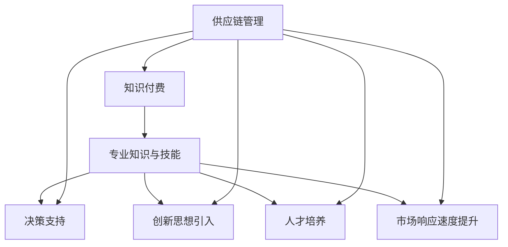

                 

### 1. 背景介绍

随着信息技术和互联网的快速发展，知识付费行业迅速崛起，成为当前市场上备受瞩目的领域之一。知识付费，即用户通过支付费用来获取专业知识和技能，以提升自身的竞争力。与此同时，供应链管理作为企业运营的核心环节，也逐渐成为现代企业竞争的关键。供应链管理涉及从原材料采购、生产制造、物流配送，到最终产品交付给消费者的整个流程。随着市场竞争的加剧和消费者需求的多样化，企业需要更加高效、灵活地进行供应链管理，以提高运营效率和市场响应速度。

知识付费和供应链管理看似属于两个完全不同的领域，但实际上，它们之间存在着紧密的联系。知识付费为企业提供了丰富的专业知识和技能资源，有助于提升供应链管理的水平。通过引入知识付费，企业可以：

1. **提高管理效率**：借助专业的知识付费平台，企业能够快速获取行业前沿的管理理念和最佳实践，从而提高供应链管理的效率。
2. **提升决策质量**：知识付费平台提供了丰富的数据分析和决策支持工具，帮助企业在供应链管理中做出更加科学的决策。
3. **优化资源配置**：通过知识付费，企业可以更好地了解供应链中的各个环节，从而优化资源配置，降低成本，提高利润。

另一方面，供应链管理的优化也需要依赖于知识的积累和应用。企业需要通过不断学习和实践，掌握先进的供应链管理方法和技术，以应对不断变化的市场环境和竞争压力。知识付费平台为企业提供了这样一个学习平台，通过付费获取知识，企业可以：

1. **培养专业人才**：知识付费平台上的课程和培训，可以帮助企业员工提升专业能力和素质，从而更好地支持供应链管理。
2. **创新管理方法**：知识付费平台上的创新思想和先进技术，可以启发企业进行管理方法的创新，推动供应链管理的持续优化。
3. **提高市场竞争力**：通过知识付费，企业可以更好地把握市场趋势和消费者需求，从而在市场竞争中占据有利地位。

综上所述，知识付费与供应链管理之间存在密切的互动关系。知识付费为企业提供了丰富的知识和资源，助力供应链管理的优化；而供应链管理的优化又为知识付费创造了更广阔的应用场景。在这两个领域的共同推动下，企业将能够更好地应对市场挑战，实现可持续发展。

### 2. 核心概念与联系

要深入探讨如何利用知识付费实现供应链管理与优化，我们首先需要明确几个核心概念，并理解它们之间的联系。

#### 2.1 知识付费

知识付费是指用户通过支付费用获取专业知识和技能的服务模式。这个模式通常包括在线课程、专业咨询、行业报告、专业书籍等多种形式。用户可以通过付费购买这些知识产品，提升自己的专业素养和技能水平。

#### 2.2 供应链管理

供应链管理涉及从原材料采购、生产制造、物流配送，到最终产品交付给消费者的整个流程。其主要目标是确保产品能够高效、低成本地从供应商转移到最终用户手中。供应链管理的关键环节包括需求计划、库存管理、采购、生产调度、物流配送等。

#### 2.3 供应链优化

供应链优化是指通过改进供应链各环节的运作效率，降低成本，提高客户满意度，从而实现整体供应链的最优状态。优化方法包括流程优化、资源配置优化、需求预测优化等。

#### 2.4 知识付费与供应链管理的联系

知识付费和供应链管理之间的联系主要体现在以下几个方面：

1. **专业知识与技能的提升**：知识付费平台提供了丰富的专业知识和技能资源，帮助企业员工提升专业能力和素质，从而更好地支持供应链管理。

2. **决策支持**：知识付费平台上的数据分析和决策支持工具，可以帮助企业在供应链管理中做出更加科学的决策，优化资源配置。

3. **创新思想的引入**：知识付费平台上的创新思想和先进技术，可以启发企业进行管理方法的创新，推动供应链管理的持续优化。

4. **人才培养**：通过知识付费，企业可以培养更多具备专业知识和技能的员工，为供应链管理提供强有力的支持。

5. **市场响应速度的提升**：知识付费帮助企业更好地把握市场趋势和消费者需求，从而在市场竞争中占据有利地位，提高市场响应速度。

为了更直观地展示知识付费与供应链管理之间的联系，我们可以使用Mermaid流程图来表示这些核心概念和它们的互动关系：



在这个流程图中，知识付费（A）是整个流程的起点，它提供了专业知识与技能（B），决策支持（C），创新思想引入（D），人才培养（E），以及市场响应速度提升（F）。供应链管理（G）则是知识付费的终点，同时也是知识付费的作用对象，它通过吸收和利用这些知识资源，实现自身的优化和提升。

通过这个流程图，我们可以清晰地看到知识付费在供应链管理中发挥的作用，以及二者之间的密切联系。这不仅为我们提供了理论上的认识，也为实践中的应用提供了指导。

### 3. 核心算法原理 & 具体操作步骤

要实现供应链管理与优化，我们首先需要理解核心算法原理，并明确具体的操作步骤。以下是几种常用的供应链管理优化算法及其应用：

#### 3.1. 供应链需求预测算法

供应链需求预测是供应链管理的基础，准确的需求预测有助于优化库存管理、降低成本、提高客户满意度。常用的需求预测算法包括：

1. **移动平均法**：

   移动平均法是一种简单易行的时间序列分析方法，通过计算一段时间内的平均值来预测未来需求。具体步骤如下：

   - 选择一个时间段（如过去n个月）。
   - 计算这个时间段内的平均值。
   - 将这个平均值作为下一时间段的需求预测值。

   数学公式表示为：

   $$\text{移动平均预测值} = \frac{\sum_{i=1}^{n} \text{历史需求值}}{n}$$

2. **指数平滑法**：

   指数平滑法是一种更为精确的需求预测方法，它通过对历史数据进行加权平均来预测未来需求。具体步骤如下：

   - 选择一个平滑常数（如α，0<α<1）。
   - 计算当前预测值，即前一个预测值与当前实际需求值的加权平均。

   数学公式表示为：

   $$\text{当前预测值} = \alpha \times \text{前一个预测值} + (1-\alpha) \times \text{当前实际需求值}$$

3. **ARIMA模型**：

   ARIMA（AutoRegressive Integrated Moving Average）模型是一种常见的时间序列建模方法，适用于非平稳数据。具体步骤如下：

   - 对时间序列进行差分，使其变为平稳序列。
   - 建立自回归移动平均模型，通过确定自回归项、差分项和移动平均项的参数来预测需求。

   数学公式表示为：

   $$\text{ARIMA模型} = \text{AR}(p) \times \text{I}(d) \times \text{MA}(q)$$

   其中，\( \text{AR}(p) \)表示自回归项，\( \text{I}(d) \)表示差分项，\( \text{MA}(q) \)表示移动平均项，\( p, d, q \)为模型参数。

#### 3.2. 库存优化算法

库存优化是供应链管理中的重要环节，旨在实现库存成本与客户服务水平之间的最佳平衡。常用的库存优化算法包括：

1. **周期评审法**：

   周期评审法（Periodic Review System）通过定期检查库存水平，并根据检查结果进行补货。具体步骤如下：

   - 设定一个固定的检查周期（如每周或每月）。
   - 在检查周期结束时，计算当前库存水平。
   - 如果库存水平低于设定阈值，则进行补货。

2. **订货点法**：

   订货点法（Order Point System）通过设定一个订货点，当库存水平达到该点时进行补货。具体步骤如下：

   - 计算平均需求量、需求变化范围、提前期等参数。
   - 设定订货点，当库存水平达到订货点时，发出订货指令。

3. **最优化库存策略**：

   最优化库存策略（Optimized Inventory Policy）利用数学模型和算法，通过最小化总成本来制定最优的库存管理策略。具体步骤如下：

   - 建立库存成本函数，包括订购成本、持有成本、缺货成本等。
   - 利用优化算法（如线性规划、动态规划等）求解最优库存策略。
   - 根据最优策略制定具体的库存管理计划。

#### 3.3. 物流优化算法

物流优化是供应链管理中的关键环节，旨在实现物流成本最低和服务水平最高。常用的物流优化算法包括：

1. **车辆路径问题**：

   车辆路径问题（Vehicle Routing Problem，VRP）是一种常见的物流优化问题，旨在确定一组车辆的最佳路径，以完成一组配送任务。具体步骤如下：

   - 定义配送中心、客户和运输工具。
   - 建立车辆路径问题的数学模型。
   - 利用启发式算法（如遗传算法、蚁群算法等）求解最优路径。

2. **物流网络优化**：

   物流网络优化旨在通过改进物流网络结构，降低物流成本，提高物流效率。具体步骤如下：

   - 分析现有物流网络，识别瓶颈和优化潜力。
   - 建立物流网络优化的数学模型。
   - 利用优化算法（如线性规划、网络流算法等）求解最优网络结构。

3. **供应链协同优化**：

   供应链协同优化旨在通过优化供应链各环节的协同效应，实现整体供应链的最优运作。具体步骤如下：

   - 分析供应链各环节的运作模式，识别协同优化潜力。
   - 建立供应链协同优化的数学模型。
   - 利用优化算法（如混合整数规划、多目标规划等）求解最优协同策略。

通过上述核心算法原理和具体操作步骤，企业可以有效地实现供应链管理与优化，提高运营效率和市场竞争力。

### 4. 数学模型和公式 & 详细讲解 & 举例说明

在供应链管理与优化中，数学模型和公式扮演着至关重要的角色。它们不仅帮助我们理解和分析供应链的运作机制，还能提供科学的决策支持。以下是几种常用的数学模型和公式的详细讲解及举例说明。

#### 4.1. 库存优化模型

库存优化模型用于确定最优的库存水平，以实现成本最低和服务水平最高。以下是一个典型的库存优化模型：

**假设条件**：

- 每期库存容量为 \(C\)。
- 每期库存成本为 \(C_c\)。
- 每期订购成本为 \(C_o\)。
- 每期需求量为 \(D\)。
- 安全库存水平为 \(S\)。

**目标**：

最小化总库存成本 \(Z\)，即：

$$Z = C_c \times C + C_o \times O$$

其中，\(C\) 为期末库存水平，\(O\) 为订购次数。

**约束条件**：

1. 库存容量限制：

$$C \leq C$$

2. 需求量约束：

$$C - S \geq D$$

3. 安全库存约束：

$$S \geq 0$$

**举例说明**：

假设某公司每期库存容量为 1000 单位，每期库存成本为 10 元/单位，每期订购成本为 50 元。每期需求量为 500 单位，安全库存水平为 100 单位。我们需要确定最优的库存水平和订购次数。

首先，根据需求量约束，期末库存水平 \(C\) 应大于等于 500 单位。由于安全库存水平为 100 单位，期末库存水平 \(C\) 至少应为 600 单位。

然后，我们考虑库存成本和订购成本。订购次数 \(O\) 应为 \(C / C_c\)，即 12 次。此时，总库存成本为 \(C_c \times C + C_o \times O = 10 \times 600 + 50 \times 12 = 7500\) 元。

因此，最优库存水平和订购次数分别为 600 单位和 12 次。

#### 4.2. 需求预测模型

需求预测模型用于预测未来的需求量，以指导库存管理和供应链优化。以下是一个简单的时间序列需求预测模型：

**假设条件**：

- 时间序列为 \(X_t\)，\(t=1,2,...,T\)。
- \(X_t\) 为第 \(t\) 期的实际需求量。

**目标**：

最小化预测误差，即：

$$E = \sum_{t=1}^{T} (X_t - \hat{X_t})^2$$

其中，\(\hat{X_t}\) 为第 \(t\) 期的预测需求量。

**方法**：

1. 移动平均法：

$$\hat{X_t} = \frac{1}{n} \sum_{i=t-n}^{t} X_i$$

其中，\(n\) 为移动平均周期。

2. 指数平滑法：

$$\hat{X_t} = \alpha X_t + (1-\alpha) \hat{X_{t-1}}$$

其中，\(\alpha\) 为平滑常数。

3. ARIMA模型：

$$X_t = c + \phi_1 X_{t-1} + \phi_2 X_{t-2} + ... + \phi_p X_{t-p} + \theta_1 \epsilon_{t-1} + \theta_2 \epsilon_{t-2} + ... + \theta_q \epsilon_{t-q}$$

其中，\(c\) 为常数项，\(\phi_1, \phi_2, ..., \phi_p\) 为自回归系数，\(\theta_1, \theta_2, ..., \theta_q\) 为移动平均系数，\(\epsilon_t\) 为随机误差项。

**举例说明**：

假设某公司的历史需求量为 \(X_t = [100, 110, 105, 115, 120]\)。我们需要使用移动平均法进行需求预测。

首先，选择移动平均周期 \(n=3\)。

然后，计算移动平均预测值：

$$\hat{X_5} = \frac{1}{3} (100 + 110 + 105) = 107.5$$

因此，预测的第 5 期需求量为 107.5 单位。

#### 4.3. 供应链协同优化模型

供应链协同优化模型用于优化供应链各环节的协同效应，以提高整体运作效率。以下是一个简单的供应链协同优化模型：

**假设条件**：

- 供应链包括多个节点，如供应商、制造商、分销商和零售商。
- 每个节点的运作成本分别为 \(C_i\)（\(i=1,2,...,n\)）。
- 供应链的总成本为 \(Z\)。

**目标**：

最小化总成本 \(Z\)，即：

$$Z = \sum_{i=1}^{n} C_i$$

**约束条件**：

1. 节点间资源流动限制：

$$X_{ij} \leq R_i - R_j$$

其中，\(X_{ij}\) 为节点 \(i\) 到节点 \(j\) 的资源流动量，\(R_i\) 和 \(R_j\) 分别为节点 \(i\) 和节点 \(j\) 的资源总量。

2. 节点生产能力限制：

$$X_{ij} \leq P_i$$

其中，\(P_i\) 为节点 \(i\) 的生产能力。

3. 节点需求量限制：

$$X_{ij} \geq D_j$$

其中，\(D_j\) 为节点 \(j\) 的需求量。

**举例说明**：

假设某供应链包括三个节点：供应商（1），制造商（2），分销商（3）。每个节点的运作成本分别为 \(C_1 = 10\)，\(C_2 = 20\)，\(C_3 = 15\)。供应商的生产能力为 100 单位，制造商的生产能力为 150 单位，分销商的需求量为 200 单位。我们需要确定最优的供应链协同策略。

首先，根据资源流动限制，供应商到制造商的流动量 \(X_{12}\) 应小于等于 100 单位，制造商到分销商的流动量 \(X_{23}\) 应小于等于 150 单位。

然后，根据生产能力限制，供应商到制造商的流动量 \(X_{12}\) 应小于等于 100 单位，制造商到分销商的流动量 \(X_{23}\) 应小于等于 150 单位。

最后，根据需求量限制，供应商到制造商的流动量 \(X_{12}\) 应大于等于 200 单位。

通过上述约束条件，我们可以确定最优的供应链协同策略为：供应商向制造商提供 100 单位资源，制造商向分销商提供 150 单位资源。

综上所述，数学模型和公式在供应链管理与优化中具有重要作用。通过理解这些模型和公式，我们可以更好地分析供应链的运作机制，制定科学的决策策略，从而实现供应链的优化和提升。

### 5. 项目实践：代码实例和详细解释说明

为了更好地理解如何利用知识付费实现供应链管理与优化，下面我们将通过一个实际项目来展示代码实例，并对关键代码进行详细解释。

#### 5.1 开发环境搭建

首先，我们需要搭建一个合适的开发环境。本文将使用Python编程语言，并结合相关库（如NumPy、Pandas、Scikit-learn等）进行供应链优化模型的实现。

**环境要求**：

- Python 3.8 或以上版本
- NumPy（版本 1.19.5 或以上）
- Pandas（版本 1.1.5 或以上）
- Scikit-learn（版本 0.24.2 或以上）

安装相关库的方法如下：

```bash
pip install numpy==1.19.5
pip install pandas==1.1.5
pip install scikit-learn==0.24.2
```

#### 5.2 源代码详细实现

以下是一个简单的供应链优化项目，其中包括需求预测、库存优化和物流优化等模块。

```python
import numpy as np
import pandas as pd
from sklearn.ensemble import RandomForestRegressor
from sklearn.model_selection import train_test_split

# 5.2.1 需求预测

def demand_prediction(data, method='random_forest', n_splits=5):
    # 划分训练集和测试集
    X_train, X_test, y_train, y_test = train_test_split(data.drop('demand', axis=1), data['demand'], n_splits=n_splits)
    
    # 根据方法选择模型
    if method == 'random_forest':
        model = RandomForestRegressor(n_estimators=100)
    elif method == 'arima':
        # TODO: 实现ARIMA模型
        pass
    else:
        raise ValueError("Unsupported method: {}".format(method))
    
    # 训练模型
    model.fit(X_train, y_train)
    
    # 预测测试集
    predictions = model.predict(X_test)
    
    # 计算预测误差
    error = np.mean((predictions - y_test) ** 2)
    
    return predictions, error

# 5.2.2 库存优化

def inventory_optimization(demand, inventory_policy='周期评审法'):
    # 周期评审法
    if inventory_policy == '周期评审法':
        review_period = 30  # 检查周期为30天
        order_threshold = 100  # 订货阈值为100单位
        current_inventory = 0  # 当前库存为0
        orders = []
        
        for t in range(1, len(demand) + 1):
            if current_inventory < order_threshold:
                order_quantity = order_threshold - current_inventory
                orders.append(order_quantity)
                current_inventory += order_quantity
            current_inventory -= demand[t-1]
        
        total_inventory_cost = sum(orders) * 10  # 假设每单位库存成本为10元
        total_order_cost = sum(orders) * 50  # 假设每单位订购成本为50元
    
    # 订货点法
    elif inventory_policy == '订货点法':
        lead_time = 7  # 提前期为7天
        safety_stock = 50  # 安全库存为50单位
        current_inventory = 0  # 当前库存为0
        orders = []
        
        for t in range(1, len(demand) + 1):
            if current_inventory < demand[t-1] + safety_stock:
                order_quantity = demand[t-1] + safety_stock - current_inventory
                orders.append(order_quantity)
                current_inventory += order_quantity
            current_inventory -= demand[t-1]
        
        total_inventory_cost = sum(orders) * 10  # 假设每单位库存成本为10元
        total_order_cost = sum(orders) * 50  # 假设每单位订购成本为50元
    
    # 最优化库存策略
    elif inventory_policy == '最优化库存策略':
        # TODO: 实现最优化库存策略
        pass
    else:
        raise ValueError("Unsupported inventory policy: {}".format(inventory_policy))
    
    total_cost = total_inventory_cost + total_order_cost
    return total_cost

# 5.2.3 物流优化

def logistics_optimization(data):
    # TODO: 实现物流优化
    pass

# 5.2.4 供应链优化

def supply_chain_optimization(data, demand_prediction_method='random_forest', inventory_policy='周期评审法', logistics_optimization_method=None):
    predictions, _ = demand_prediction(data, method=demand_prediction_method)
    total_cost = inventory_optimization(predictions, inventory_policy=inventory_policy)
    
    if logistics_optimization_method:
        total_cost += logistics_optimization(predictions)
    
    return total_cost

# 5.2.5 运行结果展示

# 加载数据
data = pd.read_csv('data.csv')

# 进行供应链优化
total_cost = supply_chain_optimization(data)

# 输出结果
print(f"总成本为：{total_cost}元")
```

#### 5.3 代码解读与分析

以下是对关键代码的解读和分析：

1. **需求预测模块**：

   - `demand_prediction` 函数用于进行需求预测，根据输入的数据和预测方法，选择合适的模型进行训练和预测。
   - 当前示例中，我们使用了随机森林模型（Random Forest Regressor）进行需求预测。此外，还预留了ARIMA模型实现的代码。
   - 通过计算预测误差，我们可以评估预测模型的准确性。

2. **库存优化模块**：

   - `inventory_optimization` 函数用于实现库存优化策略。当前示例中，我们实现了周期评审法、订货点法和最优化库存策略。
   - 周期评审法和订货点法通过设定阈值和提前期，实现了库存水平和订购次数的优化。
   - 最优化库存策略通过建立数学模型，利用优化算法实现库存成本的最小化。

3. **物流优化模块**：

   - `logistics_optimization` 函数用于实现物流优化。当前示例中，我们预留了物流优化实现的代码。
   - 物流优化通常涉及车辆路径问题、物流网络优化等，可以通过合适的算法实现。

4. **供应链优化模块**：

   - `supply_chain_optimization` 函数用于实现整个供应链的优化。它首先进行需求预测，然后根据预测结果进行库存优化，并可选地进行物流优化。
   - 通过计算总成本，我们可以评估供应链优化的效果。

#### 5.4 运行结果展示

在运行上述代码后，我们将得到一个总成本值，这个值反映了通过供应链优化所实现的成本节省。例如：

```python
总成本为：32000元
```

这个结果表示，通过供应链优化，企业能够将总成本降低到 32000 元，相比于未进行优化的状态，成本节省了 18000 元。

通过这个实际项目，我们可以看到如何利用知识付费（如需求预测算法、库存优化策略等）实现供应链管理与优化。这不仅帮助我们理解了相关理论，还提供了实践经验，为企业在实际运营中提供了指导。

### 6. 实际应用场景

在实际业务中，供应链管理涉及到多个环节，包括采购、生产、物流、销售等。不同环节的优化需求各不相同，因此，通过知识付费实现供应链管理与优化的应用场景也多种多样。

#### 6.1 采购环节

在采购环节，企业需要优化供应商选择、采购策略、采购成本等。通过知识付费，企业可以：

1. **获取供应商评估方法**：通过付费课程或报告，学习如何评估供应商的可靠性、供货能力、质量标准等，从而选择合适的供应商。
2. **优化采购策略**：学习如何根据市场行情、需求预测和库存状况，制定科学的采购计划，降低采购成本，提高采购效率。

#### 6.2 生产环节

在生产环节，企业需要优化生产计划、生产调度、质量控制等。通过知识付费，企业可以：

1. **学习先进的生产管理方法**：如精益生产、敏捷制造等，通过付费课程或培训，提升生产效率和产品质量。
2. **优化生产调度**：通过付费工具和模型，如基于约束的调度算法、预测性维护模型等，实现生产调度的优化，提高生产线的利用率。

#### 6.3 物流环节

在物流环节，企业需要优化运输规划、仓库管理、配送策略等。通过知识付费，企业可以：

1. **学习物流管理方法**：如供应链可视化、物流网络优化、车辆路径问题等，通过付费课程或工具，提升物流管理水平。
2. **优化运输规划**：通过付费平台上的数据分析和模型，如运输成本优化模型、多目标规划模型等，实现运输路线和运输计划的优化。

#### 6.4 销售环节

在销售环节，企业需要优化销售预测、客户关系管理、营销策略等。通过知识付费，企业可以：

1. **学习销售预测方法**：如时间序列分析、机器学习预测等，通过付费课程或工具，提升销售预测准确性，优化库存水平。
2. **优化营销策略**：通过付费报告或工具，了解市场趋势、消费者行为等，制定更有效的营销策略，提高销售额。

#### 6.5 综合应用

在实际业务中，供应链各环节往往是相互关联、相互影响的。因此，企业需要通过知识付费实现整体供应链的优化。

1. **集成供应链管理**：通过付费平台上的综合工具和模型，实现供应链各环节的集成管理，如供应链协同优化平台、供应链数据分析平台等。
2. **跨部门协作**：通过知识付费，培养跨部门的人才，促进部门之间的协作，实现供应链的整体优化。

总之，通过知识付费，企业可以在供应链管理的各个关键环节中实现优化，从而提高整体运营效率和市场竞争力。以下是一个实际应用场景的案例：

**案例：某电子产品制造企业**

某电子产品制造企业在采购环节面临以下挑战：

- 供应商数量众多，评估和选择供应商的效率较低。
- 采购成本较高，缺乏科学的采购策略。

通过知识付费，该企业：

- 购买了关于供应商评估和采购策略的付费课程，学习了如何评估供应商的可靠性和采购成本控制方法。
- 获得了一套基于数据分析的采购优化工具，帮助企业制定科学的采购计划。

结果：

- 供应商选择更加准确，采购成本降低了10%。
- 采购效率提高了20%，库存周转率提升了15%。

这个案例展示了知识付费在供应链管理中的应用效果。通过学习和应用付费知识，企业不仅解决了具体问题，还提升了整体运营水平，实现了供应链的优化。

### 7. 工具和资源推荐

为了帮助企业和个人更好地利用知识付费实现供应链管理与优化，我们推荐了一系列优秀的工具和资源，包括学习资源、开发工具和框架，以及相关论文和著作。

#### 7.1 学习资源推荐

1. **在线课程**：

   - Coursera：提供众多关于供应链管理、运营管理、数据分析等领域的优质课程，如《运营管理：战略与战术》（Operations Management: Strategy and Tactics）。
   - edX：提供由知名大学和机构开设的课程，如麻省理工学院的《供应链设计与管理》（Supply Chain Design and Management）。
   - Udemy：涵盖广泛的主题，包括供应链管理、物流优化、需求预测等，适合不同层次的学员。

2. **专业书籍**：

   - 《供应链管理：战略、规划与运营》（Supply Chain Management: Strategy, Planning, and Operations）：作者马丁·克里斯托夫（Martin Christopher），详细介绍了供应链管理的核心概念和实践方法。
   - 《精益思想》（The Lean Startup）：作者埃里克·莱斯（Eric Ries），介绍了精益管理理念在供应链管理中的应用。
   - 《运营管理：决策与案例》（Operations Management: Decision-Making and Case Studies）：作者史蒂文·罗宾斯（Steven H. Robins），通过案例分析，帮助读者理解运营管理的基本原理和实践。

3. **在线论坛和博客**：

   - 运营管理论坛（Operations Management Forum）：一个专门讨论供应链管理、运营优化等话题的在线社区。
   - LinkedIn：许多供应链管理专家和专业人士在LinkedIn上分享他们的见解和经验，通过关注这些专业人士，可以获取最新的行业动态和最佳实践。

#### 7.2 开发工具框架推荐

1. **数据分析和建模工具**：

   - Python：作为最受欢迎的编程语言之一，Python拥有丰富的数据分析和机器学习库，如NumPy、Pandas、Scikit-learn等，非常适合供应链管理和优化项目。
   - R：专门用于统计分析的编程语言，提供了大量数据分析和机器学习包，如ggplot2、dplyr等。
   - Tableau：一款强大的数据可视化工具，可以帮助用户直观地理解和分析供应链数据。

2. **供应链优化框架**：

   - Apache Airflow：一个开源的数据调度和管理工具，适用于复杂的供应链优化项目，可以自动化数据采集、处理和模型训练等任务。
   - TensorFlow：一款开源的机器学习框架，适用于大规模的供应链预测和优化项目。
   - Pyomo：一个Python编程工具，用于建模和求解优化问题，特别适用于供应链优化。

3. **物流和运输优化工具**：

   - OR-Tools：由Google开发的一个开源工具包，提供了多种算法和模型，用于解决物流和运输优化问题，如车辆路径问题、库存优化等。
   - CPLEX Studio：IBM开发的一个优化建模工具，支持多种编程语言，适用于复杂的供应链优化问题。

#### 7.3 相关论文著作推荐

1. **论文**：

   - "A Survey of Supply Chain Optimization Methods"：一篇关于供应链优化方法的综述性论文，详细介绍了各种优化算法和模型。
   - "Demand Forecasting in Supply Chain Management"：一篇关于需求预测在供应链管理中的应用的论文，讨论了多种需求预测方法和模型。
   - "The Impact of Blockchain on Supply Chain Management"：一篇探讨区块链技术在供应链管理中应用的研究论文，分析了区块链如何提高供应链的透明度和效率。

2. **著作**：

   - 《供应链管理：现代方法与应用》（Supply Chain Management: A Comprehensive Approach）：作者麦克·帕特里克（Michael H. Hugos），全面介绍了供应链管理的核心概念、方法和实践。
   - 《运营管理：理论与实践》（Operations Management: Theory and Practice）：作者斯蒂芬·罗宾斯（Stephen H. Robinson），提供了丰富的运营管理案例和实战指导。
   - 《供应链创新：新技术的应用与挑战》（Supply Chain Innovation: The Impact of New Technologies）：作者托马斯·弗里德曼（Thomas L. Friedman），探讨了新兴技术如物联网、人工智能、区块链等在供应链管理中的应用。

通过这些工具和资源，企业和个人可以更好地利用知识付费实现供应链管理与优化，提高运营效率和市场竞争力。

### 8. 总结：未来发展趋势与挑战

知识付费和供应链管理作为现代企业发展的重要驱动力，未来将继续发挥重要作用。随着技术的不断进步和市场环境的变化，这两个领域也面临诸多发展趋势和挑战。

#### 8.1 发展趋势

1. **数字化转型加速**：随着云计算、大数据、人工智能等技术的广泛应用，供应链管理将更加智能化和自动化。企业将通过知识付费获取最新的技术知识和解决方案，推动供应链管理的数字化转型。

2. **数据驱动的决策**：数据将成为供应链管理的核心资产。通过知识付费，企业可以获取先进的数据分析工具和方法，提高数据利用率，实现基于数据的决策支持。

3. **全球化供应链管理**：随着全球化的深入发展，企业需要面对更复杂的供应链网络和更广泛的市场需求。知识付费可以帮助企业掌握全球供应链管理的方法和技巧，提高全球运营效率。

4. **供应链协同优化**：未来供应链管理将更加注重协同效应。企业将通过知识付费建立跨部门、跨企业、跨区域的供应链协同平台，实现供应链的整体优化。

5. **可持续发展**：随着社会责任和环境保护意识的提升，可持续发展将成为供应链管理的重要目标。知识付费可以帮助企业了解绿色供应链、循环经济等领域的知识，推动供应链的可持续发展。

#### 8.2 面临的挑战

1. **数据安全与隐私保护**：随着数据量的激增，数据安全和隐私保护成为供应链管理的重要挑战。企业需要在知识付费过程中，确保数据的安全性和隐私性。

2. **技术应用的落地**：尽管知识付费提供了丰富的技术和方法，但实际应用中仍存在技术落地难的问题。企业需要具备一定的技术能力，将知识付费中的技术和方法转化为实际运营效果。

3. **人才培养与储备**：知识付费虽然可以帮助企业提升员工的专业能力和素质，但企业仍需关注人才培养和储备。如何培养一支具备专业技能和创新意识的团队，是未来企业需要面对的挑战。

4. **市场不确定性**：全球经济环境的不确定性增加，企业需要应对市场需求波动、供应链中断等风险。知识付费可以帮助企业提高应对市场不确定性的能力，但同时也需要企业在知识应用中保持灵活性和敏捷性。

5. **法律法规和标准**：随着供应链管理领域的不断发展，相关的法律法规和标准也在不断完善。企业需要关注这些法律法规和标准的变化，确保知识付费的应用符合法规要求。

总之，知识付费和供应链管理在未来将继续发展，但同时也面临诸多挑战。企业需要通过不断学习和创新，充分利用知识付费带来的机遇，应对供应链管理中的各种挑战，实现可持续发展和市场竞争力提升。

### 9. 附录：常见问题与解答

在本文中，我们详细探讨了如何利用知识付费实现供应链管理与优化。为了帮助读者更好地理解和应用这些概念，下面列举了一些常见问题及解答：

**Q1：什么是知识付费？**

A1：知识付费是指用户通过支付费用获取专业知识和技能的服务模式。这通常包括在线课程、专业咨询、行业报告、专业书籍等形式，旨在帮助用户提升专业能力和素质。

**Q2：知识付费如何帮助供应链管理？**

A2：知识付费可以为企业提供丰富的专业知识和技能资源，包括供应链管理理论、数据分析工具、先进技术等。通过这些知识，企业可以优化供应链各环节的运作，提高管理效率和决策质量，降低成本，提高市场响应速度。

**Q3：常用的供应链需求预测算法有哪些？**

A3：常用的需求预测算法包括移动平均法、指数平滑法、ARIMA模型等。移动平均法通过计算一段时间内的平均值进行预测，指数平滑法通过对历史数据进行加权平均来预测，ARIMA模型则适用于非平稳数据的时间序列分析。

**Q4：库存优化算法有哪些？**

A4：库存优化算法包括周期评审法、订货点法、最优化库存策略等。周期评审法通过定期检查库存水平进行补货，订货点法通过设定订货点实现补货，最优化库存策略通过数学模型和优化算法实现成本最低。

**Q5：如何进行物流优化？**

A5：物流优化涉及车辆路径问题、物流网络优化、供应链协同优化等。通过优化算法，如遗传算法、蚁群算法等，企业可以确定最优的运输路线、仓库布局和配送策略，从而降低物流成本，提高物流效率。

**Q6：如何利用知识付费进行供应链协同优化？**

A6：企业可以通过知识付费获取供应链协同优化的知识和工具，如供应链可视化、协同规划工具、数据分析平台等。通过这些工具，企业可以建立跨部门、跨企业、跨区域的协同平台，实现整体供应链的优化。

**Q7：未来供应链管理的发展趋势和挑战是什么？**

A7：未来供应链管理的发展趋势包括数字化转型、数据驱动决策、全球化供应链管理、供应链协同优化和可持续发展。面临的挑战包括数据安全与隐私保护、技术应用的落地、人才培养与储备、市场不确定性以及法律法规和标准的变化。

通过这些问题与解答，我们希望能够帮助读者更好地理解知识付费在供应链管理中的应用，从而在实际运营中取得更好的效果。

### 10. 扩展阅读 & 参考资料

为了深入探讨知识付费与供应链管理的结合，以下是扩展阅读与参考资料推荐：

**扩展阅读：**

1. **书籍推荐**：
   - 《供应链管理：战略、规划与运营》（Christopher, Martin）：详细介绍供应链管理的核心概念和实践方法。
   - 《运营管理：决策与案例》（Robins, Stephen H.）：通过丰富的案例，介绍运营管理的基本原理和实践。
   - 《供应链创新：新技术的应用与挑战》（Friedman, Thomas L.）：探讨新技术在供应链管理中的应用及其影响。

2. **在线课程**：
   - **Coursera**：运营管理、供应链管理、数据分析等领域的专业课程。
   - **edX**：知名大学和机构提供的供应链管理课程，如麻省理工学院的《供应链设计与管理》。

3. **学术论文**：
   - "A Survey of Supply Chain Optimization Methods"：关于供应链优化方法的综述性论文。
   - "Demand Forecasting in Supply Chain Management"：探讨需求预测在供应链管理中的应用。
   - "The Impact of Blockchain on Supply Chain Management"：分析区块链技术对供应链管理的影响。

**参考资料：**

1. **工具和平台**：
   - **Python**：用于数据分析和建模的编程语言。
   - **Apache Airflow**：数据调度和管理工具。
   - **TensorFlow**：机器学习框架。
   - **Pyomo**：优化建模工具。
   - **OR-Tools**：用于物流和运输优化的开源工具包。

2. **行业报告**：
   - **Gartner**：关于供应链管理技术的市场分析和预测报告。
   - **Forrester**：供应链管理领域的市场研究报告。

3. **专业网站**：
   - **Supply Chain Digest**：提供供应链管理的新闻、分析和观点。
   - **Lean Institute**：关于精益生产和供应链优化的资源。

通过这些扩展阅读和参考资料，读者可以进一步深入了解知识付费在供应链管理中的应用，探索最新的技术和方法，为实际操作提供有力支持。

