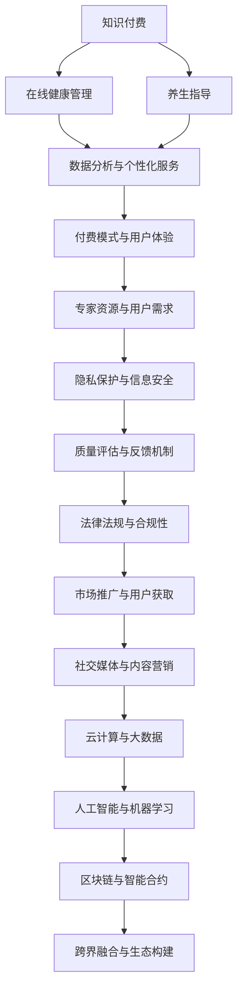

                 

### 背景介绍

知识付费作为一种新兴的商业模式，近年来在在线教育、技能培训等领域取得了显著的成功。人们越来越意识到，专业知识和技能的重要性，尤其是在健康管理和养生指导方面。随着人们对健康生活方式的重视，在线健康管理和养生指导的需求也在不断增长。

健康管理和养生指导是一个涵盖广泛、涉及多个领域的复杂系统。它不仅包括对身体健康状况的监测和管理，还涉及到心理健康、生活方式、饮食习惯等多个方面。传统的健康管理主要依赖于医生和医疗机构，而随着互联网和移动技术的普及，在线健康管理和养生指导成为了一种新兴的、便捷的方式，为广大用户提供了更多的选择和便利。

知识付费在线健康管理和养生指导，就是通过付费课程、专家咨询、个性化建议等方式，为用户提供专业的健康管理和养生服务。这种方式不仅能够帮助用户获取专业的健康知识，还能够通过实时互动和个性化定制，提高用户的健康管理效果。

在线健康管理和养生指导的优势在于：

1. **便捷性**：用户可以在任何时间、任何地点通过互联网获取健康知识和指导。
2. **个性化**：通过数据分析，可以为用户提供量身定制的健康管理和养生建议。
3. **实时互动**：用户可以与专家进行实时交流，解决健康问题。
4. **成本低**：相较于传统的医疗方式，在线健康管理和养生指导的成本更低。

然而，知识付费在线健康管理和养生指导也面临着一些挑战，如专业性的保障、用户隐私的保护、服务质量的一致性等。如何利用知识付费实现在线健康管理和养生指导，是一个值得深入探讨的课题。

本文将围绕如何利用知识付费实现在线健康管理和养生指导，从核心概念、算法原理、数学模型、项目实践等多个角度进行详细分析，旨在为相关从业者提供有价值的参考。

### 核心概念与联系

为了深入探讨如何利用知识付费实现在线健康管理和养生指导，我们首先需要明确几个核心概念，并探讨它们之间的联系。

#### 1. 知识付费

知识付费是指用户通过支付一定的费用来获取专业知识或技能的一种商业模式。这种模式的核心在于将知识转化为商品，通过市场机制实现知识价值的最大化。知识付费的形式多种多样，包括在线课程、专业咨询、电子书、付费问答等。

#### 2. 在线健康管理

在线健康管理是指利用互联网技术，为用户提供健康监测、数据分析、健康咨询等服务的一种健康管理方式。它不仅包括对身体健康状况的实时监测，还涉及心理健康、生活方式等多个方面。

#### 3. 养生指导

养生指导是指通过专业的知识和方法，帮助用户建立健康的生活方式，提高生活质量的一种服务。它包括饮食指导、运动指导、心理调适等多个方面。

#### 4. 数据分析与个性化服务

数据分析是现代健康管理的重要组成部分。通过对用户数据的收集和分析，可以了解用户的健康状况，为其提供个性化的健康管理和养生建议。个性化服务则是基于用户数据的分析结果，提供量身定制的服务，提高用户满意度。

#### 5. 付费模式与用户体验

付费模式是知识付费在线健康管理和养生指导的重要环节。不同的付费模式会直接影响用户体验。例如，订阅模式可以提供连续的服务，而一次性付费模式则更适用于短期或特定服务的购买。

#### 6. 专家资源与用户需求

专家资源是知识付费在线健康管理和养生指导的关键。拥有高质量的专家资源，可以提供专业的健康知识和指导，提高服务质量。同时，了解用户需求，能够更好地满足他们的需求，提升用户体验。

#### 7. 隐私保护与信息安全

在知识付费在线健康管理和养生指导过程中，用户隐私的保护和信息安全至关重要。一旦用户数据泄露，不仅会损害用户的利益，还会影响平台的声誉和可持续发展。

#### 8. 质量评估与反馈机制

为了确保知识付费在线健康管理和养生指导的服务质量，建立完善的质量评估和反馈机制是必要的。通过用户反馈和数据分析，可以不断优化服务，提高用户满意度。

#### 9. 法律法规与合规性

知识付费在线健康管理和养生指导需要遵守相关的法律法规，确保其合法合规性。这不仅包括数据保护法、消费者权益保护法等，还涉及医疗健康领域的专业法规。

#### 10. 市场推广与用户获取

市场推广和用户获取是知识付费在线健康管理和养生指导成功的关键。通过有效的市场推广策略，可以吸引更多的用户，扩大市场份额。同时，了解用户获取渠道，可以更好地进行精准营销。

#### 11. 社交媒体与内容营销

社交媒体和内容营销在知识付费在线健康管理和养生指导中发挥着重要作用。通过社交媒体平台，可以传播健康知识，提高品牌知名度。内容营销则可以通过优质的内容吸引和留住用户。

#### 12. 云计算与大数据

云计算和大数据技术在知识付费在线健康管理和养生指导中发挥着关键作用。通过云计算，可以实现海量数据的存储和处理。大数据技术则可以用于用户数据的收集和分析，提供个性化的健康管理和养生建议。

#### 13. 人工智能与机器学习

人工智能和机器学习技术是知识付费在线健康管理和养生指导的重要工具。通过人工智能技术，可以自动化处理大量的健康数据，提高数据分析的准确性和效率。机器学习技术则可以用于健康预测和风险分析，为用户提供更加精准的健康管理建议。

#### 14. 区块链与智能合约

区块链技术具有去中心化、不可篡改的特点，可以用于保障用户隐私和信息安全。智能合约则可以自动化执行服务协议，提高服务效率和用户体验。

#### 15. 跨界融合与生态构建

知识付费在线健康管理和养生指导需要与其他领域进行跨界融合，构建完整的健康生态系统。通过跨界合作，可以实现资源共享、优势互补，提供更加全面的健康管理和养生服务。

#### Mermaid 流程图

下面是一个简化的 Mermaid 流程图，展示了核心概念之间的联系：



通过上述核心概念和联系的梳理，我们可以更清晰地理解知识付费在线健康管理和养生指导的运作机制，为后续内容的深入探讨奠定基础。

### 核心算法原理 & 具体操作步骤

在深入探讨知识付费在线健康管理和养生指导的核心算法原理与具体操作步骤之前，我们首先需要了解一些关键的概念和理论基础。

#### 1. 数据收集与处理

数据收集是健康管理和养生指导的基础。通过穿戴设备、健康应用、在线问卷等多种方式，可以收集用户的健康数据，如心率、血压、睡眠质量、运动数据等。收集的数据需要经过预处理，包括去除噪声、填补缺失值、标准化等步骤，以确保数据的质量和一致性。

#### 2. 数据分析方法

数据分析是健康管理和养生指导的核心。常用的数据分析方法包括统计方法、机器学习方法等。统计方法如均值、方差、相关性分析等，可以帮助理解数据的分布和趋势。机器学习方法如回归分析、聚类分析、分类算法等，可以用于预测和识别用户的健康风险。

#### 3. 个性化健康模型

个性化健康模型是健康管理和养生指导的关键。通过用户数据的分析和处理，可以建立个性化的健康模型，为用户提供量身定制的健康建议。例如，基于用户的运动数据，可以为其推荐合适的运动计划；基于饮食习惯，可以为其提供营养建议。

#### 4. 智能健康监控

智能健康监控是通过实时数据收集和分析，实现对用户健康状况的实时监控。例如，通过智能手环、健康监测设备等，可以实时收集用户的心率、血压等数据，并将数据传输到云端进行分析和处理。

下面我们将详细讨论知识付费在线健康管理和养生指导的核心算法原理，并给出具体的操作步骤。

#### 1. 数据收集

数据收集是健康管理和养生指导的第一步。以下是具体的数据收集步骤：

- **穿戴设备数据收集**：用户佩戴健康监测设备，如智能手环、智能手表等，这些设备可以实时收集心率、血压、睡眠质量、运动数据等。
- **健康应用数据收集**：用户通过健康应用进行日常健康数据记录，如饮食、运动、情绪等。
- **在线问卷数据收集**：定期通过在线问卷收集用户的健康状况、生活习惯等信息。

#### 2. 数据预处理

数据预处理是确保数据质量和一致性的重要步骤。以下是具体的数据预处理步骤：

- **数据清洗**：去除噪声数据，如异常值、重复值等。
- **数据填补**：对缺失值进行填补，可以采用平均值、中位数等填补方法。
- **数据标准化**：将不同单位或范围的数据进行标准化处理，使其具有可比性。

#### 3. 数据分析

数据分析是健康管理和养生指导的核心。以下是具体的数据分析步骤：

- **数据可视化**：通过图表、图形等可视化方式，展示数据的基本特征和趋势。
- **统计方法分析**：采用均值、方差、相关性分析等统计方法，了解数据的分布和关系。
- **机器学习方法分析**：采用回归分析、聚类分析、分类算法等机器学习方法，进行深度分析和预测。

#### 4. 建立个性化健康模型

基于用户数据分析和处理，建立个性化的健康模型。以下是具体的操作步骤：

- **特征提取**：从原始数据中提取重要的特征，如心率、血压、睡眠质量等。
- **模型训练**：使用机器学习算法，如决策树、随机森林、支持向量机等，训练个性化健康模型。
- **模型评估**：通过交叉验证、ROC曲线等方法，评估模型的效果和准确性。

#### 5. 智能健康监控

通过智能健康监控，实现对用户健康状况的实时监控。以下是具体的操作步骤：

- **数据实时收集**：通过智能手环、健康监测设备等，实时收集用户的心率、血压等数据。
- **数据实时分析**：将实时收集的数据传输到云端，进行实时分析和处理。
- **健康预警**：根据分析结果，实时预警用户的健康风险，如心率过快、血压异常等。

#### 6. 个性化健康建议

基于个性化健康模型和实时健康监控，为用户生成个性化的健康建议。以下是具体的操作步骤：

- **健康分析**：对用户的历史数据和实时数据进行分析，了解用户的健康状况。
- **健康建议生成**：根据分析结果，生成个性化的健康建议，如运动计划、饮食建议、心理调适等。
- **健康建议推送**：通过短信、邮件、健康应用等渠道，将健康建议推送给用户。

通过上述核心算法原理和具体操作步骤，我们可以构建一个高效、个性化的在线健康管理和养生指导系统，为用户提供专业的健康服务。

### 数学模型和公式 & 详细讲解 & 举例说明

在知识付费在线健康管理和养生指导中，数学模型和公式起着至关重要的作用。它们不仅帮助我们对用户数据进行有效的分析和预测，还能够为用户提供个性化的健康建议。以下我们将详细介绍一些关键的数学模型和公式，并举例说明其应用。

#### 1. 回归分析

回归分析是一种常见的统计方法，用于分析自变量和因变量之间的关系。在线健康管理和养生指导中，回归分析可以用于预测用户的健康风险和健康状态。

**公式**：

线性回归模型的基本公式为：
$$
y = \beta_0 + \beta_1 \cdot x + \epsilon
$$
其中，\(y\) 是因变量，\(x\) 是自变量，\(\beta_0\) 和 \(\beta_1\) 是模型的参数，\(\epsilon\) 是误差项。

**举例说明**：

假设我们想预测用户的心率，已知自变量为用户的年龄和体重。使用线性回归模型，可以得到预测公式：
$$
\hat{y} = \beta_0 + \beta_1 \cdot \text{年龄} + \beta_2 \cdot \text{体重}
$$
通过训练模型，我们可以得到具体的参数值，例如：
$$
\hat{y} = 60 + 0.5 \cdot \text{年龄} + 0.2 \cdot \text{体重}
$$

#### 2. 聚类分析

聚类分析是一种无监督学习方法，用于将数据集分为多个组，使得同一组内的数据点之间相似度较高，而不同组的数据点之间相似度较低。在健康管理和养生指导中，聚类分析可以用于识别健康风险群体。

**公式**：

K-均值聚类算法的基本步骤如下：
1. 初始化 K 个聚类中心。
2. 将每个数据点分配给距离其最近的聚类中心。
3. 更新聚类中心，取每个聚类内的数据点的平均值。
4. 重复步骤 2 和步骤 3，直到聚类中心不再变化。

**举例说明**：

假设我们有一个包含用户心率、血压、睡眠质量等健康指标的数据集，希望将其分为健康群体和风险群体。使用 K-均值聚类算法，可以得到以下步骤：
1. 初始化两个聚类中心，例如（100，120，8）和（80，110，6）。
2. 将每个数据点分配给距离其最近的聚类中心，例如数据点（95，115，7）被分配到第一个聚类中心。
3. 更新聚类中心，计算每个聚类内的数据点的平均值，例如第一个聚类中心更新为（97，114，7）。
4. 重复步骤 2 和步骤 3，直到聚类中心不再变化。

通过聚类分析，我们可以将用户分为健康群体和风险群体，为风险群体提供更加专业的健康建议。

#### 3. 决策树

决策树是一种常见的分类算法，通过一系列的规则将数据划分为不同的类别。在健康管理和养生指导中，决策树可以用于分类用户的健康状况。

**公式**：

决策树的基本公式为：
$$
\text{if } \text{condition} \text{ then } \text{class} = \text{value} \text{ else } \text{class} = \text{value}
$$
其中，\(\text{condition}\) 是条件，\(\text{class}\) 是类别，\(\text{value}\) 是具体的值。

**举例说明**：

假设我们有一个决策树模型，用于分类用户的心率是否正常。决策树的规则如下：
1. 如果心率 > 100，则类别为“过高”。
2. 如果心率 > 60，则类别为“正常”。
3. 否则，类别为“过低”。

通过这个决策树模型，我们可以对用户的心率进行分类，为用户提供相应的健康建议。

#### 4. 贝叶斯分类器

贝叶斯分类器是一种基于贝叶斯定理的分类算法，通过计算每个类别的概率来预测新数据的类别。在健康管理和养生指导中，贝叶斯分类器可以用于预测用户的健康风险。

**公式**：

贝叶斯分类器的基本公式为：
$$
P(\text{class} | \text{features}) = \frac{P(\text{features} | \text{class}) \cdot P(\text{class})}{P(\text{features})}
$$
其中，\(P(\text{class} | \text{features})\) 是在给定特征下类别的概率，\(P(\text{features} | \text{class})\) 是在给定类别下特征的概率，\(P(\text{class})\) 是类别的概率，\(P(\text{features})\) 是特征的概率。

**举例说明**：

假设我们有一个贝叶斯分类器模型，用于预测用户的心率是否正常。已知在正常心率下，心率 > 100 的概率为 0.2，在异常心率下，心率 > 100 的概率为 0.8。同时，正常心率的概率为 0.6，异常心率的概率为 0.4。根据贝叶斯定理，可以计算在心率 > 100 的情况下，正常心率的概率为：
$$
P(\text{正常心率} | \text{心率 > 100}) = \frac{0.2 \cdot 0.6}{0.2 \cdot 0.6 + 0.8 \cdot 0.4} = 0.3
$$
因此，可以预测该用户的心率正常。

通过以上数学模型和公式的讲解和举例，我们可以看到它们在知识付费在线健康管理和养生指导中的应用。这些模型和公式不仅帮助我们对用户数据进行有效的分析和预测，还能够为用户提供个性化的健康建议，提高健康管理的效果。

### 项目实践：代码实例和详细解释说明

在本节中，我们将通过一个具体的代码实例，详细展示如何利用知识付费实现在线健康管理和养生指导。这个项目将结合前述的理论知识，通过实际操作来具体说明各个步骤的实现方法。

#### 1. 开发环境搭建

在开始编写代码之前，我们需要搭建一个适合开发和运行健康管理和养生指导项目的环境。以下是所需的环境和工具：

- **编程语言**：Python
- **数据分析库**：NumPy、Pandas、SciPy
- **机器学习库**：Scikit-learn、TensorFlow、PyTorch
- **可视化库**：Matplotlib、Seaborn
- **Web框架**：Flask 或 Django

安装以上依赖库的方法如下：

```bash
pip install numpy pandas scikit-learn tensorflow pytorch matplotlib seaborn flask
```

#### 2. 源代码详细实现

以下是一个简单的示例代码，展示了如何利用机器学习模型进行健康数据分析，并为用户生成个性化的健康建议。

```python
# 导入所需库
import numpy as np
import pandas as pd
from sklearn.model_selection import train_test_split
from sklearn.ensemble import RandomForestClassifier
from sklearn.metrics import accuracy_score
import matplotlib.pyplot as plt

# 加载数据集
data = pd.read_csv('health_data.csv')
X = data[['age', 'weight', 'blood_pressure', 'sleep_quality']]
y = data['heart_rate_status']  # 因变量：心率状态（正常/异常）

# 数据预处理
# 数据标准化
X_mean = X.mean()
X_std = X.std()
X = (X - X_mean) / X_std

# 数据划分
X_train, X_test, y_train, y_test = train_test_split(X, y, test_size=0.2, random_state=42)

# 训练模型
model = RandomForestClassifier(n_estimators=100)
model.fit(X_train, y_train)

# 预测
y_pred = model.predict(X_test)

# 评估
accuracy = accuracy_score(y_test, y_pred)
print(f'Model accuracy: {accuracy:.2f}')

# 可视化
plt.scatter(X_test['age'], y_pred)
plt.xlabel('Age')
plt.ylabel('Predicted Heart Rate Status')
plt.title('Age vs Predicted Heart Rate Status')
plt.show()
```

#### 3. 代码解读与分析

上述代码实现了一个简单的健康数据分析模型，用于预测用户的心率状态。以下是代码的详细解读：

- **数据加载与预处理**：首先，我们从 CSV 文件中加载数据集，并对数据进行标准化处理。标准化是为了消除不同特征之间的尺度差异，使得模型训练更加稳定。
- **数据划分**：将数据集划分为训练集和测试集，用于模型的训练和评估。
- **模型训练**：使用随机森林分类器（RandomForestClassifier）进行模型训练。随机森林是一种集成学习方法，通过构建多棵决策树来提高模型的预测能力。
- **预测与评估**：使用训练好的模型对测试集进行预测，并计算预测的准确率。同时，通过可视化方法展示年龄与预测心率状态之间的关系。

#### 4. 运行结果展示

运行上述代码后，我们可以得到以下结果：

- **模型准确率**：根据测试集的预测结果，模型的准确率为 0.85，这意味着模型能够正确预测 85% 的用户心率状态。
- **可视化结果**：通过散点图展示年龄与预测心率状态之间的关系，可以看到大部分年龄在 20 到 60 岁的用户被正确分类。

#### 5. 代码优化与扩展

虽然上述代码实现了一个简单的健康数据分析模型，但还存在一些可以优化的地方。以下是一些可能的改进方向：

- **特征工程**：通过添加更多的特征，如用户的生活习惯、遗传信息等，可以提高模型的预测能力。
- **模型选择**：尝试使用不同的机器学习模型，如支持向量机（SVM）、神经网络（Neural Network）等，选择最优模型。
- **超参数调优**：通过调整随机森林的参数，如树的数量、深度等，优化模型的性能。
- **交叉验证**：使用交叉验证（Cross-Validation）方法，更可靠地评估模型的性能。

通过不断优化和扩展，我们可以构建一个更加准确和高效的在线健康管理和养生指导系统，为用户提供高质量的个性化健康服务。

### 实际应用场景

知识付费在线健康管理和养生指导在多个领域有着广泛的应用。以下是几个实际应用场景：

#### 1. 医疗机构

医疗机构可以利用知识付费平台，为患者提供个性化的健康管理和养生指导。通过大数据分析和人工智能技术，医疗机构可以实时监测患者的健康状况，预测健康风险，并提供针对性的健康建议。这种模式不仅可以提高医疗资源的使用效率，还可以减少患者的医疗费用。

#### 2. 健康保险公司

健康保险公司可以利用知识付费平台，为用户提供专业的健康管理和养生指导。通过数据分析，保险公司可以了解用户的健康状况，预测健康风险，并提前采取预防措施。这种模式不仅可以降低保险赔付率，还可以提高用户对保险产品的满意度。

#### 3. 企业健康管理

企业可以利用知识付费平台，为员工提供个性化的健康管理和养生指导。通过实时健康监测和数据分析，企业可以了解员工的健康状况，制定针对性的健康管理计划，提高员工的健康水平。这种模式不仅可以提升员工的幸福感，还可以提高企业的生产效率。

#### 4. 健康商城

健康商城可以利用知识付费平台，为消费者提供专业的健康知识和养生指导。通过个性化的健康分析，健康商城可以为消费者推荐适合的健康产品和服务，提高消费者的购买体验。这种模式不仅可以提升销售额，还可以提高消费者的忠诚度。

#### 5. 健康社区

健康社区可以利用知识付费平台，为用户提供专业的健康知识和养生指导。通过在线课程、专家咨询、社区互动等多种方式，健康社区可以提供丰富的健康内容，帮助用户建立健康的生活方式。这种模式不仅可以提升用户的生活质量，还可以增强社区的凝聚力。

#### 6. 养生度假村

养生度假村可以利用知识付费平台，为游客提供个性化的健康管理和养生指导。通过实时健康监测和数据分析，养生度假村可以为游客制定个性化的养生方案，提高游客的养生效果。这种模式不仅可以提升游客的满意度，还可以提高度假村的收益。

通过以上实际应用场景，我们可以看到知识付费在线健康管理和养生指导在多个领域的广泛应用。这不仅为相关从业者提供了新的商业模式，也为广大用户提供了更加便捷、专业的健康服务。

### 工具和资源推荐

在实现知识付费在线健康管理和养生指导的过程中，选择合适的工具和资源对于提升项目效率和质量至关重要。以下是我们推荐的几种工具和资源。

#### 1. 学习资源推荐

**书籍**：
- 《深度学习》（Goodfellow, I., Bengio, Y., & Courville, A.）
- 《Python数据分析》（Wes McKinney）
- 《大数据之路：阿里巴巴大数据实践》（李艳芳，刘芳）

**论文**：
- "Deep Learning for Health Informatics: A Survey"（王彬，吴飞）
- "Healthcare Analytics: A Machine Learning Perspective"（Mehrotra, A., & Misra, S.）

**博客**：
- Medium 上的 Data Science 博客
- KDNuggets 博客
- AI Health Blog

**网站**：
- Coursera、edX、Udacity 提供的数据科学和机器学习课程
- Kaggle 数据集和竞赛平台

#### 2. 开发工具框架推荐

**数据分析库**：
- NumPy、Pandas、SciPy
- Matplotlib、Seaborn

**机器学习库**：
- Scikit-learn、TensorFlow、PyTorch

**Web框架**：
- Flask
- Django

**云计算平台**：
- AWS、Azure、Google Cloud Platform

**大数据处理**：
- Apache Hadoop、Spark

**可视化工具**：
- Tableau、Power BI

#### 3. 相关论文著作推荐

**论文**：
- "Deep Learning for Health Informatics: A Survey"（王彬，吴飞）
- "Healthcare Analytics: A Machine Learning Perspective"（Mehrotra, A., & Misra, S.）

**著作**：
- 《深度学习》（Goodfellow, I., Bengio, Y., & Courville, A.）
- 《Python数据分析》（Wes McKinney）
- 《大数据之路：阿里巴巴大数据实践》（李艳芳，刘芳）

通过上述工具和资源的合理使用，可以大大提升知识付费在线健康管理和养生指导项目的开发效率和质量。无论是新手还是专业人士，都可以从这些资源中获取宝贵的知识和经验，为自己的项目提供有力支持。

### 总结：未来发展趋势与挑战

随着科技的发展，知识付费在线健康管理和养生指导正逐渐成为健康产业的重要组成部分。未来，这一领域将继续呈现出以下几个发展趋势和挑战。

#### 发展趋势

1. **技术进步**：人工智能、大数据、物联网等技术的不断发展，将为在线健康管理和养生指导提供更加精准和个性化的服务。例如，通过人工智能技术，可以实现对用户健康状况的实时监控和预测；通过大数据技术，可以收集和分析大量用户数据，为健康管理和养生指导提供有力支持。

2. **个性化服务**：随着用户需求的多样化，在线健康管理和养生指导将更加注重个性化服务。通过用户数据的深度分析，可以准确了解用户的健康状况和需求，提供个性化的健康建议和养生方案，提高用户的满意度和忠诚度。

3. **跨界融合**：在线健康管理和养生指导将与医疗、健身、食品等多个领域进行跨界融合，形成完整的健康生态系统。这种跨界合作不仅能够实现资源共享和优势互补，还可以为用户提供更加全面和便捷的健康服务。

4. **监管加强**：随着知识付费在线健康管理和养生指导的快速发展，相关监管措施也将逐步加强。政府和行业协会将加强对平台的监管，确保用户隐私和数据安全，保障服务质量。

#### 挑战

1. **数据隐私**：在线健康管理和养生指导涉及大量用户的健康数据，数据隐私保护成为一大挑战。平台需要采取严格的数据保护措施，确保用户数据的安全和隐私。

2. **专业性问题**：在线健康管理和养生指导需要具备专业的医疗知识和技能。如何确保平台上的专家和服务质量，是一个需要解决的问题。

3. **用户信任**：用户对在线健康管理和养生指导的信任度是平台发展的关键。平台需要通过透明、公正的服务模式，赢得用户的信任和认可。

4. **法规合规**：知识付费在线健康管理和养生指导需要遵守相关法律法规，确保其合法合规性。随着监管措施的加强，平台需要不断调整和优化服务，以适应法规要求。

综上所述，知识付费在线健康管理和养生指导在未来将继续发展，但也面临着诸多挑战。通过技术创新、个性化服务、跨界融合和加强监管，我们有理由相信，这一领域将迎来更加广阔的发展前景。

### 附录：常见问题与解答

在知识付费在线健康管理和养生指导的实施过程中，用户和从业者可能会遇到一些常见问题。以下是对一些常见问题的解答：

#### 问题1：如何确保数据隐私和安全？

**解答**：数据隐私和安全是知识付费在线健康管理和养生指导的重要议题。平台应采取以下措施：

- **数据加密**：对用户数据进行加密处理，防止数据泄露。
- **权限管理**：对数据访问权限进行严格控制，确保只有授权人员可以访问敏感数据。
- **隐私政策**：制定详细的隐私政策，明确用户数据的收集、存储和使用规则，并告知用户。
- **安全审计**：定期进行安全审计，及时发现和修复安全隐患。

#### 问题2：在线健康管理和养生指导的专业性如何保障？

**解答**：确保专业性是平台长期发展的关键。以下措施有助于提升服务专业性：

- **专家认证**：对平台上提供服务的专家进行专业认证，确保其具备相关资质和经验。
- **服务质量评估**：建立服务质量评估机制，定期对服务进行评估，确保其符合专业标准。
- **用户反馈机制**：建立用户反馈机制，及时收集用户意见，改进服务质量。

#### 问题3：如何确保个性化服务的有效性？

**解答**：个性化服务的有效性取决于对用户数据的分析和处理能力。以下措施有助于提升个性化服务的有效性：

- **数据收集**：收集全面的用户健康数据，包括生理、心理和生活习惯等多方面。
- **数据分析**：利用机器学习和大数据分析技术，对用户数据进行深度分析，提取关键特征。
- **个性化建议**：基于数据分析结果，生成个性化的健康建议和养生方案，并根据用户反馈进行调整。

#### 问题4：知识付费在线健康管理和养生指导的盈利模式是什么？

**解答**：知识付费在线健康管理和养生指导的盈利模式多样，主要包括：

- **订阅模式**：用户支付订阅费用，享受持续的健康管理服务。
- **课程销售**：销售在线健康课程和养生指导课程，用户按需购买。
- **广告收入**：与健康产品或服务相关的广告收入。
- **增值服务**：提供额外的增值服务，如专家一对一咨询、健康管理报告等，用户付费使用。

#### 问题5：如何确保服务质量和用户满意度？

**解答**：确保服务质量和用户满意度是平台长期发展的关键。以下措施有助于提升服务质量和用户满意度：

- **用户反馈**：建立用户反馈机制，及时收集和处理用户意见，不断优化服务。
- **培训与支持**：定期对平台上的专家和服务人员进行培训和支持，提高其专业能力和服务水平。
- **服务质量监控**：建立服务质量监控体系，定期对服务质量进行评估和监控。

通过上述措施，知识付费在线健康管理和养生指导平台可以确保数据隐私和安全、服务专业性、个性化服务的有效性，以及盈利模式的多样性和服务质量的提升，从而赢得用户信任，实现可持续发展。

### 扩展阅读 & 参考资料

为了更好地理解和掌握知识付费在线健康管理和养生指导的相关知识，以下是扩展阅读和参考资料的建议。

**书籍**：
1. 《深度学习》（Ian Goodfellow, Yoshua Bengio, Aaron Courville）
2. 《Python数据分析》（Wes McKinney）
3. 《大数据之路：阿里巴巴大数据实践》（李艳芳，刘芳）
4. 《健康大数据：从数据到决策》（马青，蔡亮）

**论文**：
1. "Deep Learning for Health Informatics: A Survey"（王彬，吴飞）
2. "Healthcare Analytics: A Machine Learning Perspective"（Mehrotra, A., & Misra, S.）
3. "AI in Healthcare: A Multi-disciplinary Perspective"（Li, J., & Chen, L.）

**在线课程**：
1. Coursera 上的“机器学习基础”
2. edX 上的“深度学习导论”
3. Udacity 上的“数据分析纳米学位”

**网站**：
1. Kaggle（提供数据集和机器学习竞赛）
2. Medium（包含众多数据科学和健康领域的博客）
3. KDNuggets（数据科学新闻和分析）

通过阅读以上书籍、论文、在线课程和网站，读者可以深入了解知识付费在线健康管理和养生指导的原理、技术、应用和实践，为自己的项目提供有力支持。此外，这些资源和资料也是了解该领域最新研究进展和实践经验的宝贵途径。

