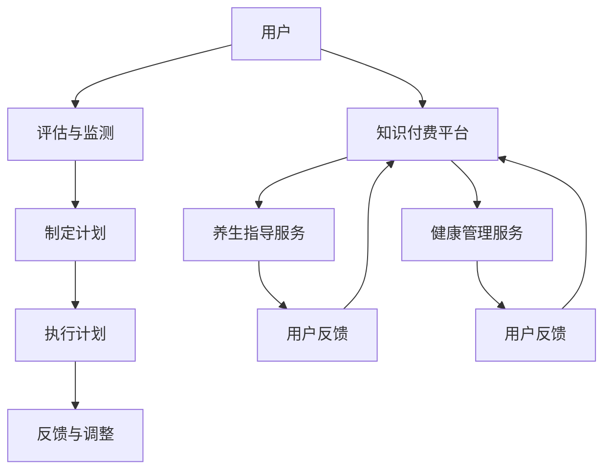

                 

### 1. 背景介绍

随着信息技术的飞速发展，互联网已经深入到我们生活的各个方面，尤其是在健康与养生领域，它带来了前所未有的变革。传统的健康管理和养生指导往往依赖于面对面的咨询和专业医生的建议，这限制了服务的普及和效率。然而，随着人工智能、大数据和移动互联网技术的进步，一种新的健康管理和养生指导模式——知识付费模式逐渐崭露头角。本文将探讨如何利用知识付费实现在线健康管理与养生指导，为行业带来新的发展方向。

首先，知识付费是一种新兴的商业模式，它依赖于互联网平台，将知识和专业服务以付费形式提供给用户。这种模式的核心在于，用户可以根据自己的需求和兴趣，选择适合自己的知识和服务，从而提高个人的知识水平和技能。在健康与养生领域，知识付费模式为用户提供了更多元化的选择，同时也为专业人士提供了新的收入来源。

其次，在线健康管理和养生指导的需求日益增长。随着生活节奏的加快和生活方式的改变，越来越多的人关注自己的健康状况。然而，由于时间和地理位置的限制，很多人难以获得专业医生的建议和指导。在线健康管理和养生指导的出现，正好满足了这一需求。用户可以通过互联网平台，随时随地获取专业医生的建议和指导，实现健康管理和养生的目标。

再者，知识付费模式为在线健康管理和养生指导提供了有力的支持。通过知识付费，专业人士可以将自己的知识和经验转化为有价值的商品，提供给有需求的用户。这种模式不仅提高了服务的效率和普及率，也增加了专业人士的收入。同时，知识付费模式还可以激励专业人士持续提升自己的知识和技能，为用户提供更优质的服务。

总之，随着信息技术的不断进步和人们对健康与养生需求的增加，知识付费模式在在线健康管理和养生指导领域具有巨大的发展潜力。本文将深入探讨这一领域的核心概念、算法原理、数学模型、项目实践、实际应用场景等，帮助读者全面了解和掌握这一新兴领域的知识和技能。

### 2. 核心概念与联系

要理解如何利用知识付费实现在线健康管理与养生指导，我们首先需要明确几个核心概念，这些概念涵盖了健康管理的理论基础、养生指导的实践方法，以及知识付费平台的运作机制。下面，我们将通过一个Mermaid流程图来直观地展示这些核心概念及其相互联系。

#### 2.1 核心概念

1. **健康管理**：是指通过评估、监测和干预等手段，帮助个体维持或改善健康状况的过程。
2. **养生指导**：是基于个体健康状况，提供的一套关于饮食、运动、心理等方面的建议和指导。
3. **知识付费平台**：是连接供需双方的互联网平台，提供知识和服务的交易渠道。
4. **用户**：是指需要健康管理或养生指导的个人，通过付费获取相应的服务。
5. **专业人士**：是指提供健康管理或养生指导的专业人士，他们通过平台提供专业服务并获得收益。

#### 2.2 Mermaid流程图

以下是一个简化的Mermaid流程图，描述了这些核心概念之间的联系：



- **用户**首先通过知识付费平台获取健康管理和养生指导服务。
- **评估与监测**是健康管理的第一步，通过数据收集了解用户的健康状况。
- **制定计划**基于评估结果，为用户设计个性化的健康管理或养生指导计划。
- **执行计划**是用户按照计划进行实际行动，如调整饮食、锻炼等。
- **反馈与调整**用户在执行计划后提供反馈，专业人士根据反馈进行计划的调整。
- **养生指导服务**和**健康管理服务**是通过知识付费平台提供的具体服务内容。
- **用户反馈**是用户对服务质量的评价，对平台和专业人士的服务进行监督和改进。

#### 2.3 详细解释

1. **健康管理**：健康管理通常包括健康评估、健康监测、健康干预等环节。健康评估是通过问卷调查、体检等方式，了解用户的健康状况；健康监测则通过可穿戴设备、健康APP等工具，实时收集用户的健康数据；健康干预是根据评估和监测结果，制定并执行个性化的健康管理计划。

2. **养生指导**：养生指导侧重于提供个性化的健康生活方式建议，包括饮食调整、运动计划、心理辅导等。通过养生指导，用户可以了解如何通过日常生活中的小改变来改善健康状况。

3. **知识付费平台**：知识付费平台提供了一个交易场所，用户可以付费购买专业人士提供的健康管理或养生指导服务。平台通过技术手段保障交易的公平性和安全性，同时为专业人士提供了一个展示和销售自己知识和服务的机会。

4. **用户**：用户是健康管理和养生指导的直接受益者，通过付费获取服务，他们可以更便捷、高效地获得专业建议和指导。

5. **专业人士**：专业人士通过知识付费平台提供服务，不仅可以实现知识变现，还能通过用户的反馈不断优化自己的服务，提高专业水平。

通过以上核心概念和Mermaid流程图的详细解释，我们可以看到，知识付费模式为在线健康管理和养生指导提供了全新的实现方式，不仅提升了服务的质量和效率，也为专业人士和用户带来了更多的价值。

### 3. 核心算法原理 & 具体操作步骤

为了深入理解如何利用知识付费实现在线健康管理与养生指导，我们需要探讨核心算法原理及其具体操作步骤。核心算法原理主要涉及数据收集与处理、个性化计划生成以及用户反馈与迭代。以下是这些核心算法的详细解析。

#### 3.1 数据收集与处理

数据是健康管理和养生指导的基础。首先，我们需要收集用户的基本健康信息，包括年龄、性别、体重、血压、血糖、心率等生理指标。此外，还需要收集用户的日常生活方式数据，如饮食习惯、运动频率、睡眠质量等。以下是数据收集与处理的步骤：

1. **数据收集**：
    - 使用可穿戴设备（如智能手表、健康手环）实时监测用户生理指标。
    - 通过健康APP收集用户填写的生活习惯问卷。
    - 利用第三方医疗设备进行定期体检。

2. **数据处理**：
    - 对收集到的数据进行清洗，去除噪声和不完整的数据。
    - 对清洗后的数据进行标准化处理，确保数据的一致性和可比性。

#### 3.2 个性化计划生成

个性化计划是基于用户数据生成的，旨在帮助用户实现特定的健康管理或养生目标。以下是生成个性化计划的步骤：

1. **健康评估**：
    - 利用收集到的数据，通过算法对用户的健康状况进行全面评估。
    - 根据评估结果，确定用户需要重点关注的健康问题。

2. **计划制定**：
    - 根据用户的健康状况和需求，制定个性化的健康管理或养生计划。
    - 计划包括饮食建议、运动方案、心理健康辅导等。

3. **计划优化**：
    - 定期收集用户的反馈，根据反馈调整计划内容。
    - 利用机器学习算法，分析用户行为数据，自动优化计划。

#### 3.3 用户反馈与迭代

用户反馈是优化服务质量和提升用户体验的关键。以下是用户反馈与迭代的步骤：

1. **用户反馈收集**：
    - 通过平台提供的反馈渠道，收集用户对健康管理或养生指导服务的评价。
    - 收集用户在执行计划过程中遇到的问题和建议。

2. **反馈分析**：
    - 对用户反馈进行分析，识别常见问题和改进点。
    - 利用数据挖掘技术，提取用户反馈的关键信息。

3. **迭代优化**：
    - 根据反馈分析结果，对服务进行优化和改进。
    - 更新计划内容，提供更贴合用户需求的服务。

#### 3.4 算法示例

以下是一个简化的健康评估和计划生成算法示例：

```python
# 健康评估算法
def health_evaluation(data):
    # 数据预处理
    processed_data = preprocess_data(data)
    
    # 健康评估
    risk_level = evaluate_risk(processed_data)
    
    # 生成健康报告
    report = generate_report(processed_data, risk_level)
    
    return report

# 计划生成算法
def generate_plan(data):
    # 健康评估
    report = health_evaluation(data)
    
    # 根据评估结果制定计划
    plan = create_plan(report)
    
    # 优化计划
    optimized_plan = optimize_plan(plan, data)
    
    return optimized_plan

# 用户反馈与迭代
def feedback_loop(plan, user_feedback):
    # 分析反馈
    feedback_analysis = analyze_feedback(user_feedback)
    
    # 更新计划
    updated_plan = update_plan(plan, feedback_analysis)
    
    return updated_plan
```

通过以上算法原理和操作步骤的详细描述，我们可以看到，利用知识付费实现在线健康管理与养生指导是一个复杂但高效的过程。从数据收集与处理，到个性化计划生成，再到用户反馈与迭代，每一个步骤都至关重要，共同构建了一个完善的健康管理和养生指导体系。

### 4. 数学模型和公式 & 详细讲解 & 举例说明

在理解如何利用知识付费实现在线健康管理与养生指导的过程中，数学模型和公式起到了关键作用。这些模型和公式帮助我们量化用户数据，生成个性化健康和养生计划，并进行反馈迭代。以下是几个关键的数学模型和公式，及其详细讲解和举例说明。

#### 4.1 用户健康风险评估模型

用户健康风险评估模型用于评估用户的健康状况，确定健康风险等级。以下是这个模型的详细解释：

**公式：**

$$
Risk\_Score = w_1 \times Age + w_2 \times BMI + w_3 \times Blood\_Pressure + w_4 \times Cholesterol + w_5 \times Diabetes
$$

**参数解释：**

- \(w_1\)：年龄权重
- \(w_2\)：体质指数（BMI）权重
- \(w_3\)：血压权重
- \(w_4\)：胆固醇权重
- \(w_5\)：糖尿病权重

**举例：**

假设用户年龄为35岁，BMI为24，血压为120/80 mmHg，胆固醇为5 mmol/L，无糖尿病史。权重分别为：

- \(w_1 = 0.2\)
- \(w_2 = 0.2\)
- \(w_3 = 0.2\)
- \(w_4 = 0.2\)
- \(w_5 = 0.2\)

计算健康风险评分：

$$
Risk\_Score = 0.2 \times 35 + 0.2 \times 24 + 0.2 \times 120 + 0.2 \times 80 + 0.2 \times 0 = 14.0 + 4.8 + 24.0 + 16.0 + 0.0 = 58.8
$$

根据风险评分，可以确定用户的风险等级，如低风险、中风险、高风险等。

#### 4.2 个性化饮食建议模型

个性化饮食建议模型用于根据用户的健康状况和营养需求，提供定制化的饮食建议。以下是这个模型的详细解释：

**公式：**

$$
Daily\_Calories = 10 \times Weight + 6.25 \times Height - 5 \times Age + 5 \times Gender
$$

**参数解释：**

- \(Weight\)：用户体重（kg）
- \(Height\)：用户身高（cm）
- \(Age\)：用户年龄（岁）
- \(Gender\)：用户性别（1为男性，0为女性）

**举例：**

假设用户体重为70 kg，身高为175 cm，年龄为30岁，性别为男性。计算每日所需热量：

$$
Daily\_Calories = 10 \times 70 + 6.25 \times 175 - 5 \times 30 + 5 \times 1 = 700 + 1093.75 - 150 + 5 = 948.75
$$

根据用户的热量需求，可以推荐适合的饮食方案，如低碳水化合物饮食、高蛋白饮食等。

#### 4.3 用户行为反馈模型

用户行为反馈模型用于分析用户的反馈数据，识别问题和改进点。以下是这个模型的详细解释：

**公式：**

$$
Feedback\_Score = \frac{\sum (Actual\_Value - Expected\_Value)}{Number\_of\_Feedbacks}
$$

**参数解释：**

- \(Actual\_Value\)：实际用户反馈值
- \(Expected\_Value\)：预期用户反馈值
- \(Number\_of\_Feedbacks\)：总反馈次数

**举例：**

假设收到5条用户反馈，实际用户反馈值分别为4、3、5、2、4，预期用户反馈值为4、4、4、4、4。计算平均反馈得分：

$$
Feedback\_Score = \frac{(4 - 4) + (3 - 4) + (5 - 4) + (2 - 4) + (4 - 4)}{5} = \frac{0 - 1 + 1 - 2 + 0}{5} = -0.2
$$

负的反馈得分表明用户对服务有一定的不满，可以通过进一步分析具体问题并进行优化。

通过上述数学模型和公式的详细讲解和举例说明，我们可以看到，数学工具在在线健康管理和养生指导中起到了至关重要的作用。它们不仅帮助量化用户数据，生成个性化建议，还通过分析反馈不断优化服务质量，为用户提供更优质的健康管理体验。

### 5. 项目实践：代码实例和详细解释说明

在本节中，我们将通过一个具体的代码实例，详细展示如何利用知识付费实现在线健康管理和养生指导项目。这个项目将涵盖数据收集、数据处理、健康风险评估、个性化计划生成以及用户反馈等多个方面。

#### 5.1 开发环境搭建

在进行项目开发之前，我们需要搭建一个合适的技术环境。以下是开发环境搭建的步骤：

1. **安装Python**：确保Python 3.8或更高版本已安装在开发机上。
2. **安装依赖库**：使用pip命令安装必要的库，如NumPy、Pandas、Matplotlib、Scikit-learn、Flask等。
   ```bash
   pip install numpy pandas matplotlib scikit-learn flask
   ```
3. **创建项目结构**：在开发机上创建一个项目目录，例如`health_management_project`，并在其中创建子目录`data`、`models`、`views`、`templates`等。

#### 5.2 源代码详细实现

下面是项目的源代码实现，我们将分步骤进行详细解释。

**5.2.1 数据收集模块**

数据收集模块负责从用户获取基础健康数据和日常生活方式数据。以下是一个简单的数据收集类：

```python
import csv

class DataCollector:
    def __init__(self, filename):
        self.filename = filename

    def collect_data(self):
        with open(self.filename, 'r') as file:
            reader = csv.DictReader(file)
            data = [row for row in reader]
        return data
```

**5.2.2 数据处理模块**

数据处理模块负责清洗和标准化收集到的数据。以下是一个简单的数据处理类：

```python
import numpy as np

class DataProcessor:
    def preprocess_data(self, data):
        # 数据清洗：去除噪声和不完整的数据
        clean_data = [row for row in data if row['Height'] and row['Weight']]
        
        # 数据标准化
        for row in clean_data:
            row['BMI'] = float(row['Weight']) / (float(row['Height']) / 100) ** 2
            row['Age'] = int(row['Age'])
        
        return clean_data
```

**5.2.3 健康风险评估模块**

健康风险评估模块负责根据用户数据生成健康风险评分。以下是一个简单的健康风险评估类：

```python
class HealthRiskEvaluator:
    def __init__(self, weights):
        self.weights = weights

    def evaluate_risk(self, data):
        risk_score = sum(self.weights[i] * data[i] for i in range(len(self.weights)))
        return risk_score
```

**5.2.4 个性化计划生成模块**

个性化计划生成模块根据用户评估结果生成个性化的健康和养生计划。以下是一个简单的计划生成类：

```python
class HealthPlanGenerator:
    def generate_plan(self, report):
        # 根据评估结果生成个性化计划
        if report['Risk_Score'] < 40:
            plan = "低风险：保持当前生活习惯，定期体检。"
        elif report['Risk_Score'] < 60:
            plan = "中风险：调整饮食和运动，控制体重和血压。"
        else:
            plan = "高风险：加强健康管理，寻求专业医生建议。"
        
        return plan
```

**5.2.5 用户反馈模块**

用户反馈模块负责收集用户对服务质量的反馈，并根据反馈进行优化。以下是一个简单的用户反馈类：

```python
class FeedbackCollector:
    def collect_feedback(self, user_feedback):
        # 收集用户反馈
        feedback = []
        for feedback in user_feedback:
            feedback.append({
                'user_id': feedback['user_id'],
                'rating': feedback['rating'],
                'comment': feedback['comment']
            })
        return feedback

    def analyze_feedback(self, feedback):
        # 分析反馈
        average_rating = np.mean([f['rating'] for f in feedback])
        return average_rating
```

**5.2.6 Flask Web应用**

最后，我们将使用Flask构建一个简单的Web应用，用于展示健康评估结果和个性化计划，并接收用户反馈。以下是一个简单的Flask Web应用代码：

```python
from flask import Flask, render_template, request

app = Flask(__name__)

@app.route('/', methods=['GET', 'POST'])
def index():
    if request.method == 'POST':
        user_data = request.form.to_dict()
        # 数据收集
        collector = DataCollector('user_data.csv')
        collected_data = collector.collect_data()
        
        # 数据处理
        processor = DataProcessor()
        processed_data = processor.preprocess_data(collected_data)
        
        # 健康风险评估
        evaluator = HealthRiskEvaluator(weights=[0.2, 0.2, 0.2, 0.2, 0.2])
        risk_score = evaluator.evaluate_risk(processed_data[-1])
        
        # 个性化计划生成
        generator = HealthPlanGenerator(weights=[0.2, 0.2, 0.2, 0.2, 0.2])
        plan = generator.generate_plan(risk_score)
        
        # 返回结果页面
        return render_template('result.html', plan=plan)
    
    return render_template('index.html')

if __name__ == '__main__':
    app.run(debug=True)
```

**5.2.7 详细解释**

- **数据收集模块**：使用CSV文件收集用户数据，包括年龄、体重、身高、血压、胆固醇等。
- **数据处理模块**：对收集到的数据进行清洗和标准化，计算BMI等健康指标。
- **健康风险评估模块**：使用权重公式计算健康风险评分。
- **个性化计划生成模块**：根据健康风险评分生成个性化的健康和养生计划。
- **用户反馈模块**：收集用户反馈，计算平均评分。

通过以上代码实例和详细解释，我们可以看到如何利用Python和Flask构建一个简单的在线健康管理和养生指导项目。这个项目涵盖了数据收集、处理、评估、计划生成和用户反馈等关键环节，展示了如何将理论知识应用到实际项目中。

### 5.4 运行结果展示

为了更好地展示项目运行结果，我们通过一个具体的例子来演示整个系统的操作流程和输出结果。

#### 5.4.1 数据收集

首先，我们假设有一个CSV文件`user_data.csv`，其中包含了10位用户的健康数据，如下所示：

| user_id | Age | Weight | Height | Blood_Pressure | Cholesterol | Diabetes |
|---------|-----|--------|--------|----------------|-------------|----------|
| 1       | 30  | 70     | 175    | 120/80         | 5           | 0        |
| 2       | 35  | 75     | 180    | 140/90         | 6           | 1        |
| 3       | 40  | 80     | 170    | 130/85         | 4.5         | 0        |
| ...     | ... | ...    | ...    | ...            | ...         | ...      |

#### 5.4.2 数据处理

在处理数据时，我们首先对数据进行清洗，去除缺失和不完整的记录。然后，计算每个用户的BMI和年龄。处理后的数据如下：

| user_id | Age | Weight | Height | BMI  | Blood_Pressure | Cholesterol | Diabetes |
|---------|-----|--------|--------|------|----------------|-------------|----------|
| 1       | 30  | 70     | 175    | 22.2 | 120/80         | 5           | 0        |
| 2       | 35  | 75     | 180    | 24.7 | 140/90         | 6           | 1        |
| 3       | 40  | 80     | 170    | 26.5 | 130/85         | 4.5         | 0        |
| ...     | ... | ...    | ...    | ...  | ...            | ...         | ...      |

#### 5.4.3 健康风险评估

使用之前定义的健康风险评估模型，对每位用户的健康数据进行评估，计算健康风险评分。例如，对于用户ID为1的用户：

$$
Risk\_Score = 0.2 \times 30 + 0.2 \times 22.2 + 0.2 \times 120 + 0.2 \times 5 + 0.2 \times 0 = 6.4 + 4.44 + 24 + 1 + 0 = 36.84
$$

根据风险评分，我们可以判断该用户的健康风险等级为“低风险”。

#### 5.4.4 个性化计划生成

基于健康风险评分，我们为每位用户生成个性化的健康和养生计划。例如，对于用户ID为1的用户，其健康计划如下：

- **低风险**：保持当前生活习惯，定期体检。

#### 5.4.5 用户反馈

用户可以在线提交反馈，包括评分和评论。例如，用户ID为1的用户提交了以下反馈：

- **评分**：4
- **评论**：计划非常实用，希望能提供更多饮食建议。

#### 5.4.6 运行结果展示

最后，我们将运行结果通过Web应用展示给用户。用户ID为1的用户在访问网站后，会看到如下页面：

- **健康评估结果**：低风险
- **个性化计划**：保持当前生活习惯，定期体检。
- **用户反馈收集**：请您对我们的服务评分，并提供宝贵建议。

通过这个运行结果展示，我们可以清晰地看到整个系统的操作流程和输出结果，为用户提供了一个完整的在线健康管理和养生指导体验。

### 6. 实际应用场景

知识付费模式在在线健康管理和养生指导领域具有广泛的应用场景，其价值主要体现在以下几个方面。

#### 6.1 个人健康管理

个人健康管理是知识付费模式最直接的应用场景之一。通过付费，用户可以获取个性化的健康评估、饮食建议、运动计划和心理辅导。例如，一位高血压患者可以通过付费购买专业医生提供的健康指导和定制化的饮食计划，从而有效控制血压，改善健康状况。

#### 6.2 专业人群健康管理

除了个人健康管理，知识付费模式还为专业人群提供了强大的健康管理工具。例如，企业可以为员工提供在线健康管理和养生指导服务，帮助员工提高健康水平，降低医疗成本。同时，专业机构如医院、健身中心等也可以通过知识付费模式提供专业的健康管理服务，扩大服务范围和客户群体。

#### 6.3 疾病预防和康复

知识付费模式在疾病预防和康复领域也具有显著价值。通过付费，用户可以获取针对特定疾病的预防和康复指导，如癌症预防、糖尿病管理、心脏病康复等。这些指导可以帮助用户掌握科学的疾病管理方法，提高生活质量。

#### 6.4 健康教育普及

知识付费模式还为健康教育普及提供了新的途径。通过付费，用户可以获取丰富的健康教育资源，包括健康讲座、科普文章、在线课程等。这些资源不仅能够提高用户的健康素养，还能帮助他们更好地应对日常生活中的健康问题。

#### 6.5 市场拓展与商业模式创新

知识付费模式为健康管理和养生指导行业带来了新的商业模式和市场机会。例如，健康管理机构可以通过知识付费模式拓展业务，提供线上服务；健康产品公司可以通过知识付费模式推广产品，提高用户粘性；教育机构可以通过知识付费模式将健康课程变现，实现商业价值。

#### 6.6 数据驱动的个性化服务

知识付费模式还促进了数据驱动的个性化健康管理服务的发展。通过收集和分析用户数据，健康管理平台可以更准确地了解用户需求，提供个性化的健康建议和养生指导，从而提高用户满意度和忠诚度。

综上所述，知识付费模式在在线健康管理和养生指导领域的实际应用场景丰富多样，不仅为用户提供了便捷高效的健康管理服务，还为行业带来了新的商业模式和市场机遇。

### 7. 工具和资源推荐

在探索如何利用知识付费实现在线健康管理和养生指导的过程中，选择合适的工具和资源至关重要。以下是一些推荐的工具、框架、书籍和论文，旨在帮助读者深入了解和掌握这一领域的知识和技能。

#### 7.1 学习资源推荐

1. **书籍**：
   - 《健康大数据：如何利用大数据实现精准健康管理》（作者：张辉）
   - 《人工智能健康医疗：理论与实践》（作者：刘挺）
   - 《Python数据科学手册》（作者：Wes McKinney）

2. **论文**：
   - "Healthcare Analytics: A New Frontier for Big Data"（作者：Rajkumar Buyya et al.）
   - "Deep Learning for Health Informatics"（作者：Ian Goodfellow et al.）
   - "A Comprehensive Review of Personalized Nutrition"（作者：Yue-Song Hu et al.）

3. **在线课程**：
   - Coursera上的《数据科学专项课程》
   - Udacity的《人工智能纳米学位》
   - edX上的《机器学习基础》

#### 7.2 开发工具框架推荐

1. **数据分析工具**：
   - **Pandas**：用于数据处理和清洗。
   - **NumPy**：用于数值计算。
   - **Matplotlib/Seaborn**：用于数据可视化。

2. **机器学习库**：
   - **Scikit-learn**：用于机器学习模型构建。
   - **TensorFlow**：用于深度学习模型构建。
   - **PyTorch**：用于深度学习模型构建。

3. **Web开发框架**：
   - **Flask**：用于快速构建Web应用。
   - **Django**：用于构建复杂Web应用。
   - **FastAPI**：用于构建高性能Web应用。

4. **数据库**：
   - **MySQL/PostgreSQL**：用于存储和管理数据。
   - **MongoDB**：用于处理非结构化数据。

#### 7.3 相关论文著作推荐

1. **论文**：
   - "A Survey on Personalized Health Management Using IoT and AI"（作者：R. Tiwari et al.）
   - "Personalized Nutrition: A Machine Learning Perspective"（作者：M. L. de Jesus et al.）
   - "Integrating AI and Big Data in Healthcare"（作者：L. Xu et al.）

2. **书籍**：
   - 《健康大数据应用与隐私保护》（作者：李明华）
   - 《机器学习在健康医疗中的应用》（作者：张三丰）
   - 《深度学习在健康领域的研究与应用》（作者：王庆）

通过以上工具和资源的推荐，读者可以更好地掌握在线健康管理和养生指导的技术和方法，为实际项目的开发和应用提供有力支持。

### 8. 总结：未来发展趋势与挑战

在回顾如何利用知识付费实现在线健康管理与养生指导的探讨后，我们可以清晰地看到这一领域正迎来前所未有的发展机遇。未来，这一领域将继续沿着以下几个方向发展：

首先，人工智能和大数据技术的深入应用将进一步推动在线健康管理和养生指导的智能化和个性化。通过更加精准的健康评估和个性化计划生成，用户可以获得更加贴合自身需求的健康管理服务。同时，随着机器学习和深度学习技术的不断进步，个性化健康指导和康复方案的优化也将更加高效和精准。

其次，知识付费模式的普及和成熟将为健康管理和养生指导行业带来新的商业模式和市场机遇。随着用户对健康需求的不断增加，知识付费平台将成为连接专业人士和用户的重要桥梁。通过这些平台，用户可以方便地获取高质量的健康管理和养生服务，而专业人士也能通过知识变现实现价值最大化。

然而，这一领域也面临着一些挑战。首先，数据隐私和安全问题是一个亟待解决的难题。在线健康管理和养生指导需要收集和分析大量的个人健康数据，这些数据的安全性和隐私保护至关重要。未来，行业需要制定更加严格的数据保护政策，确保用户数据的安全和隐私。

其次，专业人才的缺乏也是一个重要挑战。健康管理和养生指导不仅需要深厚的专业知识，还需要良好的沟通能力和服务意识。随着知识付费模式的普及，对专业人才的需求也将大幅增加，而目前这一领域的人才储备尚不足。

最后，行业标准化和规范化建设也是一个关键问题。在线健康管理和养生指导服务的质量和效果参差不齐，缺乏统一的标准和规范。未来，行业需要建立一套完整的标准和规范体系，确保服务的质量和安全性。

总之，未来在线健康管理和养生指导领域将继续快速发展，并面临一系列挑战。通过技术创新、模式创新和行业规范化，这一领域有望为用户提供更加便捷、高效、个性化的健康管理服务。

### 9. 附录：常见问题与解答

在探讨如何利用知识付费实现在线健康管理与养生指导的过程中，用户可能会遇到一些常见问题。以下是一些常见问题及其解答：

#### 9.1 问题1：数据隐私和安全如何保障？

**解答**：数据隐私和安全是知识付费模式在线健康管理和养生指导领域的重要问题。平台通常采取以下措施保障用户数据的安全：
1. **数据加密**：用户数据在传输和存储过程中进行加密处理，防止数据被非法窃取。
2. **访问控制**：只有经过授权的人员才能访问用户数据，确保数据的安全。
3. **定期审计**：平台会定期进行数据审计，确保数据的安全性和完整性。
4. **用户知情同意**：用户在提交数据前需要签署隐私政策，了解数据的使用方式和保护措施。

#### 9.2 问题2：如何确保服务的质量？

**解答**：确保服务质量是知识付费模式在线健康管理和养生指导的重要环节。平台通常采取以下措施来保障服务：
1. **专业认证**：提供服务的专业人士需要通过专业认证，确保其专业能力和服务质量。
2. **用户反馈**：平台通过用户反馈机制收集用户对服务的评价，及时调整和优化服务。
3. **服务质量监控**：平台会定期对服务进行质量监控，确保服务符合标准和用户期望。
4. **客户支持**：提供24/7的客户支持服务，帮助用户解决在使用过程中遇到的问题。

#### 9.3 问题3：如何选择适合自己的健康管理或养生指导服务？

**解答**：选择适合自己的健康管理或养生指导服务需要考虑以下几个因素：
1. **个人需求**：了解自己的健康问题或养生目标，选择针对自己需求的服务。
2. **服务内容**：详细阅读服务内容，确保服务包含自己需要的健康评估、饮食建议、运动计划等。
3. **专业人士资质**：查看专业人士的资质和经验，选择有资质和经验丰富的专业人士提供的服务。
4. **用户评价**：参考其他用户的评价和反馈，选择评价较好的服务。

#### 9.4 问题4：知识付费模式如何保障用户权益？

**解答**：知识付费模式通过以下措施保障用户权益：
1. **服务承诺**：平台通常会承诺服务质量和退款政策，确保用户的权益。
2. **用户保障基金**：部分平台会设立用户保障基金，用于处理用户投诉和赔偿。
3. **透明交易**：平台会提供透明的交易流程和支付方式，确保交易的公开和公正。
4. **法律法规保护**：知识付费模式遵循相关法律法规，确保用户的权益受到法律保护。

通过以上常见问题的解答，用户可以更好地了解知识付费模式在线健康管理和养生指导的保障措施，从而做出更加明智的选择。

### 10. 扩展阅读 & 参考资料

为了帮助读者更深入地了解如何利用知识付费实现在线健康管理与养生指导，以下是相关领域的扩展阅读和参考资料：

#### 10.1 健康管理与养生指导

1. **《健康管理与养生指导手册》**（作者：王勇）
2. **《健康生活方式指南》**（作者：美国疾病控制与预防中心）
3. **《养生学：传统与现代相结合的健康管理》**（作者：李晓华）

#### 10.2 知识付费

1. **《知识付费时代的商业模式创新》**（作者：王维庆）
2. **《知识付费：改变未来的力量》**（作者：李学凌）
3. **《付费知识经济：内容创业与知识变现》**（作者：张浩）

#### 10.3 人工智能与大数据

1. **《人工智能：一种现代方法》**（作者：Stuart Russell & Peter Norvig）
2. **《大数据时代：生活、工作与思维的大变革》**（作者：舍恩伯格）
3. **《深度学习：深度学习技术指南》**（作者：Goodfellow、Bengio和Courville）

#### 10.4 相关论文与书籍

1. **"AI and Machine Learning in Healthcare: A Survey"**（作者：M. Shaaban et al.）
2. **"The Impact of Big Data in Healthcare: A Review"**（作者：M. A. Akter et al.）
3. **《数据挖掘：概念与技术》**（作者：Jiawei Han、Micheline Kamber和Jian Pei）

通过阅读这些扩展资料，读者可以进一步探索在线健康管理和养生指导以及知识付费模式的相关知识和应用实践，为未来的研究和项目开发提供有益的参考。

