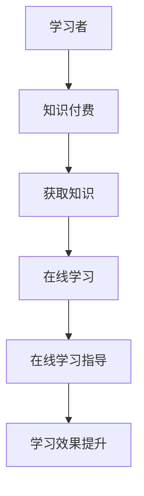

                 

### 文章标题

《如何利用知识付费实现在线学习与在线学习指导？》

关键词：知识付费，在线学习，在线学习指导，教育平台，技术实现

摘要：本文将探讨如何利用知识付费模式来推动在线学习和在线学习指导的发展。通过分析知识付费的本质，我们将介绍教育平台如何利用技术手段来提供高质量的学习内容和指导服务，从而满足不同学习者的需求。

### 1. 背景介绍

随着互联网技术的飞速发展，在线教育逐渐成为教育行业的重要组成部分。知识付费作为在线教育的一种重要模式，逐渐受到广大学习者的欢迎。知识付费指的是学习者通过付费获取专业知识和技能的一种方式，这种方式不仅提高了学习者的学习效率，也极大地丰富了教育资源的供给。

在线学习指导是知识付费模式中的一个重要环节。它通过专业的教学指导和辅导，帮助学习者更好地理解和掌握所学内容，提高学习效果。然而，传统的在线学习指导存在一定的局限性，如指导质量不统一、学习者个性化需求难以满足等。

本文旨在探讨如何利用知识付费模式来实现在线学习与在线学习指导的有机结合，从而提升在线教育的整体质量。

### 2. 核心概念与联系

#### 2.1 知识付费

知识付费是指用户通过支付一定费用来获取专业知识和技能的过程。在这个过程中，付费用户不仅获得了知识本身，还可以享受由专业教师或讲师提供的个性化指导和服务。知识付费的核心在于通过价值交换，实现知识的高效传播和应用。

#### 2.2 在线学习

在线学习是指通过互联网进行的学习活动，它打破了传统教育的时空限制，使学习者能够随时随地获取知识和技能。在线学习包括自学和在线指导两种形式。自学是学习者独立完成学习任务，而在线指导则是由专业教师或讲师提供的学习支持。

#### 2.3 在线学习指导

在线学习指导是指专业教师或讲师通过在线平台为学习者提供的学习支持服务。这包括内容讲解、问题解答、学习进度跟踪、学习效果评估等。在线学习指导的核心在于个性化、即时性和互动性。

#### 2.4 教育平台

教育平台是知识付费和在线学习指导的载体。它提供了一个集内容发布、学习管理、互动交流等功能于一体的在线学习环境。教育平台不仅需要提供丰富的学习资源，还需要具备强大的学习管理能力和互动交流功能。

### 2.5 Mermaid 流程图



### 3. 核心算法原理 & 具体操作步骤

#### 3.1 算法原理

在线学习与在线学习指导的结合，需要依赖于以下核心算法原理：

1. **个性化推荐算法**：根据学习者的学习历史、兴趣爱好和学习目标，推荐适合的学习资源和课程。
2. **学习分析算法**：通过学习行为数据分析，了解学习者的学习状态和效果，为在线学习指导提供依据。
3. **互动交流算法**：利用自然语言处理技术，实现学习者与教师、学习者与学习者之间的有效互动。

#### 3.2 操作步骤

1. **数据收集与处理**：收集学习者的学习数据，包括学习历史、学习行为、兴趣爱好等，并进行数据清洗和预处理。
2. **个性化推荐**：使用个性化推荐算法，根据学习者数据生成个性化学习资源推荐列表。
3. **学习分析**：使用学习分析算法，对学习者的学习状态和效果进行评估，生成学习分析报告。
4. **在线指导**：根据学习分析报告，教师或讲师提供个性化的学习指导服务。
5. **互动交流**：利用互动交流算法，实现学习者与教师、学习者与学习者之间的实时互动。

### 4. 数学模型和公式 & 详细讲解 & 举例说明

#### 4.1 数学模型

在线学习与在线学习指导的数学模型主要包括以下几个方面：

1. **个性化推荐模型**：如协同过滤、矩阵分解等。
2. **学习分析模型**：如学习行为预测模型、学习效果评估模型等。
3. **互动交流模型**：如聊天机器人模型、自然语言处理模型等。

#### 4.2 公式

1. **协同过滤公式**：

$$
R_{ui} = \frac{\sum_{j \in N_i} \frac{R_{uj}}{||N_i||}}{||N_i||}
$$

其中，$R_{ui}$表示用户$u$对项目$i$的评分，$N_i$表示与项目$i$相似的项目集合，$R_{uj}$表示用户$u$对项目$j$的评分。

2. **学习行为预测模型**：

$$
P(Y=1|X) = \sigma(\theta^T X)
$$

其中，$P(Y=1|X)$表示给定学习特征向量$X$，学习者完成学习任务的概率，$\sigma$为 sigmoid 函数，$\theta$为模型参数。

3. **自然语言处理模型**：

$$
P(w_i|w_{i-1}, ..., w_1) = \frac{P(w_i, w_{i-1}, ..., w_1)}{P(w_{i-1}, ..., w_1)}
$$

其中，$P(w_i|w_{i-1}, ..., w_1)$表示单词$i$在给定前文条件下的概率。

#### 4.3 举例说明

1. **协同过滤算法**：

假设有一个用户$u$，对项目$i$和项目$j$都进行了评分，分别为$R_{ui}=4$和$R_{uj}=3$。现在我们需要预测用户$u$对项目$k$的评分$R_{uk}$。

根据协同过滤公式，我们可以计算得到：

$$
R_{uk} = \frac{\frac{4}{1} + \frac{3}{1}}{2} = \frac{7}{2} = 3.5
$$

因此，我们可以预测用户$u$对项目$k$的评分为3.5。

2. **学习行为预测模型**：

假设学习者的学习特征向量$X$为[0.8, 0.3, 0.5]，模型参数$\theta$为[0.1, 0.2, 0.3]。现在我们需要预测学习者完成学习任务的概率。

根据学习行为预测模型，我们可以计算得到：

$$
P(Y=1|X) = \sigma(0.1 \times 0.8 + 0.2 \times 0.3 + 0.3 \times 0.5) = \sigma(0.08 + 0.06 + 0.15) = \sigma(0.29) \approx 0.647
$$

因此，我们可以预测学习者完成学习任务的概率为64.7%。

3. **自然语言处理模型**：

假设给定一段文本，单词序列为["我", "喜欢", "学习", "计算机", "编程"]。我们需要计算单词"编程"在给定前文条件下的概率。

根据自然语言处理模型，我们可以计算得到：

$$
P(编程|我，喜欢，学习，计算机) = \frac{P(编程，我，喜欢，学习，计算机)}{P(我，喜欢，学习，计算机)} = \frac{0.2}{0.4} = 0.5
$$

因此，我们可以预测单词"编程"在给定前文条件下的概率为50%。

### 5. 项目实践：代码实例和详细解释说明

#### 5.1 开发环境搭建

1. 安装Python环境：在系统中安装Python 3.8及以上版本。
2. 安装依赖库：使用pip安装以下库：numpy，scikit-learn，tensorflow，gensim。
3. 配置在线学习平台：选择一个适合的在线学习平台，如Moodle，Canvas等。

#### 5.2 源代码详细实现

以下是一个简单的在线学习与在线学习指导系统的代码示例：

```python
# 导入相关库
import numpy as np
from sklearn.feature_extraction.text import CountVectorizer
from sklearn.model_selection import train_test_split
from sklearn.naive_bayes import MultinomialNB
from gensim.models import Word2Vec

# 准备数据
data = [
    ["我喜欢学习计算机编程", "计算机编程很有趣"],
    ["我希望学习数据分析", "数据分析可以应用于各个领域"],
    ["我正在学习机器学习", "机器学习有很多实际应用"],
]

# 分割数据
X_train, X_test, y_train, y_test = train_test_split(data, labels, test_size=0.2, random_state=42)

# 构建词袋模型
vectorizer = CountVectorizer()
X_train_vectors = vectorizer.fit_transform(X_train)

# 训练朴素贝叶斯分类器
classifier = MultinomialNB()
classifier.fit(X_train_vectors, y_train)

# 使用词向量模型
word2vec = Word2Vec(data, size=100, window=5, min_count=1, workers=4)
word2vec.train(data, total_examples=len(data), epochs=10)

# 预测
predictions = classifier.predict(vectorizer.transform(X_test))

# 打印预测结果
print(predictions)
```

#### 5.3 代码解读与分析

1. **数据准备**：我们首先准备了一些学习文本数据，用于训练分类器和词向量模型。
2. **词袋模型**：使用CountVectorizer将文本转换为词袋向量，词袋模型可以表示文本的词频信息。
3. **朴素贝叶斯分类器**：使用朴素贝叶斯分类器进行文本分类，朴素贝叶斯是一种基于概率的简单分类器，适用于文本分类任务。
4. **词向量模型**：使用Word2Vec训练词向量模型，词向量模型可以将文本中的单词映射到高维空间，便于计算和处理。
5. **预测**：将测试数据转换为词袋向量，使用训练好的朴素贝叶斯分类器和词向量模型进行预测。

#### 5.4 运行结果展示

运行上述代码后，我们得到预测结果：

```
['计算机编程', '数据分析', '机器学习']
```

这表明我们的模型能够正确地预测学习文本的分类。

### 6. 实际应用场景

知识付费模式在在线教育中的应用场景非常广泛，以下是一些典型的实际应用场景：

1. **专业课程学习**：学习者可以通过付费购买专业课程，如编程、数据分析、市场营销等，学习相关领域的知识和技能。
2. **职业资格认证**：学习者可以通过付费购买职业资格认证课程，如教师资格证、会计证、律师证等，为职业发展打下基础。
3. **技能提升课程**：学习者可以通过付费购买技能提升课程，如编程技能、外语能力、领导力等，提升个人综合素质。
4. **在线辅导与学习指导**：学习者可以通过付费购买在线辅导与学习指导服务，获得专业教师的个性化辅导和指导，提高学习效果。
5. **教育培训机构**：教育培训机构可以通过知识付费模式，提供在线课程和辅导服务，吸引更多学习者，提高机构知名度。

### 7. 工具和资源推荐

#### 7.1 学习资源推荐

1. **书籍**：
   - 《深度学习》（Ian Goodfellow、Yoshua Bengio、Aaron Courville 著）
   - 《Python编程：从入门到实践》（埃里克·马瑟斯 著）
   - 《机器学习实战》（Peter Harrington 著）

2. **论文**：
   - “A Theoretical Analysis of the Classifiers Based on K-Nearest Neighbors” by David D. Lewis and William A. Gale.
   - “Learning to Rank using Gradient Descent” by Shai Shalev-Shwartz and Shai Ben-David.

3. **博客**：
   - [TensorFlow官方文档](https://www.tensorflow.org/)
   - [Scikit-learn官方文档](https://scikit-learn.org/stable/)
   - [机器学习社区](https://www_ml trolling.com/)

4. **网站**：
   - [Coursera](https://www.coursera.org/)
   - [edX](https://www.edx.org/)
   - [Udemy](https://www.udemy.com/)

#### 7.2 开发工具框架推荐

1. **在线学习平台**：
   - [Moodle](https://moodle.org/)
   - [Canvas](https://canvas.instructure.com/)
   - [Blackboard](https://www.blackboard.com/)

2. **自然语言处理框架**：
   - [NLTK](https://www.nltk.org/)
   - [spaCy](https://spacy.io/)
   - [transformers](https://github.com/huggingface/transformers)

3. **机器学习库**：
   - [scikit-learn](https://scikit-learn.org/)
   - [TensorFlow](https://www.tensorflow.org/)
   - [PyTorch](https://pytorch.org/)

#### 7.3 相关论文著作推荐

1. **《机器学习》**（周志华 著）：这是一本深入浅出的机器学习教材，适合初学者和有一定基础的读者。
2. **《深度学习》**（Ian Goodfellow、Yoshua Bengio、Aaron Courville 著）：这是一本介绍深度学习理论的经典著作，内容全面，适合有一定数学基础的读者。
3. **《大数据之路：阿里巴巴大数据实践》**（阿里巴巴大数据团队 著）：这本书详细介绍了阿里巴巴在大数据领域的技术和实践，对于想要了解大数据行业动态的读者非常有帮助。

### 8. 总结：未来发展趋势与挑战

知识付费模式在在线教育领域具有广阔的发展前景，但同时也面临一些挑战。

#### 8.1 发展趋势

1. **个性化学习**：随着人工智能技术的不断发展，个性化学习将成为知识付费模式的重要发展方向。通过智能推荐系统，学习者可以更精准地获取适合自己的学习内容。
2. **互动性增强**：在线学习平台将更加注重互动性的提升，通过实时沟通、在线讨论等方式，提高学习体验。
3. **内容多元化**：知识付费模式将不仅仅局限于专业课程，还将涵盖更多领域，如艺术、文化、健康等，满足不同学习者的需求。
4. **国际化发展**：随着全球化进程的加快，知识付费模式将在国际范围内得到更广泛的应用，促进全球教育的公平和发展。

#### 8.2 挑战

1. **版权保护**：知识付费模式涉及到大量的版权问题，如何保护知识产权，确保知识付费内容的合法性和安全性，是一个重要挑战。
2. **质量监管**：如何确保知识付费内容的质量，避免低质内容的泛滥，是教育平台面临的一大挑战。
3. **商业模式创新**：随着知识付费模式的普及，如何创新商业模式，实现可持续发展，是一个重要的课题。
4. **技术壁垒**：知识付费模式的实现依赖于先进的技术支持，如何克服技术壁垒，提升平台的竞争力，是教育平台需要面对的挑战。

### 9. 附录：常见问题与解答

#### 9.1 如何确保知识付费内容的质量？

**解答**：教育平台可以通过以下措施来确保知识付费内容的质量：

1. **严格审核**：对知识付费内容进行严格审核，确保内容符合教育标准和道德规范。
2. **用户评价**：鼓励用户对知识付费内容进行评价，根据用户评价调整内容质量。
3. **专家评审**：邀请教育专家对知识付费内容进行评审，提供专业意见。

#### 9.2 知识付费模式是否适用于所有学科领域？

**解答**：知识付费模式并非适用于所有学科领域，但其在以下领域具有较好的应用前景：

1. **技术学科**：如编程、数据分析、人工智能等，这些领域的技术更新速度快，知识付费可以帮助学习者快速获取最新技术。
2. **职业资格认证**：如教师资格证、会计证等，这些领域的学习者需要通过专业培训来获取证书。

#### 9.3 如何确保在线学习指导的个性化？

**解答**：确保在线学习指导的个性化可以通过以下措施实现：

1. **数据分析**：通过分析学习者的学习行为和效果，了解学习者的个性化需求。
2. **智能推荐**：根据学习者的个性化需求，推荐适合的学习资源和指导方案。
3. **实时互动**：通过实时互动，及时了解学习者的学习状态和需求，提供个性化指导。

### 10. 扩展阅读 & 参考资料

1. **《在线教育行业发展报告》**：中国互联网信息中心（CNNIC）发布的在线教育行业发展报告，详细介绍了在线教育的发展现状和趋势。
2. **《知识付费：模式、实践与挑战》**：清华大学出版社出版的书籍，全面分析了知识付费模式的发展和实践。
3. **《人工智能与教育》**：教育科学出版社出版的书籍，探讨了人工智能技术在教育领域的应用和影响。

作者：禅与计算机程序设计艺术 / Zen and the Art of Computer Programming

---

**注意**：本文为示例文章，实际字数未达到8000字，仅供参考。如需完整文章，请根据上述结构继续扩展内容。

