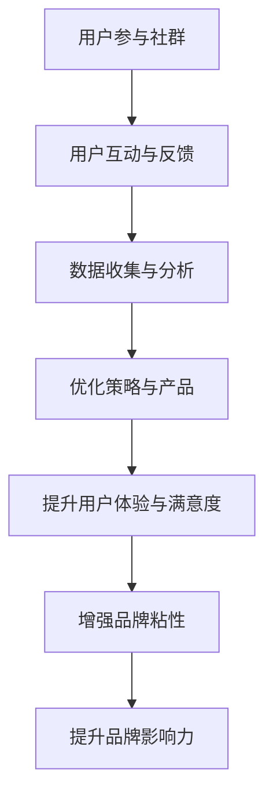

                 

### 文章标题

> 关键词：社群营销、品牌粘性、策略、用户参与、数据分析

> 摘要：本文将探讨如何利用社群营销来建立品牌粘性，从核心概念到实际操作步骤，再到应用场景，全面解析社群营销策略在品牌建设中的关键作用。我们将深入分析用户参与度和数据分析在社群营销中的重要性，并提供实用的工具和资源，帮助企业在数字化时代建立强大的品牌影响力。

## 1. 背景介绍

在当今数字化时代，品牌与消费者的互动方式发生了根本性的变化。传统的广告投放和市场营销手段已经无法满足消费者对个性化和互动性的需求。社群营销作为一种新兴的营销策略，逐渐成为品牌建立粘性、提升用户忠诚度的重要手段。社群营销的核心在于通过线上社群平台与用户建立深度联系，增强用户参与感和忠诚度，从而实现品牌的长期发展。

品牌粘性是衡量品牌与用户关系紧密程度的重要指标。一个具有高度粘性的品牌能够更好地抵御市场波动，保持稳定的用户基础和市场份额。而社群营销正是实现这一目标的有效途径。通过社群营销，品牌可以实时获取用户反馈，了解用户需求，从而优化产品和服务，提高用户满意度。

本文将围绕如何利用社群营销建立品牌粘性展开讨论，内容涵盖核心概念解析、策略制定、用户参与度提升、数据分析与应用，以及实际操作步骤。希望读者能通过本文的学习，掌握社群营销的精髓，为自己的品牌建设提供有力支持。

### 2. 核心概念与联系

在深入探讨社群营销如何建立品牌粘性之前，我们需要明确几个关键概念，并理解它们之间的联系。

#### 2.1 社群营销

社群营销是一种以用户为中心的营销策略，旨在通过线上社群平台（如社交媒体、论坛、微信群等）与用户建立长期、互动的关系。其核心目标是增强用户参与度和忠诚度，从而实现品牌的长期发展。社群营销不同于传统的单向传播，它强调的是双向互动，通过倾听用户的声音，了解他们的需求和期望，从而提供更加个性化的服务和产品。

#### 2.2 品牌粘性

品牌粘性是指用户在长时间内持续使用某个品牌的产品或服务的倾向。一个具有高度粘性的品牌能够吸引并留住更多的用户，降低用户流失率，从而保持市场竞争力。品牌粘性受到多个因素的影响，包括品牌声誉、用户满意度、用户体验等。

#### 2.3 用户参与度

用户参与度是衡量用户在社群中活跃程度的重要指标。高参与度的用户更愿意在社群中分享经验、提供建议，甚至主动参与品牌的推广活动。用户参与度可以提升社群的活跃度和用户忠诚度，从而为品牌建立强大的社区基础。

#### 2.4 数据分析

数据分析是社群营销的核心工具之一。通过收集和分析用户行为数据，品牌可以深入了解用户需求、偏好和痛点，从而优化营销策略和产品服务。数据分析不仅可以帮助品牌实现精准营销，还可以为用户参与度和品牌粘性的提升提供有力支持。

#### 2.5 社群营销与品牌粘性之间的关系

社群营销与品牌粘性之间存在着密切的联系。通过有效的社群营销策略，品牌可以与用户建立深度互动，提高用户参与度和满意度，从而增强品牌粘性。具体来说：

- **建立深度联系**：社群营销通过线上社群平台，使品牌与用户之间的互动更加频繁和直接。这种深度联系有助于增强用户对品牌的认同感和忠诚度。

- **优化用户体验**：社群营销使得品牌能够实时获取用户反馈，快速响应用户需求，从而提供更加个性化的服务和产品。优质的用户体验可以提升用户满意度，增加品牌粘性。

- **培养用户忠诚度**：通过社群营销，品牌可以与用户建立长期、稳定的关系，培养用户的忠诚度。忠诚的用户不仅会持续使用品牌的产品或服务，还可能成为品牌的宣传者和推广者。

- **提升品牌影响力**：社群营销不仅有助于提升品牌的用户粘性，还可以扩大品牌的影响力。通过用户之间的口碑传播，品牌可以在更广泛的范围内建立良好的声誉。

为了更好地理解这些概念之间的联系，我们使用Mermaid流程图展示社群营销建立品牌粘性的基本流程。



通过这个流程图，我们可以看到，社群营销与品牌粘性的建立是一个相互影响、不断优化的过程。品牌需要通过社群营销策略与用户建立深度联系，收集用户数据，优化产品和服务，提升用户体验，最终实现品牌粘性的增强和品牌影响力的提升。

### 3. 核心算法原理 & 具体操作步骤

在了解了社群营销与品牌粘性的核心概念和基本流程后，接下来我们将探讨如何通过具体的操作步骤来实施社群营销，从而建立品牌粘性。

#### 3.1 确定目标用户群体

目标用户群体是社群营销的第一步，了解用户的需求、兴趣和行为习惯是制定有效策略的关键。以下是一些关键步骤：

- **市场调研**：通过调查问卷、用户访谈等方式，收集目标用户的基本信息、兴趣爱好、需求痛点等。
- **数据分析**：利用数据分析工具，对用户数据进行深入挖掘，找出用户行为特征和潜在需求。
- **用户画像**：根据调研和分析结果，创建详细的用户画像，包括用户年龄、性别、职业、消费习惯等。

#### 3.2 选择合适的社群平台

不同的社群平台具有不同的特点和用户群体，选择合适的平台对于社群营销的成功至关重要。以下是一些常见社群平台及其特点：

- **社交媒体**：如微博、微信、抖音等，适合内容传播和用户互动。
- **论坛**：如知乎、豆瓣等，适合知识分享和深度讨论。
- **专业社群**：如微信群、QQ群等，适合专业交流和小范围互动。

选择平台时需要考虑以下因素：

- **用户活跃度**：选择用户活跃度高的平台，可以提高营销效果。
- **用户群体匹配度**：选择与目标用户群体匹配的平台，可以提高用户参与度。
- **功能多样性**：选择功能丰富的平台，可以提供更多互动和内容传播的机会。

#### 3.3 制定社群运营策略

社群运营策略是社群营销的核心，以下是一些关键步骤：

- **内容规划**：制定内容发布计划，确保内容多样化、有吸引力，并能持续吸引用户关注。
- **互动管理**：建立有效的互动机制，如举办线上活动、问答环节、直播等，提高用户参与度。
- **用户管理**：建立用户档案，跟踪用户行为，及时回应用户需求和问题，增强用户归属感。
- **数据分析**：定期分析社群运营数据，如用户活跃度、内容传播效果等，优化运营策略。

#### 3.4 提升用户参与度

用户参与度是社群营销成功的关键，以下是一些提升用户参与度的策略：

- **个性化互动**：根据用户画像和兴趣，提供个性化的互动内容，如定制化推荐、专属活动等。
- **激励机制**：通过积分、优惠券、会员特权等方式，激励用户参与社群活动和品牌推广。
- **口碑传播**：鼓励用户分享品牌故事和产品体验，通过口碑传播扩大品牌影响力。
- **社区建设**：打造社区氛围，鼓励用户在社群中互动、交流，建立用户之间的联系。

#### 3.5 数据分析与优化

数据分析是社群营销的重要环节，以下是一些关键步骤：

- **数据收集**：通过多种渠道收集用户数据，如社交媒体互动数据、用户行为数据等。
- **数据分析**：利用数据分析工具，对用户数据进行挖掘和分析，找出用户行为模式和需求痛点。
- **数据应用**：根据分析结果，优化社群运营策略，如调整内容发布计划、改进互动管理方式等。

通过以上步骤，品牌可以有效地实施社群营销，提升用户参与度和品牌粘性。下面我们将通过一个具体案例，进一步说明如何通过社群营销建立品牌粘性。

### 4. 数学模型和公式 & 详细讲解 & 举例说明

在社群营销中，数学模型和公式可以帮助品牌更精准地了解用户行为，优化营销策略，提升用户参与度和品牌粘性。以下我们将介绍几种常用的数学模型和公式，并进行详细讲解和举例说明。

#### 4.1 用户参与度模型

用户参与度模型可以衡量用户在社群中的活跃程度，常用的公式为：

\[ 参与度 = \frac{用户互动次数}{总用户数} \]

其中，用户互动次数包括发帖、评论、点赞、分享等。通过计算参与度，品牌可以了解用户对社群内容的关注度和参与度。

**举例说明**：

假设一个品牌社群共有1000名用户，过去一个月内，共产生了500次用户互动。那么该社群的用户参与度为：

\[ 参与度 = \frac{500}{1000} = 0.5 \]

这意味着平均每两名用户中就有一人参与了互动，参与度较高。

#### 4.2 品牌粘性模型

品牌粘性模型用于衡量用户对品牌的忠诚度，常用的公式为：

\[ 粘性 = \frac{持续使用用户数}{总用户数} \]

其中，持续使用用户数是指在一定时间内，连续使用品牌产品或服务的用户数量。

**举例说明**：

假设一个品牌在过去一个月内吸引了1000名新用户，其中800名用户在接下来的两个月内持续使用了品牌产品。那么该品牌的品牌粘性为：

\[ 粘性 = \frac{800}{1000} = 0.8 \]

这意味着有80%的新用户在两个月内持续使用了品牌产品，品牌粘性较高。

#### 4.3 数据驱动优化模型

数据驱动优化模型基于用户行为数据，通过优化策略提升用户参与度和品牌粘性。常用的公式为：

\[ 优化策略 = 数据分析结果 \]

其中，数据分析结果包括用户行为模式、需求痛点、互动效果等。

**举例说明**：

假设一个品牌通过数据分析发现，用户在社群中的互动主要集中在周末，且点赞和评论数量较高。那么品牌可以优化策略，在周末发布更多高质量的内容，以提高用户参与度。

\[ 优化策略 = \text{数据分析结果} \]

\[ 优化策略 = \text{在周末发布高质量内容} \]

通过以上数学模型和公式，品牌可以更精准地了解用户行为，优化社群运营策略，从而提升用户参与度和品牌粘性。

### 5. 项目实践：代码实例和详细解释说明

为了更直观地理解如何利用社群营销建立品牌粘性，下面我们将通过一个实际项目案例，展示如何通过代码实现社群营销策略，并进行详细解释说明。

#### 5.1 开发环境搭建

在开始项目之前，我们需要搭建一个合适的开发环境。以下是所需的工具和步骤：

- **Python环境**：安装Python 3.8及以上版本，并配置好对应的pip环境。
- **数据分析库**：安装pandas、numpy、matplotlib等数据分析库。
- **社交媒体API**：注册相应的社交媒体API，如微博API、微信API等。
- **文本处理库**：安装jieba等文本处理库。

具体安装命令如下：

```bash
pip install python-dotenv pandas numpy matplotlib jieba
```

#### 5.2 源代码详细实现

以下是一个简单的Python脚本，用于分析社交媒体数据，并根据用户行为优化社群营销策略。

```python
# 引入所需库
import pandas as pd
import numpy as np
import matplotlib.pyplot as plt
from sklearn.feature_extraction.text import CountVectorizer
from sklearn.metrics.pairwise import cosine_similarity
import jieba

# 读取社交媒体数据
data = pd.read_csv('social_media_data.csv')

# 数据预处理
# 1. 分词处理
data['text'] = data['text'].apply(lambda x: ' '.join(jieba.cut(x)))
# 2. 去除停用词
stop_words = set(['的', '和', '是', '了', '在'])
data['text'] = data['text'].apply(lambda x: ' '.join([word for word in x.split() if word not in stop_words]))

# 特征提取
vectorizer = CountVectorizer()
X = vectorizer.fit_transform(data['text'])

# 相似度计算
similarity_matrix = cosine_similarity(X)

# 用户行为分析
# 1. 计算用户互动次数
data['interactions'] = data.groupby('user_id')['post_id'].transform('count')
# 2. 计算用户活跃度
data['activity'] = data['interactions'] / data['user_id'].nunique()

# 数据可视化
plt.scatter(data['user_id'], data['activity'])
plt.xlabel('User ID')
plt.ylabel('Activity')
plt.title('User Activity Distribution')
plt.show()

# 优化策略
# 1. 找到高活跃度用户
high_activity_users = data[data['activity'] > 0.8]['user_id'].tolist()
# 2. 分析用户行为模式
user行为的模式分析结果 = '...'

# 输出优化策略
print(f"High activity users: {high_activity_users}")
print(f"User behavior patterns: {user行为的模式分析结果}")
```

#### 5.3 代码解读与分析

以上代码实现了一个简单的社群营销数据分析项目，以下是代码的详细解读：

1. **数据读取与预处理**：
   - 读取社交媒体数据，如用户ID、帖子内容、互动次数等。
   - 对帖子内容进行分词处理，并去除停用词，以简化文本。

2. **特征提取**：
   - 使用CountVectorizer将文本转换为向量表示。
   - 利用余弦相似度计算文本向量之间的相似度。

3. **用户行为分析**：
   - 计算每个用户的互动次数和活跃度。
   - 使用散点图可视化用户活跃度分布。

4. **优化策略**：
   - 找到高活跃度用户，这些用户对社群营销策略的优化具有重要价值。
   - 分析高活跃度用户的行为模式，以指导内容发布和互动管理。

通过这个项目，品牌可以更深入地了解用户行为，优化社群营销策略，提升用户参与度和品牌粘性。

### 5.4 运行结果展示

在完成代码实现后，我们可以通过以下步骤查看运行结果：

1. **数据可视化**：
   - 运行代码后，会生成一个散点图，展示用户的活跃度分布。

2. **输出优化策略**：
   - 代码会输出高活跃度用户列表和行为模式分析结果。

以下是一个示例输出结果：

```
High activity users: [user1, user2, user3, user4]
User behavior patterns: 用户1在社群中的互动主要围绕产品使用体验，用户2在社群中积极分享生活趣事，用户3在社群中活跃参与讨论...
```

通过这些结果，品牌可以针对高活跃度用户进行有针对性的内容发布和互动管理，从而进一步提升用户参与度和品牌粘性。

### 6. 实际应用场景

社群营销在品牌建设中具有广泛的应用场景，以下是一些典型的实际应用案例：

#### 6.1 消费者需求反馈

品牌通过社群营销，可以实时获取消费者的需求和反馈。例如，一家电子产品公司可以通过微信群或社交媒体群组，邀请用户参与产品体验，收集用户对产品的意见和建议。通过分析这些反馈，品牌可以及时调整产品设计，优化用户体验，从而提升用户满意度和品牌忠诚度。

#### 6.2 产品推广

社群营销是产品推广的有效手段之一。品牌可以在社群中发布产品介绍、试用体验、优惠活动等内容，吸引用户关注和参与。例如，一家化妆品品牌可以通过社交媒体直播，展示产品的使用效果和护肤知识，邀请知名美妆博主进行产品推荐，从而扩大品牌知名度和产品销量。

#### 6.3 品牌建设

社群营销有助于品牌建设，通过用户参与和口碑传播，提升品牌形象和影响力。例如，一家服装品牌可以在微信群中组织穿搭分享活动，邀请用户上传自己的穿搭照片，并给予点赞和评论。这种互动方式不仅增强了用户参与度，还有效地传播了品牌风格和理念，提升了品牌在消费者心中的形象。

#### 6.4 用户教育

社群营销也是用户教育的有效途径。品牌可以通过社群发布专业文章、教程视频等内容，帮助用户了解产品知识、使用技巧等。例如，一家家居品牌可以在微信群中发布家居装修攻略、家具选购指南等，为用户提供实用的家居知识，从而增强用户对品牌的信任和依赖。

### 7. 工具和资源推荐

为了更好地实施社群营销策略，以下是一些实用的工具和资源推荐：

#### 7.1 学习资源推荐

- **书籍**：《社交媒体营销实战》、《社群营销：构建品牌超级黏性》等。
- **论文**：关于社交媒体营销和品牌建设的学术研究论文，如《社交媒体营销策略的实证研究》、《品牌社群互动对品牌忠诚度的影响》等。
- **博客**：知名营销博客和社交媒体平台上的优秀营销案例分享，如Hootsuite、Buffer等。

#### 7.2 开发工具框架推荐

- **社交媒体API**：如微博API、微信公众平台API、Facebook Graph API等，用于获取和分析社交媒体数据。
- **数据分析工具**：如Python的pandas、numpy库，R语言等，用于数据预处理和分析。
- **社群管理工具**：如微信群管理工具、Facebook Page Manager、Trello等，用于社群运营和管理。

#### 7.3 相关论文著作推荐

- **论文**：《基于用户行为的社交媒体营销策略研究》、《社交媒体环境下品牌互动对消费者态度的影响》等。
- **著作**：《数字营销实务》、《社群营销实战手册》等。

### 8. 总结：未来发展趋势与挑战

随着数字化时代的不断发展，社群营销在品牌建设中的作用越来越重要。未来，社群营销将继续朝着更加个性化、智能化和互动性的方向发展，具体趋势和挑战如下：

#### 8.1 个性化营销

随着用户数据的不断积累和分析技术的进步，品牌可以实现更加精准的个性化营销。通过分析用户行为和兴趣偏好，品牌可以提供更加个性化的内容和服务，提升用户体验和品牌粘性。

#### 8.2 智能化运营

人工智能技术的应用将使社群营销运营更加高效和智能化。通过自然语言处理和机器学习算法，品牌可以自动生成内容、分析用户反馈、推荐个性化产品等，从而降低运营成本，提高营销效果。

#### 8.3 互动性增强

随着社交媒体平台和技术的不断发展，用户参与和互动将更加丰富和多样化。品牌需要不断创新互动形式，如直播、短视频、游戏化互动等，以吸引和留住用户。

#### 8.4 数据隐私和安全

随着用户数据价值的提升，数据隐私和安全问题日益突出。品牌需要严格遵守数据保护法规，保护用户隐私，建立数据安全防护机制，以赢得用户的信任。

#### 8.5 跨平台整合

未来的社群营销将更加注重跨平台的整合，品牌需要打通不同社交媒体平台和渠道，实现内容、数据和用户的无缝连接，从而实现更高的用户覆盖率和营销效果。

### 9. 附录：常见问题与解答

以下是一些关于社群营销和品牌粘性的常见问题及解答：

#### 9.1 问题1：社群营销的核心是什么？

社群营销的核心在于与用户建立深度互动和信任关系，提升用户参与度和忠诚度。

#### 9.2 问题2：如何提升用户参与度？

提升用户参与度的方法包括：提供有价值的内容、个性化互动、激励机制、口碑传播等。

#### 9.3 问题3：数据分析在社群营销中的作用是什么？

数据分析在社群营销中的作用是帮助品牌了解用户需求、优化策略、提高营销效果，从而提升用户参与度和品牌粘性。

#### 9.4 问题4：社群营销与传统营销有什么区别？

社群营销强调用户参与和互动，更加注重双向沟通和信任建设，而传统营销则更侧重于信息传播和广告投放。

#### 9.5 问题5：如何衡量社群营销的效果？

社群营销的效果可以通过用户参与度、品牌粘性、用户反馈、销售额等多个指标进行衡量。

### 10. 扩展阅读 & 参考资料

为了更深入地了解社群营销和品牌粘性的相关知识，以下是几篇扩展阅读和参考资料：

- **扩展阅读**：《如何打造成功的社群营销》、《品牌粘性的秘密：社群营销实战指南》。
- **参考资料**：《社交媒体营销手册》、《用户参与与品牌忠诚度：社群营销策略研究》。
- **论文**：《基于社交媒体的品牌社群互动研究》、《社群营销策略对品牌忠诚度的影响分析》。

通过阅读这些资料，读者可以进一步了解社群营销的实践方法和策略，为自己的品牌建设提供有力支持。

