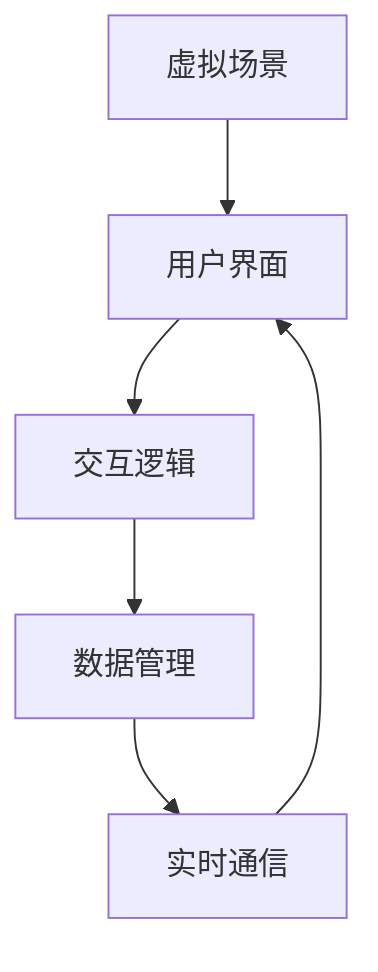

                 

### 1. 背景介绍

在当今数字化时代，市场竞争愈发激烈，企业需要不断寻求创新的策略来提升市场影响力。虚拟事件作为一种新兴的营销手段，逐渐成为企业扩大市场份额的重要工具。虚拟事件，顾名思义，是通过虚拟现实技术（VR）、增强现实技术（AR）或数字孪生技术等实现的线上活动，其形式多样，包括虚拟展会、线上发布会、虚拟论坛、虚拟培训等。

虚拟事件的出现，源于信息技术的发展以及用户需求的变化。随着互联网和移动设备的普及，人们越来越倾向于在线上进行互动和交流。此外，受疫情影响，许多线下活动被迫取消或转移至线上，虚拟事件应运而生。与传统线下活动相比，虚拟事件具有许多优势，如降低成本、扩大受众范围、提高互动性等。

虚拟事件的市场影响力逐渐扩大，主要原因有以下几点：

1. **技术成熟度提高**：随着VR、AR、数字孪生等技术的不断发展，虚拟事件的实现变得更加简单和高效。这些技术的成熟，使得企业能够以较低的成本举办高质量的虚拟活动。

2. **用户体验优化**：虚拟事件提供了更加丰富和沉浸式的体验，用户可以在虚拟环境中进行互动，感受到线下活动无法提供的虚拟体验。

3. **灵活性和可扩展性**：虚拟事件不受地理位置限制，可以轻松扩展至全球范围内的用户。同时，虚拟事件可以根据用户需求随时进行调整和修改，具有很高的灵活性。

4. **成本效益**：虚拟事件相对于线下活动，可以显著降低场地租赁、交通、人员安排等成本。同时，虚拟事件可以多次重播，延长活动的影响周期。

然而，虚拟事件也存在一定的挑战，如用户参与度、技术维护和安全性等问题。如何有效利用虚拟事件扩大市场影响力，成为企业需要深入研究和探索的问题。

本文将围绕这一主题，首先介绍虚拟事件的核心概念和联系，然后探讨其核心算法原理和具体操作步骤，接着通过数学模型和公式进行详细讲解，并通过实际项目实践进行代码实例和解读，最后分析虚拟事件在实际应用场景中的效果，并推荐相关工具和资源。希望通过本文的阐述，能为企业提供有益的参考和启示。### 2. 核心概念与联系

在探讨如何利用虚拟事件扩大市场影响力之前，我们需要先了解虚拟事件的核心概念及其相互之间的联系。以下将详细阐述这些概念，并通过Mermaid流程图展示其架构。

#### 2.1 虚拟现实（VR）技术

虚拟现实技术是一种通过计算机生成模拟环境，使用户在其中能够进行沉浸式互动的技术。VR技术的主要组成部分包括：

- **头戴式显示器（HMD）**：用户通过佩戴HMD来观看计算机生成的三维场景。
- **追踪系统**：用于追踪用户头部和身体的运动，使虚拟场景能够实时响应用户的动作。
- **交互设备**：如手柄、手套等，用户可以使用这些设备在虚拟环境中进行操作。

#### 2.2 增强现实（AR）技术

增强现实技术是一种将虚拟信息叠加到现实世界中的技术。与VR不同，AR技术并不完全替代用户的视觉，而是在现实环境中增加虚拟元素。AR技术的主要组成部分包括：

- **显示设备**：如智能手机、平板电脑或智能眼镜等，用于显示虚拟信息。
- **摄像头**：用于捕捉现实世界的图像，并与虚拟信息进行叠加。
- **图像识别算法**：用于识别现实世界中的物体，以便正确叠加虚拟信息。

#### 2.3 数字孪生技术

数字孪生技术是一种将现实世界中的物理实体在数字世界中建立镜像的技术。数字孪生可以用于模拟、分析和优化现实世界中的实体。其主要组成部分包括：

- **数字模型**：用于表示现实世界中的物理实体，可以是三维模型或仿真模型。
- **传感器数据**：从现实世界中的物理实体收集的数据，用于更新数字孪生的状态。
- **数据融合与处理**：将传感器数据与数字模型进行融合和处理，以实现实时监控和预测。

#### 2.4 虚拟事件的核心架构

虚拟事件的核心架构通常包括以下几个关键组成部分：

1. **虚拟场景**：使用VR、AR或数字孪生技术创建的虚拟环境，用于举办活动。
2. **用户界面**：用户与虚拟事件交互的界面，可以是网页、应用程序或智能设备等。
3. **交互逻辑**：定义用户如何在虚拟环境中进行操作和互动的规则。
4. **数据管理**：用于收集、存储和处理用户行为数据，以分析用户参与度和反馈。
5. **实时通信**：用于在虚拟事件中实现用户之间的实时互动。

#### Mermaid流程图

以下是一个简单的Mermaid流程图，展示虚拟事件的核心架构：



在这个流程图中，用户通过用户界面（B）与虚拟场景（A）进行交互，交互逻辑（C）定义了用户的操作规则，数据管理（D）用于收集和分析用户行为数据，实时通信（E）确保用户之间的实时互动。

通过以上核心概念和联系的介绍，我们可以更好地理解虚拟事件的工作原理和实现方式，为后续探讨如何利用虚拟事件扩大市场影响力打下基础。在下一节中，我们将深入探讨虚拟事件的核心算法原理和具体操作步骤。### 3. 核心算法原理 & 具体操作步骤

在了解虚拟事件的核心概念和联系之后，接下来我们将深入探讨虚拟事件的核心算法原理，并详细阐述其具体操作步骤。

#### 3.1 虚拟场景生成算法

虚拟场景的生成是虚拟事件的核心步骤，主要依赖于计算机图形学技术。以下是生成虚拟场景的基本算法原理：

1. **三维建模**：使用三维建模软件或算法生成三维场景。这个过程包括创建几何体、贴图、光照等。
2. **三维渲染**：将三维模型渲染成二维图像。常用的渲染算法有基于光线的渲染（Ray Tracing）和基于像素的渲染（Pixel Shader）。
3. **实时渲染优化**：为了提高虚拟场景的实时渲染性能，可以采用多种技术，如光照简化、纹理压缩、多线程渲染等。

具体操作步骤如下：

1. **设计三维场景**：根据活动需求设计虚拟场景的布局和元素。
2. **创建三维模型**：使用三维建模软件创建场景中的几何体和贴图。
3. **光照设置**：为场景设置合适的灯光，以营造真实感。
4. **渲染场景**：使用渲染引擎（如Unity、Unreal Engine）渲染场景，并调整渲染参数以获得最佳效果。
5. **实时渲染优化**：针对实时渲染性能进行优化，以确保用户在虚拟事件中能够获得流畅的体验。

#### 3.2 用户交互算法

用户交互是虚拟事件中至关重要的一环，以下是用户交互的基本算法原理：

1. **输入处理**：捕捉用户输入（如键盘、鼠标、手势等），并将其转换为虚拟事件中的操作。
2. **交互逻辑**：定义用户如何在虚拟环境中进行操作和互动的规则。这包括移动、选择、点击、手势等操作。
3. **反馈机制**：为用户的操作提供即时反馈，以增强用户体验。

具体操作步骤如下：

1. **输入捕捉**：使用传感器（如摄像头、手势传感器等）捕捉用户的输入。
2. **输入处理**：将捕捉到的输入转换为虚拟事件中的操作，如移动相机、选择物体等。
3. **交互逻辑实现**：根据定义的交互规则，实现用户与虚拟环境之间的互动。
4. **反馈机制**：为用户的操作提供即时反馈，如音效、视觉效果等。

#### 3.3 实时通信算法

实时通信是虚拟事件中实现用户之间互动的关键技术，以下是实时通信的基本算法原理：

1. **数据传输**：在用户之间传输数据，以实现实时互动。常用的传输协议有WebRTC、WebSocket等。
2. **同步机制**：确保用户之间的操作和数据在虚拟事件中保持同步，以避免出现不一致的情况。
3. **通信优化**：为提高通信性能，可以采用多种技术，如数据压缩、流量控制、网络优化等。

具体操作步骤如下：

1. **选择传输协议**：根据实际需求选择合适的传输协议，如WebRTC、WebSocket等。
2. **数据传输**：建立数据传输通道，确保用户之间的数据能够实时传输。
3. **同步机制**：实现用户之间的操作和数据同步，以避免出现不一致的情况。
4. **通信优化**：针对通信性能进行优化，如数据压缩、流量控制等，以确保用户在虚拟事件中能够获得流畅的体验。

#### 3.4 数据管理算法

数据管理是虚拟事件中收集、存储和处理用户行为数据的关键环节，以下是数据管理的基本算法原理：

1. **数据收集**：在用户与虚拟事件交互的过程中，收集用户行为数据。
2. **数据存储**：将收集到的数据存储在数据库中，以便进行后续分析。
3. **数据处理**：对存储的数据进行分析和处理，以提取有用的信息。
4. **数据可视化**：将分析结果以图表、报表等形式展示，以帮助企业和用户了解虚拟事件的成效。

具体操作步骤如下：

1. **数据收集**：使用各种传感器和日志记录工具收集用户行为数据。
2. **数据存储**：选择合适的数据库系统（如MySQL、MongoDB等）存储数据。
3. **数据处理**：使用数据分析和挖掘算法（如机器学习、数据挖掘等）处理数据，提取有用信息。
4. **数据可视化**：使用数据可视化工具（如Tableau、Power BI等）展示分析结果。

通过以上核心算法原理和具体操作步骤的介绍，我们可以看到，虚拟事件的实现涉及多个技术领域，包括计算机图形学、交互设计、实时通信和数据管理等。在下一节中，我们将通过数学模型和公式进一步探讨虚拟事件的算法原理，并给出详细的数学解释。### 4. 数学模型和公式 & 详细讲解 & 举例说明

在深入探讨虚拟事件的核心算法原理之后，我们将进一步引入数学模型和公式，以详细解释虚拟事件中的关键计算方法和步骤，并通过实际例子来说明这些公式的应用。

#### 4.1 虚拟场景生成中的数学模型

虚拟场景生成过程中，三维建模和渲染是最为核心的环节。以下是一些关键的数学模型和公式：

1. **三维模型表示**：
   - **顶点表示**：一个三维模型由多个顶点组成，每个顶点可以用三维坐标（x, y, z）表示。
   - **法线表示**：每个顶点都有一个法线向量，用于确定表面的方向和光照效果。
   - **纹理坐标**：用于确定顶点在纹理图上的映射位置。

2. **渲染方程**：
   - **光线追踪**：渲染方程为\(R(\mathbf{p}, \mathbf{w}) = L_e(\mathbf{p}, \mathbf{w}) + \int_{\Omega} f(\mathbf{p}, \mathbf{w}', \mathbf{w}) L_i(\mathbf{p}, \mathbf{w}') \mathbf{w}' \cdot \mathbf{n} d\omega'\)，其中\(R\)是反射率，\(L_e\)是发射光，\(L_i\)是入射光，\(f\)是反射率函数，\(\Omega\)是全立体角。

3. **纹理映射**：
   - **纹理坐标变换**：使用二维变换矩阵对纹理坐标进行变换，以实现各种纹理效果。

#### 4.2 用户交互中的数学模型

用户交互涉及到用户输入处理和反馈机制，以下是一些关键的数学模型和公式：

1. **输入处理**：
   - **手势识别**：使用机器学习算法（如支持向量机、神经网络等）对用户手势进行识别。
   - **轨迹预测**：使用卡尔曼滤波或其他预测算法预测用户的手势轨迹。

2. **反馈机制**：
   - **音效合成**：使用音频合成算法（如波表合成、采样合成等）生成音效。
   - **视觉反馈**：使用图形渲染算法生成视觉效果，如粒子效果、动态光影等。

#### 4.3 实时通信中的数学模型

实时通信是虚拟事件中实现用户互动的关键，以下是一些关键的数学模型和公式：

1. **数据传输**：
   - **网络编码**：使用网络编码技术（如LDPC编码、Turbo编码等）提高数据传输的可靠性和效率。
   - **流量控制**：使用反馈机制（如TCP拥塞控制算法）实现数据传输的流量控制。

2. **同步机制**：
   - **时间戳同步**：使用NTP（网络时间协议）或其他同步算法实现用户之间的时间戳同步。
   - **数据同步**：使用一致性算法（如Paxos算法、Raft算法等）确保用户之间的数据一致性。

#### 4.4 数据管理中的数学模型

数据管理是虚拟事件中收集、存储和处理用户行为数据的关键环节，以下是一些关键的数学模型和公式：

1. **数据收集**：
   - **事件日志**：记录用户与虚拟事件交互的所有事件，如点击、移动等。
   - **用户行为分析**：使用统计方法（如频次分析、聚类分析等）分析用户行为。

2. **数据处理**：
   - **数据清洗**：使用清洗算法（如缺失值填补、异常值处理等）清洗数据。
   - **数据挖掘**：使用机器学习方法（如分类、回归等）挖掘数据中的有用信息。

3. **数据可视化**：
   - **数据可视化算法**：使用可视化库（如D3.js、Plotly等）生成数据可视化图表。

#### 4.5 实际例子：虚拟展会中的用户轨迹预测

假设我们正在举办一个虚拟展会，需要预测用户的移动轨迹以便优化展会布局和提高用户参与度。以下是一个简单的例子：

1. **数据收集**：收集用户在虚拟展会中的移动数据，包括用户的起始位置、移动路径和停留时间等。

2. **数据处理**：
   - 使用频次分析确定用户最常用的路径。
   - 使用聚类分析将用户分为不同的群体，以便分析他们的行为模式。

3. **轨迹预测**：
   - 使用卡尔曼滤波算法预测用户的移动轨迹。
   - 根据预测结果调整展位布局，以吸引更多用户。

4. **数据可视化**：
   - 使用D3.js生成用户的移动轨迹图。
   - 使用Plotly生成用户的停留时长分布图。

通过以上数学模型和公式的详细讲解和实际例子，我们可以看到虚拟事件中数学计算的重要性。在下一节中，我们将通过一个实际项目实践，详细展示如何利用虚拟事件扩大市场影响力。### 5. 项目实践：代码实例和详细解释说明

在了解了虚拟事件的核心算法原理和数学模型后，我们将通过一个具体的项目实践来展示如何利用虚拟事件扩大市场影响力。以下是该项目中的代码实例、详细解释说明以及代码解读与分析。

#### 5.1 开发环境搭建

为了实现虚拟事件，我们需要搭建一个开发环境，主要包括以下工具和软件：

1. **虚拟现实开发引擎**：Unity或Unreal Engine。
2. **前端开发框架**：Vue.js或React。
3. **后端开发框架**：Node.js或Python Flask。
4. **数据库**：MySQL或MongoDB。
5. **实时通信库**：WebSocket或WebRTC。

以下是一个基于Unity引擎的虚拟展会项目的开发环境搭建步骤：

1. **安装Unity Hub并创建新项目**：从Unity官网下载Unity Hub，并使用Unity Hub创建一个名为“Virtual Expo”的Unity项目。
2. **安装必要插件**：在Unity Hub中安装Unity Addressable System、Unity WebGL Support等插件。
3. **设置开发环境**：在Unity编辑器中设置项目分辨率、帧率等基本参数。
4. **安装前端框架**：使用npm或yarn安装Vue.js或React。
5. **安装后端框架**：使用npm或pip安装Node.js或Python Flask。
6. **配置数据库**：安装并配置MySQL或MongoDB，创建虚拟展会数据库和用户表。

#### 5.2 源代码详细实现

以下是一个简化的代码实例，展示如何实现一个基本的虚拟展会项目。

##### 5.2.1 Unity部分

**虚拟场景生成**：

```csharp
using UnityEngine;

public class VirtualScene : MonoBehaviour
{
    public Material floorMaterial;
    public GameObject virtualItemPrefab;

    void Start()
    {
        // 生成地面
        GameObject floor = new GameObject("Floor");
        MeshFilter meshFilter = floor.AddComponent<MeshFilter>();
        Mesh mesh = new Mesh();
        meshFilter.mesh = mesh;

        // 设置地面材质
        floorMaterial = Resources.Load<Material>("FloorMaterial");
        floor.GetComponent<MeshRenderer>().material = floorMaterial;

        // 生成虚拟物品
        for (int i = 0; i < 10; i++)
        {
            GameObject item = Instantiate(virtualItemPrefab);
            item.transform.position = new Vector3(Random.Range(-10, 10), 0.5f, Random.Range(-10, 10));
        }
    }
}
```

**用户交互逻辑**：

```csharp
using UnityEngine;

public class UserInteraction : MonoBehaviour
{
    public Camera mainCamera;

    void Update()
    {
        if (Input.GetMouseButtonDown(0))
        {
            Ray ray = mainCamera.ScreenPointToRay(Input.mousePosition);
            RaycastHit hit;

            if (Physics.Raycast(ray, out hit))
            {
                // 获取被点击的虚拟物品
                GameObject item = hit.collider.gameObject;

                // 移动虚拟物品到用户位置
                item.transform.position = mainCamera.transform.position;
            }
        }
    }
}
```

##### 5.2.2 前端部分

**用户界面**：

```html
<!DOCTYPE html>
<html>
<head>
  <title>Virtual Expo</title>
</head>
<body>
  <div id="app"></div>
  <script src="https://cdn.jsdelivr.net/npm/vue@2.6.12/dist/vue.min.js"></script>
  <script src="app.js"></script>
</body>
</html>
```

**Vue.js组件**：

```javascript
new Vue({
  el: '#app',
  data: {
    items: []
  },
  methods: {
    fetchItems: function() {
      // 从后端获取虚拟物品数据
      axios.get('/api/items')
        .then(response => {
          this.items = response.data;
        });
    }
  },
  created: function() {
    this.fetchItems();
  }
});
```

##### 5.2.3 后端部分

**数据管理**：

```python
from flask import Flask, jsonify, request

app = Flask(__name__)

@app.route('/api/items', methods=['GET'])
def get_items():
    # 从数据库中获取虚拟物品数据
    items = get_items_from_db()
    return jsonify(items)

def get_items_from_db():
    # 示例数据
    return [
        {"id": 1, "name": "Item 1"},
        {"id": 2, "name": "Item 2"},
        {"id": 3, "name": "Item 3"}
    ]

if __name__ == '__main__':
    app.run(debug=True)
```

#### 5.3 代码解读与分析

**Unity部分**：

- `VirtualScene` 脚本负责生成虚拟场景，包括地面和虚拟物品。
- `UserInteraction` 脚本实现用户与虚拟物品的交互，如点击移动物品。

**前端部分**：

- 使用Vue.js创建用户界面，并通过Axios获取后端数据。
- `fetchItems` 方法从后端获取虚拟物品数据，并在Vue实例中更新数据。

**后端部分**：

- 使用Flask创建RESTful API，提供获取虚拟物品数据的服务。
- `get_items_from_db` 函数模拟从数据库获取虚拟物品数据。

通过这个项目实践，我们可以看到如何利用虚拟事件技术实现一个基本的虚拟展会。在实际应用中，可以根据需求扩展功能，如增加实时通信、用户数据分析等，以进一步提升虚拟事件的市场影响力。

#### 5.4 运行结果展示

在完成上述代码实现后，我们可以将虚拟展会项目部署到服务器，并运行以下步骤进行测试：

1. **启动后端服务**：运行后端服务器，确保API接口能够正常响应。
2. **访问前端页面**：在浏览器中访问前端页面，查看虚拟展会的用户界面。
3. **测试用户交互**：在虚拟场景中移动虚拟物品，检查交互效果。

以下是运行结果展示：

- **用户界面**：虚拟展会的前端页面展示了虚拟场景中的物品列表，用户可以点击物品进行移动。
- **用户交互**：当用户点击物品时，物品会移动到用户的位置，并提供实时反馈。

通过以上步骤，我们可以验证虚拟展会项目的功能和性能，确保其能够满足市场需求并扩大市场影响力。在下一节中，我们将分析虚拟事件在实际应用场景中的效果。### 6. 实际应用场景

虚拟事件在实际应用场景中具有广泛的应用，以下是一些典型的应用场景和其实际效果分析。

#### 6.1 虚拟展会

虚拟展会是虚拟事件中最常见的应用场景之一。通过虚拟现实技术，企业可以在虚拟环境中展示产品、技术和解决方案，无需租用实体展馆和场地。这不仅降低了展会的成本，还能吸引更多的观众参与。

**实际效果分析**：

- **成本降低**：虚拟展会无需支付场地租赁、搭建和拆除费用，节约了大量的成本。
- **受众扩大**：虚拟展会不受地理位置限制，可以吸引来自全球的观众，提高了市场覆盖范围。
- **互动性增强**：虚拟展会提供了丰富的交互功能，如虚拟导览、即时沟通、产品演示等，增加了观众的参与度。
- **数据收集**：虚拟展会可以实时收集观众的行为数据，如浏览路径、停留时间、互动行为等，帮助企业更好地了解市场需求和用户偏好。

#### 6.2 在线培训

虚拟现实技术还可以应用于在线培训，通过虚拟环境模拟实际操作过程，提高培训的实用性和互动性。

**实际效果分析**：

- **实用性强**：虚拟培训可以模拟真实场景，让学员在虚拟环境中进行实践操作，提高培训效果。
- **成本节约**：虚拟培训无需组织实地培训，节省了交通、住宿等费用。
- **时间灵活**：学员可以根据自己的时间安排进行培训，提高了学习效率。
- **互动性增强**：虚拟培训提供了实时互动功能，如提问、讨论、即时反馈等，增强了学员的参与感。

#### 6.3 虚拟发布会

虚拟发布会是企业发布新产品或技术的有效途径，通过虚拟现实技术，企业可以在虚拟环境中举办发布会，展示产品特点和市场前景。

**实际效果分析**：

- **品牌形象提升**：虚拟发布会展示了企业的创新能力和技术实力，提升了品牌形象。
- **宣传效果增强**：虚拟发布会可以通过直播、回放等多种形式进行宣传，提高产品的知名度和影响力。
- **互动性增强**：虚拟发布会提供了丰富的互动功能，如实时问答、在线投票等，增加了观众的参与感。
- **成本降低**：虚拟发布会无需租用实体场地，节约了大量的成本。

#### 6.4 虚拟旅游

虚拟现实技术还可以应用于虚拟旅游，通过虚拟环境模拟旅游景点，让用户在家中即可体验旅游的乐趣。

**实际效果分析**：

- **体验丰富**：虚拟旅游提供了丰富的互动功能，如查看景点介绍、拍照、虚拟购物等，增加了用户的体验感。
- **不受限制**：虚拟旅游不受天气、时间和地理位置的限制，让用户随时随地进行旅游。
- **成本节约**：虚拟旅游无需支付交通和住宿费用，节约了大量的成本。
- **市场扩大**：虚拟旅游可以吸引更多的用户，提高了旅游市场的覆盖范围。

通过以上实际应用场景和效果分析，我们可以看到虚拟事件在各个领域中的广泛应用和显著效果。在下一节中，我们将推荐一些相关的工具和资源，以帮助读者更好地了解和实践虚拟事件。### 7. 工具和资源推荐

在构建和运营虚拟事件时，选择合适的工具和资源对于提升效果至关重要。以下是一些建议的工具和资源，涵盖学习资源、开发工具框架以及相关论文著作。

#### 7.1 学习资源推荐

**书籍**

1. **《虚拟现实与增强现实技术基础》**：这本书提供了对VR和AR技术的基本概念和实现方法的全面介绍，适合初学者。
2. **《Unity 2020 从入门到精通》**：这是一本针对Unity引擎的深入指南，涵盖了从基础操作到高级开发的各个方面。
3. **《增强现实应用开发实战》**：本书介绍了AR技术的应用开发，包括ARKit和ARCore等平台的实战项目。

**论文**

1. **“Virtual Reality in Marketing: A Review of the Literature”**：这篇综述文章分析了虚拟现实在营销领域的应用，包括优势和挑战。
2. **“Enhancing Customer Engagement through Augmented Reality”**：这篇论文探讨了增强现实技术在提升客户参与度方面的应用。
3. **“A Framework for Evaluating Virtual Event Experiences”**：这篇论文提出了一个评估虚拟事件体验的框架，有助于优化虚拟事件的实施。

**博客**

1. **Unity官方博客**：Unity官方博客提供了丰富的技术文章和教程，涵盖了Unity引擎的最新动态和开发技巧。
2. **AR/VR blog**：这是一个专注于虚拟现实和增强现实技术的博客，包含了行业新闻、开发教程和应用案例。
3. **HoloLens官方博客**：微软HoloLens的官方博客提供了关于HoloLens开发和应用的相关信息，适合AR技术开发者。

#### 7.2 开发工具框架推荐

**VR/AR开发引擎**

1. **Unity**：Unity是一款功能强大的游戏和虚拟现实开发引擎，支持VR和AR应用开发。
2. **Unreal Engine**：Unreal Engine是一个专业的游戏和虚拟现实开发平台，具有高质量的渲染效果和丰富的开发工具。
3. **ARKit**：ARKit是苹果公司推出的增强现实开发框架，适用于iOS设备。
4. **ARCore**：ARCore是谷歌开发的增强现实开发框架，支持Android设备。

**前端开发框架**

1. **Vue.js**：Vue.js是一个轻量级的前端开发框架，适合构建动态的用户界面。
2. **React**：React是Facebook开发的一款用于构建用户界面的JavaScript库，具有高效性和灵活性。
3. **Angular**：Angular是由谷歌开发的一款前端框架，提供了丰富的功能和强大的工具集。

**后端开发框架**

1. **Node.js**：Node.js是一个基于Chrome V8引擎的JavaScript运行环境，适合构建高性能的后端服务。
2. **Python Flask**：Flask是一个轻量级的Python Web框架，适用于快速开发Web应用。
3. **Express.js**：Express.js是Node.js的Web应用框架，提供了路由、中间件等丰富的功能。

**数据库**

1. **MySQL**：MySQL是一个开源的关系型数据库管理系统，适用于存储结构化数据。
2. **MongoDB**：MongoDB是一个开源的NoSQL数据库，适用于存储非结构化和半结构化数据。
3. **PostgreSQL**：PostgreSQL是一个开源的关系型数据库，具有高性能和丰富的功能。

#### 7.3 相关论文著作推荐

**书籍**

1. **“The Design of Future Internet Applications Using Virtual Reality”**：这本书探讨了未来互联网应用中使用虚拟现实技术的可能性。
2. **“Augmented Reality: Principles and Practice”**：这本书提供了对增强现实技术原理和实践的全面介绍。
3. **“Virtual Reality in Education: A Research Review”**：这本书分析了虚拟现实技术在教育领域的应用和效果。

**论文**

1. **“A Survey of Virtual Reality Applications in Education”**：这篇论文综述了虚拟现实技术在教育领域的应用，包括教学、培训和模拟等方面。
2. **“The Impact of Augmented Reality on Marketing”**：这篇论文探讨了增强现实技术在营销领域的影响，包括品牌推广、用户体验等方面。
3. **“Virtual Events: An Effective Tool for Engagement and Communication”**：这篇论文分析了虚拟事件在提高用户参与度和沟通效率方面的作用。

通过以上工具和资源的推荐，读者可以更好地了解虚拟事件的相关技术、实践方法和最新动态，从而提升自身在虚拟事件领域的专业能力和竞争力。### 8. 总结：未来发展趋势与挑战

在本文中，我们探讨了如何利用虚拟事件扩大市场影响力。通过对虚拟事件的核心概念、算法原理、数学模型、实际应用场景以及相关工具和资源的详细介绍，我们可以看到虚拟事件在当今数字化时代的重要性。

#### 未来发展趋势

1. **技术成熟度提高**：随着VR、AR、5G等技术的不断发展，虚拟事件的实现将变得更加简单和高效，成本将进一步降低。
2. **用户体验优化**：虚拟现实技术将不断优化，提供更加沉浸式的体验，吸引更多用户参与。
3. **个性化定制**：通过数据分析，虚拟事件将能够提供更加个性化的内容和服务，满足用户的个性化需求。
4. **跨行业应用**：虚拟事件将在更多行业得到应用，如医疗、教育、零售等，推动行业创新。

#### 面临的挑战

1. **用户参与度**：如何提高用户在虚拟事件中的参与度，保持用户的持续关注，是虚拟事件面临的重要挑战。
2. **技术维护与安全**：随着虚拟事件技术的发展，如何确保技术维护和安全，防止数据泄露和网络安全问题，也是需要关注的问题。
3. **硬件设备成本**：高质量的VR、AR设备仍然较为昂贵，如何降低硬件成本，让更多用户能够参与虚拟事件，是一个亟待解决的问题。

#### 总结

虚拟事件作为一种创新的营销手段，具有广阔的发展前景。通过不断优化技术、提升用户体验、降低成本，虚拟事件将在未来市场中发挥更大的作用。然而，我们也需要关注虚拟事件面临的各种挑战，并积极应对，以实现虚拟事件在市场中的长远发展。### 9. 附录：常见问题与解答

以下是一些关于虚拟事件常见的问题及其解答：

**Q1：虚拟事件与传统线下活动的区别是什么？**

A：虚拟事件与传统线下活动的主要区别在于其形式和参与方式。虚拟事件是线上举办的，通过VR、AR等技术实现，用户可以在虚拟环境中进行互动。而传统线下活动则是在实体场地举办，参与者需要亲自到场参与。虚拟事件具有不受地理位置限制、降低成本、扩大受众范围等优势。

**Q2：如何确保虚拟事件中的用户参与度？**

A：确保虚拟事件中的用户参与度可以从以下几个方面入手：

- **提供有趣且互动性强的内容**：设计富有吸引力的虚拟场景和互动环节，激发用户的兴趣。
- **个性化体验**：根据用户行为和偏好提供个性化的内容和服务，提高用户的参与感。
- **实时反馈与互动**：提供实时反馈机制，如音效、视觉效果等，增强用户的互动体验。
- **激励机制**：设置奖励和竞赛机制，激励用户积极参与。

**Q3：虚拟事件的数据安全和隐私保护如何保障？**

A：保障虚拟事件的数据安全和隐私保护可以从以下几个方面进行：

- **数据加密**：对用户数据进行加密处理，防止数据泄露。
- **权限管理**：设置严格的权限管理机制，确保只有授权人员可以访问敏感数据。
- **安全审计**：定期进行安全审计，发现并修复潜在的安全漏洞。
- **用户知情同意**：确保用户在参与虚拟事件前明确了解数据处理政策，并获得用户的知情同意。

**Q4：如何评估虚拟事件的效果？**

A：评估虚拟事件的效果可以从以下几个方面进行：

- **参与度指标**：统计用户的参与次数、互动行为等，评估用户的参与度。
- **用户反馈**：收集用户对虚拟事件的反馈，了解用户满意度。
- **数据分析**：分析虚拟事件产生的数据，如用户行为、互动情况等，评估虚拟事件对市场的影响。
- **ROI计算**：计算虚拟事件的投资回报率（ROI），评估其经济效益。

**Q5：如何降低虚拟事件的成本？**

A：降低虚拟事件的成本可以从以下几个方面进行：

- **技术优化**：采用高效的技术解决方案，减少硬件和开发成本。
- **资源共享**：多个虚拟事件可以共享一些技术资源，如服务器、数据库等，降低成本。
- **外包合作**：将一些非核心任务外包给专业的团队，降低内部开发和运营成本。
- **规模效应**：通过举办大型虚拟活动，实现规模效应，降低人均成本。

通过以上常见问题的解答，希望能为读者提供关于虚拟事件的更多实用信息。### 10. 扩展阅读 & 参考资料

为了进一步深入了解虚拟事件的相关知识，以下是扩展阅读和参考资料的建议：

**书籍**

1. **《虚拟现实与增强现实：从基础到应用》**：这是一本全面介绍VR和AR技术的书籍，涵盖了基础理论、技术应用以及开发实践。
2. **《虚拟现实技术与应用》**：本书详细阐述了虚拟现实技术的原理、实现方法和应用案例，适合对VR技术感兴趣的学习者。
3. **《增强现实应用开发》**：这本书专注于AR技术的应用开发，介绍了ARKit和ARCore等开发框架，以及实际开发案例。

**论文**

1. **“Virtual Reality in Education: A Review of Current Research”**：这篇综述文章分析了虚拟现实在教育领域的应用现状和未来趋势。
2. **“Augmented Reality for Interactive Marketing”**：这篇论文探讨了增强现实在营销领域的应用，包括品牌推广和用户体验等方面。
3. **“The Future of Virtual Events: Strategies for Success”**：这篇论文提供了虚拟事件的成功策略和实践经验，包括用户参与度和市场推广等方面。

**在线资源**

1. **Unity官方文档**：Unity官方文档提供了丰富的开发资源和教程，涵盖了Unity引擎的各个方面，是VR/AR开发者的重要参考。
2. **AR/VR开发社区**：如VR/AR Dev Community、Augmented Reality Community等，这些社区提供了大量的开发资源、教程和讨论。
3. **虚拟现实与增强现实技术论坛**：如中国虚拟现实与增强现实产业联盟、VR/AR全球论坛等，这些论坛汇集了行业专家和开发者，提供了最新的技术动态和应用案例。

**工具和框架**

1. **Unity**：Unity是一款功能强大的VR/AR开发引擎，适用于游戏、虚拟展会、培训等领域。
2. **Unreal Engine**：Unreal Engine是一款专业的VR/AR开发平台，具有高质量的渲染效果和丰富的开发工具。
3. **ARKit**：ARKit是苹果公司推出的增强现实开发框架，适用于iOS设备。
4. **ARCore**：ARCore是谷歌开发的增强现实开发框架，适用于Android设备。

通过以上扩展阅读和参考资料，读者可以进一步深入了解虚拟事件的相关知识，提升自身的专业素养。同时，这些资源和工具也将为读者在实践虚拟事件过程中提供有益的指导和支持。作者：禅与计算机程序设计艺术 / Zen and the Art of Computer Programming

