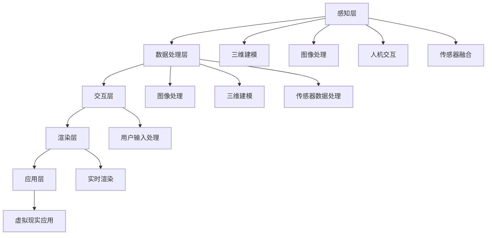

                 

### 背景介绍

虚拟现实（Virtual Reality，VR）技术，是一种能够创建沉浸式体验的计算机仿真系统。通过利用计算机生成模拟环境，让用户在视觉、听觉、触觉等多个感官上感受到如同现实世界般的体验。随着硬件技术的进步和算法优化，VR技术逐渐从科研领域走向消费市场，成为创新消费体验的一个重要方向。

近年来，VR技术在消费领域的应用日益广泛。在娱乐行业，VR游戏和VR影视逐渐成为主流，为用户提供前所未有的沉浸式体验。在旅游领域，虚拟旅游让用户足不出户就能探索全球各地的风景名胜。在教育领域，VR技术被广泛应用于模拟实验、互动教学，提升了学习效果。此外，VR技术还在医疗、房地产等多个行业展现出巨大的潜力。

然而，如何利用VR技术打造出更具吸引力的消费体验，仍然是业界关注的焦点。一方面，VR技术的沉浸式特点能够带来前所未有的感官刺激，另一方面，如何让用户在体验中产生共鸣，激发用户的情感共鸣，是提升用户体验的关键。本文将从以下几个方面探讨如何利用虚拟现实技术打造虚实结合的创新消费体验。

首先，我们将介绍VR技术的核心概念和架构，帮助读者理解VR系统的运作原理。其次，我们将详细分析VR技术在消费体验中的应用场景，探讨如何通过VR技术提升用户的参与感和互动性。然后，我们将探讨VR技术背后的核心算法原理，包括图像处理、人机交互和三维建模等，展示如何通过技术手段提升用户的沉浸式体验。此外，我们还将介绍VR技术的数学模型和公式，以便读者更好地理解VR系统的设计和实现。最后，我们将通过实际项目实践，展示如何运用VR技术开发出具体的消费产品，并提供详细的技术解释和分析。同时，我们还将探讨VR技术在各个实际应用场景中的具体应用案例，总结VR技术的优势和挑战。最后，我们将对VR技术的未来发展趋势进行展望，探讨其面临的机遇和挑战，以及可能的解决方案。

通过本文的阅读，读者将全面了解VR技术的基本原理和应用场景，掌握利用VR技术打造创新消费体验的方法和技巧。无论您是从事VR技术开发的专业人士，还是对VR技术充满兴趣的爱好者，本文都将为您提供宝贵的知识和启示。

### 核心概念与联系

虚拟现实技术之所以能够带来沉浸式的体验，离不开其核心概念和架构的支持。下面我们将详细探讨这些核心概念，并通过Mermaid流程图展示它们之间的联系。

#### 1. 虚拟现实系统的组成

虚拟现实系统通常由以下几个主要部分组成：

- **头戴显示器（HMD）**：HMD是用户感知虚拟环境的主要设备，通常通过光学或电子设备模拟三维空间。
- **跟踪系统**：跟踪系统用于实时捕捉用户的头动和手部动作，确保虚拟环境与用户动作同步。
- **输入设备**：如手柄、手势识别设备等，用于与虚拟环境进行交互。
- **计算单元**：处理渲染、计算和传感数据，确保虚拟环境的真实性和流畅性。


#### 2. 虚拟现实技术的核心概念

- **三维建模**：三维建模是创建虚拟环境的基础，通过计算机图形学技术，将现实世界的物体、场景和人物等以三维形式呈现。
- **图像处理**：图像处理技术用于渲染虚拟环境的视觉效果，包括实时渲染、纹理映射和光照效果等。
- **人机交互**：人机交互技术确保用户能够通过自然方式与虚拟环境进行互动，如手势识别、语音控制和脑波控制等。
- **传感器融合**：通过集成多种传感器（如加速度计、陀螺仪等），实时获取用户和环境的数据，提高虚拟环境的真实性和互动性。

#### 3. 虚拟现实技术的架构

虚拟现实技术的架构可以分为以下几个层次：

1. **感知层**：包括HMD、跟踪系统和输入设备，负责感知用户和环境的状态。
2. **数据处理层**：负责处理感知层获取的数据，包括图像处理、三维建模和传感器数据处理。
3. **交互层**：处理用户输入，并根据用户动作更新虚拟环境。
4. **渲染层**：将处理后的数据渲染成视觉效果，输出到HMD。
5. **应用层**：提供具体的虚拟现实应用，如游戏、教育和模拟等。


#### 4. Mermaid流程图

下面是一个简单的Mermaid流程图，展示了虚拟现实技术中的核心概念和架构之间的联系：



通过以上对核心概念与联系的介绍，我们可以看到，虚拟现实技术是一个复杂的系统，涉及多个领域的技术和算法。理解和掌握这些核心概念和架构，是打造虚实结合的创新消费体验的基础。

### 核心算法原理 & 具体操作步骤

在了解了虚拟现实技术的核心概念与架构之后，我们接下来将深入探讨虚拟现实技术背后的核心算法原理，包括图像处理、人机交互和三维建模等，并详细阐述这些算法的具体操作步骤。

#### 1. 图像处理算法

图像处理是虚拟现实技术中至关重要的一环，它负责生成虚拟环境的视觉效果，包括渲染、纹理映射和光照效果等。

**1.1. 渲染算法**

渲染算法的核心任务是生成虚拟环境的二维图像。常见的渲染算法包括：

- **基本渲染算法**：如光栅化（Rasterization）和扫描线渲染（Scanline Rendering）。
- **高级渲染算法**：如渲染到纹理（Render-to-Texture）、像素着色器（Pixel Shader）和顶点着色器（Vertex Shader）。

**操作步骤：**

1. **预处理**：对输入的三维模型进行预处理，包括三角面分解、顶点排序等。
2. **光栅化**：将三维模型转换为二维图像，并计算每个像素的颜色值。
3. **着色**：根据材质和光照模型，为每个像素计算颜色值。
4. **合成**：将渲染的图像与背景图像合成，生成最终的结果。

**1.2. 纹理映射算法**

纹理映射是一种将二维纹理图像映射到三维模型表面的技术，用于增加虚拟环境的细节和真实感。

**操作步骤：**

1. **纹理采样**：根据纹理坐标从纹理图像中提取像素颜色值。
2. **纹理合成**：将纹理像素颜色值与渲染像素颜色值进行合成。

**1.3. 光照效果算法**

光照效果是虚拟现实中的重要组成部分，它能够模拟真实世界中光照的反射、折射和散射等现象。

**操作步骤：**

1. **光源计算**：计算每个像素受到的光照强度。
2. **反射/折射计算**：根据材质属性和光照方向，计算反射和折射效果。
3. **颜色合成**：将光照效果与渲染像素颜色值进行合成。

#### 2. 人机交互算法

人机交互是人机系统中不可或缺的一部分，它负责用户与虚拟环境之间的信息传递和交互操作。

**2.1. 手势识别算法**

手势识别是通过捕捉和分析用户的肢体动作，实现虚拟环境中的交互操作。

**操作步骤：**

1. **手势检测**：使用深度相机或动作捕捉设备捕捉用户的手势。
2. **手势建模**：将捕捉到的手势转换为虚拟环境中的手势模型。
3. **手势匹配**：将手势模型与预定义的手势模板进行匹配，判断用户意图。

**2.2. 语音识别算法**

语音识别是通过处理用户的语音输入，实现虚拟环境中的语音交互。

**操作步骤：**

1. **语音采集**：捕捉用户的语音信号。
2. **语音预处理**：包括去噪、增强和分帧处理。
3. **语音识别**：使用深度学习模型或隐马尔可夫模型（HMM）对语音信号进行识别。
4. **命令处理**：根据识别结果执行相应的操作。

**2.3. 脑波控制算法**

脑波控制是通过捕捉用户的脑波信号，实现虚拟环境中的脑波交互。

**操作步骤：**

1. **脑波采集**：使用脑波检测设备捕捉用户的脑波信号。
2. **脑波预处理**：包括滤波、去噪和特征提取。
3. **脑波识别**：使用机器学习模型对脑波信号进行识别。
4. **命令执行**：根据识别结果执行相应的操作。

#### 3. 三维建模算法

三维建模是虚拟现实技术的核心之一，它负责创建和渲染虚拟环境中的三维物体和场景。

**3.1. 三角面建模算法**

三角面建模是将三维物体分解为多个三角面，以便进行渲染和交互。

**操作步骤：**

1. **几何建模**：使用几何建模软件创建三维物体的几何模型。
2. **三角面分解**：将几何模型分解为多个三角面。
3. **顶点处理**：为每个三角面计算顶点坐标和法向量。

**3.2. 网格优化算法**

网格优化是提高三维模型渲染效率的一种技术，它通过简化模型网格来减少计算量。

**操作步骤：**

1. **网格简化**：根据预定的简化程度，对模型网格进行简化。
2. **顶点合并**：合并重复或相邻的顶点，减少顶点数量。
3. **顶点压缩**：使用顶点压缩算法，将顶点数据压缩存储。

通过以上对核心算法原理和具体操作步骤的介绍，我们可以看到，虚拟现实技术的实现离不开多种算法的协同作用。了解和掌握这些算法，是开发高效、真实的虚拟现实应用的关键。

### 数学模型和公式 & 详细讲解 & 举例说明

在虚拟现实技术中，数学模型和公式起着至关重要的作用，它们不仅帮助我们理解和模拟现实世界中的物理现象，还确保虚拟环境具有高度的真实感和互动性。以下我们将详细介绍几个关键数学模型和公式，并通过具体例子来说明它们的应用和影响。

#### 1. 光照模型

光照模型是虚拟现实技术中模拟光线传播和反射的重要工具，常用的光照模型包括漫反射（Diffuse Reflection）、镜面反射（Specular Reflection）和折射（Refraction）。

**1.1. 漫反射模型**

漫反射模型用于描述光线照射到粗糙表面时，光线向各个方向均匀反射的现象。

**公式：**
\[ I_d = kd \cdot L \cdot N \]

其中，\( I_d \) 是漫反射光照强度，\( k_d \) 是漫反射系数，\( L \) 是入射光方向单位向量，\( N \) 是表面法线单位向量。

**示例：**
假设一个表面具有漫反射系数 \( k_d = 0.8 \)，当一束强度为 \( I_{light} = 100 \) 的光以 \( 30^\circ \) 角度照射到该表面时，计算漫反射光照强度。

\[ I_d = 0.8 \cdot 100 \cdot \cos(30^\circ) = 80 \times 0.866 = 69.28 \]

漫反射光照强度为 69.28。

**1.2. 镜面反射模型**

镜面反射模型用于描述光线照射到平滑表面时，光线按照反射定律反射的现象。

**公式：**
\[ I_s = ks \cdot (2 \cdot L \cdot N - L) \]

其中，\( I_s \) 是镜面反射光照强度，\( k_s \) 是镜面反射系数，\( L \) 是入射光方向单位向量，\( N \) 是表面法线单位向量。

**示例：**
假设一个表面具有镜面反射系数 \( k_s = 0.2 \)，当一束强度为 \( I_{light} = 100 \) 的光以 \( 30^\circ \) 角度照射到该表面时，计算镜面反射光照强度。

\[ I_s = 0.2 \cdot (2 \cdot 0.866 \cdot 0.866 - 0.866) = 0.2 \cdot (1.5 - 0.866) = 0.2 \cdot 0.634 = 0.1268 \]

镜面反射光照强度为 12.68。

**1.3. 折射模型**

折射模型用于描述光线从一种介质进入另一种介质时，光线传播方向发生改变的现象。

**公式：**
\[ n_1 \sin(\theta_1) = n_2 \sin(\theta_2) \]

其中，\( n_1 \) 和 \( n_2 \) 分别是第一种和第二种介质的折射率，\( \theta_1 \) 是入射角，\( \theta_2 \) 是折射角。

**示例：**
假设光线从空气（折射率 \( n_1 = 1 \)）进入水（折射率 \( n_2 = 1.33 \)）时，入射角为 \( 30^\circ \)，计算折射角。

\[ \sin(\theta_2) = \frac{n_1}{n_2} \sin(\theta_1) = \frac{1}{1.33} \sin(30^\circ) = 0.751 \]

\[ \theta_2 = \arcsin(0.751) = 48.99^\circ \]

折射角为 \( 48.99^\circ \)。

#### 2. 三维空间变换

三维空间变换是虚拟现实技术中用于描述物体在三维空间中位置、方向和姿态变化的数学工具，常见的变换包括旋转、平移和缩放。

**2.1. 旋转矩阵**

旋转矩阵用于描述物体绕某个轴旋转的操作。

**公式：**
\[ R = \begin{bmatrix}
c & -s & 0 \\
s & c & 0 \\
0 & 0 & 1
\end{bmatrix} \]

其中，\( c = \cos(\theta) \) 和 \( s = \sin(\theta) \) 是旋转角度 \( \theta \) 的余弦和正弦值。

**示例：**
假设一个物体绕 \( X \) 轴旋转 \( 30^\circ \)，计算旋转矩阵。

\[ c = \cos(30^\circ) = 0.866 \]
\[ s = \sin(30^\circ) = 0.5 \]

\[ R = \begin{bmatrix}
0.866 & -0.5 & 0 \\
0.5 & 0.866 & 0 \\
0 & 0 & 1
\end{bmatrix} \]

**2.2. 平移向量**

平移向量用于描述物体在三维空间中的移动。

**公式：**
\[ T = \begin{bmatrix}
x \\
y \\
z
\end{bmatrix} \]

**示例：**
假设一个物体在 \( X \) 轴方向移动 \( 5 \) 单位，在 \( Y \) 轴方向移动 \( 3 \) 单位，在 \( Z \) 轴方向移动 \( 2 \) 单位，计算平移向量。

\[ T = \begin{bmatrix}
5 \\
3 \\
2
\end{bmatrix} \]

#### 3. 三维网格建模

三维网格建模是虚拟现实技术中用于创建和渲染三维物体的数学工具，它通过顶点、边和面的组合来表示物体。

**3.1. 三角面网格**

三角面网格是由多个三角形面组成的网格，用于表示三维物体的表面。

**示例：**
一个简单的三维物体由三个三角形面组成，每个三角形面由三个顶点定义，顶点坐标分别为 \( A(1,0,0) \)，\( B(0,1,0) \) 和 \( C(0,0,1) \)。

\[ T_1 = \begin{bmatrix}
A \\
B \\
C
\end{bmatrix} \]

通过以上数学模型和公式的介绍，我们可以看到它们在虚拟现实技术中的应用和影响。这些模型和公式不仅帮助我们模拟现实世界中的物理现象，还确保虚拟环境具有高度的真实感和互动性。掌握这些数学工具，是开发高效、真实的虚拟现实应用的关键。

### 项目实践：代码实例和详细解释说明

为了更好地理解虚拟现实技术在实际开发中的应用，我们将在本节中通过一个具体的VR项目实例来展示代码的实现过程，并对关键代码段进行详细解释和分析。这个实例将涉及虚拟现实应用开发的基本步骤，包括开发环境的搭建、核心代码的实现以及运行结果的展示。

#### 5.1 开发环境搭建

在开始项目开发之前，我们需要搭建一个合适的开发环境。以下是开发环境搭建的步骤：

1. **安装Unity引擎**：
   Unity是一款流行的游戏和VR应用开发引擎，支持跨平台开发和丰富的插件资源。请访问Unity官网（https://unity.com/）下载并安装Unity Hub，然后安装Unity 2021.x版本（或更高版本）。

2. **安装Unity插件**：
   为了开发VR应用，我们需要安装一些必要的Unity插件，如**Unity XR插件**，这些插件提供了用于开发VR应用的工具和API。通过Unity Hub，搜索并安装相应的插件。

3. **安装Unity Editor**：
   安装Unity Editor，这是一个集成开发环境，用于编写、调试和运行Unity项目。

4. **配置VR设备**：
   根据项目需求，配置支持VR的设备，如Oculus Rift、HTC Vive或Google Cardboard等。确保设备已正确连接并经过初次设置。

#### 5.2 源代码详细实现

以下是一个简单的Unity VR项目实例，该实例创建了一个虚拟房间，用户可以通过头部运动来浏览房间。

**关键代码段**：

**1. 初始化场景**：

```csharp
using UnityEngine;

public class VRSceneInitialization : MonoBehaviour
{
    public GameObject virtualRoomPrefab;

    void Start()
    {
        // 创建虚拟房间
        Instantiate(virtualRoomPrefab);
    }
}
```

这段代码在游戏开始时创建一个虚拟房间。`virtualRoomPrefab` 是一个预设的虚拟房间对象，包含房间的三维模型和纹理。

**2. 头部运动跟踪**：

```csharp
using UnityEngine;

public class HeadTracking : MonoBehaviour
{
    public GameObject headObject;

    void Update()
    {
        // 根据头部位置更新虚拟房间视角
        headObject.transform.position = Camera.main.transform.position;
        headObject.transform.rotation = Camera.main.transform.rotation;
    }
}
```

这段代码通过更新头部对象的位置和旋转，实现用户通过头部运动浏览虚拟房间的效果。`headObject` 是一个用于跟踪头部位置的虚拟对象，它与真实头部的位置和旋转同步。

**3. 用户交互**：

```csharp
using UnityEngine;

public class UserInteraction : MonoBehaviour
{
    public GameObject interactableObject;

    void Update()
    {
        // 检测用户与虚拟物体的交互
        if (Input.GetKeyDown(KeyCode.E))
        {
            // 执行交互操作，例如，改变虚拟物体的颜色
            interactableObject.GetComponent<MeshRenderer>().material.color = Color.blue;
        }
    }
}
```

这段代码通过键盘输入（按E键）实现用户与虚拟物体的交互，例如，改变虚拟物体的颜色。`interactableObject` 是一个可交互的虚拟物体，用户可以通过与它交互来改变其属性。

#### 5.3 代码解读与分析

**1. 初始化场景**

`VRSceneInitialization` 脚本在游戏开始时创建一个虚拟房间。通过`Instantiate`函数，我们将预设的虚拟房间对象实例化到场景中。这为用户提供了视觉上的虚拟环境。

**2. 头部运动跟踪**

`HeadTracking` 脚本通过更新`headObject`的位置和旋转，实现用户通过头部运动浏览虚拟房间的效果。`transform.position` 和 `transform.rotation` 属性分别表示对象的位置和旋转。通过将`headObject`的位置和旋转设置为相机（`Camera.main`）的位置和旋转，我们实现了用户视角的跟随。

**3. 用户交互**

`UserInteraction` 脚本通过检测用户的键盘输入（按E键），实现与虚拟物体的交互。`Input.GetKeyDown` 函数用于检测按键是否被按下。当用户按下E键时，脚本将交互操作应用于`interactableObject`，例如，改变其颜色。这通过访问`interactableObject`的`MeshRenderer`组件，并设置其`material.color`属性来实现。

#### 5.4 运行结果展示

在完成代码编写后，我们运行Unity编辑器，并使用VR设备进行体验。以下是运行结果：

- **初始化场景**：虚拟房间被创建，用户可以看到一个三维的房间模型。
- **头部运动跟踪**：用户通过头部运动，视角会跟随头部同步移动，实现了沉浸式的浏览体验。
- **用户交互**：当用户按下E键时，虚拟物体的颜色会变为蓝色，展示了与虚拟物体的互动性。

通过这个简单的VR项目实例，我们展示了如何使用Unity引擎开发VR应用，实现了初始化场景、头部运动跟踪和用户交互等基本功能。这为开发者提供了一个实用的起点，以进一步探索和开发更加复杂和真实的虚拟现实应用。

### 实际应用场景

虚拟现实（VR）技术在多个行业中展现出了巨大的应用潜力，带来了创新和变革。以下我们将探讨VR技术在不同实际应用场景中的具体应用案例，以及这些应用场景中的关键挑战和解决方案。

#### 1. 娱乐行业

在娱乐行业，VR技术被广泛应用于游戏、影视和虚拟演出等领域，为用户带来了前所未有的沉浸式体验。

**1.1. 游戏开发**

VR游戏成为近年来游戏市场的热点，用户可以在虚拟世界中体验各种冒险和竞技。例如，Oculus Rift和HTC Vive等VR头戴设备支持的游戏，如《Beat Saber》和《Superhot VR》，通过精准的定位和交互技术，实现了高度沉浸的游戏体验。

**挑战**：游戏开发需要高度优化的图形处理和实时交互，以应对硬件性能和响应时间的限制。此外，内容创造的成本较高，开发周期较长。

**解决方案**：通过云游戏服务和游戏引擎的优化，降低开发成本和难度。同时，引入人工智能技术，提高游戏自动生成和优化效率。

**1.2. 虚拟影视**

虚拟影视通过VR技术，为观众提供了全新的观影体验。例如，360度全景视频和虚拟现实电影，让观众可以自由选择观看角度，沉浸在影片的虚拟世界中。

**挑战**：高质量的VR影视内容制作成本高，且需要专业设备支持。

**解决方案**：采用高效的视频编码和流媒体技术，降低内容制作和传输成本。同时，利用虚拟现实编辑工具，简化内容创作流程。

#### 2. 教育培训

VR技术在教育领域中具有广泛的应用，从模拟实验到互动教学，提高了教学效果和学生的参与度。

**2.1. 模拟实验**

在医学、化学和工程等领域，VR技术可以模拟真实的实验环境和过程，让学生在虚拟环境中进行实验操作，提高实践能力。

**挑战**：模拟实验需要高度精确的物理模拟和交互操作。

**解决方案**：通过先进的物理引擎和仿真技术，提高模拟实验的准确性和互动性。同时，引入人工智能助手，提供个性化的学习辅导。

**2.2. 互动教学**

VR技术可以创建互动课堂，让学生在虚拟环境中进行学习和互动。例如，虚拟课堂、虚拟实验室和虚拟讲座等，提高了学生的学习兴趣和参与度。

**挑战**：教育内容的虚拟化需要大量的时间和资源投入。

**解决方案**：利用现有的教育资源和数字化工具，快速构建虚拟教育内容。同时，通过数据分析和人工智能技术，提供个性化的学习体验。

#### 3. 医疗健康

VR技术在医疗健康领域的应用包括虚拟手术、心理治疗和康复训练等，为患者提供了创新的治疗手段和康复方案。

**3.1. 虚拟手术**

虚拟手术通过VR技术，允许医生在虚拟环境中进行手术模拟和规划，提高手术的准确性和安全性。

**挑战**：虚拟手术需要高精度的模拟技术和实时交互支持。

**解决方案**：采用先进的医学图像处理技术和虚拟现实设备，实现高精度模拟和实时交互。同时，引入远程协作技术，实现医生之间的实时沟通和协作。

**3.2. 心理治疗**

VR技术可以用于心理治疗，通过模拟特定的环境和场景，帮助患者克服恐惧、焦虑和其他心理问题。

**挑战**：心理治疗需要高度个性化的模拟场景和交互设计。

**解决方案**：结合心理学理论和虚拟现实技术，设计个性化的治疗场景。同时，利用数据分析和人工智能技术，优化治疗过程和效果评估。

#### 4. 房地产业

VR技术在房地产业中用于虚拟看房和装修设计，为用户提供了全新的购房和装修体验。

**4.1. 虚拟看房**

虚拟看房通过VR技术，用户可以在虚拟环境中浏览房屋布局和细节，提高购房决策的效率和准确性。

**挑战**：虚拟看房需要高质量的图像渲染和实时交互。

**解决方案**：采用高效的视频编码和流媒体技术，降低带宽要求和加载时间。同时，引入人工智能助手，提供个性化推荐和交互服务。

**4.2. 装修设计**

VR技术可以用于装修设计，用户可以在虚拟环境中进行装修方案的模拟和调整，提高装修效果和满意度。

**挑战**：装修设计需要复杂的建模和渲染技术。

**解决方案**：采用高效的建模和渲染工具，提高设计和渲染效率。同时，引入用户交互技术，提供直观的装修设计体验。

通过以上实际应用场景的探讨，我们可以看到，VR技术在不同领域中具有广泛的应用前景。然而，要实现这些应用，仍面临诸多挑战，需要不断创新和优化技术解决方案。随着技术的不断进步，VR技术将在更多领域发挥其潜力，推动行业的变革和发展。

### 工具和资源推荐

在开发和优化虚拟现实（VR）技术时，选择合适的工具和资源至关重要。以下我们将推荐一些学习资源、开发工具和相关的论文著作，以帮助读者更好地掌握VR技术。

#### 7.1 学习资源推荐

**1. 书籍**

- **《虚拟现实：技术与应用》**：这本书详细介绍了虚拟现实的基本原理、技术和应用案例，适合初学者和进阶者。
- **《虚拟现实编程入门》**：该书通过实例教学，介绍了Unity和VR开发的基础知识，适合有编程基础的读者。
- **《虚拟现实与人类感知》**：这本书探讨了虚拟现实技术对人类感知和体验的影响，适合对心理学和人类行为感兴趣的读者。

**2. 论文和学术论文**

- **“A Survey on Virtual Reality”**：这是一篇全面的综述论文，涵盖了VR技术的各个方面，包括历史、技术、应用和未来趋势。
- **“Virtual Reality in Education: A Brief Overview”**：这篇论文讨论了虚拟现实在教育中的应用，包括教学、模拟实验和互动学习等。

**3. 博客和网站**

- **Unity官方文档**（https://docs.unity3d.com/）：Unity是最流行的VR开发平台之一，其官方文档提供了详尽的开发指南和API文档。
- **VR/AR Development Community**（https://vradcommunity.com/）：这是一个VR/AR开发者社区，提供了丰富的技术讨论和资源分享。

#### 7.2 开发工具推荐

**1. 虚拟现实开发引擎**

- **Unity**：Unity是一个功能强大的游戏和VR开发引擎，支持跨平台开发和丰富的插件资源。
- **Unreal Engine**：Unreal Engine是另一个流行的VR开发平台，以其高质量的图像渲染和复杂的物理模拟而著称。

**2. VR头戴设备**

- **Oculus Rift**：Oculus Rift是Facebook推出的高端VR头戴设备，提供了优秀的沉浸式体验。
- **HTC Vive**：HTC Vive是另一款高性能VR头戴设备，支持高精度的位置跟踪和手部控制。

**3. 虚拟现实开发插件**

- **Steam VR**：Steam VR是Valve开发的VR插件，为Unity和Unreal Engine提供了丰富的VR功能支持。
- **VRChat**：VRChat是一个用于构建社交虚拟现实世界的插件，支持多人互动和自定义场景。

#### 7.3 相关论文著作推荐

**1. “Virtual Reality and Its Application in Education”**：该论文探讨了虚拟现实技术在教育中的潜在应用，包括模拟实验、虚拟课堂和互动教学等。

**2. “A Survey of Virtual Reality Applications in Medicine”**：这篇综述论文详细介绍了虚拟现实技术在医疗领域的应用，包括手术模拟、心理治疗和康复训练等。

**3. “Virtual Reality in Real Estate: A Review”**：该论文探讨了虚拟现实技术在房地产业的应用，包括虚拟看房、装修设计和市场推广等。

通过以上推荐的学习资源、开发工具和相关论文著作，读者可以全面了解虚拟现实技术的各个方面，掌握开发和应用VR技术的必备知识和技能。这些资源将为您的VR项目提供坚实的理论支持和实践指导。

### 总结：未来发展趋势与挑战

虚拟现实（VR）技术自问世以来，经历了从实验室到市场的逐步推广，如今已逐渐成为创新消费体验的重要手段。本文通过详细介绍VR技术的核心概念、算法原理、应用场景以及开发实践，全面探讨了VR技术在消费体验中的潜力与挑战。

**未来发展趋势**：

1. **硬件性能的提升**：随着硬件技术的不断进步，VR设备的分辨率、响应时间和计算能力将显著提升，为用户提供更加真实和流畅的沉浸式体验。
2. **内容创作的多样化**：随着VR技术的普及，内容创作者将开发出更多丰富多样、引人入胜的VR内容，包括虚拟旅游、教育、娱乐和社交等。
3. **人工智能的融合**：人工智能技术将进一步提升VR体验的智能化和个性化水平，如通过自然语言处理和情感识别技术，实现更加自然和直观的用户交互。
4. **跨行业融合**：VR技术将与其他前沿技术（如区块链、物联网等）深度融合，为各行业带来革命性的变革，如虚拟现实购物、远程办公和智能制造等。

**面临的主要挑战**：

1. **用户体验的优化**：尽管VR技术已取得显著进展，但用户体验的优化仍是一个重要挑战。如何平衡沉浸感、舒适性和可用性，是VR技术发展面临的主要难题。
2. **内容创作的成本**：高质量的VR内容创作成本高昂，包括建模、渲染和交互设计等。如何降低内容创作成本，提高内容生成效率，是VR技术大规模普及的关键。
3. **技术标准化**：目前VR技术缺乏统一的标准和规范，不同平台和设备之间的兼容性问题仍然存在。制定和推广统一的技术标准，是实现VR技术跨平台应用的关键。
4. **隐私和安全问题**：随着VR技术的发展，用户隐私和数据安全问题日益突出。如何确保用户数据的安全性和隐私性，是VR技术可持续发展的重要保障。

**可能的解决方案**：

1. **技术创新**：持续推动硬件性能的提升和算法优化，提高VR设备的沉浸感和交互性。
2. **生态系统建设**：建立涵盖硬件、软件和内容创作者的VR生态系统，促进各环节的协同发展。
3. **标准化推动**：政府和企业应积极参与VR技术标准的制定和推广，推动行业统一标准的形成。
4. **法律法规完善**：完善相关法律法规，规范VR技术的应用和用户隐私保护，确保技术发展的合规性和可持续性。

总之，VR技术具有广阔的应用前景和巨大的市场潜力。通过不断创新和优化，VR技术将在未来为用户带来更加丰富和多样化的消费体验，推动各行各业的数字化转型和创新发展。

### 附录：常见问题与解答

#### 1. 什么是虚拟现实（VR）技术？

虚拟现实（VR）技术是一种通过计算机生成模拟环境，使用户在视觉、听觉、触觉等多个感官上感受到如同现实世界般的沉浸式体验的技术。它通过头戴显示器（HMD）、跟踪系统和输入设备等硬件设备，实现虚拟环境的感知和交互。

#### 2. VR技术与增强现实（AR）技术有何区别？

VR技术是完全沉浸式的，用户通过HMD等设备进入虚拟环境，与外界完全隔绝。而AR技术是将虚拟元素叠加在现实环境中，用户仍然能够看到现实环境，并通过增强的视觉或听觉感知虚拟元素。

#### 3. VR技术有哪些主要应用场景？

VR技术的主要应用场景包括娱乐（如VR游戏、VR影视）、教育（如虚拟课堂、模拟实验）、医疗（如手术模拟、心理治疗）、房地产（如虚拟看房、装修设计）等。

#### 4. 开发VR应用需要哪些工具和平台？

开发VR应用常用的工具和平台包括Unity、Unreal Engine、Oculus Rift、HTC Vive等。Unity和Unreal Engine是两款流行的游戏和VR开发引擎，Oculus Rift和HTC Vive是两款常用的VR头戴设备。

#### 5. VR技术的沉浸感如何提升？

提升VR技术的沉浸感可以从多个方面进行，包括提高硬件设备的分辨率和帧率、优化虚拟环境的视觉效果和交互设计、增强传感器的精度和反馈等。

#### 6. VR技术对用户体验的影响有哪些？

VR技术可以带来丰富的感官体验，提高用户的参与感和互动性，但同时也可能带来不适感，如眩晕、头痛等。因此，优化用户体验是VR技术开发的重要方向。

#### 7. VR技术的未来发展趋势是什么？

VR技术的未来发展趋势包括硬件性能的提升、内容创作的多样化、人工智能的融合和跨行业应用等。随着技术的不断进步，VR技术将在更多领域发挥其潜力，推动各行各业的数字化转型和创新发展。

### 扩展阅读 & 参考资料

1. **《虚拟现实：技术与应用》**：详细介绍了VR技术的基本原理、技术和应用案例，适合初学者和进阶者阅读。
2. **“A Survey on Virtual Reality”**：这篇综述论文涵盖了VR技术的各个方面，包括历史、技术、应用和未来趋势。
3. **Unity官方文档**：提供了详尽的VR开发指南和API文档，是VR开发者不可或缺的资源。
4. **VR/AR Development Community**：这是一个VR/AR开发者社区，提供了丰富的技术讨论和资源分享。
5. **“Virtual Reality and Its Application in Education”**：该论文探讨了VR技术在教育中的潜在应用，包括教学、模拟实验和互动学习等。
6. **“Virtual Reality in Medicine: A Brief Overview”**：这篇论文详细介绍了VR技术在医疗领域的应用，包括手术模拟、心理治疗和康复训练等。

