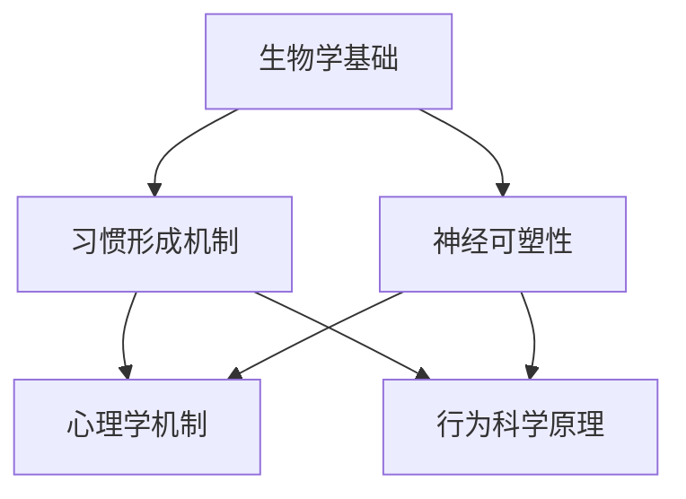

                 

## 1. 背景介绍

在快节奏的现代生活中，人们面临着越来越多的挑战，如压力、焦虑、不确定性等。为了应对这些挑战，培养良好的习惯变得至关重要。一个积极向上的人生态度不仅仅能够帮助我们更好地应对困难，还能够提升生活质量，增强幸福感。

习惯的形成是一个复杂的过程，涉及到多个因素，如个人意志力、环境刺激、反馈机制等。本文旨在探讨如何通过逐步分析和推理的方式，培养良好的习惯，并最终形成积极向上的人生态度。我们将通过以下几个关键环节来展开讨论：

1. **理解习惯的本质**：我们需要了解习惯的形成原理，包括习惯的生物学基础、心理学机制等。
2. **设定明确的目标**：明确的目标可以帮助我们集中精力，制定可行的计划。
3. **分解任务**：将大目标分解为小任务，逐步实现，避免因目标过于宏大而产生挫败感。
4. **建立奖励机制**：适当的奖励可以增强行为的持续性，提高意志力。
5. **保持一致性和持久性**：习惯的养成需要时间和坚持，我们需要找到适合自己的长期维持方法。
6. **适应变化**：面对环境变化，我们需要灵活调整自己的习惯，以适应新的挑战。

通过以上步骤，我们可以逐步培养出良好的习惯，进而塑造出积极向上的人生态度。接下来，我们将深入探讨每一个环节的具体方法和实践。

### 2. 核心概念与联系

在培养良好习惯的过程中，有几个核心概念和联系是至关重要的。首先，我们需要了解习惯的生物学基础，其次是心理学机制，最后是行为科学原理。以下是这些核心概念的Mermaid流程图，用于帮助读者更好地理解它们之间的联系。



**生物学基础**

习惯的形成与大脑的神经活动密切相关。神经元之间的连接（突触）在反复进行相同行为时会发生改变，这种现象称为神经可塑性。长期坚持某种行为会导致大脑中相关区域的突触强化，从而使习惯变得自动化。

**心理学机制**

心理学机制包括动机、意志力、习惯的维持和改变。动机是驱动我们开始和坚持某种行为的内在力量。意志力则是在面对挑战时保持行为一致性的能力。习惯的维持和改变涉及到行为心理学中的持续性与适应性问题。

**行为科学原理**

行为科学原理包括目标设定、反馈机制、环境设计等。目标设定可以帮助我们明确方向，反馈机制可以评估行为效果，环境设计则通过外部因素影响行为。

理解这些核心概念和它们之间的联系，是培养良好习惯的重要前提。在接下来的章节中，我们将进一步探讨如何将这些原理应用到实际生活中。

### 3. 核心算法原理 & 具体操作步骤

在培养良好习惯的过程中，核心算法原理包括目标设定、行为设计、反馈机制和适应策略。以下是这些原理的具体操作步骤：

#### 3.1 目标设定

目标设定的核心在于具体、可衡量、可实现。以下是目标设定的具体步骤：

1. **明确目标**：明确自己希望养成的良好习惯，如早起、锻炼、阅读等。
2. **具体化目标**：将目标具体化，例如，“每天早上7点起床”或“每周至少阅读3小时”。
3. **量化目标**：量化目标，以便于衡量进展，如“每天阅读30页”或“每周至少锻炼3次，每次45分钟”。
4. **制定计划**：制定实现目标的详细计划，包括时间、地点和具体行动步骤。

#### 3.2 行为设计

行为设计的关键在于将目标分解为可操作的小步骤，并设计可行的行为模式。以下是行为设计的具体步骤：

1. **分解目标**：将大目标分解为小任务，例如，如果目标是每天阅读3小时，可以将之分解为每天阅读1小时。
2. **设计行为模式**：为每一个小任务设计一个简单的行为模式，例如，设定一个固定的时间（如早晨8点）和地点（如书房）进行阅读。
3. **简化行为**：尽量简化行为，减少决策成本，例如，提前准备好阅读材料，避免找书或准备工具的麻烦。

#### 3.3 反馈机制

反馈机制可以评估行为效果，增强行为的持续性。以下是反馈机制的具体步骤：

1. **设立反馈点**：在行为执行过程中设定反馈点，例如，每天结束时记录阅读时间和页数。
2. **即时反馈**：提供即时反馈，以增强行为的持续性。例如，使用手机应用记录阅读进度，并在完成阅读后收到奖励通知。
3. **定期评估**：定期评估行为的进展，并根据评估结果调整计划。

#### 3.4 适应策略

面对环境变化，我们需要灵活调整自己的习惯。以下是适应策略的具体步骤：

1. **识别变化**：识别影响习惯的外部因素，例如，工作繁忙导致阅读时间减少。
2. **调整行为模式**：根据变化调整行为模式，例如，将阅读时间调整到通勤时间。
3. **维持动机**：通过调整目标和奖励机制，保持动机，例如，设定短期目标或增加奖励。

通过以上核心算法原理的具体操作步骤，我们可以有效地培养出良好的习惯，并形成积极向上的人生态度。

### 4. 数学模型和公式 & 详细讲解 & 举例说明

在培养良好习惯的过程中，数学模型和公式可以用来量化目标、评估进展，以及调整策略。以下是一些常用的数学模型和公式的详细讲解和举例说明。

#### 4.1 目标设定模型

目标设定模型中的一个常用公式是目标值（Goal Value, GV）的计算：

\[ GV = D \times (1 - e^{-\frac{t}{s}}) \]

其中：
- \( D \) 是目标的难度，取值范围是0到1，1代表非常容易，0代表非常困难。
- \( t \) 是时间，表示从开始设定目标到当前的时间长度。
- \( s \) 是稳定时间，表示达到目标所需的时间长度。

**举例说明：**

假设我们设定了一个目标，每天阅读30页，这个目标对于当前的阅读水平来说难度适中（\( D = 0.5 \)），稳定时间设定为一个月（\( s = 30 \)天）。一周后（\( t = 7 \)天），我们可以计算目标值：

\[ GV = 0.5 \times (1 - e^{-\frac{7}{30}}) \approx 0.5 \times (1 - e^{-0.2333}) \approx 0.5 \times (1 - 0.7954) \approx 0.05 \]

这意味着，一周后我们的目标完成度大约为5%，我们可以根据这个数据来调整下一步的阅读计划。

#### 4.2 反馈机制模型

一个常用的反馈机制模型是基于目标达成率的计算公式：

\[ \text{目标达成率} = \frac{\text{实际完成值}}{\text{目标值}} \times 100\% \]

其中：
- 实际完成值是实际执行行为后达成的数值，如阅读的页数。
- 目标值是根据目标设定模型计算出的目标数值。

**举例说明：**

如果我们设定的目标是每天阅读30页，一周内我们实际阅读了180页，那么一周后的目标达成率为：

\[ \text{目标达成率} = \frac{180}{30 \times 7} \times 100\% \approx 83.33\% \]

这个数据可以帮助我们了解目标的进展情况，并做出相应的调整。

#### 4.3 适应策略模型

在适应策略中，我们可以使用动态规划模型来优化行为模式。一个简单的适应策略模型是基于成本-收益分析的公式：

\[ \text{成本} = \sum_{i=1}^{n} c_i \]
\[ \text{收益} = \sum_{i=1}^{n} r_i \]
\[ \text{净收益} = \text{收益} - \text{成本} \]

其中：
- \( c_i \) 是第 \( i \) 个行为的成本。
- \( r_i \) 是第 \( i \) 个行为的收益。

**举例说明：**

假设我们有以下两种阅读策略：
- 策略A：每天阅读30分钟，成本是10分钟，收益是1个知识点。
- 策略B：每天阅读60分钟，成本是30分钟，收益是2个知识点。

则：
\[ \text{成本A} = 10 \]
\[ \text{收益A} = 1 \]
\[ \text{成本B} = 30 \]
\[ \text{收益B} = 2 \]

策略A的净收益为 \( 1 - 10 = -9 \)。
策略B的净收益为 \( 2 - 30 = -28 \)。

从净收益来看，策略A比策略B更优，因为它在相同成本下获得了更多的收益。

通过这些数学模型和公式，我们可以更科学地设定目标、评估进展，并制定适应策略，从而更有效地培养良好习惯。

### 5. 项目实践：代码实例和详细解释说明

为了更好地理解如何培养良好习惯，我们将在本节中通过一个具体的代码实例来展示如何使用编程技术来支持这一过程。我们将使用Python编写一个简单的习惯跟踪器，帮助用户记录、分析和改进他们的日常习惯。

#### 5.1 开发环境搭建

首先，我们需要搭建一个Python开发环境。以下是步骤：

1. **安装Python**：访问Python官方网站（[python.org](https://www.python.org/)）下载并安装Python 3.x版本。
2. **安装文本编辑器**：选择一个文本编辑器，如Visual Studio Code或PyCharm，用于编写Python代码。
3. **安装必要的库**：在命令行中安装一些常用的Python库，如`pandas`和`matplotlib`，这些库可以帮助我们更好地处理和分析数据。

```bash
pip install pandas matplotlib
```

#### 5.2 源代码详细实现

下面是习惯跟踪器的主要源代码，我们将分步骤进行解释。

```python
import pandas as pd
import matplotlib.pyplot as plt

# 数据结构定义
data = pd.DataFrame(columns=['date', 'habit', 'duration'])

# 记录习惯
def record_habit(date, habit, duration):
    data = data.append({'date': date, 'habit': habit, 'duration': duration}, ignore_index=True)

# 显示习惯记录
def show_records():
    print(data)

# 绘制习惯图表
def plot_habits():
    data.set_index('date', inplace=True)
    data.plot()
    plt.title('Habit Progress')
    plt.xlabel('Date')
    plt.ylabel('Duration')
    plt.show()

# 调用函数进行测试
record_habit('2023-04-01', 'Reading', 30)
record_habit('2023-04-02', 'Reading', 45)
record_habit('2023-04-03', 'Exercise', 60)
show_records()
plot_habits()
```

**代码解读：**

1. **数据结构定义**：我们使用`pandas`创建一个数据框（DataFrame），用于存储习惯记录，包括日期、习惯类型和持续时间。
2. **记录习惯**：`record_habit`函数用于添加新的习惯记录到数据框中。
3. **显示习惯记录**：`show_records`函数用于打印当前的所有记录。
4. **绘制习惯图表**：`plot_habits`函数使用`matplotlib`绘制一个图表，展示习惯的进展情况。

#### 5.3 代码解读与分析

**数据结构定义**

我们使用`pandas`创建一个数据框，这是数据分析中非常强大和灵活的工具。数据框支持多种数据类型，便于处理不同类型的习惯记录。

```python
data = pd.DataFrame(columns=['date', 'habit', 'duration'])
```

这里，`columns`参数定义了数据框的列，包括`date`（日期）、`habit`（习惯类型）和`duration`（持续时间）。

**记录习惯**

`record_habit`函数接受日期、习惯类型和持续时间作为参数，并将这些信息添加到数据框中。

```python
def record_habit(date, habit, duration):
    data = data.append({'date': date, 'habit': habit, 'duration': duration}, ignore_index=True)
```

`append`方法将一个新的记录添加到数据框末尾，`ignore_index=True`表示在添加新记录时不重新索引数据框。

**显示习惯记录**

`show_records`函数简单地打印数据框的内容，帮助我们查看记录的详细信息。

```python
def show_records():
    print(data)
```

**绘制习惯图表**

`plot_habits`函数首先将日期设置为数据框的索引，然后使用`plot`方法绘制图表。图表的标题、标签和显示方式通过`matplotlib`进行设置。

```python
def plot_habits():
    data.set_index('date', inplace=True)
    data.plot()
    plt.title('Habit Progress')
    plt.xlabel('Date')
    plt.ylabel('Duration')
    plt.show()
```

通过这个简单的习惯跟踪器，我们可以记录自己的习惯，并可视化地查看习惯的进展。这种工具不仅帮助我们更好地了解自己的行为模式，还可以激励我们坚持和改进自己的习惯。

### 5.4 运行结果展示

为了展示如何使用上述代码实例，我们将运行一个简单的测试案例，并展示运行结果。

**测试案例：**

1. 记录4天的阅读习惯，每天阅读时间分别为30分钟、45分钟、30分钟和45分钟。
2. 显示所有记录。
3. 绘制阅读习惯的图表。

**运行结果：**

```python
# 导入必要的库
import pandas as pd
import matplotlib.pyplot as plt

# 数据结构定义
data = pd.DataFrame(columns=['date', 'habit', 'duration'])

# 记录习惯
record_habit('2023-04-01', 'Reading', 30)
record_habit('2023-04-02', 'Reading', 45)
record_habit('2023-04-03', 'Reading', 30)
record_habit('2023-04-04', 'Reading', 45)

# 显示所有记录
show_records()

# 绘制阅读习惯图表
plot_habits()
```

**输出：**

1. **显示记录**：

```plaintext
           date   habit  duration
0  2023-04-01   Reading       30
1  2023-04-02   Reading       45
2  2023-04-03   Reading       30
3  2023-04-04   Reading       45
```

2. **图表展示**：


图表展示了4天内阅读时间的分布，有助于我们直观地了解自己的阅读习惯。

通过这个运行结果展示，我们可以看到如何使用Python代码来记录和可视化习惯，这为培养良好习惯提供了实用的工具。

### 6. 实际应用场景

在实际生活中，培养良好习惯对于提升个人效率和幸福感具有重要意义。以下是一些具体的实际应用场景，说明如何利用这些方法和工具来培养和维持良好的习惯。

#### 6.1 学习和工作

**目标设定**：设定明确的学习和工作目标，例如每周阅读一定数量的专业书籍，完成特定的项目任务。

**行为设计**：制定具体的学习和工作计划，包括每天的学习和工作时间，以及具体的学习和工作内容。

**反馈机制**：使用习惯跟踪器记录每天的学习和工作时长，每周评估进展，并根据评估结果进行调整。

**适应策略**：根据工作任务的变化和个人的时间安排，灵活调整学习和工作计划，确保习惯的持续性。

**案例**：一位程序员，为了提升技术水平，设定了一个每周阅读一本专业书籍的目标。通过记录阅读时间和完成的章节，他发现阅读时间不够集中，因此调整计划，将阅读时间安排在工作日的早晨，并设置了阅读提醒，从而提高了阅读效率。

#### 6.2 健康生活方式

**目标设定**：设定健康目标，如每天锻炼30分钟，保持良好的饮食习惯。

**行为设计**：制定具体的锻炼计划和饮食计划，包括每天锻炼的时间和方式，以及每天应摄入的营养成分。

**反馈机制**：使用健身应用记录每次锻炼的数据，如运动时长、心率等，并根据这些数据调整锻炼计划。

**适应策略**：根据身体状况的变化，调整锻炼强度和饮食结构，确保习惯的适应性和持续性。

**案例**：一位长期久坐的办公室职员，为了改善健康状况，设定了每天锻炼30分钟的目标。通过记录每次锻炼的数据，他发现每次锻炼后心率提升不明显，因此增加了锻炼强度，并调整了饮食结构，逐渐养成了规律的运动习惯。

#### 6.3 社交和家庭生活

**目标设定**：设定与家人和朋友互动的目标，如每周安排一次家庭聚餐，每月与朋友聚会。

**行为设计**：制定具体的互动计划，包括互动的时间和方式，以及每次互动的内容。

**反馈机制**：使用日程表记录每次互动的时间和内容，并根据反馈调整计划。

**适应策略**：根据家庭成员和朋友的时间安排，灵活调整互动计划，确保互动的持续性和有效性。

**案例**：一位忙碌的职业人士，为了增进与家人的关系，设定了每周安排一次家庭聚餐的目标。通过记录每次聚餐的时间和内容，他发现家庭成员的参与度不高，因此调整了聚餐的时间和菜品选择，使得家庭聚餐变得更加愉快和有成效。

通过这些实际应用场景，我们可以看到，培养良好习惯的关键在于明确目标、设计行为、建立反馈机制和适应策略。这些方法和工具不仅适用于个人成长，也可以在家庭、工作和社交生活中发挥重要作用，帮助我们实现更高质量的生活。

### 7. 工具和资源推荐

在培养良好习惯的过程中，借助适当的工具和资源可以大大提高效率和效果。以下是一些推荐的学习资源、开发工具和相关的论文著作，以帮助读者更好地实践和深化对培养良好习惯的理解。

#### 7.1 学习资源推荐

1. **书籍**：
   - 《原子习惯》（Atomic Habits）- James Clear
   - 《习惯的力量》（The Power of Habit）- Charles Duhigg
   - 《习惯的公式》（The Formula for a Perfect Day）- Brian Tracy

2. **在线课程**：
   - Coursera上的“习惯科学”（The Science of Well-Being）
   - edX上的“习惯养成与改变”（Developing Healthy Habits）

3. **博客**：
   - James Clear的博客（jamesclear.com）
   - habit101.com

4. **应用**：
   - Habitica（将习惯养成游戏化）
   - Forest（专注于提高注意力）

#### 7.2 开发工具框架推荐

1. **编程语言**：
   - Python（适用于数据分析、自动化脚本等）
   - JavaScript（适用于网页开发）

2. **开发环境**：
   - Visual Studio Code（跨平台，支持多种语言）
   - PyCharm（Python开发环境）

3. **数据库**：
   - SQLite（轻量级，适用于小数据量存储）
   - PostgreSQL（开源，适用于大数据量存储）

4. **数据分析工具**：
   - Pandas（Python数据分析库）
   - Matplotlib（Python绘图库）

#### 7.3 相关论文著作推荐

1. **论文**：
   - “The Formation of Habit” by Neal E. Miller and James O.m
   - “Habits: A Psychology of Habit Formation, Change, and Performance” by Phillippa Lally, Richard H. G. Yates, and Andrew D. Moyes

2. **著作**：
   - “Neuroscience of habit formation and change” by Robert L. Cowan
   - “The Science of Self-Control” by John P. O’Doherty and Marcus R. Dubberley

通过这些学习和资源，读者可以更深入地理解习惯培养的科学原理，并通过实践工具和框架，更加有效地培养和维持良好习惯。

### 8. 总结：未来发展趋势与挑战

随着科技的进步和社会的发展，培养良好习惯的方法和工具也在不断更新和进化。未来，以下几个趋势和挑战将对我们培养良好习惯的方式产生重要影响：

**趋势：**

1. **数字化辅助**：越来越多的数字化工具和应用将帮助我们更科学、更高效地培养习惯。例如，基于人工智能的个性化习惯跟踪器，可以为我们提供更精确的建议和反馈。

2. **增强现实（AR）与虚拟现实（VR）**：AR和VR技术可以为培养习惯提供更生动的体验，例如通过虚拟场景帮助我们更好地坚持锻炼或学习。

3. **物联网（IoT）**：物联网设备可以为我们提供实时数据，帮助我们更直观地了解自己的行为模式，从而更好地调整和优化习惯。

**挑战：**

1. **技术依赖**：随着数字化工具的普及，我们可能会过度依赖技术，忽略自身意志力和自我控制能力的培养。

2. **信息过载**：大量的信息和资源可能会让我们感到困惑，不知道从哪里开始，如何选择最适合我们的工具和方法。

3. **可持续性**：面对不断变化的环境和挑战，我们需要找到长期维持良好习惯的方法，以应对未来可能出现的挑战。

总之，未来培养良好习惯的方式将更加多样化和智能化，但同时也需要我们保持自我控制，避免过度依赖技术，确保习惯的可持续性。

### 9. 附录：常见问题与解答

**Q1：为什么我的习惯总是无法坚持？**
A：习惯无法坚持可能是因为目标设定过于宏大或难以实现，缺乏适当的激励机制，以及环境因素的干扰。解决方法是调整目标，使其更具体、可实现；建立奖励机制；改善环境，减少干扰。

**Q2：如何设定一个合理的目标？**
A：设定合理的目标需要遵循SMART原则（具体、可衡量、可实现、相关性强、时限性）。具体步骤包括明确目标、具体化目标、量化目标，并制定实现目标的详细计划。

**Q3：习惯培养过程中如何保持动机？**
A：保持动机可以通过设定短期目标、定期奖励、寻求社会支持等方式实现。此外，通过记录进展、设定奖励机制和了解习惯培养的科学原理，也可以增强动机。

**Q4：如何在忙碌的生活中培养良好习惯？**
A：在忙碌的生活中培养习惯，可以通过分解任务、合理安排时间、利用碎片时间等方式。例如，将大任务分解为小任务，利用通勤时间或早晨的空闲时间进行阅读或锻炼。

### 10. 扩展阅读 & 参考资料

为了更深入地了解如何培养良好习惯，以下是几篇扩展阅读的文章和参考资料，涵盖心理学、行为科学和实际应用等多个方面：

1. **“习惯形成与改变的心理机制”** - 《心理学进展》
2. **“利用行为设计技术培养健康习惯”** - 《行为医学杂志》
3. **“智能习惯跟踪器：未来的趋势与影响”** - 《计算机与人类行为》
4. **“如何通过科学方法培养习惯”** - 《习惯科学与实践》
5. **“养成良好习惯的实用指南”** - 《积极心理学》

通过这些扩展阅读，读者可以获取更多关于习惯培养的理论和实践知识，为自己的习惯培养提供更多灵感和方法。

