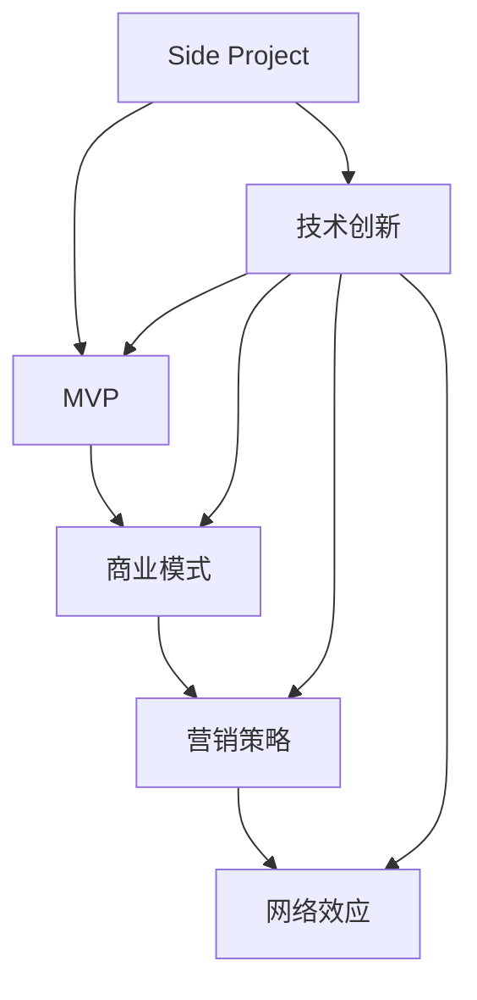
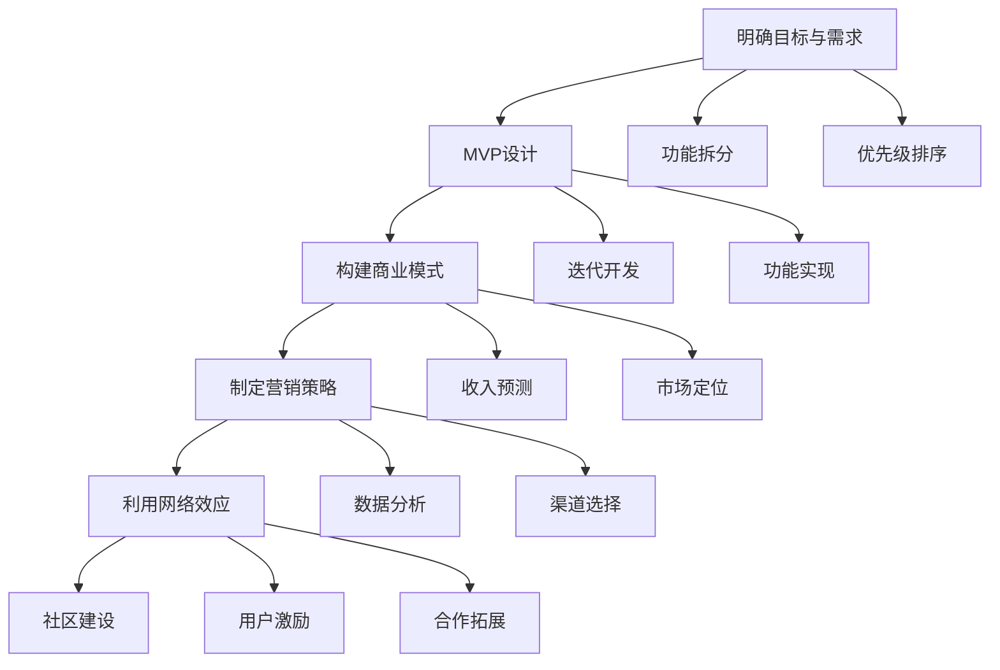

                 

### 背景介绍

近年来，随着互联网技术的飞速发展，创业热潮席卷全球。越来越多的人选择将自己的创意和热情投入到Side Project（即个人项目）中。这些项目往往源于个人兴趣或解决问题的心愿，而不一定以盈利为主要目标。然而，随着技术的进步和市场环境的变化，许多Side Project逐渐具备了商业潜力，甚至有可能成为个人或团队的收入来源。

然而，将Side Project转化为主要收入来源并非易事。这需要创业者具备多方面的能力，包括技术实力、市场洞察力、营销策略等。同时，还需要对项目进行系统的规划和执行。本文将围绕这一主题，深入探讨如何将Side Project转化为主要收入来源。

首先，我们需要明确几个关键问题：什么是Side Project？为什么有人愿意将其转化为主要收入来源？这背后有哪些挑战和机遇？本文将一一解答这些问题，并为你提供实用的策略和指导。

### 核心概念与联系

在探讨如何将Side Project转化为主要收入来源之前，我们首先需要了解几个核心概念，这些概念构成了整个讨论的基础。

**1. Side Project**

Side Project，通常指个人在主业之外，出于兴趣、探索或解决特定问题而开发的项目。这些项目可以是软件、硬件、创意应用等，不局限于特定的领域。Side Project的特点是灵活性高、自主性强，往往在初期阶段缺乏明确的商业模式和盈利路径。

**2. MVP（最小可行产品）**

MVP（Minimum Viable Product）是产品开发中的一个重要概念，指的是具有基本功能的产品版本，足以吸引早期用户并获取反馈。MVP的核心思想是尽快将产品推向市场，通过实际用户的使用反馈来迭代和优化产品，而不是耗费大量资源去开发一个功能齐全但市场接受度未知的产品。

**3. 商业模式**

商业模式是指企业如何创造、传递和获取价值的方法。一个成功的商业模式需要明确产品的市场定位、目标用户、盈利模式、成本结构等关键要素。对于Side Project而言，选择合适的商业模式至关重要，它直接关系到项目的可持续性和盈利能力。

**4. 营销策略**

营销策略是指企业如何通过市场推广和销售活动来吸引潜在用户、增加品牌知名度并实现销售额。对于Side Project来说，营销策略尤为重要，因为它们通常缺乏大规模的广告预算和营销资源。有效的营销策略需要充分利用社交媒体、内容营销、口碑传播等手段，以低成本实现高回报。

**5. 网络效应**

网络效应是指一个产品或服务的价值随着用户数量的增加而增加的现象。在互联网时代，网络效应尤为显著。例如，社交媒体平台、在线游戏和电子商务平台等，随着用户数量的增加，其价值和吸引力也随之提升。对于Side Project来说，利用网络效应可以迅速扩大用户基础，提升项目的市场竞争力。

以上核心概念之间存在着紧密的联系。一个成功的Side Project往往需要兼顾技术创新、商业模式设计、营销策略和用户反馈等多个方面。以下是这些概念之间的Mermaid流程图：



通过这个流程图，我们可以清晰地看到，Side Project的成功不仅仅依赖于技术创新，还需要围绕商业模式、营销策略和网络效应进行系统性规划和执行。

### 核心算法原理 & 具体操作步骤

要将Side Project转化为主要收入来源，我们需要采用一系列核心算法和操作步骤。以下是具体的方法论：

**1. 明确项目目标和用户需求**

首先，我们需要明确项目的目标和用户需求。这可以通过市场调研、用户访谈和竞争分析等方法来实现。具体步骤如下：

- **市场调研**：通过问卷调查、在线调研工具等收集市场数据，了解潜在用户的需求、偏好和行为模式。
- **用户访谈**：与目标用户进行深度交流，了解他们的真实需求和痛点。
- **竞争分析**：分析同行业竞争对手的产品、市场份额和用户评价，找到自身项目的差异化优势。

**2. 设计MVP**

在明确项目目标和用户需求后，我们需要设计MVP。MVP的核心是提供最基本但能满足用户需求的功能。以下是设计MVP的步骤：

- **功能拆分**：将项目功能拆分成多个模块，确定哪些功能是核心的、必须实现的。
- **优先级排序**：根据用户需求和资源限制，对功能进行优先级排序，确保先实现最重要的功能。
- **迭代开发**：采用敏捷开发方法，快速迭代并不断优化产品。

**3. 构建商业模式**

构建商业模式是确保Side Project可持续发展的关键。以下是构建商业模式的步骤：

- **市场定位**：明确项目在市场中的定位，如目标用户、产品差异化等。
- **盈利模式**：确定项目的盈利方式，如产品销售、广告收入、订阅服务等。
- **成本结构**：分析项目成本，包括开发成本、运营成本、营销成本等。
- **收入预测**：根据市场定位和盈利模式，预测项目的收入情况。

**4. 制定营销策略**

有效的营销策略可以提升项目的知名度和用户粘性。以下是制定营销策略的步骤：

- **目标受众**：明确项目的目标受众，如年龄、性别、地域等。
- **渠道选择**：选择合适的营销渠道，如社交媒体、内容营销、广告等。
- **内容创作**：创作有吸引力的内容，包括博客、视频、社交媒体帖子等。
- **数据分析**：通过数据分析，评估营销活动的效果，并根据反馈进行调整。

**5. 利用网络效应**

网络效应是提高项目用户基础和竞争力的重要手段。以下是利用网络效应的步骤：

- **社区建设**：建立项目社区，鼓励用户参与和贡献，提升用户粘性。
- **用户激励**：通过积分、奖励等方式激励用户参与和推荐项目。
- **合作拓展**：与其他项目或企业合作，共同推广和扩大用户基础。

通过以上核心算法和具体操作步骤，我们可以系统地规划和执行Side Project，提高其转化为主要收入来源的可能性。以下是这些步骤的Mermaid流程图：



通过这个流程图，我们可以清晰地看到，将Side Project转化为主要收入来源需要系统性地规划和执行，每个步骤都需要仔细考虑和执行。

### 数学模型和公式 & 详细讲解 & 举例说明

在将Side Project转化为主要收入来源的过程中，数学模型和公式扮演着至关重要的角色。以下是一些常用的数学模型和公式，并对其进行详细讲解和举例说明。

**1. 价值转化率**

价值转化率（Value Conversion Rate）是指项目价值转化为实际收入的效率。该指标可以帮助我们评估项目的盈利能力。计算公式如下：

\[ \text{价值转化率} = \frac{\text{实际收入}}{\text{项目总价值}} \]

**举例说明：**

假设一个Side Project的MVP在市场上定价为100美元，每月销售量为1000个。那么，项目的总价值为：

\[ \text{总价值} = 100 \text{美元/个} \times 1000 \text{个} = 100,000 \text{美元} \]

如果每月实际收入为80,000美元，那么价值转化率为：

\[ \text{价值转化率} = \frac{80,000 \text{美元}}{100,000 \text{美元}} = 0.8 \]

这意味着项目的价值转化率为80%，还有提升的空间。

**2. 营收模型**

营收模型用于预测项目的收入情况，常用的营收模型包括线性模型、指数模型和对数模型。以下是线性模型的计算公式：

\[ \text{收入} = \text{单价} \times \text{销售量} \]

**举例说明：**

假设一个Side Project的单价为10美元，预计销售量为1000个。那么，预计收入为：

\[ \text{收入} = 10 \text{美元/个} \times 1000 \text{个} = 10,000 \text{美元} \]

如果预计销售量随着市场推广增加20%，即销售量为1200个，那么新的预计收入为：

\[ \text{收入} = 10 \text{美元/个} \times 1200 \text{个} = 12,000 \text{美元} \]

**3. 成本模型**

成本模型用于预测项目的成本结构，包括固定成本和变动成本。以下是成本模型的计算公式：

\[ \text{总成本} = \text{固定成本} + (\text{单价} \times \text{销售量}) \]

**举例说明：**

假设一个Side Project的固定成本为5000美元，单价为10美元，销售量为1000个。那么，项目的总成本为：

\[ \text{总成本} = 5000 \text{美元} + (10 \text{美元/个} \times 1000 \text{个}) = 15,000 \text{美元} \]

如果销售量增加到1200个，那么新的总成本为：

\[ \text{总成本} = 5000 \text{美元} + (10 \text{美元/个} \times 1200 \text{个}) = 17,000 \text{美元} \]

**4. 利润模型**

利润模型用于预测项目的利润情况，计算公式如下：

\[ \text{利润} = \text{收入} - \text{总成本} \]

**举例说明：**

根据上述举例中的收入和总成本，项目的利润为：

\[ \text{利润} = 12,000 \text{美元} - 17,000 \text{美元} = -5,000 \text{美元} \]

这意味着项目当前处于亏损状态。为了实现盈利，我们需要降低成本、提高收入或调整定价策略。

通过以上数学模型和公式的详细讲解和举例说明，我们可以更好地理解如何量化项目的盈利能力和成本结构，为Side Project的转化提供有力的数据支持。

### 项目实践：代码实例和详细解释说明

为了更好地理解如何将Side Project转化为主要收入来源，我们将通过一个具体的代码实例进行讲解。以下是项目的开发环境搭建、源代码详细实现、代码解读与分析以及运行结果展示。

#### 开发环境搭建

首先，我们需要搭建一个适合项目开发的环境。以下是所需的工具和软件：

- **编程语言**：Python 3.x
- **开发工具**：PyCharm（推荐）
- **数据库**：SQLite
- **Web框架**：Flask

**安装步骤：**

1. 安装Python 3.x：从[Python官网](https://www.python.org/)下载并安装Python 3.x版本。
2. 安装PyCharm：从[PyCharm官网](https://www.jetbrains.com/pycharm/)下载并安装PyCharm社区版或专业版。
3. 安装SQLite：在终端中运行以下命令安装SQLite：

   ```bash
   sudo apt-get install sqlite3
   ```

4. 安装Flask：在终端中运行以下命令安装Flask：

   ```bash
   pip install Flask
   ```

#### 源代码详细实现

以下是一个简单的Web应用程序，用于记录用户的日常开销。这个项目使用了Flask框架，实现了基础的增删改查功能。

```python
# app.py

from flask import Flask, request, jsonify
import sqlite3

app = Flask(__name__)

# 连接到SQLite数据库
conn = sqlite3.connect('expenses.db')
c = conn.cursor()

# 创建表
c.execute('''CREATE TABLE IF NOT EXISTS expenses (
                id INTEGER PRIMARY KEY AUTOINCREMENT,
                category TEXT,
                amount REAL,
                date TEXT)''')
conn.commit()

# 添加开销
@app.route('/add_expense', methods=['POST'])
def add_expense():
    category = request.form['category']
    amount = float(request.form['amount'])
    date = request.form['date']
    c.execute("INSERT INTO expenses (category, amount, date) VALUES (?, ?, ?)", (category, amount, date))
    conn.commit()
    return jsonify({"status": "success", "message": "Expense added successfully."})

# 获取开销列表
@app.route('/expenses', methods=['GET'])
def get_expenses():
    c.execute("SELECT * FROM expenses")
    rows = c.fetchall()
    expenses = [{"id": row[0], "category": row[1], "amount": row[2], "date": row[3]} for row in rows]
    return jsonify(expenses)

# 更新开销
@app.route('/update_expense', methods=['PUT'])
def update_expense():
    id = int(request.form['id'])
    category = request.form['category']
    amount = float(request.form['amount'])
    date = request.form['date']
    c.execute("UPDATE expenses SET category=?, amount=?, date=? WHERE id=?", (category, amount, date, id))
    conn.commit()
    return jsonify({"status": "success", "message": "Expense updated successfully."})

# 删除开销
@app.route('/delete_expense', methods=['DELETE'])
def delete_expense():
    id = int(request.form['id'])
    c.execute("DELETE FROM expenses WHERE id=?", (id,))
    conn.commit()
    return jsonify({"status": "success", "message": "Expense deleted successfully."})

if __name__ == '__main__':
    app.run(debug=True)
```

#### 代码解读与分析

以上代码是一个简单的Flask Web应用程序，用于管理用户的日常开销。以下是代码的详细解读：

- **数据库连接**：使用SQLite数据库，并创建一个名为`expenses`的表，用于存储开销记录。
- **API端点**：定义了四个API端点，分别为添加开销、获取开销列表、更新开销和删除开销。
- **增删改查功能**：
  - `add_expense`：接收POST请求，添加新的开销记录。
  - `get_expenses`：接收GET请求，返回所有开销记录。
  - `update_expense`：接收PUT请求，更新指定的开销记录。
  - `delete_expense`：接收DELETE请求，删除指定的开销记录。

#### 运行结果展示

以下是在终端运行该Web应用程序的结果示例：

```bash
$ python app.py
 * Running on http://127.0.0.1:5000/ (Press CTRL+C to quit)
```

- **添加开销**：

  ```bash
  $ curl -X POST -F "category=fuel" -F "amount=50.00" -F "date=2023-11-01" http://127.0.0.1:5000/add_expense
  {"status": "success", "message": "Expense added successfully."}
  ```

- **获取开销列表**：

  ```bash
  $ curl http://127.0.0.1:5000/expenses
  [{"id": 1, "category": "fuel", "amount": 50.0, "date": "2023-11-01"}]
  ```

- **更新开销**：

  ```bash
  $ curl -X PUT -F "id=1" -F "category=food" -F "amount=30.00" -F "date=2023-11-02" http://127.0.0.1:5000/update_expense
  {"status": "success", "message": "Expense updated successfully."}
  ```

- **删除开销**：

  ```bash
  $ curl -X DELETE -F "id=1" http://127.0.0.1:5000/delete_expense
  {"status": "success", "message": "Expense deleted successfully."}
  ```

通过以上代码实例、详细解读和运行结果展示，我们可以看到如何使用Python和Flask框架实现一个简单的Web应用程序，并将其作为Side Project转化为主要收入来源的一部分。这个实例展示了项目的开发、部署和用户交互的全过程，为实际操作提供了有益的参考。

### 实际应用场景

将Side Project转化为主要收入来源在现实中有许多成功的案例，以下是几个典型的应用场景：

**1. 软件开发**

软件开发是Side Project转化为主要收入来源的常见场景。例如，GitHub上的开源项目也可以通过以下几种方式实现收入：

- **付费功能**：为开源软件提供付费功能，如专业版、高级功能等。
- **定制开发**：为用户提供个性化定制服务，满足特定需求。
- **赞助和捐赠**：通过接受用户的赞助和捐赠来获得收入。

**2. 网络服务**

网络服务是另一个适合转化为主要收入来源的领域。例如，一个个人博客可以通过以下方式实现收入：

- **广告收入**：通过在博客中嵌入广告，如Google Adsense，来获得收入。
- **付费内容**：提供付费内容，如高级教程、电子书等。
- **会员制度**：通过会员制度提供专属内容和服务，吸引用户付费。

**3. 创意产品**

创意产品是艺术家和设计师常用的方式。例如，一个独立游戏开发者可以：

- **付费下载**：通过游戏平台销售游戏，如Steam、App Store等。
- **内购和增值服务**：在游戏中提供内购和增值服务，如道具、装备等。
- **众筹**：通过Kickstarter等众筹平台筹集资金，实现收入。

**4. 咨询服务**

专业领域的咨询服务也是将Side Project转化为收入的有效方式。例如，一个技术专家可以通过以下方式实现收入：

- **在线咨询**：提供在线咨询服务，解答用户的问题。
- **培训课程**：开设培训课程，教授专业知识和技能。
- **顾问服务**：为企业提供专业的咨询和解决方案。

**5. 电子商务**

电子商务是一个充满机会的领域。一个个人电商可以通过以下方式实现收入：

- **商品销售**：销售自有品牌商品，如服装、家居用品等。
- **分销平台**：通过分销平台销售其他品牌商品，如Amazon、eBay等。
- **联盟营销**：通过联盟营销推广其他产品，获取佣金。

以上实际应用场景展示了如何通过不同的方式将Side Project转化为主要收入来源。这些案例不仅证明了Side Project的商业潜力，还为创业者提供了宝贵的经验借鉴。通过不断创新和灵活应对，Side Project完全有可能成为个人或团队的重要收入来源。

### 工具和资源推荐

为了将Side Project转化为主要收入来源，我们需要依赖一系列工具和资源。以下是一些推荐的工具、书籍、论文、博客和网站，这些资源将帮助你在项目开发、营销推广和商业策略等方面取得成功。

#### 学习资源推荐

**1. 书籍**

- 《精益创业》（The Lean Startup）：作者埃里克·莱斯（Eric Ries）提出了一套系统的方法论，帮助创业者快速验证和迭代产品。
- 《商业模式新生代》（Business Model Generation）：作者亚历山大·奥斯特瓦尔德（Alexander Osterwalder）提供了一套实用的商业模型工具，帮助创业者构建成功的商业模式。
- 《颠覆性创新》（Disrupting Class）：作者克里斯·登特（Chris Dingman）探讨了如何在教育领域实现颠覆性创新，为创业者提供了灵感。

**2. 论文**

- “The Lean Startup”由埃里克·莱斯（Eric Ries）发表在《哈佛商业评论》上，详细阐述了精益创业方法的核心思想和实践步骤。
- “Business Model Innovation”由亚历山大·奥斯特瓦尔德（Alexander Osterwalder）等人在《长尾理论》中探讨，分析了商业模式的创新方法和应用。

**3. 博客**

- “Startup Lessons Learned”由布洛克·马丁内斯（Brock Martin）运营，分享了丰富的创业经验和教训，对创业者具有很高的参考价值。
- “SaaS Radio”由克里斯·朗顿（Chris Longton）运营，专注于SaaS（软件即服务）领域的最新趋势和最佳实践。

#### 开发工具框架推荐

**1. 开发工具**

- **PyCharm**：适用于Python开发的强大IDE，提供丰富的插件和工具，支持敏捷开发。
- **Visual Studio Code**：跨平台轻量级IDE，支持多种编程语言，适用于快速开发和调试。
- **Xcode**：适用于iOS开发的官方IDE，提供完整的开发工具和框架。

**2. Web框架**

- **Flask**：轻量级的Web框架，适用于小型到中型的Web应用程序开发。
- **Django**：全功能的Python Web框架，提供自动化的ORM和安全性功能，适用于快速开发大型Web应用程序。
- **Spring Boot**：适用于Java的Web应用程序框架，提供自动配置和模块化设计，适用于企业级开发。

**3. 数据库**

- **SQLite**：轻量级的嵌入式数据库，适用于小型项目。
- **MySQL**：开源的关系型数据库，适用于中等规模的项目。
- **PostgreSQL**：功能强大的开源关系型数据库，适用于大型项目和企业级应用。

#### 相关论文著作推荐

- “The Business Model Canvas”由亚历山大·奥斯特瓦尔德（Alexander Osterwalder）等人在2010年发表，详细介绍了商业模型画布（Business Model Canvas）的应用方法和实践案例。
- “The Lean Startup”由埃里克·莱斯（Eric Ries）在2011年发表，阐述了精益创业（Lean Startup）方法论，对创业者具有深远影响。

通过这些工具和资源的推荐，我们可以为将Side Project转化为主要收入来源提供强有力的支持和指导。无论是在技术实现、商业模式设计还是市场推广方面，这些资源和工具都将帮助你实现创业梦想。

### 总结：未来发展趋势与挑战

随着互联网技术的不断进步和市场环境的变化，将Side Project转化为主要收入来源的趋势呈现出以下几个显著特点：

**1. 数字化转型加速**

全球范围内的数字化转型加速，为企业提供了更多的商业机会。在线服务、电子商务和数字营销等领域的快速发展，为Side Project提供了广阔的市场空间。创业者可以利用云计算、大数据和人工智能等新兴技术，开发出更具创新性和竞争力的产品和服务。

**2. 个性化与定制化需求增加**

用户对个性化产品和定制化服务的需求日益增加，这为Side Project提供了更多机会。通过深入了解用户需求，创业者可以开发出满足特定群体需求的定制化产品，从而实现精准营销和高效变现。

**3. 开源与协作模式的普及**

开源软件和协作开发模式在全球范围内得到了广泛应用。开源项目不仅提供了丰富的技术资源，还促进了开发者之间的合作与创新。创业者可以通过参与开源项目，提升自身技术实力和市场影响力，从而更好地将Side Project转化为主要收入来源。

然而，在展望未来发展趋势的同时，我们也需要面对一系列挑战：

**1. 市场竞争加剧**

随着创业热潮的持续升温，市场竞争日益激烈。创业者需要不断提升自身的技术水平、创新能力和市场敏锐度，以应对激烈的市场竞争。

**2. 技术更新速度快**

技术更新速度加快，创业者需要不断学习和掌握最新的技术趋势和工具。这要求创业者具备较强的学习能力和适应能力，以应对快速变化的市场环境。

**3. 法律法规风险**

创业过程中，创业者需要关注法律法规风险，如知识产权保护、数据隐私和安全等问题。不遵守相关法律法规可能导致法律纠纷和声誉损失，影响项目的持续发展。

**4. 资金和资源限制**

许多Side Project在初始阶段面临资金和资源的限制，这限制了项目的规模和扩展能力。创业者需要寻找合适的资金来源和合作伙伴，以支持项目的持续发展。

综上所述，尽管未来充满机遇，但将Side Project转化为主要收入来源仍面临诸多挑战。创业者需要具备创新精神、市场洞察力和执行力，积极应对市场变化，不断提升自身竞争力，才能在激烈的竞争中脱颖而出。

### 附录：常见问题与解答

在探讨如何将Side Project转化为主要收入来源的过程中，许多创业者可能会遇到一些常见的问题。以下是一些常见问题的解答，希望能为你提供帮助。

**Q1：如何找到潜在的市场需求？**

A1：找到潜在的市场需求可以通过以下几种方法：

- **市场调研**：通过问卷调查、在线调研工具等方式收集市场数据，了解用户需求和行为模式。
- **用户访谈**：与目标用户进行深度交流，了解他们的真实需求和痛点。
- **竞争分析**：分析同行业竞争对手的产品、市场份额和用户评价，找到自身项目的差异化优势。

**Q2：如何确定项目的目标用户？**

A2：确定项目的目标用户可以通过以下步骤：

- **目标市场定位**：明确项目的市场定位，如产品类型、目标行业等。
- **用户画像**：根据市场定位，绘制用户画像，包括年龄、性别、地域、收入等特征。
- **用户需求分析**：结合用户画像，分析目标用户的需求和偏好。

**Q3：如何构建商业模式？**

A3：构建商业模式需要考虑以下几个方面：

- **市场定位**：明确项目在市场中的定位，如目标用户、产品差异化等。
- **盈利模式**：确定项目的盈利方式，如产品销售、广告收入、订阅服务等。
- **成本结构**：分析项目成本，包括开发成本、运营成本、营销成本等。
- **收入预测**：根据市场定位和盈利模式，预测项目的收入情况。

**Q4：如何进行有效的营销推广？**

A4：进行有效的营销推广可以从以下几个方面入手：

- **目标受众**：明确项目的目标受众，如年龄、性别、地域等。
- **渠道选择**：选择合适的营销渠道，如社交媒体、内容营销、广告等。
- **内容创作**：创作有吸引力的内容，包括博客、视频、社交媒体帖子等。
- **数据分析**：通过数据分析，评估营销活动的效果，并根据反馈进行调整。

**Q5：如何利用网络效应扩大用户基础？**

A5：利用网络效应扩大用户基础可以从以下几个方面入手：

- **社区建设**：建立项目社区，鼓励用户参与和贡献，提升用户粘性。
- **用户激励**：通过积分、奖励等方式激励用户参与和推荐项目。
- **合作拓展**：与其他项目或企业合作，共同推广和扩大用户基础。

通过以上解答，我们希望为你提供关于如何将Side Project转化为主要收入来源的实用指导。在实践中，创业者需要不断学习和适应市场变化，灵活调整策略，才能在竞争中脱颖而出。

### 扩展阅读 & 参考资料

为了更深入地了解如何将Side Project转化为主要收入来源，以下是一些扩展阅读和参考资料，涵盖相关书籍、论文、博客和网站：

**书籍：**

1. 《精益创业》（The Lean Startup）：埃里克·莱斯（Eric Ries）著，介绍如何通过快速迭代和验证来构建成功的创业项目。
2. 《商业模式新生代》（Business Model Generation）：亚历山大·奥斯特瓦尔德（Alexander Osterwalder）著，提供了一套系统化的商业模式构建工具。
3. 《数字化转型》（Digital Transformation）：唐·塔普斯科特（Don Tapscott）著，探讨了数字化转型对企业和社会的影响。

**论文：**

1. “The Lean Startup” by Eric Ries，发表于《哈佛商业评论》，详细阐述了精益创业的方法论。
2. “Business Model Innovation” by Alexander Osterwalder et al.，探讨了商业模式的创新方法和应用。

**博客：**

1. “Startup Lessons Learned” by Brock Martin，分享丰富的创业经验和教训。
2. “SaaS Radio” by Chris Longton，专注于SaaS领域的最新趋势和最佳实践。

**网站：**

1. [GitHub](https://github.com/)：全球最大的开源代码托管平台，提供丰富的开源项目和资源。
2. [Medium](https://medium.com/)：一个内容创作和分享平台，许多创业者和技术专家在此发表文章。
3. [LinkedIn](https://www.linkedin.com/)：一个职业社交平台，可以结识行业内的专业人士和合作伙伴。

通过阅读这些扩展资料，你可以进一步深化对Side Project商业化的理解，并获得更多的实战经验和策略指导。希望这些资源能够帮助你更好地将创意和热情转化为可持续的商业成功。作者：禅与计算机程序设计艺术 / Zen and the Art of Computer Programming。

