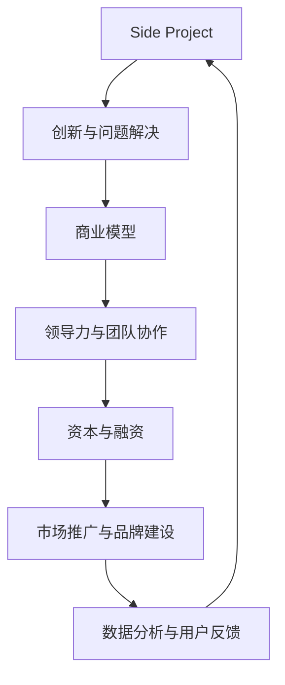

                 

### 背景介绍

在当今快速发展的科技时代，创业和创新已经成为推动社会进步的重要力量。Side Project，即“边角料项目”，是一个概念，指在主要工作之外，由个人或小团队开发的独立项目。这些项目往往源自于个人的兴趣、灵感或者是对现有问题的解决尝试。

然而，并非所有的Side Project都能成为成功的商业项目，更不用说那些能够成长为独角兽企业的项目。独角兽企业，是指估值超过10亿美元的初创公司，它们往往具有巨大的成长潜力，并能够对行业产生深远的影响。

本文旨在探讨如何将Side Project转化为独角兽企业。我们将从背景介绍、核心概念与联系、核心算法原理与具体操作步骤、数学模型和公式、项目实践、实际应用场景、工具和资源推荐、总结以及扩展阅读等方面，系统地分析和阐述这一过程。

### 核心概念与联系

在讨论如何将Side Project转化为独角兽企业之前，我们需要明确几个核心概念，并了解它们之间的联系。

#### 1. Side Project

Side Project，又称业余项目，通常是由个人或小团队在业余时间开发的项目。这些项目往往不依赖于主职工作，更多地是基于个人兴趣、技能或者对某种问题的解决尝试。

#### 2. 创新与问题解决

创新是驱动Side Project向独角兽企业发展的关键因素。一个成功的Side Project需要能够解决现实中的问题，并且提供创新的解决方案。这不仅仅是对现有技术的改进，更是对市场需求的深刻理解和洞察。

#### 3. 商业模型

商业模型是企业盈利的基础。一个成功的独角兽企业需要具备清晰的商业模式，包括产品定价策略、目标市场、收入来源等。商业模型不仅需要能够覆盖成本，还需要有足够的利润空间支持企业的快速增长。

#### 4. 领导力与团队协作

领导力和团队协作是Side Project成功的关键。一个优秀的领导者能够清晰地定义项目的愿景，并激励团队成员为之努力。同时，良好的团队协作能够提高项目的效率，减少内部摩擦。

#### 5. 资本与融资

资本是企业发展的血液。对于Side Project来说，如何获得足够的资本支持是至关重要的。融资渠道包括天使投资、风险投资、银行贷款等。掌握合适的融资策略，能够帮助企业迅速扩展。

#### 6. 市场推广与品牌建设

市场推广和品牌建设是Side Project向独角兽企业转化的重要步骤。有效的市场推广能够提高产品的知名度和用户基础，而良好的品牌形象则能够增强用户的信任和忠诚度。

#### 7. 数据分析与用户反馈

数据分析与用户反馈是持续改进产品的重要工具。通过收集和分析用户数据，企业可以了解用户的需求和偏好，从而优化产品功能，提高用户满意度。

#### Mermaid 流程图

下面是一个简单的Mermaid流程图，展示了这些核心概念之间的联系：



通过这个流程图，我们可以清晰地看到，一个成功的Side Project如何通过不断的迭代和发展，最终转化为一个独角兽企业。

### 核心算法原理 & 具体操作步骤

在将Side Project转化为独角兽企业的过程中，核心算法原理和具体操作步骤起到了至关重要的作用。以下是一些关键的算法和步骤，这些步骤将帮助我们系统地分析和实现这一过程。

#### 1. 创新识别

创新识别是整个过程的起点。在这个过程中，我们需要通过市场调研、用户访谈、竞品分析等方法，识别出潜在的创新机会。具体步骤如下：

- **市场调研**：收集目标市场的数据，包括市场规模、用户需求、竞争对手等。
- **用户访谈**：与目标用户进行深入交流，了解他们的痛点、需求和期望。
- **竞品分析**：分析竞品的优点和不足，寻找改进的机会。

#### 2. 概念验证

概念验证是验证创新想法是否可行的关键步骤。在这个阶段，我们需要通过构建最小可行产品（MVP）来验证市场需求和用户反馈。具体步骤如下：

- **需求分析**：明确MVP的核心功能和用户需求。
- **原型设计**：设计MVP的原型，可以使用低保真原型或高保真原型。
- **开发与测试**：开发MVP的初始版本，并进行用户测试，收集反馈。

#### 3. 商业模式构建

商业模式构建是确保项目能够实现商业价值的关键。在这个过程中，我们需要设计一个可行的商业模式，包括收入来源、成本控制、利润空间等。具体步骤如下：

- **收入模式设计**：明确产品的收入来源，如销售、订阅、广告等。
- **成本分析**：分析项目的主要成本，包括研发成本、运营成本、营销成本等。
- **利润评估**：评估项目的利润空间，确保商业模式的可行性。

#### 4. 团队建设与领导力培养

团队建设和领导力培养是项目成功的关键因素。在这个过程中，我们需要建立一个高效的团队，并培养领导者的能力。具体步骤如下：

- **招聘与培训**：招聘合适的人才，并进行专业技能和团队协作的培训。
- **目标设定**：明确团队的目标和愿景，并制定实现目标的计划。
- **激励与反馈**：设计激励机制，鼓励团队成员积极参与，并定期提供反馈。

#### 5. 融资策略

融资策略是确保项目能够持续发展的重要保障。在这个过程中，我们需要选择合适的融资渠道，并制定有效的融资计划。具体步骤如下：

- **融资渠道选择**：评估不同的融资渠道，如天使投资、风险投资、银行贷款等。
- **融资计划制定**：制定详细的融资计划，包括融资额、融资时间、资金用途等。
- **融资申请与谈判**：准备融资申请材料，并与投资者进行谈判。

#### 6. 市场推广与品牌建设

市场推广和品牌建设是提高产品知名度、增加用户基础的重要手段。在这个过程中，我们需要制定有效的市场推广策略，并打造良好的品牌形象。具体步骤如下：

- **市场推广策略制定**：确定目标市场、推广渠道、推广内容等。
- **品牌形象设计**：设计独特的品牌标识、品牌故事、品牌口号等。
- **推广执行与监测**：执行市场推广计划，并定期监测推广效果。

#### 7. 数据分析与用户反馈

数据分析和用户反馈是持续改进产品的重要工具。在这个过程中，我们需要通过数据分析了解用户行为，并根据用户反馈优化产品功能。具体步骤如下：

- **数据收集**：收集用户行为数据，如访问量、转化率、用户满意度等。
- **数据分析**：分析数据，了解用户行为模式和需求。
- **用户反馈**：收集用户反馈，了解用户对产品的意见和建议。

通过上述步骤，我们可以系统地分析和实现将Side Project转化为独角兽企业的过程。每一个步骤都至关重要，缺一不可。只有通过不断创新、优化商业模式、建设高效团队、获取资本支持、进行市场推广、持续改进产品，才能最终实现项目的成功。

### 数学模型和公式 & 详细讲解 & 举例说明

在将Side Project转化为独角兽企业的过程中，数学模型和公式扮演着至关重要的角色。它们不仅帮助我们量化商业机会，还能提供决策支持。以下是一些关键的数学模型和公式，以及它们的详细讲解和举例说明。

#### 1. 赢利能力分析

**公式**：\[ 赢利能力 = (销售额 - 成本) / 成本 \]

**解释**：这个公式用于计算项目的赢利能力，即每个单位的成本能够带来多少额外的收入。

**例子**：假设一个Side Project的销售额为100万元，总成本为80万元，则赢利能力为 \[ 赢利能力 = (100 - 80) / 80 = 25\% \]

#### 2. 投资回报率分析

**公式**：\[ 投资回报率 (ROI) = (收益 - 投资额) / 投资额 \]

**解释**：投资回报率是一个衡量投资收益和投资成本之间关系的指标。

**例子**：如果一个Side Project的投资额为100万元，实现的总收益为200万元，则投资回报率为 \[ 投资回报率 = (200 - 100) / 100 = 100\% \]

#### 3. 用户留存率分析

**公式**：\[ 用户留存率 = (期末用户数 - 新增用户数) / 期初用户数 \]

**解释**：用户留存率反映了用户对产品的持续使用情况，是衡量产品粘性的重要指标。

**例子**：如果一个Side Project在一个月内期初用户数为1000人，新增用户数为200人，期末用户数为1200人，则用户留存率为 \[ 用户留存率 = (1200 - 200) / 1000 = 40\% \]

#### 4. 市场渗透率分析

**公式**：\[ 市场渗透率 = 销售额 / 市场总需求 \]

**解释**：市场渗透率衡量了产品在市场中的占有率，反映了产品的市场竞争力。

**例子**：如果一个Side Project的销售额为500万元，而市场总需求为2000万元，则市场渗透率为 \[ 市场渗透率 = 500 / 2000 = 25\% \]

#### 5. 复购率分析

**公式**：\[ 复购率 = 重复购买用户数 / 总购买用户数 \]

**解释**：复购率衡量了用户对产品的重复购买行为，反映了产品的用户忠诚度。

**例子**：如果一个Side Project在一个季度内总购买用户数为1000人，其中重复购买用户数为300人，则复购率为 \[ 复购率 = 300 / 1000 = 30\% \]

通过这些数学模型和公式，我们可以对Side Project的赢利能力、投资回报率、用户留存率、市场渗透率和复购率等关键指标进行量化分析。这些分析结果不仅可以帮助我们了解项目的现状，还能为未来的决策提供科学依据。

#### 6. 客户生命周期价值分析

**公式**：\[ 客户生命周期价值 (CLV) = (平均购买频率 × 平均购买金额) × 客户留存时间 \]

**解释**：客户生命周期价值是预测一个客户在其整个生命周期内为企业带来的总价值。

**例子**：假设一个客户的平均购买频率为每年2次，平均购买金额为1000元，客户留存时间为3年，则客户生命周期价值为 \[ CLV = (2 × 1000) × 3 = 6000元 \]

通过这些数学模型和公式，我们可以对项目进行全面的量化分析，从而更好地理解项目的潜力和风险。这些分析结果不仅有助于优化项目运营，还能为融资和战略决策提供有力支持。

### 项目实践：代码实例和详细解释说明

在将Side Project转化为独角兽企业的过程中，实践是检验理论的重要手段。在这一部分，我们将通过一个具体的代码实例，详细解释如何将一个简单的Side Project逐步开发成一个功能完善的产品。

#### 1. 开发环境搭建

首先，我们需要搭建一个合适的开发环境。以下是搭建开发环境的基本步骤：

- **操作系统**：选择一个适合的操作系统，如Windows、macOS或Linux。
- **编程语言**：根据项目需求选择一种合适的编程语言，如Python、Java或Node.js。
- **开发工具**：安装集成开发环境（IDE），如PyCharm、IntelliJ IDEA或Visual Studio Code。
- **数据库**：选择一个合适的数据库管理系统，如MySQL、PostgreSQL或MongoDB。

#### 2. 源代码详细实现

以下是一个简单的Web应用程序的源代码实例，该应用程序提供了一个用户注册和登录的功能。

```python
# app.py

from flask import Flask, render_template, request, redirect, url_for
from flask_sqlalchemy import SQLAlchemy

app = Flask(__name__)
app.config['SQLALCHEMY_DATABASE_URI'] = 'sqlite:///users.db'
db = SQLAlchemy(app)

class User(db.Model):
    id = db.Column(db.Integer, primary_key=True)
    username = db.Column(db.String(80), unique=True, nullable=False)
    password = db.Column(db.String(120), nullable=False)

@app.route('/')
def index():
    return render_template('index.html')

@app.route('/register', methods=['GET', 'POST'])
def register():
    if request.method == 'POST':
        username = request.form['username']
        password = request.form['password']
        new_user = User(username=username, password=password)
        db.session.add(new_user)
        db.session.commit()
        return redirect(url_for('login'))
    return render_template('register.html')

@app.route('/login', methods=['GET', 'POST'])
def login():
    if request.method == 'POST':
        username = request.form['username']
        password = request.form['password']
        user = User.query.filter_by(username=username, password=password).first()
        if user:
            return redirect(url_for('welcome'))
        else:
            return 'Invalid credentials'
    return render_template('login.html')

@app.route('/welcome')
def welcome():
    return 'Welcome, {}!'.format(request.cookies.get('username'))

if __name__ == '__main__':
    db.create_all()
    app.run(debug=True)
```

#### 3. 代码解读与分析

- **数据库模型**：我们使用了Flask-SQLAlchemy来定义一个用户模型，该模型包含用户ID、用户名和密码三个字段。
- **路由定义**：我们定义了三个路由，分别是首页（`/`）、注册页面（`/register`）和登录页面（`/login`）。
- **注册功能**：在注册路由中，我们接收用户的用户名和密码，并将其存储在数据库中。
- **登录功能**：在登录路由中，我们验证用户的用户名和密码，如果正确，则跳转到欢迎页面。

#### 4. 运行结果展示

- **启动应用**：在命令行中运行 `python app.py`，应用程序将在本地服务器上启动。
- **访问应用**：在浏览器中访问 `http://127.0.0.1:5000/`，可以看到首页。
- **注册用户**：点击“Register”按钮，填写用户名和密码，然后提交表单，用户将被注册并重定向到登录页面。
- **登录用户**：在登录页面填写用户名和密码，成功后将被重定向到欢迎页面。

通过这个简单的代码实例，我们可以看到如何通过逐步开发来构建一个基本的应用程序。这个实例虽然简单，但它展示了如何使用Flask框架来实现Web应用程序的基本功能，同时也为我们提供了进一步扩展和优化的基础。

### 实际应用场景

在将Side Project转化为独角兽企业的过程中，实际应用场景的选择至关重要。一个成功的项目需要紧密贴合市场需求，解决实际问题，并在适当的场景中展现其价值。以下是一些常见的实际应用场景，以及如何在这些场景中利用Side Project的优势。

#### 1. 企业内部工具

许多Side Project最初是作为企业内部工具开发的，用于解决特定的工作流程问题。例如，一个数据分析团队可能会开发一个内部的数据可视化工具，以简化数据处理和分析工作。这样的项目往往在内部得到了良好的反馈，并具备商业潜力。

**应用策略**：
- **用户调研**：深入了解内部用户的需求和痛点。
- **迭代优化**：根据用户反馈不断优化工具的功能和性能。
- **市场评估**：评估工具在市场上的潜在需求，考虑将其商业化。

**案例**：Airbnb的早期项目是员工用于管理房源的内部系统，后来将其开源并最终发展成为全球领先的民宿预订平台。

#### 2. 消费者应用程序

消费者应用程序是许多Side Project成功转化的典型例子。这类项目通常基于用户的生活需求，提供便捷的服务或娱乐体验。

**应用策略**：
- **用户研究**：通过用户调研和测试，了解潜在用户的需求和偏好。
- **快速迭代**：发布MVP，快速收集用户反馈并进行迭代。
- **市场推广**：制定有效的市场推广策略，提高用户基础和品牌知名度。

**案例**：WhatsApp最初是一个校园内的聊天应用，后来通过不断优化和全球化推广，成为全球最受欢迎的即时通讯工具之一。

#### 3. 行业解决方案

某些Side Project专注于特定行业的解决方案，如医疗、金融、物流等。这类项目通常能够提供高度专业化的服务，满足行业特定需求。

**应用策略**：
- **行业研究**：深入研究目标行业的痛点和需求。
- **合作伙伴关系**：与行业内的领先企业建立合作关系，共享资源和市场。
- **定制开发**：根据客户需求进行定制开发，提高客户满意度。

**案例**：OpenTable最初是一个餐厅预约系统，它通过为餐饮业提供在线预订服务，成为餐饮行业的重要解决方案提供商。

#### 4. 社区和协作平台

社区和协作平台是另一个受欢迎的Side Project方向，这些项目旨在为用户提供知识分享、项目协作等社交体验。

**应用策略**：
- **内容生态**：建立丰富的内容生态，鼓励用户贡献和互动。
- **社区管理**：构建活跃的社区，通过良好的社区管理提高用户参与度。
- **商业化探索**：通过广告、会员订阅等方式实现商业化。

**案例**：Reddit最初是一个简单的社区论坛，通过用户内容的不断积累和优化，成为全球最大的社交新闻网站之一。

#### 5. 教育和学习工具

教育和学习工具是一个不断增长的领域，许多Side Project在这一领域取得了成功。这类项目通常提供在线学习资源或互动式学习体验。

**应用策略**：
- **课程设计**：开发高质量的课程内容，满足不同层次用户的需求。
- **用户体验**：优化用户体验，提高学习效率和用户满意度。
- **合作学校**：与学校和教育机构合作，扩大用户基础。

**案例**：Coursera最初是一个在线课程平台，它通过与全球顶尖大学合作，提供高质量的在线课程，成为在线教育领域的领导者。

通过这些实际应用场景，我们可以看到，成功的Side Project不仅能够解决具体问题，还能够通过不断的迭代和优化，最终转化为具有商业价值的独角兽企业。了解并适应不同场景的需求，是项目成功的关键。

### 工具和资源推荐

在将Side Project转化为独角兽企业的过程中，选择合适的工具和资源是至关重要的。以下是一些推荐的学习资源、开发工具和框架，以及相关的论文和著作，它们将为你的项目提供有力支持。

#### 1. 学习资源推荐

**书籍**
- 《创业维艰》（作者：本·霍洛维茨）：这本书详细讲述了创业过程中的挑战和应对策略，是每个创业者必读的书籍。
- 《精益创业》（作者：埃里克·莱斯）：介绍了精益创业方法论，帮助你快速验证商业模型并优化产品。

**论文**
- "The Lean Startup"（作者：埃里克·莱斯）：这是精益创业方法的奠基性论文，详细阐述了如何通过迭代和验证来快速构建和优化产品。
- "The Business Model Canvas"（作者：亚历山大·奥斯特瓦尔德）：介绍了商业模型画布工具，帮助你清晰地定义和优化商业模型。

**博客**
- Medium：Medium是一个优秀的博客平台，上面有许多关于创业、技术和商业策略的高质量文章。
- HackerRank：HackerRank提供了一个在线编程平台，可以帮助你提升编程技能，并参与社区挑战。

#### 2. 开发工具框架推荐

**开发工具**
- **集成开发环境（IDE）**：
  - PyCharm：适用于Python开发的强大IDE，具有代码智能提示、调试和自动化测试功能。
  - Visual Studio Code：跨平台开源IDE，适用于多种编程语言，功能丰富且扩展性强。

- **代码管理工具**：
  - Git：版本控制系统的首选，可以帮助你管理代码变更和团队协作。
  - GitHub：代码托管平台，提供Git仓库管理、代码审查和项目管理功能。

- **数据库工具**：
  - MySQL：开源的关系型数据库管理系统，适用于多种应用场景。
  - MongoDB：开源的NoSQL数据库，适用于处理大量非结构化数据。

**框架**
- **Web开发框架**：
  - Flask：Python的一个轻量级Web框架，适用于快速开发小型Web应用。
  - React：用于构建用户界面的JavaScript库，具有高效的性能和丰富的组件生态系统。

- **后端框架**：
  - Django：Python的一个全栈Web框架，提供了丰富的功能，如ORM、用户认证和安全功能。
  - Spring Boot：Java的一个快速开发框架，适用于构建大型企业级应用程序。

#### 3. 相关论文著作推荐

- "Innovator's Dilemma"（作者：克莱顿·克里斯坦森）：探讨了创新者面临的挑战和策略，是创业和创新领域的重要著作。
- "The Four Steps to the Epiphany"（作者：史蒂夫·布兰克）：介绍了精益创业方法的四步流程，帮助创业者快速实现产品市场匹配。

通过这些工具和资源的支持，你可以更加高效地开发和管理项目，提高项目的成功率。学习这些资源，了解如何将它们应用于实际项目中，将有助于你将Side Project转化为独角兽企业。

### 总结：未来发展趋势与挑战

在当前的技术环境中，将Side Project转化为独角兽企业面临着前所未有的机遇和挑战。以下是对未来发展趋势和挑战的总结：

#### 1. 发展趋势

**技术创新加速**：随着人工智能、区块链、云计算等技术的快速发展，为Side Project提供了更多的创新空间和可能性。这些技术不仅能够提高项目的效率和性能，还能创造全新的商业模式和用户体验。

**市场需求的多样化**：用户需求的多样化推动了Side Project的多样化和个性化发展。从企业内部工具到消费者应用程序，再到行业解决方案，各种类型的Side Project都在寻找并满足不同的市场需求。

**资本市场的支持**：随着风险投资和天使投资的活跃，为优秀的Side Project提供了更多的资金支持。这种资本市场的支持不仅有助于项目的快速发展，还能帮助项目在竞争中脱颖而出。

**全球化进程**：互联网的普及和全球化的加速，使得Side Project能够轻松地进入全球市场。通过跨国合作和国际化运营，Side Project可以快速扩展其影响力和市场份额。

#### 2. 挑战

**技术创新的壁垒**：虽然技术进步带来了新的机遇，但也带来了更高的技术门槛。对于许多初创团队来说，如何掌握和运用这些先进技术是一个巨大的挑战。

**市场竞争激烈**：随着越来越多的创业者进入市场，竞争愈发激烈。如何在这些竞争中脱颖而出，并保持项目的持续增长，是每个Side Project需要面对的问题。

**资金链断裂风险**：对于大多数初创企业来说，资金链的稳定性至关重要。如何在融资过程中保持足够的资金支持，避免资金链断裂，是项目成功的关键。

**团队协作和管理**：一个高效的团队是项目成功的基础。如何建立和管理一个高效、协作的团队，激励团队成员发挥最大潜力，是一个持续的挑战。

**法规和政策风险**：随着市场的不断变化，相关法规和政策也在不断调整。如何及时了解并适应这些变化，避免法律和政策风险，是每个Side Project需要关注的问题。

#### 3. 未来展望

尽管面临诸多挑战，但未来对于将Side Project转化为独角兽企业仍然充满希望。技术创新将继续推动项目的发展，市场需求的多样化将提供更多机会，资本市场的支持将更加充足。此外，全球化的加速也将为项目提供更广阔的市场空间。

为了应对这些挑战，创业者需要不断学习新知识，提升自身技能，保持对市场变化的敏感度。同时，建立高效的团队，制定灵活的战略，并保持创新精神，是成功的关键。通过不断努力和优化，创业者将能够克服挑战，将他们的Side Project转化为独角兽企业，并在未来的市场竞争中占据一席之地。

### 附录：常见问题与解答

在探讨如何将Side Project转化为独角兽企业的过程中，读者可能会遇到一些常见问题。以下是对这些问题的详细解答：

#### 1. 如何选择一个有潜力的Side Project？

**解答**：选择一个有潜力的Side Project需要从多个方面考虑。首先，确保项目解决的是一个真实存在的问题，并且这个问题有足够的用户需求。其次，评估项目的创新性和独特性，避免进入竞争过于激烈的市场。最后，考虑项目的可扩展性和未来发展潜力。通过市场调研、用户访谈和竞品分析，可以更好地评估项目的潜力。

#### 2. Side Project如何获得初始资金支持？

**解答**：获得初始资金支持可以通过多种途径实现。首先，可以自筹资金，利用个人的储蓄或通过亲朋好友的支持。其次，可以尝试申请创业大赛的奖金或创业基金。此外，可以寻找天使投资者或风险投资机构的支持。编写一个详细的商业计划书，展示项目的潜力、市场前景和商业模型，有助于吸引投资者的关注。

#### 3. 如何构建一个高效的团队？

**解答**：构建一个高效的团队需要明确的愿景和目标，以及良好的团队文化。首先，明确团队的目标和愿景，确保每个成员都认同并致力于实现这些目标。其次，招聘具有相关技能和热情的人才，注重团队成员的多样性和互补性。第三，建立有效的沟通机制，确保团队成员之间的信息流通和协作。最后，提供持续的学习和培训机会，帮助团队成员不断提升技能。

#### 4. 如何持续优化和迭代产品？

**解答**：持续优化和迭代产品是保持项目竞争力的关键。首先，建立用户反馈机制，定期收集和分析用户反馈，了解用户需求和痛点。其次，采用敏捷开发方法，通过快速迭代和反馈循环，持续改进产品功能。第三，建立数据驱动决策的文化，利用用户行为数据和A/B测试结果，做出科学的产品决策。最后，保持创新精神，不断寻找新的机会和改进点，以保持产品的领先地位。

#### 5. 如何应对市场竞争？

**解答**：在激烈的市场竞争中，保持竞争优势需要多个方面的努力。首先，确保产品具有独特性和创新性，提供用户无法轻易替代的价值。其次，建立品牌声誉，通过有效的市场推广和品牌建设，提高用户忠诚度和品牌认知度。第三，关注用户需求，快速响应市场变化，不断优化产品功能。此外，可以通过战略合作、技术创新和优质服务等方式，增强项目的竞争力和市场份额。

通过上述解答，我们希望能够为读者在将Side Project转化为独角兽企业的过程中提供一些实用的指导和建议。

### 扩展阅读 & 参考资料

在探讨如何将Side Project转化为独角兽企业的过程中，有许多重要的书籍、论文和网站提供了宝贵的知识和见解。以下是一些推荐的扩展阅读和参考资料，以帮助您深入了解这一主题。

#### 1. 书籍

**《创业维艰》（The Hard Thing About Hard Things）** - 本·霍洛维茨
- **简介**：本书由经验丰富的创业者Ben Horowitz撰写，详细讲述了创业过程中的挑战和应对策略。
- **推荐理由**：本书提供了许多实际案例和经验，对于希望将Side Project转化为独角兽企业的创业者来说，具有很高的参考价值。

**《精益创业》（The Lean Startup）** - 埃里克·莱斯
- **简介**：这本书介绍了精益创业方法论，帮助创业者快速验证商业模型并优化产品。
- **推荐理由**：莱斯的方法论强调了快速迭代和用户反馈的重要性，是创业者和项目管理者的重要参考书籍。

**《创新者的窘境》（The Innovator's Dilemma）** - 克莱顿·克里斯坦森
- **简介**：克里斯坦森在这本书中探讨了创新者面临的挑战，以及如何通过颠覆性创新推动企业的发展。
- **推荐理由**：这本书提供了关于技术创新和市场变化的深刻见解，对于理解如何在竞争激烈的市场中脱颖而出具有重要指导意义。

#### 2. 论文

**"The Lean Startup"** - 埃里克·莱斯
- **简介**：这是精益创业方法的奠基性论文，详细阐述了如何通过迭代和验证来快速构建和优化产品。
- **推荐理由**：莱斯在论文中提出了许多实用的方法和工具，是理解精益创业方法的重要资料。

**"The Business Model Canvas"** - 亚历山大·奥斯特瓦尔德
- **简介**：这篇论文介绍了商业模型画布工具，帮助创业者清晰地定义和优化商业模型。
- **推荐理由**：商业模型画布是现代创业者和企业战略家常用的工具，这篇论文为理解和使用这一工具提供了基础。

#### 3. 网站和博客

**Medium**
- **简介**：Medium是一个内容平台，上面有许多关于创业、技术和商业策略的高质量文章。
- **推荐理由**：Medium上的文章涵盖了广泛的领域和话题，是获取最新行业动态和见解的好去处。

**HackerRank**
- **简介**：HackerRank提供了一个在线编程平台，可以帮助开发者提升技能并参与社区挑战。
- **推荐理由**：HackerRank提供了丰富的编程问题和挑战，是程序员提高技能和了解行业趋势的好工具。

**TechCrunch**
- **简介**：TechCrunch是一个知名的技术新闻网站，报道最新的科技和创业新闻。
- **推荐理由**：TechCrunch提供了最新的行业动态和市场趋势，帮助创业者了解市场和竞争环境。

通过阅读这些书籍、论文和网站，您可以获得关于创业、创新和项目管理的深刻见解，这些知识将有助于您将Side Project转化为成功的独角兽企业。

---

### 感谢您的阅读

感谢您阅读这篇文章，我们希望这篇文章能够帮助您理解如何将Side Project转化为独角兽企业。我们将继续努力，为您提供更多高质量的技术内容和深入分析。如果您有任何问题或建议，请随时联系我们。祝您在创业和创新的道路上取得成功！再次感谢您的阅读！

### 作者署名

作者：禅与计算机程序设计艺术 / Zen and the Art of Computer Programming

