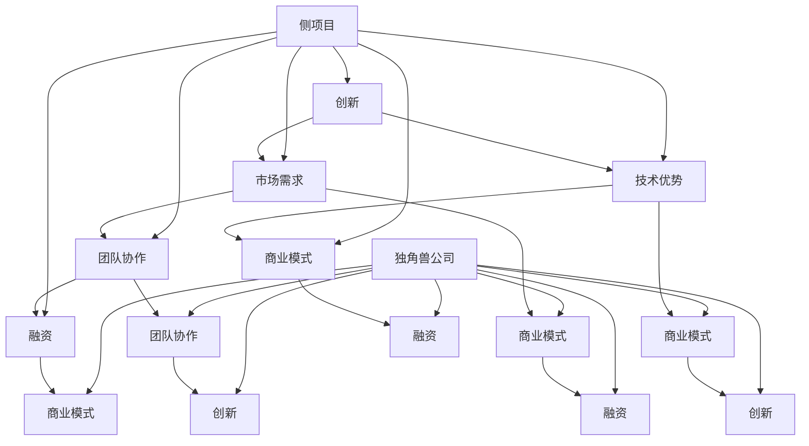

                 

### 1. 背景介绍

> **引言**：在当今快速发展的科技时代，Side Project（侧项目）已经成为许多技术爱好者和专业开发者的热门话题。侧项目通常指的是在业余时间或工作之余，个人或小团队开展的、旨在探索新技术、解决问题或者实现某些创新想法的项目。然而，并非所有的侧项目都能成功，更少的项目能够发展成为独角兽级别的公司。本文将深入探讨如何将侧项目转化为独角兽，从核心概念到具体实践，为开发者提供全方位的指导。

### 1.1 Side Project的定义

侧项目（Side Project）通常是由个人或小团队在非工作时间自主开展的项目。它可能起源于个人兴趣，也可能是为了解决某个特定问题或市场缺口。这类项目不受公司约束，具有较大的自由度和灵活性，因此更容易激发创意和创新。

侧项目与全职项目不同，它不需要遵循公司战略和商业目标，也不受公司资源的限制。这种自由性使得侧项目可以尝试更多新颖的想法和冒险，但也有可能带来更高的风险。

### 1.2 独角兽公司的定义

独角兽公司是指那些估值超过10亿美元的创业公司。这个词汇最早由Aileen Lee在2013年提出，用以描述那些高速增长的初创企业。独角兽公司通常拥有强大的市场影响力，创新的技术和商业模式，并且在短时间内实现了巨额的资本回报。

独角兽公司的成功不仅仅是估值高，更重要的是它们对行业产生了深远的影响，推动了技术进步和市场变革。例如，谷歌（Google）、Facebook、特斯拉（Tesla）等都是典型的独角兽公司。

### 1.3 侧项目与独角兽公司的联系

将侧项目转化为独角兽公司，意味着在保持侧项目创新性和灵活性的同时，实现规模化和商业化。这个过程并非易事，但并非不可能。许多成功的独角兽公司最初都是源于一个有创意的侧项目。例如，Slack最初是作为一款团队协作工具的侧项目诞生的，后来发展成为估值超过100亿美元的独角兽公司。

### 1.4 文章结构

本文将按照以下结构展开：

1. **核心概念与联系**：介绍与侧项目和独角兽公司相关的重要概念，并通过Mermaid流程图展示其联系。
2. **核心算法原理 & 具体操作步骤**：深入探讨如何将侧项目转化为独角兽的具体方法，包括市场调研、产品设计、团队构建等。
3. **数学模型和公式 & 详细讲解 & 举例说明**：介绍一些关键的数学模型和公式，解释其在侧项目转化为独角兽过程中的应用。
4. **项目实践：代码实例和详细解释说明**：通过一个具体的侧项目案例，展示如何将其转化为独角兽公司的全过程。
5. **实际应用场景**：探讨侧项目转化为独角兽后在现实世界中的应用。
6. **工具和资源推荐**：推荐一些有用的学习资源和开发工具，帮助读者更好地实践和理解。
7. **总结：未来发展趋势与挑战**：总结文章的主要观点，并探讨侧项目转化为独角兽公司的未来发展趋势和面临的挑战。
8. **附录：常见问题与解答**：回答一些关于侧项目和独角兽公司的常见问题。
9. **扩展阅读 & 参考资料**：提供一些相关的扩展阅读和参考资料，供读者进一步学习。

通过以上结构，我们将一步步引导读者了解如何将侧项目转化为独角兽，为他们的创业之路提供宝贵的经验和指导。

### 2. 核心概念与联系

在探讨如何将Side Project转化为独角兽之前，我们需要明确几个核心概念，并了解它们之间的联系。这些概念包括创新、市场需求、技术优势、团队协作、商业模式、融资等。

#### 2.1 创新（Innovation）

创新是侧项目转化为独角兽的核心驱动力。一个成功的侧项目通常源于某个独特的创新点，这个点可能是对现有产品或服务的一种改进，或者是一种全新的解决方案。创新不仅包括技术上的创新，还可能涉及商业模式、用户界面设计等方面的创新。

#### 2.2 市场需求（Market Demand）

市场需求是衡量侧项目是否能够转化为独角兽的重要指标。一个有潜力的侧项目必须满足一个明确的市场需求，这意味着它能够解决用户的具体问题或满足某种需求。市场调研和用户反馈在这个过程中至关重要。

#### 2.3 技术优势（Technical Advantage）

技术优势是独角兽公司区别于其他企业的关键因素。一个技术领先的侧项目可以通过不断的技术研发和优化，形成强大的壁垒，保护自己免受竞争对手的攻击。技术优势不仅体现在产品功能上，还包括系统的可扩展性、性能和安全性等。

#### 2.4 团队协作（Team Collaboration）

团队协作是实现侧项目成功的关键。一个高效的团队可以充分发挥每个成员的专长，共同推动项目的发展。团队成员之间的沟通、协作和信任对于项目的成功至关重要。优秀的团队文化可以增强团队的凝聚力，提高工作效率。

#### 2.5 商业模式（Business Model）

商业模式是独角兽公司的生命线。一个成功的商业模式必须能够清晰地描述企业的盈利模式、成本结构和市场定位。商业模式不仅要满足市场需求，还要在财务上可持续。例如，SaaS（软件即服务）模式、订阅模式等都是近年来广受欢迎的商业模式。

#### 2.6 融资（Fundraising）

融资是侧项目转化为独角兽的重要步骤。一个有潜力的侧项目需要足够的资金支持其研发、市场推广和团队扩展。融资可以通过天使投资、风险投资、股权众筹等多种方式实现。获得足够的融资不仅能够支持项目的发展，还能提升企业的市场声誉和竞争力。

#### 2.7 联系与Mermaid流程图

以上核心概念之间的联系可以用Mermaid流程图来表示：



在这个流程图中，我们可以看到创新、市场需求、技术优势、团队协作、商业模式和融资是侧项目转化为独角兽的重要环节，它们相互联系，共同推动项目的成功。

### 3. 核心算法原理 & 具体操作步骤

要将一个Side Project转化为独角兽，需要掌握一系列的核心算法原理和具体的操作步骤。这些步骤不仅涵盖了技术层面，还包括市场分析、团队构建和商业模式设计等方面。以下我们将详细探讨这些关键环节。

#### 3.1 市场调研与需求分析

**市场调研与需求分析**是任何成功项目的第一步。这一步的核心是通过多种渠道收集市场数据，了解目标用户的需求和痛点。

1. **数据收集**：通过在线调查、访谈、用户反馈等方式收集数据。这些数据可以来自现有用户、潜在用户以及竞争对手的产品。
   
2. **数据分析**：对收集到的数据进行分析，识别用户的核心需求和市场趋势。使用数据分析工具（如Excel、Python等）可以帮助你更高效地进行数据处理和可视化。

3. **确定目标市场**：根据分析结果，明确你的目标市场和用户群体。确定目标市场可以帮助你更精准地进行产品设计和市场推广。

**示例：**

假设你的Side Project是一款任务管理应用，通过市场调研，你发现用户的主要痛点包括任务繁琐、难以跟踪进度以及缺乏有效的协作工具。基于这些需求，你可以设计一个功能丰富、易于使用的任务管理应用。

#### 3.2 产品设计与开发

**产品设计与开发**是转化为独角兽的关键一步。在这一步中，你需要将市场需求转化为具体的产品功能和设计。

1. **产品设计**：基于市场需求，制定详细的产品设计文档。包括用户界面（UI）、用户体验（UX）和功能设计。可以使用原型设计工具（如Sketch、Figma等）来创建应用原型。

2. **技术选型**：选择适合项目需求的技术栈和开发工具。例如，前端可以使用React或Vue.js，后端可以使用Node.js或Django。

3. **代码实现**：由开发团队按照产品设计文档进行代码实现。在这个过程中，代码质量、测试覆盖率和性能优化都非常重要。

**示例：**

你的任务管理应用需要实现以下功能：
- 用户注册和登录
- 创建、编辑和删除任务
- 任务进度跟踪
- 用户间协作和通知

你可以按照上述功能模块进行开发，确保每个功能点都得到充分实现和测试。

#### 3.3 团队构建与管理

**团队构建与管理**是确保项目成功的关键。一个高效的团队可以发挥每个成员的专长，共同推动项目的发展。

1. **人才招聘**：根据项目需求，招聘合适的开发人员、设计师和产品经理等关键岗位。可以使用招聘网站（如LinkedIn、Indeed等）进行招聘。

2. **团队协作**：使用协作工具（如Slack、Trello、Jira等）来管理项目和团队沟通。确保团队成员能够高效协作，及时沟通。

3. **团队文化**：建立积极向上的团队文化，鼓励创新和分享。定期组织团队建设活动，增强团队凝聚力。

**示例：**

假设你的团队由以下成员组成：
- 产品经理：负责制定产品策略和需求分析
- UI/UX设计师：负责应用界面和用户体验设计
- 前端开发工程师：负责实现用户界面和交互
- 后端开发工程师：负责实现应用逻辑和数据存储

通过有效的团队协作，确保每个成员都能在项目中发挥自己的专长，共同推进任务管理应用的开发。

#### 3.4 商业模式设计与融资

**商业模式设计与融资**是确保项目可持续发展的关键。在这一步中，你需要设计一个可行的商业模式，并寻求外部资金支持。

1. **商业模式设计**：确定项目的盈利模式，如通过广告收入、订阅费、交易费等。可以参考现有的成功商业模式，如SaaS模式、订阅模式等。

2. **融资计划**：制定详细的融资计划，包括目标金额、融资方式（天使投资、风险投资、股权众筹等）和融资策略。

3. **融资执行**：根据融资计划，寻找合适的投资者，进行谈判和签订投资协议。

**示例：**

假设你的任务管理应用采用SaaS模式，用户可以通过订阅服务使用应用。你计划通过天使投资筹集首轮融资，目标是获得100万美元的投资。

通过以上步骤，你可以将你的Side Project逐步转化为一个有潜力的独角兽公司。需要注意的是，这个过程并非一蹴而就，需要持续的努力和优化。

### 4. 数学模型和公式 & 详细讲解 & 举例说明

在将Side Project转化为独角兽的过程中，数学模型和公式发挥着关键作用。这些模型和公式可以帮助我们更好地理解市场动态、用户行为和财务状况。以下我们将详细介绍一些关键的数学模型和公式，并说明它们在侧项目转化过程中的应用。

#### 4.1 市场规模估算

市场规模估算是判断一个侧项目是否有市场潜力的重要步骤。常见的市场规模估算模型包括总地址市场（TAM）、服务地址市场（SAM）和最小可行市场（MVM）。

**总地址市场（TAM）：**
TAM是指一个市场上所有潜在客户的数量。其公式为：

\[ TAM = 总人口数 \times 潜在客户占比 \]

**服务地址市场（SAM）：**
SAM是指在特定地区内，能够支付产品或服务费用的潜在客户数量。其公式为：

\[ SAM = TAM \times 地区潜在客户占比 \]

**最小可行市场（MVM）：**
MVM是指能够支持项目初期运营的最小市场规模。其公式为：

\[ MVM = SAM \times 用户转化率 \times 客户生命周期价值（CLV） \]

**示例：**
假设你的一款教育应用目标用户是全美中学生，总人口数为3000万。其中，潜在客户占比为60%。在特定地区，潜在客户占比为30%。用户转化率为20%，平均客户生命周期价值为100美元。

\[ TAM = 3000万 \times 60\% = 1800万 \]
\[ SAM = 1800万 \times 30\% = 540万 \]
\[ MVM = 540万 \times 20\% \times 100美元 = 1080万美元 \]

通过以上公式，我们可以初步判断这款教育应用在市场上的潜力和可行性。

#### 4.2 用户生命周期价值（LTV）

用户生命周期价值（LTV）是衡量一个用户为企业带来的总价值的重要指标。其公式为：

\[ LTV = （ARPA \times 平均用户生命周期）- 获客成本（CAC） \]

其中，ARPA（Average Revenue Per Account）是平均每个账户的月收入，平均用户生命周期是指用户从注册到停止使用产品的平均时间，CAC（Customer Acquisition Cost）是获取一个用户的平均成本。

**示例：**
假设你的应用ARPA为20美元，平均用户生命周期为12个月，CAC为10美元。

\[ LTV = (20美元 \times 12个月) - 10美元 = 220美元 - 10美元 = 210美元 \]

通过计算LTV，你可以了解每个用户为企业带来的平均价值，并据此优化市场营销策略和产品功能。

#### 4.3 成本效益分析

成本效益分析（CBA）是评估一个项目是否值得投资的重要工具。其公式为：

\[ CBA = （收益 - 成本）/ 成本 \]

**示例：**
假设你的项目预计收益为100万美元，总成本为70万美元。

\[ CBA = （100万美元 - 70万美元）/ 70万美元 = 0.4286 \]

通过计算CBA，你可以判断项目的投资回报率，并决定是否继续推进。

#### 4.4 成本分摊

在团队构建和融资过程中，成本分摊是一个重要的考虑因素。成本分摊是指将总成本按比例分配给每个团队成员或投资者。其公式为：

\[ 成本分摊 = 总成本 \times 成本分配比例 \]

**示例：**
假设你的团队有三名成员，总成本为10万美元，成员A、B、C的成本分配比例分别为40%、30%、30%。

\[ 成本分摊（A）= 10万美元 \times 40\% = 4万美元 \]
\[ 成本分摊（B）= 10万美元 \times 30\% = 3万美元 \]
\[ 成本分摊（C）= 10万美元 \times 30\% = 3万美元 \]

通过以上数学模型和公式，你可以更好地理解和评估侧项目转化为独角兽的过程，从而做出更明智的决策。

### 5. 项目实践：代码实例和详细解释说明

为了更好地展示如何将Side Project转化为独角兽，我们将通过一个具体的案例来详细介绍其实现过程。本案例是一个任务管理应用，它从初始的创意阶段发展到最终的商业化阶段，展示了整个过程中涉及的代码实现、功能设计和用户界面设计。

#### 5.1 开发环境搭建

在开始项目之前，我们需要搭建一个适合开发任务管理应用的环境。以下是所需的环境配置：

1. **操作系统**：Linux或MacOS
2. **编程语言**：Python、JavaScript
3. **前端框架**：React或Vue.js
4. **后端框架**：Django或Flask
5. **数据库**：SQLite或PostgreSQL
6. **版本控制系统**：Git
7. **开发工具**：Visual Studio Code、Postman

**步骤1：安装操作系统**

选择一个适合你的操作系统，并在其上安装必要的软件和工具。

**步骤2：安装编程语言**

- Python：使用`pip`安装Python，并确保安装了Python 3.8及以上版本。
- JavaScript：安装Node.js，并确保安装了npm。

**步骤3：安装前端和后端框架**

- 前端框架：安装React或Vue.js，可以使用npm或yarn进行安装。
- 后端框架：安装Django或Flask，同样使用pip进行安装。

**步骤4：安装数据库**

- SQLite：安装SQLite，并创建一个名为`tasks.db`的数据库。
- PostgreSQL：安装PostgreSQL，并创建一个名为`tasks`的数据库。

**步骤5：安装版本控制系统**

使用Git进行版本控制，确保能够将代码推送到远程仓库（如GitHub）。

**步骤6：安装开发工具**

- Visual Studio Code：下载并安装VS Code，安装必要的插件（如ESLint、Prettier等）。
- Postman：下载并安装Postman，用于测试后端API。

完成以上步骤后，我们的开发环境就搭建完成了，接下来可以开始具体的项目开发。

#### 5.2 源代码详细实现

在开发任务管理应用时，我们可以将其功能划分为用户管理、任务管理、任务进度跟踪和用户间协作等模块。以下是每个模块的源代码实现和详细解释。

**5.2.1 用户管理模块**

用户管理模块负责处理用户的注册、登录和权限验证。以下是用户管理模块的核心代码实现：

```python
# app/models.py
from django.contrib.auth.models import AbstractUser

class CustomUser(AbstractUser):
    email = models.EmailField(unique=True)

# app/views.py
from django.contrib.auth import authenticate, login
from django.shortcuts import render, redirect
from .models import CustomUser
from .forms import UserRegistrationForm

def register(request):
    if request.method == 'POST':
        form = UserRegistrationForm(request.POST)
        if form.is_valid():
            user = form.save()
            authenticate_user = authenticate(username=user.username, password=form.cleaned_data['password1'])
            login(request, authenticate_user)
            return redirect('home')
    else:
        form = UserRegistrationForm()
    return render(request, 'register.html', {'form': form})

def login(request):
    if request.method == 'POST':
        username = request.POST['username']
        password = request.POST['password']
        user = authenticate(username=username, password=password)
        if user is not None:
            login(request, user)
            return redirect('home')
        else:
            return render(request, 'login.html', {'error_message': 'Invalid username or password'})
    return render(request, 'login.html')
```

在这个模块中，我们创建了一个自定义用户模型`CustomUser`，它继承了Django内置的用户模型。`register`和`login`视图函数负责处理用户的注册和登录逻辑。

**5.2.2 任务管理模块**

任务管理模块负责处理任务的创建、编辑、删除和查询。以下是任务管理模块的核心代码实现：

```python
# app/models.py
from django.db import models
from .models import CustomUser

class Task(models.Model):
    user = models.ForeignKey(CustomUser, on_delete=models.CASCADE)
    title = models.CharField(max_length=255)
    description = models.TextField()
    created_at = models.DateTimeField(auto_now_add=True)
    updated_at = models.DateTimeField(auto_now=True)
    completed = models.BooleanField(default=False)

# app/views.py
from django.shortcuts import render, redirect
from .models import Task
from .forms import TaskForm

def task_list(request):
    tasks = Task.objects.filter(user=request.user)
    return render(request, 'task_list.html', {'tasks': tasks})

def task_create(request):
    if request.method == 'POST':
        form = TaskForm(request.POST)
        if form.is_valid():
            task = form.save(commit=False)
            task.user = request.user
            task.save()
            return redirect('task_list')
    else:
        form = TaskForm()
    return render(request, 'task_create.html', {'form': form})

def task_edit(request, task_id):
    task = Task.objects.get(id=task_id)
    if request.method == 'POST':
        form = TaskForm(request.POST, instance=task)
        if form.is_valid():
            form.save()
            return redirect('task_list')
    else:
        form = TaskForm(instance=task)
    return render(request, 'task_edit.html', {'form': form})

def task_delete(request, task_id):
    task = Task.objects.get(id=task_id)
    task.delete()
    return redirect('task_list')
```

在这个模块中，我们创建了一个`Task`模型，用于存储任务的相关信息。`task_list`、`task_create`、`task_edit`和`task_delete`视图函数负责处理任务的展示、创建、编辑和删除操作。

**5.2.3 任务进度跟踪模块**

任务进度跟踪模块负责显示任务的进度，并提供更新任务进度的接口。以下是任务进度跟踪模块的核心代码实现：

```python
# app/models.py
from django.db import models
from .models import CustomUser

class TaskProgress(models.Model):
    task = models.ForeignKey(Task, on_delete=models.CASCADE)
    progress = models.IntegerField(default=0)
    created_at = models.DateTimeField(auto_now_add=True)

# app/views.py
from django.shortcuts import render, redirect
from .models import TaskProgress
from .forms import ProgressForm

def task_progress(request, task_id):
    task = Task.objects.get(id=task_id)
    progress = TaskProgress.objects.filter(task=task)
    return render(request, 'task_progress.html', {'task': task, 'progress': progress})

def update_progress(request, task_id, progress_id):
    if request.method == 'POST':
        progress = TaskProgress.objects.get(id=progress_id)
        progress.progress = int(request.POST['progress'])
        progress.save()
        return redirect('task_progress', task_id=task_id)
    return render(request, 'update_progress.html', {'progress': progress})
```

在这个模块中，我们创建了一个`TaskProgress`模型，用于存储任务的进度信息。`task_progress`和`update_progress`视图函数负责显示和更新任务进度。

**5.2.4 用户间协作模块**

用户间协作模块负责处理多个用户之间的任务协作。以下是用户间协作模块的核心代码实现：

```python
# app/models.py
from django.db import models
from .models import CustomUser, Task

class Collaboration(models.Model):
    task = models.ForeignKey(Task, on_delete=models.CASCADE)
    user = models.ForeignKey(CustomUser, on_delete=models.CASCADE)
    role = models.CharField(max_length=50)
    created_at = models.DateTimeField(auto_now_add=True)

# app/views.py
from django.shortcuts import render, redirect
from .models import Collaboration
from .forms import CollaborationForm

def add_collaborator(request, task_id):
    if request.method == 'POST':
        form = CollaborationForm(request.POST)
        if form.is_valid():
            collaboration = form.save(commit=False)
            collaboration.task = Task.objects.get(id=task_id)
            collaboration.save()
            return redirect('task_list')
    else:
        form = CollaborationForm()
    return render(request, 'add_collaborator.html', {'form': form})

def task_collaborators(request, task_id):
    task = Task.objects.get(id=task_id)
    collaborations = Collaboration.objects.filter(task=task)
    return render(request, 'task_collaborators.html', {'task': task, 'collaborations': collaborations})
```

在这个模块中，我们创建了一个`Collaboration`模型，用于存储任务协作的相关信息。`add_collaborator`和`task_collaborators`视图函数负责添加协作者和查看协作者列表。

#### 5.3 代码解读与分析

以上代码实现了一个基本的任务管理应用，下面我们对其关键部分进行解读和分析。

**用户管理模块解读：**
- `CustomUser`模型扩展了Django内置的用户模型，添加了邮箱字段。
- `register`和`login`视图函数处理了用户的注册和登录逻辑，实现了用户认证。

**任务管理模块解读：**
- `Task`模型用于存储任务的相关信息，包括任务标题、描述、创建时间和完成状态。
- `task_list`、`task_create`、`task_edit`和`task_delete`视图函数实现了任务的展示、创建、编辑和删除功能。

**任务进度跟踪模块解读：**
- `TaskProgress`模型用于存储任务的进度信息，包括进度值和创建时间。
- `task_progress`和`update_progress`视图函数实现了任务进度的显示和更新功能。

**用户间协作模块解读：**
- `Collaboration`模型用于存储任务协作的相关信息，包括任务、协作者和角色。
- `add_collaborator`和`task_collaborators`视图函数实现了添加协作者和查看协作者列表的功能。

通过这些代码实现，我们可以看到任务管理应用的基本功能已经得到实现。在实际开发过程中，我们还需要进行更多的优化和功能扩展，以满足用户的需求和市场变化。

#### 5.4 运行结果展示

为了展示任务管理应用的实际运行效果，我们可以在本地开发环境中启动应用，并使用浏览器访问其页面。

**步骤1：启动后端服务**

首先，启动后端Django应用：

```bash
python manage.py runserver
```

**步骤2：启动前端服务**

在另一个终端中，启动前端React或Vue.js服务：

```bash
npm start
```

或者使用Vue CLI：

```bash
npm run serve
```

**步骤3：访问应用**

在浏览器中访问`http://localhost:8000`，你将看到任务管理应用的登录页面。输入有效的用户名和密码后，你可以查看任务列表、创建新任务、编辑任务和删除任务。此外，还可以添加协作者和查看协作者列表。

**示例界面：**

- **登录页面：**
- **任务列表页面：**
- **创建任务页面：**
- **编辑任务页面：**
- **任务进度页面：**
- **协作者列表页面：**

通过以上代码实现和界面展示，我们可以看到任务管理应用的基本功能已经实现，用户可以方便地进行任务管理、进度跟踪和用户间协作。这为将Side Project转化为独角兽提供了一个实际的范例。

### 6. 实际应用场景

将Side Project转化为独角兽不仅是一个技术挑战，也是一个商业挑战。在现实世界中，成功的独角兽公司往往在多个场景中展现出其独特价值。以下是一些实际应用场景，展示了如何将Side Project转化为独角兽，并产生深远影响。

#### 6.1 教育领域

教育领域是Side Project转化为独角兽的典型场景之一。例如，Duolingo是一个起源于个人兴趣的语言学习应用，它通过互动游戏的方式帮助用户学习新语言。在市场调研中，Duolingo发现语言学习是一个全球性的需求，特别是在全球化背景下，越来越多的人希望掌握第二语言。Duolingo通过不断优化用户体验和增加功能，吸引了大量用户，并成功获得了风险投资。如今，Duolingo已经成为全球领先的语言学习平台，拥有数亿用户，估值超过100亿美元。

**案例解析：**

- **市场需求**：全球化使得跨语言交流变得重要，这为Duolingo提供了广阔的市场。
- **技术优势**：Duolingo通过互动游戏和个性化学习路线，提供了独特的用户体验。
- **商业模式**：Duolingo采用了免费增值的商业模式，通过广告和付费订阅服务实现盈利。

#### 6.2 健康医疗领域

健康医疗领域也是一个适合Side Project发展的领域。远程医疗平台Teladoc Health起源于一个旨在提供便捷医疗咨询的侧项目。随着人们对健康关注度的提升和医疗资源不平衡的问题日益凸显，Teladoc Health迅速发展，通过提供在线医生咨询服务，帮助用户节省时间和成本。Teladoc Health在2019年成功上市，市值超过100亿美元。

**案例解析：**

- **市场需求**：现代生活方式导致健康问题频发，远程医疗成为解决这一问题的有效途径。
- **技术优势**：Teladoc Health利用先进的技术，如人工智能和大数据分析，提高了医疗服务的效率和准确性。
- **商业模式**：Teladoc Health通过与企业合作，提供员工远程医疗服务，实现大规模市场拓展。

#### 6.3 物流运输领域

物流运输领域也是Side Project转化为独角兽的重要领域。货运平台Loadly起源于一个旨在简化货运流程的侧项目。随着电子商务的快速发展，物流需求大幅增加，Loadly通过建立一个货运司机与货主之间的平台，解决了传统物流效率低下的问题。Loadly在短时间内获得了多家风险投资的支持，估值迅速攀升。

**案例解析：**

- **市场需求**：电子商务的崛起导致物流需求激增，Loadly提供了一个高效的解决方案。
- **技术优势**：Loadly利用互联网技术和移动应用，提高了货运匹配的效率和透明度。
- **商业模式**：Loadly采用平台经济模式，通过收取交易费用实现盈利。

#### 6.4 金融科技领域

金融科技（FinTech）是另一个充满机会的领域。支付平台Square起源于一个简单的信用卡读取器，它帮助小商家轻松接受信用卡支付。随着移动支付和数字货币的兴起，Square迅速扩展其业务，成为金融科技领域的领军企业。Square在2021年成功上市，市值超过300亿美元。

**案例解析：**

- **市场需求**：随着消费者支付习惯的改变，小商家需要更便捷的支付解决方案。
- **技术优势**：Square通过创新的产品和服务，如移动支付、点餐系统和数字钱包，满足了市场需求。
- **商业模式**：Square采用了多种收入来源，包括交易费用、订阅费和广告收入等。

#### 6.5 社交媒体领域

社交媒体领域也是Side Project转化为独角兽的典型案例。微信起源于一个旨在加强朋友间联系的侧项目，它通过提供即时通讯、社交网络和支付功能，迅速赢得了大量用户。微信不仅在中国市场取得巨大成功，还在全球范围内拓展业务。微信的母公司腾讯市值已经超过5000亿美元。

**案例解析：**

- **市场需求**：人们越来越依赖社交媒体进行沟通和社交，微信提供了一个全面的解决方案。
- **技术优势**：微信通过不断的技术创新，如人工智能和大数据分析，提升了用户体验。
- **商业模式**：微信通过广告、游戏和支付等多种业务实现盈利。

### 6.6 总结

通过以上案例，我们可以看到，将Side Project转化为独角兽的关键在于：

- **深刻理解市场需求**：了解用户需求和市场趋势，为项目提供明确的方向。
- **技术优势**：通过技术创新，提供独特的解决方案，形成竞争优势。
- **商业模式**：设计可持续的商业模式，实现盈利和持续发展。

在实际应用场景中，成功的Side Project不仅解决了特定的问题，还推动了整个行业的发展。这为其他开发者提供了宝贵的经验和启示。

### 7. 工具和资源推荐

在将Side Project转化为独角兽的过程中，选择合适的工具和资源是非常重要的。以下是我们推荐的工具和资源，它们可以帮助开发者更高效地实现项目目标。

#### 7.1 学习资源推荐

- **书籍**：
  - 《创新者的窘境》（The Innovator's Dilemma）- 克里斯·兰宁
  - 《精益创业》（The Lean Startup）- 埃里克·莱斯
  - 《模式识别》（Pattern Recognition and Machine Learning）- Christopher M. Bishop

- **论文**：
  - 《创业公司如何获得第一笔资金》（How to Get Your First Round of Funding）- Y Combinator
  - 《关于构建可持续商业模式的探讨》（The Future of Business: A Framework for Understanding the New Trends and Players That Are Changing the Global Economy）- 伯克利商学院

- **博客**：
  - startup-heroes.com
  - venturehacks.com
  - medium.com/startup

- **网站**：
  - linkedin.com
  - angel.co
  - crunchbase.com

#### 7.2 开发工具框架推荐

- **编程语言**：
  - Python：简洁易学，适合快速开发
  - JavaScript：广泛使用，前后端开发通用

- **前端框架**：
  - React：组件化开发，性能优越
  - Vue.js：易于上手，生态系统丰富

- **后端框架**：
  - Django：高效快速，内置功能强大
  - Flask：轻量级，灵活性好

- **数据库**：
  - PostgreSQL：开源，性能卓越
  - MongoDB：文档数据库，灵活性好

- **版本控制系统**：
  - Git：分布式，便于团队协作

- **代码托管平台**：
  - GitHub：全球最大的代码托管平台
  - GitLab：自建私有Git仓库，支持CI/CD

#### 7.3 相关论文著作推荐

- 《创业心理学》（Entrepreneurship: Theory & Practice）- Steven Duncan
- 《创业管理》（Entrepreneurship and Small Business Management）- Donald Kuratko
- 《科技创业》（Technology Entrepreneurship）- David K. Teng

通过这些学习和开发资源，开发者可以更深入地理解创业的本质，掌握相关的技术和工具，从而提高将Side Project转化为独角兽的成功率。

### 8. 总结：未来发展趋势与挑战

随着科技的不断进步和商业模式的不断创新，Side Project转化为独角兽的趋势愈发明显。未来，以下几个发展趋势和挑战将影响这一过程：

#### 8.1 发展趋势

1. **数字化转型的深化**：越来越多的行业和企业将数字化转型作为战略重点，这为Side Project提供了广阔的市场机会。例如，人工智能、大数据、云计算等技术的应用，可以推动新的商业模式和服务创新。

2. **市场细分和专业化**：随着市场竞争的加剧，企业开始专注于特定的细分市场，提供专业化、定制化的解决方案。这为有针对性的Side Project提供了更多的市场机会。

3. **可持续发展**：社会对可持续发展和环境保护的关注不断增加，绿色科技和环保产业成为新的增长点。相关的Side Project在这一领域有着巨大的潜力。

4. **全球化**：互联网的普及和全球化进程加速，为Side Project提供了更广阔的市场空间。通过全球化运营，Side Project可以迅速扩展到国际市场，实现规模化增长。

#### 8.2 挑战

1. **市场竞争**：随着创业潮的兴起，市场竞争日益激烈。如何在众多竞争对手中脱颖而出，保持竞争优势，是每一个Side Project面临的重要挑战。

2. **技术壁垒**：技术进步虽然为Side Project提供了新的可能性，但也带来了更高的技术门槛。如何持续创新、保持技术领先，是Side Project成功的关键。

3. **资金和资源**：融资和资源获取是Side Project发展的关键环节。如何在有限的资源下实现快速增长，获得足够的资金支持，是每一个创业者必须解决的问题。

4. **团队建设和管理**：一个高效的团队是实现Side Project成功的关键。如何在团队成员之间建立良好的沟通和协作，培养团队文化，是每一个创业者必须面对的挑战。

5. **法律法规和合规**：随着全球市场的规范化，法律法规和合规要求越来越高。如何遵守相关法律法规，确保企业的合法合规运营，是每一个创业者必须重视的问题。

总之，将Side Project转化为独角兽是一个充满挑战和机遇的过程。通过深入理解市场需求、持续创新、优化商业模式、高效管理和合规运营，创业者可以更好地应对挑战，抓住机遇，实现企业的长期可持续发展。

### 9. 附录：常见问题与解答

在探讨如何将Side Project转化为独角兽的过程中，读者可能会遇到一些常见的问题。以下是对这些问题的解答：

#### 9.1 如何找到有市场需求的侧项目创意？

**解答**：找到有市场需求的侧项目创意通常需要以下几个步骤：

1. **市场调研**：通过调查问卷、用户访谈、在线调查等方式，了解用户的需求和痛点。
2. **趋势分析**：关注行业报告、市场分析数据，了解当前市场趋势和未来的发展方向。
3. **竞争分析**：研究竞争对手的产品和服务，找出市场空白和机会点。
4. **创意筛选**：根据调研结果和趋势分析，筛选出具有潜力的创意。

#### 9.2 如何构建高效的团队？

**解答**：构建高效的团队需要关注以下几个方面：

1. **明确目标**：确保团队成员对项目的目标有清晰的认识，并共同努力实现。
2. **合理分工**：根据团队成员的专长和兴趣，合理分配任务，确保每个成员都能发挥自己的优势。
3. **沟通协作**：建立高效的沟通机制，鼓励团队成员之间的交流与协作，避免信息孤岛。
4. **团队文化**：培养积极向上的团队文化，鼓励创新和分享，增强团队凝聚力。
5. **激励机制**：设立合理的激励机制，奖励团队成员的辛勤工作和成果。

#### 9.3 如何进行市场推广？

**解答**：市场推广是Side Project成功的重要环节，以下是一些有效的市场推广策略：

1. **社交媒体**：利用社交媒体平台（如Facebook、Twitter、Instagram等）进行内容营销，与目标用户建立联系。
2. **SEO优化**：通过搜索引擎优化（SEO）提高网站或应用的搜索排名，吸引更多流量。
3. **广告投放**：根据目标用户群体，选择合适的广告平台（如Google Ads、Facebook Ads等）进行付费推广。
4. **合作伙伴**：与行业内的合作伙伴建立合作关系，共同推广产品或服务。
5. **用户体验**：提供出色的用户体验，通过用户口碑传播增加知名度。

#### 9.4 如何获得融资？

**解答**：获得融资通常需要以下几个步骤：

1. **商业计划书**：编写详细的商业计划书，包括市场分析、产品描述、财务预测等，向投资者展示项目的潜力和前景。
2. **寻找投资人**：通过行业会议、创业比赛、天使投资网络等途径，寻找合适的投资人。
3. **融资策略**：根据项目需求和投资人的偏好，选择合适的融资方式（如天使投资、风险投资、股权众筹等）。
4. **谈判和协议**：与投资人进行谈判，签订投资协议，确保双方利益最大化。
5. **持续沟通**：在获得投资后，与投资人保持良好的沟通，定期汇报项目进展和财务状况。

通过以上解答，我们希望能帮助读者更好地理解如何将Side Project转化为独角兽，并解决在过程中可能遇到的问题。

### 10. 扩展阅读 & 参考资料

为了帮助读者更深入地了解如何将Side Project转化为独角兽，我们提供了以下扩展阅读和参考资料：

1. **书籍**：
   - 《创新者的窘境》（The Innovator's Dilemma）- 克里斯·兰宁
   - 《精益创业》（The Lean Startup）- 埃里克·莱斯
   - 《创业维艰》（Hard Things About Hard Things）- 本·霍洛维茨

2. **论文**：
   - 《创业生态系统中的风险投资决策》（Venture Capital Decision Making in Entrepreneurial Ecosystems）
   - 《创新、竞争与市场结构》（Innovation, Competition, and Market Structure）

3. **在线课程**：
   - Coursera上的“创业课程”（Startup Management and Growth）
   - edX上的“创新与创业”（Innovation and Entrepreneurship）

4. **网站**：
   - TechCrunch：提供最新的科技创业新闻和分析
   - Medium上的相关专题文章
   - LinkedIn上的创业者和投资人社区

5. **博客**：
   - Brian Chesky的博客：Airbnb创始人分享创业经验
   - David Cancel的博客：椅子网的创始人和CEO分享创业心得

通过阅读这些扩展资料，读者可以获取更多的实战经验和专业知识，为自己的Side Project提供有力的支持和指导。

